<p align="center">
  
</p>

<h1 align="center">🏛️ European Parliament MCP Server</h1>

<p align="center">
  <strong>Model Context Protocol Server for European Parliament Open Data</strong><br>
  <em>Providing AI assistants with structured access to parliamentary datasets and OSINT Intelligence Capabilities</em>
</p>

<table>
  <tr>
    <td width="120" align="center">
      
      <div>
        <a href="https://www.npmjs.com/package/european-parliament-mcp-server">
          
        </a>
      </div>
    </td>
    <td>
      <p><strong>Model Context Protocol Server for European Parliament Open Data</strong> — providing AI assistants with structured access to MEPs, plenary sessions, committees, legislative documents, and parliamentary questions through a secure, type-safe TypeScript implementation.</p>
      <p>MEP influence scoring (5-dimension model), Coalition cohesion & stress analysis, Party defection & anomaly detection, Cross-group comparative analysis, MEP/committee legislative scoring, Pipeline status & bottleneck detection, Committee workload & engagement analysis, MEP attendance patterns & trends, Country delegation voting & composition, Parliament-wide political landscape</p>
      <div>
        <a href="https://github.com/Hack23/European-Parliament-MCP-Server"><strong>📂 Repository</strong></a> •
        <a href="https://hack23.com/european-parliament-mcp-features.html"><strong>✨ Features</strong></a> •
        <a href="https://hack23.com/european-parliament-mcp-docs.html"><strong>📚 Documentation</strong></a> •
        <a href="https://www.npmjs.com/package/european-parliament-mcp-server"><strong>📦 npm</strong></a>
      </div>
    </td>
  </tr>
</table>

[](https://github.com/Hack23/ISMS-PUBLIC)
[](https://www.bestpractices.dev/projects/12067)
[](https://deepwiki.com/Hack23/European-Parliament-MCP-Server)

## 📊 Quality Metrics & Documentation

<p align="center">
  <!-- Test Coverage -->
  <a href="https://hack23.github.io/European-Parliament-MCP-Server/coverage/">
    
  </a>
  
  <!-- Unit Tests -->
  <a href="https://hack23.github.io/European-Parliament-MCP-Server/test-results/">
    
  </a>
  
  <!-- E2E Tests -->
  <a href="https://hack23.github.io/European-Parliament-MCP-Server/e2e-results/">
    
  </a>
  
  <!-- API Documentation -->
  <a href="https://hack23.github.io/European-Parliament-MCP-Server/api/">
    
  </a>
  
  <!-- Documentation Portal -->
  <a href="https://hack23.github.io/European-Parliament-MCP-Server/">
    
  </a>
</p>

## 📋 Overview

The **European Parliament MCP Server** implements the [Model Context Protocol (MCP)](https://spec.modelcontextprotocol.io/) to provide AI assistants, IDEs, and other MCP clients with structured access to European Parliament open datasets. Access information about MEPs, plenary sessions, committees, legislative documents, and parliamentary questions through a secure, type-safe TypeScript/Node.js implementation.

### 🎯 Key Features

- 🔌 **Full MCP Implementation**: 61 tools (7 core + 3 advanced + 15 OSINT + 8 Phase 4 + 14 Phase 5 + 14 feed), 9 Resources, and 7 Prompts
- 🏛️ **Complete EP API v2 Coverage**: All European Parliament Open Data API endpoints covered
- 🕵️ **OSINT Intelligence**: MEP influence scoring, coalition analysis, anomaly detection
- 🔒 **Security First**: ISMS-compliant, GDPR-ready, SLSA Level 3 provenance
- 🚀 **High Performance**: <200ms API responses, intelligent caching, rate limiting
- 📊 **Type Safety**: TypeScript strict mode + Zod runtime validation
- 🧪 **Well-Tested**: 80%+ code coverage, 1130+ unit tests, 23 E2E tests
- 📚 **Complete Documentation**: Architecture, TypeDoc API (HTML + Markdown), security guidelines

---

## 🌍 Hack23 Political Intelligence Ecosystem

This MCP server is part of **[Hack23's](https://hack23.com/)** mission to **disrupt journalism with AI-generated news coverage and real-time analysis of democratic governments** — increasing transparency and accountability through open-source intelligence.

### 🎯 Vision: AI-Powered Democratic Transparency

Hack23 builds **open-source intelligence platforms** that enable citizens, journalists, and researchers to monitor democratic institutions in real-time. By combining MCP servers, AI analysis, and open parliamentary data, we create automated intelligence products that were previously only available to well-funded lobbying organizations.

> *"Democratizing access to political intelligence — what used to require a team of analysts can now be done by any citizen with an AI assistant."*

### 🔗 Hack23 Projects

### 🇪🇺 EU Parliament Monitor

<table>
  <tr>
    <td width="120" align="center">
      
      <div>
        <a href="https://github.com/Hack23/euparliamentmonitor">
          
        </a>
      </div>
    </td>
    <td>
      <p><strong>European Parliament Intelligence Platform</strong> — an automated multi-language news platform that monitors EU Parliament activities with 14-language support, covering plenary sessions, committee reports, propositions, and breaking news.</p>
      <div>
        <a href="https://scorecard.dev/viewer/?uri=github.com/Hack23/euparliamentmonitor">
          
        </a>
        <a href="https://github.com/Hack23/euparliamentmonitor/attestations">
          
        </a>
        <a href="https://github.com/Hack23/euparliamentmonitor/license">
          
        </a>
      </div>
      <div>
        <a href="https://euparliamentmonitor.com"><strong>EU Parliament Monitor - News</strong></a> •
        <a href="https://github.com/Hack23/euparliamentmonitor"><strong>📂 Repository</strong></a> •
        <a href="https://hack23.com/euparliamentmonitor-features.html"><strong>✨ Features</strong></a> •
        <a href="https://hack23.com/euparliamentmonitor-docs.html"><strong>📚 Documentation</strong></a>
      </div>
    </td>
  </tr>
</table>

[](https://scorecard.dev/viewer/?uri=github.com/Hack23/euparliamentmonitor)
[](https://github.com/Hack23/euparliamentmonitor/attestations)
[](https://github.com/Hack23/euparliamentmonitor/actions/workflows/news-generation.yml)
[](https://github.com/Hack23/euparliamentmonitor/actions/workflows/test-and-report.yml)
[](https://github.com/Hack23/euparliamentmonitor/blob/main/LICENSE)
[](https://github.com/Hack23/ISMS-PUBLIC)
[](https://deepwiki.com/Hack23/euparliamentmonitor)


### 🗳️ Riksdagsmonitor

<table>
  <tr>
    <td width="120" align="center">
      
      <div>
        <a href="https://riksdagsmonitor.com">
          
        </a>
      </div>
    </td>
    <td>
      <p><strong>Swedish Parliament Intelligence Platform</strong> monitoring political activity in Sweden's Riksdag with systematic transparency through real-time analysis and 50+ years of historical data (1971-2024).</p>
      <div>
        <a href="https://scorecard.dev/viewer/?uri=github.com/Hack23/riksdagsmonitor">
          
        </a>
        <a href="https://github.com/Hack23/riksdagsmonitor/actions/workflows/quality-checks.yml">
          
        </a>
        <a href="https://github.com/Hack23/riksdagsmonitor/license">
          
        </a>
      </div>
      <div>
        <a href="https://riksdagsmonitor.com"><strong>🌐 Riksdags Monitor</strong></a> •
        <a href="https://riksdagsmonitor.com/news/"><strong>🌐 Riksdags Monitor News</strong></a> •
        <a href="https://github.com/Hack23/riksdagsmonitor"><strong>📂 Repository</strong></a> •
        <a href="https://hack23.com/riksdagsmonitor-features.html"><strong>✨ Features</strong></a> •
        <a href="https://hack23.com/riksdagsmonitor-docs.html"><strong>📚 Documentation</strong></a>
      </div>
    </td>
  </tr>
</table>

[](https://scorecard.dev/viewer/?uri=github.com/Hack23/riksdagsmonitor)
[](https://github.com/Hack23/riksdagsmonitor/actions/workflows/quality-checks.yml)
[](https://github.com/Hack23/riksdagsmonitor/actions/workflows/dependency-review.yml)
[](https://github.com/Hack23/riksdagsmonitor/blob/main/LICENSE)
[](https://github.com/Hack23/ISMS-PUBLIC)
[](https://deepwiki.com/Hack23/riksdagsmonitor)


### 🔍 Citizen Intelligence Agency

<table>
  <tr>
    <td width="120" align="center">
      
      <div>
        <a href="https://github.com/Hack23/cia">
          
        </a>
      </div>
    </td>
    <td>
      <p><strong>Political transparency platform</strong> monitoring Swedish political activity with data-driven insights, analytics, dashboard visualizations, and accountability metrics.</p>
      <div>
        <a href="https://bestpractices.coreinfrastructure.org/projects/770">
          
        </a>
        <a href="[https://slsa.dev/spec/v1.0/levels](https://github.com/Hack23/cia/attestations)">
          
        </a>
        <a href="https://sonarcloud.io/summary/new_code?id=Hack23_cia">
          
        </a>
      </div>
      <div>
        <a href="https://github.com/Hack23/cia"><strong>📂 Repository</strong></a> •
        <a href="https://hack23.com/cia-features.html"><strong>✨ Features</strong></a> •
        <a href="https://hack23.com/cia-docs.html"><strong>📚 Documentation</strong></a>
      </div>
    </td>
  </tr>
</table>

[](https://bestpractices.coreinfrastructure.org/projects/770)
[](https://scorecard.dev/viewer/?uri=github.com/Hack23/cia)
[](https://slsa.dev/spec/v1.0/levels)
[](https://github.com/Hack23/cia/actions/workflows/release.yml)
[](https://github.com/Hack23/cia/actions/workflows/scorecards.yml)
[](https://sonarcloud.io/summary/new_code?id=Hack23_cia)
[](https://sonarcloud.io/summary/new_code?id=Hack23_cia)
[](https://deepwiki.com/Hack23/cia)


---


<p align="center">
  <!-- Security Architecture -->
  <a href="./SECURITY_ARCHITECTURE.md">
    
  </a>
  
  <!-- Architecture Diagrams -->
  <a href="./ARCHITECTURE_DIAGRAMS.md">
    
  </a>
  
  <!-- Workflows Documentation -->
  <a href="./.github/WORKFLOWS.md">
    
  </a>
  
  <!-- Performance Guide -->
  <a href="./PERFORMANCE_GUIDE.md">
    
  </a>
</p>


## 🔐 Security & Compliance

<p align="center">
  <!-- OpenSSF Scorecard -->
  <a href="https://securityscorecards.dev/viewer/?uri=github.com/Hack23/European-Parliament-MCP-Server">
    
  </a>
  
  <!-- SLSA Level 3 -->
  <a href="https://github.com/Hack23/European-Parliament-MCP-Server/attestations/">
    
  </a>
  
  <!-- SBOM -->
  <a href="https://hack23.github.io/European-Parliament-MCP-Server/SBOM.md">
    
  </a>
  
  <!-- SBOM Quality -->
  <a href="https://hack23.github.io/European-Parliament-MCP-Server/SBOM.md">
    
  </a>
  
  <!-- Attestations -->
  <a href="https://hack23.github.io/European-Parliament-MCP-Server/ATTESTATIONS.md">
    
  </a>
</p>

<p align="center">
  <!-- ISMS Compliance -->
  <a href="https://github.com/Hack23/ISMS-PUBLIC">
    
  </a>
  <a href="https://github.com/Hack23/ISMS-PUBLIC">
    
  </a>
<a href="https://app.fossa.com/projects/git%2Bgithub.com%2FHack23%2FEuropean-Parliament-MCP-Server?ref=badge_shield" alt="FOSSA Status"></a>
  <a href="https://github.com/Hack23/ISMS-PUBLIC">
    
  </a>
  <a href="https://gdpr.eu/">
    
  </a>
</p>

---

## 🚀 Quick Start

### Prerequisites

- Node.js 24.x or higher
- npm 10.x or higher
- Git

### Installation

#### Option 1: Install from npm (Recommended)

```bash
# Install the package globally
npm install -g european-parliament-mcp-server

# Or install as a dependency in your project
npm install european-parliament-mcp-server
```

#### Option 2: Install from source

```bash
# Clone the repository
git clone https://github.com/Hack23/European-Parliament-MCP-Server.git
cd European-Parliament-MCP-Server

# Install dependencies
npm install

# Build the project
npm run build

# Run tests
npm test
```

### Usage with MCP Client

#### Claude Desktop Configuration (npm install)

Add to your `claude_desktop_config.json`:

```json
{
  "mcpServers": {
    "european-parliament": {
      "command": "npx",
      "args": ["european-parliament-mcp-server"],
      "env": {
        "EP_API_KEY": "your-api-key-if-needed"
      }
    }
  }
}
```

#### Claude Desktop Configuration (source install)

Add to your `claude_desktop_config.json`:

```json
{
  "mcpServers": {
    "european-parliament": {
      "command": "node",
      "args": ["/path/to/European-Parliament-MCP-Server/dist/index.js"],
      "env": {
        "EP_API_KEY": "your-api-key-if-needed"
      }
    }
  }
}
```

#### VS Code Extension

Configure in `.vscode/mcp.json`:

```json
{
  "servers": {
    "european-parliament": {
      "type": "stdio",
      "command": "node",
      "args": ["./dist/index.js"]
    }
  }
}
```

#### Cursor IDE Configuration

Add to `~/.cursor/mcp.json` (or project-level `.cursor/mcp.json`):

```json
{
  "mcpServers": {
    "european-parliament": {
      "command": "npx",
      "args": ["european-parliament-mcp-server"],
      "env": {}
    }
  }
}
```

---

## 📚 Documentation

### 🌐 Documentation Portal

**[📖 Complete Documentation Site](https://hack23.github.io/European-Parliament-MCP-Server/)** - Live documentation portal with:
- 📖 **[API Reference (HTML)](https://hack23.github.io/European-Parliament-MCP-Server/api/)** - TypeDoc generated API documentation with search, hierarchy navigation, and full type information
- 📖 **[API Reference (Markdown)](https://hack23.github.io/European-Parliament-MCP-Server/api-markdown/)** - SEO-friendly Markdown API documentation
- 📊 **[Coverage Reports](https://hack23.github.io/European-Parliament-MCP-Server/coverage/)** - Test coverage analysis
- ✅ **[Test Reports](https://hack23.github.io/European-Parliament-MCP-Server/test-results/)** - Unit and E2E test results
- 🔐 **Build Attestations** - SLSA Level 3 provenance
- 📦 **SBOM** - Software Bill of Materials
- 🗺️ **[Sitemap](https://hack23.github.io/European-Parliament-MCP-Server/api/sitemap.xml)** - Auto-generated sitemap for search engines

> 💡 **Note**: Documentation is automatically generated and committed with each release via `npm run docs:build`

### Generated API Documentation

The API documentation is generated using [TypeDoc](https://typedoc.org/) with the following plugins:

| Plugin | Purpose |
|--------|---------|
| **typedoc** | Core HTML documentation generator |
| **typedoc-plugin-markdown** | Generates SEO-friendly Markdown alongside HTML |
| **typedoc-plugin-mdn-links** | Links TypeScript built-in types to MDN documentation |
| **typedoc-plugin-zod** | Renders Zod schema definitions as readable type documentation |

Generate documentation locally:
```bash
npm run docs          # HTML API docs → docs/api/
npm run docs:md       # Markdown API docs → docs/api-markdown/
npm run docs:build    # Full documentation build (HTML + MD + coverage + test reports)
```

### Core Documentation

- [**API Usage Guide**](./API_USAGE_GUIDE.md) - Complete tool documentation with examples
- [**Architecture Diagrams**](./ARCHITECTURE_DIAGRAMS.md) - C4 model diagrams and data flows
- [**Troubleshooting Guide**](#troubleshooting) - Common issues and solutions
- [**Developer Guide**](./DEVELOPER_GUIDE.md) - Development workflow and contributing
- [**Deployment Guide**](./DEPLOYMENT_GUIDE.md) - Claude Desktop, VS Code, Docker setup
- [**Performance Guide**](./PERFORMANCE_GUIDE.md) - Optimization strategies
- [**Documentation as Code Guide**](./DOCUMENTATION_AS_CODE.md) - How documentation is generated

### Additional Documentation

- [**ARCHITECTURE.md**](./ARCHITECTURE.md) - Complete architecture and design documentation
- [**SECURITY.md**](./SECURITY.md) - Security policy and vulnerability disclosure
- [**SECURITY_HEADERS.md**](./SECURITY_HEADERS.md) - API security headers implementation
- [**docs/SBOM.md**](./docs/SBOM.md) - Software Bill of Materials documentation
- [**CONTRIBUTING.md**](./CONTRIBUTING.md) - Contribution guidelines
- [**CODE_OF_CONDUCT.md**](./CODE_OF_CONDUCT.md) - Community code of conduct
- [**.github/copilot-instructions.md**](./.github/copilot-instructions.md) - Development guidelines for GitHub Copilot
- [**.github/agents/README.md**](./.github/agents/README.md) - Custom GitHub Copilot agents
- [**.github/skills/README.md**](./.github/skills/README.md) - Reusable skill patterns

---

## 🏗️ Architecture Overview

```mermaid
graph TB
    Client[MCP Client<br/>Claude / VS Code / Cursor] -->|MCP Protocol stdio| Server[EP MCP Server<br/>TypeScript/Node.js]

    subgraph "MCP Server (src/)"
        direction TB
        Tools[🔧 46 Tools<br/>getMEPs · analyzeCoalition<br/>assessMepInfluence · …]
        Resources[📦 9 Resources<br/>ep://meps/{id}<br/>ep://procedures/{id} · …]
        Prompts[💬 7 Prompts<br/>mep_briefing<br/>coalition_analysis · …]
    end

    Server --> Tools
    Server --> Resources
    Server --> Prompts

    subgraph "Infrastructure"
        Cache[LRU Cache<br/>500 entries · 15 min TTL]
        RateLimiter[Rate Limiter<br/>100 req / 15 min]
        AuditLog[Audit Logger<br/>GDPR Article 30]
    end

    Tools --> EPClient[EuropeanParliamentClient<br/>Facade → 8 sub-clients]
    Resources --> EPClient
    EPClient --> Cache
    EPClient --> RateLimiter
    EPClient --> AuditLog
    EPClient -->|HTTPS/TLS 1.3| EPAPI[European Parliament<br/>Open Data API v2<br/>data.europarl.europa.eu]

    style Server fill:#4CAF50,stroke:#2E7D32,color:#fff
    style EPClient fill:#2196F3,stroke:#1565C0,color:#fff
    style EPAPI fill:#9C27B0,stroke:#6A1B9A,color:#fff
    style Cache fill:#FF9800,stroke:#E65100,color:#fff
    style RateLimiter fill:#F44336,stroke:#B71C1C,color:#fff
    style AuditLog fill:#607D8B,stroke:#37474F,color:#fff
```

**Data flow:** MCP client sends a tool call → server validates input (Zod) → EP client
checks cache → on miss, fetches from EP API (rate-limited) → response cached and returned
as structured JSON. All personal data access is audit-logged per GDPR Article 30.

---

## 🔌 MCP Tools (61 Total)

**61 tools** organized by capability — OSINT intelligence first, then analytical, data access, feed endpoints, and reference tools. Every tool includes Zod input validation, caching, and rate limiting.

### 🕵️ OSINT Intelligence Tools (15)

| Tool | Description | Key Parameters | Output |
|------|-------------|----------------|--------|
| [`correlate_intelligence`](./API_USAGE_GUIDE.md#tool-correlate_intelligence) | Cross-tool OSINT correlation engine — fuses influence, anomaly, coalition, and network signals into unified intelligence alerts | toolOutputs, correlationMode | Correlated alerts with severity & confidence |
| [`assess_mep_influence`](./API_USAGE_GUIDE.md#tool-assess_mep_influence) | MEP influence scoring (5-dimension model) | mepId (required), dateFrom, dateTo | Influence scorecard |
| [`detect_voting_anomalies`](./API_USAGE_GUIDE.md#tool-detect_voting_anomalies) | Party defection & anomaly detection | mepId, politicalGroup, dateFrom | Anomaly report |
| [`analyze_coalition_dynamics`](./API_USAGE_GUIDE.md#tool-analyze_coalition_dynamics) | Coalition cohesion & stress analysis | politicalGroups, dateFrom, dateTo | Coalition metrics |
| [`early_warning_system`](./API_USAGE_GUIDE.md#tool-early_warning_system) | Detect emerging political shifts & coalition fractures | sensitivity, focusArea | Warnings with severity levels & stability score |
| [`comparative_intelligence`](./API_USAGE_GUIDE.md#tool-comparative_intelligence) | Cross-reference 2–10 MEP activities across dimensions | mepIds (required), dimensions | Ranked profiles, correlation matrix, cluster analysis |
| [`network_analysis`](./API_USAGE_GUIDE.md#tool-network_analysis) | MEP relationship network via committee co-membership | mepId, analysisType, depth | Network map with centrality scores |
| [`sentiment_tracker`](./API_USAGE_GUIDE.md#tool-sentiment_tracker) | Political group institutional-positioning scores | groupId, timeframe | Positioning scores & polarization index |
| [`generate_political_landscape`](./API_USAGE_GUIDE.md#tool-generate_political_landscape) | Parliament-wide political landscape | dateFrom, dateTo | Landscape overview |
| [`compare_political_groups`](./API_USAGE_GUIDE.md#tool-compare_political_groups) | Cross-group comparative analysis | groups (required), metrics, dateFrom | Comparison matrix |
| [`analyze_legislative_effectiveness`](./API_USAGE_GUIDE.md#tool-analyze_legislative_effectiveness) | MEP/committee legislative scoring | subjectId (required), subjectType, dateFrom | Effectiveness score |
| [`monitor_legislative_pipeline`](./API_USAGE_GUIDE.md#tool-monitor_legislative_pipeline) | Pipeline status & bottleneck detection | committeeId, status, dateFrom | Pipeline status |
| [`analyze_committee_activity`](./API_USAGE_GUIDE.md#tool-analyze_committee_activity) | Committee workload & engagement analysis | committeeId (required), dateFrom, dateTo | Activity report |
| [`track_mep_attendance`](./API_USAGE_GUIDE.md#tool-track_mep_attendance) | MEP attendance patterns & trends | mepId, country, groupId, dateFrom, dateTo, limit | Attendance report |
| [`analyze_country_delegation`](./API_USAGE_GUIDE.md#tool-analyze_country_delegation) | Country delegation voting & composition | country (required), dateFrom, dateTo | Delegation analysis |

### 📊 Advanced Analysis Tools (4)

| Tool | Description | Key Parameters | Output |
|------|-------------|----------------|--------|
| [`get_all_generated_stats`](./API_USAGE_GUIDE.md#tool-get_all_generated_stats) | Precomputed EP activity statistics (2004-2025) with rankings, predictions, political landscape, and [30 OSINT-derived intelligence metrics](./EP_POLITICAL_LANDSCAPE.md) including 3-axis political compass | yearFrom, yearTo, category, includePredictions | Statistics object |
| [`analyze_voting_patterns`](./API_USAGE_GUIDE.md#tool-analyze_voting_patterns) | Analyze MEP voting behavior | mepId (required), dateFrom, compareWithGroup | Analysis object |
| [`track_legislation`](./API_USAGE_GUIDE.md#tool-track_legislation) | Track legislative procedure | procedureId (required) | Procedure object |
| [`generate_report`](./API_USAGE_GUIDE.md#tool-generate_report) | Generate analytical reports | reportType (required), subjectId, dateFrom | Report object |

### 👤 MEP Tools (7)

| Tool | Description | Key Parameters | EP API Endpoint |
|------|-------------|----------------|-----------------|
| [`get_meps`](./API_USAGE_GUIDE.md#tool-get_meps) | List MEPs with filters | country, group, committee, limit | `GET /meps` |
| [`get_mep_details`](./API_USAGE_GUIDE.md#tool-get_mep_details) | Detailed MEP information | id (required) | `GET /meps/{id}` |
| [`get_current_meps`](./API_USAGE_GUIDE.md#tool-get_current_meps) | Currently active MEPs with active mandates | limit, offset | `GET /meps/show-current` |
| [`get_incoming_meps`](./API_USAGE_GUIDE.md#tool-get_incoming_meps) | Newly arriving MEPs for current term | limit, offset | `GET /meps/show-incoming` |
| [`get_outgoing_meps`](./API_USAGE_GUIDE.md#tool-get_outgoing_meps) | Departing MEPs for current term | limit, offset | `GET /meps/show-outgoing` |
| [`get_homonym_meps`](./API_USAGE_GUIDE.md#tool-get_homonym_meps) | MEPs with identical names (disambiguation) | limit, offset | `GET /meps/show-homonyms` |
| [`get_mep_declarations`](./API_USAGE_GUIDE.md#tool-get_mep_declarations) | MEP financial interest declarations | docId, year, limit | `GET /meps-declarations`, `GET /meps-declarations/{id}` |

### 🏛️ Plenary & Meeting Tools (9)

| Tool | Description | Key Parameters | EP API Endpoint |
|------|-------------|----------------|-----------------|
| [`get_plenary_sessions`](./API_USAGE_GUIDE.md#tool-get_plenary_sessions) | List plenary sessions/meetings, or single by eventId | dateFrom, dateTo, eventId, limit | `GET /meetings`, `GET /meetings/{id}` |
| [`get_voting_records`](./API_USAGE_GUIDE.md#tool-get_voting_records) | Retrieve aggregate voting records (no per‑MEP positions) | sessionId, topic, dateFrom | `GET /meetings/{id}/vote-results` |
| [`get_speeches`](./API_USAGE_GUIDE.md#tool-get_speeches) | Plenary speeches and debate contributions | speechId, dateFrom, dateTo, limit | `GET /speeches`, `GET /speeches/{id}` |
| [`get_events`](./API_USAGE_GUIDE.md#tool-get_events) | EP events (hearings, conferences, seminars) | eventId, dateFrom, dateTo, limit | `GET /events`, `GET /events/{id}` |
| [`get_meeting_activities`](./API_USAGE_GUIDE.md#tool-get_meeting_activities) | Activities linked to a plenary sitting | sittingId (required), limit | `GET /meetings/{id}/activities` |
| [`get_meeting_decisions`](./API_USAGE_GUIDE.md#tool-get_meeting_decisions) | Decisions made in a plenary sitting | sittingId (required), limit | `GET /meetings/{id}/decisions` |
| [`get_meeting_foreseen_activities`](./API_USAGE_GUIDE.md#tool-get_meeting_foreseen_activities) | Planned agenda items for upcoming meetings | sittingId (required), limit | `GET /meetings/{id}/foreseen-activities` |
| [`get_meeting_plenary_session_documents`](./API_USAGE_GUIDE.md#tool-get_meeting_plenary_session_documents) | Plenary session documents linked to a specific sitting | sittingId (required), limit, offset | `GET /meetings/{id}/plenary-session-documents` |
| [`get_meeting_plenary_session_document_items`](./API_USAGE_GUIDE.md#tool-get_meeting_plenary_session_document_items) | Agenda item documents for a specific plenary sitting | sittingId (required), limit, offset | `GET /meetings/{id}/plenary-session-document-items` |

### 🏢 Committee Tools (2)

| Tool | Description | Key Parameters | EP API Endpoint |
|------|-------------|----------------|-----------------|
| [`get_committee_info`](./API_USAGE_GUIDE.md#tool-get_committee_info) | Committee/corporate body info, or all current bodies | id, abbreviation, showCurrent | `GET /corporate-bodies`, `GET /corporate-bodies/show-current` |
| [`get_committee_documents`](./API_USAGE_GUIDE.md#tool-get_committee_documents) | Committee documents and drafts | docId, year, limit | `GET /committee-documents`, `GET /committee-documents/{id}` |

### 📄 Document Tools (7)

| Tool | Description | Key Parameters | EP API Endpoint |
|------|-------------|----------------|-----------------|
| [`search_documents`](./API_USAGE_GUIDE.md#tool-search_documents) | Search documents or get single by docId | keyword, docId, documentType, dateFrom | `GET /documents`, `GET /documents/{id}` |
| [`get_adopted_texts`](./API_USAGE_GUIDE.md#tool-get_adopted_texts) | Adopted legislative texts and resolutions | docId, year, limit | `GET /adopted-texts`, `GET /adopted-texts/{id}` |
| [`get_plenary_documents`](./API_USAGE_GUIDE.md#tool-get_plenary_documents) | Plenary legislative documents | docId, year, limit | `GET /plenary-documents`, `GET /plenary-documents/{id}` |
| [`get_plenary_session_documents`](./API_USAGE_GUIDE.md#tool-get_plenary_session_documents) | Session agendas, minutes, voting lists | docId, limit | `GET /plenary-session-documents`, `GET /plenary-session-documents/{id}` |
| [`get_plenary_session_document_items`](./API_USAGE_GUIDE.md#tool-get_plenary_session_document_items) | Individual items within session documents | limit, offset | `GET /plenary-session-documents-items` |
| [`get_external_documents`](./API_USAGE_GUIDE.md#tool-get_external_documents) | Non-EP documents (Council, Commission) | docId, year, limit | `GET /external-documents`, `GET /external-documents/{id}` |
| [`get_parliamentary_questions`](./API_USAGE_GUIDE.md#tool-get_parliamentary_questions) | Parliamentary Q&A, or single by docId | type, author, topic, docId | `GET /parliamentary-questions`, `GET /parliamentary-questions/{id}` |

### ⚖️ Legislative Procedure Tools (4)

| Tool | Description | Key Parameters | EP API Endpoint |
|------|-------------|----------------|-----------------|
| [`get_procedures`](./API_USAGE_GUIDE.md#tool-get_procedures) | Legislative procedures, or single by processId | processId, year, limit | `GET /procedures`, `GET /procedures/{id}` |
| [`get_procedure_events`](./API_USAGE_GUIDE.md#tool-get_procedure_events) | Timeline events for a legislative procedure | processId (required), limit | `GET /procedures/{id}/events` |
| [`get_procedure_event_by_id`](./API_USAGE_GUIDE.md#tool-get_procedure_event_by_id) | Specific event linked to a legislative procedure | processId (required), eventId (required) | `GET /procedures/{id}/events/{event-id}` |
| [`get_controlled_vocabularies`](./API_USAGE_GUIDE.md#tool-get_controlled_vocabularies) | Standardized classification terms | vocId, limit | `GET /controlled-vocabularies`, `GET /controlled-vocabularies/{id}` |

### 📡 Feed Tools (13)

Real-time change feeds for monitoring recently updated data across all EP API categories. Each feed supports configurable timeframes (today, one-day, one-week, one-month, custom).

| Tool | Description | Key Parameters | EP API Endpoint |
|------|-------------|----------------|-----------------|
| [`get_meps_feed`](./API_USAGE_GUIDE.md#tool-get_meps_feed) | Recently updated MEPs | timeframe, startDate | `GET /meps/feed` |
| [`get_events_feed`](./API_USAGE_GUIDE.md#tool-get_events_feed) | Recently updated events | timeframe, startDate, activityType | `GET /events/feed` |
| [`get_procedures_feed`](./API_USAGE_GUIDE.md#tool-get_procedures_feed) | Recently updated procedures | timeframe, startDate, processType | `GET /procedures/feed` |
| [`get_adopted_texts_feed`](./API_USAGE_GUIDE.md#tool-get_adopted_texts_feed) | Recently updated adopted texts | timeframe, startDate, workType | `GET /adopted-texts/feed` |
| [`get_mep_declarations_feed`](./API_USAGE_GUIDE.md#tool-get_mep_declarations_feed) | Recently updated MEP declarations | timeframe, startDate, workType | `GET /meps-declarations/feed` |
| [`get_documents_feed`](./API_USAGE_GUIDE.md#tool-get_documents_feed) | Recently updated documents | timeframe, startDate | `GET /documents/feed` |
| [`get_plenary_documents_feed`](./API_USAGE_GUIDE.md#tool-get_plenary_documents_feed) | Recently updated plenary documents | timeframe, startDate | `GET /plenary-documents/feed` |
| [`get_committee_documents_feed`](./API_USAGE_GUIDE.md#tool-get_committee_documents_feed) | Recently updated committee documents | timeframe, startDate | `GET /committee-documents/feed` |
| [`get_plenary_session_documents_feed`](./API_USAGE_GUIDE.md#tool-get_plenary_session_documents_feed) | Recently updated plenary session documents | timeframe, startDate | `GET /plenary-session-documents/feed` |
| [`get_external_documents_feed`](./API_USAGE_GUIDE.md#tool-get_external_documents_feed) | Recently updated external documents | timeframe, startDate, workType | `GET /external-documents/feed` |
| [`get_parliamentary_questions_feed`](./API_USAGE_GUIDE.md#tool-get_parliamentary_questions_feed) | Recently updated parliamentary questions | timeframe, startDate | `GET /parliamentary-questions/feed` |
| [`get_corporate_bodies_feed`](./API_USAGE_GUIDE.md#tool-get_corporate_bodies_feed) | Recently updated corporate bodies | timeframe, startDate | `GET /corporate-bodies/feed` |
| [`get_controlled_vocabularies_feed`](./API_USAGE_GUIDE.md#tool-get_controlled_vocabularies_feed) | Recently updated controlled vocabularies | timeframe, startDate | `GET /controlled-vocabularies/feed` |

📖 **[Complete TypeDoc API documentation →](https://hack23.github.io/European-Parliament-MCP-Server/api/)** · **[Markdown API docs →](https://hack23.github.io/European-Parliament-MCP-Server/api-markdown/)**

### Common Use Cases

**Research a specific MEP**:
```
1. Find MEP: get_meps → {country: "SE"}
2. Get details: get_mep_details → {id: "MEP-123"}
3. Analyze voting: analyze_voting_patterns → {mepId: "MEP-123"}
4. Generate report: generate_report → {reportType: "MEP_ACTIVITY", subjectId: "MEP-123"}
```

**Track legislation**:
```
1. Search documents: search_documents → {keywords: "climate change"}
2. Track procedure: track_legislation → {procedureId: "2024/0001(COD)"}
3. Get voting records: get_voting_records → {topic: "climate"}
```

**Committee analysis**:
```
1. Get committee: get_committee_info → {abbreviation: "ENVI"}
2. List members: get_meps → {committee: "ENVI"}
3. Generate report: generate_report → {reportType: "COMMITTEE_PERFORMANCE", subjectId: "COMM-ENVI"}
```

**OSINT Intelligence analysis**:
```
1. Score MEP influence: assess_mep_influence → {mepId: "MEP-123"}
2. Detect anomalies: detect_voting_anomalies → {mepId: "MEP-123"}
3. Analyze coalitions: analyze_coalition_dynamics → {politicalGroups: ["EPP", "S&D"]}
4. Compare groups: compare_political_groups → {groups: ["EPP", "S&D", "Renew"]}
5. Pipeline status: monitor_legislative_pipeline → {committeeId: "ENVI"}
6. Country delegation: analyze_country_delegation → {country: "SE"}
7. Political landscape: generate_political_landscape → {}
```

🎯 **[More use cases and examples →](./API_USAGE_GUIDE.md#common-use-cases)**

### 📝 MCP Prompts

Pre-built intelligence analysis prompt templates:

| Prompt | Description | Arguments |
|--------|-------------|-----------|
| `mep_briefing` | Comprehensive MEP intelligence briefing | mepId (required), period? |
| `coalition_analysis` | Coalition dynamics and voting bloc analysis | policyArea?, period? |
| `legislative_tracking` | Legislative procedure tracking report | procedureId?, committee? |
| `political_group_comparison` | Multi-dimensional group comparison | groups? |
| `committee_activity_report` | Committee workload and engagement | committeeId (required) |
| `voting_pattern_analysis` | Voting pattern trend detection | topic?, mepId? |
| `country_delegation_analysis` | Country delegation composition and activity | country (required), period? |

### 📦 MCP Resources

Direct data access via EP resource URIs:

| Resource URI | Description |
|-------------|-------------|
| `ep://meps` | List of all current MEPs |
| `ep://meps/{mepId}` | Individual MEP profile |
| `ep://committees/{committeeId}` | Committee information |
| `ep://plenary-sessions` | Recent plenary sessions |
| `ep://votes/{sessionId}` | Voting records for a session |
| `ep://political-groups` | Political group listing |
| `ep://procedures/{procedureId}` | Legislative procedure details |
| `ep://plenary/{plenaryId}` | Single plenary session details |
| `ep://documents/{documentId}` | Legislative document details |

---

## 🗺️ Global Political MCP Servers & OSINT Coverage

The European Parliament MCP Server is part of a growing ecosystem of **political and government open data MCP servers** enabling AI-powered OSINT analysis of democratic institutions worldwide. Below is the most comprehensive directory of political and government MCP servers available.

### 🏛️ Parliamentary & Legislative MCP Servers

| Country | Server | Data Source | Coverage |
|---------|--------|-------------|----------|
| 🇪🇺 **European Union** | [**European Parliament MCP Server**](https://github.com/Hack23/European-Parliament-MCP-Server) | data.europarl.europa.eu | MEPs, votes, legislation, committees, questions — **47 tools** (15 OSINT) |
| 🇺🇸 **United States** | [Congress.gov API MCP Server](https://github.com/bsmi021/mcp-congress_gov_server) | congress.gov | Bills, members, votes, committees (TypeScript, v3 API) |
| 🇺🇸 **United States** | [CongressMCP](https://github.com/amurshak/congressMCP) | congress.gov | Real-time Congress data — bills, votes, members |
| 🇺🇸 **United States** | [Congress.gov MCP](https://github.com/AshwinSundar/congress_gov_mcp) | congress.gov | Unofficial Congress.gov API access |
| 🇬🇧 **United Kingdom** | [Parliament MCP](https://github.com/i-dot-ai/parliament-mcp) | parliament.uk | Hansard, members, debates, divisions |
| 🇸🇪 **Sweden** | [Riksdag & Regering MCP](https://github.com/isakskogstad/Riksdag-Regering-MCP) | riksdagen.se | Swedish Parliament & Government data (used by [riksdagsmonitor.com](https://riksdagsmonitor.com/)) |
| 🇳🇱 **Netherlands** | [OpenTK MCP](https://github.com/r-huijts/opentk-mcp) | tweedekamer.nl | Dutch Parliament (Tweede Kamer) documents |
| 🇵🇱 **Poland** | [Parliament of Poland MCP](https://github.com/pkolawa/parliament-poland-mcp-server) | sejm.gov.pl | Members, votes, committees |
| 🇵🇱 **Poland** | [Sejm MCP](https://github.com/janisz/sejm-mcp) | api.sejm.gov.pl | Parliament data + legislation |
| 🇮🇱 **Israel** | [Knesset MCP Server](https://github.com/zohar/knesset-mcp) | knesset.gov.il | Knesset parliament API |
| 🇧🇷 **Brazil** | [Senado BR MCP](https://mcpservers.org/servers/sidneybissoli/senado-br-mcp) | senado.leg.br | Federal Senate — members, proposals, votes |

### 📊 Government Open Data MCP Servers

| Country | Server | Data Source | Coverage |
|---------|--------|-------------|----------|
| 🇺🇸 **United States** | [USA Spending MCP](https://github.com/thsmale/usaspending-mcp-server) | usaspending.gov | Federal spending data |
| 🇺🇸 **United States** | [Open Census MCP](https://mcpservers.org/servers/brockwebb/open-census-mcp-server) | census.gov | Demographics & statistics (natural language) |
| 🇺🇸 **United States** | [Data.gov MCP Server](https://github.com/melaodoidao/datagov-mcp-server) | data.gov | Federal dataset catalog |
| 🇺🇸 **United States** | [CMS Data.gov MCP](https://github.com/clarifyhealth/cms-datagov-mcp-server) | data.cms.gov | Healthcare data — search/filter/pagination |
| 🇺🇸 **United States** | [SEC EDGAR MCP](https://github.com/stefanoamorelli/sec-edgar-mcp) | sec.gov | SEC filings — annual reports, insider data |
| 🇺🇸 **United States** | [NPS MCP](https://github.com/amysatterlee/nps_mcp) | nps.gov | National Park Service API |
| 🇸🇪 **Sweden** | [SCB MCP Server](https://mcpservers.org/servers/isakskogstad/scb-mcp) | scb.se | Official Swedish statistics |
| 🇸🇪 **Sweden** | [Skolverket MCP](https://mcpservers.org/servers/ksaklfszf921/skolverket-mcp) | skolverket.se | Swedish National Agency for Education |
| 🇫🇷 **France** | [data.gouv.fr MCP](https://github.com/datagouv/datagouv-mcp) | data.gouv.fr | National open data platform |
| 🇫🇷 **France** | [Data Gouv MCP Server](https://mcpservers.org/servers/csonigo/datagouv-mcp-server) | data.gouv.fr | Companies & organizations search |
| 🇬🇧 **United Kingdom** | [Planning Data MCP](https://github.com/alizoli/planningdatagovuk-api) | planning.data.gov.uk | Planning & land use data |
| 🇬🇧 **United Kingdom** | [Property Prices MCP](https://github.com/joemclo/property-prices-mcp) | landregistry.data.gov.uk | Housing price search |
| 🇳🇱 **Netherlands** | [CBS Open Data MCP](https://github.com/dstotijn/mcp-cbs-cijfers-open-data) | cbs.nl | Dutch statistics bureau |
| 🇮🇱 **Israel** | [Data.gov.il MCP](https://github.com/DavidOsherProceed/data-gov-il-mcp) | data.gov.il | National CKAN data portal |
| 🇮🇱 **Israel** | [DataGov Israel MCP](https://github.com/aviveldan/datagov-mcp) | data.gov.il | Alternative implementation + visualization |
| 🇮🇱 **Israel** | [Israel Statistics MCP](https://github.com/reuvenaor/israel-statistics-mcp) | cbs.gov.il | CPI & economic time series |
| 🇮🇱 **Israel** | [BudgetKey MCP](https://github.com/OpenBudget/budgetkey-mcp) | open-budget.org.il | State budget, contracts, grants |
| 🇹🇷 **Turkey** | [Mevzuat MCP](https://mcpservers.org/servers/MCP-Mirror/saidsurucu_mevzuat-mcp) | mevzuat.gov.tr | Legislation system — search/retrieve laws |
| 🇭🇰 **Hong Kong** | [HK Data.gov.hk MCP](https://github.com/hkopenai/hk-datagovhk-mcp-server) | data.gov.hk | Hong Kong open data portal |
| 🇲🇾 **Malaysia** | [Data.gov.my MCP](https://github.com/manfye/data-dosm-mcp-nodejs) | data.gov.my | National data portal |
| 🇮🇳 **India** | [Data.gov.in MCP](https://github.com/adwait-ai/mcp_data_gov_in) | data.gov.in | Semantic search + dataset access |
| 🇸🇬 **Singapore** | [Gahmen MCP Server](https://github.com/aniruddha-adhikary/gahmen-mcp) | data.gov.sg | Government datasets + CKAN search |
| 🇸🇬 **Singapore** | [Singapore Data MCPs](https://github.com/prezgamer/Singapore-Data-MCPs) | data.gov.sg | Multiple servers (parking, health, datasets) |
| 🇦🇺 **Australia** | [ABS MCP Server](https://github.com/seansoreilly/mcp-server-abs) | abs.gov.au | Bureau of Statistics (SDMX-ML) |

### 🌍 Multi-Portal & Generic MCP Servers

| Scope | Server | Platform | Coverage |
|-------|--------|----------|----------|
| 🌐 **Global (CKAN)** | [CKAN MCP Server](https://github.com/ondata/ckan-mcp-server) | CKAN portals | Generic server for any CKAN-based open data portal |
| 🌐 **Global (Socrata)** | [OpenGov MCP Server](https://github.com/srobbin/opengov-mcp-server) | Socrata portals | City/county/state/federal Socrata-powered portals |

### 🕵️ OSINT Intelligence Capabilities Comparison

| Capability | 🇪🇺 EU Parliament MCP | 🇺🇸 Congress.gov MCP | 🇬🇧 UK Parliament MCP | 🇸🇪 Riksdag MCP |
|------------|----------------------|---------------------|----------------------|-----------------|
| Member profiling | ✅ 5-dimension influence model | ✅ Basic profiles | ✅ Basic profiles | ✅ Basic profiles |
| Voting analysis | ✅ Anomaly detection + patterns | ✅ Roll call votes | ✅ Division records | ✅ Vote records |
| Coalition dynamics | ✅ Cohesion & stress analysis | ❌ | ❌ | ❌ |
| Committee intelligence | ✅ Workload & engagement metrics | ✅ Committee data | ✅ Committee data | ❌ |
| Legislative pipeline | ✅ Bottleneck detection + forecasting | ✅ Bill tracking | ✅ Bill tracking | ✅ Bill tracking |
| Country delegation analysis | ✅ National cohesion metrics | N/A | N/A | N/A |
| Political landscape | ✅ Parliament-wide situational awareness | ❌ | ❌ | ❌ |
| Attendance tracking | ✅ Trend detection + engagement scoring | ❌ | ❌ | ❌ |
| GDPR compliance | ✅ Privacy-first design | N/A | N/A | ✅ |
| MCP prompts & resources | ✅ 7 prompts + 9 resources | ❌ | ❌ | ❌ |
| Tool count | **47 tools** | ~5 tools | ~5 tools | ~4 tools |

> 💡 **The European Parliament MCP Server offers the most comprehensive OSINT intelligence capabilities** of any political MCP server, with **47 specialized tools** including advanced analytics like coalition stress analysis, voting anomaly detection, cross-tool intelligence correlation, political landscape generation, and precomputed longitudinal statistics. It is the only political MCP server with built-in MCP prompts, resources, and a 5-dimension MEP influence scoring model.

---

## 🏛️ European Parliament Datasets

### Complete EP API v2 Coverage

All 55 [European Parliament Open Data API v2](https://data.europarl.europa.eu/en/developer-corner/opendata-api) endpoints are fully covered — 41 core data endpoints, 13 feed endpoints, and 1 optional endpoint (`/procedures/{id}/events/{event-id}`):

| Category | Endpoints | MCP Tools |
|----------|-----------|-----------|
| **MEPs** | `/meps`, `/meps/{id}`, `/meps/show-current`, `/meps/show-incoming`, `/meps/show-outgoing`, `/meps/show-homonyms` | `get_meps`, `get_mep_details`, `get_current_meps`, `get_incoming_meps`, `get_outgoing_meps`, `get_homonym_meps` |
| **MEP Documents** | `/meps-declarations`, `/meps-declarations/{id}` | `get_mep_declarations` |
| **Corporate Bodies** | `/corporate-bodies`, `/corporate-bodies/{id}`, `/corporate-bodies/show-current` | `get_committee_info` |
| **Events** | `/events`, `/events/{id}` | `get_events` |
| **Meetings** | `/meetings`, `/meetings/{id}`, `/meetings/{id}/activities`, `/meetings/{id}/decisions`, `/meetings/{id}/foreseen-activities`, `/meetings/{id}/vote-results`, `/meetings/{id}/plenary-session-documents`, `/meetings/{id}/plenary-session-document-items` | `get_plenary_sessions`, `get_meeting_activities`, `get_meeting_decisions`, `get_meeting_foreseen_activities`, `get_voting_records`, `get_meeting_plenary_session_documents`, `get_meeting_plenary_session_document_items` |
| **Speeches** | `/speeches`, `/speeches/{id}` | `get_speeches` |
| **Procedures** | `/procedures`, `/procedures/{id}`, `/procedures/{id}/events`, `/procedures/{id}/events/{event-id}` | `get_procedures`, `get_procedure_events`, `get_procedure_event_by_id` |
| **Documents** | `/documents`, `/documents/{id}`, `/adopted-texts`, `/adopted-texts/{id}`, `/committee-documents`, `/committee-documents/{id}`, `/plenary-documents`, `/plenary-documents/{id}`, `/plenary-session-documents`, `/plenary-session-documents/{id}`, `/plenary-session-documents-items` | `search_documents`, `get_adopted_texts`, `get_committee_documents`, `get_plenary_documents`, `get_plenary_session_documents`, `get_plenary_session_document_items` |
| **Questions** | `/parliamentary-questions`, `/parliamentary-questions/{id}` | `get_parliamentary_questions` |
| **External Documents** | `/external-documents`, `/external-documents/{id}` | `get_external_documents` |
| **Vocabularies** | `/controlled-vocabularies`, `/controlled-vocabularies/{id}` | `get_controlled_vocabularies` |
| **Feed Endpoints** | `/meps/feed`, `/events/feed`, `/procedures/feed`, `/adopted-texts/feed`, `/meps-declarations/feed`, `/documents/feed`, `/plenary-documents/feed`, `/committee-documents/feed`, `/plenary-session-documents/feed`, `/external-documents/feed`, `/parliamentary-questions/feed`, `/corporate-bodies/feed`, `/controlled-vocabularies/feed` | `get_meps_feed`, `get_events_feed`, `get_procedures_feed`, `get_adopted_texts_feed`, `get_mep_declarations_feed`, `get_documents_feed`, `get_plenary_documents_feed`, `get_committee_documents_feed`, `get_plenary_session_documents_feed`, `get_external_documents_feed`, `get_parliamentary_questions_feed`, `get_corporate_bodies_feed`, `get_controlled_vocabularies_feed` |

### Data Source

- **API**: https://data.europarl.europa.eu/api/v2/
- **Documentation**: https://data.europarl.europa.eu/en/developer-corner
- **Format**: JSON-LD, RDF/XML, Turtle
- **License**: European Parliament Open Data License

---

## 🔒 Security & Compliance

### ISMS Compliance

This project aligns with [Hack23 AB's Information Security Management System (ISMS)](https://github.com/Hack23/ISMS-PUBLIC):

- ✅ **ISO 27001:2022** - Information security management
- ✅ **NIST CSF 2.0** - Cybersecurity framework
- ✅ **CIS Controls v8.1** - Security best practices
- ✅ **GDPR** - EU data protection compliance

### Security Features

- 🔐 **Authentication**: API key + OAuth 2.0 (planned)
- 🛡️ **Input Validation**: Zod schemas for all inputs
- ⚡ **Rate Limiting**: 100 requests per 15 minutes per IP
- 🔒 **Security Headers**: CSP, HSTS, X-Frame-Options, etc.
- 📝 **Audit Logging**: All data access logged
- 🔍 **Vulnerability Scanning**: CodeQL, Dependabot, OSSF Scorecard

### Supply Chain Security

This project achieves **SLSA Level 3** compliance:
- ✅ **Build Provenance** - Cryptographic proof of build integrity
- ✅ **Attestations** - All artifacts cryptographically signed
- ✅ **Verification** - `gh attestation verify <artifact> --owner Hack23 --repo European-Parliament-MCP-Server`
- ✅ **npm Provenance** - Published with provenance for package integrity
- ✅ **SBOM** - SPDX-format Software Bill of Materials
- ✅ **Dependency Review** - Automated vulnerability scanning
- ✅ **License Compliance** - Only MIT, Apache-2.0, BSD, ISC allowed

See [**ATTESTATIONS.md**](docs/ATTESTATIONS.md) for verification instructions and security benefits.

---

## 🧪 Development

### Setup Development Environment

```bash
# Install dependencies
npm install

# Run in development mode with auto-reload
npm run dev

# Type checking
npm run type-check

# Linting
npm run lint

# Format code
npm run format

# Run tests
npm test

# Run tests with coverage
npm run test:coverage
```

### Project Structure

```
European-Parliament-MCP-Server/
├── src/                      # Source code
│   ├── server.ts            # MCP server entry point
│   ├── tools/               # MCP tool implementations
│   ├── resources/           # MCP resource handlers
│   ├── prompts/             # MCP prompt templates
│   ├── clients/             # European Parliament API client
│   ├── schemas/             # Zod validation schemas
│   ├── types/               # TypeScript type definitions
│   └── utils/               # Utility functions
├── tests/                   # Test files
├── .github/                 # GitHub configuration
│   ├── agents/             # Custom Copilot agents
│   ├── skills/             # Reusable skill patterns
│   └── workflows/          # CI/CD workflows
└── docs/                    # Additional documentation
```

### Documentation

#### 📚 Developer Documentation

- **[JSDoc Coverage Report](./JSDOC_COVERAGE_REPORT.md)** - Detailed analysis of JSDoc documentation coverage across all source files
- **[JSDoc Quick Reference](./docs/JSDOC_QUICK_REFERENCE.md)** - Quick reference guide for writing comprehensive JSDoc comments
- **[JSDoc Coverage Summary](./JSDOC_COVERAGE_SUMMARY.md)** - Executive summary of documentation status and priorities
- **[JSDoc Coverage Visualization](./docs/JSDOC_COVERAGE_VISUALIZATION.md)** - Visual representation of documentation coverage with charts and graphs

#### 🏗️ Architecture & Design

- **[Architecture Documentation](./ARCHITECTURE.md)** - System architecture and design patterns
- **[Data Model](./DATA_MODEL.md)** - Data structures and type definitions
- **[API Usage Guide](./API_USAGE_GUIDE.md)** - Guide for using the MCP server API
- **[EP Political Landscape](./EP_POLITICAL_LANDSCAPE.md)** - 📊 Comprehensive Mermaid visualization of all EP statistics, political compass, coalition dynamics, and OSINT intelligence metrics

#### 🧪 Testing & Quality

- **[Test Coverage Report](./TEST_COVERAGE_REPORT.md)** - Test coverage statistics and analysis
- **[Developer Guide](./DEVELOPER_GUIDE.md)** - Development setup and guidelines
- **[Performance Guide](./PERFORMANCE_GUIDE.md)** - Performance optimization strategies

#### 🔒 Security & Compliance

- **[Security Policy](./SECURITY.md)** - Vulnerability reporting and security practices
- **[Security Architecture](./SECURITY_ARCHITECTURE.md)** - Security controls and architecture
- **[Secure Development Policy](./Secure_Development_Policy.md)** - Secure coding standards
- **[Open Source Policy](./Open_Source_Policy.md)** - Open source compliance guidelines

#### 📦 Deployment & Operations

- **[Deployment Guide](./DEPLOYMENT_GUIDE.md)** - Production deployment instructions
- **[Troubleshooting Guide](#troubleshooting)** - Common issues and solutions
- **[NPM Publishing Guide](./NPM_PUBLISHING.md)** - Package publishing workflow

### Testing

```bash
# Unit tests
npm test

# Integration tests (requires EP_INTEGRATION_TESTS=true)
EP_INTEGRATION_TESTS=true npm run test:integration

# Integration tests with fixture capture
EP_INTEGRATION_TESTS=true EP_SAVE_FIXTURES=true npm run test:integration

# E2E tests
npm run test:e2e

# Coverage report
npm run test:coverage

# Watch mode
npm run test:watch
```

**Integration Testing**: When `EP_INTEGRATION_TESTS=true`, all 47 MCP tools are tested against the real European Parliament API endpoints. All tools return real data — no mock or placeholder data is used. Live API tests are disabled by default to respect rate limits (100 req/15min). See [**INTEGRATION_TESTING.md**](INTEGRATION_TESTING.md) for the complete guide.

### Code Quality

```bash
# Lint code
npm run lint

# Fix linting issues
npm run lint:fix

# Check for unused dependencies
npm run knip

# Security audit
npm audit

# License compliance
npm run test:licenses
```

---

## 🛠️ Troubleshooting

### API Rate Limits

**Symptom:** Requests return `429 Too Many Requests` or slow down unexpectedly.

The European Parliament Open Data API enforces rate limits. The MCP server
automatically applies a token-bucket rate limiter (100 requests per 15 minutes).

**Solutions:**
```bash
# Reduce concurrency — don't call multiple tools in parallel bursts
# Use the built-in cache — repeated identical requests are served from LRU cache
# Add a delay between bulk operations:
# e.g., call get_meps, wait 1 s, then call get_mep_details

# Check current cache stats (if using programmatic access):
const stats = epClient.getCacheStats();
console.log(`Cache hit rate: ${stats.hitRate}%`);
```

### Connectivity Issues

**Symptom:** `ECONNREFUSED`, `ETIMEDOUT`, or `Network error` from tools.

**Solutions:**
1. Verify EP API reachability: `curl https://data.europarl.europa.eu/api/v2/meps?limit=1`
2. Check firewall / proxy settings — the server connects outbound to `data.europarl.europa.eu:443`
3. Enable retry (default: on) — the client retries transient failures with exponential backoff
4. Review API status at https://data.europarl.europa.eu/en/developer-corner

### Installation Problems

**Symptom:** `npm install` fails, or `node dist/index.js` throws import errors.

**Solutions:**
```bash
# Ensure Node.js 24+ is installed
node --version   # Must be >= 24.0.0

# Clear npm cache and reinstall
npm cache clean --force
rm -rf node_modules package-lock.json
npm install

# Rebuild TypeScript output
npm run build

# Verify the package starts correctly
node dist/index.js --version
```

**Symptom:** MCP client shows "server not found" or no tools listed.

**Solutions:**
- Confirm the `command` path in your MCP client config points to the correct binary
- For `npx`: ensure `european-parliament-mcp-server` is in your npm registry
- For `node`: use the absolute path to `dist/index.js`
- Check MCP client logs — most clients (Claude Desktop, VS Code) log connection errors

### Integration Test Failures

**Symptom:** Integration tests fail with `EP_INTEGRATION_TESTS must be set`.

Integration tests are disabled by default to respect API rate limits.

```bash
# Enable integration tests explicitly:
EP_INTEGRATION_TESTS=true npm run test:integration

# Capture fresh fixtures for offline testing:
EP_INTEGRATION_TESTS=true EP_SAVE_FIXTURES=true npm run test:integration
```

### TypeScript / Build Errors

**Symptom:** `tsc` reports type errors after pulling latest changes.

```bash
# Regenerate all types
npm run type-check

# Check for mismatched Node types
npm install  # updates @types/node

# Ensure tsconfig is correct
cat tsconfig.json
```

### Getting Help

- 📋 [Open an Issue](https://github.com/Hack23/European-Parliament-MCP-Server/issues)
- 💬 [Start a Discussion](https://github.com/Hack23/European-Parliament-MCP-Server/discussions)
- 📖 [Full Troubleshooting Guide](#troubleshooting)
- 🤖 [Ask DeepWiki](https://deepwiki.com/Hack23/European-Parliament-MCP-Server)

---

## 🤝 Contributing

We welcome contributions! Please see [CONTRIBUTING.md](./CONTRIBUTING.md) for details on:

- Code of conduct
- Development process
- Pull request guidelines
- Coding standards
- Testing requirements

### GitHub Copilot Integration

This repository includes custom agents and skills for GitHub Copilot:

- **Agents**: Specialized AI assistants for development, testing, security, and documentation
- **Skills**: Reusable patterns for MCP development, security, testing, and performance
- See [.github/agents/README.md](./.github/agents/README.md) and [.github/skills/README.md](./.github/skills/README.md)

### Release Process

We follow [Semantic Versioning](https://semver.org/) and use automated release management:

**Version Types:**
- **Major** (x.0.0): Breaking changes (e.g., API incompatible changes)
- **Minor** (0.x.0): New features, backward compatible (e.g., new MCP tools)
- **Patch** (0.0.x): Bug fixes, security updates, backward compatible

**Automated Release Workflow:**
1. Develop features in feature branches
2. Create PR with descriptive title using [Conventional Commits](https://www.conventionalcommits.org/)
3. Labels are automatically applied based on changed files
4. After merge to main, release draft is automatically created
5. Review and publish release (creates git tag automatically)

**Release Notes Include:**
- Categorized changes by feature area
- Security badges (OpenSSF Scorecard, SLSA)
- Technology stack and compatibility
- ISMS compliance status
- Full changelog link

For detailed workflow documentation, see [.github/WORKFLOWS.md](./.github/WORKFLOWS.md).

---

## 🤖 AI-Disrupted Intelligence & Future Roadmap

> **📰 News is dead. Long live intelligence.**
>
> While the world's newsrooms race to replace journalists with GPT-powered headline factories — churning out *"10 Things the EU Did Today"* listicles at the speed of hallucination — we took a different path. Instead of automating the news *ticker*, we built a **political intelligence platform** that actually *understands* what the European Parliament does. Disrupted news generation produces noise; **deep political intelligence** produces signal. Any chatbot can summarize a press release. It takes **47 MCP tools**, **15 OSINT analyzers**, and a **5-dimension influence model** to tell you *which MEP quietly brokered the amendment that changed the directive that reshaped an industry* — three months before the newspapers notice.
>
> **This is not a news bot. This is parliamentary intelligence infrastructure.**

### 🏗️ Agentic Architecture Overview

This repository is powered by a comprehensive AI-augmented development ecosystem — **14 specialized Copilot agents**, **41 reusable skills**, and **11 CI/CD workflows** — working in concert to maintain, analyze, and evolve the most advanced political MCP server in existence.

```mermaid
%%{init: {'theme': 'base', 'themeVariables': {'primaryColor': '#6366F1', 'primaryTextColor': '#fff', 'primaryBorderColor': '#4F46E5', 'lineColor': '#94A3B8', 'secondaryColor': '#F59E0B', 'tertiaryColor': '#10B981', 'background': '#0F172A', 'mainBkg': '#1E293B', 'nodeBorder': '#475569'}}}%%
graph TB
    subgraph AGENTS["🤖 14 Copilot Agents"]
        style AGENTS fill:#1E1B4B,stroke:#6366F1,color:#E0E7FF
        A1["🎯 product-task-agent"]
        A2["📝 documentation-writer"]
        A3["🔧 frontend-specialist"]
        A4["🔌 api-integration-engineer"]
        A5["⚙️ mcp-developer"]
        A6["🛡️ security-specialist"]
        A7["🧪 test-engineer"]
        A8["🕵️ intelligence-operative"]
        A9["🏛️ european-parliament-specialist"]
        A10["📊 performance-optimizer"]
        A11["📋 isms-compliance-auditor"]
        A12["💼 business-development-specialist"]
        A13["📣 marketing-specialist"]
        A14["🧩 zod-schema-architect"]
    end

    subgraph SKILLS["🎯 41 Reusable Skills"]
        style SKILLS fill:#1C1917,stroke:#F59E0B,color:#FEF3C7
        S1["🔧 10 Core Dev Skills"]
        S2["🛡️ 6 Security Skills"]
        S3["⚙️ 4 DevOps Skills"]
        S4["🔍 10 Intel & OSINT Skills"]
        S5["💼 2 Business Skills"]
        S6["🤖 3 AI & MCP Gateway Skills"]
        S7["📋 6 ISMS Compliance Skills"]
    end

    subgraph WORKFLOWS["⚙️ 11 CI/CD Workflows"]
        style WORKFLOWS fill:#022C22,stroke:#10B981,color:#D1FAE5
        W1["🧪 test-and-report"]
        W2["🔍 codeql"]
        W3["📦 release"]
        W4["🌐 integration-tests"]
        W5["📋 sbom-generation"]
        W6["🔒 slsa-provenance"]
        W7["📊 scorecard"]
        W8["🔎 dependency-review"]
        W9["🏷️ labeler"]
        W10["⚙️ setup-labels"]
        W11["🤖 copilot-setup-steps"]
    end

    subgraph TOOLS["🔌 47 MCP Tools"]
        style TOOLS fill:#172554,stroke:#3B82F6,color:#DBEAFE
        T1["🕵️ 15 OSINT Intelligence"]
        T2["📊 4 Advanced Analysis"]
        T3["👤 7 MEP Data"]
        T4["🏛️ 9 Plenary & Meeting"]
        T5["📄 12 Document, Committee & Legislative"]
    end

    AGENTS --> SKILLS
    AGENTS --> TOOLS
    SKILLS --> WORKFLOWS
    WORKFLOWS --> TOOLS
```



### 📅 Future Advanced Roadmap: 2026–2037

> From **47 MCP tools** today to a **transformative democratic intelligence platform** serving all 195 parliamentary systems — powered by the relentless march of AI model generations.

#### Phase 5: Advanced Intelligence (2026–2027)


#### Phase 6: AGI Era & Transformative Democracy (2034–2037)

> *Scenario: AGI or near-AGI systems become available through Amazon Bedrock or successor platforms*

```mermaid
%%{init: {'theme': 'base', 'themeVariables': {'primaryColor': '#A855F7', 'primaryTextColor': '#fff', 'lineColor': '#C084FC', 'secondaryColor': '#F59E0B', 'tertiaryColor': '#EC4899'}}}%%
mindmap
  root((🌐 AGI Era\n2034–2037))
    🤖 AGI-Enhanced Intelligence
      Autonomous real-time analysis
        All 195 parliamentary systems
        Every legislative session globally
        Sub-second pattern detection
      Universal language support
        All UN official languages
        Regional dialects & legal terminology
        Real-time translation & summarization
    📊 Predictive Governance
      Policy impact prediction
        Before legislation is proposed
        Economic modeling integration
        Social impact forecasting
      Democratic health monitoring
        Voter engagement indices
        Institutional resilience scores
        Democratic backsliding alerts
    ⚖️ Ethical AI Governance
      Human oversight maintained
        Regardless of AI capability level
        Escalation protocols for critical decisions
        Transparency reports on AI judgments
      Bias detection & correction
        Multi-cultural fairness auditing
        Political neutrality verification
        Algorithmic accountability logs
    🛡️ Democratic Safeguards
      Anti-weaponization architecture
        Platform prevents manipulation
        Disinformation detection layer
        Foreign influence monitoring
      Sovereignty protection
        EU data sovereignty enforced
        Quantum-resistant encryption
        Air-gapped government deployments
```



#### 🧬 AI Model Evolution Strategy

> **Assumptions:** Anthropic Opus minor updates every ~2.3 months through 2037 (or until successor paradigm). Major version upgrades annually. Competitors (OpenAI, Google, Meta, EU sovereign AI) evaluated at each major release. Architecture must accommodate potential paradigm shifts (quantum AI, neuromorphic computing).


#### 📊 Workflow Count & Capability Projection

> **Baseline:** 11 GitHub Actions workflows today. Projected growth includes AI-generated workflows, scheduled intelligence pipelines, multi-environment deployment chains, and automated OSINT processing — see [FUTURE_WORKFLOWS.md](./FUTURE_WORKFLOWS.md) for detailed expansion plans.

| Year | Total Workflows | AI Model | Key Capability | Tools |
|:----:|:---------------:|:--------:|:---------------|:-----:|
| **2026** | 44–50 | Opus 4.6–4.9 | 🤖 Agentic news generation, AI-authored briefings | 46→55 |
| **2027** | 50–55 | Opus 5.x | 📈 Predictive analytics, coalition forecasting | 55→65 |
| **2028** | 55–65 | Opus 6.x | 🎥 Multi-modal content, video/speech analysis | 65→80 |
| **2029** | 65–75 | Opus 7.x | ⚡ Autonomous pipeline, self-optimizing CI/CD | 80→90 |
| **2030** | 75–85 | Opus 8.x | 🧠 Near-expert analysis, domain specialist AI | 90→100 |
| **2031–2033** | 85–100 | Opus 9–10.x / Pre-AGI | 🌍 Global coverage, all EU national parliaments | 100→120 |
| **2034–2037** | 100–120+ | AGI / Post-AGI | 🌐 Transformative platform, 195 parliaments | 120→200+ |

#### 🔮 Strategic Considerations

| Pillar | Description | Safeguard |
|:------:|:------------|:----------|
| 🤖 **Autonomous Analysis** | AGI-powered real-time political intelligence across all 195 parliamentary systems | Human analyst review for high-stakes assessments |
| 🌐 **Universal Language** | Every UN language supported natively with legal terminology precision | Multi-cultural fairness auditing at every release |
| 📊 **Predictive Governance** | Policy impact prediction *before* legislation is proposed | Confidence intervals and uncertainty quantification mandatory |
| ⚖️ **Ethical AI Governance** | Human oversight maintained regardless of AI capability level | ISMS-aligned escalation protocols, transparency reports |
| 🛡️ **Democratic Safeguards** | Platform architecture prevents weaponization or manipulation | Quarterly red-team exercises, sovereignty-first data policies |

#### 🗺️ Extended Roadmap Visualization

```mermaid
%%{init: {'theme': 'base', 'themeVariables': {'primaryColor': '#6366F1', 'primaryTextColor': '#fff', 'lineColor': '#94A3B8'}}}%%
graph LR
    subgraph Y2026["2026"]
        style Y2026 fill:#1E40AF,stroke:#3B82F6,color:#DBEAFE
        Y26["🤖 Opus 4.6–4.9\n44–50 workflows\nAgentic news gen"]
    end
    subgraph Y2027["2027"]
        style Y2027 fill:#1E3A8A,stroke:#3B82F6,color:#DBEAFE
        Y27["📈 Opus 5.x\n50–55 workflows\nPredictive analytics"]
    end
    subgraph Y2028["2028"]
        style Y2028 fill:#312E81,stroke:#6366F1,color:#E0E7FF
        Y28["🎥 Opus 6.x\n55–65 workflows\nMulti-modal content"]
    end
    subgraph Y2029["2029"]
        style Y2029 fill:#4C1D95,stroke:#8B5CF6,color:#EDE9FE
        Y29["⚡ Opus 7.x\n65–75 workflows\nAutonomous pipeline"]
    end
    subgraph Y2030["2030"]
        style Y2030 fill:#581C87,stroke:#A855F7,color:#F3E8FF
        Y30["🧠 Opus 8.x\n75–85 workflows\nNear-expert analysis"]
    end
    subgraph Y2031_33["2031–33"]
        style Y2031_33 fill:#701A75,stroke:#D946EF,color:#FAE8FF
        Y31["🌍 Pre-AGI\n85–100 workflows\nGlobal coverage"]
    end
    subgraph Y2034_37["2034–37"]
        style Y2034_37 fill:#831843,stroke:#EC4899,color:#FCE7F3
        Y34["🌐 AGI Era\n100–120+ workflows\nTransformative platform"]
    end

    Y26 --> Y27 --> Y28 --> Y29 --> Y30 --> Y31 --> Y34
```



### 📚 Future Architecture Documents

For deep dives into specific evolution tracks, see:

| Document | Focus | Link |
|:---------|:------|:-----|
| 📊 **EP Political Landscape** | OSINT intelligence dashboard — seat composition, fragmentation, political compass, coalition dynamics, derived metrics | [EP_POLITICAL_LANDSCAPE.md](./EP_POLITICAL_LANDSCAPE.md) |
| 🧠 **Future Mind Map** | Capability expansion vision, AI analysis, OSINT evolution | [FUTURE_MINDMAP.md](./FUTURE_MINDMAP.md) |
| ⚙️ **Future Workflows** | CI/CD evolution, AI-augmented pipelines, 2027–2037 roadmap | [FUTURE_WORKFLOWS.md](./FUTURE_WORKFLOWS.md) |
| 🏛️ **Future Architecture** | Platform architecture evolution, AWS deployment, federation | [FUTURE_ARCHITECTURE.md](./FUTURE_ARCHITECTURE.md) |
| 🛡️ **Future Security** | Security maturity roadmap, quantum-ready encryption | [FUTURE_SECURITY_ARCHITECTURE.md](./FUTURE_SECURITY_ARCHITECTURE.md) |
| 📊 **Future Data Model** | Enhanced data structures, graph databases, temporal models | [FUTURE_DATA_MODEL.md](./FUTURE_DATA_MODEL.md) |
| 💼 **Future SWOT** | Strategic positioning, competitive analysis, market evolution | [FUTURE_SWOT.md](./FUTURE_SWOT.md) |

---

## 📜 License

This project is licensed under the **Apache License 2.0** - see [LICENSE.md](./LICENSE.md) for details.

---

## 🔗 Links

### Project Resources
- [GitHub Repository](https://github.com/Hack23/European-Parliament-MCP-Server)
- [Issue Tracker](https://github.com/Hack23/European-Parliament-MCP-Server/issues)
- [Discussions](https://github.com/Hack23/European-Parliament-MCP-Server/discussions)
- [Security Policy](./SECURITY.md)

### Hack23 Ecosystem
- [Hack23](https://hack23.com/) — AI-powered democratic transparency platform
- [EU Parliament Monitor](https://github.com/Hack23/euparliamentmonitor) — European Parliament monitoring dashboard
- [Riksdagsmonitor](https://riksdagsmonitor.com/) · [GitHub](https://github.com/Hack23/riksdagsmonitor) — Swedish Parliament monitoring
- [Citizen Intelligence Agency](https://github.com/Hack23/cia) — Comprehensive political intelligence platform

### European Parliament
- [Open Data Portal](https://data.europarl.europa.eu/)
- [Developer Corner](https://data.europarl.europa.eu/en/developer-corner)
- [Data Privacy Policy](https://www.europarl.europa.eu/portal/en/legal-notice)

### MCP Protocol
- [MCP Specification](https://spec.modelcontextprotocol.io/)
- [MCP SDK](https://github.com/modelcontextprotocol/sdk)
- [MCP Documentation](https://modelcontextprotocol.io/docs)

### Political & Government MCP Servers
- [Congress.gov API MCP Server](https://github.com/bsmi021/mcp-congress_gov_server) — US Congress data (TypeScript)
- [UK Parliament MCP](https://github.com/i-dot-ai/parliament-mcp) — UK Hansard, members, debates
- [Riksdag & Regering MCP](https://github.com/isakskogstad/Riksdag-Regering-MCP) — Swedish Parliament data
- [Parliament of Poland MCP](https://github.com/pkolawa/parliament-poland-mcp-server) — Polish Parliament data
- [OpenTK MCP](https://github.com/r-huijts/opentk-mcp) — Dutch Parliament (Tweede Kamer) documents
- [Knesset MCP](https://github.com/zohar/knesset-mcp) — Israeli Parliament data
- [CKAN MCP Server](https://github.com/ondata/ckan-mcp-server) — Generic CKAN portal access
- [OpenGov MCP Server](https://github.com/srobbin/opengov-mcp-server) — Socrata-powered portals

### Hack23 ISMS
- [ISMS Policies](https://github.com/Hack23/ISMS-PUBLIC)
- [Open Source Policy](https://github.com/Hack23/ISMS-PUBLIC/blob/main/Open_Source_Policy.md)
- [Secure Development Policy](https://github.com/Hack23/ISMS-PUBLIC/blob/main/Secure_Development_Policy.md)

---

## 🙏 Acknowledgments

- **European Parliament** for providing open data access
- **Model Context Protocol** team for the MCP specification
- **Hack23 AB** for ISMS policies and security standards
- **OpenSSF** for supply chain security tools
- **Contributors** who help improve this project

---

<p align="center">
  <strong>Built with ❤️ by <a href="https://hack23.com">Hack23 AB</a></strong><br>
  <em>Demonstrating security excellence through transparent open source</em>
</p>
