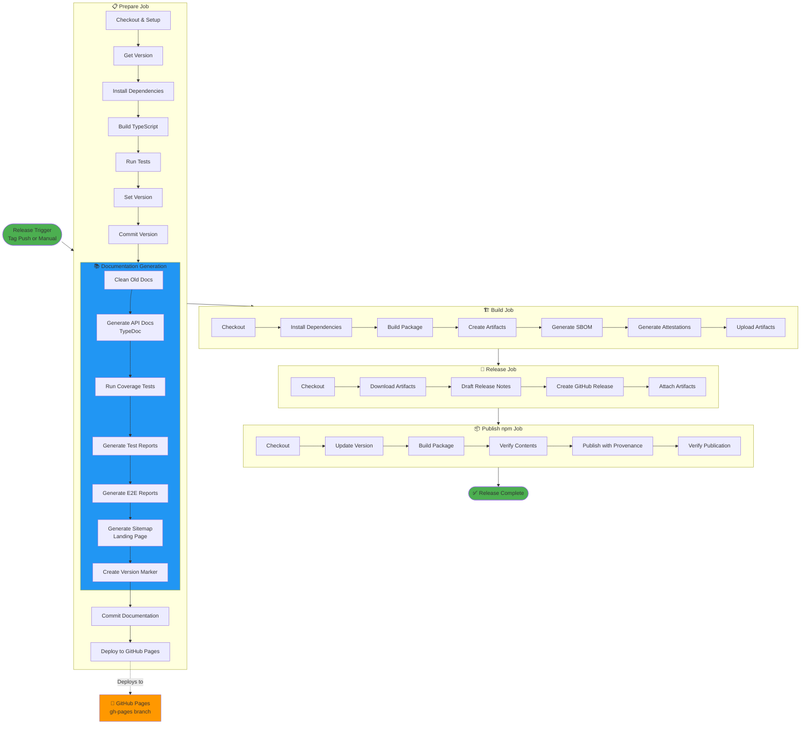
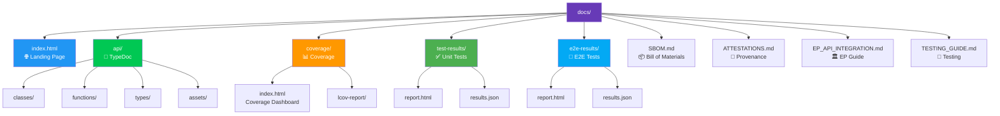
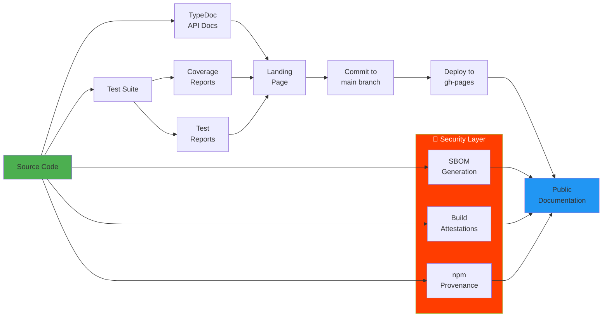

# Release Workflow Visualization

## 🔄 Complete Release Workflow with Documentation as Code



## 📊 Documentation Structure



## 🎨 Landing Page Preview

```
┌─────────────────────────────────────────────────────────────┐
│                      🏛️ European Parliament MCP Server        │
│                   Complete Documentation Portal              │
│                         Version 0.4.0                        │
│                                                              │
│     📅 Last Updated  🔐 SLSA Level 3  📊 80%+ Coverage      │
├─────────────────────────────────────────────────────────────┤
│                                                              │
│  📚 API Documentation                                        │
│  ┌───────────┐  ┌───────────┐  ┌───────────┐              │
│  │  📖 API   │  │  📦 SBOM  │  │ 🔐 Attest │              │
│  │ Reference │  │           │  │  -ations  │              │
│  └───────────┘  └───────────┘  └───────────┘              │
│                                                              │
│  🧪 Test Reports                                            │
│  ┌───────────┐  ┌───────────┐  ┌───────────┐              │
│  │ 📊 Cover  │  │  ✅ Unit  │  │  🔄 E2E   │              │
│  │   -age    │  │   Tests   │  │   Tests   │              │
│  └───────────┘  └───────────┘  └───────────┘              │
│                                                              │
│  📖 Additional Documentation                                │
│  ┌───────────┐  ┌───────────┐                              │
│  │  🏛️ EP   │  │  🧪 Test  │                              │
│  │    API    │  │   Guide   │                              │
│  └───────────┘  └───────────┘                              │
│                                                              │
│  🔗 External Links                                          │
│  ┌───────────┐  ┌───────────┐  ┌───────────┐              │
│  │ 💻 GitHub │  │  📦 npm   │  │ 🏛️ EP    │              │
│  │           │  │           │  │  Portal   │              │
│  └───────────┘  └───────────┘  └───────────┘              │
│                                                              │
├─────────────────────────────────────────────────────────────┤
│           Built with ❤️ by Hack23 AB                        │
│     Licensed under Apache-2.0 | ISMS Compliant             │
│   GDPR Compliant | SLSA Level 3 | OpenSSF Best Practices   │
└─────────────────────────────────────────────────────────────┘
```

## 📋 Documentation Generation Timeline

```mermaid
gantt
    title Documentation Generation in Release Workflow
    dateFormat  HH:mm
    axisFormat %H:%M
    
    section Setup
    Checkout & Setup           :done, setup, 00:00, 1m
    Install Dependencies       :done, deps, after setup, 2m
    
    section Build
    TypeScript Compilation     :done, build, after deps, 1m
    Run Tests                  :done, tests, after build, 2m
    
    section Documentation
    Clean Old Docs            :active, clean, after tests, 10s
    Generate API Docs         :active, api, after clean, 30s
    Run Coverage Tests        :active, cov, after api, 1m
    Generate Test Reports     :active, test-rep, after cov, 20s
    Generate E2E Reports      :active, e2e-rep, after test-rep, 20s
    Generate Sitemap          :active, sitemap, after e2e-rep, 5s
    Create Version Marker     :active, version, after sitemap, 2s
    
    section Deploy
    Commit Documentation      :crit, commit, after version, 5s
    Deploy to GitHub Pages    :crit, deploy, after commit, 30s
```



## 🔐 Security & Compliance Flow



## 📊 Coverage Distribution

```
Tools        ████████████████████████████████████████ 97.2%
Utils        ██████████████████████████████████████   95.5%
Schemas      ████████████████████████████████████████ 100%
Clients      ███████████████████████████              78.0%
Types        ████████████████████████████████         85.0%
Services     ██████████████████████████████████       90.0%
Overall      ██████████████████████████████           78.96%

Target: 80%+ ────────────────────────────────────────┤
```

## 🎯 Key Metrics

| Metric | Value | Status |
|--------|-------|--------|
| **API Documentation** | TypeDoc Generated | ✅ |
| **Test Coverage** | 78.96% (268 tests) | ⚠️ Target: 80% |
| **Security Coverage** | 95%+ (critical code) | ✅ |
| **Documentation Pages** | 50+ pages | ✅ |
| **Build Time** | ~5 minutes | ✅ |
| **Deploy Time** | ~30 seconds | ✅ |
| **SLSA Level** | Level 3 | ✅ |
| **npm Provenance** | Enabled | ✅ |

## 🚀 Benefits Summary

### For Users
- ✅ **Complete API Reference** - All functions, types, classes documented
- ✅ **Test Coverage Visible** - See quality metrics
- ✅ **Beautiful Interface** - Professional, responsive design
- ✅ **Always Up-to-Date** - Auto-generated with each release
- ✅ **SLSA Level 3** - Verifiable build provenance

### For Developers
- ✅ **Automated Generation** - No manual doc updates
- ✅ **JSDoc Integration** - Document code, generate docs
- ✅ **Quality Metrics** - Coverage and test results
- ✅ **CI/CD Integrated** - Part of release workflow
- ✅ **Version Tracking** - Historical documentation

### For Compliance
- ✅ **ISMS Aligned** - Follows Hack23 standards
- ✅ **Audit Trail** - Version markers and timestamps
- ✅ **Transparency** - Public documentation
- ✅ **Evidence** - Coverage and quality metrics
- ✅ **Attestations** - Build provenance documented

---

**Generated**: 2026-02-18  
**Pattern**: Black Trigram Release Workflow  
**Status**: ✅ Fully Implemented
