# Security Architecture

<p align="center">
  
</p>

<h1 align="center">🛡️ European Parliament MCP Server - Security Architecture</h1>

<p align="center">
  <strong>Comprehensive Security Design and Controls</strong><br>
  <em>Defense-in-Depth Implementation for MCP Protocol Server</em>
</p>

---

## 📋 Document Information

**Document Owner:** Security Team  
**Version:** 1.1  
**Last Updated:** 2026-02-18  
**Classification:** Public  
**Review Cycle:** Quarterly  
**Next Review:** 2026-05-18

---

## 🔗 Related Documents

| Document | Description | Link |
|----------|-------------|------|
| **Workflows Documentation** | CI/CD automation and security | [WORKFLOWS.md](./.github/WORKFLOWS.md) |
| **Future Workflows** | Planned CI/CD enhancements | [FUTURE_WORKFLOWS.md](./.github/FUTURE_WORKFLOWS.md) |
| **Architecture Diagrams** | System architecture visualization | [ARCHITECTURE_DIAGRAMS.md](./ARCHITECTURE_DIAGRAMS.md) |
| **Threat Model** | Threat analysis using STRIDE | [THREAT_MODEL.md](./THREAT_MODEL.md) |
| **Secure Development Policy** | ISMS secure development guidelines | [Secure_Development_Policy.md](https://github.com/Hack23/ISMS-PUBLIC/blob/main/Secure_Development_Policy.md) |
| **Open Source Policy** | ISMS open source governance | [Open_Source_Policy.md](https://github.com/Hack23/ISMS-PUBLIC/blob/main/Open_Source_Policy.md) |

---

## 📚 Security Documentation Map

This document is part of a comprehensive security documentation suite for the European Parliament MCP Server:

| Document | Purpose | Status |
|----------|---------|--------|
| **SECURITY_ARCHITECTURE.md** | Current architecture and controls (this document) | ✅ Complete |
| **[FUTURE_SECURITY_ARCHITECTURE.md](./FUTURE_SECURITY_ARCHITECTURE.md)** | Security roadmap and planned enhancements | ✅ Complete |
| **[THREAT_MODEL.md](./THREAT_MODEL.md)** | STRIDE threat analysis and mitigations | ✅ Complete |
| **[SECURITY.md](./SECURITY.md)** | Security policy and vulnerability reporting | ✅ Complete |
| **[SECURITY_HEADERS.md](./SECURITY_HEADERS.md)** | HTTP security headers configuration | ✅ Complete |
| **[Secure_Development_Policy.md](./Secure_Development_Policy.md)** | ISMS secure development guidelines | ✅ Complete |
| **[Open_Source_Policy.md](./Open_Source_Policy.md)** | Open source governance and security | ✅ Complete |
| **[BCPPlan.md](./BCPPlan.md)** | Business continuity and disaster recovery | ✅ Complete |
| **[.github/WORKFLOWS.md](./.github/WORKFLOWS.md)** | CI/CD security automation | ✅ Complete |
| **[CRA-ASSESSMENT.md](./CRA-ASSESSMENT.md)** | EU Cyber Resilience Act compliance | ✅ Complete |

---

## 🎯 Executive Summary

This document describes the implemented security architecture for the European Parliament MCP Server, a TypeScript/Node.js application providing structured access to European Parliament open datasets via the Model Context Protocol (MCP). The architecture implements defense-in-depth principles with multiple security layers to protect against common threats while maintaining GDPR compliance and ISMS alignment.

**Security Posture**:
- 🔒 **Input Validation**: Zod schema validation on all inputs
- ⚡ **Rate Limiting**: Token bucket algorithm (100 requests/15 minutes)
- 📝 **Audit Logging**: Comprehensive audit trail for GDPR compliance
- 🔐 **Data Protection**: No sensitive data storage, minimal caching (15 min TTL)
- 🛡️ **Defense-in-Depth**: Multiple security layers
- 📊 **Monitoring**: Performance metrics and security monitoring

---

## 📑 Table of Contents

- [Information Classification & Asset Management](#information-classification--asset-management)
- [Security Architecture Overview](#security-architecture-overview)
- [1. Authentication & Authorization](#1-authentication--authorization)
- [2. Session & Action Tracking](#2-session--action-tracking)
- [3. Data Integrity & Auditing](#3-data-integrity--auditing)
- [4. Data Protection & Key Management](#4-data-protection--key-management)
- [5. Network Security & Perimeter Protection](#5-network-security--perimeter-protection)
- [6. VPC Endpoints & Private Access](#6-vpc-endpoints--private-access)
- [7. High Availability & Resilience](#7-high-availability--resilience)
- [8. Threat Detection & Investigation](#8-threat-detection--investigation)
- [9. Vulnerability Management](#9-vulnerability-management)
- [10. Configuration & Compliance Management](#10-configuration--compliance-management)
- [11. Security Monitoring & Analytics](#11-security-monitoring--analytics)
- [12. Automated Security Operations](#12-automated-security-operations)
- [13. Application Security Controls](#13-application-security-controls)
- [14. CI/CD Pipeline Security](#14-cicd-pipeline-security)
- [15. Defense-in-Depth Strategy](#15-defense-in-depth-strategy)
- [16. Security Operations](#16-security-operations)
- [17. Compliance Framework Mapping](#17-compliance-framework-mapping)
- [18. ISMS Policy Alignment](#18-isms-policy-alignment)
- [19. Security Investment](#19-security-investment)
- [Conclusion](#conclusion)
- [Related Documentation](#related-documentation)

---

## 🔐 Information Classification & Asset Management

### CIA Triad Assessment

The European Parliament MCP Server has been classified using the CIA triad methodology to determine appropriate security controls:

| Asset Category | Confidentiality | Integrity | Availability | Rationale |
|----------------|-----------------|-----------|--------------|-----------|
| **System Data** | 🟢 Public/Low | 🟠 High | 🟡 Medium-High | Public EP data, but integrity critical for trust |
| **Source Code** | 🟢 Internal/Low | 🟠 High | 🟡 Medium | Open source (public), integrity ensures supply chain security |
| **Service Reputation** | 🟢 Public | 🟠 High | 🟡 Medium-High | Public service, reputation depends on reliability |
| **API Access** | 🟢 Public | 🟡 Medium | 🟡 Medium | No authentication required, rate-limited access |
| **Audit Logs** | 🟢 Internal/Low | 🟠 High | 🟢 Low | GDPR compliance logs, integrity for legal requirements |

**Legend:**
- 🔴 Critical/Very High | 🟠 High | 🟡 Medium | 🟢 Low/Public

### Crown Jewel Analysis

The following assets represent the most critical business value requiring prioritized protection:

```mermaid
graph TD
    subgraph "Crown Jewels - Critical Business Value"
        CJ1[🔒 Data Integrity<br/>C: Public | I: High | A: Medium-High]
        CJ2[🧠 Source Code<br/>C: Internal | I: High | A: Medium]
        CJ3[🏆 Service Reputation<br/>C: Public | I: High | A: Medium-High]
    end
    
    subgraph "High Value Assets"
        HV1[📊 Performance Metrics<br/>C: Internal | I: Medium | A: Low]
        HV2[🔐 Audit Trail<br/>C: Internal | I: High | A: Low]
        HV3[⚡ Cache Data<br/>C: Public | I: Medium | A: Medium]
    end
    
    subgraph "Standard Assets"
        SA1[📄 Documentation<br/>C: Public | I: Low | A: Low]
        SA2[🔧 Configuration<br/>C: Internal | I: Medium | A: Medium]
        SA3[🧪 Test Data<br/>C: Public | I: Low | A: Low]
    end
    
    CJ1 -.->|Protects| CJ3
    CJ2 -.->|Ensures| CJ1
    HV2 -.->|Validates| CJ1
    
    style CJ1 fill:#FF3D00,stroke:#BF360C,stroke-width:3px,color:white,font-weight:bold
    style CJ2 fill:#FF3D00,stroke:#BF360C,stroke-width:3px,color:white,font-weight:bold
    style CJ3 fill:#FF3D00,stroke:#BF360C,stroke-width:3px,color:white,font-weight:bold
    style HV1 fill:#FF9800,stroke:#E65100,stroke-width:2px,color:white
    style HV2 fill:#FF9800,stroke:#E65100,stroke-width:2px,color:white
    style HV3 fill:#FF9800,stroke:#E65100,stroke-width:2px,color:white
    style SA1 fill:#4CAF50,stroke:#2E7D32,stroke-width:1px,color:white
    style SA2 fill:#4CAF50,stroke:#2E7D32,stroke-width:1px,color:white
    style SA3 fill:#4CAF50,stroke:#2E7D32,stroke-width:1px,color:white
```

### Regulatory & Compliance Profile

| Framework | Impact Level | Requirements | Status |
|-----------|--------------|--------------|--------|
| **🇪🇺 GDPR** | Medium | Minimal personal data (public role MEP info only), 15-min cache, audit logging | ✅ Compliant |
| **🇪🇺 EU Cyber Resilience Act** | Medium | Medium baseline (non-safety-critical), vulnerability disclosure | ✅ Compliant |
| **📋 ISO 27001** | Medium | A.8.2 (Classification), A.12.6 (Vulnerability Mgmt), A.14.2 (Secure Dev) | ✅ Aligned |
| **🎯 NIST CSF 2.0** | Medium | ID.AM (Asset Mgmt), ID.RA (Risk Assessment), PR.DS (Data Security) | ✅ Aligned |
| **🛡️ CIS Controls v8.1** | Medium | 1.1 (Asset Inventory), 3.1-3.3 (Data Protection), 4.1 (Secure Config) | ✅ Aligned |

### Protection Requirements by Classification

| Classification Level | Data Examples | Protection Controls |
|---------------------|---------------|---------------------|
| **🔴 High Integrity** | Source code, audit logs, EP data integrity | Code signing, immutable logs, checksums, Git integrity, automated validation |
| **🟡 Medium Integrity** | Cache data, configuration, metrics | Version control, validation, monitoring |
| **🟢 Public Data** | Documentation, EP open data, test data | Standard version control, public transparency |

### Service Level Targets

- **RTO (Recovery Time Objective):** 30 minutes (server restart + cache rebuild)
- **RPO (Recovery Point Objective):** 1 hour (acceptable cache data loss)
- **SLA (Service Level Agreement):** 99.5% availability target
- **MTD (Maximum Tolerable Downtime):** 4 hours before significant impact

### Data Lifecycle Management

1. **Collection:** European Parliament API (public data only)
2. **Processing:** In-memory transformation, validation, rate limiting
3. **Storage:** Minimal caching (15-min TTL), no persistent storage of personal data
4. **Transmission:** HTTPS only, no data transmitted to third parties
5. **Disposal:** Automatic cache eviction (LRU), log rotation (30 days)

---

## 🏗️ Security Architecture Overview


---

## 🔑 1. Authentication & Authorization

### Current Implementation

**Authentication Status**: Not currently implemented (planned for Phase 2)

**Authorization Model**: 
- All MCP tools are publicly accessible
- Rate limiting provides abuse prevention
- European Parliament API requires no authentication (public data)

### Future OAuth 2.0 Implementation (Planned)


**Planned Authentication Controls**:
- OAuth 2.0 with JWT tokens
- API key authentication for service accounts
- Role-based access control (RBAC)
- Token expiration and refresh mechanisms

---

## 📊 2. Session & Action Tracking

### Audit Logging

**Implementation**: Winston logging framework

**Logged Events**:
```typescript
// Tool invocation audit
logger.info('Tool invoked', {
  tool: 'get_meps',
  params: { country: 'SE' },
  user: 'client-id',
  timestamp: new Date().toISOString(),
  ip: request.ip
});

// EP API access audit
logger.info('EP API accessed', {
  endpoint: '/api/v2/meps',
  params: { country: 'SE' },
  responseTime: 125,
  cacheHit: false,
  timestamp: new Date().toISOString()
});

// Security events
logger.warn('Rate limit exceeded', {
  ip: request.ip,
  tool: 'get_meps',
  attempts: 101,
  timestamp: new Date().toISOString()
});
```

**Audit Requirements**:
- ✅ All tool invocations logged
- ✅ All EP API accesses logged  
- ✅ Security events (rate limits, validation failures)
- ✅ Error events with sanitized messages
- ✅ Performance metrics

**GDPR Compliance**:
- Personal data access logged for audit trail
- Logs retained for 90 days
- No MEP personal data in logs (only IDs)
- Audit logs accessible for data subject requests

---

## 📜 3. Data Integrity & Auditing

### Change Tracking

**Immutable Data**: European Parliament data is read-only

**Cache Integrity**:
```typescript
// Cache key generation (deterministic)
function getCacheKey(method: string, params: Record<string, any>): string {
  const sorted = Object.keys(params)
    .sort()
    .reduce((acc, key) => {
      acc[key] = params[key];
      return acc;
    }, {} as Record<string, any>);
  
  return `${method}:${JSON.stringify(sorted)}`;
}
```

**Data Validation**:
```typescript
// Output validation with Zod
const OutputSchema = z.object({
  id: z.string(),
  name: z.string(),
  data: z.array(z.unknown())
});

const validated = OutputSchema.parse(apiResponse);
```

**Integrity Controls**:
- ✅ Input validation prevents injection
- ✅ Output validation ensures structure
- ✅ Cache keys are deterministic
- ✅ No data modification capabilities
- ✅ Tamper-evident audit logging

---

## 🔒 4. Data Protection & Key Management

### Data Classification

| Data Type | Classification | Protection | Retention |
|-----------|----------------|------------|-----------|
| MEP Personal Data | Public | No storage | N/A |
| API Responses | Public | Cached 15min | 15 minutes |
| Audit Logs | Internal | Encrypted logs | 90 days |
| Configuration | Internal | Environment vars | Permanent |

### Encryption

**Data in Transit**:
- ✅ HTTPS only for EP API requests
- ✅ TLS 1.3 for external connections
- ✅ MCP protocol over stdio (local IPC) or WebSocket (TLS)

**Data at Rest**:
- ✅ No persistent storage of personal data
- ✅ Cache is in-memory only (no disk)
- ✅ Logs encrypted at rest (platform-dependent)

**Secret Management**:
- ✅ No hardcoded credentials
- ✅ Environment variables for configuration
- ✅ No API keys required (EP API is public)
- 🔄 Future: Vault integration for OAuth tokens

### GDPR Compliance

**Data Minimization**:
```typescript
// Only request necessary fields
const mep = await epClient.getMEPDetails(id);
// Returns: id, name, country, committees (public data only)
```

**Right to Erasure**:
- No persistent storage of personal data
- Cache automatically expires after 15 minutes
- Audit logs retain only MEP IDs (not personal data)

**Privacy by Design**:
- Minimal data collection
- Short cache TTL (15 minutes)
- No cross-referencing or profiling
- Public data only (no sensitive data)

---

## 🌐 5. Network Security & Perimeter Protection

### Network Boundaries


### Transport Security

**MCP Protocol Transport**:
- **stdio**: Local IPC (Claude Desktop, VS Code)
- **WebSocket**: TLS 1.3 (remote clients)

**External API**:
- HTTPS only (TLS 1.3)
- Certificate validation enforced
- No insecure connections allowed

**Firewall Rules** (Production):
```bash
# Inbound
ALLOW 443/tcp from ANY  # HTTPS/WebSocket
DENY * from ANY

# Outbound
ALLOW 443/tcp to data.europarl.europa.eu  # EP API
DENY * to ANY
```

---

## 🔌 6. VPC Endpoints & Private Access

**Current Deployment**: Not applicable (public EP API)

**Future AWS Deployment**:
- VPC endpoints for AWS services
- Private subnets for application servers
- NAT gateway for outbound EP API access
- Security groups with least privilege


---

## 🏗️ 7. High Availability & Resilience

### Availability Architecture

**Current**: Single instance (development)

**Production Design**:


**Resilience Controls**:
- ✅ Graceful error handling
- ✅ Rate limiting prevents DoS
- ✅ Cache reduces EP API dependency
- 🔄 Circuit breaker (planned)
- 🔄 Auto-scaling (planned)
- 🔄 Multi-region deployment (planned)

**Recovery Objectives**:
- **RTO (Recovery Time Objective)**: 5 minutes
- **RPO (Recovery Point Objective)**: 0 (no persistent data)

---

## ⚡ 8. Threat Detection & Investigation

### Security Monitoring

**Metrics Collected**:
```typescript
// Request metrics
metrics.incrementCounter('requests_total', { tool, status });
metrics.observeHistogram('request_duration_ms', duration, { tool });

// Security metrics
metrics.incrementCounter('validation_failures', { tool, error_type });
metrics.incrementCounter('rate_limit_violations', { ip, tool });

// Performance metrics
metrics.setGauge('cache_size', cache.size);
metrics.setGauge('cache_hit_rate', hitRate);
```

**Anomaly Detection** (Planned):
- Unusual request patterns
- Repeated validation failures
- Spike in rate limit violations
- Unexpected error rates

**Incident Response**:
1. Detection: Automated alerts via metrics
2. Analysis: Audit log review
3. Containment: Rate limiting, IP blocking
4. Eradication: Fix vulnerability
5. Recovery: Restart service if needed
6. Lessons Learned: Update security controls

---

## 🔍 9. Vulnerability Management

### Security Scanning

**Automated Scans**:
```yaml
# .github/workflows/security.yml
- SonarCloud SAST (every commit)
- Dependabot (daily)
- npm audit (every commit)
- Trivy container scan (on release)
- CodeQL analysis (weekly)
```

**Vulnerability Response**:
| Severity | SLA | Action |
|----------|-----|--------|
| Critical | 24 hours | Immediate patch |
| High | 7 days | Scheduled patch |
| Medium | 30 days | Next release |
| Low | 90 days | Backlog |

**Current Security Posture**:
- ✅ OpenSSF Scorecard: 8.5/10
- ✅ SLSA Level 3 compliance
- ✅ No known vulnerabilities
- ✅ 80%+ test coverage

---

## ⚙️ 10. Configuration & Compliance Management

### Security Configuration

**Hardening**:
```typescript
// Rate limiter configuration
const rateLimiter = new RateLimiter({
  maxTokens: 100,
  refillRate: 100,
  windowMs: 15 * 60 * 1000  // 15 minutes
});

// Cache configuration
const cache = new LRUCache<string, any>({
  max: 500,              // Max entries
  ttl: 15 * 60 * 1000,  // 15 minutes
  allowStale: false      // No stale data
});

// HTTP client configuration
const client = {
  timeout: 30000,        // 30 second timeout
  keepAlive: true,
  rejectUnauthorized: true  // Validate certificates
};
```

**Configuration Management**:
- ✅ Infrastructure as Code (Docker, docker-compose)
- ✅ Environment-based configuration
- ✅ No secrets in code
- ✅ Configuration validation on startup

---

## 📈 11. Security Monitoring & Analytics

### Key Performance Indicators

| Metric | Target | Alert Threshold |
|--------|--------|-----------------|
| Validation Failure Rate | <1% | >5% |
| Rate Limit Violations | <10/hour | >50/hour |
| API Error Rate | <0.1% | >1% |
| Average Response Time | <200ms | >500ms |
| Cache Hit Rate | >80% | <60% |

### Dashboards (Planned)


---

## 🤖 12. Automated Security Operations

### Automated Controls

**Input Validation** (Automated):
```typescript
// Automatic validation on every request
const InputSchema = z.object({
  country: z.string().regex(/^[A-Z]{2}$/),
  date: z.string().regex(/^\d{4}-\d{2}-\d{2}$/),
  keywords: z.string().regex(/^[a-zA-Z0-9\s\-_]+$/)
});

// Throws ValidationError automatically
const validated = InputSchema.parse(input);
```

**Rate Limiting** (Automated):
```typescript
// Automatic enforcement
if (!await rateLimiter.tryRemoveTokens(1)) {
  throw new Error('Rate limit exceeded');
}
```

**Self-Healing** (Planned):
- Automatic service restart on crash
- Circuit breaker for EP API failures
- Auto-scaling based on load

---

## 🛡️ 13. Application Security Controls

### MCP Protocol Security

The European Parliament MCP Server implements comprehensive application-level security controls specifically designed for the Model Context Protocol:


### Tool Input Validation

**Every MCP tool implements strict input validation:**

```typescript
// Example: get_meps tool input validation (matches actual implementation)
import { GetMEPsSchema } from '../schemas/europeanParliament.js';

// Actual schema: country (2-letter ISO code), group, committee, active, limit, offset
const validatedInput = GetMEPsSchema.parse(args);
// validated: { country?: 'SE', group?: 'EPP', committee?: 'AFET', active: true, limit: 50, offset: 0 }

// Automatic validation - throws ZodError on invalid input
export async function handleGetMEPs(args: unknown) {
  const params = GetMEPsSchema.parse(args);  // Validates all fields
  // params.country is guaranteed to match /^[A-Z]{2}$/ if provided
  // params.limit is guaranteed to be integer 1-100
  // params.active defaults to true
}
```

**Input Validation Coverage:**

| Tool | Parameters | Validation Strategy | Status |
|------|------------|---------------------|--------|
| `get_meps` | country, group, committee, active, limit, offset | ISO-2 country, string max 50/100, boolean, int 1-100 | ✅ |
| `get_mep_details` | id | String min 1, max 100 | ✅ |
| `search_documents` | keyword, documentType, dateFrom, dateTo, committee, limit | Regex alphanum, enum, ISO date, int 1-100 | ✅ |
| `get_plenary_sessions` | dateFrom, dateTo, location, limit, offset | ISO date range, string max 100, int 1-100 | ✅ |
| `get_voting_records` | sessionId, mepId, topic, dateFrom, dateTo, limit | String max 100/200, ISO date range, int 1-100 | ✅ |
| `get_parliamentary_questions` | type, author, topic, status, dateFrom, dateTo | Enum WRITTEN/ORAL, string max 100/200, enum, ISO date | ✅ |
| `get_committee_info` | id, abbreviation | String max 100, string max 20 | ✅ |
| `analyze_voting_patterns` | mepId, dateFrom, dateTo, compareWithGroup | String max 100, ISO date range, boolean | ✅ |
| `track_legislation` | procedureId | String min 1, max 100 | ✅ |
| `generate_report` | reportType, subjectId, dateFrom, dateTo | Enum 4 values, string max 100, ISO date range | ✅ |

### Resource Access Control

**European Parliament API Access:**

```typescript
// EuropeanParliamentClient: access controls (illustrative — actual impl in src/clients/europeanParliamentClient.ts)
class EuropeanParliamentClient {
  private readonly baseURL = 'https://data.europarl.europa.eu/api/v2/';
  private readonly timeoutMs = DEFAULT_REQUEST_TIMEOUT_MS;  // 10s default (EP_REQUEST_TIMEOUT_MS env var)
  
  private async get<T>(endpoint: string, params: Record<string, unknown>): Promise<T> {
    // 1. Rate limiting check (100 req/min token bucket)
    if (!await this.rateLimiter.tryRemoveTokens(1)) {
      throw new Error('Rate limit exceeded');
    }
    
    // 2. Build URL from validated endpoint only (no user-controlled URLs)
    const url = new URL(endpoint, this.baseURL);
    
    // 3. Parameter sanitization — only pass validated params
    for (const [key, value] of Object.entries(params)) {
      if (value !== undefined) url.searchParams.set(key, String(value));
    }
    
    // 4. Make request with timeout
    const response = await fetch(url.toString(), {
      method: 'GET',
      headers: { 'Accept': 'application/json' },
      signal: AbortSignal.timeout(this.timeoutMs)
    });
    
    // 5. Validate response structure before returning
    if (!response.ok) {
      logger.warn('API error', { status: response.status });
      throw new Error('API request failed');
    }
    return response.json() as T;
  }
}

// Actual EP API endpoints used (all read-only, no user-controlled paths)
// 'meps'          → getMEPs()
// 'meps/{id}'     → getMEPDetails()
// 'meetings'      → getPlenarySessions()
// Other tools (getVotingRecords, searchDocuments, etc.) use structured data generation
// with the same rate-limiting and timeout controls applied
```

### Prompt Injection Prevention

**MCP servers are vulnerable to prompt injection attacks where malicious input attempts to manipulate the AI assistant. Our mitigations:**

1. **Input Sanitization:**
```typescript
// Remove control characters and potential injection patterns
function sanitizeInput(input: string): string {
  return input
    .replace(/[\x00-\x1F\x7F]/g, '')  // Remove control chars
    .replace(/[<>]/g, '')              // Remove angle brackets
    .trim()
    .slice(0, 1000);                   // Limit length
}
```

2. **Output Sanitization:**
```typescript
// Ensure outputs are properly structured and safe
function sanitizeOutput(data: any): MCPResponse {
  return {
    content: [{
      type: 'text',
      text: JSON.stringify(data, null, 2)  // JSON escaping
    }]
  };
}
```

3. **Context Isolation:**
- No access to server filesystem
- No command execution capabilities
- Limited to EP API read operations only
- No user credentials stored or accessed

### Protocol-Level Controls

**MCP Server Initialization:**

```typescript
// MCP server initialization with security settings
import { Server } from '@modelcontextprotocol/sdk/server/index.js';
import { StdioServerTransport } from '@modelcontextprotocol/sdk/server/stdio.js';

const server = new Server(
  {
    name: 'european-parliament-server',
    version: '1.0.0',
  },
  {
    capabilities: {
      tools: {},      // Tools capability enabled with handlers registered
      resources: {},  // Resources capability declared; no handlers registered yet
      prompts: {}     // Prompts capability declared; no handlers registered yet
    },
  }
);

// Secure transport configuration
const transport = new StdioServerTransport();

// Error handling prevents information leakage
server.onerror = (error) => {
  logger.error('MCP protocol error', { 
    error: error.message,  // Don't log full stack
    timestamp: new Date().toISOString()
  });
};
```

**Security Features:**
- ✅ Read-only operations (no write/delete capabilities)
- ✅ Stateless request handling (no session state)
- ✅ No file system access
- ✅ No network access outside EP API
- ✅ Comprehensive error handling
- ✅ Audit logging for all operations

### API Security Best Practices

**Implemented Controls:**

| Control | Implementation | OWASP Mapping |
|---------|----------------|---------------|
| Input Validation | Zod schemas, regex filters | A03: Injection |
| Output Encoding | JSON serialization | A03: Injection |
| Rate Limiting | Token bucket, 100 req/min | A01: Broken Access Control |
| Error Handling | Sanitized messages, no stack traces | A05: Security Misconfiguration |
| Audit Logging | All operations logged | A09: Logging Failures |
| Timeout Controls | 10s default (configurable via EP_REQUEST_TIMEOUT_MS) | A05: Security Misconfiguration |
| Resource Limits | Max 100 results per query | A01: Broken Access Control |
| Cache Security | 15min TTL, deterministic keys | A08: Data Integrity Failures |

---

## 🔄 14. CI/CD Pipeline Security

### Workflow Automation

The CI/CD pipeline implements comprehensive security controls following SLSA Level 3 requirements and Hack23 ISMS standards.

**Complete Workflow Documentation:** [WORKFLOWS.md](./.github/WORKFLOWS.md)  
**Future Enhancements:** [FUTURE_WORKFLOWS.md](./.github/FUTURE_WORKFLOWS.md)

### CI/CD Security Architecture

```mermaid
graph TB
    subgraph "Security Gates"
        SG1[🔒 Code Scanning<br/>CodeQL SAST]
        SG2[📦 SBOM Generation<br/>SPDX 2.3]
        SG3[🔍 Dependency Review<br/>Vulnerability Check]
        SG4[🧪 Test Coverage<br/>≥80% Required]
        SG5[🏆 OpenSSF Scorecard<br/>≥8.0 Target]
    end
    
    subgraph "Automated Controls"
        AC1[📌 Pinned Actions<br/>SHA256 Hashes]
        AC2[🔐 Minimal Permissions<br/>Least Privilege]
        AC3[📝 Audit Logging<br/>Egress Tracking]
        AC4[🔄 Auto-Updates<br/>Dependabot]
    end
    
    subgraph "Attestations"
        AT1[🛡️ SLSA Provenance]
        AT2[✍️ Sigstore Signing]
        AT3[📊 Build Evidence]
    end
    
    SG1 --> AC3
    SG2 --> AT1
    SG3 --> AC4
    SG4 --> AT3
    SG5 --> AT2
    
    AC1 --> AT1
    AC2 --> AT1
    AC3 --> AT3
    
    style SG1 fill:#FF3D00,stroke:#BF360C,stroke-width:2px,color:white
    style SG2 fill:#FF3D00,stroke:#BF360C,stroke-width:2px,color:white
    style SG3 fill:#FF3D00,stroke:#BF360C,stroke-width:2px,color:white
    style SG4 fill:#FF3D00,stroke:#BF360C,stroke-width:2px,color:white
    style SG5 fill:#FF3D00,stroke:#BF360C,stroke-width:2px,color:white
    style AC1 fill:#673AB7,stroke:#4527A0,stroke-width:2px,color:white
    style AC2 fill:#673AB7,stroke:#4527A0,stroke-width:2px,color:white
    style AC3 fill:#673AB7,stroke:#4527A0,stroke-width:2px,color:white
    style AC4 fill:#673AB7,stroke:#4527A0,stroke-width:2px,color:white
    style AT1 fill:#00C853,stroke:#00695C,stroke-width:2px,color:white
    style AT2 fill:#00C853,stroke:#00695C,stroke-width:2px,color:white
    style AT3 fill:#00C853,stroke:#00695C,stroke-width:2px,color:white
```



### Security Controls in CI/CD

| Control | Implementation | Evidence Location |
|---------|----------------|-------------------|
| **Static Analysis** | CodeQL with security-extended queries | [codeql.yml](../.github/workflows/codeql.yml) |
| **Dependency Scanning** | Dependency Review + Dependabot | [dependency-review.yml](../.github/workflows/dependency-review.yml) |
| **SBOM Generation** | CycloneDX + SBOMQS validation | [sbom-generation.yml](../.github/workflows/sbom-generation.yml) |
| **Test Coverage** | Vitest with 80% threshold | [integration-tests.yml](../.github/workflows/integration-tests.yml) |
| **Security Scoring** | OpenSSF Scorecard (≥8.0) | [scorecard.yml](../.github/workflows/scorecard.yml) |
| **Hardened Runners** | Step Security harden-runner | All workflows |
| **Pinned Dependencies** | Actions pinned to SHA256 | All workflows |
| **Minimal Permissions** | Read-only by default | All workflows |
| **Attestations** | SLSA Level 3 provenance | [release.yml](../.github/workflows/release.yml) |

### Workflow Security Requirements

**All workflows must implement:**

1. **Step Security Harden Runner**
   ```yaml
   - uses: step-security/harden-runner@v2
     with:
       egress-policy: audit
   ```

2. **Pinned Action Versions**
   ```yaml
   - uses: actions/checkout@8e5e7e5ab8b370d6c329ec480221332ada57f0ab # v3.5.2
   ```

3. **Minimal Permissions**
   ```yaml
   permissions:
     contents: read  # Default read-only
   ```

4. **ISMS Evidence Collection**
   - Workflow execution logs preserved
   - Security scan results published to docs/
   - SBOM and attestations available via GitHub Pages

### ISMS Evidence Links

| ISMS Control | Evidence | Link |
|--------------|----------|------|
| **ISO 27001 A.14.2.8** | Test data management | [Coverage Reports](https://hack23.github.io/European-Parliament-MCP-Server/docs/coverage/) |
| **ISO 27001 A.14.2.1** | Secure development policy | [Workflows Documentation](./.github/WORKFLOWS.md) |
| **NIST CSF PR.DS-6** | Integrity checking | [CodeQL Results](../.github/workflows/codeql.yml) |
| **NIST CSF DE.CM-8** | Vulnerability scanning | [Scorecard](https://securityscorecards.dev/viewer/?uri=github.com/Hack23/European-Parliament-MCP-Server) |
| **CIS Controls 2.2** | Software inventory | [SBOM](https://hack23.github.io/European-Parliament-MCP-Server/docs/SBOM.md) |
| **CIS Controls 16.6** | App security testing | [Test Results](https://hack23.github.io/European-Parliament-MCP-Server/docs/test-results/) |

---

## 🛡️ 15. Defense-in-Depth Strategy

### OWASP Top 10 Mitigation

| Threat | Mitigation | Implementation |
|--------|------------|----------------|
| A01: Broken Access Control | Rate limiting, future auth | ✅ Rate limiter |
| A02: Cryptographic Failures | TLS, no sensitive data storage | ✅ HTTPS only |
| A03: Injection | Input validation, parameterized queries | ✅ Zod schemas |
| A04: Insecure Design | Security architecture, threat model | ✅ This document |
| A05: Security Misconfiguration | Hardening, IaC | ✅ Docker, env vars |
| A06: Vulnerable Components | Dependency scanning | ✅ Dependabot, npm audit |
| A07: Auth Failures | Future OAuth 2.0 | 🔄 Planned |
| A08: Data Integrity Failures | Output validation, audit logs | ✅ Zod, Winston |
| A09: Logging Failures | Comprehensive logging | ✅ Audit trail |
| A10: SSRF | No user-controlled URLs | ✅ EP API only |

### Security Layers Architecture


**Layered Controls Explanation:**

1. **Perimeter Defense**
   - Rate limiting prevents DoS and brute force
   - Token bucket algorithm (100 requests/15 minutes)
   - Per-client quotas and monitoring

2. **Application Layer**
   - Input validation with Zod schemas (all 10 tools)
   - Output validation ensures structure integrity
   - No user-controlled file paths or URLs

3. **Data Layer**
   - Minimal storage (in-memory cache only)
   - Short TTL (15 minutes)
   - No persistent storage of personal data

4. **Audit & Monitoring**
   - Comprehensive logging of all operations
   - Security event detection
   - Performance metrics

5. **Transport Security**
   - TLS 1.3 for all external connections
   - HTTPS-only EP API access
   - Certificate validation enforced

6. **Error Handling**
   - Sanitized error messages
   - No stack traces exposed
   - No information leakage

### Secure Coding Practices

**Input Sanitization:**
```typescript
// Regex validation prevents injection
const keywords = z.string().regex(/^[a-zA-Z0-9\s\-_]+$/);
```

**Output Encoding:**
```typescript
// JSON serialization prevents XSS
return {
  content: [{
    type: 'text',
    text: JSON.stringify(data, null, 2)
  }]
};
```

**Error Handling:**
```typescript
// Sanitized error messages
catch (error) {
  logger.error('Internal error', { error });
  throw new Error('Operation failed');  // No details exposed
}
```

---

## 🔧 16. Security Operations

### Operational Security Framework


### Monitoring & Alerting Procedures

**Real-Time Monitoring:**

```typescript
// Metrics collection for security monitoring
interface SecurityMetrics {
  validation_failures: number;
  rate_limit_violations: number;
  api_errors: number;
  cache_poisoning_attempts: number;
  suspicious_patterns: number;
}

// Alert thresholds
const ALERT_THRESHOLDS = {
  validation_failures: 50,      // per hour
  rate_limit_violations: 100,   // per hour
  api_errors: 20,               // per hour
  response_time_p99: 1000,      // milliseconds
  cache_hit_rate_min: 0.6       // 60%
};

// Automated alerting
function checkThresholds(metrics: SecurityMetrics) {
  if (metrics.validation_failures > ALERT_THRESHOLDS.validation_failures) {
    alertOncall('High validation failure rate detected');
  }
  // ... additional checks
}
```

**Security Event Categories:**

| Event Type | Severity | Response Time | Action |
|------------|----------|---------------|--------|
| Rate limit exceeded | 🟡 Medium | 15 minutes | Log and monitor pattern |
| Validation failure spike | 🟠 High | 5 minutes | Investigate and block if malicious |
| API error spike | 🟠 High | 5 minutes | Check EP API health, failover |
| Suspicious input patterns | 🔴 Critical | Immediate | Block and escalate |
| Authentication bypass attempt | 🔴 Critical | Immediate | Block and report |

### Incident Detection & Response

**Detection Methods:**

1. **Automated Detection:**
   - Metrics-based anomaly detection
   - Pattern matching in logs
   - Rate limit violation tracking
   - Error rate monitoring

2. **Manual Detection:**
   - Quarterly security reviews
   - Code audits
   - Dependency vulnerability reports
   - User reports

**Response Playbooks:**

**Playbook 1: Rate Limit Abuse**
```
1. DETECT: Rate limiter logs excessive requests from IP/client
2. ANALYZE: Review logs for attack pattern vs. legitimate spike
3. CONTAIN: Temporary IP block if malicious (manual approval)
4. INVESTIGATE: Determine attack vector and intent
5. REMEDIATE: Adjust rate limits if needed
6. DOCUMENT: Update incident log and threat model
```

**Playbook 2: Injection Attack Attempt**
```
1. DETECT: Validation failure with suspicious patterns
2. ANALYZE: Extract attack payload and identify vector
3. CONTAIN: Ensure validation blocked the attack
4. INVESTIGATE: Check for successful bypasses in logs
5. REMEDIATE: Strengthen validation if needed
6. DOCUMENT: Update threat model and test cases
```

**Playbook 3: Dependency Vulnerability**
```
1. DETECT: Dependabot alert or security scan finding
2. ANALYZE: Assess CVSS score, exploitability, impact
3. CONTAIN: N/A (pre-deployment)
4. INVESTIGATE: Check if vulnerable code path is reachable
5. REMEDIATE: Update dependency, test, deploy (per SLA)
6. DOCUMENT: Update security advisory and CHANGELOG
```

### Change Management Process

**All changes must follow this process:**


**Security Gates (Must Pass):**
- ✅ All tests passing (≥80% coverage)
- ✅ No CodeQL findings (high/critical)
- ✅ No vulnerable dependencies (high/critical)
- ✅ Linting passes (no errors)
- ✅ Code review approval (1+ reviewer)
- ✅ Documentation updated

### Security Review Cadence

**Regular Reviews:**

| Review Type | Frequency | Scope | Owner |
|-------------|-----------|-------|-------|
| **Vulnerability Scanning** | Daily (automated) | Dependencies, code | Dependabot, CodeQL |
| **Security Metrics Review** | Weekly | Metrics, logs, alerts | Security Team |
| **Architecture Review** | Quarterly | This document, threat model | Security Team |
| **Penetration Testing** | Annually | Full system | External auditor |
| **Compliance Audit** | Annually | GDPR, ISO 27001 | Compliance Team |
| **Incident Response Drill** | Semi-annually | Playbook execution | All teams |

**Review Outputs:**
- Updated risk register
- Security findings backlog
- Architecture improvements
- Policy updates
- Training materials

---

## 📋 17. Compliance Framework Mapping

### ISO 27001 Controls

| Control | Description | Implementation | Status |
|---------|-------------|----------------|--------|
| A.5.1 | Information security policies | SECURITY.md, this document | ✅ |
| A.8.2 | Information classification | DATA_MODEL.md | ✅ |
| A.9.1 | Access control | Rate limiting, future auth | 🔄 |
| A.9.4 | System access control | MCP protocol, validation | ✅ |
| A.12.4 | Logging and monitoring | Winston, audit trail | ✅ |
| A.14.2 | Security in development | SDLC, code review | ✅ |
| A.18.1 | GDPR compliance | Data minimization, erasure | ✅ |

### NIST CSF 2.0 Mapping

| Function | Category | Implementation |
|----------|----------|----------------|
| Identify (ID) | Asset Management | SBOM, dependency tracking |
| Protect (PR) | Access Control | Rate limiting, validation |
| Protect (PR) | Data Security | Encryption, minimal storage |
| Detect (DE) | Security Monitoring | Metrics, audit logs |
| Respond (RS) | Incident Response | Playbooks, escalation |
| Recover (RC) | Recovery Planning | Backup, RTO/RPO |

### CIS Controls v8.1

| Control | Description | Status |
|---------|-------------|--------|
| 3.3 | Data Protection | ✅ TLS, minimal storage |
| 6.2 | Audit Log Management | ✅ Winston logging |
| 8.2 | Audit Log Analysis | 🔄 Planned automation |
| 11.3 | Application Security Testing | ✅ SAST, SCA |
| 16.7 | Vulnerability Remediation | ✅ Dependabot, SLA |

---

## 🏛️ 18. ISMS Policy Alignment

### Related ISMS Policies

The European Parliament MCP Server security architecture is aligned with Hack23 AB's Information Security Management System (ISMS):

| ISMS Policy | Relevance | Alignment Evidence |
|-------------|-----------|-------------------|
| **[Secure Development Policy](https://github.com/Hack23/ISMS-PUBLIC/blob/main/Secure_Development_Policy.md)** | High | SECURITY_ARCHITECTURE.md, THREAT_MODEL.md, 80%+ test coverage, CI/CD security gates |
| **[Open Source Policy](https://github.com/Hack23/ISMS-PUBLIC/blob/main/Open_Source_Policy.md)** | High | SBOM generation, dependency scanning, OpenSSF Scorecard (8.5/10), SLSA Level 3 |
| **[Vulnerability Management](https://github.com/Hack23/ISMS-PUBLIC/blob/main/Vulnerability_Management.md)** | High | Dependabot daily scans, CVE SLAs, security advisories, coordinated disclosure |
| **[Access Control Policy](https://github.com/Hack23/ISMS-PUBLIC/blob/main/Access_Control_Policy.md)** | Medium | Rate limiting, future OAuth 2.0 implementation planned |
| **[Cryptography Policy](https://github.com/Hack23/ISMS-PUBLIC/blob/main/Cryptography_Policy.md)** | Medium | TLS 1.3, HTTPS-only, no sensitive data storage |
| **[Network Security Policy](https://github.com/Hack23/ISMS-PUBLIC/blob/main/Network_Security_Policy.md)** | Medium | HTTPS EP API access, future VPC architecture planned |
| **[Backup & Recovery Policy](https://github.com/Hack23/ISMS-PUBLIC/blob/main/Backup_Recovery_Policy.md)** | Low | Git-based source recovery, RTO 30min, RPO 1hr |
| **[Incident Response Plan](https://github.com/Hack23/ISMS-PUBLIC/blob/main/Incident_Response_Plan.md)** | High | Incident response playbooks, security event logging, escalation procedures |
| **[Classification Framework](https://github.com/Hack23/ISMS-PUBLIC/blob/main/CLASSIFICATION.md)** | High | CIA triad assessment, asset classification, protection requirements |

### Security Control Implementation Status

| Control Category | ISO 27001 Annex A | Status | Implementation Details |
|------------------|-------------------|--------|------------------------|
| **A.5 Information Security Policies** | A.5.1 | ✅ Complete | SECURITY.md, SECURITY_ARCHITECTURE.md, THREAT_MODEL.md |
| **A.8 Asset Management** | A.8.1, A.8.2 | ✅ Complete | Asset classification, crown jewel analysis, SBOM |
| **A.9 Access Control** | A.9.1, A.9.4 | 🔄 Partial | Rate limiting ✅, OAuth 2.0 🔄 (planned) |
| **A.12 Operations Security** | A.12.4, A.12.6 | ✅ Complete | Audit logging, vulnerability management, dependency scanning |
| **A.14 System Development** | A.14.2 | ✅ Complete | SDLC security, CI/CD gates, security testing, code review |
| **A.16 Incident Management** | A.16.1 | ✅ Complete | Incident response playbooks, security event detection |
| **A.18 Compliance** | A.18.1 | ✅ Complete | GDPR compliance, data minimization, privacy by design |

### NIST CSF 2.0 Implementation

| Function | Category | Implementation | Maturity Level |
|----------|----------|----------------|----------------|
| **Identify (ID)** | ID.AM: Asset Management | SBOM, dependency tracking, crown jewel analysis | Level 3: Managed |
| **Identify (ID)** | ID.RA: Risk Assessment | Threat model, STRIDE analysis, risk quantification | Level 3: Managed |
| **Protect (PR)** | PR.AC: Access Control | Rate limiting, input validation, future OAuth 2.0 | Level 2: Risk-Informed |
| **Protect (PR)** | PR.DS: Data Security | TLS encryption, minimal storage, cache TTL | Level 3: Managed |
| **Protect (PR)** | PR.IP: Information Protection | Zod validation, sanitization, audit logging | Level 3: Managed |
| **Detect (DE)** | DE.CM: Continuous Monitoring | Metrics, logs, anomaly detection (planned) | Level 2: Risk-Informed |
| **Detect (DE)** | DE.AE: Anomalies & Events | Security event detection, alert thresholds | Level 2: Risk-Informed |
| **Respond (RS)** | RS.RP: Response Planning | Incident response playbooks, escalation | Level 2: Risk-Informed |
| **Respond (RS)** | RS.CO: Communications | Security advisories, coordinated disclosure | Level 3: Managed |
| **Recover (RC)** | RC.RP: Recovery Planning | RTO/RPO defined, backup strategy | Level 2: Risk-Informed |

### CIS Controls v8.1 Coverage

| Control | Description | Implementation | Evidence |
|---------|-------------|----------------|----------|
| **1.1** | Establish Asset Inventory | ✅ Complete | SBOM, package.json, dependency graph |
| **2.2** | Software Inventory | ✅ Complete | SBOM (SPDX 2.3), CycloneDX |
| **3.1** | Data Classification | ✅ Complete | CIA triad assessment, asset classification |
| **3.3** | Data Disposal | ✅ Complete | 15min cache TTL, 90-day log retention |
| **4.1** | Secure Configuration | ✅ Complete | Docker, environment variables, IaC |
| **6.2** | Audit Log Management | ✅ Complete | Winston logging, JSON format, 90-day retention |
| **7.3** | DNS Protection | ✅ Complete | HTTPS-only, certificate validation |
| **8.2** | Audit Log Analysis | 🔄 Planned | Automated anomaly detection roadmap |
| **11.3** | Application Security Testing | ✅ Complete | CodeQL SAST, Dependabot SCA, 80%+ coverage |
| **16.6** | Application Security | ✅ Complete | Input validation, output encoding, OWASP Top 10 |
| **16.7** | Vulnerability Remediation | ✅ Complete | CVE SLAs (Critical: 24h, High: 7d, Medium: 30d) |

### GDPR Compliance

| Article | Requirement | Implementation | Status |
|---------|-------------|----------------|--------|
| **Art. 5** | Data Minimization | Only public MEP data accessed, minimal caching | ✅ |
| **Art. 6** | Lawful Basis | Public data processing (legitimate interest) | ✅ |
| **Art. 17** | Right to Erasure | 15min cache TTL, no persistent storage | ✅ |
| **Art. 25** | Privacy by Design | Minimal data collection, short TTL, audit logs | ✅ |
| **Art. 30** | Processing Records | Audit logs with 90-day retention | ✅ |
| **Art. 32** | Security Measures | Encryption, access control, integrity checks | ✅ |
| **Art. 33** | Breach Notification | Incident response plan, 72-hour SLA | ✅ |

### EU Cyber Resilience Act (CRA)

| Requirement | Implementation | Evidence |
|-------------|----------------|----------|
| **SBOM** | SPDX 2.3 SBOM generated in CI/CD | [SBOM workflow](./.github/workflows/sbom-generation.yml) |
| **Vulnerability Disclosure** | Public SECURITY.md, coordinated disclosure | [SECURITY.md](./SECURITY.md) |
| **Security Updates** | Dependabot automated updates, CVE SLAs | [Dependency Review](./.github/workflows/dependency-review.yml) |
| **Security Testing** | SAST, SCA, 80%+ test coverage | [CodeQL](./.github/workflows/codeql.yml), [Tests](./.github/workflows/integration-tests.yml) |
| **Documentation** | Comprehensive security architecture | This document |

---

## 💰 19. Security Investment

### Current Investments

**Implemented Security Controls:**

| Investment Area | Technologies/Services | Annual Cost | ROI/Benefit |
|-----------------|----------------------|-------------|-------------|
| **Automated Security Scanning** | CodeQL, Dependabot, SonarCloud | $0 (GitHub free) | High: Early vulnerability detection |
| **CI/CD Security** | GitHub Actions, SLSA provenance | $0 (GitHub free) | High: Automated security gates |
| **Monitoring & Logging** | Winston, Prometheus metrics | $0 (open source) | Medium: Security visibility |
| **Input Validation** | Zod schemas, TypeScript | $0 (open source) | High: Injection prevention |
| **Rate Limiting** | Custom token bucket | $0 (in-house) | Medium: DoS prevention |
| **Documentation** | Security architecture, threat model | Time investment | High: ISMS compliance |

**Total Current Investment:** ~$0 monetary + 120 hours engineering time

### Planned Investments (Roadmap)

**Phase 2: Enhanced Security (Q2 2026)**

| Investment | Description | Estimated Cost | Priority | Expected Benefit |
|------------|-------------|----------------|----------|------------------|
| **OAuth 2.0 Implementation** | JWT-based authentication, AWS Cognito | $50/month | 🔴 High | Proper access control |
| **Anomaly Detection** | ML-based pattern detection | 40 hours | 🟠 Medium | Advanced threat detection |
| **Redis Cache** | Distributed cache for HA | $30/month | 🟡 Low | Better scalability |
| **WAF Integration** | AWS WAF rules | $50/month | 🟠 Medium | DDoS protection |

**Phase 3: Production Hardening (Q3 2026)**

| Investment | Description | Estimated Cost | Priority | Expected Benefit |
|------------|-------------|----------------|----------|------------------|
| **Multi-Region Deployment** | Active-active AWS regions | $200/month | 🟡 Low | High availability |
| **GuardDuty Integration** | AWS threat detection | $30/month | 🟠 Medium | Enhanced monitoring |
| **Penetration Testing** | External security audit | $5,000 one-time | 🔴 High | Vulnerability discovery |
| **Security Training** | Team security awareness | $1,000/year | 🟠 Medium | Reduced human error |

**Total Planned Investment:** ~$6,500 one-time + ~$360/month recurring

### Cost-Benefit Analysis

**Security ROI Calculation:**

```
Risk Reduction Value:
- Data breach average cost: $4.45M (IBM 2023)
- EP MCP Server breach likelihood: 5% (low due to public data)
- Expected loss without controls: $222,500
- Expected loss with controls: $11,125
- Risk reduction: $211,375

Security Investment:
- Current: $0/year (excluding time)
- Planned: $10,820/year (3-year average)

ROI = (Risk Reduction - Investment) / Investment
ROI = ($211,375 - $10,820) / $10,820
ROI = 18.5x (1,850% return)
```

**Qualitative Benefits:**
- ✅ ISMS compliance (ISO 27001, NIST CSF 2.0, CIS Controls)
- ✅ Customer trust and reputation
- ✅ Reduced incident response costs
- ✅ Faster security issue resolution
- ✅ Competitive advantage in public sector

### Investment Priorities

**Priority Matrix:**

| Quadrant | Description | Investments |
|----------|-------------|-------------|
| **🔴 High Priority, High Impact** | Implement immediately | OAuth 2.0, Penetration Testing |
| **🟠 High Priority, Medium Impact** | Schedule next quarter | WAF Integration, Anomaly Detection, GuardDuty |
| **🟡 Medium Priority, Medium Impact** | Evaluate and plan | Security Training, Multi-Region Deployment |
| **🟢 Low Priority, Low Impact** | Monitor and defer | Redis Cache (not critical for current scale) |

---

## 🎯 Conclusion

The European Parliament MCP Server represents a comprehensive implementation of modern security architecture principles, demonstrating Hack23 AB's commitment to security excellence and ISMS compliance.

### Security Foundation Summary

**✅ Implemented Controls:**
- **19 core security sections** covering authentication, data protection, network security, threat detection, and more
- **Defense-in-depth architecture** with 6 security layers
- **80%+ test coverage** with comprehensive security testing
- **OWASP Top 10 mitigations** addressing all critical web vulnerabilities
- **GDPR compliance** through privacy by design and data minimization
- **CI/CD security gates** with SLSA Level 3 attestations
- **OpenSSF Scorecard 8.5/10** demonstrating open source security excellence

**🔄 Planned Enhancements:**
- OAuth 2.0 authentication (Q2 2026)
- ML-based anomaly detection (Q2 2026)
- AWS WAF integration (Q3 2026)
- External penetration testing (Q3 2026)
- Multi-region high availability (Q3 2026)

### Alignment with ISMS Excellence

This security architecture demonstrates alignment with multiple compliance frameworks:
- **ISO 27001**: 7 Annex A control categories implemented
- **NIST CSF 2.0**: Level 2-3 maturity across all 5 functions
- **CIS Controls v8.1**: 11 critical controls implemented
- **GDPR**: Full compliance with privacy requirements
- **EU CRA**: SBOM, vulnerability disclosure, security updates

### Continuous Improvement Commitment

Security is not a destination but a journey. Hack23 AB commits to:
- **Quarterly security architecture reviews** to adapt to emerging threats
- **Daily automated vulnerability scanning** to stay ahead of risks
- **Transparent security posture** through public documentation
- **Community engagement** via coordinated vulnerability disclosure
- **Investment in security capabilities** aligned with business value

### Final Statement

The European Parliament MCP Server provides secure, reliable, and GDPR-compliant access to European Parliament open datasets. Through defense-in-depth architecture, comprehensive security controls, and alignment with international standards, this implementation demonstrates that security and transparency can coexist in modern software systems.

**For security inquiries:** security@hack23.com  
**For vulnerability reports:** See [SECURITY.md](./SECURITY.md)

---

## 🔗 Related Documentation

- [ARCHITECTURE.md](./ARCHITECTURE.md) - Overall system architecture
- [SECURITY.md](./SECURITY.md) - Security policy and vulnerability reporting
- [FUTURE_SECURITY_ARCHITECTURE.md](./FUTURE_SECURITY_ARCHITECTURE.md) - Security roadmap
- [DEVELOPER_GUIDE.md](./DEVELOPER_GUIDE.md) - Secure development practices
- [Hack23 ISMS Policies](https://github.com/Hack23/ISMS-PUBLIC) - Parent ISMS framework

---

<p align="center">
  <strong>Built with ❤️ by <a href="https://hack23.com">Hack23 AB</a></strong><br>
  <em>Security Architecture demonstrating ISMS excellence and transparency</em>
</p>
