# Security Architecture

<p align="center">
  
</p>

<h1 align="center">🛡️ European Parliament MCP Server - Security Architecture</h1>

<p align="center">
  <strong>Comprehensive Security Design and Controls</strong><br>
  <em>Defense-in-Depth Implementation for MCP Protocol Server</em>
</p>

---

## 📋 Document Information

**Document Owner:** Security Team  
**Version:** 1.1  
**Last Updated:** 2026-02-18  
**Classification:** Public  
**Review Cycle:** Quarterly  
**Next Review:** 2026-05-18

---

## 🔐 ISMS Policy Alignment

### Related ISMS Policies

| Policy | Relevance | Link |
|--------|-----------|------|
| **Open Source Policy** | Security transparency, vulnerability disclosure | [View](https://github.com/Hack23/ISMS-PUBLIC/blob/main/Open_Source_Policy.md) |
| **Secure Development Policy** | Secure coding practices, supply chain security | [View](https://github.com/Hack23/ISMS-PUBLIC/blob/main/Secure_Development_Policy.md) |
| **Risk Management Policy** | Threat assessment, risk mitigation | [View](https://github.com/Hack23/ISMS-PUBLIC/blob/main/Risk_Management_Policy.md) |
| **Privacy Policy** | GDPR compliance, data protection | [View](https://github.com/Hack23/ISMS-PUBLIC/blob/main/Privacy_Policy.md) |

### Security Control Implementation Status

| Control Area | Status | Evidence |
|-------------|--------|----------|
| Input Validation | ✅ Implemented | Zod schemas in `src/schemas/` and `src/tools/` |
| Rate Limiting | ✅ Implemented | Token bucket algorithm in `src/utils/rateLimiter.ts` |
| Audit Logging | ✅ Implemented | Structured audit logger in `src/utils/auditLogger.ts` |
| Supply Chain Security | ✅ Implemented | SLSA Level 3, Dependabot, CycloneDX SBOM |
| Transport Security | ✅ Implemented | Default EP API base URL uses HTTPS; operators MUST configure `EP_API_URL` with an `https://` URL |
| Error Sanitization | ⚠️ Partial | Sanitized errors, stack traces excluded |
| Data Minimization | ✅ Implemented | 15-min cache TTL, no persistent storage |
| Authentication | 🔄 Planned | OAuth 2.0 planned Q2 2026 |

### Compliance Framework Mapping

| Framework | Controls | Status |
|-----------|----------|--------|
| **ISO 27001:2022** | A.5.1, A.8.2, A.8.8, A.8.25, A.14.2, A.18.1 | ✅ Aligned |
| **NIST CSF 2.0** | ID.AM, ID.RA, PR.DS, PR.IP, DE.CM, RS.AN | ✅ Aligned |
| **CIS Controls v8.1** | 1.1, 2.7, 3.3, 6.2, 7.1, 16.7 | ✅ Aligned |

---

## 🗺️ Security Documentation Map

| Document | Type | Description | Status |
|----------|------|-------------|--------|
| [SECURITY_ARCHITECTURE.md](./SECURITY_ARCHITECTURE.md) | 🛡️ Current | Implemented security design and controls | ✅ Current |
| [FUTURE_SECURITY_ARCHITECTURE.md](./FUTURE_SECURITY_ARCHITECTURE.md) | 🚀 Future | Security roadmap and planned enhancements | ✅ Current |
| [THREAT_MODEL.md](./THREAT_MODEL.md) | 🎯 Analysis | STRIDE threat analysis and risk assessment | ✅ Active |
| [BCPPlan.md](./BCPPlan.md) | 🔄 Continuity | Business continuity and disaster recovery | ✅ Current |
| [CRA-ASSESSMENT.md](./CRA-ASSESSMENT.md) | 📋 Compliance | EU Cyber Resilience Act conformity assessment | ✅ Current |
| [SECURITY.md](./SECURITY.md) | 📜 Policy | Security policy and vulnerability disclosure | ✅ Current |
| [SECURITY_HEADERS.md](./SECURITY_HEADERS.md) | 🔒 Technical | API security headers implementation | ✅ Current |

---

## 🔗 Related Documents

| Document | Description | Link |
|----------|-------------|------|
| **Workflows Documentation** | CI/CD automation and security | [WORKFLOWS.md](./.github/WORKFLOWS.md) |
| **Future Workflows** | Planned CI/CD enhancements | [FUTURE_WORKFLOWS.md](./.github/FUTURE_WORKFLOWS.md) |
| **Architecture Diagrams** | System architecture visualization | [ARCHITECTURE_DIAGRAMS.md](./ARCHITECTURE_DIAGRAMS.md) |
| **Threat Model** | Threat analysis using STRIDE | [THREAT_MODEL.md](./THREAT_MODEL.md) |
| **Secure Development Policy** | ISMS secure development guidelines | [Secure_Development_Policy.md](https://github.com/Hack23/ISMS-PUBLIC/blob/main/Secure_Development_Policy.md) |
| **Open Source Policy** | ISMS open source governance | [Open_Source_Policy.md](https://github.com/Hack23/ISMS-PUBLIC/blob/main/Open_Source_Policy.md) |

---

## 🎯 Executive Summary

This document describes the implemented security architecture for the European Parliament MCP Server, a TypeScript/Node.js application providing structured access to European Parliament open datasets via the Model Context Protocol (MCP). The architecture implements defense-in-depth principles with multiple security layers to protect against common threats while maintaining GDPR compliance and ISMS alignment.

**Security Posture**:
- 🔒 **Input Validation**: Zod schema validation on all inputs
- ⚡ **Rate Limiting**: Token bucket algorithm (100 requests/15 minutes)
- 📝 **Audit Logging**: Comprehensive audit trail for GDPR compliance
- 🔐 **Data Protection**: No sensitive data storage, minimal caching (15 min TTL)
- 🛡️ **Defense-in-Depth**: Multiple security layers
- 📊 **Monitoring**: Performance metrics and security monitoring

---

## 🔐 Information Classification & Asset Management

### CIA Triad Assessment

The European Parliament MCP Server has been classified using the CIA triad methodology to determine appropriate security controls:

| Asset Category | Confidentiality | Integrity | Availability | Rationale |
|----------------|-----------------|-----------|--------------|-----------|
| **System Data** | 🟢 Public/Low | 🟠 High | 🟡 Medium-High | Public EP data, but integrity critical for trust |
| **Source Code** | 🟢 Internal/Low | 🟠 High | 🟡 Medium | Open source (public), integrity ensures supply chain security |
| **Service Reputation** | 🟢 Public | 🟠 High | 🟡 Medium-High | Public service, reputation depends on reliability |
| **API Access** | 🟢 Public | 🟡 Medium | 🟡 Medium | No authentication required, rate-limited access |
| **Audit Logs** | 🟢 Internal/Low | 🟠 High | 🟢 Low | GDPR compliance logs, integrity for legal requirements |

**Legend:**
- 🔴 Critical/Very High | 🟠 High | 🟡 Medium | 🟢 Low/Public

### Crown Jewel Analysis

The following assets represent the most critical business value requiring prioritized protection:

```mermaid
graph TD
    subgraph "Crown Jewels - Critical Business Value"
        CJ1[🔒 Data Integrity<br/>C: Public | I: High | A: Medium-High]
        CJ2[🧠 Source Code<br/>C: Internal | I: High | A: Medium]
        CJ3[🏆 Service Reputation<br/>C: Public | I: High | A: Medium-High]
    end
    
    subgraph "High Value Assets"
        HV1[📊 Performance Metrics<br/>C: Internal | I: Medium | A: Low]
        HV2[🔐 Audit Trail<br/>C: Internal | I: High | A: Low]
        HV3[⚡ Cache Data<br/>C: Public | I: Medium | A: Medium]
    end
    
    subgraph "Standard Assets"
        SA1[📄 Documentation<br/>C: Public | I: Low | A: Low]
        SA2[🔧 Configuration<br/>C: Internal | I: Medium | A: Medium]
        SA3[🧪 Test Data<br/>C: Public | I: Low | A: Low]
    end
    
    CJ1 -.->|Protects| CJ3
    CJ2 -.->|Ensures| CJ1
    HV2 -.->|Validates| CJ1
    
    style CJ1 fill:#FF3D00,stroke:#BF360C,stroke-width:3px,color:white,font-weight:bold
    style CJ2 fill:#FF3D00,stroke:#BF360C,stroke-width:3px,color:white,font-weight:bold
    style CJ3 fill:#FF3D00,stroke:#BF360C,stroke-width:3px,color:white,font-weight:bold
    style HV1 fill:#FF9800,stroke:#E65100,stroke-width:2px,color:white
    style HV2 fill:#FF9800,stroke:#E65100,stroke-width:2px,color:white
    style HV3 fill:#FF9800,stroke:#E65100,stroke-width:2px,color:white
    style SA1 fill:#4CAF50,stroke:#2E7D32,stroke-width:1px,color:white
    style SA2 fill:#4CAF50,stroke:#2E7D32,stroke-width:1px,color:white
    style SA3 fill:#4CAF50,stroke:#2E7D32,stroke-width:1px,color:white
```

### Regulatory & Compliance Profile

| Framework | Impact Level | Requirements | Status |
|-----------|--------------|--------------|--------|
| **🇪🇺 GDPR** | Medium | Minimal personal data (public role MEP info only), 15-min cache, audit logging | ✅ Compliant |
| **🇪🇺 EU Cyber Resilience Act** | Medium | Medium baseline (non-safety-critical), vulnerability disclosure | ✅ Compliant |
| **📋 ISO 27001** | Medium | A.8.2 (Classification), A.12.6 (Vulnerability Mgmt), A.14.2 (Secure Dev) | ✅ Aligned |
| **🎯 NIST CSF 2.0** | Medium | ID.AM (Asset Mgmt), ID.RA (Risk Assessment), PR.DS (Data Security) | ✅ Aligned |
| **🛡️ CIS Controls v8.1** | Medium | 1.1 (Asset Inventory), 3.1-3.3 (Data Protection), 4.1 (Secure Config) | ✅ Aligned |

### Protection Requirements by Classification

| Classification Level | Data Examples | Protection Controls |
|---------------------|---------------|---------------------|
| **🔴 High Integrity** | Source code, audit logs, EP data integrity | Code signing, immutable logs, checksums, Git integrity, automated validation |
| **🟡 Medium Integrity** | Cache data, configuration, metrics | Version control, validation, monitoring |
| **🟢 Public Data** | Documentation, EP open data, test data | Standard version control, public transparency |

### Service Level Targets

- **RTO (Recovery Time Objective):** 30 minutes (server restart + cache rebuild)
- **RPO (Recovery Point Objective):** 1 hour (acceptable cache data loss)
- **SLA (Service Level Agreement):** 99.5% availability target
- **MTD (Maximum Tolerable Downtime):** 4 hours before significant impact

### Data Lifecycle Management

1. **Collection:** European Parliament API (public data only)
2. **Processing:** In-memory transformation, validation, rate limiting
3. **Storage:** Minimal caching (15-min TTL), no persistent storage of personal data
4. **Transmission:** HTTPS only, no data transmitted to third parties
5. **Disposal:** Automatic cache eviction (LRU), log rotation (30 days)

---

## 🏗️ Security Architecture Overview


---

## 🔑 1. Authentication & Authorization

### Current Implementation

**Authentication Status**: Not currently implemented (planned for Phase 2)

**Authorization Model**: 
- All MCP tools are publicly accessible
- Rate limiting provides abuse prevention
- European Parliament API requires no authentication (public data)

### Future OAuth 2.0 Implementation (Planned)


**Planned Authentication Controls**:
- OAuth 2.0 with JWT tokens
- API key authentication for service accounts
- Role-based access control (RBAC)
- Token expiration and refresh mechanisms

---

## 📊 2. Session & Action Tracking

### Audit Logging

**Implementation**: Winston logging framework

**Logged Events**:
```typescript
// Tool invocation audit
logger.info('Tool invoked', {
  tool: 'get_meps',
  params: { country: 'SE' },
  user: 'client-id',
  timestamp: new Date().toISOString(),
  ip: request.ip
});

// EP API access audit
logger.info('EP API accessed', {
  endpoint: '/api/v2/meps',
  params: { country: 'SE' },
  responseTime: 125,
  cacheHit: false,
  timestamp: new Date().toISOString()
});

// Security events
logger.warn('Rate limit exceeded', {
  ip: request.ip,
  tool: 'get_meps',
  attempts: 101,
  timestamp: new Date().toISOString()
});
```

**Audit Requirements**:
- ✅ All tool invocations logged
- ✅ All EP API accesses logged  
- ✅ Security events (rate limits, validation failures)
- ✅ Error events with sanitized messages
- ✅ Performance metrics

**GDPR Compliance**:
- Personal data access logged for audit trail
- Logs retained for 90 days
- No MEP personal data in logs (only IDs)
- Audit logs accessible for data subject requests

---

## 📜 3. Data Integrity & Auditing

### Change Tracking

**Immutable Data**: European Parliament data is read-only

**Cache Integrity**:
```typescript
// Cache key generation (deterministic)
function getCacheKey(method: string, params: Record<string, any>): string {
  const sorted = Object.keys(params)
    .sort()
    .reduce((acc, key) => {
      acc[key] = params[key];
      return acc;
    }, {} as Record<string, any>);
  
  return `${method}:${JSON.stringify(sorted)}`;
}
```

**Data Validation**:
```typescript
// Output validation with Zod
const OutputSchema = z.object({
  id: z.string(),
  name: z.string(),
  data: z.array(z.unknown())
});

const validated = OutputSchema.parse(apiResponse);
```

**Integrity Controls**:
- ✅ Input validation prevents injection
- ✅ Output validation ensures structure
- ✅ Cache keys are deterministic
- ✅ No data modification capabilities
- ✅ Tamper-evident audit logging

---

## 🔒 4. Data Protection & Key Management

### Data Classification

| Data Type | Classification | Protection | Retention |
|-----------|----------------|------------|-----------|
| MEP Personal Data | Public | No storage | N/A |
| API Responses | Public | Cached 15min | 15 minutes |
| Audit Logs | Internal | Encrypted logs | 90 days |
| Configuration | Internal | Environment vars | Permanent |

### Encryption

**Data in Transit**:
- ✅ HTTPS only for EP API requests
- ✅ TLS 1.3 for external connections
- ✅ MCP protocol over stdio (local IPC) or WebSocket (TLS)

**Data at Rest**:
- ✅ No persistent storage of personal data
- ✅ Cache is in-memory only (no disk)
- ✅ Logs encrypted at rest (platform-dependent)

**Secret Management**:
- ✅ No hardcoded credentials
- ✅ Environment variables for configuration
- ✅ No API keys required (EP API is public)
- 🔄 Future: Vault integration for OAuth tokens

### GDPR Compliance

**Data Minimization**:
```typescript
// Only request necessary fields
const mep = await epClient.getMEPDetails(id);
// Returns: id, name, country, committees (public data only)
```

**Right to Erasure**:
- No persistent storage of personal data
- Cache automatically expires after 15 minutes
- Audit logs retain only MEP IDs (not personal data)

**Privacy by Design**:
- Minimal data collection
- Short cache TTL (15 minutes)
- No cross-referencing or profiling
- Public data only (no sensitive data)

---

## 🌐 5. Network Security & Perimeter Protection

### Network Boundaries


### Transport Security

**MCP Protocol Transport**:
- **stdio**: Local IPC (Claude Desktop, VS Code)
- **WebSocket**: TLS 1.3 (remote clients)

**External API**:
- HTTPS only (TLS 1.3)
- Certificate validation enforced
- No insecure connections allowed

**Firewall Rules** (Production):
```bash
# Inbound
ALLOW 443/tcp from ANY  # HTTPS/WebSocket
DENY * from ANY

# Outbound
ALLOW 443/tcp to data.europarl.europa.eu  # EP API
DENY * to ANY
```

---

## 🔌 6. VPC Endpoints & Private Access

**Current Deployment**: Not applicable (public EP API)

**Future AWS Deployment**:
- VPC endpoints for AWS services
- Private subnets for application servers
- NAT gateway for outbound EP API access
- Security groups with least privilege


---

## 🏗️ 7. High Availability & Resilience

### Availability Architecture

**Current**: Single instance (development)

**Production Design**:


**Resilience Controls**:
- ✅ Graceful error handling
- ✅ Rate limiting prevents DoS
- ✅ Cache reduces EP API dependency
- 🔄 Circuit breaker (planned)
- 🔄 Auto-scaling (planned)
- 🔄 Multi-region deployment (planned)

**Recovery Objectives**:
- **RTO (Recovery Time Objective)**: 5 minutes
- **RPO (Recovery Point Objective)**: 0 (no persistent data)

---

## ⚡ 8. Threat Detection & Investigation

### Security Monitoring

**Metrics Collected**:
```typescript
// Request metrics
metrics.incrementCounter('requests_total', { tool, status });
metrics.observeHistogram('request_duration_ms', duration, { tool });

// Security metrics
metrics.incrementCounter('validation_failures', { tool, error_type });
metrics.incrementCounter('rate_limit_violations', { ip, tool });

// Performance metrics
metrics.setGauge('cache_size', cache.size);
metrics.setGauge('cache_hit_rate', hitRate);
```

**Anomaly Detection** (Planned):
- Unusual request patterns
- Repeated validation failures
- Spike in rate limit violations
- Unexpected error rates

**Incident Response**:
1. Detection: Automated alerts via metrics
2. Analysis: Audit log review
3. Containment: Rate limiting, IP blocking
4. Eradication: Fix vulnerability
5. Recovery: Restart service if needed
6. Lessons Learned: Update security controls

---

## 🔍 9. Vulnerability Management

### Security Scanning

**Automated Scans**:
```yaml
# .github/workflows/security.yml
- SonarCloud SAST (every commit)
- Dependabot (daily)
- npm audit (every commit)
- Trivy container scan (on release)
- CodeQL analysis (weekly)
```

**Vulnerability Response**:
| Severity | SLA | Action |
|----------|-----|--------|
| Critical | 24 hours | Immediate patch |
| High | 7 days | Scheduled patch |
| Medium | 30 days | Next release |
| Low | 90 days | Backlog |

**Current Security Posture**:
- ✅ OpenSSF Scorecard: 8.5/10
- ✅ SLSA Level 3 compliance
- ✅ No known vulnerabilities
- ✅ 80%+ test coverage

---

## ⚙️ 10. Configuration & Compliance Management

### Security Configuration

**Hardening**:
```typescript
// Rate limiter configuration
const rateLimiter = new RateLimiter({
  maxTokens: 100,
  refillRate: 100,
  windowMs: 15 * 60 * 1000  // 15 minutes
});

// Cache configuration
const cache = new LRUCache<string, any>({
  max: 500,              // Max entries
  ttl: 15 * 60 * 1000,  // 15 minutes
  allowStale: false      // No stale data
});

// HTTP client configuration
const client = {
  timeout: 30000,        // 30 second timeout
  keepAlive: true,
  rejectUnauthorized: true  // Validate certificates
};
```

**Configuration Management**:
- ✅ Infrastructure as Code (Docker, docker-compose)
- ✅ Environment-based configuration
- ✅ No secrets in code
- ✅ Configuration validation on startup

---

## 📈 11. Security Monitoring & Analytics

### Key Performance Indicators

| Metric | Target | Alert Threshold |
|--------|--------|-----------------|
| Validation Failure Rate | <1% | >5% |
| Rate Limit Violations | <10/hour | >50/hour |
| API Error Rate | <0.1% | >1% |
| Average Response Time | <200ms | >500ms |
| Cache Hit Rate | >80% | <60% |

### Dashboards (Planned)


---

## 🤖 12. Automated Security Operations

### Automated Controls

**Input Validation** (Automated):
```typescript
// Automatic validation on every request
const InputSchema = z.object({
  country: z.string().regex(/^[A-Z]{2}$/),
  date: z.string().regex(/^\d{4}-\d{2}-\d{2}$/),
  keywords: z.string().regex(/^[a-zA-Z0-9\s\-_]+$/)
});

// Throws ValidationError automatically
const validated = InputSchema.parse(input);
```

**Rate Limiting** (Automated):
```typescript
// Automatic enforcement
if (!await rateLimiter.tryRemoveTokens(1)) {
  throw new Error('Rate limit exceeded');
}
```

**Self-Healing** (Planned):
- Automatic service restart on crash
- Circuit breaker for EP API failures
- Auto-scaling based on load

---

---

## 🔄 14. CI/CD Pipeline Security

### Workflow Automation

The CI/CD pipeline implements comprehensive security controls following SLSA Level 3 requirements and Hack23 ISMS standards.

**Complete Workflow Documentation:** [WORKFLOWS.md](./.github/WORKFLOWS.md)  
**Future Enhancements:** [FUTURE_WORKFLOWS.md](./.github/FUTURE_WORKFLOWS.md)

### CI/CD Security Architecture

```mermaid
graph TB
    subgraph "Security Gates"
        SG1[🔒 Code Scanning<br/>CodeQL SAST]
        SG2[📦 SBOM Generation<br/>SPDX 2.3]
        SG3[🔍 Dependency Review<br/>Vulnerability Check]
        SG4[🧪 Test Coverage<br/>≥80% Required]
        SG5[🏆 OpenSSF Scorecard<br/>≥8.0 Target]
    end
    
    subgraph "Automated Controls"
        AC1[📌 Pinned Actions<br/>SHA256 Hashes]
        AC2[🔐 Minimal Permissions<br/>Least Privilege]
        AC3[📝 Audit Logging<br/>Egress Tracking]
        AC4[🔄 Auto-Updates<br/>Dependabot]
    end
    
    subgraph "Attestations"
        AT1[🛡️ SLSA Provenance]
        AT2[✍️ Sigstore Signing]
        AT3[📊 Build Evidence]
    end
    
    SG1 --> AC3
    SG2 --> AT1
    SG3 --> AC4
    SG4 --> AT3
    SG5 --> AT2
    
    AC1 --> AT1
    AC2 --> AT1
    AC3 --> AT3
    
    style SG1 fill:#FF3D00,stroke:#BF360C,stroke-width:2px,color:white
    style SG2 fill:#FF3D00,stroke:#BF360C,stroke-width:2px,color:white
    style SG3 fill:#FF3D00,stroke:#BF360C,stroke-width:2px,color:white
    style SG4 fill:#FF3D00,stroke:#BF360C,stroke-width:2px,color:white
    style SG5 fill:#FF3D00,stroke:#BF360C,stroke-width:2px,color:white
    style AC1 fill:#673AB7,stroke:#4527A0,stroke-width:2px,color:white
    style AC2 fill:#673AB7,stroke:#4527A0,stroke-width:2px,color:white
    style AC3 fill:#673AB7,stroke:#4527A0,stroke-width:2px,color:white
    style AC4 fill:#673AB7,stroke:#4527A0,stroke-width:2px,color:white
    style AT1 fill:#00C853,stroke:#00695C,stroke-width:2px,color:white
    style AT2 fill:#00C853,stroke:#00695C,stroke-width:2px,color:white
    style AT3 fill:#00C853,stroke:#00695C,stroke-width:2px,color:white
```



### Security Controls in CI/CD

| Control | Implementation | Evidence Location |
|---------|----------------|-------------------|
| **Static Analysis** | CodeQL with security-extended queries | [codeql.yml](../.github/workflows/codeql.yml) |
| **Dependency Scanning** | Dependency Review + Dependabot | [dependency-review.yml](../.github/workflows/dependency-review.yml) |
| **SBOM Generation** | CycloneDX + SBOMQS validation | [sbom-generation.yml](../.github/workflows/sbom-generation.yml) |
| **Test Coverage** | Vitest with 80% threshold | [integration-tests.yml](../.github/workflows/integration-tests.yml) |
| **Security Scoring** | OpenSSF Scorecard (≥8.0) | [scorecard.yml](../.github/workflows/scorecard.yml) |
| **Hardened Runners** | Step Security harden-runner | All workflows |
| **Pinned Dependencies** | Actions pinned to SHA256 | All workflows |
| **Minimal Permissions** | Read-only by default | All workflows |
| **Attestations** | SLSA Level 3 provenance | [release.yml](../.github/workflows/release.yml) |

### Workflow Security Requirements

**All workflows must implement:**

1. **Step Security Harden Runner**
   ```yaml
   - uses: step-security/harden-runner@v2
     with:
       egress-policy: audit
   ```

2. **Pinned Action Versions**
   ```yaml
   - uses: actions/checkout@8e5e7e5ab8b370d6c329ec480221332ada57f0ab # v3.5.2
   ```

3. **Minimal Permissions**
   ```yaml
   permissions:
     contents: read  # Default read-only
   ```

4. **ISMS Evidence Collection**
   - Workflow execution logs preserved
   - Security scan results published to docs/
   - SBOM and attestations available via GitHub Pages

### ISMS Evidence Links

| ISMS Control | Evidence | Link |
|--------------|----------|------|
| **ISO 27001 A.14.2.8** | Test data management | [Coverage Reports](https://hack23.github.io/European-Parliament-MCP-Server/docs/coverage/) |
| **ISO 27001 A.14.2.1** | Secure development policy | [Workflows Documentation](./.github/WORKFLOWS.md) |
| **NIST CSF PR.DS-6** | Integrity checking | [CodeQL Results](../.github/workflows/codeql.yml) |
| **NIST CSF DE.CM-8** | Vulnerability scanning | [Scorecard](https://securityscorecards.dev/viewer/?uri=github.com/Hack23/European-Parliament-MCP-Server) |
| **CIS Controls 2.2** | Software inventory | [SBOM](https://hack23.github.io/European-Parliament-MCP-Server/docs/SBOM.md) |
| **CIS Controls 16.6** | App security testing | [Test Results](https://hack23.github.io/European-Parliament-MCP-Server/docs/test-results/) |

---

## 🛡️ 15. Defense-in-Depth Strategy

### OWASP Top 10 Mitigation

| Threat | Mitigation | Implementation |
|--------|------------|----------------|
| A01: Broken Access Control | Rate limiting, future auth | ✅ Rate limiter |
| A02: Cryptographic Failures | TLS, no sensitive data storage | ✅ HTTPS only |
| A03: Injection | Input validation, parameterized queries | ✅ Zod schemas |
| A04: Insecure Design | Security architecture, threat model | ✅ This document |
| A05: Security Misconfiguration | Hardening, IaC | ✅ Docker, env vars |
| A06: Vulnerable Components | Dependency scanning | ✅ Dependabot, npm audit |
| A07: Auth Failures | Future OAuth 2.0 | 🔄 Planned |
| A08: Data Integrity Failures | Output validation, audit logs | ✅ Zod, Winston |
| A09: Logging Failures | Comprehensive logging | ✅ Audit trail |
| A10: SSRF | No user-controlled URLs | ✅ EP API only |

### Secure Coding Practices

**Input Sanitization**:
```typescript
// Regex validation prevents injection
const keywords = z.string().regex(/^[a-zA-Z0-9\s\-_]+$/);
```

**Output Encoding**:
```typescript
// JSON serialization prevents XSS
return {
  content: [{
    type: 'text',
    text: JSON.stringify(data, null, 2)
  }]
};
```

**Error Handling**:
```typescript
// Sanitized error messages
catch (error) {
  logger.error('Internal error', { error });
  throw new Error('Operation failed');  // No details exposed
}
```

---

## 🏆 14. Defense-in-Depth Strategy

### Security Layers


**Layered Controls**:
1. **Perimeter**: Rate limiting
2. **Application**: Input/output validation
3. **Data**: Minimal storage, short TTL
4. **Audit**: Comprehensive logging
5. **Transport**: TLS encryption
6. **Monitoring**: Anomaly detection

---

## 📋 17. Compliance Framework Mapping

### ISO 27001 Controls

| Control | Description | Implementation | Status |
|---------|-------------|----------------|--------|
| A.5.1 | Information security policies | SECURITY.md, this document | ✅ |
| A.8.2 | Information classification | DATA_MODEL.md | ✅ |
| A.9.1 | Access control | Rate limiting, future auth | 🔄 |
| A.9.4 | System access control | MCP protocol, validation | ✅ |
| A.12.4 | Logging and monitoring | Winston, audit trail | ✅ |
| A.14.2 | Security in development | SDLC, code review | ✅ |
| A.18.1 | GDPR compliance | Data minimization, erasure | ✅ |

### NIST CSF 2.0 Mapping

| Function | Category | Implementation |
|----------|----------|----------------|
| Identify (ID) | Asset Management | SBOM, dependency tracking |
| Protect (PR) | Access Control | Rate limiting, validation |
| Protect (PR) | Data Security | Encryption, minimal storage |
| Detect (DE) | Security Monitoring | Metrics, audit logs |
| Respond (RS) | Incident Response | Playbooks, escalation |
| Recover (RC) | Recovery Planning | Backup, RTO/RPO |

### CIS Controls v8.1

| Control | Description | Status |
|---------|-------------|--------|
| 3.3 | Data Protection | ✅ TLS, minimal storage |
| 6.2 | Audit Log Management | ✅ Winston logging |
| 8.2 | Audit Log Analysis | 🔄 Planned automation |
| 11.3 | Application Security Testing | ✅ SAST, SCA |
| 16.7 | Vulnerability Remediation | ✅ Dependabot, SLA |

---

## 🔗 Related Documentation

- [ARCHITECTURE.md](./ARCHITECTURE.md) - Overall system architecture
- [SECURITY.md](./SECURITY.md) - Security policy and vulnerability reporting
- [FUTURE_SECURITY_ARCHITECTURE.md](./FUTURE_SECURITY_ARCHITECTURE.md) - Security roadmap
- [DEVELOPER_GUIDE.md](./DEVELOPER_GUIDE.md) - Secure development practices
- [Hack23 ISMS Policies](https://github.com/Hack23/ISMS-PUBLIC) - Parent ISMS framework

---

<p align="center">
  <strong>Built with ❤️ by <a href="https://hack23.com">Hack23 AB</a></strong><br>
  <em>Security Architecture demonstrating ISMS excellence and transparency</em>
</p>
