<p align="center">
  
</p>

<h1 align="center">🔒 European Parliament MCP Server — Security Architecture</h1>

<p align="center">
  <strong>Implemented Security Controls, Threat Model, and Compliance Mapping</strong><br>
  <em>Defense-in-depth security design for parliamentary data access</em>
</p>

<p align="center">
  <a href="#"></a>
  <a href="#"></a>
  <a href="#"></a>
  <a href="#"></a>
</p>

**📋 Document Owner:** Hack23 | **📄 Version:** 1.0 | **📅 Last Updated:** 2026-02-26 (UTC)
**🔄 Review Cycle:** Quarterly | **⏰ Next Review:** 2026-05-26
**🏷️ Classification:** Public (Open Source MCP Server)
**✅ ISMS Compliance:** ISO 27001 (A.5.1, A.8.1, A.14.2), NIST CSF 2.0 (ID.AM, PR.DS), CIS Controls v8.1 (2.1, 16.1)

---

## 📑 Table of Contents

1. [Security Documentation Map](#security-documentation-map)
2. [Executive Summary](#executive-summary)
3. [4-Layer Security Architecture](#4-layer-security-architecture)
4. [Security Controls Inventory](#security-controls-inventory)
5. [Threat Mitigation Mapping (STRIDE)](#threat-mitigation-mapping-stride)
6. [Authentication and Authorization](#authentication-and-authorization)
7. [Data Protection and GDPR](#data-protection-and-gdpr)
8. [Network Security](#network-security)
9. [Audit and Monitoring](#audit-and-monitoring)
10. [Security Testing Requirements](#security-testing-requirements)
11. [ISMS Compliance Mapping](#isms-compliance-mapping)

---

## 🗺️ Security Documentation Map

| Document | Current | Future | Description |
|----------|---------|--------|-------------|
| **Architecture** | [ARCHITECTURE.md](./ARCHITECTURE.md) | [FUTURE_ARCHITECTURE.md](./FUTURE_ARCHITECTURE.md) | C4 model, containers, components, ADRs |
| **Security Architecture** | [SECURITY_ARCHITECTURE.md](./SECURITY_ARCHITECTURE.md) | [FUTURE_SECURITY_ARCHITECTURE.md](./FUTURE_SECURITY_ARCHITECTURE.md) | Security controls, threat model |
| **Data Model** | [DATA_MODEL.md](./DATA_MODEL.md) | [FUTURE_DATA_MODEL.md](./FUTURE_DATA_MODEL.md) | Entity relationships, branded types |
| **Flowchart** | [FLOWCHART.md](./FLOWCHART.md) | [FUTURE_FLOWCHART.md](./FUTURE_FLOWCHART.md) | Business process flows |
| **State Diagram** | [STATEDIAGRAM.md](./STATEDIAGRAM.md) | [FUTURE_STATEDIAGRAM.md](./FUTURE_STATEDIAGRAM.md) | System state transitions |
| **Mind Map** | [MINDMAP.md](./MINDMAP.md) | [FUTURE_MINDMAP.md](./FUTURE_MINDMAP.md) | System concepts and relationships |
| **SWOT Analysis** | [SWOT.md](./SWOT.md) | [FUTURE_SWOT.md](./FUTURE_SWOT.md) | Strategic positioning |

---

## 🎯 Executive Summary

The EP MCP Server implements a **4-layer defense-in-depth security architecture** aligned with OWASP best practices, ISO 27001, NIST CSF 2.0, and GDPR requirements. Since the server operates as an MCP stdio process (not a network-exposed server), the primary security concerns are:

1. **Input validation** — prevent malformed or malicious MCP tool arguments
2. **API abuse prevention** — protect EP Open Data Portal from overuse
3. **Data privacy** — GDPR-compliant handling of MEP personal data
4. **Audit trail** — full traceability of all data access

The server does **not** handle authentication tokens, passwords, or payment data, significantly reducing the attack surface.

---

## 🛡️ 4-Layer Security Architecture

```mermaid
flowchart TD
    MCP_IN["MCP Tool Invocation\n(args: unknown)"]

    subgraph L1["Layer 1: Input Validation"]
        ZOD["Zod Schema Validation\nStrict type checking, format enforcement"]
        ZE["ZodError → MCP error response"]
    end

    subgraph L2["Layer 2: Rate Limiting"]
        RL["Token Bucket Rate Limiter\n100 tokens/minute"]
        RLE["Rate limit exceeded → 429 response"]
    end

    subgraph L3["Layer 3: Audit Logging"]
        AL["Audit Logger\nTool name, params (PII-stripped), timestamp, user context"]
    end

    subgraph L4["Layer 4: GDPR Compliance"]
        GDPR["Data Minimization\nPurpose Limitation\nStorage Limitation"]
    end

    EP_API["EP Open Data Portal API v2\n(HTTPS/TLS)"]
    RESULT["Tool Result → MCP Client"]

    MCP_IN --> ZOD
    ZOD -->|"invalid"| ZE
    ZOD -->|"valid"| RL
    RL -->|"exceeded"| RLE
    RL -->|"token available"| AL
    AL --> GDPR
    GDPR --> EP_API
    EP_API --> RESULT
```



---

## 🔐 Security Controls Inventory

| Control ID | Control Name | Type | Implementation | Status |
|------------|-------------|------|----------------|--------|
| SC-001 | Input Validation | Preventive | Zod schema per tool (39 schemas) | ✅ Implemented |
| SC-002 | Rate Limiting | Preventive | Token bucket, 100 req/min | ✅ Implemented |
| SC-003 | Audit Logging | Detective | AuditLogger singleton, all invocations | ✅ Implemented |
| SC-004 | GDPR Data Minimization | Preventive | Field selection, no over-fetching | ✅ Implemented |
| SC-005 | TLS in Transit | Preventive | HTTPS to EP API, Node TLS defaults | ✅ Implemented |
| SC-006 | Dependency Scanning | Detective | Dependabot, npm audit | ✅ Implemented |
| SC-007 | Static Analysis | Preventive | ESLint, TypeScript strict mode | ✅ Implemented |
| SC-008 | Secret Detection | Preventive | No secrets in codebase; env vars only | ✅ Implemented |
| SC-009 | Error Sanitization | Preventive | Internal errors not leaked to MCP clients | ✅ Implemented |
| SC-010 | Health Monitoring | Detective | HealthService singleton | ✅ Implemented |
| SC-011 | Metrics Collection | Detective | MetricsService, rate/error tracking | ✅ Implemented |
| SC-012 | Branded Types | Preventive | Zod branded types for EP identifiers | ✅ Implemented |

---

## ⚔️ Threat Mitigation Mapping (STRIDE)

| Threat Category | Specific Threat | Likelihood | Impact | Mitigation |
|-----------------|----------------|-----------|--------|-----------|
| **Spoofing** | Fake MCP client identity | Low | Low | stdio transport — client is the spawning process |
| **Tampering** | Malicious tool arguments | Medium | Medium | SC-001: Zod validation rejects malformed input |
| **Repudiation** | Deny data access occurred | Medium | Medium | SC-003: Immutable audit log with timestamps |
| **Information Disclosure** | MEP PII over-exposure | Medium | High | SC-004: Data minimization, GDPR controls |
| **Information Disclosure** | Internal error details leaked | Low | Medium | SC-009: Error sanitization |
| **Denial of Service** | EP API flooding | Medium | High | SC-002: Rate limiter blocks bursts |
| **Denial of Service** | Memory exhaustion via cache | Low | Medium | LRU eviction (max 500 entries) |
| **Elevation of Privilege** | Unauthorized tool access | Low | Low | No auth layer needed — local stdio process |
| **Elevation of Privilege** | Prototype pollution via input | Low | Medium | SC-001: Zod validation with strict mode |
| **Supply Chain** | Malicious npm package | Medium | High | SC-006: Dependabot, npm audit, lockfile |

---

## 🔑 Authentication and Authorization

### Current Model (v1.0)

The EP MCP Server operates as a **local stdio process** spawned by the MCP client (e.g., Claude Desktop). The security model relies on OS-level process isolation:

- **No network authentication** — the server is not network-exposed
- **No user credentials** — the server does not handle user tokens
- **Process isolation** — only the spawning MCP client can communicate via stdio
- **EP API access** — public open data, no authentication required by EP

### Trust Boundaries


**Key principle:** Tool arguments are treated as **untrusted input** regardless of their origin, since AI models may generate unexpected parameter values.

---

## 🛡️ Data Protection and GDPR

### Personal Data Inventory

| Data Category | EP API Endpoint | GDPR Basis | Retention in Cache | Minimization Applied |
|--------------|----------------|-----------|-------------------|---------------------|
| MEP Names | `/meps/{id}` | Public role (Art. 6.1.e) | 15 min TTL | Name, group only |
| MEP Contact | `/meps/{id}` | Legitimate interest | 15 min TTL | Official EP address only |
| MEP Votes | `/votes` | Public interest | 15 min TTL | Vote record, no commentary |
| MEP Attendance | `/plenary-sessions` | Public interest | 15 min TTL | Session data only |
| MEP Declarations | `/meps/{id}/declarations` | Public role | 15 min TTL | Official declarations only |

### GDPR Principles Implementation

| Principle | Implementation |
|-----------|---------------|
| **Lawfulness** | Processing public parliamentary records per Art. 6.1.e (public interest) |
| **Purpose Limitation** | Data used solely for parliamentary intelligence queries |
| **Data Minimization** | Field selection queries — only request needed attributes |
| **Accuracy** | Data sourced directly from official EP API |
| **Storage Limitation** | LRU cache with 15-min TTL; no persistent storage |
| **Integrity and Confidentiality** | HTTPS transport, no local file system writes |
| **Accountability** | Audit logging of all data access requests |

---

## 🌐 Network Security

### Outbound Connections

| Destination | Protocol | Port | TLS | Purpose |
|------------|----------|------|-----|---------|
| `data.europarl.europa.eu` | HTTPS | 443 | TLS 1.2+ | EP Open Data Portal API v2 |
| EP Vocabulary endpoints | HTTPS | 443 | TLS 1.2+ | AT4EU taxonomy lookups |

### Security Headers (Outbound Requests)

```typescript
// Applied to all EP API requests
headers: {
  'Accept': 'application/json',
  'User-Agent': 'European-Parliament-MCP-Server/1.0',
  'Accept-Encoding': 'gzip, deflate, br'
}
```

### No Inbound Network Exposure

- Server operates exclusively via **stdio** (no listening sockets)
- No HTTP server, no WebSocket server in current v1.0
- No ports bound, no firewall rules required

---

## 📊 Audit and Monitoring

### Audit Log Schema

```typescript
interface AuditLogEntry {
  timestamp: string;        // ISO 8601
  toolName: string;         // e.g., "get_mep_details"
  parameters: Record<string, unknown>;  // PII-stripped
  resultStatus: 'success' | 'error' | 'rate_limited';
  durationMs: number;
  errorType?: string;       // Error category (no stack traces)
}
```

### Metrics Collected

| Metric | Type | Purpose |
|--------|------|---------|
| `tool.invocations.total` | Counter | Usage tracking per tool |
| `tool.invocations.errors` | Counter | Error rate monitoring |
| `cache.hits` | Counter | Cache efficiency |
| `cache.misses` | Counter | Cache efficiency |
| `ratelimit.tokens.used` | Gauge | Rate limit consumption |
| `api.request.duration_ms` | Histogram | EP API latency |
| `api.request.errors` | Counter | EP API error rates |

### Health Checks

The `HealthService` singleton monitors:
- EP API reachability (periodic ping)
- Cache memory utilization
- Rate limiter token availability
- Error rate thresholds

---

## 🧪 Security Testing Requirements

### Coverage Requirements

| Component | Minimum Coverage | Focus Areas |
|-----------|-----------------|-------------|
| Zod validators | 95% | Edge cases, injection attempts |
| Rate limiter | 90% | Boundary conditions, token exhaustion |
| Audit logger | 90% | PII stripping, log format |
| EP API clients | 80% | Error handling, timeout behavior |
| Tool handlers | 80% | Happy path + error paths |

### Security Test Categories

1. **Input Validation Tests**
   - Oversized strings (> 10,000 chars)
   - Special characters in identifiers
   - Prototype pollution attempts: `{"__proto__": {...}}`
   - Type confusion: passing objects where strings expected
   - Boundary values: negative IDs, zero values, MAX_SAFE_INTEGER

2. **Rate Limiting Tests**
   - Burst requests (> 100 in 60s window)
   - Token recovery after window reset
   - Concurrent request handling

3. **Data Privacy Tests**
   - Verify PII fields are stripped from audit logs
   - Verify data minimization (no extra fields returned)
   - Verify 15-min cache TTL enforcement

4. **Error Handling Tests**
   - EP API 429 (rate limited) — graceful handling
   - EP API 500 — error message sanitization
   - Network timeout — no credential leakage
   - ZodError — structured error response

---

## ✅ ISMS Compliance Mapping

| Control | Standard | Clause | Implementation |
|---------|----------|--------|----------------|
| Information Security Policies | ISO 27001 | A.5.1 | SECURITY.md, SECURITY_ARCHITECTURE.md |
| Asset Management | ISO 27001 | A.8.1 | 39 tools + 9 resources inventoried |
| Access Control | ISO 27001 | A.9.1 | stdio isolation, no network exposure |
| Cryptography | ISO 27001 | A.10.1 | TLS 1.2+ for all EP API calls |
| Secure Development | ISO 27001 | A.14.2 | TypeScript strict, Zod validation, ESLint |
| Vulnerability Management | ISO 27001 | A.12.6 | Dependabot, npm audit, CodeQL |
| Audit Logging | ISO 27001 | A.12.4 | AuditLogger, all invocations logged |
| Privacy by Design | GDPR | Art. 25 | Data minimization, purpose limitation |
| Identify: Assets | NIST CSF 2.0 | ID.AM | Full tool and component inventory |
| Protect: Data Security | NIST CSF 2.0 | PR.DS | TLS, cache TTL, data minimization |
| Detect: Anomalies | NIST CSF 2.0 | DE.AE | MetricsService, error rate monitoring |
| Software Inventory | CIS Controls v8.1 | 2.1 | package.json with locked versions |
| Secure Configuration | CIS Controls v8.1 | 4.1 | TypeScript strict, no dangerous defaults |
| Audit Log Management | CIS Controls v8.1 | 8.2 | AuditLogger singleton |

---

*See [FUTURE_SECURITY_ARCHITECTURE.md](./FUTURE_SECURITY_ARCHITECTURE.md) for the planned security evolution including OAuth 2.0, RBAC, and zero-trust architecture.*
