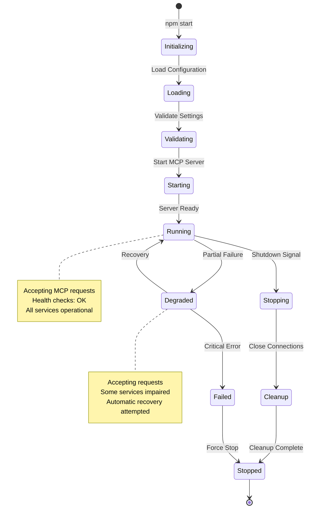
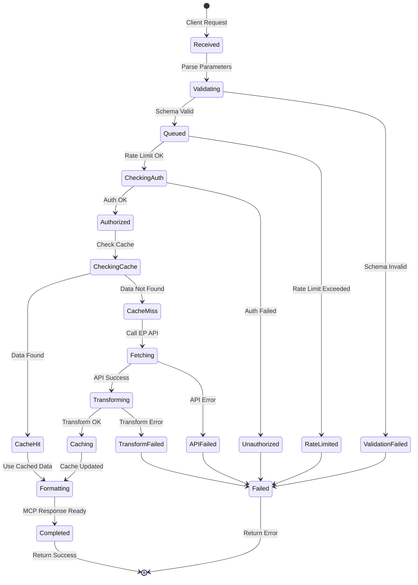
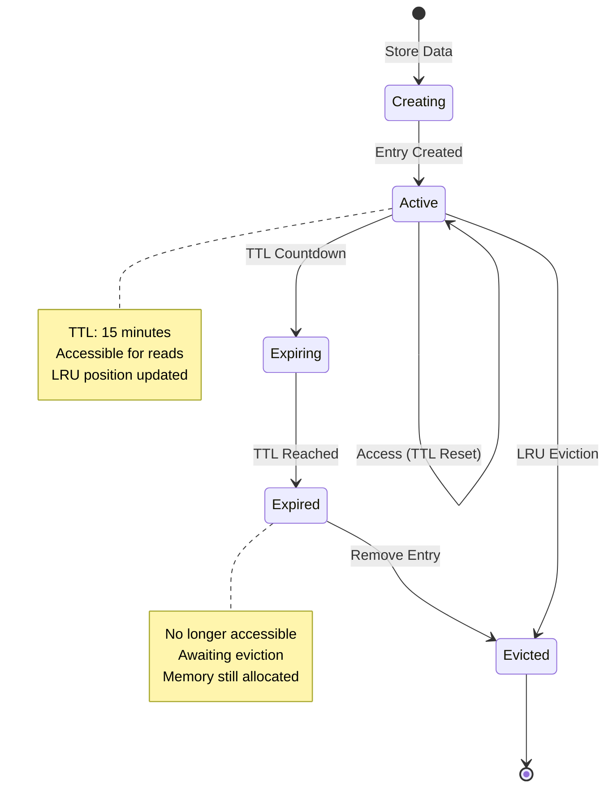
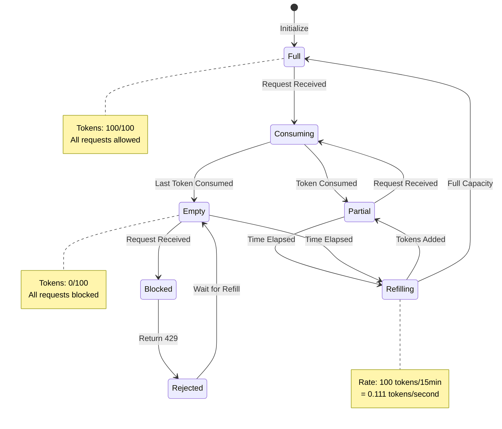
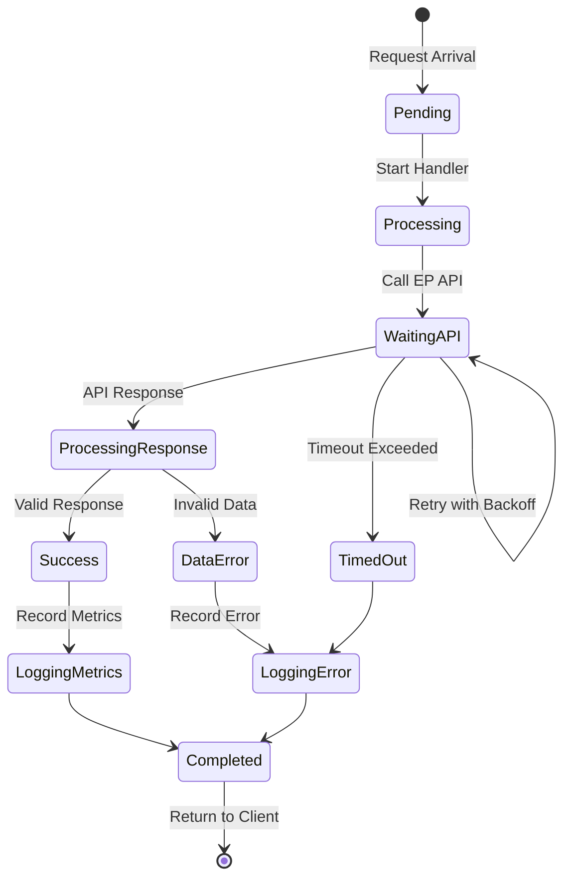
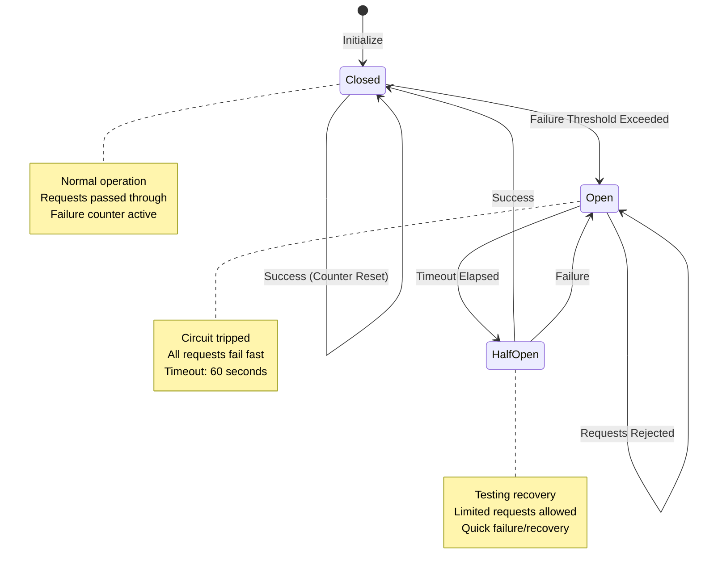
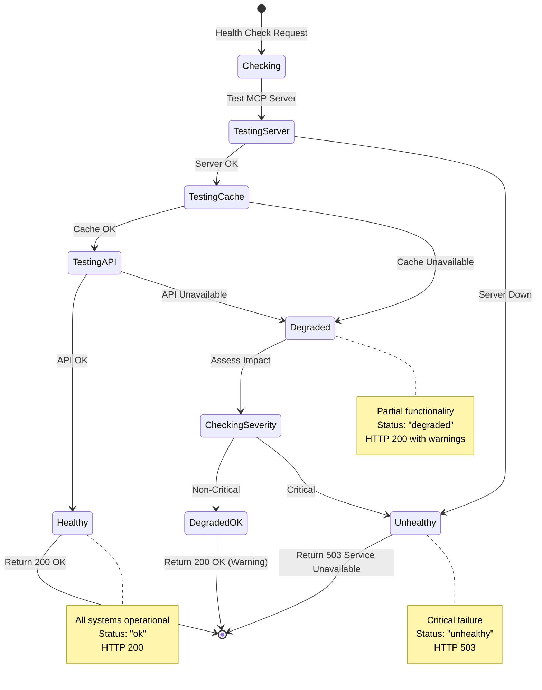

<p align="center">
  
</p>

<h1 align="center">📊 European Parliament MCP Server - State Diagrams</h1>

<p align="center">
  <strong>System State Transitions and Lifecycles</strong><br>
  <em>State Machine Documentation for Operations and Compliance</em>
</p>

<p align="center">
  <a href="#"></a>
  <a href="#"></a>
  <a href="#"></a>
  <a href="#"></a>
</p>

**📋 Document Owner:** Architecture Team | **📄 Version:** 1.0 | **📅 Last Updated:** 2026-02-17 (UTC)  
**🔄 Review Cycle:** Quarterly | **⏰ Next Review:** 2026-08-17  
**🏷️ Classification:** Public (Open Source MCP Server)  
**✅ ISMS Compliance:** ISO 27001 (A.12.1), NIST CSF 2.0 (PR.IP), CIS Controls v8.1 (4.1)

---

## 📋 Table of Contents

1. [Overview](#overview)
2. [Server Lifecycle States](#server-lifecycle-states)
3. [Tool Execution States](#tool-execution-states)
4. [Cache Entry Lifecycle](#cache-entry-lifecycle)
5. [Rate Limiter Token States](#rate-limiter-token-states)
6. [Request Processing States](#request-processing-states)
7. [Circuit Breaker States (Planned)](#circuit-breaker-states-planned)
8. [Health Check States](#health-check-states)

---

## 🎯 Overview

This document defines all state machines and state transitions in the European Parliament MCP Server. State diagrams ensure predictable behavior, aid debugging, and support audit compliance.

---

## 🚀 Server Lifecycle States



**State Descriptions:**
- **Initializing** - Loading modules, establishing connections
- **Loading** - Reading configuration from environment
- **Validating** - Checking configuration validity
- **Starting** - Initializing MCP server components
- **Running** - Fully operational, accepting requests
- **Degraded** - Partial functionality (e.g., cache unavailable)
- **Stopping** - Graceful shutdown in progress
- **Cleanup** - Closing connections, flushing logs
- **Failed** - Critical error, forced shutdown
- **Stopped** - Server terminated

---

## 🔧 Tool Execution States



**State Transitions:**
1. `Received` → `Validating` - Begin request processing
2. `Validating` → `Queued` - Input validation successful
3. `Queued` → `CheckingAuth` - Rate limit check passed
4. `CheckingAuth` → `Authorized` - Authentication successful
5. `Authorized` → `CheckingCache` - Check for cached response
6. `CheckingCache` → `CacheHit` - Found in cache
7. `CheckingCache` → `CacheMiss` - Not in cache
8. `CacheMiss` → `Fetching` - Fetch from EP API
9. `Fetching` → `Transforming` - API call successful
10. `Transforming` → `Caching` - Data transformation successful
11. `Caching` → `Formatting` - Cache updated
12. `Formatting` → `Completed` - MCP response formatted

---

## 💾 Cache Entry Lifecycle



**Cache States:**
- **Creating** - Entry being added to cache
- **Active** - Valid, accessible, TTL active
- **Expiring** - TTL countdown in progress
- **Expired** - TTL reached, no longer valid
- **Evicted** - Removed from cache (LRU or expired)

**TTL Management:**
- Initial TTL: 900 seconds (15 minutes)
- TTL reset on access: No (fixed TTL)
- Max cache size: 500 entries
- Eviction policy: LRU when size exceeded

---

## 🚦 Rate Limiter Token States



**Token Bucket States:**
- **Full** - All 100 tokens available
- **Consuming** - Token being removed for request
- **Partial** - Some tokens available (1-99)
- **Empty** - No tokens available, requests blocked
- **Refilling** - Tokens being added based on elapsed time
- **Blocked** - Request rejected due to no tokens
- **Rejected** - HTTP 429 response sent

**Refill Algorithm:**
```typescript
const elapsed = now - lastRefillTime;
const tokensToAdd = Math.floor(elapsed * refillRate);
const newTokens = Math.min(capacity, currentTokens + tokensToAdd);
```

---

## 🔄 Request Processing States



**Processing States:**
- **Pending** - Request queued, awaiting processing
- **Processing** - Handler executing business logic
- **WaitingAPI** - Awaiting external API response
- **ProcessingResponse** - Transforming API data
- **Success** - Request completed successfully
- **DataError** - Invalid response data received
- **TimedOut** - API call exceeded timeout
- **LoggingMetrics** - Recording success metrics
- **LoggingError** - Recording error metrics
- **Completed** - Final state, response sent

**Timeouts:**
- API call timeout: 30 seconds
- Total request timeout: 60 seconds
- Retry attempts: 3 with exponential backoff

---

## 🔄 Circuit Breaker States (Planned)



**Circuit Breaker Configuration (Planned Q3 2026):**
- **Failure Threshold**: 5 failures in 10 seconds
- **Open Duration**: 60 seconds
- **Half-Open Test Requests**: 3 requests
- **Success Threshold**: 2 consecutive successes
- **Scope**: Per EP API endpoint

**Benefits:**
- Prevent cascading failures
- Faster failure detection
- Automatic recovery testing
- Reduced load on failing services

---

## ✅ Health Check States



**Health Check Endpoints:**

**`GET /health`** - Basic liveness check
```json
{
  "status": "ok",
  "timestamp": "2026-02-17T22:40:00Z",
  "uptime": 86400
}
```

**`GET /health/ready`** - Readiness check
```json
{
  "status": "ok",
  "checks": {
    "server": "ok",
    "cache": "ok",
    "api": "ok"
  },
  "timestamp": "2026-02-17T22:40:00Z"
}
```

**`GET /health/detailed`** - Detailed diagnostics
```json
{
  "status": "degraded",
  "checks": {
    "server": {
      "status": "ok",
      "responseTime": "2ms"
    },
    "cache": {
      "status": "degraded",
      "message": "High eviction rate",
      "metrics": {
        "size": 495,
        "hitRate": 0.55
      }
    },
    "api": {
      "status": "ok",
      "responseTime": "234ms"
    }
  },
  "timestamp": "2026-02-17T22:40:00Z"
}
```

---

## 📋 ISMS Compliance

### ISO 27001 Controls
- **A.12.1.2** - Change Management: State transitions documented for audit
- **A.12.1.3** - Capacity Management: State-based resource allocation
- **A.12.4.1** - Event Logging: State transitions logged for audit trail

### NIST CSF 2.0 Functions
- **PR.IP-3** - Configuration Change Control: State machine definitions
- **DE.AE-3** - Event Data Collection: State transition logging
- **DE.CM-3** - Continuous Monitoring: Health check state monitoring

### CIS Controls v8.1
- **4.1** - Configuration Management: State definitions documented
- **8.2** - Audit Log Management: State transitions logged
- **12.3** - Secure Configuration: State machine enforcement

---

## 🔗 Related Documentation

- [FLOWCHART.md](./FLOWCHART.md) - Business process flows
- [SECURITY_ARCHITECTURE.md](./SECURITY_ARCHITECTURE.md) - Security implementation
- [ARCHITECTURE_DIAGRAMS.md](./ARCHITECTURE_DIAGRAMS.md) - C4 model diagrams
- [TROUBLESHOOTING.md](./TROUBLESHOOTING.md) - State-based debugging

---

<p align="center">
  <strong>Built with ❤️ by <a href="https://hack23.com">Hack23 AB</a></strong><br>
  <em>State diagram documentation following ISMS standards</em>
</p>
