<p align="center">
  
</p>

<h1 align="center">📊 European Parliament MCP Server — State Diagrams</h1>

<p align="center">
  <strong>System State Machines, Transitions, and Lifecycle Documentation</strong><br>
  <em>Comprehensive state modeling for a TypeScript/Node.js MCP server (stdio transport)</em>
</p>

<p align="center">
  <a href="#"></a>
  <a href="#"></a>
  <a href="#"></a>
  <a href="#"></a>
</p>

**📋 Document Owner:** Architecture Team | **📄 Version:** 0.6.2 | **📅 Last Updated:** 2025-06-20 (UTC)
**🔄 Review Cycle:** Quarterly | **⏰ Next Review:** 2025-09-20
**🏷️ Classification:** Public (Open Source MCP Server)
**✅ ISMS Compliance:** ISO 27001 (A.12.1, A.12.4), NIST CSF 2.0 (PR.IP, DE.AE, DE.CM), CIS Controls v8.1 (4.1, 8.2)

---

## 📋 Table of Contents

1. [Architecture Documentation Map](#-architecture-documentation-map)
2. [Overview](#-overview)
3. [MCP Server Lifecycle](#-mcp-server-lifecycle)
4. [MCP Request Processing](#-mcp-request-processing)
5. [Tool Execution Pipeline](#-tool-execution-pipeline)
6. [EP API Client State Machine](#-ep-api-client-state-machine)
7. [Cache Entry Lifecycle](#-cache-entry-lifecycle)
8. [Rate Limiter Token Bucket](#-rate-limiter-token-bucket)
9. [OSINT Analysis Pipeline](#-osint-analysis-pipeline)
10. [State Diagram Legend](#-state-diagram-legend)
11. [ISMS Compliance](#-isms-compliance)
12. [Related Documentation](#-related-documentation)

---

## 🗺️ Architecture Documentation Map

| Document | Current | Future | Description |
|----------|---------|--------|-------------|
| **Architecture** | [ARCHITECTURE.md](./ARCHITECTURE.md) | [FUTURE_ARCHITECTURE.md](./FUTURE_ARCHITECTURE.md) | C4 model, containers, components |
| **Data Model** | [DATA_MODEL.md](./DATA_MODEL.md) | [FUTURE_DATA_MODEL.md](./FUTURE_DATA_MODEL.md) | Entity relationships and schemas |
| **Flowchart** | [FLOWCHART.md](./FLOWCHART.md) | [FUTURE_FLOWCHART.md](./FUTURE_FLOWCHART.md) | Request processing and data flows |
| **Mind Map** | [MINDMAP.md](./MINDMAP.md) | [FUTURE_MINDMAP.md](./FUTURE_MINDMAP.md) | System concepts and relationships |
| **State Diagram** | **STATEDIAGRAM.md** *(this document)* | [FUTURE_STATEDIAGRAM.md](./FUTURE_STATEDIAGRAM.md) | System state transitions and lifecycles |
| **SWOT Analysis** | [SWOT.md](./SWOT.md) | [FUTURE_SWOT.md](./FUTURE_SWOT.md) | Strategic positioning |
| **Workflows** | [WORKFLOWS.md](./WORKFLOWS.md) | [FUTURE_WORKFLOWS.md](./FUTURE_WORKFLOWS.md) | CI/CD pipeline documentation |
| **Security Architecture** | [SECURITY_ARCHITECTURE.md](./SECURITY_ARCHITECTURE.md) | [FUTURE_SECURITY_ARCHITECTURE.md](./FUTURE_SECURITY_ARCHITECTURE.md) | Security controls and design |
| **Threat Model** | [THREAT_MODEL.md](./THREAT_MODEL.md) | — | STRIDE-based threat analysis |
| **CRA Assessment** | [CRA-ASSESSMENT.md](./CRA-ASSESSMENT.md) | — | EU Cyber Resilience Act review |
| **Architecture Diagrams** | [ARCHITECTURE_DIAGRAMS.md](./ARCHITECTURE_DIAGRAMS.md) | — | Supplementary C4 diagrams |

---

## 🎯 Overview

This document defines all state machines and state transitions for the **European Parliament MCP Server v0.6.2** — a TypeScript/Node.js server implementing the Model Context Protocol over stdio transport. The server exposes **28 tools**, **6 resources**, and **6 prompts** for querying the EP Open Data Portal API v2 (`https://data.europarl.europa.eu/api/v2/`).

State diagrams provide:

- **Predictable behavior** — every component follows a well-defined state machine
- **Audit compliance** — state transitions are logged and traceable per ISO 27001 A.12.4.1
- **Debugging support** — each error state has a clear entry path and recovery strategy
- **Operational visibility** — operators can identify system state at any point in time

### System at a Glance

| Component | States | Key Transitions | Implementation |
|-----------|--------|-----------------|----------------|
| MCP Server Lifecycle | 5 | Init → Ready → Processing → Shutdown | `src/index.ts` |
| MCP Request Processing | 6 | Received → Validated → Dispatched → Complete | `server.setRequestHandler()` |
| Tool Execution | 5 | Validate → Cache → API → Transform → Respond | `src/tools/*.ts` |
| EP API Client | 6 | Idle → Request → Retry → Response | `src/clients/europeanParliamentClient.ts` |
| LRU Cache Entry | 5 | Empty → Populated → Active → Stale → Evicted | `lru-cache` (500 entries, 15-min TTL) |
| Rate Limiter | 5 | Full → Consuming → Partial → Empty → Refilling | `src/utils/rateLimiter.ts` |
| OSINT Analysis | 5 | Collect → Aggregate → Compute → Report → Complete | `src/tools/analyze*.ts` |

---

## 🚀 MCP Server Lifecycle

The server lifecycle models the complete life of an `EuropeanParliamentMCPServer` instance from process start to termination. The server is instantiated in `src/index.ts`, creates a `StdioServerTransport`, and calls `server.connect(transport)` to enter the Ready state.


### State Descriptions

| State | Description | Entry Condition | Exit Condition |
|-------|-------------|-----------------|----------------|
| **Initializing** | Reads environment variables (`EP_API_URL`, `EP_CACHE_TTL`, `EP_RATE_LIMIT`), instantiates `Server` with capabilities (tools, resources, prompts), registers all 28 tool handlers, 6 resource handlers, and 6 prompt handlers, creates `StdioServerTransport` | Process start (`npm start`) | `server.connect(transport)` resolves |
| **Ready** | Listening on stdin for JSON-RPC messages, all handlers registered, LRU cache initialized (500 max entries), rate limiter active (60 req/min default) | Transport connected | Request arrives or shutdown signal |
| **Processing** | Actively executing an MCP request (tool call, resource read, or prompt get) | JSON-RPC message parsed from stdin | Response written to stdout |
| **ShuttingDown** | Graceful shutdown initiated, in-flight requests drain, transport closes | `SIGINT`, `SIGTERM`, or stdin EOF | All connections closed |
| **Terminated** | Process exited, all resources released | Shutdown complete or fatal error | `process.exit()` |

### Key Implementation Details

```typescript
// src/index.ts — Server startup sequence
const server = new EuropeanParliamentMCPServer();
server.start().catch((error) => {
  console.error('Fatal error:', error);
  process.exit(1);  // Initializing → Terminated
});

// Inside start():
const transport = new StdioServerTransport();
await this.server.connect(transport);  // Initializing → Ready
```

---

## 🔄 MCP Request Processing

Every MCP request (tool call, resource read, or prompt get) follows the same processing pipeline. The MCP SDK parses JSON-RPC messages from stdin, validates the message format, and dispatches to the appropriate registered handler.


### Handler Dispatch Map

| Method | Handler Count | Example | Registration |
|--------|---------------|---------|-------------|
| `tools/list` | 1 | Returns metadata for all 28 tools | `ListToolsRequestSchema` |
| `tools/call` | 28 | `get_meps`, `analyze_voting_patterns` | `CallToolRequestSchema` → `dispatchToolCall()` |
| `resources/list` | 1 | Returns 6 resource templates | `ListResourcesRequestSchema` |
| `resources/read` | 6 | `ep://meps/{mepId}`, `ep://committees/{id}` | `ReadResourceRequestSchema` |
| `prompts/list` | 1 | Returns 6 prompt templates | `ListPromptsRequestSchema` |
| `prompts/get` | 6 | `mep_briefing`, `coalition_analysis` | `GetPromptRequestSchema` |

### Request-Response Flow

```typescript
// Registration (src/index.ts)
server.setRequestHandler(CallToolRequestSchema, async (request) => {
  const { name, arguments: args } = request.params;
  return await this.dispatchToolCall(name, args);  // Dispatching → Executing
});

// Dispatch (src/index.ts — 28 tool mappings)
private async dispatchToolCall(name: string, args: unknown) {
  switch (name) {
    case 'get_meps':        return handleGetMEPs(this.client, args);
    case 'get_mep_details': return handleGetMEPDetails(this.client, args);
    // ... 26 more tools
  }
}
```

---

## 🔧 Tool Execution Pipeline

Each of the 28 tools follows the same execution pipeline: input validation via Zod schema, LRU cache check, EP API HTTP call (if cache miss), JSON-LD response transformation, and MCP response formatting. Error states branch at each stage.


### Zod Schema Validation Example

All 28 tools define strict Zod schemas for input validation:

```typescript
// src/tools/analyzeCountryDelegation.ts
export const AnalyzeCountryDelegationSchema = z.object({
  country: z.string()
    .length(2)
    .regex(/^[A-Z]{2}$/, 'Country code must be 2 uppercase letters')
    .describe('ISO 3166-1 alpha-2 country code'),
  dateFrom: z.string()
    .regex(/^\d{4}-\d{2}-\d{2}$/, 'Date must be YYYY-MM-DD format')
    .optional()
    .describe('Start date for analysis period'),
});
```

### Error State Transitions

| Error State | Trigger | MCP Response |
|-------------|---------|-------------|
| `SchemaInvalid` | Zod validation fails (missing/malformed fields) | `isError: true` with validation details |
| `RateLimited` | Token bucket empty (60 req/min exceeded) | `isError: true` with "Rate limit exceeded" |
| `APIFailure` | HTTP 4xx/5xx after 2 retries exhausted | `isError: true` with EP API error details |
| `TransformError` | Unexpected JSON-LD structure | `isError: true` with parse error |

---

## 🌐 EP API Client State Machine

The `EuropeanParliamentClient` manages all HTTP communication with the EP Open Data Portal API v2 (`https://data.europarl.europa.eu/api/v2/`). It implements LRU caching, rate limiting, retry with exponential backoff, and configurable timeouts.


### Client Configuration

| Parameter | Default | Env Variable | Description |
|-----------|---------|--------------|-------------|
| Base URL | `https://data.europarl.europa.eu/api/v2/` | `EP_API_URL` | EP Open Data Portal endpoint |
| Cache TTL | 900,000 ms (15 min) | `EP_CACHE_TTL` | LRU cache time-to-live |
| Max Cache Size | 500 entries | — | Maximum LRU cache entries |
| Request Timeout | 10,000 ms (10 s) | — | Per-request HTTP timeout |
| Max Retries | 2 | — | Retry attempts (3 total calls) |
| Retry Delay | 1,000 ms base | — | Exponential backoff base |
| Rate Limit | 60 req/min | `EP_RATE_LIMIT` | Token bucket capacity |

### Retry Backoff Schedule

```
Attempt 0: immediate request
Attempt 1: 1,000 ms delay  (1s)
Attempt 2: 2,000 ms delay  (2s)
─────────────────────────────────
Total max wait: 3,000 ms + request time
```

```typescript
// src/utils/timeout.ts — Exponential backoff
const delay = retryDelayMs * Math.pow(2, attempt);
// attempt 0 → 1000ms, attempt 1 → 2000ms
```

### Retry Decision Logic

| Condition | Retry? | Reason |
|-----------|--------|--------|
| HTTP 5xx | ✅ Yes | Server error, may be transient |
| Network error | ✅ Yes | Connection failure, may recover |
| HTTP 4xx | ❌ No | Client error, retrying won't help |
| Timeout | ❌ No | `TimeoutError` — not retried |
| HTTP 200 | ❌ N/A | Success, no retry needed |

---

## 💾 Cache Entry Lifecycle

The server uses an in-memory LRU cache (`lru-cache` npm package) to reduce redundant EP API calls. Each cache entry has a fixed TTL of 15 minutes. When the cache reaches 500 entries, the least recently used entry is evicted.

```mermaid
stateDiagram-v2
    [*] --> Empty: cache initialized (max: 500)

    Empty --> Populated: cache.set(key, data)

    state Populated {
        [*] --> Active: TTL starts (900,000ms)
        Active --> Active: cache.get(key) — hit
        Active --> Stale: TTL expired (15 min)
    }

    Populated --> Active: entry accessible
    Active --> Evicted: LRU eviction (cache full)
    Stale --> Evicted: accessed after TTL → miss

    Evicted --> Empty: slot freed
    Evicted --> [*]

    note right of Active
        ✅ Accessible for reads
        ⏱️ Fixed TTL: 15 minutes
        📊 LRU position updated on access
        🔑 Key: JSON.stringify({endpoint, params})
    end note

    note right of Stale
        ❌ No longer served
        ⏱️ TTL exceeded
        🗑️ Evicted on next access or LRU sweep
    end note

    note right of Empty
        📦 Slot available
        📊 Cache size < 500
    end note

    classDef empty fill:#78909C,stroke:#37474F,color:#fff
    classDef active fill:#66BB6A,stroke:#2E7D32,color:#fff
    classDef stale fill:#FFA726,stroke:#E65100,color:#fff
    classDef evicted fill:#EF5350,stroke:#B71C1C,color:#fff

    class Empty empty
    class Active active
    class Stale stale
    class Evicted evicted
```



### Cache Configuration

| Parameter | Value | Source |
|-----------|-------|--------|
| Implementation | `lru-cache` npm package | `src/clients/europeanParliamentClient.ts` |
| Max Entries | 500 (`DEFAULT_MAX_CACHE_SIZE`) | Hardcoded constant |
| TTL | 900,000 ms / 15 min (`DEFAULT_CACHE_TTL_MS`) | `EP_CACHE_TTL` env override |
| TTL Reset on Access | No (fixed TTL from creation) | LRU cache config |
| Eviction Policy | Least Recently Used (when full) | `lru-cache` default |
| Cache Key | `JSON.stringify({endpoint, params})` | Deterministic serialization |

### Cache Performance Targets

| Metric | Target | Description |
|--------|--------|-------------|
| P50 (cached) | < 100 ms | Median response time for cache hits |
| P95 (cached) | < 200 ms | 95th percentile for cache hits |
| P99 (uncached) | < 2,000 ms | 99th percentile for API calls |

---

## 🚦 Rate Limiter Token Bucket

The `RateLimiter` class (`src/utils/rateLimiter.ts`) implements a token bucket algorithm to control request throughput to the EP API. The default configuration allows 60 requests per minute, configurable via `EP_RATE_LIMIT`.

```mermaid
stateDiagram-v2
    [*] --> Full: initialize (60 tokens)

    Full --> Consuming: removeTokens(1)
    Consuming --> Partial: tokens remaining > 0
    Consuming --> Empty: last token consumed

    Partial --> Consuming: removeTokens(1)
    Partial --> Refilling: interval elapsed

    Empty --> Blocked: removeTokens(1) — no tokens
    Empty --> Refilling: interval elapsed

    Refilling --> Partial: tokens added (< capacity)
    Refilling --> Full: tokens restored to capacity

    Blocked --> Rejected: throw "Rate limit exceeded"
    Rejected --> Empty: await refill

    note right of Full
        🟢 All tokens available
        Capacity: 60 tokens/min
        All requests allowed
    end note

    note right of Empty
        🔴 No tokens available
        All requests blocked
        Awaiting refill interval
    end note

    note right of Refilling
        🔄 Tokens replenished
        Rate: 1 token/second
        Up to capacity (60)
    end note

    classDef full fill:#66BB6A,stroke:#2E7D32,color:#fff
    classDef partial fill:#42A5F5,stroke:#1565C0,color:#fff
    classDef empty fill:#EF5350,stroke:#B71C1C,color:#fff
    classDef refill fill:#FFA726,stroke:#E65100,color:#fff
    classDef blocked fill:#FF7043,stroke:#BF360C,color:#fff

    class Full full
    class Partial partial
    class Empty empty
    class Refilling refill
    class Blocked blocked
    class Rejected blocked
```



### Token Bucket Configuration

| Parameter | Default | Env Variable | Description |
|-----------|---------|--------------|-------------|
| Capacity | 60 tokens | `EP_RATE_LIMIT` | Maximum tokens in bucket |
| Interval | per minute | — | Token refill interval |
| Tokens per Request | 1 | — | Tokens consumed per API call |
| Behavior on Empty | Throw error | — | `"Rate limit exceeded"` |

### Rate Limiter API

```typescript
// src/utils/rateLimiter.ts
class RateLimiter {
  removeTokens(count: number): void;     // Consume tokens (throws if empty)
  tryRemoveTokens(count: number): boolean; // Non-throwing variant
  reset(): void;                          // Restore to full capacity
  getAvailableTokens(): number;           // Current token count
}
```

---

## 🔍 OSINT Analysis Pipeline

The OSINT (Open Source Intelligence) analysis tools follow a multi-stage data processing pipeline. These tools — including `assess_mep_influence`, `analyze_coalition_dynamics`, `detect_voting_anomalies`, and `generate_political_landscape` — collect data from multiple EP API endpoints, aggregate results, perform statistical computation, and generate formatted intelligence reports.


### OSINT Tool Categories

| Phase | Tools | Data Sources |
|-------|-------|-------------|
| **Phase 1 — Intelligence** | `assess_mep_influence`, `analyze_coalition_dynamics`, `detect_voting_anomalies`, `compare_political_groups`, `analyze_legislative_effectiveness`, `monitor_legislative_pipeline` | MEPs, votes, procedures |
| **Phase 2 — Activity** | `analyze_committee_activity`, `track_mep_attendance` | Committees, events |
| **Phase 3 — Geographic** | `analyze_country_delegation`, `generate_political_landscape` | MEPs by country, parties |
| **Core Analysis** | `analyze_voting_patterns`, `track_legislation`, `generate_report` | Cross-cutting data |

### Pipeline Characteristics

| Aspect | Detail |
|--------|--------|
| **Data Collection** | 2–6 parallel EP API calls per analysis tool |
| **Aggregation** | In-memory data merging and normalization |
| **Computation** | Statistical metrics (influence scores, voting coherence, anomaly detection) |
| **Output Format** | Structured Markdown text in MCP `content[]` response |
| **Caching** | Each underlying API call is individually cached (15-min TTL) |
| **Error Handling** | Partial results returned when possible; full error on critical failure |

---

## 🎨 State Diagram Legend

All state diagrams in this document use consistent color coding to indicate state categories:


| Color | Category | Usage |
|-------|----------|-------|
| 🔵 Blue (`#42A5F5`) | Initialization / Request | States during setup, incoming requests, cache operations |
| 🟢 Green (`#66BB6A`) | Active / Success | Healthy operational states, successful completions |
| 🟠 Orange (`#FFA726`) | Processing / Warning | In-progress states, retry logic, degraded conditions |
| 🟣 Purple (`#AB47BC`) | Validation | Schema validation, data transformation stages |
| 🔴 Red (`#EF5350`) | Error / Failure | Error states, rate limit blocks, API failures |
| ⚫ Gray (`#78909C`) | Terminal / Idle | Idle states, terminated processes, evicted entries |

---

## 📋 ISMS Compliance

### ISO 27001 Controls

| Control | Title | State Diagram Relevance |
|---------|-------|------------------------|
| **A.12.1.2** | Change Management | State transitions documented; changes to state machines require review |
| **A.12.1.3** | Capacity Management | Cache and rate limiter states enforce resource boundaries |
| **A.12.4.1** | Event Logging | All state transitions logged to stderr for audit trail |
| **A.12.6.1** | Technical Vulnerability Management | Error states trigger logging for vulnerability detection |

### NIST CSF 2.0 Functions

| Function | Category | State Diagram Relevance |
|----------|----------|------------------------|
| **PR.IP-3** | Configuration Change Control | State machine definitions version-controlled in Git |
| **DE.AE-3** | Event Data Collection | State transitions produce structured log events |
| **DE.CM-3** | Continuous Monitoring | Server lifecycle states enable health monitoring |
| **RS.MI-1** | Incident Mitigation | Error states define containment and recovery paths |

### CIS Controls v8.1

| Control | Title | State Diagram Relevance |
|---------|-------|------------------------|
| **4.1** | Secure Configuration | State machines enforce secure default configurations |
| **8.2** | Audit Log Management | State transitions generate timestamped audit records |
| **8.5** | Detailed Audit Logging | Error states capture complete context for forensic analysis |
| **12.3** | Secure Network Infrastructure | Rate limiter states enforce API call boundaries |

---

## 🔗 Related Documentation

- [ARCHITECTURE.md](./ARCHITECTURE.md) — C4 model, containers, and component architecture
- [FLOWCHART.md](./FLOWCHART.md) — Request processing and data flow diagrams
- [DATA_MODEL.md](./DATA_MODEL.md) — Entity relationships and Zod schemas
- [MINDMAP.md](./MINDMAP.md) — System concepts and feature relationships
- [SECURITY_ARCHITECTURE.md](./SECURITY_ARCHITECTURE.md) — Security controls and threat boundaries
- [THREAT_MODEL.md](./THREAT_MODEL.md) — STRIDE-based threat analysis
- [WORKFLOWS.md](./WORKFLOWS.md) — CI/CD pipeline and release workflows
- [FUTURE_STATEDIAGRAM.md](./FUTURE_STATEDIAGRAM.md) — Planned state machine enhancements

---

<p align="center">
  <strong>Built with ❤️ by <a href="https://hack23.com">Hack23 AB</a></strong><br>
  <em>State diagram documentation following ISMS standards — ISO 27001, NIST CSF 2.0, CIS Controls v8.1</em>
</p>
