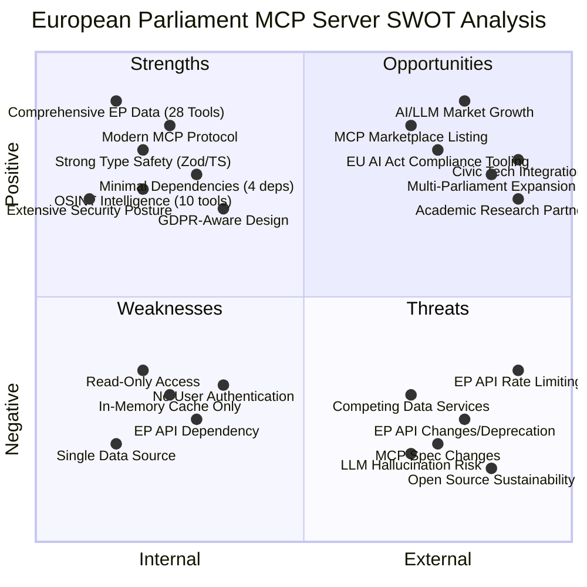
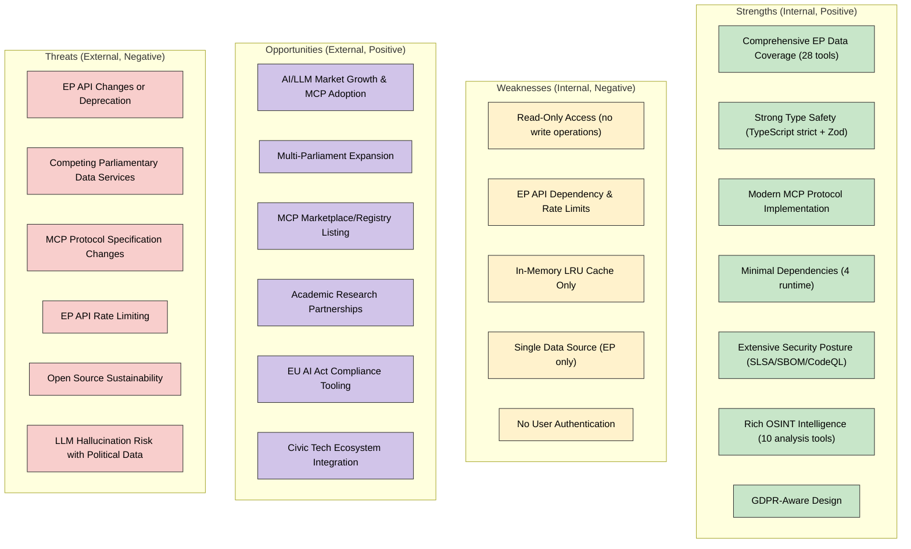
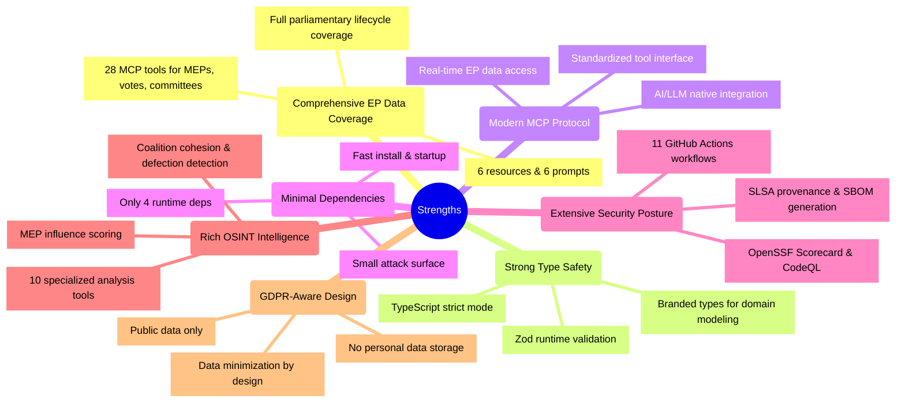
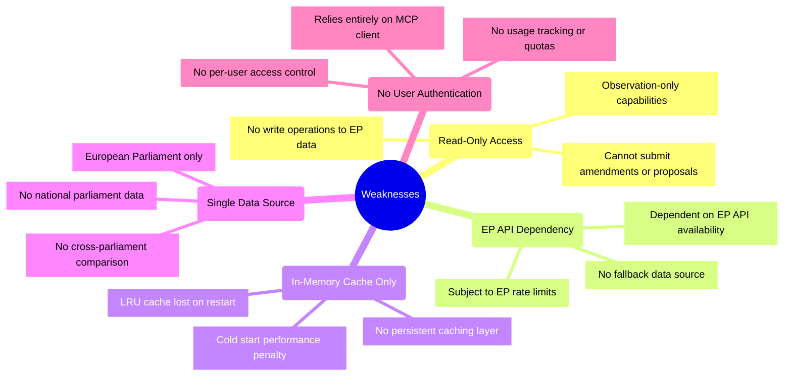
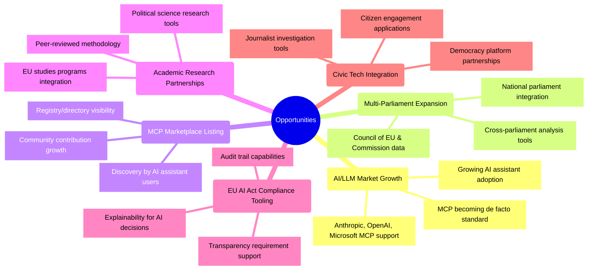
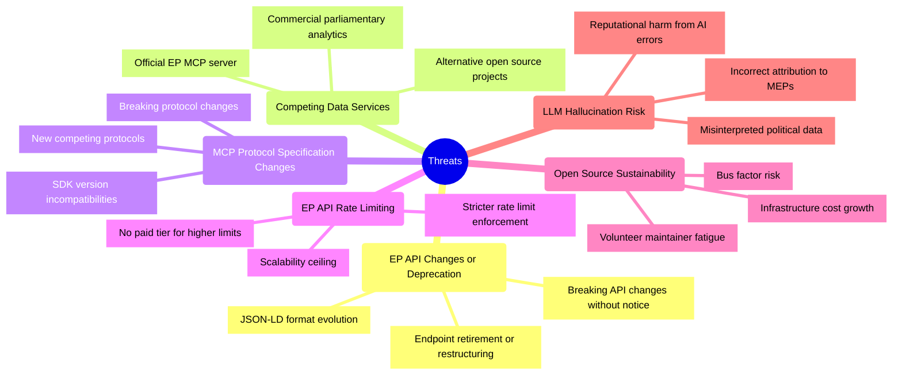
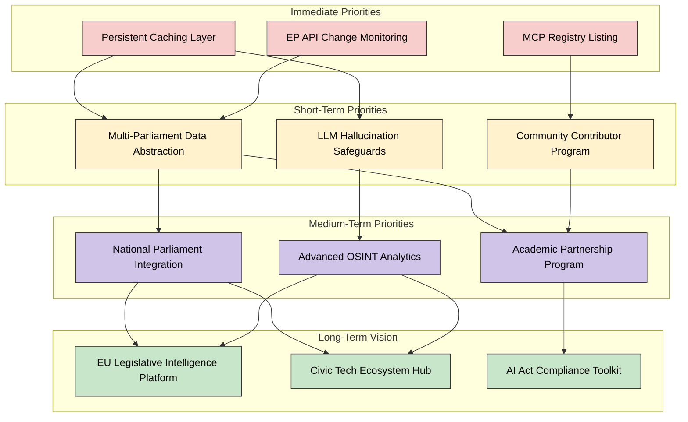
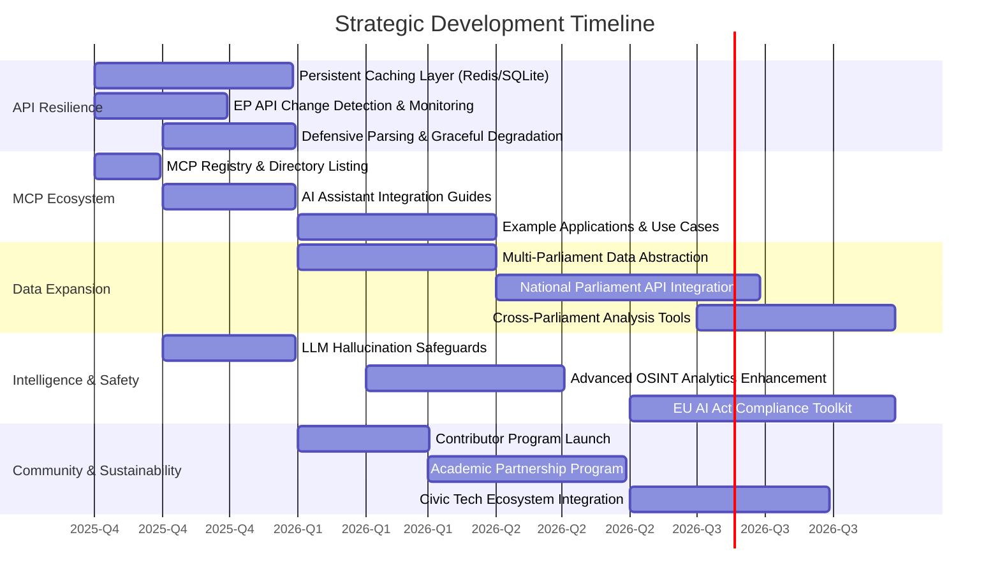

  

<h1 align="center">🧩 European Parliament MCP Server — SWOT Analysis</h1>

  <strong>💼 Strategic Assessment for European Parliament MCP Server</strong> 
  <em>🎯 Strengths, Weaknesses, Opportunities, and Threats Analysis</em>

  
  
  
  

**📋 Document Owner:** CEO | **📄 Version:** 0.6.2 | **📅 Last Updated:** 2025-09-18 (UTC)  
**🔄 Review Cycle:** Annual | **⏰ Next Review:** 2026-09-18

---

## 🎯 Purpose

This document provides a strategic analysis of the European Parliament MCP Server's current strengths, weaknesses, opportunities, and threats. This analysis helps inform the roadmap for future development and strategic decision-making. The EP MCP Server (v0.6.2) is a TypeScript/Node.js implementation of the Model Context Protocol providing AI assistants with structured access to European Parliament Open Data, featuring 28 tools, 6 resources, 6 prompts, and 10 OSINT intelligence analysis capabilities.

## 📚 Related Architecture Documentation

| Document | Focus | Description | Documentation Link |
| --- | --- | --- | --- |
| **[Architecture](ARCHITECTURE.md)** | 🏛️ Architecture | C4 model showing current system structure | [View Source](https://github.com/Hack23/European-Parliament-MCP-Server/blob/main/ARCHITECTURE.md) |
| **[Future Architecture](FUTURE_ARCHITECTURE.md)** | 🏛️ Architecture | C4 model showing future system structure | [View Source](https://github.com/Hack23/European-Parliament-MCP-Server/blob/main/FUTURE_ARCHITECTURE.md) |
| **[Architecture Diagrams](ARCHITECTURE_DIAGRAMS.md)** | 🏛️ Architecture | Detailed architectural visualizations | [View Source](https://github.com/Hack23/European-Parliament-MCP-Server/blob/main/ARCHITECTURE_DIAGRAMS.md) |
| **[Mindmaps](MINDMAP.md)** | 🧠 Concept | Current system component relationships | [View Source](https://github.com/Hack23/European-Parliament-MCP-Server/blob/main/MINDMAP.md) |
| **[Future Mindmaps](FUTURE_MINDMAP.md)** | 🧠 Concept | Future capability evolution | [View Source](https://github.com/Hack23/European-Parliament-MCP-Server/blob/main/FUTURE_MINDMAP.md) |
| **[SWOT Analysis](SWOT.md)** | 💼 Business | Current strategic assessment | [View Source](https://github.com/Hack23/European-Parliament-MCP-Server/blob/main/SWOT.md) |
| **[Future SWOT Analysis](FUTURE_SWOT.md)** | 💼 Business | Future strategic opportunities | [View Source](https://github.com/Hack23/European-Parliament-MCP-Server/blob/main/FUTURE_SWOT.md) |
| **[Data Model](DATA_MODEL.md)** | 📊 Data | Current data structures and relationships | [View Source](https://github.com/Hack23/European-Parliament-MCP-Server/blob/main/DATA_MODEL.md) |
| **[Future Data Model](FUTURE_DATA_MODEL.md)** | 📊 Data | Enhanced parliamentary data architecture | [View Source](https://github.com/Hack23/European-Parliament-MCP-Server/blob/main/FUTURE_DATA_MODEL.md) |
| **[Flowcharts](FLOWCHART.md)** | 🔄 Process | Current data processing workflows | [View Source](https://github.com/Hack23/European-Parliament-MCP-Server/blob/main/FLOWCHART.md) |
| **[Future Flowcharts](FUTURE_FLOWCHART.md)** | 🔄 Process | Enhanced AI-driven workflows | [View Source](https://github.com/Hack23/European-Parliament-MCP-Server/blob/main/FUTURE_FLOWCHART.md) |
| **[State Diagrams](STATEDIAGRAM.md)** | 🔄 Behavior | Current system state transitions | [View Source](https://github.com/Hack23/European-Parliament-MCP-Server/blob/main/STATEDIAGRAM.md) |
| **[Future State Diagrams](FUTURE_STATEDIAGRAM.md)** | 🔄 Behavior | Enhanced adaptive state transitions | [View Source](https://github.com/Hack23/European-Parliament-MCP-Server/blob/main/FUTURE_STATEDIAGRAM.md) |
| **[CI/CD Workflows](WORKFLOWS.md)** | 🔧 DevOps | Current automation processes | [View Source](https://github.com/Hack23/European-Parliament-MCP-Server/blob/main/WORKFLOWS.md) |
| **[Future Workflows](FUTURE_WORKFLOWS.md)** | 🔧 DevOps | Enhanced CI/CD with ML | [View Source](https://github.com/Hack23/European-Parliament-MCP-Server/blob/main/FUTURE_WORKFLOWS.md) |
| **[End-of-Life Strategy](End-of-Life-Strategy.md)** | 📅 Lifecycle | Maintenance and EOL planning | [View Source](https://github.com/Hack23/European-Parliament-MCP-Server/blob/main/End-of-Life-Strategy.md) |
| **[Financial Security Plan](FinancialSecurityPlan.md)** | 💰 Security | Cost and security implementation | [View Source](https://github.com/Hack23/European-Parliament-MCP-Server/blob/main/FinancialSecurityPlan.md) |
| **[Security Architecture](SECURITY_ARCHITECTURE.md)** | 🛡️ Security | Defense-in-depth security overview | [View Source](https://github.com/Hack23/European-Parliament-MCP-Server/blob/main/SECURITY_ARCHITECTURE.md) |
| **[Future Security Architecture](FUTURE_SECURITY_ARCHITECTURE.md)** | 🛡️ Security | Future security posture roadmap | [View Source](https://github.com/Hack23/European-Parliament-MCP-Server/blob/main/FUTURE_SECURITY_ARCHITECTURE.md) |
| **[Threat Model](THREAT_MODEL.md)** | 🛡️ Security | STRIDE/MITRE threat analysis | [View Source](https://github.com/Hack23/European-Parliament-MCP-Server/blob/main/THREAT_MODEL.md) |
| **[CRA Assessment](CRA-ASSESSMENT.md)** | 🛡️ Compliance | EU Cyber Resilience Act conformity | [View Source](https://github.com/Hack23/European-Parliament-MCP-Server/blob/main/CRA-ASSESSMENT.md) |
| **[BCP Plan](BCPPlan.md)** | 🛡️ Continuity | Business continuity planning | [View Source](https://github.com/Hack23/European-Parliament-MCP-Server/blob/main/BCPPlan.md) |
| **[API Usage Guide](API_USAGE_GUIDE.md)** | 📖 Guide | EP API integration reference | [View Source](https://github.com/Hack23/European-Parliament-MCP-Server/blob/main/API_USAGE_GUIDE.md) |
| **[Performance Guide](PERFORMANCE_GUIDE.md)** | ⚡ Performance | Performance optimization reference | [View Source](https://github.com/Hack23/European-Parliament-MCP-Server/blob/main/PERFORMANCE_GUIDE.md) |

## SWOT Overview

### Traditional SWOT Quadrant Chart

**Strategic Focus:** This quadrant chart provides a visual representation of the European Parliament MCP Server's strengths, weaknesses, opportunities, and threats arranged by their internal/external nature and positive/negative impact.

### Alternative Network Visualization

<!-- Quadrant charts are not well supported in GitHub Markdown, so providing an alternative mermaid diagram -->

## Strengths

### Current Strengths Analysis

The European Parliament MCP Server has established several key strengths that provide a solid foundation for its mission of enabling AI-powered access to European Parliament data:

1. **Comprehensive EP Data Coverage**: The server provides 28 specialized MCP tools covering the full parliamentary lifecycle — MEPs, plenary sessions, votes, committees, legislative documents, procedures, events, speeches, and declarations — with 6 resources and 6 prompts offering structured access patterns for AI assistants.

2. **Strong Type Safety**: Built with TypeScript strict mode and Zod runtime validation throughout, the codebase employs branded types for domain modeling (e.g., `MepId`, `CommitteeId`), ensuring data integrity from API ingestion through to MCP response serialization with zero runtime type errors.

3. **Modern MCP Protocol Implementation**: As the first and only MCP server for European Parliament data, the platform enables AI assistants (Claude, GPT, Copilot) to query parliamentary data natively through the Model Context Protocol, eliminating the need for custom API client development.

4. **Minimal Dependencies**: With only 4 runtime dependencies (`@modelcontextprotocol/sdk`, `lru-cache`, `undici`, `zod`), the server maintains a minimal attack surface, fast installation, and reduced supply chain risk compared to typical Node.js projects.

5. **Extensive Security Posture**: The project implements SLSA build provenance, SBOM generation (CycloneDX), OpenSSF Scorecard monitoring, CodeQL static analysis, and dependency review across 11 GitHub Actions workflows, establishing defense-in-depth security practices.

6. **Rich OSINT Intelligence Capabilities**: Beyond raw data access, 10 specialized analysis tools provide MEP influence scoring (5-dimension model), coalition cohesion analysis, party defection detection, cross-group comparisons, legislative pipeline tracking, and political landscape assessments.

7. **GDPR-Aware Design**: The server processes only publicly available EP data with no persistent personal data storage, implementing data minimization by design and relying on the in-memory LRU cache that is automatically cleared on restart.

## Weaknesses

### Current Weaknesses Analysis

Several weaknesses present challenges for the ongoing development and adoption of the platform:

1. **Read-Only Access**: The server provides observation-only access to European Parliament data with no write operations. While appropriate for a transparency tool, this limits use cases for organizations that need to interact with parliamentary processes programmatically.

2. **EP API Dependency**: The server is entirely dependent on the European Parliament Open Data Portal API (v2) for its data. Any EP API outages, rate limit changes, or deprecations directly impact service availability with no fallback data source available.

3. **In-Memory Cache Only**: The LRU cache (`lru-cache`) operates exclusively in-memory, meaning all cached data is lost on server restart. This results in cold-start performance penalties and increased EP API load after deployments or crashes.

4. **Single Data Source**: Coverage is limited to the European Parliament, with no integration of national parliament data from EU member states. This prevents cross-parliament comparisons and limits the platform's value for comprehensive EU legislative tracking.

5. **No User Authentication**: The server relies entirely on the MCP client for authentication and authorization, providing no built-in user management, access control, usage tracking, or rate limiting per user — limiting the ability to offer tiered service levels.

## Opportunities

### Future Opportunities Analysis

Looking forward, several opportunities exist for growth and enhancement:

1. **AI/LLM Market Growth Driving MCP Adoption**: The rapid expansion of AI assistants from Anthropic (Claude), OpenAI, and Microsoft — all supporting or adopting MCP — creates a growing addressable market. As MCP becomes the de facto standard for tool integration, the EP MCP Server benefits from ecosystem-wide adoption without additional marketing investment.

2. **Multi-Parliament Expansion**: Extending coverage beyond the European Parliament to national parliaments (Bundestag, Assemblée nationale, Riksdag) and other EU institutions (Council of the EU, European Commission) would create a comprehensive EU legislative intelligence platform with cross-institution analysis capabilities.

3. **MCP Marketplace/Registry Listing**: Listing in emerging MCP server registries and directories would increase discoverability, driving organic adoption by AI assistant users seeking parliamentary data tools without direct marketing effort.

4. **Academic Research Partnerships**: Political science departments, EU studies programs, and think tanks represent a high-value user segment that can provide peer-reviewed validation of analysis methodologies, enhance credibility, and drive adoption through academic publications and citations.

5. **EU AI Act Compliance Tooling**: The EU AI Act's transparency and explainability requirements create demand for tools that provide verifiable data provenance. The EP MCP Server's structured access to official parliamentary data positions it as a compliance enabler for AI systems processing EU legislative information.

6. **Civic Tech Ecosystem Integration**: Partnerships with democracy platforms, journalist investigation tools, and citizen engagement applications would embed EP data access into existing civic technology workflows, expanding reach through established user communities.

## Threats

### Current Threats Analysis

Several external threats could impact the project's success:

1. **EP API Changes or Deprecation**: The server's complete dependency on the European Parliament Open Data Portal API creates vulnerability to breaking changes in JSON-LD response formats, endpoint restructuring, or API deprecation. The EP provides limited advance notice of API changes, requiring constant monitoring and defensive parsing.

2. **Competing Parliamentary Data Services**: The first-mover advantage is time-limited. The European Parliament itself could build an official MCP server with direct system access and no rate limiting. Commercial parliamentary analytics firms and alternative open source projects may emerge with superior resources or feature sets.

3. **MCP Protocol Specification Changes**: As an evolving protocol, MCP may introduce breaking changes that require significant server refactoring. SDK version incompatibilities or the emergence of competing protocols (e.g., OpenAI function calling evolution) could fragment the ecosystem.

4. **EP API Rate Limiting**: Stricter enforcement of rate limits or reduction of allowed request quotas would directly constrain the server's ability to serve concurrent users. With no paid tier available for higher limits, scalability is bounded by EP's access policies.

5. **Open Source Sustainability Challenges**: As a volunteer-maintained project, the server faces risks from maintainer fatigue, knowledge concentration (bus factor), and growing infrastructure costs as adoption increases — common challenges for open source projects without sustainable funding models.

6. **LLM Hallucination Risk with Political Data**: AI assistants may misinterpret, fabricate, or incorrectly attribute political data provided by the server, creating reputational risk when LLM-generated content cites incorrect voting records or policy positions for real MEPs and political groups.

## Strategic Focus Areas

Based on the SWOT analysis, the following strategic focus areas emerge as priorities:

1. **Strengthen EP API Resilience**:
   - Implement defensive parsing with graceful degradation for API changes
   - Add persistent caching layer (Redis/SQLite) to reduce API dependency
   - Monitor EP API schema changes with automated change detection
   - Build comprehensive integration tests against real EP API responses

2. **Expand MCP Ecosystem Presence**:
   - List in MCP server registries and directories for discoverability
   - Publish integration guides for major AI assistants (Claude, GPT, Copilot)
   - Contribute to MCP protocol development and community best practices
   - Create example applications showcasing EP data analysis use cases

3. **Prepare for Multi-Parliament Expansion**:
   - Abstract data source interfaces to support pluggable parliament backends
   - Design common data models for cross-parliament analysis
   - Identify candidate national parliament APIs for integration
   - Create roadmap for [Future Architecture](FUTURE_ARCHITECTURE.md) implementation

4. **Mitigate LLM Hallucination Risk**:
   - Include data provenance metadata in all tool responses
   - Add confidence indicators and data freshness timestamps
   - Develop prompt engineering guidance for accurate political data use
   - Implement structured response formats that reduce misinterpretation

5. **Ensure Open Source Sustainability**:
   - Document all architecture and operational knowledge comprehensively
   - Build contributor pipeline through civic tech community engagement
   - Evaluate sponsorship and grant funding opportunities
   - Maintain minimal dependency footprint to reduce maintenance burden

## Implementation Prioritization

## Development Timeline

## Conclusion

The European Parliament MCP Server has established strong foundations with its comprehensive parliamentary data coverage (28 tools), modern MCP protocol implementation, strong type safety, and minimal dependency footprint. By addressing key weaknesses in cache persistence, EP API resilience, and single-source dependency, while simultaneously preparing for multi-parliament expansion and LLM hallucination mitigation, the platform can maintain its first-mover advantage and expand its impact.

Strategic priorities should balance immediate API resilience needs with incremental progress toward the multi-parliament, AI-enhanced future vision outlined in the [Future SWOT Analysis](FUTURE_SWOT.md) and [Future Architecture](FUTURE_ARCHITECTURE.md). The open source nature of the project necessitates careful sustainability planning, with community building and academic partnerships helping to distribute maintenance burden and validate analytical methodologies.

The ultimate goal remains enabling AI-powered democratic transparency, with the MCP protocol serving as the bridge between European Parliament open data and the rapidly growing ecosystem of AI assistants used by researchers, journalists, civic technologists, and engaged citizens.

The color scheme used in these diagrams follows the consistent palette used throughout the architecture documentation:

- **Strengths** (Green - #c8e6c9): Represents positive internal factors
- **Weaknesses** (Yellow - #fff2cc): Represents negative internal factors
- **Opportunities** (Purple - #d1c4e9): Represents positive external factors
- **Threats** (Red - #f8cecc): Represents negative external factors

---

**📋 Document Control:**  
**✅ Approved by:** James Pether Sörling, CEO - Hack23 AB  
**📤 Distribution:** Public  
**🏷️ Classification:**     
**📅 Effective Date:** 2025-09-18  
**⏰ Next Review:** 2026-09-18  
**🎯 Framework Compliance:**   
