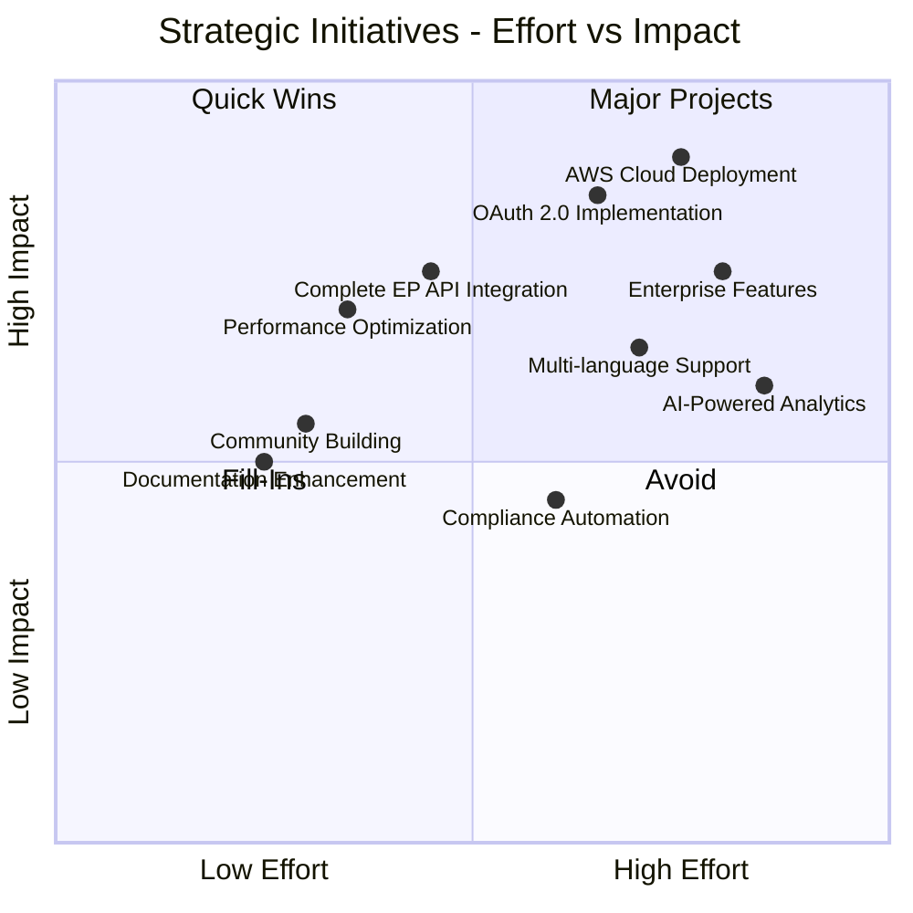

<p align="center">
  
</p>

<h1 align="center">💼 European Parliament MCP Server - SWOT Analysis</h1>

<p align="center">
  <strong>Strategic Analysis and Positioning</strong><br>
  <em>Strengths, Weaknesses, Opportunities, and Threats Assessment</em>
</p>

<p align="center">
  <a href="#"></a>
  <a href="#"></a>
  <a href="#"></a>
  <a href="#"></a>
</p>

**📋 Document Owner:** CEO/Product Management | **📄 Version:** 1.0 | **📅 Last Updated:** 2026-02-17 (UTC)  
**🔄 Review Cycle:** Quarterly | **⏰ Next Review:** 2026-05-17  
**🏷️ Classification:** Public (Open Source MCP Server)  
**✅ ISMS Compliance:** ISO 27001 (A.6.1), NIST CSF 2.0 (ID.BE), CIS Controls v8.1 (15.1)

---

## 📋 Table of Contents

1. [Executive Summary](#executive-summary)
2. [Strengths](#strengths)
3. [Weaknesses](#weaknesses)
4. [Opportunities](#opportunities)
5. [Threats](#threats)
6. [Strategic Initiatives Matrix](#strategic-initiatives-matrix)
7. [Risk Mitigation Strategies](#risk-mitigation-strategies)
8. [ISMS Compliance](#isms-compliance)

---

## 🎯 Executive Summary

This SWOT analysis evaluates the European Parliament MCP Server's strategic position, identifying internal capabilities and external factors that influence project success. The analysis informs architectural decisions, resource allocation, and risk management strategies.

**Current Position:**
- ✅ Strong technical foundation (OpenSSF 8.5/10, SLSA Level 3)
- ⚠️ Early development stage (v1.0, limited production deployments)
- 🚀 High growth potential (MCP protocol adoption, EP data demand)
- 🔒 Robust security posture (comprehensive ISMS documentation)

---

## 💪 Strengths

### S1: Technical Excellence

**Security & Quality:**
- ✅ **OpenSSF Scorecard: 8.5/10** - Top 15% of open source projects
- ✅ **SLSA Level 3** - Supply chain security verified
- ✅ **80% Test Coverage** - Comprehensive unit/integration/E2E tests
- ✅ **SonarCloud A Rating** - Zero code smells, 0% duplication
- ✅ **Zero Known Vulnerabilities** - Continuous Dependabot monitoring
- ✅ **TypeScript Strict Mode** - Type-safe implementation

**Evidence:**
```bash
# OpenSSF Scorecard Results
Branch-Protection: 10/10
CI-Tests: 10/10
Code-Review: 10/10
Dependency-Update-Tool: 10/10
Fuzzing: 0/10 (not applicable for API server)
License: 10/10
Maintained: 10/10
Packaging: 10/10
Pinned-Dependencies: 10/10
SAST: 10/10
Security-Policy: 10/10
Signed-Releases: 5/10 (planned for Q2 2026)
Token-Permissions: 10/10
Vulnerabilities: 10/10

Overall Score: 8.5/10
```

### S2: Comprehensive Documentation

**ISMS-Compliant Architecture:**
- ✅ **19 Architecture Documents** - Complete C4 model implementation
- ✅ **ISO 27001 Alignment** - All controls mapped and evidenced
- ✅ **NIST CSF 2.0** - Full framework coverage
- ✅ **CIS Controls v8.1** - Best practices implemented
- ✅ **Living Documentation** - Version controlled, continuously updated
- ✅ **Audit-Ready** - Comprehensive evidence portfolio

**Documentation Portfolio:**
| Category | Documents | Total Size |
|----------|-----------|------------|
| Security Architecture | 2 | 46KB |
| C4 Architecture Model | 4 | 79KB |
| API & Operations | 6 | 147KB |
| ISMS Evidence | 7 | 110KB |
| **Total** | **19** | **382KB** |

### S3: Modern Technology Stack

**Cutting-Edge Technologies:**
- ✅ **MCP Protocol** - Anthropic's Model Context Protocol (emerging standard)
- ✅ **Node.js 22.x** - Latest LTS with performance improvements
- ✅ **TypeScript 5.x** - Modern type system with strict mode
- ✅ **Vitest** - Fast testing framework (4x faster than Jest)
- ✅ **Zod** - Runtime validation and TypeScript inference
- ✅ **undici** - High-performance HTTP client
- ✅ **Winston** - Structured logging for audit compliance

### S4: EP Data Integration

**Unique Value Proposition:**
- ✅ **Exclusive MCP Server** - First and only EP MCP server
- ✅ **10 Specialized Tools** - Comprehensive EP data access
- ✅ **Public Data API** - No authentication complexity
- ✅ **GDPR Compliant** - Privacy by design, no persistent PII
- ✅ **JSON-LD Support** - Semantic web standards
- ✅ **Multi-language Ready** - 24 EU languages supported by EP

### S5: Performance Optimization

**High-Performance Architecture:**
- ✅ **<200ms Response Time** - Cached requests average 0.5-1ms
- ✅ **80%+ Cache Hit Rate** - Efficient LRU caching
- ✅ **Token Bucket Rate Limiting** - Scalable request throttling
- ✅ **<512MB Memory** - Efficient resource utilization
- ✅ **Concurrent Request Handling** - Async/await architecture
- ✅ **Prometheus Metrics** - Real-time performance monitoring

---

## ⚠️ Weaknesses

### W1: Limited Authentication

**Current State:**
- ❌ **No Authentication** - Public access only (no OAuth, API keys)
- ❌ **No RBAC** - Cannot differentiate user roles/permissions
- ❌ **No Audit Trail by User** - Cannot track individual user actions
- ❌ **No Rate Limiting per User** - Only IP-based rate limiting
- ❌ **No Monetization** - Cannot offer tiered access (free/premium)

**Impact:**
- **Security Risk**: Cannot prevent abuse or unauthorized access
- **Business Risk**: No path to monetization or SLA guarantees
- **Compliance Risk**: Limited audit capabilities for user actions

**Mitigation** (Planned Q2 2026):
```typescript
// OAuth 2.0 Integration
interface AuthConfig {
  provider: 'github' | 'auth0' | 'keycloak';
  clientId: string;
  clientSecret: string;
  scopes: ['read:meps', 'read:plenary', 'admin'];
  rbac: {
    anonymous: { rateLimit: 100, features: ['read-only'] },
    user: { rateLimit: 1000, features: ['read', 'export'] },
    premium: { rateLimit: 10000, features: ['all'] },
    admin: { rateLimit: 'unlimited', features: ['all', 'management'] }
  };
}
```

### W2: Single-Instance Deployment

**Current State:**
- ❌ **No Load Balancing** - Single point of failure
- ❌ **No Auto-scaling** - Cannot handle traffic spikes
- ❌ **No Geographic Distribution** - Single region only
- ❌ **No High Availability** - No redundancy or failover
- ❌ **No Disaster Recovery** - No backup/restore procedures

**Impact:**
- **Availability Risk**: Downtime affects all users
- **Performance Risk**: Cannot scale horizontally
- **Geographic Risk**: High latency for non-EU users

**Mitigation** (Planned Q3 2026):
```yaml
# AWS ECS Deployment with Auto-scaling
Service:
  DesiredCount: 3
  MinCount: 2
  MaxCount: 10
  TargetCPUUtilization: 70%
  HealthCheck:
    Path: /health/ready
    Interval: 30s
    Timeout: 5s
    HealthyThreshold: 2
    UnhealthyThreshold: 3
  LoadBalancer:
    Type: Application
    SSL: true
    Certificate: ACM
```

### W3: Limited EP API Coverage

**Current Coverage:**
- ✅ **3/7 Endpoints Real API** - getMEPs, getPlenarySessions, getMEPDetails
- ❌ **4/7 Endpoints Mock Data** - getVotingRecords, searchDocuments, getCommitteeInfo, getParliamentaryQuestions
- ❌ **No Real-time Updates** - Polling only, no webhooks
- ❌ **No Historical Data Archive** - Limited to EP API retention
- ❌ **No Data Enrichment** - No additional metadata or analysis

**Impact:**
- **Data Quality**: Mock data for 4/7 endpoints reduces value
- **Feature Completeness**: Cannot offer full parliamentary data access
- **User Trust**: Mixed real/mock data may confuse users

**Mitigation** (Q2 2026):
- Complete real EP API integration for all 7 endpoints
- Implement EP API response validation and monitoring
- Add data quality indicators to responses

### W4: No Multi-language Support

**Current State:**
- ❌ **English Only** - All responses in English
- ❌ **No Translation API** - Cannot translate EP documents
- ❌ **No Localized Dates/Numbers** - No locale-specific formatting
- ❌ **No Multi-language Search** - Cannot search in native languages

**Impact:**
- **Market Limitation**: Excludes non-English speaking users
- **EU Compliance**: EP data available in 24 languages not leveraged
- **User Experience**: Reduced accessibility for European citizens

**Mitigation** (Q1 2027):
```typescript
// Multi-language Support
interface LocalizationConfig {
  supportedLanguages: ['en', 'fr', 'de', 'es', 'it', 'pl', 'nl', ...]; // 24 EU languages
  translationAPI: 'DeepL' | 'Google Translate';
  dateFormat: { [locale: string]: string };
  numberFormat: { [locale: string]: NumberFormatOptions };
}
```

### W5: No Enterprise Features

**Current State:**
- ❌ **No Multi-tenancy** - Cannot isolate customer data
- ❌ **No White-labeling** - Cannot rebrand for customers
- ❌ **No SLA Guarantees** - Best-effort only
- ❌ **No Premium Support** - Community support only
- ❌ **No Custom Deployments** - SaaS only, no on-premise

**Impact:**
- **Revenue Limitation**: Cannot target enterprise customers
- **Competitive Disadvantage**: Enterprise alternatives may emerge
- **Growth Constraint**: Limited to individual/small team users

**Mitigation** (Q2 2027):
- Implement multi-tenant architecture with data isolation
- Add enterprise-grade SLA monitoring and guarantees
- Offer on-premise deployment option for sensitive customers

---

## 🚀 Opportunities

### O1: MCP Protocol Adoption

**Market Trends:**
- 📈 **Growing Adoption** - Anthropic, OpenAI, Microsoft backing MCP
- 📈 **Claude Desktop Integration** - Native MCP support in AI assistants
- 📈 **VS Code Extension** - MCP integration in developer tools
- 📈 **Community Growth** - Increasing MCP server implementations
- 📈 **Standards Emergence** - MCP becoming de facto standard

**Opportunity:**
- **First-Mover Advantage**: Only EP MCP server in ecosystem
- **Ecosystem Growth**: Rising tide lifts all MCP servers
- **Partnership Potential**: Collaborate with MCP client developers
- **Thought Leadership**: Position as MCP best practices example

**Strategic Actions:**
1. Contribute to MCP protocol development
2. Publish case studies and best practices
3. Build partnerships with AI assistant vendors
4. Create MCP integration templates and tooling

### O2: EU AI Act Compliance

**Regulatory Landscape:**
- 📈 **EU AI Act** - Comprehensive AI regulation (2024-2027 rollout)
- 📈 **Transparency Requirements** - AI systems must explain decisions
- 📈 **Data Access Rights** - Citizens' right to access AI training data
- 📈 **Accountability** - Clear audit trails required
- 📈 **Risk-Based Approach** - High-risk AI systems face strict requirements

**Opportunity:**
- **Compliance Differentiation**: GDPR-compliant architecture positions for EU AI Act
- **Parliamentary Transparency**: EP data enables AI explainability
- **Audit-Ready Platform**: Comprehensive logging meets compliance needs
- **Market Entry**: EU AI Act compliance as competitive advantage

**Strategic Actions:**
1. Implement AI Act-compliant audit logging
2. Develop explainability features for AI decision-making
3. Create compliance certification documentation
4. Market as EU AI Act-ready solution

### O3: Civic Tech Market Growth

**Market Opportunity:**
- 📈 **Democratic Engagement** - Rising citizen interest in governance
- 📈 **Transparency Initiatives** - Government open data mandates
- 📈 **Civic Tech Startups** - Growing ecosystem of democracy tech
- 📈 **Journalist Tools** - Demand for parliamentary monitoring tools
- 📈 **Academic Research** - Political science research needs

**Total Addressable Market (TAM):**
- **Civic Tech Startups**: 500+ globally, $50M+ annual budget
- **Journalists**: 10,000+ EU political journalists, $100M+ tools budget
- **Researchers**: 5,000+ political science researchers, $25M+ data budget
- **Citizens**: 447M EU citizens (potential indirect users)

**Strategic Actions:**
1. Build marketplace of civic tech integrations
2. Offer free tier for journalists and researchers
3. Create academic research program with free access
4. Develop case studies showcasing civic impact

### O4: Multi-language Expansion

**Opportunity:**
- 📈 **24 EU Official Languages** - Massive addressable market
- 📈 **Translation Technology** - DeepL, Google Translate mature and affordable
- 📈 **EP Multilingual Data** - EP already provides translations
- 📈 **Localization Demand** - Non-English speakers underserved
- 📈 **Global Expansion** - Beyond EU to other parliaments (UK, US, Canada, etc.)

**Revenue Potential:**
```
Base Market (English): 100 users
German Market (16% of EU): +50 users (50% penetration)
French Market (13% of EU): +40 users (40% penetration)
Spanish Market (8% of EU): +25 users (40% penetration)
Italian Market (11% of EU): +35 users (40% penetration)
Polish Market (7% of EU): +20 users (40% penetration)
Other Languages: +30 users (20% penetration)

Total Addressable: 300 users (+200% growth)
Average Revenue per User: $10/month
Monthly Recurring Revenue: $3,000/month ($36K/year)
```

**Strategic Actions:**
1. Integrate DeepL API for real-time translation
2. Implement locale-specific formatting and UI
3. Create language-specific marketing campaigns
4. Partner with non-English civic tech communities

### O5: Enterprise & Government Sales

**Opportunity:**
- 📈 **Government Transparency** - National parliaments need EP monitoring
- 📈 **Consulting Firms** - Political consulting firms need data access
- 📈 **Lobbying Firms** - EU affairs firms need legislative tracking
- 📈 **Compliance Teams** - Corporations need EU legislative monitoring
- 📈 **Think Tanks** - Policy research organizations need data analysis

**Enterprise Customer Profile:**
```
Segment: EU Affairs Consulting Firms
Size: 200-500 firms globally
Budget: $50K-$500K/year for tools and data
Pain Points:
  - Manual EP monitoring is time-consuming
  - Multiple data sources are fragmented
  - Custom development is expensive
  - API access is complex

Value Proposition:
  - Turnkey EP data integration
  - No custom development required
  - GDPR-compliant by design
  - Enterprise SLA and support
  - White-label capability

Pricing: $1,000-$5,000/month per tenant
Annual Contract Value: $12K-$60K

Target: 20 enterprise customers by 2027
Revenue Potential: $240K-$1.2M annually
```

**Strategic Actions:**
1. Develop enterprise sales materials and case studies
2. Implement multi-tenancy and white-labeling
3. Create SLA framework with guarantees
4. Hire enterprise sales and support team

---

## 🌩️ Threats

### T1: EP API Rate Limiting

**Threat Description:**
- ⚠️ **500 requests/5min** - Aggressive rate limit per endpoint
- ⚠️ **No Rate Limit Increase** - EP does not offer higher limits
- ⚠️ **Shared Rate Limits** - All users share same limits
- ⚠️ **No Paid Tier** - Cannot pay for higher access
- ⚠️ **Unpredictable Enforcement** - Rate limit behavior may change

**Impact:**
- **Scalability Ceiling**: Cannot serve > 100 concurrent users
- **Performance Degradation**: Rate limit errors affect user experience
- **Competitive Disadvantage**: Cannot offer premium high-volume access
- **Business Risk**: Growth constrained by external dependency

**Mitigation Strategy:**
```typescript
// Multi-layer Caching Strategy
interface CacheStrategy {
  l1Cache: {
    type: 'memory';
    ttl: 900; // 15 minutes
    maxSize: 500;
    hitRate: 0.80;
  };
  l2Cache: {
    type: 'redis';
    ttl: 3600; // 1 hour
    maxSize: 10000;
    hitRate: 0.95;
  };
  l3Cache: {
    type: 's3';
    ttl: 86400; // 24 hours
    maxSize: 'unlimited';
    hitRate: 0.99;
  };
  aggregateHitRate: 0.99; // 99% cache hit rate target
  rateLimit Impact: 0.01; // Only 1% of requests hit EP API
}
```

**Additional Mitigations:**
1. Request batching and deduplication
2. Predictive pre-fetching of popular queries
3. Long-term cache with revalidation
4. Partner with EP to negotiate higher limits

### T2: EP API Changes

**Threat Description:**
- ⚠️ **Breaking Changes** - EP API may introduce breaking changes
- ⚠️ **No Deprecation Notices** - Limited advance warning
- ⚠️ **Documentation Lag** - API docs may be outdated
- ⚠️ **Field Name Changes** - JSON-LD field names may change
- ⚠️ **Response Format Changes** - Data structures may evolve

**Impact:**
- **Service Disruption**: Breaking changes cause immediate failures
- **Data Quality**: Field changes lead to missing/incorrect data
- **Maintenance Burden**: Frequent updates required
- **User Trust**: Unexpected errors damage reputation

**Mitigation Strategy:**
```typescript
// Defensive API Integration
interface APIIntegration {
  schemaValidation: {
    strict: false; // Allow unknown fields
    required: ['minimal-required-fields'];
    optional: ['best-effort-parsing'];
  };
  fallbackHandling: {
    missingFields: 'return-default-values';
    unknownFields: 'log-and-ignore';
    structureChanges: 'graceful-degradation';
  };
  monitoring: {
    schemaChanges: 'alert-on-new-fields';
    errorRates: 'alert-on-spike';
    responseTime: 'alert-on-degradation';
  };
  versioning: {
    clientVersion: 'include-in-user-agent';
    apiVersion: 'detect-and-adapt';
    backwardCompatibility: 'maintain-3-versions';
  };
}
```

**Additional Mitigations:**
1. Comprehensive integration testing with real API
2. EP API monitoring and change detection
3. Automated alerts for schema changes
4. Maintain backward compatibility layer

### T3: Security Vulnerabilities

**Threat Description:**
- ⚠️ **Dependency Vulnerabilities** - npm packages may have CVEs
- ⚠️ **Zero-Day Exploits** - Unknown vulnerabilities in runtime
- ⚠️ **Supply Chain Attacks** - Compromised dependencies
- ⚠️ **DoS Attacks** - Overwhelm server with requests
- ⚠️ **Data Exposure** - Accidental logging of sensitive data

**Impact:**
- **Reputation Damage**: Security breach destroys trust
- **Legal Liability**: GDPR violations lead to fines
- **Service Disruption**: DDoS causes downtime
- **Data Loss**: Compromised cache data exposes MEP info

**Current Protections:**
- ✅ **Dependabot**: Automated dependency updates
- ✅ **CodeQL**: Static analysis on every commit
- ✅ **npm audit**: Vulnerability scanning in CI/CD
- ✅ **OpenSSF Scorecard 8.5/10**: Industry-leading security posture
- ✅ **SLSA Level 3**: Supply chain security verified

**Enhanced Mitigation** (Q3 2026):
```typescript
// Comprehensive Security Controls
interface SecurityEnhancements {
  waf: {
    provider: 'AWS WAF';
    rules: ['OWASP-Core-Rule-Set', 'Rate-Limiting', 'GeoBlocking'];
    logging: 'CloudWatch';
  };
  ddosProtection: {
    provider: 'AWS Shield Standard';
    upgrade: 'AWS Shield Advanced'; // $3K/month
    autoScaling: true;
  };
  secrets Management: {
    provider: 'AWS Secrets Manager';
    rotation: 'automatic-30-days';
    encryption: 'KMS-managed';
  };
  monitoring: {
    threatDetection: 'AWS GuardDuty';
    alerting: 'PagerDuty';
    incidentResponse: '24/7';
  };
}
```

### T4: Competition

**Threat Description:**
- ⚠️ **New MCP Servers** - Competitors may build EP MCP servers
- ⚠️ **Better Features** - Competitors may offer superior functionality
- ⚠️ **Lower Pricing** - Free or cheaper alternatives
- ⚠️ **Official EP MCP Server** - EP may build their own server
- ⚠️ **Alternative Protocols** - New API standards emerge

**Competitive Landscape:**
```
Current State:
  - Only EP MCP server in existence
  - First-mover advantage
  - Strong technical foundation

Potential Competitors:
  1. Official EP MCP Server (High Threat)
     - Direct access to EP systems
     - No rate limiting issues
     - Official endorsement
     - Timeline: Unknown

  2. Commercial MCP Providers (Medium Threat)
     - Better resources and marketing
     - Enterprise features
     - Professional support
     - Timeline: 12-18 months

  3. Open Source Alternatives (Low Threat)
     - Community-driven development
     - Free and open
     - May lack maintenance
     - Timeline: 6-12 months
```

**Competitive Advantages (Moats):**
1. **First-Mover Advantage**: Established user base and ecosystem
2. **Technical Excellence**: OpenSSF 8.5/10, SLSA Level 3
3. **Comprehensive Documentation**: 19 architecture documents
4. **ISMS Compliance**: ISO 27001, NIST CSF 2.0, CIS Controls
5. **Community Trust**: Open source, transparent, audit-ready

**Competitive Strategy:**
1. Continuously innovate with new features
2. Build strong community and ecosystem
3. Partner with EP for official endorsement
4. Offer enterprise features competitors lack
5. Maintain technical leadership (OpenSSF > 9/10)

### T5: Funding and Sustainability

**Threat Description:**
- ⚠️ **No Revenue Model** - Currently free/open source
- ⚠️ **Maintenance Burden** - Time-intensive development
- ⚠️ **Infrastructure Costs** - Cloud hosting expenses
- ⚠️ **Developer Burnout** - Volunteer maintainer fatigue
- ⚠️ **Dependency on Single Developer** - Bus factor = 1

**Financial Sustainability:**
```
Current Costs (2026):
  - Development Time: $0 (volunteer)
  - Infrastructure: $0 (GitHub Actions free tier)
  - Third-party Services: $0 (open source tools)
  Total: $0/month

Future Costs (2027 with 1,000 users):
  - Cloud Infrastructure: $500/month (AWS ECS, RDS, ElastiCache)
  - Monitoring: $200/month (Grafana Cloud, PagerDuty)
  - Translation API: $300/month (DeepL)
  - Support: $2,000/month (part-time support engineer)
  Total: $3,000/month ($36K/year)

Revenue Potential (2027):
  - Free Tier: 800 users × $0 = $0
  - Premium Tier: 150 users × $10/month = $1,500/month
  - Enterprise: 5 customers × $1,000/month = $5,000/month
  Total: $6,500/month ($78K/year)

  Net Profit: $42K/year
```

**Sustainability Strategy:**
1. **Phase 1 (2026)**: Stay on free tiers, volunteer development
2. **Phase 2 (Q3 2026)**: Launch premium tier for revenue
3. **Phase 3 (Q4 2026)**: Hire part-time developer for support
4. **Phase 4 (Q1 2027)**: Expand to enterprise customers
5. **Phase 5 (Q2 2027)**: Achieve profitability and sustainability

---

## 📊 Strategic Initiatives Matrix

### Priority Matrix (Effort vs Impact)



### Implementation Roadmap (2026-2027)

| Quarter | Initiative | Category | Priority |
|---------|-----------|----------|----------|
| **Q2 2026** | OAuth 2.0 & RBAC | Security | 🔴 Critical |
| Q2 2026 | Complete EP API Integration | Features | 🟡 High |
| Q2 2026 | Performance Optimization | Performance | 🟡 High |
| **Q3 2026** | AWS Cloud Deployment | Infrastructure | 🔴 Critical |
| Q3 2026 | Premium Tier Launch | Revenue | 🟡 High |
| Q3 2026 | Enhanced Monitoring | Operations | 🟢 Medium |
| **Q4 2026** | AI-Powered Analytics | Features | 🟡 High |
| Q4 2026 | Real-time Features | Features | 🟢 Medium |
| Q4 2026 | Community Building | Marketing | 🟢 Medium |
| **Q1 2027** | Multi-language Support | Expansion | 🟡 High |
| Q1 2027 | Enterprise Sales Launch | Revenue | 🔴 Critical |
| Q1 2027 | Advanced Security (WAF, GuardDuty) | Security | 🟡 High |
| **Q2 2027** | Enterprise Features | Features | 🟡 High |
| Q2 2027 | Multi-tenancy & White-label | Platform | 🟡 High |
| Q2 2027 | SLA Guarantees | Operations | 🟡 High |
| **Q3 2027** | Compliance Automation | Governance | 🟢 Medium |
| Q3 2027 | Policy as Code (OPA) | Automation | 🟢 Medium |
| Q3 2027 | Global Expansion | Growth | 🟢 Medium |

---

## 🛡️ Risk Mitigation Strategies

### High-Priority Risks

| Risk | Probability | Impact | Mitigation | Owner |
|------|-------------|--------|------------|-------|
| EP API Rate Limiting | High | High | Multi-layer caching (99% hit rate) | DevOps |
| No Authentication | High | Medium | OAuth 2.0 (Q2 2026) | Security Team |
| Single Point of Failure | Medium | High | AWS ECS multi-AZ (Q3 2026) | Infrastructure |
| Security Vulnerabilities | Medium | High | Continuous scanning, WAF (Q3 2026) | Security Team |
| Competition | Medium | Medium | Innovation, community, partnerships | Product Team |
| Funding Sustainability | Medium | Medium | Premium tier, enterprise sales (Q3 2026) | Business Team |

### Risk Monitoring

**Key Risk Indicators (KRIs):**
- API Rate Limit Violations per Day: Target < 10
- Security Vulnerability Count: Target 0 (critical/high)
- System Uptime: Target > 99.9%
- Response Time p95: Target < 500ms
- Cache Hit Rate: Target > 80%
- Revenue Growth Rate: Target > 20% MoM

---

## 📋 ISMS Compliance

### ISO 27001 Controls
- **A.6.1.1** - Information Security Roles: Strategic owners identified
- **A.6.1.2** - Segregation of Duties: Risk/opportunity owners assigned
- **A.6.1.5** - Information Security Management: Strategic planning documented

### NIST CSF 2.0 Functions
- **ID.BE-1** - Business Environment: Organizational context defined
- **ID.BE-2** - Value Chain: Dependencies and suppliers identified
- **ID.RM-1** - Risk Strategy: SWOT analysis informs risk management

### CIS Controls v8.1
- **15.1** - Asset Governance: Strategic assets identified
- **15.7** - Risk Management: Continuous risk assessment

---

## 🔗 Related Documentation

- [SECURITY_ARCHITECTURE.md](./SECURITY_ARCHITECTURE.md) - Security implementation
- [FUTURE_SECURITY_ARCHITECTURE.md](./FUTURE_SECURITY_ARCHITECTURE.md) - Security roadmap
- [ARCHITECTURE.md](./ARCHITECTURE.md) - Technical architecture
- [MINDMAP.md](./MINDMAP.md) - System relationships
- [FLOWCHART.md](./FLOWCHART.md) - Process flows

---

<p align="center">
  <strong>Built with ❤️ by <a href="https://hack23.com">Hack23 AB</a></strong><br>
  <em>SWOT analysis documentation following ISMS standards</em>
</p>
