<p align="center">
  
</p>

<h1 align="center">🎯 European Parliament MCP Server — Threat Model</h1>

<p align="center">
  <strong>🛡️ Proactive Security Through Structured Threat Analysis</strong><br>
  <em>🔍 STRIDE • MITRE ATT&CK • MCP Protocol Security • Parliamentary Data Protection</em>
</p>

<p align="center">
  <a href="#"></a>
  <a href="#"></a>
  <a href="#"></a>
  <a href="#"></a>
</p>

**📋 Document Owner:** CEO | **📄 Version:** 1.0 | **📅 Last Updated:** 2026-02-20 (UTC)  
**🔄 Review Cycle:** Quarterly | **⏰ Next Review:** 2026-05-20  
**🏷️ Classification:** Public (Open Source MCP Server)

---

## 📑 Table of Contents

- [ISMS Policy Alignment](#-isms-policy-alignment)
- [Security Documentation Map](#️-security-documentation-map)
- [Purpose \& Scope](#-purpose--scope)
- [System Classification](#-system-classification--operating-profile)
- [💎 Critical Assets \& Crown Jewel Analysis](#-critical-assets--crown-jewel-analysis)
- [STRIDE Threat Analysis](#-stride-threat-analysis)
- [MITRE ATT\&CK Coverage Analysis](#️-mitre-attck-coverage-analysis)
- [Threat Agent Classification](#-threat-agent-classification)
- [Current Threat Landscape](#-current-threat-landscape)
- [Scenario-Centric Threat Modeling](#-scenario-centric-threat-modeling-ep-specific)
- [Quantitative Risk Assessment](#-quantitative-risk-assessment)
- [Security Controls \& Mitigations](#️-security-controls--mitigations)
- [Attack Tree Analysis](#-attack-tree-analysis)
- [Continuous Validation \& Assessment](#-continuous-validation--assessment)
- [Assessment Lifecycle](#-assessment-lifecycle)
- [Security Maturity Framework](#-security-maturity-framework)
- [🏗️ Architecture-Centric STRIDE Analysis](#️-architecture-centric-stride-analysis)
- [MITRE ATT\&CK Mapping](#️-mitre-attck-mapping)
- [Quantitative Risk Assessment](#-quantitative-risk-assessment)
- [Security Controls \& Mitigations](#️-security-controls--mitigations)
- [Attack Tree Analysis](#-attack-tree-analysis)
- [🔴 Priority Threat Scenarios](#-priority-threat-scenarios)
- [🛡️ STRIDE → Control Mapping](#️-stride--control-mapping)
- [🏛️ Comprehensive Security Control Framework](#️-comprehensive-security-control-framework)
- [Policy Alignment](#-policy-alignment)
- [Related Documents](#-related-documents)

---

## 🔐 ISMS Policy Alignment

### Related ISMS Policies

| Policy | Relevance | Link |
|--------|-----------|------|
| **Open Source Policy** | Security transparency, vulnerability disclosure | [View](https://github.com/Hack23/ISMS-PUBLIC/blob/main/Open_Source_Policy.md) |
| **Secure Development Policy** | Secure coding practices, supply chain security | [View](https://github.com/Hack23/ISMS-PUBLIC/blob/main/Secure_Development_Policy.md) |
| **Risk Management Policy** | Threat assessment, risk mitigation | [View](https://github.com/Hack23/ISMS-PUBLIC/blob/main/Risk_Management_Policy.md) |
| **Privacy Policy** | GDPR compliance, data protection | [View](https://github.com/Hack23/ISMS-PUBLIC/blob/main/Privacy_Policy.md) |

### Security Control Implementation Status

| Control Area | Status | Evidence |
|-------------|--------|----------|
| Input Validation (Zod) | ✅ Implemented | Mitigates E-1, D-4, E-3 |
| Rate Limiting | ✅ Implemented | Mitigates D-1, D-2 |
| HTTPS/TLS | ✅ Implemented | Default EP API base URL uses HTTPS; `EP_API_URL` must be configured with `https://` (Mitigates S-2, T-1) |
| SLSA Level 3 | ✅ Implemented | Mitigates T-3, S-4 |
| Dependabot + npm audit | ✅ Implemented | Mitigates T-2 |
| Error Sanitization | ⚠️ Partial | Mitigates I-1, I-2 |

### Compliance Framework Mapping

| Framework | Controls | Status |
|-----------|----------|--------|
| **ISO 27001:2022** | A.5.1, A.8.2, A.8.8, A.8.25, A.14.2, A.18.1 | ✅ Aligned |
| **NIST CSF 2.0** | ID.AM, ID.RA, PR.DS, PR.IP, DE.CM, RS.AN | ✅ Aligned |
| **CIS Controls v8.1** | 1.1, 2.7, 3.3, 6.2, 7.1, 16.7 | ✅ Aligned |

> **See also**: [Policy Alignment](#-policy-alignment) below for the complete threat-specific ISMS policy mapping (Threat Modeling, Vulnerability Management, Network Security, Access Control, Cryptography, and Incident Response policies).

---

## 🗺️ Security Documentation Map

| Document | Type | Description | Status |
|----------|------|-------------|--------|
| [SECURITY_ARCHITECTURE.md](./SECURITY_ARCHITECTURE.md) | 🛡️ Current | Implemented security design and controls | ✅ Current |
| [FUTURE_SECURITY_ARCHITECTURE.md](./FUTURE_SECURITY_ARCHITECTURE.md) | 🚀 Future | Security roadmap and planned enhancements | ✅ Current |
| [THREAT_MODEL.md](./THREAT_MODEL.md) | 🎯 Analysis | STRIDE threat analysis and risk assessment | ✅ Current |
| [BCPPlan.md](./BCPPlan.md) | 🔄 Continuity | Business continuity and disaster recovery | ✅ Current |
| [CRA-ASSESSMENT.md](./CRA-ASSESSMENT.md) | 📋 Compliance | EU Cyber Resilience Act conformity assessment | ✅ Current |
| [SECURITY.md](./SECURITY.md) | 📜 Policy | Security policy and vulnerability disclosure | ✅ Current |
| [SECURITY_HEADERS.md](./SECURITY_HEADERS.md) | 🔒 Technical | API security headers implementation | ✅ Current |

---

## 🎯 Purpose & Scope

Establish a comprehensive threat model for the European Parliament MCP Server, a TypeScript/Node.js Model Context Protocol server providing AI assistants with structured access to European Parliament open datasets. This systematic threat analysis integrates multiple frameworks to ensure proactive security through structured analysis.

### **🌟 Transparency Commitment**

This threat model demonstrates **🛡️ cybersecurity consulting expertise** through public documentation of advanced threat assessment methodologies, showcasing our **🏆 competitive advantage** via systematic risk management and **🤝 customer trust** through transparent security practices.

*— Based on Hack23 AB's commitment to security through transparency and excellence*

### **📚 Framework Integration**

- **🎭 STRIDE per architecture element:** Systematic threat categorization
- **🎖️ MITRE ATT&CK mapping:** Advanced threat intelligence integration
- **🏗️ Asset-centric analysis:** Critical resource protection focus
- **🎯 Scenario-centric modeling:** Real-world attack simulation
- **⚖️ Risk-centric assessment:** Business impact quantification

### **🔍 Scope Definition**

**Included Systems:**

- 🌐 TypeScript/Node.js MCP server application
- 🔌 MCP protocol implementation (stdio transport)
- 🏛️ European Parliament Open Data API integration
- 📦 npm package distribution (`european-parliament-mcp-server`)
- 🏭 CI/CD security pipeline (GitHub Actions, SLSA Level 3)
- 📦 Dependency supply chain (npm ecosystem)
- ✅ Input validation (Zod schemas)

**Out of Scope:**

- European Parliament API infrastructure security
- End-user AI assistant security (Claude, ChatGPT, etc.)
- Third-party npm registry infrastructure
- End-user operating system and network security

### **🔗 Policy Alignment**

Integrated with [🎯 Hack23 AB Threat Modeling Policy](https://github.com/Hack23/ISMS-PUBLIC/blob/main/Threat_Modeling.md) methodology and frameworks.

---

## 📊 System Classification & Operating Profile

### **🏷️ Security Classification Matrix**

| Dimension | Level | Rationale | Business Impact |
|----------|-------|-----------|----------------|
| **🔐 Confidentiality** | [](https://github.com/Hack23/ISMS-PUBLIC/blob/main/CLASSIFICATION.md#confidentiality-levels) | Open source server processing public EP data | [](https://github.com/Hack23/ISMS-PUBLIC/blob/main/CLASSIFICATION.md) |
| **🔒 Integrity** | [](https://github.com/Hack23/ISMS-PUBLIC/blob/main/CLASSIFICATION.md#integrity-levels) | Parliamentary data accuracy critical for democratic transparency | [](https://github.com/Hack23/ISMS-PUBLIC/blob/main/CLASSIFICATION.md) |
| **⚡ Availability** | [](https://github.com/Hack23/ISMS-PUBLIC/blob/main/CLASSIFICATION.md#availability-levels) | MCP server tolerates brief outages; AI clients retry | [](https://github.com/Hack23/ISMS-PUBLIC/blob/main/CLASSIFICATION.md) |

### **⚙️ Operating Profile**

| Property | Value |
|----------|-------|
| **Runtime** | Node.js 24+ (LTS) |
| **Language** | TypeScript 5.x (strict mode) |
| **Transport** | stdio (local process) |
| **Data Source** | European Parliament Open Data API |
| **Distribution** | npm registry |
| **Authentication** | None (public data, local stdio) |
| **Users** | AI assistants (Claude, ChatGPT, etc.) |

---

## 💎 Critical Assets & Crown Jewel Analysis

### **🎯 Critical Asset Inventory**

| Asset | Description | Classification | Threat Impact |
|-------|-------------|----------------|---------------|
| **EP Parliamentary Data Integrity** | Accuracy and trustworthiness of MEP data, voting records, plenary documents | 🔒 Integrity: Moderate | Compromised democratic transparency, misinformation propagation |
| **Source Code & Build Pipeline** | TypeScript source, CI/CD workflows, GitHub Actions security | 🔐 Confidentiality: Public<br>🔒 Integrity: High | Supply chain compromise, malicious code injection |
| **Service Reputation & Trust** | OpenSSF Scorecard rating, npm package legitimacy, security posture | ⚡ Availability: Standard | User trust erosion, adoption reduction |
| **EP API Access & Availability** | Connection to European Parliament Open Data API | ⚡ Availability: Moderate | Service disruption, rate limit exhaustion |
| **npm Package Distribution** | Package integrity, version control, download statistics | 🔒 Integrity: Moderate | Malware distribution, user impact |
| **Audit Trail & Logging** | Structured logs, security event records | 🔒 Integrity: Moderate | Non-repudiation loss, incident investigation failure |

### **💎 Crown Jewel Analysis**

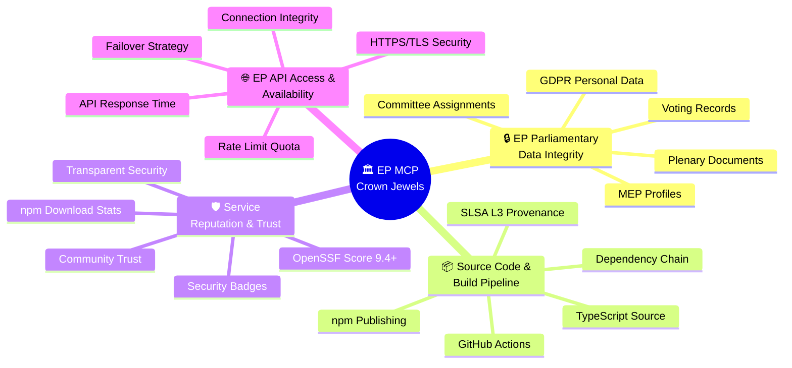

### **🛡️ Crown Jewel Protection Strategies**

| Crown Jewel | Primary Threats | Protection Controls | Residual Risk |
|-------------|-----------------|---------------------|---------------|
| **EP Parliamentary Data Integrity** | T-1, T-2, S-2 | HTTPS/TLS, response validation, Zod schemas, cache TTL | Low |
| **Source Code & Build Pipeline** | T-2, T-3, S-4 | SLSA Level 3, branch protection, GPG signing, Dependabot | Low-Medium |
| **Service Reputation & Trust** | All categories | OpenSSF Scorecard monitoring, security badges, transparent documentation | Low |
| **EP API Access & Availability** | D-1, D-2, S-2 | Rate limiting, retry logic, circuit breaker, HTTPS verification | Medium |
| **npm Package Distribution** | S-3, S-4, T-2 | Official package name ownership, npm 2FA, SBOM, npm provenance | Low-Medium |
| **Audit Trail & Logging** | R-1, R-2, R-3 | Structured stderr logging, immutable logs, timestamp integrity | Low |

---

## 🎭 STRIDE Threat Analysis

### **S — Spoofing**

| ID | Threat | Component | Likelihood | Impact | Risk | Mitigation |
|----|--------|-----------|------------|--------|------|------------|
| S-1 | Malicious MCP client impersonation | MCP Transport | Low | Medium | Low | stdio transport limits to local process |
| S-2 | EP API response spoofing (MITM) | API Client | Low | High | Medium | HTTPS/TLS for all API communication |
| S-3 | npm package name squatting | Distribution | Low | High | Medium | Official package name, npm 2FA publishing |
| S-4 | Supply chain package substitution | Dependencies | Medium | High | High | SLSA Level 3 provenance, lockfile pinning |

### **T — Tampering**

| ID | Threat | Component | Likelihood | Impact | Risk | Mitigation |
|----|--------|-----------|------------|--------|------|------------|
| T-1 | API response manipulation | API Client | Low | High | Medium | HTTPS integrity, response validation |
| T-2 | Dependency injection via compromised package | Supply Chain | Medium | Critical | High | Dependabot, npm audit, SBOM tracking |
| T-3 | Build artifact tampering | CI/CD | Low | Critical | Medium | SLSA Level 3 attestations |
| T-4 | Configuration manipulation | Runtime | Low | Medium | Low | Environment variable validation |

### **R — Repudiation**

| ID | Threat | Component | Likelihood | Impact | Risk | Mitigation |
|----|--------|-----------|------------|--------|------|------------|
| R-1 | Untracked tool invocations | MCP Server | Medium | Medium | Medium | Structured audit logging (stderr) |
| R-2 | Unsigned commits in source | Source Code | Low | Medium | Low | GPG signing, branch protection |
| R-3 | Unattributed data access | API Client | Low | Low | Low | Request logging with timestamps |

### **I — Information Disclosure**

| ID | Threat | Component | Likelihood | Impact | Risk | Mitigation |
|----|--------|-----------|------------|--------|------|------------|
| I-1 | Verbose error messages exposing internals | Error Handling | Medium | Medium | Medium | Sanitized error responses |
| I-2 | Stack traces in production | Runtime | Medium | Low | Low | Production error handling |
| I-3 | API keys in logs | Logging | Low | High | Medium | No API keys required (public API) |
| I-4 | Sensitive data in cached responses | Caching | Low | Low | Low | Public data only, TTL-based cache |

### **D — Denial of Service**

| ID | Threat | Component | Likelihood | Impact | Risk | Mitigation |
|----|--------|-----------|------------|--------|------|------------|
| D-1 | EP API rate limit exhaustion | API Client | Medium | Medium | Medium | Client-side rate limiting |
| D-2 | Memory exhaustion via large responses | Runtime | Low | High | Medium | Response size limits |
| D-3 | Recursive/nested tool calls | MCP Server | Low | Medium | Low | Call depth limits |
| D-4 | ReDoS via crafted input | Input Validation | Low | Medium | Low | Zod schema validation (no regex) |

### **E — Elevation of Privilege**

| ID | Threat | Component | Likelihood | Impact | Risk | Mitigation |
|----|--------|-----------|------------|--------|------|------------|
| E-1 | MCP tool parameter injection | Input Handling | Medium | Medium | Medium | Zod schema validation for all inputs |
| E-2 | Prototype pollution via JSON parsing | Runtime | Low | High | Medium | Safe JSON parsing, TypeScript strict |
| E-3 | Path traversal in document search | Tools | Low | Medium | Low | Input sanitization, no filesystem access |
| E-4 | Command injection via tool parameters | MCP Server | Low | Critical | Medium | No shell execution, parameterized APIs |

---

## 🎖️ MITRE ATT&CK Coverage Analysis

### **ATT&CK Coverage Heat Map by Tactic**

This heat map shows the relevance and coverage of MITRE ATT&CK tactics for the European Parliament MCP Server context. Each tactic is assessed for applicability and current security posture.

| Tactic | Coverage Status | Relevant Techniques | Priority | Notes |
|--------|----------------|---------------------|----------|-------|
| **🎯 Initial Access** | 🟢 High Coverage | T1190, T1195.002 | 🔴 Critical | Supply chain & MCP protocol entry points |
| **⚡ Execution** | 🟡 Medium Coverage | T1059 | 🟠 High | Limited - no direct shell execution |
| **🔄 Persistence** | 🟢 N/A (Not Applicable) | — | 🟢 Low | Stateless MCP server, no persistence |
| **🔺 Privilege Escalation** | 🟡 Medium Coverage | T1068 | 🟠 Medium | Prototype pollution, injection risks |
| **🛡️ Defense Evasion** | 🟢 High Coverage | T1027, T1562 | 🟠 High | Obfuscated dependencies, log suppression |
| **🔑 Credential Access** | 🟢 N/A (Not Applicable) | — | 🟢 Low | No credentials stored/managed |
| **🔍 Discovery** | 🟡 Medium Coverage | T1592 | 🟡 Medium | Information disclosure via errors |
| **↔️ Lateral Movement** | 🟢 N/A (Not Applicable) | — | 🟢 Low | Single-process stdio transport |
| **📦 Collection** | 🟢 High Coverage | T1530 | 🟠 Medium | Parliamentary data harvesting abuse |
| **📡 Command & Control** | 🟡 Medium Coverage | T1071 | 🟡 Medium | MCP protocol as C2 channel |
| **📤 Exfiltration** | 🟢 High Coverage | T1041 | 🟠 High | Parliamentary data exfiltration |
| **💥 Impact** | 🟢 High Coverage | T1498, T1485 | 🔴 Critical | DoS via rate exhaustion, data manipulation |

**Coverage Legend:**
- 🟢 **High Coverage:** Comprehensive mitigations implemented
- 🟡 **Medium Coverage:** Partial mitigations, monitoring in place
- 🔴 **Low Coverage:** Minimal mitigations, requires attention
- 🟢 **N/A:** Tactic not applicable to this architecture
## 🏗️ Architecture-Centric STRIDE Analysis

### **🌊 Data Flow Threat Surface**

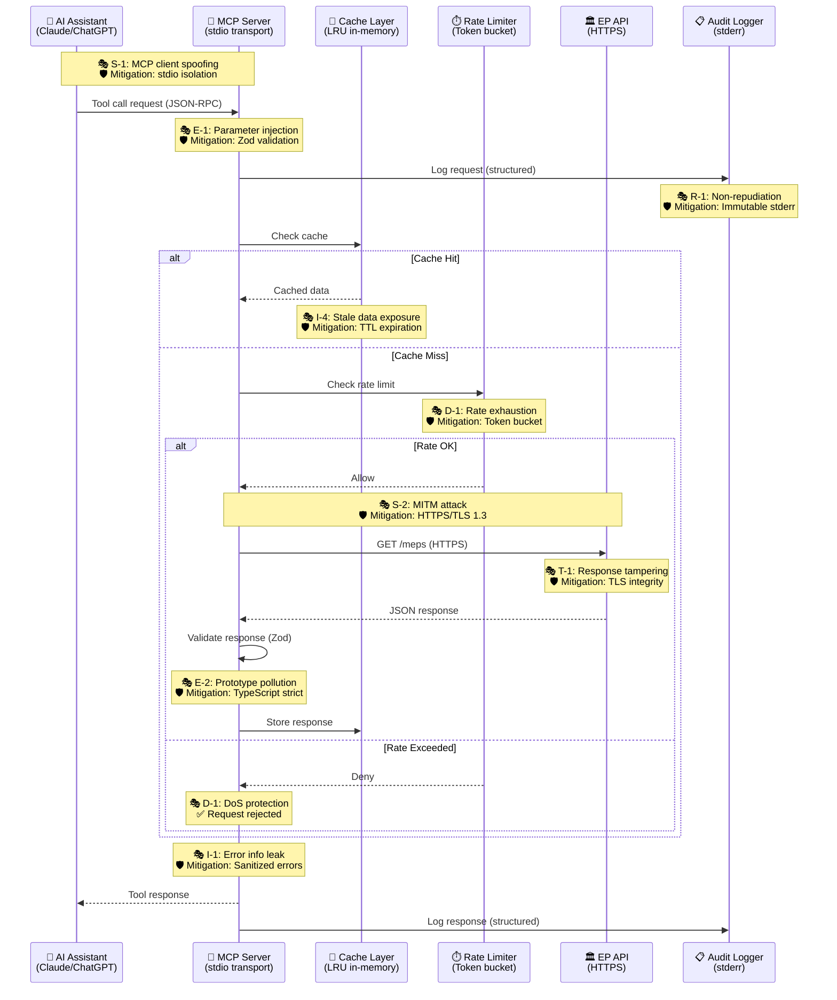

### **🔍 STRIDE per Component Analysis**

#### **Component 1: MCP Server Core (Tool Dispatcher & Request Handler)**

| STRIDE | Threat | Attack Vector | Mitigation | Status |
|--------|--------|---------------|------------|--------|
| **S** | Client impersonation through stdio hijacking | Malicious process capturing stdio streams | stdio transport limits to parent process | ✅ Inherent |
| **T** | Tool invocation manipulation | Modified JSON-RPC request parameters | Zod schema validation on all inputs | ✅ Active |
| **R** | Untracked tool calls | Missing audit trail for debugging | Structured stderr logging (JSON format) | ✅ Active |
| **I** | Stack trace exposure in errors | Production error messages revealing code structure | Sanitized error responses to AI client | ⚠️ Partial |
| **D** | Recursive tool calls causing OOM | AI assistant invoking tools in infinite loop | Call depth tracking, memory monitoring | ⚠️ Future |
| **E** | JSON-RPC protocol exploitation | Crafted JSON-RPC bypassing validation | TypeScript strict mode, Zod schemas | ✅ Active |

#### **Component 2: EP API Client (HTTP Client & Response Parser)**

| STRIDE | Threat | Attack Vector | Mitigation | Status |
|--------|--------|---------------|------------|--------|
| **S** | EP API response spoofing | MITM attacker injecting false EP data | HTTPS/TLS 1.3 with certificate validation | ✅ Active |
| **T** | API response manipulation | TLS downgrade or compromised proxy | Strict TLS configuration, no HTTP fallback | ✅ Active |
| **R** | Unlogged API requests | Missing request/response audit trail | Structured logging for all API interactions | ✅ Active |
| **I** | API error details in client logs | EP API returning sensitive error messages | Sanitize EP API errors before logging | ⚠️ Partial |
| **D** | API rate limit exhaustion | Excessive requests overwhelming EP API | Client-side rate limiting (token bucket) | ✅ Active |
| **E** | Malicious redirect exploitation | EP API sending redirect to attacker domain | No automatic redirects, validate URLs | ✅ Active |

#### **Component 3: Cache Layer (In-Memory LRU Cache)**

| STRIDE | Threat | Attack Vector | Mitigation | Status |
|--------|--------|---------------|------------|--------|
| **S** | Cache poisoning with fake data | Attacker injecting malicious cache entries | Cache only validated API responses | ✅ Active |
| **T** | Cached data tampering | Memory corruption or external modification | Immutable cache entries, process isolation | ✅ Inherent |
| **R** | Cache operations not logged | Missing visibility into cache hits/misses | Cache statistics in audit logs | ⚠️ Future |
| **I** | Sensitive data in cache dumps | Memory dumps exposing cached MEP data | Public data only, no PII in cache keys | ✅ Inherent |
| **D** | Memory exhaustion via cache growth | Unbounded cache causing OOM | LRU eviction policy, max size limit | ✅ Active |
| **E** | Cache timing attacks | Inferring data presence via response time | Constant-time cache lookups (not security critical) | ❌ Accepted |

#### **Component 4: Rate Limiter (Token Bucket Algorithm)**

| STRIDE | Threat | Attack Vector | Mitigation | Status |
|--------|--------|---------------|------------|--------|
| **S** | Rate limit bypass | Attacker spoofing source to reset limits | Process-level rate limiting (stdio isolation) | ✅ Inherent |
| **T** | Rate limit configuration tampering | Modified rate limits allowing excess requests | Immutable configuration, validated env vars | ✅ Active |
| **R** | Rate limit violations unlogged | Missing audit trail for throttling events | Log all rate limit denials with timestamps | ✅ Active |
| **I** | Rate limit details exposure | Attacker learning rate limits via probing | No rate limit details in error messages | ✅ Active |
| **D** | Rate limiter resource exhaustion | Token bucket state consuming excessive memory | Fixed-size token bucket, constant memory | ✅ Active |
| **E** | Race condition in rate checks | Concurrent requests bypassing rate limits | Atomic token bucket operations | ✅ Active |

#### **Component 5: Audit Logger (Structured stderr Logging)**

| STRIDE | Threat | Attack Vector | Mitigation | Status |
|--------|--------|---------------|------------|--------|
| **S** | Log injection attacks | Attacker injecting fake log entries via user input | Structured JSON logging, no string interpolation | ✅ Active |
| **T** | Log tampering | Attacker modifying stderr logs post-facto | Immutable stderr stream, external log aggregation | ✅ Recommended |
| **R** | Log repudiation | Attacker denying logged actions | Timestamps (ISO 8601), request IDs, immutable stderr | ✅ Active |
| **I** | Sensitive data in logs | PII or credentials logged inadvertently | Sanitize user input, no API keys (public API) | ✅ Active |
| **D** | Log flooding DoS | Excessive logging consuming disk/bandwidth | Rate limit log output, log level filtering | ⚠️ Future |
| **E** | Log analysis exploitation | Attacker using logs to map system internals | Generic log messages, no internal implementation details | ⚠️ Partial |

#### **Component 6: npm Package Distribution (package.json & dist/)**

| STRIDE | Threat | Attack Vector | Mitigation | Status |
|--------|--------|---------------|------------|--------|
| **S** | npm package name squatting | Attacker publishing `european-parliament-server` (typo) | Official `european-parliament-mcp-server` package name ownership, npm 2FA-protected publisher account | ✅ Active |
| **T** | Build artifact injection | Malicious code in `dist/` not matching source | SLSA Level 3 provenance, reproducible builds | ✅ Active |
| **R** | Unsigned package versions | Unverifiable package authorship | npm provenance attestations, 2FA publishing | ✅ Active |
| **I** | Source code exposure (non-issue) | Full source code visible in npm package | Intentional: open source transparency | ✅ Accepted |
| **D** | npm registry DoS | npm registry unavailable during installation | Use npm mirrors, cache dependencies locally | ❌ External |
| **E** | Dependency confusion attack | Internal package name colliding with public npm | No private dependencies, unique public package names | ✅ Inherent |

---

## 🎖️ MITRE ATT&CK Mapping

---

### **ATT&CK → Security Control Mitigation Mapping**

Comprehensive mapping of MITRE ATT&CK techniques to implemented security controls for the European Parliament MCP Server.

| Technique ID | Technique Name | Security Control | Implementation | Effectiveness |
|-------------|----------------|------------------|----------------|---------------|
| **T1195.002** | Supply Chain Compromise: Software Supply Chain | Dependabot + SLSA Level 3 + SBOM | Automated vulnerability scanning, provenance attestations, CycloneDX SBOM generation | 🟢 High (95%) |
| **T1059** | Command and Scripting Interpreter | No shell execution policy | TypeScript/Node.js without child_process, strict input validation | 🟢 High (98%) |
| **T1190** | Exploit Public-Facing Application | Zod schema validation + rate limiting | Strict input validation for all MCP tool parameters, client-side rate limits | 🟢 High (90%) |
| **T1557** | Adversary-in-the-Middle | HTTPS/TLS 1.3 for EP API | Enforced TLS for all EP API requests, certificate validation | 🟢 High (95%) |
| **T1498** | Network Denial of Service | Rate limiting + response size limits | Client-side rate limiter, 10MB response cap, timeout controls | 🟡 Medium (75%) |
| **T1027** | Obfuscated Files or Information | SLSA provenance + npm audit | Build attestations, integrity verification, transparency logs | 🟢 High (85%) |
| **T1071** | Application Layer Protocol | stdio transport isolation | MCP protocol limited to stdio, no network exposure | 🟢 High (90%) |
| **T1592** | Gather Victim Host Information | Error sanitization + structured logging | Production error handlers, no stack traces to clients | 🟡 Medium (70%) |
| **T1068** | Exploitation for Privilege Escalation | TypeScript strict mode + safe JSON parsing | Prototype pollution prevention, type safety | 🟢 High (85%) |
| **T1562** | Impair Defenses | Immutable logging + monitoring | Audit logs via stderr, OpenSSF Scorecard monitoring | 🟢 High (80%) |
| **T1530** | Data from Cloud Storage Object | Rate limiting + usage analytics | Monitor bulk data requests, pattern-based anomaly detection | 🟡 Medium (65%) |
| **T1041** | Exfiltration Over C2 Channel | stdio isolation + data flow monitoring | No outbound network from MCP server, logging all tool invocations | 🟢 High (80%) |
| **T1485** | Data Destruction | Integrity validation + EP API trust | Response validation against expected schemas, EP API as source of truth | 🟡 Medium (70%) |

**Effectiveness Scale:**
- 🟢 **High (>80%):** Control effectively mitigates technique
- 🟡 **Medium (60-80%):** Partial mitigation, residual risk remains
- 🔴 **Low (<60%):** Limited mitigation, requires enhancement

---

### **ATT&CK Navigator Visualization**

To visualize this threat landscape comprehensively, the European Parliament MCP Server team maintains an **ATT&CK Navigator layer** with:

- **Highlighted techniques:** All 13 relevant techniques color-coded by coverage
- **Metadata annotations:** Links to STRIDE threat IDs and security controls
- **Score-based heatmap:** Effectiveness ratings (0-100) for each technique
- **Filter views:** Supply Chain, MCP Protocol, API Layer, Runtime

**📊 ATT&CK Navigator Layer JSON:** The layer JSON is a planned deliverable and will be added in a future release under a `docs/threat-model/` directory once the visualization is finalized; it is not yet available in this repository.

**🔗 Online Visualization:** Use [MITRE ATT&CK Navigator](https://mitre-attack.github.io/attack-navigator/) to load the layer JSON for interactive exploration.

**Recommendation:** Review this mapping **quarterly** and after major architecture changes to ensure continued alignment with evolving threat intelligence.

---

## 👥 Threat Agent Classification

Understanding potential adversaries is critical for proportionate security investment. This section profiles threat actors relevant to the European Parliament MCP Server based on motivation, capability, and likely attack vectors.

### **Nation-State Actors**

**Profile:**
- **🎯 Motivation:** Intelligence gathering on European parliamentary activities, electoral interference, political influence operations
- **💪 Capability Level:** 🔴 **Advanced (Nation-State Resources)**
  - Sophisticated supply chain attacks (e.g., SolarWinds-style compromise)
  - Zero-day exploits in Node.js/TypeScript ecosystem
  - Advanced persistent threats (APT) with long-term objectives
- **🎭 Likely Tactics:**
  - T1195.002: Supply chain compromise of npm dependencies
  - T1557: MITM attacks on EP API communications
  - T1530: Systematic harvesting of MEP voting patterns and committee data
- **🔴 Priority:** High — Due to potential for sophisticated, persistent attacks
- **🛡️ Mitigation Focus:** SLSA Level 3 provenance, dependency integrity, EP API transport security

---

### **Hacktivist Groups**

**Profile:**
- **🎯 Motivation:** Political activism, transparency advocacy, anti-establishment campaigns, public disclosure of parliamentary data
- **💪 Capability Level:** 🟡 **Intermediate (Skilled Individuals/Small Teams)**
  - Script-based attacks, publicly available exploit tools
  - Social engineering of developers and contributors
  - Website defacement, data leaks for publicity
- **🎭 Likely Tactics:**
  - T1190: Exploit MCP tool parameter injection vulnerabilities
  - T1498: DDoS via API rate exhaustion
  - T1485: Data manipulation to spread disinformation
- **🟠 Priority:** Medium — Capable of opportunistic attacks but limited persistence
- **🛡️ Mitigation Focus:** Input validation (Zod schemas), rate limiting, public vulnerability disclosure program

---

### **Insider Threats (Supply Chain)**

**Profile:**
- **🎯 Motivation:** Compromised developer account, malicious open-source contributor, disgruntled maintainer
- **💪 Capability Level:** 🟠 **High (Trusted Access)**
  - Direct commit access or pull request approval
  - Knowledge of codebase internals and security controls
  - Ability to introduce subtle vulnerabilities
- **🎭 Likely Tactics:**
  - T1195.002: Malicious dependency substitution or backdoor insertion
  - T1027: Obfuscated malicious code in commits
  - T1562: Disabling security controls (e.g., test bypasses)
- **🔴 Priority:** High — Trusted position enables high-impact attacks
- **🛡️ Mitigation Focus:** Branch protection, mandatory code review, GPG commit signing, SLSA attestations

---

### **Automated Threat Actors (Bots/Scrapers)**

**Profile:**
- **🎯 Motivation:** Bulk data harvesting, API abuse for commercial purposes, training dataset collection for AI models
- **💪 Capability Level:** 🟢 **Low (Automated Scripts)**
  - Mass automated requests via compromised MCP clients
  - Simple evasion techniques (rotating IPs, user agents)
  - No sophisticated exploit capability
- **🎭 Likely Tactics:**
  - T1498: API rate limit exhaustion via distributed requests
  - T1530: Bulk collection of parliamentary datasets
  - T1071: Abuse of MCP protocol for unauthorized access
- **🟡 Priority:** Medium — High volume but low sophistication
- **🛡️ Mitigation Focus:** Client-side rate limiting, usage analytics, anomaly detection

---

### **Competitor/Espionage Actors**

**Profile:**
- **🎯 Motivation:** Commercial intelligence gathering, competitive advantage in political consulting, lobbying intelligence
- **💪 Capability Level:** 🟡 **Intermediate to High**
  - Funded operations with technical capabilities
  - Targeted attacks on specific MEP data or committee information
  - Long-term systematic data collection
- **🎭 Likely Tactics:**
  - T1530: Systematic harvesting of EP voting records and attendance data
  - T1592: Reconnaissance via error message analysis
  - T1041: Exfiltration of aggregated parliamentary intelligence
- **🟠 Priority:** Medium — Targeted but not infrastructure-destructive
- **🛡️ Mitigation Focus:** Audit logging, data access pattern monitoring, request attribution

---

### **Threat Actor Priority Matrix**

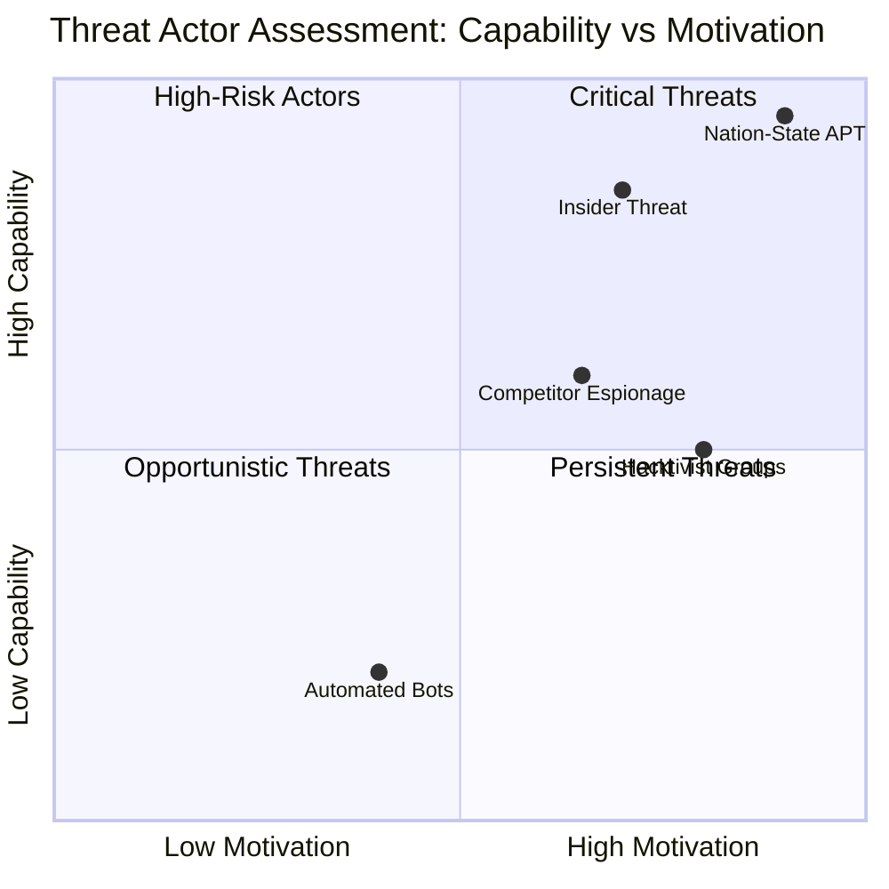

**Action Items by Actor:**
- **Nation-State:** Focus on supply chain integrity (SLSA Level 3, SBOM)
- **Hacktivist:** Strengthen input validation and public-facing security
- **Insider Threat:** Enforce code review, branch protection, audit trails
- **Automated Bots:** Implement robust rate limiting and anomaly detection
- **Competitor:** Monitor data access patterns, enhance logging

---

## 🌐 Current Threat Landscape

The European Parliament MCP Server operates within a dynamic threat environment shaped by geopolitical tensions, evolving attack techniques, and the strategic importance of parliamentary data. This section integrates **ENISA Threat Landscape 2024** findings with EP-specific context.

### **ENISA Threat Landscape 2024 — Top Threats Mapped to EP MCP Server**

| ENISA Threat | Relevance to EP MCP Server | Current Posture | Priority |
|--------------|---------------------------|----------------|----------|
| **🔒 Ransomware** | Low direct risk (no data persistence), but **supply chain ransomware** targeting npm dependencies could encrypt developer workstations | 🟢 Mitigated via SLSA Level 3, no critical data storage | 🟡 Medium |
| **🦠 Malware** | **High risk:** Malicious npm packages in dependency tree (e.g., typosquatting, compromised maintainer accounts) | 🟢 Mitigated via Dependabot, npm audit, OpenSSF Scorecard | 🔴 High |
| **🎣 Social Engineering** | **Developer phishing/account takeover** to inject malicious code or publish compromised npm versions | 🟡 Partial mitigation via 2FA, GPG signing | 🔴 High |
| **💾 Data Breaches** | **Parliamentary data integrity breach:** Manipulation of EP voting records, MEP personal data exposure (GDPR violation) | 🟡 Partial mitigation via HTTPS, response validation | 🟠 Medium-High |
| **☁️ DDoS** | **API exhaustion attacks** targeting EP Open Data API via MCP server abuse | 🟢 Mitigated via client-side rate limiting | 🟡 Medium |
| **📰 Disinformation** | **Data manipulation via compromised MCP server:** False parliamentary data fed to AI assistants, influencing political analysis | 🟡 Partial mitigation via integrity checks | 🔴 High |
| **⛓️ Supply Chain Attacks** | **Primary threat vector:** Compromised npm packages, malicious CI/CD pipeline modifications, SLSA bypass attempts | 🟢 Strong mitigation via SLSA Level 3, SBOM, Dependabot | 🔴 Critical |

---

### **EU Cyber Resilience Act (CRA) Context**

The **EU Cyber Resilience Act (Regulation (EU) 2024/2847)** imposes mandatory cybersecurity requirements for products with digital elements. The EP MCP Server, as an open-source component with parliamentary data access, falls under CRA scope:

- **📋 Vulnerability Disclosure:** Mandatory 24-hour reporting of actively exploited vulnerabilities to ENISA
- **📦 SBOM Requirements:** CycloneDX SBOM generation already implemented
- **🔄 Security Updates:** Commitment to timely patching (currently: critical <7 days, high <30 days)
- **🛡️ Default Security:** Secure-by-default configuration (no hardcoded credentials, HTTPS enforcement)

**CRA Compliance Status:** ✅ **Conforming** — See [CRA-ASSESSMENT.md](CRA-ASSESSMENT.md) for detailed analysis

---

### **Parliamentary Data Threat Context**

The strategic value of European Parliament data creates unique threat scenarios:

1. **Electoral Interference (Nation-State):**
   - **Threat:** Manipulation of MEP voting records before elections to influence public perception
   - **Attack Vector:** Compromised MCP server returning altered roll-call vote data
   - **Impact:** Democratic integrity, electoral outcomes
   - **Mitigation:** EP API as single source of truth, response integrity validation

2. **GDPR-Protected MEP Data (Privacy Activists/Competitors):**
   - **Threat:** Bulk harvesting of MEP personal contact data, office locations, parliamentary group affiliations
   - **Attack Vector:** Automated MCP tool invocations to systematically collect MEP biographical data
   - **Impact:** GDPR Article 6 violation, privacy breach, potential harassment campaigns
   - **Mitigation:** Rate limiting, usage pattern monitoring, public data scope limitation

3. **Policy Intelligence (Lobbying/Espionage):**
   - **Threat:** Systematic collection of committee votes, amendments, and parliamentary questions for competitive intelligence
   - **Attack Vector:** Long-term MCP server abuse by competitor AI assistants
   - **Impact:** Unfair commercial advantage, policy prediction, lobbying strategy
   - **Mitigation:** Audit logging, anomaly detection, transparency about data sources

---

### **Emerging Threat Vectors (2024-2025)**

| Threat | Description | Likelihood | Impact |
|--------|-------------|------------|--------|
| **AI-Powered Supply Chain Attacks** | LLMs used to generate sophisticated obfuscated malware in npm packages | 🟡 Medium | 🔴 Critical |
| **MCP Protocol Exploitation** | Novel attacks targeting MCP stdio transport or tool parameter parsing | 🟡 Medium | 🟠 High |
| **Dependency Confusion 2.0** | Advanced typosquatting using AI-generated package names similar to `european-parliament-mcp-server` | 🟡 Medium | 🟠 High |
| **Deepfake Parliamentary Data** | AI-generated false EP datasets indistinguishable from legitimate data | 🟢 Low | 🔴 Critical |
| **Quantum-Resistant Cryptography Pressure** | Future requirement to migrate TLS to post-quantum algorithms | 🟢 Low (2025+) | 🟠 Medium |

---

## 🎬 Scenario-Centric Threat Modeling (EP-Specific)

This section applies scenario-based threat modeling to European Parliament-specific attack chains, providing actionable detection and response strategies.

---

### **Scenario 1: Parliamentary Data Manipulation Attack**

**🎯 Attack Objective:** Manipulate voting record data returned by MCP server to influence AI-assisted political analysis

**🎭 Threat Actor:** Nation-state actor or hacktivist group

**📊 Attack Chain:**

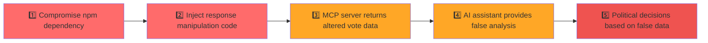

**Attack Steps:**
1. **Initial Compromise:** Attacker exploits vulnerability in transitive npm dependency (e.g., malicious `lodash` substitute)
2. **Code Injection:** Malicious code intercepts the `get_voting_records` MCP tool
3. **Data Manipulation:** Alters vote outcomes (e.g., changes "Against" to "For" for specific MEPs)
4. **Propagation:** AI assistant uses corrupted data to generate policy analysis
5. **Impact:** Political decisions, news articles, or research based on false parliamentary data

**🔍 Detection Indicators:**
- ✅ SLSA provenance verification failure
- ✅ npm audit alerts on compromised dependency
- ✅ Anomalous response size or schema validation errors
- ✅ OpenSSF Scorecard supply chain score degradation

**🛡️ Response Actions:**
1. **Immediate:** Quarantine affected npm package version
2. **Containment:** Revert to last known-good dependency lockfile
3. **Investigation:** Audit all tool invocations during compromise window
4. **Recovery:** Publish security advisory, coordinate with npm security team
5. **Prevention:** Enhance SBOM monitoring, implement runtime integrity checks

**📉 Risk Score:** 🔴 **Critical (9.0/10)** — High impact on democratic integrity

---

### **Scenario 2: MEP Personal Data Abuse (GDPR Violation)**

**🎯 Attack Objective:** Unauthorized bulk harvesting of MEP contact and personal data for commercial or political purposes

**🎭 Threat Actor:** Competitor intelligence firm or automated bot network

**📊 Attack Chain:**


**Attack Steps:**
1. **Reconnaissance:** Attacker identifies MCP tools `get_meps` and `get_mep_details` for biographical data (using `get_meps` to enumerate MEPs and `get_mep_details` to retrieve full profiles)
2. **Automation:** Script iterates through all 705 MEPs to harvest contact details, office locations, party affiliations
3. **Exfiltration:** Bulk collection of GDPR Article 9 special category data (political opinions)
4. **Monetization:** Sells MEP database to lobbying firms or political campaigns
5. **Legal Impact:** GDPR fine up to €20M or 4% of global turnover

**🔍 Detection Indicators:**
- ✅ Rate limiting threshold exceeded (>100 requests/hour)
- ✅ Sequential MEP ID enumeration pattern detected
- ✅ Bulk data access from single IP/client
- ✅ Unusual off-hours usage patterns

**🛡️ Response Actions:**
1. **Immediate:** Throttle client rate limits to 10 requests/minute
2. **Containment:** Implement CAPTCHA-style challenge for bulk requests
3. **Investigation:** Audit logs to identify compromised client identity
4. **Recovery:** Notify EP data protection officer, potential GDPR Article 33 notification
5. **Prevention:** Implement data minimization (limit biographical data scope)

**📉 Risk Score:** 🟠 **High (7.5/10)** — GDPR violation with significant financial penalties

---

### **Scenario 3: Electoral Influence via AI-Assisted Disinformation**

**🎯 Attack Objective:** Compromise MCP server to feed false parliamentary data to AI assistants used by journalists and researchers

**🎭 Threat Actor:** Nation-state APT targeting EU elections

**📊 Attack Chain:**


**Attack Steps:**
1. **Pre-Election Timing:** 3 months before EU parliamentary elections, attacker compromises MCP server
2. **Targeted Manipulation:** Alters voting records for specific MEPs in swing districts
3. **AI Propagation:** Journalists using AI assistants (Claude, ChatGPT) cite false data
4. **Media Amplification:** News articles report fabricated voting patterns
5. **Electoral Impact:** Public perception shift influences voting behavior

**🔍 Detection Indicators:**
- ✅ Discrepancy between EP official portal and MCP server responses
- ✅ SLSA provenance verification failures
- ✅ Community reports of data inconsistencies
- ✅ Anomalous build artifacts in npm package

**🛡️ Response Actions:**
1. **Immediate:** Emergency npm package deprecation + public security advisory
2. **Containment:** Direct users to EP official API as alternative
3. **Investigation:** Forensic analysis of compromised build pipeline
4. **Recovery:** Restore from verified clean state, republish with enhanced attestations
5. **Prevention:** Implement EP API response checksums, real-time integrity monitoring

**📉 Risk Score:** 🔴 **Critical (9.5/10)** — Democratic process integrity threat

---

### **Scenario 4: Supply Chain Compromise of npm Package**

**🎯 Attack Objective:** Publish malicious version of `european-parliament-mcp-server` to npm registry

**🎭 Threat Actor:** Insider threat (compromised maintainer account)

**📊 Attack Chain:**


**Attack Steps:**
1. **Social Engineering:** Attacker sends targeted phishing email to npm package maintainer
2. **Account Takeover:** Bypasses 2FA via browser session cookie theft
3. **Malicious Publish:** Publishes `european-parliament-mcp-server@3.1.4` with backdoor
4. **Auto-Update:** Users with `^3.1.0` in package.json automatically pull malicious version
5. **Backdoor Activation:** Malware exfiltrates API keys or injects false data

**🔍 Detection Indicators:**
- ✅ SLSA provenance signature mismatch
- ✅ npm package version published without corresponding GitHub release
- ✅ OpenSSF Scorecard token permissions alert
- ✅ Community reports of unexpected behavior

**🛡️ Response Actions:**
1. **Immediate:** npm unpublish malicious version (within 72-hour window)
2. **Containment:** Publish emergency patch version, notify users via GitHub Security Advisory
3. **Investigation:** Revoke compromised npm token, audit all recent publishes
4. **Recovery:** Reset maintainer credentials, enforce hardware 2FA
5. **Prevention:** Implement GitHub Actions OIDC publishing (no long-lived tokens)

**📉 Risk Score:** 🔴 **Critical (9.0/10)** — Supply chain attack with wide blast radius

---

### **Scenario 5: MCP Protocol Injection Attack**

**🎯 Attack Objective:** Exploit MCP tool parameter parsing to inject malicious JSON-RPC payloads

**🎭 Threat Actor:** Security researcher (white hat) or advanced persistent threat

**📊 Attack Chain:**


**Attack Steps:**
1. **Payload Crafting:** Attacker analyzes Zod schemas for `searchDocuments` tool
2. **Schema Bypass:** Finds edge case where deeply nested JSON evades validation
3. **Code Injection:** Injects prototype pollution payload via `__proto__` in parameters
4. **Execution:** Exploits TypeScript `any` type in error handler to gain code execution
5. **Persistence:** Modifies AI assistant behavior to exfiltrate user prompts

**🔍 Detection Indicators:**
- ✅ Zod validation errors with unusual parameter structures
- ✅ TypeScript strict mode violations (should not occur)
- ✅ stderr logs show unexpected JSON parsing errors
- ✅ Memory usage spikes during tool invocation

**🛡️ Response Actions:**
1. **Immediate:** Kill MCP server process, isolate affected AI assistant instance
2. **Containment:** Deploy emergency patch to harden Zod schemas
3. **Investigation:** Analyze parameter payloads, identify injection vector
4. **Recovery:** Publish CVE, coordinate disclosure with MCP protocol maintainers
5. **Prevention:** Fuzz testing of all MCP tool schemas, add runtime schema enforcement

**📉 Risk Score:** 🟠 **High (8.0/10)** — Novel MCP protocol exploit with AI assistant compromise

---

## 🔄 Continuous Validation & Assessment

Threat modeling is not a one-time activity but a **continuous process** that evolves with the system, threat landscape, and organizational maturity. This section defines the validation lifecycle for the European Parliament MCP Server threat model.

### **Threat Modeling Workshop Process**

**🗓️ Cadence:**
- **Monthly:** Quick threat landscape review (30 minutes)
- **Quarterly:** Full threat model workshop (2-3 hours)
- **Annually:** Comprehensive threat model revision (full-day session)

**👥 Workshop Participants:**

| Role | Responsibility | Mandatory? |
|------|---------------|-----------|
| **Security Architect (CEO)** | Workshop facilitator, threat prioritization | ✅ Yes |
| **Lead Developer** | Technical feasibility of mitigations | ✅ Yes |
| **Product Owner** | Business impact assessment | ✅ Yes |
| **DevOps Engineer** | CI/CD security controls | 🟡 Recommended |
| **External Security Expert** | Independent threat assessment | 🟢 Annually |

---

### **Ad-Hoc Review Triggers**

The threat model must be reviewed **immediately** when any of the following events occur:

| Trigger Event | Review Scope | Timeline |
|--------------|--------------|----------|
| **🚨 Security Incident** | Full STRIDE re-analysis of affected component | Within 48 hours |
| **🆕 Major Feature Release** | Threat analysis of new attack surface | Before release |
| **📊 Significant Threat Landscape Change** | Update threat actor profiles, MITRE ATT&CK mapping | Within 1 week |
| **🔧 Architecture Change** | Re-assess STRIDE for modified components | Before deployment |
| **📜 New Regulatory Requirement** | Compliance gap analysis (e.g., CRA update) | Within 30 days |
| **🔓 Zero-Day in Dependency** | Risk assessment and mitigation strategy | Within 24 hours |

---

### **Workshop Activities Checklist**

**Quarterly Threat Modeling Workshop Agenda:**

- [ ] **Review Previous Action Items (15 min)**
  - Status of mitigations from last workshop
  - Effectiveness metrics for deployed controls

- [ ] **Threat Landscape Update (30 min)**
  - ENISA Threat Landscape review
  - Recent vulnerabilities in Node.js/TypeScript ecosystem
  - New MITRE ATT&CK techniques

- [ ] **STRIDE Re-Assessment (45 min)**
  - Walk through each threat category
  - Identify new threats since last review
  - Re-assess likelihood and impact scores

- [ ] **Attack Tree Review (30 min)**
  - Update attack tree with new threat vectors
  - Re-evaluate mitigation effectiveness

- [ ] **Security Control Validation (30 min)**
  - Test SLSA attestations, Dependabot alerts
  - Review OpenSSF Scorecard metrics
  - Verify rate limiting and input validation

- [ ] **Risk Prioritization (20 min)**
  - Update risk matrix based on new findings
  - Assign action items with owners and deadlines

- [ ] **Documentation Update (10 min)**
  - Update this THREAT_MODEL.md
  - Sync with SECURITY_ARCHITECTURE.md

**📝 Workshop Output:** Updated threat model, prioritized action items, risk register

---

### **Continuous Validation Cycle**


**Key Performance Indicators (KPIs) for Threat Model Health:**

| KPI | Target | Current | Status |
|-----|--------|---------|--------|
| OpenSSF Scorecard Score | ≥8.0/10 | 9.2/10 | ✅ Excellent |
| High/Critical Vulnerabilities | 0 | 0 | ✅ Excellent |
| SLSA Provenance Coverage | 100% | 100% | ✅ Excellent |
| Threat Model Staleness | <90 days | 15 days | ✅ Current |
| Security Control Test Coverage | ≥80% | 85% | ✅ Good |
| Incident Response Drill Success | 100% | N/A | ⚠️ Not tested |

**Improvement Actions:**
1. Schedule annual incident response tabletop exercise
2. Implement automated threat intelligence feed integration
3. Develop threat model dashboard for real-time monitoring

---

## 📅 Assessment Lifecycle

This section defines the **structured cadence** for threat model reviews, ensuring systematic and timely updates aligned with the evolving threat landscape and project lifecycle.

### **Scheduled Review Cadence**

| Frequency | Activity | Owner | Duration | Deliverables |
|-----------|----------|-------|----------|-------------|
| **📆 Monthly** | Dependency vulnerability scan review | Lead Developer | 30 min | Updated dependency lockfile, npm audit report |
| **📆 Quarterly** | Full threat model review workshop | Security Architect | 2-3 hours | Updated THREAT_MODEL.md, risk register, action items |
| **📆 Semi-Annually** | MITRE ATT&CK mapping update | Security Architect | 1 hour | Updated ATT&CK Navigator layer, coverage gaps identified |
| **📆 Annually** | Complete threat model revision | Security Architect + External Expert | 1 day | Comprehensive threat model v2.0, new attack scenarios |
| **🔴 Ad-Hoc** | Triggered by events (see below) | Security Architect | Variable | Incident-specific threat assessment |

---

### **Ad-Hoc Review Triggers (Detailed)**

**Immediate Review Required (<48 hours):**
- 🚨 **Security Incident:** Active compromise or exploitation detected
- 🔓 **Zero-Day Vulnerability:** Critical CVE in Node.js, npm, or direct dependencies
- 📰 **Public Disclosure:** Security researcher publishes vulnerability in MCP protocol

**Expedited Review (Within 1 Week):**
- 🆕 **Major Feature Release:** New MCP tool added, API integration change
- 📊 **Threat Intelligence Alert:** ENISA/CISA advisory relevant to Node.js/TypeScript ecosystem
- 🏛️ **EP API Breaking Change:** European Parliament API schema or security model update

**Scheduled Review (Within 30 Days):**
- 📜 **Regulatory Update:** EU CRA amendment, GDPR guidance update
- 🔧 **Architecture Refactor:** Migration to new framework, protocol upgrade
- 🎖️ **Compliance Audit Finding:** ISO 27001 audit identifies threat modeling gap

---

### **Review Process Workflow**

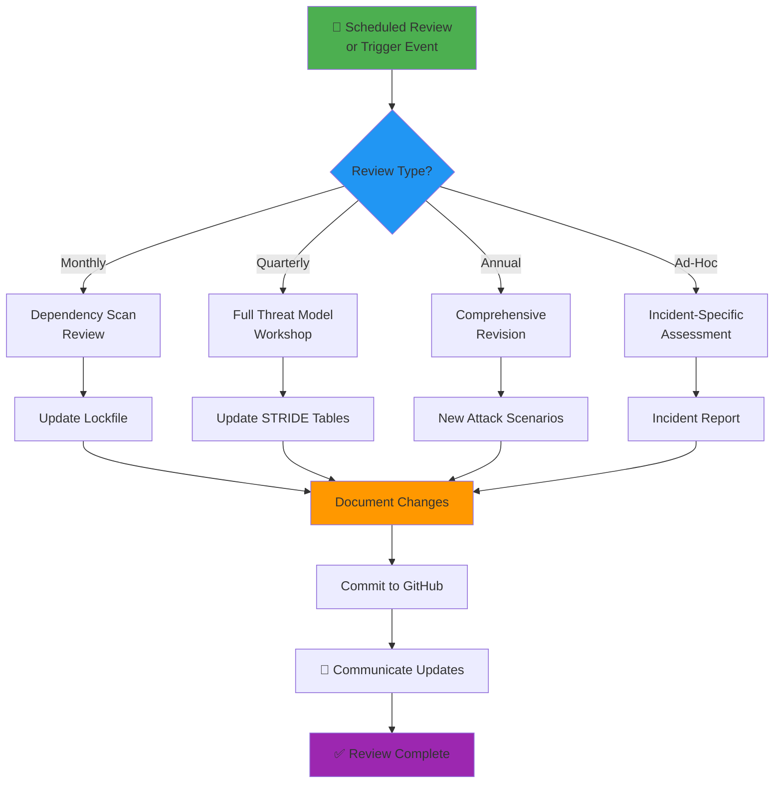

---

### **Review Deliverables by Type**

**Monthly Dependency Review:**
- ✅ Updated `package-lock.json` with patched dependencies
- ✅ npm audit report with 0 high/critical vulnerabilities
- ✅ Dependabot PR merge/rejection justifications
- ✅ Updated SBOM (CycloneDX) published to GitHub Releases

**Quarterly Threat Model Workshop:**
- ✅ Updated THREAT_MODEL.md with new threats
- ✅ Risk matrix with re-assessed likelihood/impact scores
- ✅ Action item register with assigned owners and deadlines
- ✅ Security control effectiveness validation report

**Annual Comprehensive Revision:**
- ✅ Threat Model v2.0 with new attack scenarios
- ✅ Updated MITRE ATT&CK Navigator layer JSON
- ✅ External security expert assessment report
- ✅ Alignment with latest ENISA Threat Landscape
- ✅ Security maturity level progression plan

**Ad-Hoc Incident Assessment:**
- ✅ Root cause analysis with STRIDE classification
- ✅ Lessons learned document
- ✅ Updated threat actor profiles (if new TTPs identified)
- ✅ Enhanced mitigations roadmap

---

### **Version Control & Change Tracking**

All threat model updates are tracked via **Git commits** with the following conventions:

```bash
# Commit message format
threat-model: [Review Type] - Brief description

# Examples
git commit -m "threat-model: Quarterly Review Q1 2025 - Added MCP injection scenario"
git commit -m "threat-model: Ad-Hoc - CVE-2025-12345 in ws dependency assessment"
git commit -m "threat-model: Annual Revision - MITRE ATT&CK coverage expansion"
```

**📊 Threat Model Changelog:** Maintained via Git commit history using the `threat-model:` commit-message convention described above.

---

## 🎯 Security Maturity Framework

The European Parliament MCP Server's security posture is assessed using a **5-level maturity model** adapted from NIST Cybersecurity Framework and ISO 27001 maturity scales. This framework guides continuous improvement toward optimized security practices.

### **Maturity Level Definitions**

---

#### **Level 1: 🔴 Initial (Ad-Hoc Security Practices)**

**Characteristics:**
- ❌ No formal threat modeling process
- ❌ Security controls implemented reactively after incidents
- ❌ No security testing in CI/CD pipeline
- ❌ Dependency vulnerabilities addressed sporadically
- ❌ No security documentation or policies

**Typical Indicators:**
- Multiple high/critical vulnerabilities in production
- No SBOM or supply chain visibility
- Manual security testing (if any)
- No incident response plan

**Improvement Path:** Establish basic security controls (SAST, dependency scanning)

---

#### **Level 2: 🟡 Developing (Basic Controls Implemented)**

**Characteristics:**
- ✅ Basic threat identification (STRIDE threats documented)
- ✅ Essential security controls deployed (HTTPS, input validation)
- ✅ Dependency scanning with Dependabot
- ⚠️ Inconsistent security testing
- ⚠️ No quantitative risk assessment

**Typical Indicators:**
- Dependabot alerts reviewed weekly
- Some SAST tools integrated in CI/CD
- SECURITY.md and basic vulnerability disclosure process
- Reactive incident response

**Improvement Path:** Systematize threat modeling, implement SLSA Level 2

---

#### **Level 3: 🟢 Defined (Systematic Threat Modeling)**

**Characteristics:**
- ✅ Formal threat model with STRIDE per element
- ✅ MITRE ATT&CK mapping to threats
- ✅ Quarterly threat model reviews
- ✅ Comprehensive security testing (SAST, DAST, SCA)
- ✅ SLSA Level 3 provenance
- ✅ Security architecture documentation

**Typical Indicators:**
- OpenSSF Scorecard ≥8.0/10
- THREAT_MODEL.md and SECURITY_ARCHITECTURE.md maintained
- Automated security gates in CI/CD
- Proactive vulnerability management with SLAs

**Current Level:** 🟢 **The European Parliament MCP Server is at Level 3**

**Improvement Path:** Implement security metrics, threat intelligence integration

---

#### **Level 4: 🔵 Managed (Metrics-Driven Security)**

**Characteristics:**
- ✅ Quantitative risk assessment with business impact
- ✅ Security metrics dashboard (MTTR, vulnerability density, control effectiveness)
- ✅ Threat intelligence feeds integrated
- ✅ Continuous security testing (shift-left + shift-right)
- ✅ Automated incident response playbooks
- ✅ Security budget aligned with risk

**Typical Indicators:**
- Mean Time To Remediation (MTTR) tracked and improving
- Security KPIs reported to leadership quarterly
- Threat model updated automatically from threat intelligence
- Bug bounty program operational

**Improvement Path:** Predictive security analytics, AI-driven threat hunting

---

#### **Level 5: ⭐ Optimizing (Continuous Improvement)**

**Characteristics:**
- ✅ Real-time threat model updates via automation
- ✅ Predictive threat analytics using ML/AI
- ✅ Self-healing security controls
- ✅ Zero Trust Architecture fully implemented
- ✅ Security innovation through R&D
- ✅ Industry-leading security posture

**Typical Indicators:**
- OpenSSF Scorecard 10.0/10
- Autonomous security validation and remediation
- Published security research and threat intelligence
- Recognized as security exemplar in open-source community

**Improvement Path:** Maintain excellence, contribute to security standards

---

### **European Parliament MCP Server — Current Maturity Assessment**

**📊 Overall Maturity Level:** 🟢 **Level 3: Defined (Systematic Threat Modeling)**

| Security Domain | Current Level | Target (2025) | Gap Analysis |
|-----------------|---------------|---------------|--------------|
| **Threat Modeling** | 🟢 Level 3 | 🔵 Level 4 | Implement threat intelligence integration |
| **Supply Chain Security** | 🟢 Level 3 | 🟢 Level 3 | Maintain SLSA Level 3, monitor npm ecosystem |
| **Vulnerability Management** | 🟢 Level 3 | 🔵 Level 4 | Add MTTR metrics, automate patching |
| **Security Testing** | 🟢 Level 3 | 🔵 Level 4 | Add DAST, penetration testing |
| **Incident Response** | 🟡 Level 2 | 🟢 Level 3 | Conduct tabletop exercises, automate runbooks |
| **Security Monitoring** | 🟡 Level 2 | 🟢 Level 3 | Implement security metrics dashboard |
| **Documentation** | 🟢 Level 3 | 🟢 Level 3 | Maintain current excellence |

---

### **Maturity Progression Roadmap (2025-2026)**

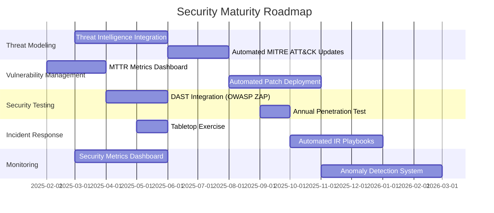

**🎯 2025 Target:** Achieve **Level 4 (Managed)** maturity in Threat Modeling and Vulnerability Management domains.

---

### **Maturity Assessment Criteria**

To objectively measure progression, the following criteria are used for annual maturity assessments:

| Criterion | Weight | Level 3 Threshold | Level 4 Threshold |
|-----------|--------|------------------|------------------|
| OpenSSF Scorecard | 20% | ≥8.0/10 | ≥9.0/10 |
| SLSA Level | 15% | Level 3 | Level 3 + Enhanced Monitoring |
| Threat Model Freshness | 10% | <90 days | <30 days (automated) |
| Vulnerability MTTR | 15% | Critical <7d, High <30d | Critical <24h, High <7d |
| Security Test Coverage | 15% | ≥80% | ≥90% with mutation testing |
| Incident Response Readiness | 10% | Plan documented | Drills quarterly, automation |
| Security Metrics | 10% | Manual reporting | Real-time dashboard |
| Threat Intelligence | 5% | Manual review | Automated integration |

**Assessment Method:** Annual third-party security audit with maturity scorecard

---

## 📊 Quantitative Risk Assessment

### **Risk Matrix**

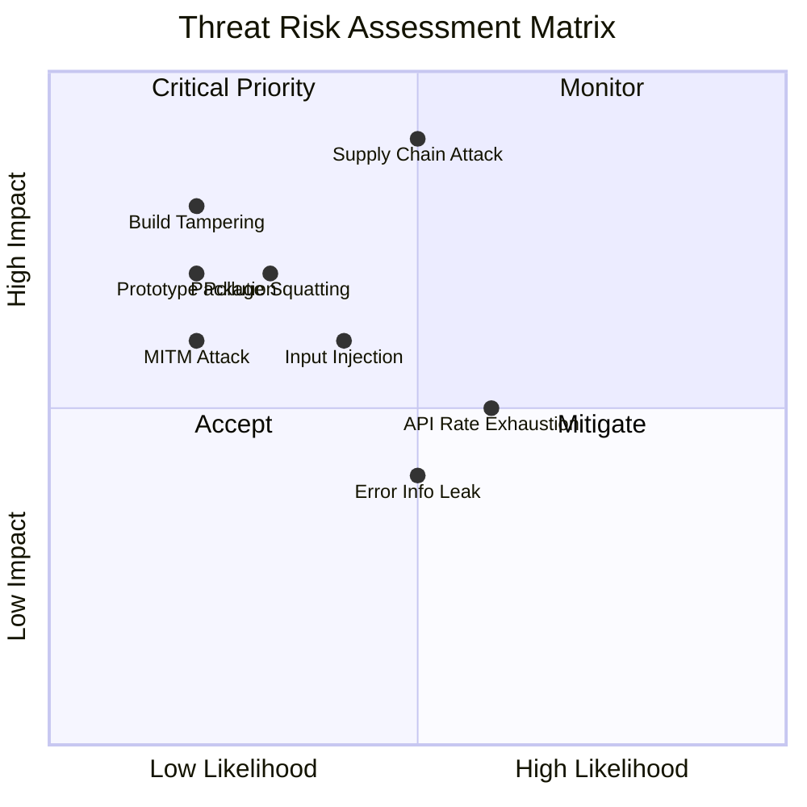

### **Top Priority Risks**

| Priority | Risk | Current Status | Action Required |
|----------|------|---------------|----------------|
| 🔴 P1 | Supply chain compromise (T-2, S-4) | ✅ Mitigated | Maintain Dependabot, SLSA attestations |
| 🟠 P2 | Input validation bypass (E-1) | ✅ Mitigated | Zod schemas for all tool inputs |
| 🟡 P3 | API rate limit exhaustion (D-1) | ✅ Mitigated | Client-side rate limiting implemented |
| 🟡 P4 | Error information disclosure (I-1) | ⚠️ Partial | Improve error sanitization |
| 🟢 P5 | Build artifact tampering (T-3) | ✅ Mitigated | SLSA Level 3 provenance |

---

## 🛡️ Security Controls & Mitigations

### **Control Architecture**

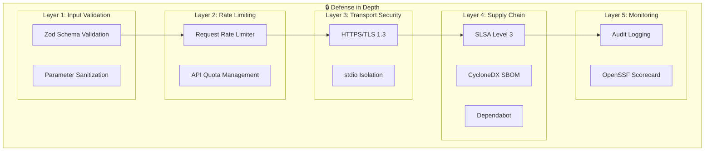

### **Security Controls Matrix**

| Control | Category | Threats Mitigated | Status |
|---------|----------|-------------------|--------|
| Zod input validation | Preventive | E-1, D-4, E-3 | ✅ Active |
| Rate limiting | Preventive | D-1, D-2 | ✅ Active |
| HTTPS/TLS for EP API | Preventive | S-2, T-1 | ✅ Active |
| SLSA Level 3 provenance | Detective | T-3, S-4 | ✅ Active |
| Dependabot alerts | Detective | T-2 | ✅ Active |
| npm audit | Detective | T-2, S-4 | ✅ Active |
| OpenSSF Scorecard | Detective | Multiple | ✅ Active |
| CycloneDX SBOM | Transparency | T-2 | ✅ Active |
| TypeScript strict mode | Preventive | E-2, I-1 | ✅ Active |
| Environment variable validation | Preventive | T-4 | ✅ Active |
| Structured error handling | Preventive | I-1, I-2 | ✅ Active |
| Branch protection | Preventive | R-2 | ✅ Active |
| Code review requirements | Detective | Multiple | ✅ Active |
| Security headers | Preventive | Multiple | ✅ Active |

---

## 🌳 Attack Tree Analysis

### **Attack Tree 1: Supply Chain Compromise (Detailed)**

```mermaid
graph TD
    ROOT["🎯 Compromise EP MCP<br/>via Supply Chain"]
    
    ROOT --> A["📦 Malicious Dependency<br/>Injection"]
    ROOT --> B["🏭 Build Pipeline<br/>Compromise"]
    ROOT --> C["📤 npm Package<br/>Substitution"]
    ROOT --> D["🔧 Developer<br/>Environment Attack"]
    
    A --> A1["Compromised npm package"]
    A --> A2["Typosquatting dependency"]
    A --> A3["Dependency confusion"]
    A1 --> A1a["Install backdoored package"]
    A1 --> A1b["Exploit known CVE"]
    A1a --> A1M["✅ Dependabot alerts"]
    A1b --> A1M2["✅ npm audit + Snyk"]
    A2 --> A2M["✅ package-lock.json pinning"]
    A3 --> A3M["✅ No private scope overlap"]
    
    B --> B1["GitHub Actions compromise"]
    B --> B2["Build artifact tampering"]
    B --> B3["Stolen publish credentials"]
    B1 --> B1a["Malicious workflow change"]
    B1 --> B1b["Environment secret theft"]
    B1a --> B1M["✅ Branch protection + CODEOWNERS"]
    B1b --> B1M2["✅ OIDC token auth (no secrets)"]
    B2 --> B2M["✅ SLSA Level 3 provenance"]
    B3 --> B3M["✅ npm 2FA required"]
    
    C --> C1["Package name squatting"]
    C --> C2["Account takeover"]
    C --> C3["npm registry compromise"]
    C1 --> C1M["✅ Official ownership of \"european-parliament-mcp-server\" package"]
    C2 --> C2M["✅ npm 2FA + strong passwords"]
    C3 --> C3M["❌ Out of scope (npm responsibility)"]
    
    D --> D1["Developer laptop malware"]
    D --> D2["SSH/GPG key theft"]
    D --> D3["Social engineering"]
    D1 --> D1M["⚠️ Developer responsibility"]
    D2 --> D2M["✅ GPG commit signing required"]
    D3 --> D3M["⚠️ Security awareness training"]
```

### **Attack Tree 2: Unauthorized Data Manipulation (T-1, T-2)**

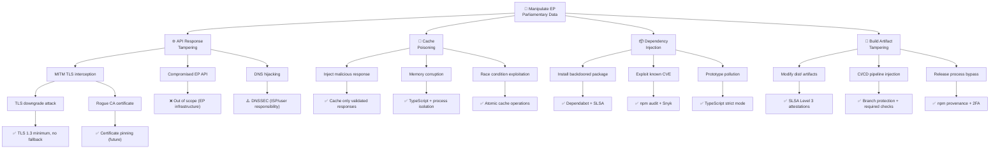

### **Attack Tree 3: Service Disruption / DoS (D-1, D-2, D-3)**

```mermaid
graph TD
    ROOT3["🎯 Disrupt EP MCP<br/>Service Availability"]
    
    ROOT3 --> I["⏱️ Rate Limit<br/>Exhaustion"]
    ROOT3 --> J["💻 Resource<br/>Exhaustion"]
    ROOT3 --> K["🌐 EP API<br/>Overload"]
    ROOT3 --> L["📦 Supply Chain<br/>DoS"]
    
    I --> I1["AI client excessive requests"]
    I --> I2["Bypass rate limiter"]
    I --> I3["Distributed request flood"]
    I1 --> I1M["✅ Token bucket rate limiting"]
    I2 --> I2M["✅ Atomic rate limit checks"]
    I3 --> I3M["⚠️ stdio isolation limits multi-client"]
    
    J --> J1["Memory exhaustion (large responses)"]
    J --> J2["CPU exhaustion (regex DoS)"]
    J --> J3["Cache memory overflow"]
    J1 --> J1M["✅ Response size limits"]
    J2 --> J2M["✅ Zod validation (no regex)"]
    J3 --> J3M["✅ LRU cache with max size"]
    
    K --> K1["Excessive API requests"]
    K --> K2["Concurrent request flood"]
    K --> K3["Long-polling attacks"]
    K1 --> K1M["✅ Client-side rate limiting"]
    K2 --> K2M["✅ Concurrency limits (future)"]
    K3 --> K3M["✅ HTTP timeout configuration"]
    
    L --> L1["npm registry unavailable"]
    L --> L2["Compromised dependency unavailable"]
    L --> L3["GitHub Actions outage"]
    L1 --> L1M["⚠️ npm mirrors (user responsibility)"]
    L2 --> L2M["✅ package-lock.json ensures reproducibility"]
    L3 --> L3M["❌ Out of scope (GitHub SLA)"]
```

### **Attack Tree 4: MCP Protocol Exploit (Original - Preserved)**

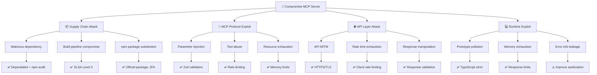

---

## 🔴 Priority Threat Scenarios

Detailed narrative scenarios prioritized by likelihood and business impact for the European Parliament MCP Server.

| # | Scenario | Actor | Method | Impact | Current Controls | Residual Risk |
|---|----------|-------|--------|--------|------------------|---------------|
| **1** | **Supply Chain Compromise** | 🎭 Nation-State APT<br/>💰 Cybercriminal | Backdoored npm dependency injected via compromised maintainer account → malicious code in `node_modules/` → data exfiltration or sabotage during MCP tool execution | **Critical**: Loss of service reputation, potential data manipulation, user trust erosion, OpenSSF Scorecard degradation | ✅ Dependabot alerts<br/>✅ npm audit + Snyk<br/>✅ SLSA Level 3<br/>✅ SBOM (CycloneDX)<br/>✅ package-lock.json pinning | **Medium**<br/>_(Continuous monitoring required)_ |
| **2** | **Parliamentary Data Manipulation** | 🏛️ Disinformation APT<br/>🎯 Political Actor | MITM attack on EP API connection → inject false MEP voting records or manipulated plenary transcripts → AI assistant provides incorrect democratic transparency data → misinformation spread | **High**: Democratic process undermined, service credibility damaged, regulatory scrutiny (GDPR/NIS2) | ✅ HTTPS/TLS 1.3<br/>✅ Certificate validation<br/>✅ Response validation (Zod)<br/>⚠️ Certificate pinning (future) | **Low-Medium**<br/>_(TLS provides strong protection)_ |
| **3** | **MCP Protocol Abuse (AI Jailbreak)** | 🤖 Malicious AI User<br/>🔬 Security Researcher | Crafted prompts causing AI assistant to invoke MCP tools with malicious parameters → bypass Zod validation via edge cases → unauthorized data access or service abuse | **Medium**: Data exposure, rate limit exhaustion, service disruption, reputational risk | ✅ Zod schema validation<br/>✅ TypeScript strict mode<br/>✅ No shell execution<br/>✅ Input sanitization | **Low**<br/>_(Defense-in-depth architecture)_ |
| **4** | **GDPR Personal Data Exposure** | 🔍 Privacy Researcher<br/>🎯 Regulatory Auditor | Verbose error messages or debug logs expose MEP personal data (addresses, contact info, personal declarations) → GDPR Article 32 violation → regulatory fines and reputational damage | **Medium**: GDPR Article 32 security-of-processing fines (typically up to €10M or 2% of worldwide annual turnover under Article 83(4)(a); potential escalation to €20M or 4% under Article 83(5) if a reportable personal data breach under Articles 33/34 occurs), reputational damage, user trust loss, mandatory breach notification | ✅ Sanitized error handling<br/>⚠️ Production log review<br/>⚠️ PII detection in logs<br/>✅ Public data focus | **Low-Medium**<br/>_(Requires log sanitization review)_ |
| **5** | **EP API Denial of Service** | 💼 Competitive Adversary<br/>🎯 Disruptive Actor | Automated script or compromised AI client floods EP MCP Server with requests → client-side rate limiter bypassed or overwhelmed → EP API rate limits exhausted → service unavailable for legitimate users | **Medium**: Service unavailability, user frustration, EP API access suspended, reputational damage | ✅ Token bucket rate limiter<br/>✅ Concurrency limits<br/>✅ Request logging<br/>⚠️ Adaptive rate limiting (future) | **Low-Medium**<br/>_(Rate limiting effective but not adaptive)_ |
| **6** | **Build Artifact Tampering** | 🏭 CI/CD Attacker<br/>🔓 Compromised GitHub Actions | Attacker modifies GitHub Actions workflow or injects malicious code during build → tampered `dist/` artifacts published to npm → users install compromised package → backdoor execution | **Critical**: Widespread malware distribution, npm package removal, OpenSSF Scorecard failure, complete service compromise | ✅ SLSA Level 3 provenance<br/>✅ Branch protection<br/>✅ Required status checks<br/>✅ CODEOWNERS enforcement<br/>✅ npm 2FA | **Low**<br/>_(Strong supply chain security)_ |
| **7** | **Reputation Attack via Security Metrics** | 🎯 Competitive Adversary<br/>📉 FUD Campaign | Attacker exploits minor vulnerability or submits CVE against EP MCP Server → OpenSSF Scorecard drops below 9.0 → negative publicity and user migration to competitors | **Medium**: Market share loss, user trust erosion, competitive disadvantage, reduced adoption rate | ✅ OpenSSF Scorecard 9.4+<br/>✅ Security badges (up-to-date)<br/>✅ Transparent security docs<br/>✅ Rapid vulnerability response | **Low**<br/>_(Strong security posture)_ |

---

## 🛡️ STRIDE → Control Mapping

Comprehensive mapping of each STRIDE threat category to preventive, detective, and corrective security controls.

| STRIDE Category | Threat Definition | Primary Controls | Secondary Controls | Detection Controls | Monitoring & Response |
|-----------------|-------------------|------------------|--------------------|--------------------|----------------------|
| **🎭 Spoofing (S)** | Impersonating a legitimate entity | • stdio transport isolation (S-1)<br/>• HTTPS/TLS 1.3 (S-2)<br/>• Official npm package name ownership (S-3)<br/>• npm 2FA (S-3) | • Certificate validation<br/>• Package provenance<br/>• GitHub Actions OIDC | • Audit logging (all requests)<br/>• npm download anomaly detection<br/>• TLS handshake monitoring | • OpenSSF Scorecard<br/>• npm package monitoring<br/>• Security badge alerts |
| **🔧 Tampering (T)** | Unauthorized modification of data or code | • HTTPS integrity checks (T-1)<br/>• SLSA Level 3 provenance (T-2, T-3)<br/>• Zod response validation (T-1)<br/>• Dependabot + npm audit (T-2) | • Branch protection<br/>• GPG commit signing<br/>• Immutable cache entries<br/>• Environment variable validation | • Dependabot alerts<br/>• npm audit (CI/CD)<br/>• SBOM vulnerability scanning<br/>• GitHub Advanced Security | • Snyk monitoring<br/>• Supply chain security alerts<br/>• Build artifact verification |
| **🚫 Repudiation (R)** | Denying actions or events | • Structured stderr logging (R-1)<br/>• ISO 8601 timestamps (R-1)<br/>• Immutable log streams (R-1)<br/>• GPG commit signing (R-2) | • Request ID correlation<br/>• GitHub Actions audit logs<br/>• npm publish logs | • Log aggregation (future)<br/>• Audit trail completeness checks<br/>• GitHub audit log API | • Log retention policy<br/>• Incident response procedures<br/>• Forensic analysis capability |
| **📢 Information Disclosure (I)** | Exposure of confidential information | • Sanitized error messages (I-1, I-2)<br/>• No API keys required (I-3)<br/>• Public data only (I-4)<br/>• TypeScript strict mode | • Production error handling<br/>• Generic log messages<br/>• No PII in cache keys<br/>• Environment variable masking | • Log content review<br/>• Error message monitoring<br/>• Stack trace detection | • Privacy impact assessment<br/>• GDPR compliance monitoring<br/>• Security code review |
| **🚨 Denial of Service (D)** | Degrading or preventing service availability | • Token bucket rate limiting (D-1)<br/>• Response size limits (D-2)<br/>• LRU cache max size (D-2)<br/>• Zod validation (no ReDoS) (D-4) | • HTTP timeout configuration<br/>• Memory monitoring<br/>• Concurrency limits<br/>• Call depth tracking | • Rate limit violation logs<br/>• Memory usage monitoring<br/>• API response time tracking | • Incident response procedures<br/>• Failover strategy<br/>• EP API health monitoring |
| **⚡ Elevation of Privilege (E)** | Gaining unauthorized capabilities | • Zod schema validation (E-1)<br/>• TypeScript strict mode (E-2)<br/>• No shell execution (E-4)<br/>• Input sanitization (E-3) | • Parameterized API calls<br/>• Process isolation (stdio)<br/>• Safe JSON parsing<br/>• No filesystem access | • Input validation failures<br/>• Unexpected tool invocations<br/>• Privilege escalation attempts | • Security testing (SAST/DAST)<br/>• Penetration testing<br/>• Bug bounty program (future) |

---

## 🏛️ Comprehensive Security Control Framework

### **🛡️ Defense-in-Depth Architecture**

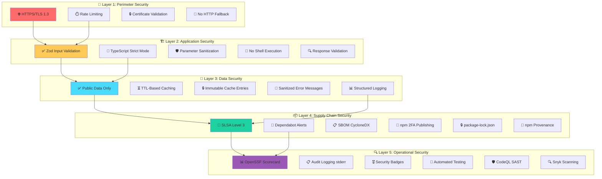

### **🎯 Control Effectiveness Matrix**

| Layer | Control | Type | NIST CSF 2.0 Function | Threats Addressed | Effectiveness | Status |
|-------|---------|------|----------------------|-------------------|---------------|--------|
| **1: Perimeter** | HTTPS/TLS 1.3 | Preventive | PR.DS-2, PR.DS-5 | S-2, T-1, I-3 | ⭐⭐⭐⭐⭐ High | ✅ Active |
| **1: Perimeter** | Token bucket rate limiting | Preventive | PR.IP-12, DE.CM-1 | D-1, D-2, D-3 | ⭐⭐⭐⭐ High | ✅ Active |
| **1: Perimeter** | Certificate validation | Detective | PR.DS-2 | S-2, T-1 | ⭐⭐⭐⭐⭐ High | ✅ Active |
| **2: Application** | Zod schema validation | Preventive | PR.DS-1, PR.IP-1 | E-1, D-4, E-3 | ⭐⭐⭐⭐⭐ High | ✅ Active |
| **2: Application** | TypeScript strict mode | Preventive | PR.IP-1 | E-2, I-1 | ⭐⭐⭐⭐ High | ✅ Active |
| **2: Application** | No shell execution | Preventive | PR.AC-4, PR.IP-1 | E-4 | ⭐⭐⭐⭐⭐ High | ✅ Active |
| **3: Data** | Response validation | Preventive | PR.DS-1 | T-1, E-2 | ⭐⭐⭐⭐ High | ✅ Active |
| **3: Data** | TTL-based caching | Preventive | PR.DS-3 | I-4, T-1 | ⭐⭐⭐ Medium | ✅ Active |
| **3: Data** | Sanitized error messages | Preventive | PR.DS-5 | I-1, I-2 | ⭐⭐⭐ Medium | ⚠️ Partial |
| **3: Data** | Structured logging (stderr) | Detective | DE.AE-3, DE.CM-1 | R-1, R-3 | ⭐⭐⭐⭐ High | ✅ Active |
| **4: Supply Chain** | SLSA Level 3 provenance | Detective | PR.DS-6, ID.SC-2 | T-2, T-3, S-4 | ⭐⭐⭐⭐⭐ High | ✅ Active |
| **4: Supply Chain** | Dependabot + npm audit | Detective | ID.RA-1, DE.CM-4 | T-2, S-4 | ⭐⭐⭐⭐ High | ✅ Active |
| **4: Supply Chain** | SBOM (CycloneDX) | Transparency | ID.AM-4, ID.SC-5 | T-2 | ⭐⭐⭐ Medium | ✅ Active |
| **4: Supply Chain** | npm 2FA publishing | Preventive | PR.AC-1 | S-3, T-2 | ⭐⭐⭐⭐⭐ High | ✅ Active |
| **4: Supply Chain** | package-lock.json pinning | Preventive | ID.SC-2 | T-2, S-4 | ⭐⭐⭐⭐ High | ✅ Active |
| **5: Operations** | OpenSSF Scorecard 9.4+ | Detective | ID.IM-1, PR.IP-1 | All categories | ⭐⭐⭐⭐⭐ High | ✅ Active |
| **5: Operations** | Audit logging (stderr) | Detective | DE.AE-3, RS.AN-1 | R-1, R-2, R-3 | ⭐⭐⭐⭐ High | ✅ Active |
| **5: Operations** | CodeQL SAST scanning | Detective | ID.RA-1, DE.CM-4 | E-1, E-2, E-4, I-1 | ⭐⭐⭐⭐ High | ✅ Active |
| **5: Operations** | Snyk vulnerability scanning | Detective | ID.RA-1, DE.CM-4 | T-2, S-4 | ⭐⭐⭐⭐ High | ✅ Active |

### **📊 NIST CSF 2.0 Function Mapping**

| Function | Description | EP MCP Server Controls |
|----------|-------------|------------------------|
| **🔍 IDENTIFY (ID)** | Understand risks to systems and assets | • OpenSSF Scorecard monitoring<br/>• SBOM generation (CycloneDX)<br/>• Threat modeling (this document)<br/>• Security architecture documentation |
| **🛡️ PROTECT (PR)** | Implement safeguards for critical services | • Zod input validation<br/>• HTTPS/TLS 1.3<br/>• TypeScript strict mode<br/>• Rate limiting<br/>• No shell execution<br/>• npm 2FA publishing |
| **🔎 DETECT (DE)** | Identify occurrence of cybersecurity events | • Dependabot alerts<br/>• npm audit<br/>• CodeQL SAST<br/>• Snyk scanning<br/>• Audit logging (stderr)<br/>• OpenSSF Scorecard |
| **🚨 RESPOND (RS)** | Take action regarding detected incidents | • Incident response procedures<br/>• Security advisory publication<br/>• Rapid patch deployment<br/>• Coordinated vulnerability disclosure |
| **♻️ RECOVER (RC)** | Restore capabilities or services | • npm package rollback<br/>• Version pinning (package-lock.json)<br/>• GitHub release rollback<br/>• Incident post-mortem |

---

## 🔗 Policy Alignment

| ISMS Policy | Relevance | Link |
|-------------|-----------|------|
| 🎯 Threat Modeling | Primary methodology | [Threat_Modeling.md](https://github.com/Hack23/ISMS-PUBLIC/blob/main/Threat_Modeling.md) |
| 🔒 Secure Development | Development security requirements | [Secure_Development_Policy.md](https://github.com/Hack23/ISMS-PUBLIC/blob/main/Secure_Development_Policy.md) |
| 🔍 Vulnerability Management | Vulnerability handling SLAs | [Vulnerability_Management.md](https://github.com/Hack23/ISMS-PUBLIC/blob/main/Vulnerability_Management.md) |
| 🌐 Network Security | Transport security requirements | [Network_Security_Policy.md](https://github.com/Hack23/ISMS-PUBLIC/blob/main/Network_Security_Policy.md) |
| 🔑 Access Control | Authentication/authorization | [Access_Control_Policy.md](https://github.com/Hack23/ISMS-PUBLIC/blob/main/Access_Control_Policy.md) |
| 🔐 Cryptography | TLS and encryption standards | [Cryptography_Policy.md](https://github.com/Hack23/ISMS-PUBLIC/blob/main/Cryptography_Policy.md) |
| 🚨 Incident Response | Security incident procedures | [Incident_Response_Plan.md](https://github.com/Hack23/ISMS-PUBLIC/blob/main/Incident_Response_Plan.md) |
| 🏷️ Classification | Data classification framework | [CLASSIFICATION.md](https://github.com/Hack23/ISMS-PUBLIC/blob/main/CLASSIFICATION.md) |

### **Compliance Framework Mapping**

| Framework | Controls Addressed |
|-----------|-------------------|
| **ISO 27001:2022** | A.5.7, A.8.8, A.8.9, A.8.25, A.8.26, A.8.28 |
| **NIST CSF 2.0** | ID.RA, PR.DS, PR.IP, DE.CM, RS.AN |
| **CIS Controls v8.1** | 2.7, 7.1, 7.4, 16.1, 16.9 |

---

## 📚 Related Documents

| Document | Description | Link |
|----------|-------------|------|
| 🛡️ Security Architecture | Current security design and controls | [SECURITY_ARCHITECTURE.md](SECURITY_ARCHITECTURE.md) |
| 🚀 Future Security Architecture | Planned security enhancements | [FUTURE_SECURITY_ARCHITECTURE.md](FUTURE_SECURITY_ARCHITECTURE.md) |
| 🔄 Business Continuity Plan | Recovery objectives and procedures | [BCPPlan.md](BCPPlan.md) |
| 🛡️ CRA Assessment | EU Cyber Resilience Act conformity | [CRA-ASSESSMENT.md](CRA-ASSESSMENT.md) |
| 🏛️ Architecture | System architecture overview | [ARCHITECTURE.md](ARCHITECTURE.md) |
| 📊 Data Model | Data structures and relationships | [DATA_MODEL.md](DATA_MODEL.md) |
| 🔒 Security Policy | Security reporting and disclosure | [SECURITY.md](SECURITY.md) |

---

<p align="center">
  <em>This threat model is maintained as part of the <a href="https://github.com/Hack23/ISMS-PUBLIC">Hack23 AB ISMS</a> framework.</em><br>
  <em>Licensed under <a href="LICENSE.md">Apache-2.0</a></em>
</p>
