  

<h1 align="center">🎯 European Parliament MCP Server — Threat Model</h1>

  <strong>🛡️ Proactive Security Through Structured Threat Analysis</strong> 
  <em>🔍 STRIDE • MITRE ATT&CK • MCP Protocol Security • Parliamentary Data Protection</em>

  
  
  
  

**📋 Document Owner:** CEO | **📄 Version:** 1.0 | **📅 Last Updated:** 2026-02-20 (UTC)  
**🔄 Review Cycle:** Quarterly | **⏰ Next Review:** 2026-05-20  
**🏷️ Classification:** Public (Open Source MCP Server)

---

## 📑 Table of Contents

- [Purpose \& Scope](#-purpose--scope)
- [System Classification](#-system-classification--operating-profile)
- [STRIDE Threat Analysis](#-stride-threat-analysis)
- [MITRE ATT\&CK Mapping](#️-mitre-attck-mapping)
- [Quantitative Risk Assessment](#-quantitative-risk-assessment)
- [Security Controls \& Mitigations](#️-security-controls--mitigations)
- [Attack Tree Analysis](#-attack-tree-analysis)
- [Policy Alignment](#-policy-alignment)
- [Related Documents](#-related-documents)

---

## 🎯 Purpose & Scope

Establish a comprehensive threat model for the European Parliament MCP Server, a TypeScript/Node.js Model Context Protocol server providing AI assistants with structured access to European Parliament open datasets. This systematic threat analysis integrates multiple frameworks to ensure proactive security through structured analysis.

### **🌟 Transparency Commitment**

This threat model demonstrates **🛡️ cybersecurity consulting expertise** through public documentation of advanced threat assessment methodologies, showcasing our **🏆 competitive advantage** via systematic risk management and **🤝 customer trust** through transparent security practices.

*— Based on Hack23 AB's commitment to security through transparency and excellence*

### **📚 Framework Integration**

- **🎭 STRIDE per architecture element:** Systematic threat categorization
- **🎖️ MITRE ATT&CK mapping:** Advanced threat intelligence integration
- **🏗️ Asset-centric analysis:** Critical resource protection focus
- **🎯 Scenario-centric modeling:** Real-world attack simulation
- **⚖️ Risk-centric assessment:** Business impact quantification

### **🔍 Scope Definition**

**Included Systems:**

- 🌐 TypeScript/Node.js MCP server application
- 🔌 MCP protocol implementation (stdio transport)
- 🏛️ European Parliament Open Data API integration
- 📦 npm package distribution (`european-parliament-mcp-server`)
- 🏭 CI/CD security pipeline (GitHub Actions, SLSA Level 3)
- 📦 Dependency supply chain (npm ecosystem)
- ✅ Input validation (Zod schemas)

**Out of Scope:**

- European Parliament API infrastructure security
- End-user AI assistant security (Claude, ChatGPT, etc.)
- Third-party npm registry infrastructure
- End-user operating system and network security

### **🔗 Policy Alignment**

Integrated with [🎯 Hack23 AB Threat Modeling Policy](https://github.com/Hack23/ISMS-PUBLIC/blob/main/Threat_Modeling.md) methodology and frameworks.

---

## 📊 System Classification & Operating Profile

### **🏷️ Security Classification Matrix**

| Dimension | Level | Rationale | Business Impact |
|----------|-------|-----------|----------------|
| **🔠Confidentiality** |  | Open source server processing public EP data |  |
| **🔒 Integrity** |  | Parliamentary data accuracy critical for democratic transparency |  |
| **⚡ Availability** |  | MCP server tolerates brief outages; AI clients retry |  |

### **⚙️ Operating Profile**

| Property | Value |
|----------|-------|
| **Runtime** | Node.js 24+ (LTS) |
| **Language** | TypeScript 5.x (strict mode) |
| **Transport** | stdio (local process) |
| **Data Source** | European Parliament Open Data API |
| **Distribution** | npm registry |
| **Authentication** | None (public data, local stdio) |
| **Users** | AI assistants (Claude, ChatGPT, etc.) |

---

## 🎭 STRIDE Threat Analysis

### **S — Spoofing**

| ID | Threat | Component | Likelihood | Impact | Risk | Mitigation |
|----|--------|-----------|------------|--------|------|------------|
| S-1 | Malicious MCP client impersonation | MCP Transport | Low | Medium | Low | stdio transport limits to local process |
| S-2 | EP API response spoofing (MITM) | API Client | Low | High | Medium | HTTPS/TLS for all API communication |
| S-3 | npm package name squatting | Distribution | Low | High | Medium | Official package name, npm 2FA publishing |
| S-4 | Supply chain package substitution | Dependencies | Medium | High | High | SLSA Level 3 provenance, lockfile pinning |

### **T — Tampering**

| ID | Threat | Component | Likelihood | Impact | Risk | Mitigation |
|----|--------|-----------|------------|--------|------|------------|
| T-1 | API response manipulation | API Client | Low | High | Medium | HTTPS integrity, response validation |
| T-2 | Dependency injection via compromised package | Supply Chain | Medium | Critical | High | Dependabot, npm audit, SBOM tracking |
| T-3 | Build artifact tampering | CI/CD | Low | Critical | Medium | SLSA Level 3 attestations |
| T-4 | Configuration manipulation | Runtime | Low | Medium | Low | Environment variable validation |

### **R — Repudiation**

| ID | Threat | Component | Likelihood | Impact | Risk | Mitigation |
|----|--------|-----------|------------|--------|------|------------|
| R-1 | Untracked tool invocations | MCP Server | Medium | Medium | Medium | Structured audit logging (stderr) |
| R-2 | Unsigned commits in source | Source Code | Low | Medium | Low | GPG signing, branch protection |
| R-3 | Unattributed data access | API Client | Low | Low | Low | Request logging with timestamps |

### **I — Information Disclosure**

| ID | Threat | Component | Likelihood | Impact | Risk | Mitigation |
|----|--------|-----------|------------|--------|------|------------|
| I-1 | Verbose error messages exposing internals | Error Handling | Medium | Medium | Medium | Sanitized error responses |
| I-2 | Stack traces in production | Runtime | Medium | Low | Low | Production error handling |
| I-3 | API keys in logs | Logging | Low | High | Medium | No API keys required (public API) |
| I-4 | Sensitive data in cached responses | Caching | Low | Low | Low | Public data only, TTL-based cache |

### **D — Denial of Service**

| ID | Threat | Component | Likelihood | Impact | Risk | Mitigation |
|----|--------|-----------|------------|--------|------|------------|
| D-1 | EP API rate limit exhaustion | API Client | Medium | Medium | Medium | Client-side rate limiting |
| D-2 | Memory exhaustion via large responses | Runtime | Low | High | Medium | Response size limits |
| D-3 | Recursive/nested tool calls | MCP Server | Low | Medium | Low | Call depth limits |
| D-4 | ReDoS via crafted input | Input Validation | Low | Medium | Low | Zod schema validation (no regex) |

### **E — Elevation of Privilege**

| ID | Threat | Component | Likelihood | Impact | Risk | Mitigation |
|----|--------|-----------|------------|--------|------|------------|
| E-1 | MCP tool parameter injection | Input Handling | Medium | Medium | Medium | Zod schema validation for all inputs |
| E-2 | Prototype pollution via JSON parsing | Runtime | Low | High | Medium | Safe JSON parsing, TypeScript strict |
| E-3 | Path traversal in document search | Tools | Low | Medium | Low | Input sanitization, no filesystem access |
| E-4 | Command injection via tool parameters | MCP Server | Low | Critical | Medium | No shell execution, parameterized APIs |

---

## 🎖️ MITRE ATT&CK Mapping

| Technique ID | Technique | Threat IDs | Relevance |
|-------------|-----------|------------|-----------|
| T1195.002 | Supply Chain Compromise: Software Supply Chain | T-2, S-4 | npm dependency compromise |
| T1059 | Command and Scripting Interpreter | E-4 | Potential command injection via MCP tools |
| T1190 | Exploit Public-Facing Application | E-1, D-1 | MCP tool parameter exploitation |
| T1557 | Adversary-in-the-Middle | S-2 | EP API response interception |
| T1498 | Network Denial of Service | D-1, D-2 | API rate limit exhaustion |
| T1027 | Obfuscated Files or Information | T-3 | Tampered build artifacts |
| T1071 | Application Layer Protocol | S-1 | MCP protocol abuse |
| T1592 | Gather Victim Host Information | I-1, I-2 | Error message information leakage |

---

## 📊 Quantitative Risk Assessment

### **Risk Matrix**

### **Top Priority Risks**

| Priority | Risk | Current Status | Action Required |
|----------|------|---------------|----------------|
| 🔴 P1 | Supply chain compromise (T-2, S-4) | ✅ Mitigated | Maintain Dependabot, SLSA attestations |
| 🟠 P2 | Input validation bypass (E-1) | ✅ Mitigated | Zod schemas for all tool inputs |
| 🟡 P3 | API rate limit exhaustion (D-1) | ✅ Mitigated | Client-side rate limiting implemented |
| 🟡 P4 | Error information disclosure (I-1) | ⚠️ Partial | Improve error sanitization |
| 🟢 P5 | Build artifact tampering (T-3) | ✅ Mitigated | SLSA Level 3 provenance |

---

## 🛡️ Security Controls & Mitigations

### **Control Architecture**

### **Security Controls Matrix**

| Control | Category | Threats Mitigated | Status |
|---------|----------|-------------------|--------|
| Zod input validation | Preventive | E-1, D-4, E-3 | ✅ Active |
| Rate limiting | Preventive | D-1, D-2 | ✅ Active |
| HTTPS/TLS for EP API | Preventive | S-2, T-1 | ✅ Active |
| SLSA Level 3 provenance | Detective | T-3, S-4 | ✅ Active |
| Dependabot alerts | Detective | T-2 | ✅ Active |
| npm audit | Detective | T-2, S-4 | ✅ Active |
| OpenSSF Scorecard | Detective | Multiple | ✅ Active |
| CycloneDX SBOM | Transparency | T-2 | ✅ Active |
| TypeScript strict mode | Preventive | E-2, I-1 | ✅ Active |
| Environment variable validation | Preventive | T-4 | ✅ Active |
| Structured error handling | Preventive | I-1, I-2 | ✅ Active |
| Branch protection | Preventive | R-2 | ✅ Active |
| Code review requirements | Detective | Multiple | ✅ Active |
| Security headers | Preventive | Multiple | ✅ Active |

---

## 🌳 Attack Tree Analysis

```mermaid
graph TD
    ROOT["🎯 Compromise MCP Server"]
    ROOT --> A["📦 Supply Chain Attack"]
    ROOT --> B["🔌 MCP Protocol Exploit"]
    ROOT --> C["🌐 API Layer Attack"]
    ROOT --> D["💻 Runtime Exploit"]

    A --> A1["Malicious dependency"]
    A --> A2["Build pipeline compromise"]
    A --> A3["npm package substitution"]
    A1 --> A1M["✅ Dependabot + npm audit"]
    A2 --> A2M["✅ SLSA Level 3"]
    A3 --> A3M["✅ Official package, 2FA"]

    B --> B1["Parameter injection"]
    B --> B2["Tool abuse"]
    B --> B3["Resource exhaustion"]
    B1 --> B1M["✅ Zod validation"]
    B2 --> B2M["✅ Rate limiting"]
    B3 --> B3M["✅ Memory limits"]

    C --> C1["API MITM"]
    C --> C2["Rate limit exhaustion"]
    C --> C3["Response manipulation"]
    C1 --> C1M["✅ HTTPS/TLS"]
    C2 --> C2M["✅ Client rate limiting"]
    C3 --> C3M["✅ Response validation"]

    D --> D1["Prototype pollution"]
    D --> D2["Memory exhaustion"]
    D --> D3["Error info leakage"]
    D1 --> D1M["✅ TypeScript strict"]
    D2 --> D2M["✅ Response limits"]
    D3 --> D3M["⚠️ Improve sanitization"]
```

---

## 🔗 Policy Alignment

| ISMS Policy | Relevance | Link |
|-------------|-----------|------|
| 🎯 Threat Modeling | Primary methodology | [Threat_Modeling.md](https://github.com/Hack23/ISMS-PUBLIC/blob/main/Threat_Modeling.md) |
| 🔒 Secure Development | Development security requirements | [Secure_Development_Policy.md](https://github.com/Hack23/ISMS-PUBLIC/blob/main/Secure_Development_Policy.md) |
| 🔍 Vulnerability Management | Vulnerability handling SLAs | [Vulnerability_Management.md](https://github.com/Hack23/ISMS-PUBLIC/blob/main/Vulnerability_Management.md) |
| 🌐 Network Security | Transport security requirements | [Network_Security_Policy.md](https://github.com/Hack23/ISMS-PUBLIC/blob/main/Network_Security_Policy.md) |
| 🔑 Access Control | Authentication/authorization | [Access_Control_Policy.md](https://github.com/Hack23/ISMS-PUBLIC/blob/main/Access_Control_Policy.md) |
| 🔐 Cryptography | TLS and encryption standards | [Cryptography_Policy.md](https://github.com/Hack23/ISMS-PUBLIC/blob/main/Cryptography_Policy.md) |
| 🚨 Incident Response | Security incident procedures | [Incident_Response_Plan.md](https://github.com/Hack23/ISMS-PUBLIC/blob/main/Incident_Response_Plan.md) |
| 🏷️ Classification | Data classification framework | [CLASSIFICATION.md](https://github.com/Hack23/ISMS-PUBLIC/blob/main/CLASSIFICATION.md) |

### **Compliance Framework Mapping**

| Framework | Controls Addressed |
|-----------|-------------------|
| **ISO 27001:2022** | A.5.7, A.8.8, A.8.9, A.8.25, A.8.26, A.8.28 |
| **NIST CSF 2.0** | ID.RA, PR.DS, PR.IP, DE.CM, RS.AN |
| **CIS Controls v8.1** | 2.7, 7.1, 7.4, 16.1, 16.9 |

---

## 📚 Related Documents

| Document | Description | Link |
|----------|-------------|------|
| 🛡️ Security Architecture | Current security design and controls | [SECURITY_ARCHITECTURE.md](SECURITY_ARCHITECTURE.md) |
| 🚀 Future Security Architecture | Planned security enhancements | [FUTURE_SECURITY_ARCHITECTURE.md](FUTURE_SECURITY_ARCHITECTURE.md) |
| 🔄 Business Continuity Plan | Recovery objectives and procedures | [BCPPlan.md](BCPPlan.md) |
| 🛡️ CRA Assessment | EU Cyber Resilience Act conformity | [CRA-ASSESSMENT.md](CRA-ASSESSMENT.md) |
| 🏛️ Architecture | System architecture overview | [ARCHITECTURE.md](ARCHITECTURE.md) |
| 📊 Data Model | Data structures and relationships | [DATA_MODEL.md](DATA_MODEL.md) |
| 🔒 Security Policy | Security reporting and disclosure | [SECURITY.md](SECURITY.md) |

---

  <em>This threat model is maintained as part of the <a href="https://github.com/Hack23/ISMS-PUBLIC">Hack23 AB ISMS</a> framework.</em> 
  <em>Licensed under <a href="LICENSE.md">Apache-2.0</a></em>

