  

<h1 align="center">🎯 European Parliament MCP Server — Threat Model</h1>

  <strong>🛡️ Proactive Security Through Structured Threat Analysis</strong> 
  <em>🔍 STRIDE • MITRE ATT&CK • MCP Protocol Security • Parliamentary Data Protection</em>

  
  
  
  

**📋 Document Owner:** CEO | **📄 Version:** 1.0 | **📅 Last Updated:** 2026-02-20 (UTC)  
**🔄 Review Cycle:** Quarterly | **⏰ Next Review:** 2026-05-20  
**🏷️ Classification:** Public (Open Source MCP Server)

---

## 📑 Table of Contents

- [Purpose \& Scope](#-purpose--scope)
- [System Classification](#-system-classification--operating-profile)
- [💎 Critical Assets \& Crown Jewel Analysis](#-critical-assets--crown-jewel-analysis)
- [STRIDE Threat Analysis](#-stride-threat-analysis)
- [🏗️ Architecture-Centric STRIDE Analysis](#️-architecture-centric-stride-analysis)
- [MITRE ATT\&CK Mapping](#️-mitre-attck-mapping)
- [Quantitative Risk Assessment](#-quantitative-risk-assessment)
- [Security Controls \& Mitigations](#️-security-controls--mitigations)
- [Attack Tree Analysis](#-attack-tree-analysis)
- [🔴 Priority Threat Scenarios](#-priority-threat-scenarios)
- [🛡️ STRIDE → Control Mapping](#️-stride--control-mapping)
- [🏛️ Comprehensive Security Control Framework](#️-comprehensive-security-control-framework)
- [Policy Alignment](#-policy-alignment)
- [Related Documents](#-related-documents)

---

## 🎯 Purpose & Scope

Establish a comprehensive threat model for the European Parliament MCP Server, a TypeScript/Node.js Model Context Protocol server providing AI assistants with structured access to European Parliament open datasets. This systematic threat analysis integrates multiple frameworks to ensure proactive security through structured analysis.

### **🌟 Transparency Commitment**

This threat model demonstrates **🛡️ cybersecurity consulting expertise** through public documentation of advanced threat assessment methodologies, showcasing our **🏆 competitive advantage** via systematic risk management and **🤝 customer trust** through transparent security practices.

*— Based on Hack23 AB's commitment to security through transparency and excellence*

### **📚 Framework Integration**

- **🎭 STRIDE per architecture element:** Systematic threat categorization
- **🎖️ MITRE ATT&CK mapping:** Advanced threat intelligence integration
- **🏗️ Asset-centric analysis:** Critical resource protection focus
- **🎯 Scenario-centric modeling:** Real-world attack simulation
- **⚖️ Risk-centric assessment:** Business impact quantification

### **🔍 Scope Definition**

**Included Systems:**

- 🌐 TypeScript/Node.js MCP server application
- 🔌 MCP protocol implementation (stdio transport)
- 🏛️ European Parliament Open Data API integration
- 📦 npm package distribution (`european-parliament-mcp-server`)
- 🏭 CI/CD security pipeline (GitHub Actions, SLSA Level 3)
- 📦 Dependency supply chain (npm ecosystem)
- ✅ Input validation (Zod schemas)

**Out of Scope:**

- European Parliament API infrastructure security
- End-user AI assistant security (Claude, ChatGPT, etc.)
- Third-party npm registry infrastructure
- End-user operating system and network security

### **🔗 Policy Alignment**

Integrated with [🎯 Hack23 AB Threat Modeling Policy](https://github.com/Hack23/ISMS-PUBLIC/blob/main/Threat_Modeling.md) methodology and frameworks.

---

## 📊 System Classification & Operating Profile

### **🏷️ Security Classification Matrix**

| Dimension | Level | Rationale | Business Impact |
|----------|-------|-----------|----------------|
| **🔠Confidentiality** |  | Open source server processing public EP data |  |
| **🔒 Integrity** |  | Parliamentary data accuracy critical for democratic transparency |  |
| **⚡ Availability** |  | MCP server tolerates brief outages; AI clients retry |  |

### **⚙️ Operating Profile**

| Property | Value |
|----------|-------|
| **Runtime** | Node.js 24+ (LTS) |
| **Language** | TypeScript 5.x (strict mode) |
| **Transport** | stdio (local process) |
| **Data Source** | European Parliament Open Data API |
| **Distribution** | npm registry |
| **Authentication** | None (public data, local stdio) |
| **Users** | AI assistants (Claude, ChatGPT, etc.) |

---

## 💎 Critical Assets & Crown Jewel Analysis

### **🎯 Critical Asset Inventory**

| Asset | Description | Classification | Threat Impact |
|-------|-------------|----------------|---------------|
| **EP Parliamentary Data Integrity** | Accuracy and trustworthiness of MEP data, voting records, plenary documents | 🔒 Integrity: Moderate | Compromised democratic transparency, misinformation propagation |
| **Source Code & Build Pipeline** | TypeScript source, CI/CD workflows, GitHub Actions security | 🔠Confidentiality: Public 🔒 Integrity: High | Supply chain compromise, malicious code injection |
| **Service Reputation & Trust** | OpenSSF Scorecard rating, npm package legitimacy, security posture | ⚡ Availability: Standard | User trust erosion, adoption reduction |
| **EP API Access & Availability** | Connection to European Parliament Open Data API | ⚡ Availability: Moderate | Service disruption, rate limit exhaustion |
| **npm Package Distribution** | Package integrity, version control, download statistics | 🔒 Integrity: Moderate | Malware distribution, user impact |
| **Audit Trail & Logging** | Structured logs, security event records | 🔒 Integrity: Moderate | Non-repudiation loss, incident investigation failure |

### **💎 Crown Jewel Analysis**

```mermaid
mindmap
  root((🏛️ EP MCP<br/>Crown Jewels))
    🔒 EP Parliamentary<br/>Data Integrity
      Voting Records
      MEP Profiles
      Plenary Documents
      Committee Assignments
      GDPR Personal Data
    📦 Source Code &<br/>Build Pipeline
      TypeScript Source
      GitHub Actions
      SLSA L3 Provenance
      npm Publishing
      Dependency Chain
    🛡️ Service<br/>Reputation & Trust
      OpenSSF Score 9.4+
      Security Badges
      npm Download Stats
      Community Trust
      Transparent Security
    🌐 EP API Access &<br/>Availability
      Rate Limit Quota
      API Response Time
      Connection Integrity
      HTTPS/TLS Security
      Failover Strategy
```

### **🛡️ Crown Jewel Protection Strategies**

| Crown Jewel | Primary Threats | Protection Controls | Residual Risk |
|-------------|-----------------|---------------------|---------------|
| **EP Parliamentary Data Integrity** | T-1, T-2, S-2 | HTTPS/TLS, response validation, Zod schemas, cache TTL | Low |
| **Source Code & Build Pipeline** | T-2, T-3, S-4 | SLSA Level 3, branch protection, GPG signing, Dependabot | Low-Medium |
| **Service Reputation & Trust** | All categories | OpenSSF Scorecard monitoring, security badges, transparent documentation | Low |
| **EP API Access & Availability** | D-1, D-2, S-2 | Rate limiting, retry logic, circuit breaker, HTTPS verification | Medium |
| **npm Package Distribution** | S-3, S-4, T-2 | Official namespace, npm 2FA, SBOM, npm provenance | Low-Medium |
| **Audit Trail & Logging** | R-1, R-2, R-3 | Structured stderr logging, immutable logs, timestamp integrity | Low |

---

## 🎭 STRIDE Threat Analysis

### **S — Spoofing**

| ID | Threat | Component | Likelihood | Impact | Risk | Mitigation |
|----|--------|-----------|------------|--------|------|------------|
| S-1 | Malicious MCP client impersonation | MCP Transport | Low | Medium | Low | stdio transport limits to local process |
| S-2 | EP API response spoofing (MITM) | API Client | Low | High | Medium | HTTPS/TLS for all API communication |
| S-3 | npm package name squatting | Distribution | Low | High | Medium | Official package name, npm 2FA publishing |
| S-4 | Supply chain package substitution | Dependencies | Medium | High | High | SLSA Level 3 provenance, lockfile pinning |

### **T — Tampering**

| ID | Threat | Component | Likelihood | Impact | Risk | Mitigation |
|----|--------|-----------|------------|--------|------|------------|
| T-1 | API response manipulation | API Client | Low | High | Medium | HTTPS integrity, response validation |
| T-2 | Dependency injection via compromised package | Supply Chain | Medium | Critical | High | Dependabot, npm audit, SBOM tracking |
| T-3 | Build artifact tampering | CI/CD | Low | Critical | Medium | SLSA Level 3 attestations |
| T-4 | Configuration manipulation | Runtime | Low | Medium | Low | Environment variable validation |

### **R — Repudiation**

| ID | Threat | Component | Likelihood | Impact | Risk | Mitigation |
|----|--------|-----------|------------|--------|------|------------|
| R-1 | Untracked tool invocations | MCP Server | Medium | Medium | Medium | Structured audit logging (stderr) |
| R-2 | Unsigned commits in source | Source Code | Low | Medium | Low | GPG signing, branch protection |
| R-3 | Unattributed data access | API Client | Low | Low | Low | Request logging with timestamps |

### **I — Information Disclosure**

| ID | Threat | Component | Likelihood | Impact | Risk | Mitigation |
|----|--------|-----------|------------|--------|------|------------|
| I-1 | Verbose error messages exposing internals | Error Handling | Medium | Medium | Medium | Sanitized error responses |
| I-2 | Stack traces in production | Runtime | Medium | Low | Low | Production error handling |
| I-3 | API keys in logs | Logging | Low | High | Medium | No API keys required (public API) |
| I-4 | Sensitive data in cached responses | Caching | Low | Low | Low | Public data only, TTL-based cache |

### **D — Denial of Service**

| ID | Threat | Component | Likelihood | Impact | Risk | Mitigation |
|----|--------|-----------|------------|--------|------|------------|
| D-1 | EP API rate limit exhaustion | API Client | Medium | Medium | Medium | Client-side rate limiting |
| D-2 | Memory exhaustion via large responses | Runtime | Low | High | Medium | Response size limits |
| D-3 | Recursive/nested tool calls | MCP Server | Low | Medium | Low | Call depth limits |
| D-4 | ReDoS via crafted input | Input Validation | Low | Medium | Low | Zod schema validation (no regex) |

### **E — Elevation of Privilege**

| ID | Threat | Component | Likelihood | Impact | Risk | Mitigation |
|----|--------|-----------|------------|--------|------|------------|
| E-1 | MCP tool parameter injection | Input Handling | Medium | Medium | Medium | Zod schema validation for all inputs |
| E-2 | Prototype pollution via JSON parsing | Runtime | Low | High | Medium | Safe JSON parsing, TypeScript strict |
| E-3 | Path traversal in document search | Tools | Low | Medium | Low | Input sanitization, no filesystem access |
| E-4 | Command injection via tool parameters | MCP Server | Low | Critical | Medium | No shell execution, parameterized APIs |

---

## 🏗️ Architecture-Centric STRIDE Analysis

### **🌊 Data Flow Threat Surface**

```mermaid
sequenceDiagram
    participant AI as 🤖 AI Assistant<br/>(Claude/ChatGPT)
    participant MCP as 🔌 MCP Server<br/>(stdio transport)
    participant Cache as 💾 Cache Layer<br/>(LRU in-memory)
    participant RL as ⏱️ Rate Limiter<br/>(Token bucket)
    participant API as 🏛️ EP API<br/>(HTTPS)
    participant Log as 📋 Audit Logger<br/>(stderr)

    Note over AI,MCP: 🎭 S-1: MCP client spoofing<br/>🛡️ Mitigation: stdio isolation
    AI->>MCP: Tool call request (JSON-RPC)
    Note over MCP: 🎭 E-1: Parameter injection<br/>🛡️ Mitigation: Zod validation
    
    MCP->>Log: Log request (structured)
    Note over Log: 🎭 R-1: Non-repudiation<br/>🛡️ Mitigation: Immutable stderr
    
    MCP->>Cache: Check cache
    alt Cache Hit
        Cache-->>MCP: Cached data
        Note over Cache: 🎭 I-4: Stale data exposure<br/>🛡️ Mitigation: TTL expiration
    else Cache Miss
        MCP->>RL: Check rate limit
        Note over RL: 🎭 D-1: Rate exhaustion<br/>🛡️ Mitigation: Token bucket
        alt Rate OK
            RL-->>MCP: Allow
            Note over MCP,API: 🎭 S-2: MITM attack<br/>🛡️ Mitigation: HTTPS/TLS 1.3
            MCP->>API: GET /meps (HTTPS)
            Note over API: 🎭 T-1: Response tampering<br/>🛡️ Mitigation: TLS integrity
            API-->>MCP: JSON response
            MCP->>MCP: Validate response (Zod)
            Note over MCP: 🎭 E-2: Prototype pollution<br/>🛡️ Mitigation: TypeScript strict
            MCP->>Cache: Store response
        else Rate Exceeded
            RL-->>MCP: Deny
            Note over MCP: 🎭 D-1: DoS protection<br/>✅ Request rejected
        end
    end
    
    Note over MCP: 🎭 I-1: Error info leak<br/>🛡️ Mitigation: Sanitized errors
    MCP-->>AI: Tool response
    MCP->>Log: Log response (structured)
```

### **🔍 STRIDE per Component Analysis**

#### **Component 1: MCP Server Core (Tool Dispatcher & Request Handler)**

| STRIDE | Threat | Attack Vector | Mitigation | Status |
|--------|--------|---------------|------------|--------|
| **S** | Client impersonation through stdio hijacking | Malicious process capturing stdio streams | stdio transport limits to parent process | ✅ Inherent |
| **T** | Tool invocation manipulation | Modified JSON-RPC request parameters | Zod schema validation on all inputs | ✅ Active |
| **R** | Untracked tool calls | Missing audit trail for debugging | Structured stderr logging (JSON format) | ✅ Active |
| **I** | Stack trace exposure in errors | Production error messages revealing code structure | Sanitized error responses to AI client | ⚠️ Partial |
| **D** | Recursive tool calls causing OOM | AI assistant invoking tools in infinite loop | Call depth tracking, memory monitoring | ⚠️ Future |
| **E** | JSON-RPC protocol exploitation | Crafted JSON-RPC bypassing validation | TypeScript strict mode, Zod schemas | ✅ Active |

#### **Component 2: EP API Client (HTTP Client & Response Parser)**

| STRIDE | Threat | Attack Vector | Mitigation | Status |
|--------|--------|---------------|------------|--------|
| **S** | EP API response spoofing | MITM attacker injecting false EP data | HTTPS/TLS 1.3 with certificate validation | ✅ Active |
| **T** | API response manipulation | TLS downgrade or compromised proxy | Strict TLS configuration, no HTTP fallback | ✅ Active |
| **R** | Unlogged API requests | Missing request/response audit trail | Structured logging for all API interactions | ✅ Active |
| **I** | API error details in client logs | EP API returning sensitive error messages | Sanitize EP API errors before logging | ⚠️ Partial |
| **D** | API rate limit exhaustion | Excessive requests overwhelming EP API | Client-side rate limiting (token bucket) | ✅ Active |
| **E** | Malicious redirect exploitation | EP API sending redirect to attacker domain | No automatic redirects, validate URLs | ✅ Active |

#### **Component 3: Cache Layer (In-Memory LRU Cache)**

| STRIDE | Threat | Attack Vector | Mitigation | Status |
|--------|--------|---------------|------------|--------|
| **S** | Cache poisoning with fake data | Attacker injecting malicious cache entries | Cache only validated API responses | ✅ Active |
| **T** | Cached data tampering | Memory corruption or external modification | Immutable cache entries, process isolation | ✅ Inherent |
| **R** | Cache operations not logged | Missing visibility into cache hits/misses | Cache statistics in audit logs | ⚠️ Future |
| **I** | Sensitive data in cache dumps | Memory dumps exposing cached MEP data | Public data only, no PII in cache keys | ✅ Inherent |
| **D** | Memory exhaustion via cache growth | Unbounded cache causing OOM | LRU eviction policy, max size limit | ✅ Active |
| **E** | Cache timing attacks | Inferring data presence via response time | Constant-time cache lookups (not security critical) | ❌ Accepted |

#### **Component 4: Rate Limiter (Token Bucket Algorithm)**

| STRIDE | Threat | Attack Vector | Mitigation | Status |
|--------|--------|---------------|------------|--------|
| **S** | Rate limit bypass | Attacker spoofing source to reset limits | Process-level rate limiting (stdio isolation) | ✅ Inherent |
| **T** | Rate limit configuration tampering | Modified rate limits allowing excess requests | Immutable configuration, validated env vars | ✅ Active |
| **R** | Rate limit violations unlogged | Missing audit trail for throttling events | Log all rate limit denials with timestamps | ✅ Active |
| **I** | Rate limit details exposure | Attacker learning rate limits via probing | No rate limit details in error messages | ✅ Active |
| **D** | Rate limiter resource exhaustion | Token bucket state consuming excessive memory | Fixed-size token bucket, constant memory | ✅ Active |
| **E** | Race condition in rate checks | Concurrent requests bypassing rate limits | Atomic token bucket operations | ✅ Active |

#### **Component 5: Audit Logger (Structured stderr Logging)**

| STRIDE | Threat | Attack Vector | Mitigation | Status |
|--------|--------|---------------|------------|--------|
| **S** | Log injection attacks | Attacker injecting fake log entries via user input | Structured JSON logging, no string interpolation | ✅ Active |
| **T** | Log tampering | Attacker modifying stderr logs post-facto | Immutable stderr stream, external log aggregation | ✅ Recommended |
| **R** | Log repudiation | Attacker denying logged actions | Timestamps (ISO 8601), request IDs, immutable stderr | ✅ Active |
| **I** | Sensitive data in logs | PII or credentials logged inadvertently | Sanitize user input, no API keys (public API) | ✅ Active |
| **D** | Log flooding DoS | Excessive logging consuming disk/bandwidth | Rate limit log output, log level filtering | ⚠️ Future |
| **E** | Log analysis exploitation | Attacker using logs to map system internals | Generic log messages, no internal implementation details | ⚠️ Partial |

#### **Component 6: npm Package Distribution (package.json & dist/)**

| STRIDE | Threat | Attack Vector | Mitigation | Status |
|--------|--------|---------------|------------|--------|
| **S** | npm package name squatting | Attacker publishing `european-parliament-server` (typo) | Official package name, npm organization namespace | ✅ Active |
| **T** | Build artifact injection | Malicious code in `dist/` not matching source | SLSA Level 3 provenance, reproducible builds | ✅ Active |
| **R** | Unsigned package versions | Unverifiable package authorship | npm provenance attestations, 2FA publishing | ✅ Active |
| **I** | Source code exposure (non-issue) | Full source code visible in npm package | Intentional: open source transparency | ✅ Accepted |
| **D** | npm registry DoS | npm registry unavailable during installation | Use npm mirrors, cache dependencies locally | ❌ External |
| **E** | Dependency confusion attack | Internal package name colliding with public npm | No private dependencies, unique public package names | ✅ Inherent |

---

## 🎖️ MITRE ATT&CK Mapping

| Technique ID | Technique | Threat IDs | Relevance |
|-------------|-----------|------------|-----------|
| T1195.002 | Supply Chain Compromise: Software Supply Chain | T-2, S-4 | npm dependency compromise |
| T1059 | Command and Scripting Interpreter | E-4 | Potential command injection via MCP tools |
| T1190 | Exploit Public-Facing Application | E-1, D-1 | MCP tool parameter exploitation |
| T1557 | Adversary-in-the-Middle | S-2 | EP API response interception |
| T1498 | Network Denial of Service | D-1, D-2 | API rate limit exhaustion |
| T1027 | Obfuscated Files or Information | T-3 | Tampered build artifacts |
| T1071 | Application Layer Protocol | S-1 | MCP protocol abuse |
| T1592 | Gather Victim Host Information | I-1, I-2 | Error message information leakage |

---

## 📊 Quantitative Risk Assessment

### **Risk Matrix**

### **Top Priority Risks**

| Priority | Risk | Current Status | Action Required |
|----------|------|---------------|----------------|
| 🔴 P1 | Supply chain compromise (T-2, S-4) | ✅ Mitigated | Maintain Dependabot, SLSA attestations |
| 🟠 P2 | Input validation bypass (E-1) | ✅ Mitigated | Zod schemas for all tool inputs |
| 🟡 P3 | API rate limit exhaustion (D-1) | ✅ Mitigated | Client-side rate limiting implemented |
| 🟡 P4 | Error information disclosure (I-1) | ⚠️ Partial | Improve error sanitization |
| 🟢 P5 | Build artifact tampering (T-3) | ✅ Mitigated | SLSA Level 3 provenance |

---

## 🛡️ Security Controls & Mitigations

### **Control Architecture**

### **Security Controls Matrix**

| Control | Category | Threats Mitigated | Status |
|---------|----------|-------------------|--------|
| Zod input validation | Preventive | E-1, D-4, E-3 | ✅ Active |
| Rate limiting | Preventive | D-1, D-2 | ✅ Active |
| HTTPS/TLS for EP API | Preventive | S-2, T-1 | ✅ Active |
| SLSA Level 3 provenance | Detective | T-3, S-4 | ✅ Active |
| Dependabot alerts | Detective | T-2 | ✅ Active |
| npm audit | Detective | T-2, S-4 | ✅ Active |
| OpenSSF Scorecard | Detective | Multiple | ✅ Active |
| CycloneDX SBOM | Transparency | T-2 | ✅ Active |
| TypeScript strict mode | Preventive | E-2, I-1 | ✅ Active |
| Environment variable validation | Preventive | T-4 | ✅ Active |
| Structured error handling | Preventive | I-1, I-2 | ✅ Active |
| Branch protection | Preventive | R-2 | ✅ Active |
| Code review requirements | Detective | Multiple | ✅ Active |
| Security headers | Preventive | Multiple | ✅ Active |

---

## 🌳 Attack Tree Analysis

```mermaid
graph TD
    ROOT["🎯 Compromise MCP Server"]
    ROOT --> A["📦 Supply Chain Attack"]
    ROOT --> B["🔌 MCP Protocol Exploit"]
    ROOT --> C["🌐 API Layer Attack"]
    ROOT --> D["💻 Runtime Exploit"]

    A --> A1["Malicious dependency"]
    A --> A2["Build pipeline compromise"]
    A --> A3["npm package substitution"]
    A1 --> A1M["✅ Dependabot + npm audit"]
    A2 --> A2M["✅ SLSA Level 3"]
    A3 --> A3M["✅ Official package, 2FA"]

    B --> B1["Parameter injection"]
    B --> B2["Tool abuse"]
    B --> B3["Resource exhaustion"]
    B1 --> B1M["✅ Zod validation"]
    B2 --> B2M["✅ Rate limiting"]
    B3 --> B3M["✅ Memory limits"]

    C --> C1["API MITM"]
    C --> C2["Rate limit exhaustion"]
    C --> C3["Response manipulation"]
    C1 --> C1M["✅ HTTPS/TLS"]
    C2 --> C2M["✅ Client rate limiting"]
    C3 --> C3M["✅ Response validation"]

    D --> D1["Prototype pollution"]
    D --> D2["Memory exhaustion"]
    D --> D3["Error info leakage"]
    D1 --> D1M["✅ TypeScript strict"]
    D2 --> D2M["✅ Response limits"]
    D3 --> D3M["⚠️ Improve sanitization"]
```

### **Attack Tree 1: Supply Chain Compromise (Detailed)**

```mermaid
graph TD
    ROOT["🎯 Compromise EP MCP<br/>via Supply Chain"]
    
    ROOT --> A["📦 Malicious Dependency<br/>Injection"]
    ROOT --> B["🏭 Build Pipeline<br/>Compromise"]
    ROOT --> C["📤 npm Package<br/>Substitution"]
    ROOT --> D["🔧 Developer<br/>Environment Attack"]
    
    A --> A1["Compromised npm package"]
    A --> A2["Typosquatting dependency"]
    A --> A3["Dependency confusion"]
    A1 --> A1a["Install backdoored package"]
    A1 --> A1b["Exploit known CVE"]
    A1a --> A1M["✅ Dependabot alerts"]
    A1b --> A1M2["✅ npm audit + Snyk"]
    A2 --> A2M["✅ package-lock.json pinning"]
    A3 --> A3M["✅ No private scope overlap"]
    
    B --> B1["GitHub Actions compromise"]
    B --> B2["Build artifact tampering"]
    B --> B3["Stolen publish credentials"]
    B1 --> B1a["Malicious workflow change"]
    B1 --> B1b["Environment secret theft"]
    B1a --> B1M["✅ Branch protection + CODEOWNERS"]
    B1b --> B1M2["✅ OIDC token auth (no secrets)"]
    B2 --> B2M["✅ SLSA Level 3 provenance"]
    B3 --> B3M["✅ npm 2FA required"]
    
    C --> C1["Package name squatting"]
    C --> C2["Account takeover"]
    C --> C3["npm registry compromise"]
    C1 --> C1M["✅ Official @hack23 namespace"]
    C2 --> C2M["✅ npm 2FA + strong passwords"]
    C3 --> C3M["❌ Out of scope (npm responsibility)"]
    
    D --> D1["Developer laptop malware"]
    D --> D2["SSH/GPG key theft"]
    D --> D3["Social engineering"]
    D1 --> D1M["⚠️ Developer responsibility"]
    D2 --> D2M["✅ GPG commit signing required"]
    D3 --> D3M["⚠️ Security awareness training"]
```

### **Attack Tree 2: Unauthorized Data Manipulation (T-1, T-2)**

```mermaid
graph TD
    ROOT2["🎯 Manipulate EP<br/>Parliamentary Data"]
    
    ROOT2 --> E["🌐 API Response<br/>Tampering"]
    ROOT2 --> F["💾 Cache<br/>Poisoning"]
    ROOT2 --> G["📦 Dependency<br/>Injection"]
    ROOT2 --> H["🔧 Build Artifact<br/>Tampering"]
    
    E --> E1["MITM TLS interception"]
    E --> E2["Compromised EP API"]
    E --> E3["DNS hijacking"]
    E1 --> E1a["TLS downgrade attack"]
    E1 --> E1b["Rogue CA certificate"]
    E1a --> E1M["✅ TLS 1.3 minimum, no fallback"]
    E1b --> E1M2["✅ Certificate pinning (future)"]
    E2 --> E2M["❌ Out of scope (EP infrastructure)"]
    E3 --> E3M["⚠️ DNSSEC (ISP/user responsibility)"]
    
    F --> F1["Inject malicious response"]
    F --> F2["Memory corruption"]
    F --> F3["Race condition exploitation"]
    F1 --> F1M["✅ Cache only validated responses"]
    F2 --> F2M["✅ TypeScript + process isolation"]
    F3 --> F3M["✅ Atomic cache operations"]
    
    G --> G1["Install backdoored package"]
    G --> G2["Exploit known CVE"]
    G --> G3["Prototype pollution"]
    G1 --> G1M["✅ Dependabot + SLSA"]
    G2 --> G2M["✅ npm audit + Snyk"]
    G3 --> G3M["✅ TypeScript strict mode"]
    
    H --> H1["Modify dist/ artifacts"]
    H --> H2["CI/CD pipeline injection"]
    H --> H3["Release process bypass"]
    H1 --> H1M["✅ SLSA Level 3 attestations"]
    H2 --> H2M["✅ Branch protection + required checks"]
    H3 --> H3M["✅ npm provenance + 2FA"]
```

### **Attack Tree 3: Service Disruption / DoS (D-1, D-2, D-3)**

```mermaid
graph TD
    ROOT3["🎯 Disrupt EP MCP<br/>Service Availability"]
    
    ROOT3 --> I["⏱️ Rate Limit<br/>Exhaustion"]
    ROOT3 --> J["💻 Resource<br/>Exhaustion"]
    ROOT3 --> K["🌐 EP API<br/>Overload"]
    ROOT3 --> L["📦 Supply Chain<br/>DoS"]
    
    I --> I1["AI client excessive requests"]
    I --> I2["Bypass rate limiter"]
    I --> I3["Distributed request flood"]
    I1 --> I1M["✅ Token bucket rate limiting"]
    I2 --> I2M["✅ Atomic rate limit checks"]
    I3 --> I3M["⚠️ stdio isolation limits multi-client"]
    
    J --> J1["Memory exhaustion (large responses)"]
    J --> J2["CPU exhaustion (regex DoS)"]
    J --> J3["Cache memory overflow"]
    J1 --> J1M["✅ Response size limits"]
    J2 --> J2M["✅ Zod validation (no regex)"]
    J3 --> J3M["✅ LRU cache with max size"]
    
    K --> K1["Excessive API requests"]
    K --> K2["Concurrent request flood"]
    K --> K3["Long-polling attacks"]
    K1 --> K1M["✅ Client-side rate limiting"]
    K2 --> K2M["✅ Concurrency limits (future)"]
    K3 --> K3M["✅ HTTP timeout configuration"]
    
    L --> L1["npm registry unavailable"]
    L --> L2["Compromised dependency unavailable"]
    L --> L3["GitHub Actions outage"]
    L1 --> L1M["⚠️ npm mirrors (user responsibility)"]
    L2 --> L2M["✅ package-lock.json ensures reproducibility"]
    L3 --> L3M["❌ Out of scope (GitHub SLA)"]
```

### **Attack Tree 4: MCP Protocol Exploit (Original - Preserved)**

---

## 🔴 Priority Threat Scenarios

Detailed narrative scenarios prioritized by likelihood and business impact for the European Parliament MCP Server.

| # | Scenario | Actor | Method | Impact | Current Controls | Residual Risk |
|---|----------|-------|--------|--------|------------------|---------------|
| **1** | **Supply Chain Compromise** | 🭠Nation-State APT 💰 Cybercriminal | Backdoored npm dependency injected via compromised maintainer account → malicious code in `node_modules/` → data exfiltration or sabotage during MCP tool execution | **Critical**: Loss of service reputation, potential data manipulation, user trust erosion, OpenSSF Scorecard degradation | ✅ Dependabot alerts ✅ npm audit + Snyk ✅ SLSA Level 3 ✅ SBOM (CycloneDX) ✅ package-lock.json pinning | **Medium** _(Continuous monitoring required)_ |
| **2** | **Parliamentary Data Manipulation** | 🏛️ Disinformation APT 🯠Political Actor | MITM attack on EP API connection → inject false MEP voting records or manipulated plenary transcripts → AI assistant provides incorrect democratic transparency data → misinformation spread | **High**: Democratic process undermined, service credibility damaged, regulatory scrutiny (GDPR/NIS2) | ✅ HTTPS/TLS 1.3 ✅ Certificate validation ✅ Response validation (Zod) ⚠️ Certificate pinning (future) | **Low-Medium** _(TLS provides strong protection)_ |
| **3** | **MCP Protocol Abuse (AI Jailbreak)** | 🤖 Malicious AI User 🔬 Security Researcher | Crafted prompts causing AI assistant to invoke MCP tools with malicious parameters → bypass Zod validation via edge cases → unauthorized data access or service abuse | **Medium**: Data exposure, rate limit exhaustion, service disruption, reputational risk | ✅ Zod schema validation ✅ TypeScript strict mode ✅ No shell execution ✅ Input sanitization | **Low** _(Defense-in-depth architecture)_ |
| **4** | **GDPR Personal Data Exposure** | 🔠Privacy Researcher 🯠Regulatory Auditor | Verbose error messages or debug logs expose MEP personal data (addresses, contact info, personal declarations) → GDPR Article 32 violation → regulatory fines and reputational damage | **Medium**: GDPR fines (up to €10M or 2% revenue), reputational damage, user trust loss, mandatory breach notification | ✅ Sanitized error handling ⚠️ Production log review ⚠️ PII detection in logs ✅ Public data focus | **Low-Medium** _(Requires log sanitization review)_ |
| **5** | **EP API Denial of Service** | 💼 Competitive Adversary 🯠Disruptive Actor | Automated script or compromised AI client floods EP MCP Server with requests → client-side rate limiter bypassed or overwhelmed → EP API rate limits exhausted → service unavailable for legitimate users | **Medium**: Service unavailability, user frustration, EP API access suspended, reputational damage | ✅ Token bucket rate limiter ✅ Concurrency limits ✅ Request logging ⚠️ Adaptive rate limiting (future) | **Low-Medium** _(Rate limiting effective but not adaptive)_ |
| **6** | **Build Artifact Tampering** | 🭠CI/CD Attacker 🔓 Compromised GitHub Actions | Attacker modifies GitHub Actions workflow or injects malicious code during build → tampered `dist/` artifacts published to npm → users install compromised package → backdoor execution | **Critical**: Widespread malware distribution, npm package removal, OpenSSF Scorecard failure, complete service compromise | ✅ SLSA Level 3 provenance ✅ Branch protection ✅ Required status checks ✅ CODEOWNERS enforcement ✅ npm 2FA | **Low** _(Strong supply chain security)_ |
| **7** | **Reputation Attack via Security Metrics** | 🯠Competitive Adversary 📉 FUD Campaign | Attacker exploits minor vulnerability or submits CVE against EP MCP Server → OpenSSF Scorecard drops below 9.0 → negative publicity and user migration to competitors | **Medium**: Market share loss, user trust erosion, competitive disadvantage, reduced adoption rate | ✅ OpenSSF Scorecard 9.4+ ✅ Security badges (up-to-date) ✅ Transparent security docs ✅ Rapid vulnerability response | **Low** _(Strong security posture)_ |

---

## 🛡️ STRIDE → Control Mapping

Comprehensive mapping of each STRIDE threat category to preventive, detective, and corrective security controls.

| STRIDE Category | Threat Definition | Primary Controls | Secondary Controls | Detection Controls | Monitoring & Response |
|-----------------|-------------------|------------------|--------------------|--------------------|----------------------|
| **🭠Spoofing (S)** | Impersonating a legitimate entity | • stdio transport isolation (S-1) • HTTPS/TLS 1.3 (S-2) • npm official namespace (S-3) • npm 2FA (S-3) | • Certificate validation • Package provenance • GitHub Actions OIDC | • Audit logging (all requests) • npm download anomaly detection • TLS handshake monitoring | • OpenSSF Scorecard • npm package monitoring • Security badge alerts |
| **🔧 Tampering (T)** | Unauthorized modification of data or code | • HTTPS integrity checks (T-1) • SLSA Level 3 provenance (T-2, T-3) • Zod response validation (T-1) • Dependabot + npm audit (T-2) | • Branch protection • GPG commit signing • Immutable cache entries • Environment variable validation | • Dependabot alerts • npm audit (CI/CD) • SBOM vulnerability scanning • GitHub Advanced Security | • Snyk monitoring • Supply chain security alerts • Build artifact verification |
| **🚫 Repudiation (R)** | Denying actions or events | • Structured stderr logging (R-1) • ISO 8601 timestamps (R-1) • Immutable log streams (R-1) • GPG commit signing (R-2) | • Request ID correlation • GitHub Actions audit logs • npm publish logs | • Log aggregation (future) • Audit trail completeness checks • GitHub audit log API | • Log retention policy • Incident response procedures • Forensic analysis capability |
| **📢 Information Disclosure (I)** | Exposure of confidential information | • Sanitized error messages (I-1, I-2) • No API keys required (I-3) • Public data only (I-4) • TypeScript strict mode | • Production error handling • Generic log messages • No PII in cache keys • Environment variable masking | • Log content review • Error message monitoring • Stack trace detection | • Privacy impact assessment • GDPR compliance monitoring • Security code review |
| **🚨 Denial of Service (D)** | Degrading or preventing service availability | • Token bucket rate limiting (D-1) • Response size limits (D-2) • LRU cache max size (D-2) • Zod validation (no ReDoS) (D-4) | • HTTP timeout configuration • Memory monitoring • Concurrency limits • Call depth tracking | • Rate limit violation logs • Memory usage monitoring • API response time tracking | • Incident response procedures • Failover strategy • EP API health monitoring |
| **⚡ Elevation of Privilege (E)** | Gaining unauthorized capabilities | • Zod schema validation (E-1) • TypeScript strict mode (E-2) • No shell execution (E-4) • Input sanitization (E-3) | • Parameterized API calls • Process isolation (stdio) • Safe JSON parsing • No filesystem access | • Input validation failures • Unexpected tool invocations • Privilege escalation attempts | • Security testing (SAST/DAST) • Penetration testing • Bug bounty program (future) |

---

## 🏛️ Comprehensive Security Control Framework

### **🛡️ Defense-in-Depth Architecture**

```mermaid
graph TB
    subgraph "🏰 Layer 1: Perimeter Security"
        L1A[🌐 HTTPS/TLS 1.3]
        L1B[⏱️ Rate Limiting]
        L1C[🔒 Certificate Validation]
        L1D[🚫 No HTTP Fallback]
    end
    
    subgraph "🏗️ Layer 2: Application Security"
        L2A[✅ Zod Input Validation]
        L2B[📝 TypeScript Strict Mode]
        L2C[🛡️ Parameter Sanitization]
        L2D[🚫 No Shell Execution]
        L2E[🔍 Response Validation]
    end
    
    subgraph "💾 Layer 3: Data Security"
        L3A[✅ Public Data Only]
        L3B[⏳ TTL-Based Caching]
        L3C[🔒 Immutable Cache Entries]
        L3D[🧹 Sanitized Error Messages]
        L3E[📊 Structured Logging]
    end
    
    subgraph "📦 Layer 4: Supply Chain Security"
        L4A[🏅 SLSA Level 3]
        L4B[🤖 Dependabot Alerts]
        L4C[📋 SBOM CycloneDX]
        L4D[🔐 npm 2FA Publishing]
        L4E[🔒 package-lock.json]
        L4F[🎯 npm Provenance]
    end
    
    subgraph "🔍 Layer 5: Operational Security"
        L5A[📊 OpenSSF Scorecard]
        L5B[📋 Audit Logging stderr]
        L5C[🎖️ Security Badges]
        L5D[🔄 Automated Testing]
        L5E[🛡️ CodeQL SAST]
        L5F[🔍 Snyk Scanning]
    end
    
    L1A --> L2A
    L1B --> L2A
    L2A --> L3A
    L2B --> L3A
    L3A --> L4A
    L3E --> L4A
    L4A --> L5A
    L4B --> L5A
    
    style L1A fill:#ff6b6b
    style L2A fill:#feca57
    style L3A fill:#48dbfb
    style L4A fill:#1dd1a1
    style L5A fill:#9b59b6
```

### **🎯 Control Effectiveness Matrix**

| Layer | Control | Type | NIST CSF 2.0 Function | Threats Addressed | Effectiveness | Status |
|-------|---------|------|----------------------|-------------------|---------------|--------|
| **1: Perimeter** | HTTPS/TLS 1.3 | Preventive | PR.DS-2, PR.DS-5 | S-2, T-1, I-3 | ⭐⭐⭐⭐⭐ High | ✅ Active |
| **1: Perimeter** | Token bucket rate limiting | Preventive | PR.IP-12, DE.CM-1 | D-1, D-2, D-3 | ⭐⭐⭐⭐ High | ✅ Active |
| **1: Perimeter** | Certificate validation | Detective | PR.DS-2 | S-2, T-1 | ⭐⭐⭐⭐⭐ High | ✅ Active |
| **2: Application** | Zod schema validation | Preventive | PR.DS-1, PR.IP-1 | E-1, D-4, E-3 | ⭐⭐⭐⭐⭐ High | ✅ Active |
| **2: Application** | TypeScript strict mode | Preventive | PR.IP-1 | E-2, I-1 | ⭐⭐⭐⭐ High | ✅ Active |
| **2: Application** | No shell execution | Preventive | PR.AC-4, PR.IP-1 | E-4 | ⭐⭐⭐⭐⭐ High | ✅ Active |
| **3: Data** | Response validation | Preventive | PR.DS-1 | T-1, E-2 | ⭐⭐⭐⭐ High | ✅ Active |
| **3: Data** | TTL-based caching | Preventive | PR.DS-3 | I-4, T-1 | ⭐⭐⭐ Medium | ✅ Active |
| **3: Data** | Sanitized error messages | Preventive | PR.DS-5 | I-1, I-2 | ⭐⭐⭐ Medium | ⚠️ Partial |
| **3: Data** | Structured logging (stderr) | Detective | DE.AE-3, DE.CM-1 | R-1, R-3 | ⭐⭐⭐⭐ High | ✅ Active |
| **4: Supply Chain** | SLSA Level 3 provenance | Detective | PR.DS-6, ID.SC-2 | T-2, T-3, S-4 | ⭐⭐⭐⭐⭐ High | ✅ Active |
| **4: Supply Chain** | Dependabot + npm audit | Detective | ID.RA-1, DE.CM-4 | T-2, S-4 | ⭐⭐⭐⭐ High | ✅ Active |
| **4: Supply Chain** | SBOM (CycloneDX) | Transparency | ID.AM-4, ID.SC-5 | T-2 | ⭐⭐⭐ Medium | ✅ Active |
| **4: Supply Chain** | npm 2FA publishing | Preventive | PR.AC-1 | S-3, T-2 | ⭐⭐⭐⭐⭐ High | ✅ Active |
| **4: Supply Chain** | package-lock.json pinning | Preventive | ID.SC-2 | T-2, S-4 | ⭐⭐⭐⭐ High | ✅ Active |
| **5: Operations** | OpenSSF Scorecard 9.4+ | Detective | ID.IM-1, PR.IP-1 | All categories | ⭐⭐⭐⭐⭐ High | ✅ Active |
| **5: Operations** | Audit logging (stderr) | Detective | DE.AE-3, RS.AN-1 | R-1, R-2, R-3 | ⭐⭐⭐⭐ High | ✅ Active |
| **5: Operations** | CodeQL SAST scanning | Detective | ID.RA-1, DE.CM-4 | E-1, E-2, E-4, I-1 | ⭐⭐⭐⭐ High | ✅ Active |
| **5: Operations** | Snyk vulnerability scanning | Detective | ID.RA-1, DE.CM-4 | T-2, S-4 | ⭐⭐⭐⭐ High | ✅ Active |

### **📊 NIST CSF 2.0 Function Mapping**

| Function | Description | EP MCP Server Controls |
|----------|-------------|------------------------|
| **🔠IDENTIFY (ID)** | Understand risks to systems and assets | • OpenSSF Scorecard monitoring • SBOM generation (CycloneDX) • Threat modeling (this document) • Security architecture documentation |
| **🛡️ PROTECT (PR)** | Implement safeguards for critical services | • Zod input validation • HTTPS/TLS 1.3 • TypeScript strict mode • Rate limiting • No shell execution • npm 2FA publishing |
| **🔠DETECT (DE)** | Identify occurrence of cybersecurity events | • Dependabot alerts • npm audit • CodeQL SAST • Snyk scanning • Audit logging (stderr) • OpenSSF Scorecard |
| **🚨 RESPOND (RS)** | Take action regarding detected incidents | • Incident response procedures • Security advisory publication • Rapid patch deployment • Coordinated vulnerability disclosure |
| **♻️ RECOVER (RC)** | Restore capabilities or services | • npm package rollback • Version pinning (package-lock.json) • GitHub release rollback • Incident post-mortem |

---

## 🔗 Policy Alignment

| ISMS Policy | Relevance | Link |
|-------------|-----------|------|
| 🎯 Threat Modeling | Primary methodology | [Threat_Modeling.md](https://github.com/Hack23/ISMS-PUBLIC/blob/main/Threat_Modeling.md) |
| 🔒 Secure Development | Development security requirements | [Secure_Development_Policy.md](https://github.com/Hack23/ISMS-PUBLIC/blob/main/Secure_Development_Policy.md) |
| 🔍 Vulnerability Management | Vulnerability handling SLAs | [Vulnerability_Management.md](https://github.com/Hack23/ISMS-PUBLIC/blob/main/Vulnerability_Management.md) |
| 🌐 Network Security | Transport security requirements | [Network_Security_Policy.md](https://github.com/Hack23/ISMS-PUBLIC/blob/main/Network_Security_Policy.md) |
| 🔑 Access Control | Authentication/authorization | [Access_Control_Policy.md](https://github.com/Hack23/ISMS-PUBLIC/blob/main/Access_Control_Policy.md) |
| 🔐 Cryptography | TLS and encryption standards | [Cryptography_Policy.md](https://github.com/Hack23/ISMS-PUBLIC/blob/main/Cryptography_Policy.md) |
| 🚨 Incident Response | Security incident procedures | [Incident_Response_Plan.md](https://github.com/Hack23/ISMS-PUBLIC/blob/main/Incident_Response_Plan.md) |
| 🏷️ Classification | Data classification framework | [CLASSIFICATION.md](https://github.com/Hack23/ISMS-PUBLIC/blob/main/CLASSIFICATION.md) |

### **Compliance Framework Mapping**

| Framework | Controls Addressed |
|-----------|-------------------|
| **ISO 27001:2022** | A.5.7, A.8.8, A.8.9, A.8.25, A.8.26, A.8.28 |
| **NIST CSF 2.0** | ID.RA, PR.DS, PR.IP, DE.CM, RS.AN |
| **CIS Controls v8.1** | 2.7, 7.1, 7.4, 16.1, 16.9 |

---

## 📚 Related Documents

| Document | Description | Link |
|----------|-------------|------|
| 🛡️ Security Architecture | Current security design and controls | [SECURITY_ARCHITECTURE.md](SECURITY_ARCHITECTURE.md) |
| 🚀 Future Security Architecture | Planned security enhancements | [FUTURE_SECURITY_ARCHITECTURE.md](FUTURE_SECURITY_ARCHITECTURE.md) |
| 🔄 Business Continuity Plan | Recovery objectives and procedures | [BCPPlan.md](BCPPlan.md) |
| 🛡️ CRA Assessment | EU Cyber Resilience Act conformity | [CRA-ASSESSMENT.md](CRA-ASSESSMENT.md) |
| 🏛️ Architecture | System architecture overview | [ARCHITECTURE.md](ARCHITECTURE.md) |
| 📊 Data Model | Data structures and relationships | [DATA_MODEL.md](DATA_MODEL.md) |
| 🔒 Security Policy | Security reporting and disclosure | [SECURITY.md](SECURITY.md) |

---

  <em>This threat model is maintained as part of the <a href="https://github.com/Hack23/ISMS-PUBLIC">Hack23 AB ISMS</a> framework.</em> 
  <em>Licensed under <a href="LICENSE.md">Apache-2.0</a></em>

