  

<h1 align="center">⚙️ European Parliament MCP Server — Workflows</h1>

  <strong>CI/CD Pipeline & Automation Documentation</strong> 
  <em>Comprehensive GitHub Actions Workflow Documentation</em>

  
  
  
  

**📋 Document Owner:** DevOps Team | **📄 Version:** 1.0 | **📅 Last Updated:** 2026-02-21 (UTC)  
**🔄 Review Cycle:** Quarterly | **⏰ Next Review:** 2026-05-21  
**🏷️ Classification:** Public (Open Source MCP Server)  
**✅ ISMS Compliance:** ISO 27001 (A.8.31, A.14.2, A.12.1), NIST CSF 2.0 (PR.DS-6, DE.CM-8), CIS Controls v8.1 (2.2, 4.1, 16.6)

---

## 📑 Table of Contents

- [Overview](#-overview)
- [Workflow Portfolio](#-workflow-portfolio)
- [CI/CD Architecture](#-cicd-architecture)
- [Workflow Details](#-workflow-details)
  - [Test and Report](#1-test-and-report)
  - [CodeQL Analysis](#2-codeql-analysis)
  - [Build, Attest and Release](#3-build-attest-and-release)
  - [Integration and E2E Tests](#4-integration-and-e2e-tests)
  - [SBOM Generation](#5-sbom-generation)
  - [SLSA Provenance](#6-slsa-provenance)
  - [Scorecard](#7-scorecard-supply-chain-security)
  - [Dependency Review](#8-dependency-review)
  - [Labeler](#9-pull-request-labeler)
  - [Setup Labels](#10-setup-repository-labels)
  - [Copilot Setup](#11-copilot-setup-steps)
- [Security Controls](#-security-controls)
- [Quality Gates](#-quality-gates)
- [ISMS Compliance](#-isms-compliance)
- [Related Documentation](#-related-documentation)

---

## 🎯 Overview

The European Parliament MCP Server maintains **11 automated GitHub Actions workflows** providing comprehensive CI/CD coverage aligned with Hack23 ISMS requirements.

### Key Principles

- 🔒 **Security First**: All workflows use Step Security harden-runner, pinned action SHAs, and minimal permissions
- 📦 **Supply Chain**: SLSA Level 3 provenance, SBOM generation, attestation signing
- 🧪 **Quality**: 80%+ code coverage, linting, type checking, license compliance
- 📊 **Transparency**: All evidence available in the [Documentation Portal](https://hack23.github.io/European-Parliament-MCP-Server/)

---

## 📊 Workflow Portfolio

| # | Workflow | File | Trigger | Purpose | ISMS Evidence |
|---|---------|------|---------|---------|---------------|
| 1 | **Test and Report** | `test-and-report.yml` | Push, PR | Build, lint, test, coverage | Secure Dev Policy |
| 2 | **CodeQL Analysis** | `codeql.yml` | Push, PR, Weekly | SAST security scanning | ISO 27001 A.14.2.8 |
| 3 | **Build, Attest and Release** | `release.yml` | Push (main), Manual | npm publish with attestations | SLSA Level 3 |
| 4 | **Integration & E2E Tests** | `integration-tests.yml` | Push, PR, Weekly, Manual | Live API and E2E validation | Quality Assurance |
| 5 | **SBOM Generation** | `sbom-generation.yml` | Push (main), Manual | Software Bill of Materials | CIS Controls 2.2 |
| 6 | **SLSA Provenance** | `slsa-provenance.yml` | Push (main), Manual | Build provenance attestation | SLSA Level 3 |
| 7 | **Scorecard** | `scorecard.yml` | Push (main), Weekly | OpenSSF security assessment | Open Source Policy |
| 8 | **Dependency Review** | `dependency-review.yml` | PR | Vulnerability & license scan | NIST CSF DE.CM-8 |
| 9 | **PR Labeler** | `labeler.yml` | PR | Automatic PR labeling | Process Automation |
| 10 | **Setup Labels** | `setup-labels.yml` | Manual | Repository label management | Configuration Mgmt |
| 11 | **Copilot Setup** | `copilot-setup-steps.yml` | Push, PR, Manual | Copilot agent environment | Dev Tooling |

---

## 🏗️ CI/CD Architecture

### Workflow Execution Flow

```mermaid
flowchart TB
    subgraph "🔀 Developer Activity"
        DEV[👨‍💻 Code Push / PR]
    end
    
    subgraph "🔍 Validation Phase"
        DEV --> LABEL[🏷️ Auto Labeling]
        DEV --> DEPREVIEW[🔍 Dependency Review]
        DEV --> TEST[🧪 Test & Report]
        DEV --> CODEQL[🔒 CodeQL SAST]
    end
    
    subgraph "🧪 Test & Report Pipeline"
        TEST --> BUILD_VAL[📦 Build Validation]
        BUILD_VAL --> TYPE[TypeScript Check]
        BUILD_VAL --> LINT[ESLint]
        BUILD_VAL --> KNIP[Unused Code Check]
        BUILD_VAL --> LICENSE[License Compliance]
        BUILD_VAL --> SBOM_CHECK[SBOM Quality ≥7.0]
        
        TEST --> UNIT[🧪 Unit Tests]
        UNIT --> COV{Coverage ≥80%?}
        COV -->|Yes| PASS[✅ Pass]
        COV -->|No| WARN[⚠️ Warning]
    end
    
    subgraph "🔐 Security Phase"
        CODEQL --> SAST[JavaScript/TypeScript SAST]
        DEPREVIEW --> VULN[Vulnerability Scan]
        DEPREVIEW --> LIC[License Check]
    end
    
    subgraph "📦 Release Phase (main branch only)"
        PASS --> RELEASE[📦 Build & Publish]
        RELEASE --> NPM[npm Publish]
        RELEASE --> ATTEST[🔏 Attestation]
        RELEASE --> SBOM_GEN[📋 SBOM Generation]
        RELEASE --> SLSA[🛡️ SLSA Provenance]
        RELEASE --> DOCS[📚 Deploy Docs]
    end
    
    subgraph "📊 Scheduled"
        WEEKLY[⏰ Weekly] --> SCORECARD[🏆 OpenSSF Scorecard]
        WEEKLY --> CODEQL
        WEEKLY --> INTEGRATION[🔄 Integration Tests]
    end
```

### Pipeline Stages

```mermaid
graph LR
    A[📝 Code Change] --> B[🏷️ Label PR]
    B --> C[🔍 Review Dependencies]
    C --> D[🧪 Build & Test]
    D --> E[🔒 Security Scan]
    E --> F[📦 SBOM]
    F --> G{Main Branch?}
    G -->|Yes| H[📦 Publish npm]
    H --> I[🔏 Attest & Sign]
    I --> J[📚 Deploy Docs]
    G -->|No| K[✅ PR Ready]
```

---

## 📋 Workflow Details

### 1. Test and Report

**File:** `.github/workflows/test-and-report.yml`  
**Trigger:** Push to main, Pull requests  
**Purpose:** Comprehensive build validation, testing, and quality reporting

**Jobs:**
- **Prepare**: Environment setup, dependency caching
- **Build Validation**: TypeScript check, ESLint, Knip (unused code), license compliance, SBOM quality (≥7.0/10)
- **Unit Tests**: Vitest with coverage (80% minimum threshold)
- **Report**: Combined coverage and test summary

**Quality Gates:**
| Check | Threshold | Action on Failure |
|-------|-----------|-------------------|
| TypeScript | 0 errors | ❌ Block merge |
| ESLint | 0 errors | ❌ Block merge |
| Knip | 0 unused exports | ❌ Block merge |
| License compliance | Only MIT, Apache-2.0, BSD, ISC | ❌ Block merge |
| SBOM quality | ≥7.0/10 | ❌ Block merge |
| Unit test coverage | ≥80% lines | ⚠️ Warning |

---

### 2. CodeQL Analysis

**File:** `.github/workflows/codeql.yml`  
**Trigger:** Push to main, Pull requests, Weekly (Monday 00:00 UTC)  
**Purpose:** Static Application Security Testing (SAST)

**Configuration:**
- **Language:** JavaScript/TypeScript
- **Query suites:** `security-extended`, `security-and-quality`
- **Paths analyzed:** `src/` only (excludes node_modules, dist, tests)

**CWE Focus Areas:**
- CWE-20: Input Validation
- CWE-79: Cross-Site Scripting
- CWE-89: SQL Injection
- CWE-78/94: Command/Code Injection
- CWE-200/312: Information Exposure
- CWE-287/306: Authentication issues

---

### 3. Build, Attest and Release

**File:** `.github/workflows/release.yml`  
**Trigger:** Push to main, Manual dispatch  
**Purpose:** Automated npm publishing with SLSA attestations

**Release Process:**
1. Build TypeScript → JavaScript (dist/)
2. Run full test suite
3. Generate build attestation
4. Publish to npm with provenance
5. Create GitHub release with categorized notes
6. Deploy documentation to GitHub Pages

**Artifact Signing:**
- npm provenance (`--provenance` flag)
- GitHub Attestations API
- SLSA Level 3 compliance

---

### 4. Integration and E2E Tests

**File:** `.github/workflows/integration-tests.yml`  
**Trigger:** Push, PR, Weekly, Manual dispatch  
**Purpose:** End-to-end validation against live EP API

**Test Modes:**
- **Unit Integration**: Mock-based contract tests (default)
- **Live API**: Real EP API calls (`EP_INTEGRATION_TESTS=true`)
- **E2E**: Full MCP protocol round-trip tests

**Rate Limit Awareness:**
- Live tests respect EP API rate limits (100 req/15min)
- Scheduled weekly runs minimize API impact
- Fixture capture mode for offline replay

---

### 5. SBOM Generation

**File:** `.github/workflows/sbom-generation.yml`  
**Trigger:** Push to main, Manual dispatch  
**Purpose:** Software Bill of Materials generation

**Output:**
- **Format:** SPDX 2.3 JSON
- **Tool:** Syft (Anchore)
- **Quality:** Validated with SBOMQS (≥7.0/10)
- **Contents:** Package inventory, dependency tree, licenses, suppliers

**Artifacts:**
- `sbom.spdx.json` — Machine-readable SBOM
- `sbom-quality-report.json` — Quality assessment

---

### 6. SLSA Provenance

**File:** `.github/workflows/slsa-provenance.yml`  
**Trigger:** Push to main, Manual dispatch  
**Purpose:** Build provenance attestation for supply chain security

**SLSA Level 3 Requirements:**
| Requirement | Implementation |
|-------------|----------------|
| Build as code | GitHub Actions workflow |
| Hermetic build | No network access during build |
| Isolated build | GitHub-hosted runners |
| Parameterless | No user-controlled build params |
| Provenance | Signed SLSA provenance document |

---

### 7. Scorecard Supply-Chain Security

**File:** `.github/workflows/scorecard.yml`  
**Trigger:** Push to main, Weekly (Sunday 00:00 UTC)  
**Purpose:** OpenSSF Scorecard security assessment

**Checks Evaluated:**
- Branch protection
- CI tests
- Code review requirements
- Dangerous workflow patterns
- Dependency update tool (Dependabot)
- Maintained status
- Pinned dependencies (SHA256)
- SAST tools
- Security policy
- Signed releases
- Token permissions
- Vulnerabilities

**Target Score:** ≥8.0/10

---

### 8. Dependency Review

**File:** `.github/workflows/dependency-review.yml`  
**Trigger:** Pull requests  
**Purpose:** Vulnerability and license scanning for dependency changes

**Checks:**
- Known vulnerability detection (CVE database)
- License compliance (allowed: MIT, Apache-2.0, BSD, ISC)
- Dependency graph analysis
- Security advisory alerts

---

### 9. Pull Request Labeler

**File:** `.github/workflows/labeler.yml`  
**Trigger:** Pull requests (opened, synchronized, reopened, edited)  
**Purpose:** Automatic PR labeling based on file changes

**Label Categories:**
- **MCP**: `mcp-tools`, `mcp-resources`, `mcp-prompts`, `mcp-protocol`
- **EP Data**: `ep-api`, `ep-data`, `meps`, `plenary`, `committees`, `documents`
- **Quality**: `testing`, `documentation`, `security`, `dependencies`
- **Components**: `component-tools`, `component-resources`, `component-client`

---

### 10. Setup Repository Labels

**File:** `.github/workflows/setup-labels.yml`  
**Trigger:** Manual dispatch only  
**Purpose:** Create/update standardized repository labels

**Features:**
- Creates 40+ standardized labels with consistent colors
- Updates existing label colors and descriptions
- Optional: Recreate all labels (destructive)
- Validates labeler configuration compatibility

---

### 11. Copilot Setup Steps

**File:** `.github/workflows/copilot-setup-steps.yml`  
**Trigger:** Push, PR, Manual dispatch  
**Purpose:** Configure environment for GitHub Copilot coding agent

**Setup:**
- Node.js 24.x installation
- npm dependency installation
- TypeScript compilation
- Development environment validation

---

## 🔒 Security Controls

### Workflow Security Layers

```mermaid
graph LR
    subgraph "🔒 Security Layers"
        SL1[Step Security<br>Harden Runner]
        SL2[Pinned Actions<br>SHA256 Hashes]
        SL3[Minimal Permissions<br>Least Privilege]
        SL4[Audit Logging<br>Egress Tracking]
    end
    
    SL1 --> SL2 --> SL3 --> SL4
```

| Control | Implementation | Evidence |
|---------|----------------|----------|
| **Harden Runner** | `step-security/harden-runner` on all workflows | Egress audit logs |
| **Pinned Actions** | All actions pinned to SHA256 commit hash | No tag-based references |
| **Least Privilege** | `permissions: read-all` default, scoped per job | Workflow YAML audit |
| **Secrets** | GitHub OIDC for npm, no long-lived tokens | `id-token: write` only where needed |
| **Egress Control** | Monitored outbound connections | Step Security dashboard |

---

## 📊 Quality Gates

### Pre-Merge Quality Gates

| Gate | Tool | Threshold | Required |
|------|------|-----------|----------|
| TypeScript compilation | `tsc --noEmit` | 0 errors | ✅ Yes |
| Linting | ESLint 9.x | 0 errors | ✅ Yes |
| Unused code | Knip | 0 unused exports | ✅ Yes |
| Unit tests | Vitest | All passing | ✅ Yes |
| Code coverage | Vitest coverage | ≥80% lines | ⚠️ Warning |
| License compliance | license-checker | MIT/Apache/BSD/ISC only | ✅ Yes |
| SBOM quality | SBOMQS | ≥7.0/10 | ✅ Yes |
| Security scan | CodeQL | No high/critical | ✅ Yes |
| Dependency review | GitHub native | No known vulnerabilities | ✅ Yes |

### Post-Merge Quality Checks

| Check | Frequency | Tool |
|-------|-----------|------|
| OpenSSF Scorecard | Weekly | `ossf/scorecard-action` |
| SLSA Provenance | Per release | GitHub Attestations |
| SBOM Generation | Per release | Syft (Anchore) |

---

## 🛡️ ISMS Compliance

### ISO 27001:2022 Controls

| Control | Requirement | Implementation |
|---------|-------------|----------------|
| A.8.31 | Change Management | PR-based workflow, automated labeling, review requirements |
| A.14.2 | Security in Development | CodeQL SAST, dependency review, security headers |
| A.12.1 | Operational Procedures | Documented workflows, automated quality gates |
| A.14.2.8 | System Security Testing | Weekly CodeQL scans, integration tests |

### NIST CSF 2.0 Functions

| Function | Category | Implementation |
|----------|----------|----------------|
| PR.DS-6 | Integrity Checking | SLSA provenance, SBOM, build attestation |
| DE.CM-8 | Vulnerability Scans | CodeQL, Dependabot, dependency review |
| RS.AN-5 | Process Established | Automated CI/CD, quality gates, release process |

### CIS Controls v8.1

| Control | Safeguard | Implementation |
|---------|-----------|----------------|
| 2.2 | Software Inventory | SBOM generation (SPDX 2.3) |
| 4.1 | Security Configuration | CodeQL, ESLint security rules |
| 16.6 | Application Security | SAST scanning, input validation, type checking |

---

## 🔗 Related Documentation

| Document | Description | Link |
|----------|-------------|------|
| **Security Architecture** | Security design and controls | [SECURITY_ARCHITECTURE.md](./SECURITY_ARCHITECTURE.md) |
| **Architecture** | System architecture and design | [ARCHITECTURE.md](./ARCHITECTURE.md) |
| **Future Workflows** | CI/CD pipeline evolution | [FUTURE_WORKFLOWS.md](./FUTURE_WORKFLOWS.md) |
| **Detailed Workflows** | Comprehensive workflow docs (GitHub) | [.github/WORKFLOWS.md](./.github/WORKFLOWS.md) |
| **Secure Development Policy** | ISMS development guidelines | [Secure_Development_Policy.md](https://github.com/Hack23/ISMS-PUBLIC/blob/main/Secure_Development_Policy.md) |
| **Open Source Policy** | ISMS open source governance | [Open_Source_Policy.md](https://github.com/Hack23/ISMS-PUBLIC/blob/main/Open_Source_Policy.md) |

---

  <strong>Built with ❤️ by <a href="https://hack23.com">Hack23 AB</a></strong> 
  <em>Workflows documentation following ISMS standards</em>

