<p align="center">
  
</p>

<h1 align="center">⚙️ European Parliament MCP Server — Workflows</h1>

<p align="center">
  <strong>CI/CD Pipeline & Automation Documentation</strong><br>
  <em>11 GitHub Actions Workflows — TypeScript/Node.js — DevSecOps Pipeline</em>
</p>

<p align="center">
  <a href="https://github.com/Hack23/European-Parliament-MCP-Server/actions/workflows/test-and-report.yml"></a>
  <a href="https://github.com/Hack23/European-Parliament-MCP-Server/actions/workflows/codeql.yml"></a>
  <a href="https://github.com/Hack23/European-Parliament-MCP-Server/actions/workflows/scorecard.yml"></a>
  <a href="https://github.com/Hack23/European-Parliament-MCP-Server/actions/workflows/release.yml"></a>
</p>

<p align="center">
  <a href="#"></a>
  <a href="#"></a>
  <a href="#"></a>
  <a href="#"></a>
</p>

**📋 Document Owner:** DevOps Team | **📄 Version:** 0.6.2 | **📅 Last Updated:** 2025-06-20 (UTC)  
**🔄 Review Cycle:** Quarterly | **⏰ Next Review:** 2025-09-20  
**🏷️ Classification:** Public (Open Source MCP Server)  
**✅ ISMS Compliance:** ISO 27001 (A.8.31, A.14.2, A.12.1), NIST CSF 2.0 (PR.DS-6, DE.CM-8), CIS Controls v8.1 (2.2, 4.1, 16.6)

---

## 📋 Table of Contents

1. [Architecture Documentation Map](#-architecture-documentation-map)
2. [Pipeline Overview](#-pipeline-overview)
3. [Pipeline Stages Summary](#-pipeline-stages-summary)
4. [Workflow Overview](#-workflow-overview)
5. [Workflow Relationships](#-workflow-relationships)
6. [Detailed Pipeline Stages](#-detailed-pipeline-stages)
   - [Stage 1: Code Validation](#stage-1-code-validation)
   - [Stage 2: Build & Test](#stage-2-build--test)
   - [Stage 3: Security Analysis](#stage-3-security-analysis)
   - [Stage 4: Integration Testing](#stage-4-integration-testing)
   - [Stage 5: Release & Publish](#stage-5-release--publish)
   - [Stage 6: Supply Chain Security](#stage-6-supply-chain-security)
   - [Stage 7: Continuous Monitoring](#stage-7-continuous-monitoring)
   - [Stage 8: Repository Management](#stage-8-repository-management)
7. [Security Controls](#-security-controls)
8. [Quality Gates](#-quality-gates)
9. [ISMS Compliance](#-isms-compliance)
10. [Related Documentation](#-related-documentation)

---

## 🗺️ Architecture Documentation Map

| Document | Current | Future | Description |
|----------|---------|--------|-------------|
| **Architecture** | [ARCHITECTURE.md](./ARCHITECTURE.md) | [FUTURE_ARCHITECTURE.md](./FUTURE_ARCHITECTURE.md) | C4 model, containers, components |
| **Mind Map** | [MINDMAP.md](./MINDMAP.md) | [FUTURE_MINDMAP.md](./FUTURE_MINDMAP.md) | System concepts and relationships |
| **SWOT Analysis** | [SWOT.md](./SWOT.md) | [FUTURE_SWOT.md](./FUTURE_SWOT.md) | Strategic positioning |
| **Data Model** | [DATA_MODEL.md](./DATA_MODEL.md) | [FUTURE_DATA_MODEL.md](./FUTURE_DATA_MODEL.md) | Entity relationships and schemas |
| **Flowchart** | [FLOWCHART.md](./FLOWCHART.md) | [FUTURE_FLOWCHART.md](./FUTURE_FLOWCHART.md) | Business process flows |
| **State Diagram** | [STATEDIAGRAM.md](./STATEDIAGRAM.md) | [FUTURE_STATEDIAGRAM.md](./FUTURE_STATEDIAGRAM.md) | System state transitions |
| **Workflows** | **[WORKFLOWS.md](./WORKFLOWS.md)** *(this document)* | [FUTURE_WORKFLOWS.md](./FUTURE_WORKFLOWS.md) | CI/CD pipeline documentation |
| **Security Architecture** | [SECURITY_ARCHITECTURE.md](./SECURITY_ARCHITECTURE.md) | [FUTURE_SECURITY_ARCHITECTURE.md](./FUTURE_SECURITY_ARCHITECTURE.md) | Security controls and design |
| **Threat Model** | [THREAT_MODEL.md](./THREAT_MODEL.md) | — | STRIDE-based threat analysis |
| **CRA Assessment** | [CRA-ASSESSMENT.md](./CRA-ASSESSMENT.md) | — | EU Cyber Resilience Act review |
| **Architecture Diagrams** | [ARCHITECTURE_DIAGRAMS.md](./ARCHITECTURE_DIAGRAMS.md) | — | Supplementary C4 diagrams |

---

## 🎯 Pipeline Overview

The European Parliament MCP Server (v0.6.2) maintains **11 automated GitHub Actions workflows** organized across **8 pipeline stages**, providing comprehensive DevSecOps coverage for a TypeScript/Node.js MCP server. All workflows align with [Hack23 ISMS policies](https://github.com/Hack23/ISMS-PUBLIC) and follow supply-chain security best practices.

```mermaid
graph LR
    A["📝 Code Change"] --> B["🔍 Validate"]
    B --> C["🧪 Build & Test"]
    C --> D["🔒 Security Scan"]
    D --> E["🔄 Integration"]
    E --> F{"🏷️ Tagged<br>Release?"}
    F -->|Yes| G["📦 Release & Publish"]
    G --> H["🛡️ Supply Chain"]
    H --> I["📊 Monitor"]
    F -->|No| J["✅ PR Ready"]

    style A fill:#4a90e2,stroke:#2e6ab0,color:#fff
    style B fill:#f5a623,stroke:#d48b1a,color:#fff
    style C fill:#7b68ee,stroke:#5b48ce,color:#fff
    style D fill:#e74c3c,stroke:#c0392b,color:#fff
    style E fill:#2ecc71,stroke:#27ae60,color:#fff
    style F fill:#ffd43b,stroke:#f0c419,color:#333
    style G fill:#9b59b6,stroke:#8e44ad,color:#fff
    style H fill:#e67e22,stroke:#d35400,color:#fff
    style I fill:#1abc9c,stroke:#16a085,color:#fff
    style J fill:#51cf66,stroke:#40c057,color:#fff
```



### Key Principles

- 🔒 **Security First** — All workflows use `step-security/harden-runner`, pinned action SHAs, and least-privilege permissions
- 📦 **Supply Chain Integrity** — SLSA Level 3 provenance, CycloneDX/SPDX SBOMs, GitHub Attestations API
- 🧪 **Quality Enforcement** — 80%+ code coverage, zero lint errors, type-safe builds, license compliance
- 📊 **Transparency** — All evidence available in the [Documentation Portal](https://hack23.github.io/European-Parliament-MCP-Server/)

---

## 📊 Pipeline Stages Summary

| Stage | Pipeline Phase | Workflows | Trigger | Duration | Purpose |
|-------|---------------|-----------|---------|----------|---------|
| 1 | **Code Validation** | `dependency-review.yml`, `labeler.yml` | PR | ~1 min | Dependency scanning, PR labeling |
| 2 | **Build & Test** | `test-and-report.yml` | Push, PR | ~3 min | TypeScript build, lint, unit tests, coverage |
| 3 | **Security Analysis** | `codeql.yml` | Push, PR, Weekly | ~5 min | SAST scanning (CodeQL) |
| 4 | **Integration Testing** | `integration-tests.yml` | Push, PR, Daily | ~5 min | E2E tests, live API validation |
| 5 | **Release & Publish** | `release.yml` | Tag (v\*) | ~8 min | npm publish, GitHub Release, docs |
| 6 | **Supply Chain** | `sbom-generation.yml`, `slsa-provenance.yml` | Release, Push | ~4 min | SBOM, SLSA provenance, attestations |
| 7 | **Continuous Monitoring** | `scorecard.yml` | Push, Weekly | ~3 min | OpenSSF Scorecard assessment |
| 8 | **Repository Mgmt** | `setup-labels.yml`, `copilot-setup-steps.yml` | Manual | ~1 min | Label sync, Copilot agent setup |

---

## 📋 Workflow Overview

| # | Workflow | File | Trigger | Node.js | Permissions | ISMS Evidence |
|---|---------|------|---------|---------|-------------|---------------|
| 1 | **Test and Report** | `test-and-report.yml` | Push, PR | 24.x | `read-all`, scoped per job | [Secure Dev Policy](https://github.com/Hack23/ISMS-PUBLIC/blob/main/Secure_Development_Policy.md) |
| 2 | **CodeQL Analysis** | `codeql.yml` | Push, PR, Weekly | — | `security-events: write` | ISO 27001 A.14.2.8 |
| 3 | **Build, Attest and Release** | `release.yml` | Tag (v\*), Manual | 24.x | `id-token: write`, `attestations: write` | SLSA Level 3 |
| 4 | **Integration & E2E Tests** | `integration-tests.yml` | Push, PR, Daily, Manual | 24.x | `read-all` | Quality Assurance |
| 5 | **SBOM Generation** | `sbom-generation.yml` | Release, Push, Manual | 24.x | `id-token: write`, `attestations: write` | CIS Controls 2.2 |
| 6 | **SLSA Provenance** | `slsa-provenance.yml` | Tag (v\*), Release, Manual | 24.x | `id-token: write`, `attestations: write` | SLSA Level 3 |
| 7 | **Scorecard** | `scorecard.yml` | Push, Weekly | — | `security-events: write`, `id-token: write` | [Open Source Policy](https://github.com/Hack23/ISMS-PUBLIC/blob/main/Open_Source_Policy.md) |
| 8 | **Dependency Review** | `dependency-review.yml` | PR | — | `contents: read` | NIST CSF DE.CM-8 |
| 9 | **PR Labeler** | `labeler.yml` | PR | — | `pull-requests: write` | Process Automation |
| 10 | **Setup Labels** | `setup-labels.yml` | Manual | — | `issues: write` | Configuration Mgmt |
| 11 | **Copilot Setup** | `copilot-setup-steps.yml` | `workflow_call` | 24.x | Scoped per caller | Dev Tooling |

---

## 🔄 Workflow Relationships

```mermaid
flowchart TB
    subgraph "🔀 Developer Activity"
        DEV["👨‍💻 Code Push / PR"]
    end

    subgraph "Stage 1: Code Validation"
        DEV --> LABEL["🏷️ PR Labeler<br><code>labeler.yml</code>"]
        DEV --> DEPREVIEW["🔍 Dependency Review<br><code>dependency-review.yml</code>"]
    end

    subgraph "Stage 2: Build & Test"
        DEV --> TEST["🧪 Test & Report<br><code>test-and-report.yml</code>"]
        TEST --> PREPARE["⚙️ Prepare<br>Node.js 24, npm ci"]
        PREPARE --> BUILD_VAL["📦 Build Validation"]
        PREPARE --> UNIT["🧪 Unit Tests"]
        BUILD_VAL --> TYPE["tsc --noEmit"]
        BUILD_VAL --> LINT["ESLint 9.x"]
        BUILD_VAL --> KNIP["Knip"]
        BUILD_VAL --> SBOM_CHECK["SBOM Quality ≥7.0"]
        UNIT --> COV{"Coverage ≥80%?"}
        COV -->|Yes| PASS["✅ Pass"]
        COV -->|No| WARN["⚠️ Warning"]
    end

    subgraph "Stage 3: Security Analysis"
        DEV --> CODEQL["🔒 CodeQL<br><code>codeql.yml</code>"]
        CODEQL --> SARIF["📄 SARIF Upload"]
    end

    subgraph "Stage 4: Integration Testing"
        DEV --> INTEGRATION["🔄 Integration Tests<br><code>integration-tests.yml</code>"]
        INTEGRATION --> E2E["E2E Tests"]
        INTEGRATION --> PERF["Performance Tests"]
        INTEGRATION --> SECSCAN["Security Scan<br>npm audit"]
    end

    subgraph "Stage 5: Release (tags only)"
        TAG["🏷️ Push v* Tag"] --> RELEASE["📦 Release<br><code>release.yml</code>"]
        RELEASE --> NPM["npm publish<br>--provenance"]
        RELEASE --> GH_RELEASE["GitHub Release<br>+ Changelog"]
        RELEASE --> DOCS["📚 TypeDoc"]
    end

    subgraph "Stage 6: Supply Chain"
        RELEASE --> SBOM_GEN["📋 SBOM Generation<br><code>sbom-generation.yml</code>"]
        RELEASE --> SLSA["🛡️ SLSA Provenance<br><code>slsa-provenance.yml</code>"]
        SBOM_GEN --> SBOM_ATTEST["🔏 SBOM Attestation"]
        SLSA --> SLSA_VERIFY["✅ Verify Provenance"]
    end

    subgraph "Stage 7: Continuous Monitoring"
        WEEKLY["⏰ Scheduled"] --> SCORECARD["🏆 OpenSSF Scorecard<br><code>scorecard.yml</code>"]
        WEEKLY --> CODEQL
        WEEKLY --> INTEGRATION
    end

    style DEV fill:#4a90e2,stroke:#2e6ab0,color:#fff
    style TEST fill:#7b68ee,stroke:#5b48ce,color:#fff
    style CODEQL fill:#e74c3c,stroke:#c0392b,color:#fff
    style INTEGRATION fill:#2ecc71,stroke:#27ae60,color:#fff
    style RELEASE fill:#9b59b6,stroke:#8e44ad,color:#fff
    style SBOM_GEN fill:#e67e22,stroke:#d35400,color:#fff
    style SLSA fill:#e67e22,stroke:#d35400,color:#fff
    style SCORECARD fill:#1abc9c,stroke:#16a085,color:#fff
    style PASS fill:#51cf66,stroke:#40c057,color:#fff
```



---

## 🏗️ Detailed Pipeline Stages

### Stage 1: Code Validation

#### 1.1 Dependency Review

| Property | Value |
|----------|-------|
| **Workflow File** | `.github/workflows/dependency-review.yml` |
| **Trigger** | Pull requests |
| **Duration** | ~1 min |
| **Quality Gate** | Block PRs with known vulnerabilities |
| **Runner Hardening** | `step-security/harden-runner` (egress audit) |

**Key Steps:**

1. Harden runner environment
2. Checkout repository
3. Run GitHub Dependency Review Action
4. Post PR comment with vulnerability summary

**Security Checks:**

- Known vulnerability detection (CVE database, GitHub Advisory Database)
- License compliance — allowed: `MIT`, `Apache-2.0`, `BSD-*`, `ISC`
- Dependency graph analysis for transitive vulnerabilities
- Security advisory alerts for new disclosures

#### 1.2 Pull Request Labeler

| Property | Value |
|----------|-------|
| **Workflow File** | `.github/workflows/labeler.yml` |
| **Trigger** | `pull_request_target` (opened, synchronize, reopened, edited) |
| **Duration** | ~30 sec |
| **Quality Gate** | Informational (auto-classification) |

**Label Categories:**

| Category | Labels | File Patterns |
|----------|--------|---------------|
| **MCP** | `mcp-tools`, `mcp-resources`, `mcp-prompts`, `mcp-protocol` | `src/tools/**`, `src/resources/**` |
| **EP Data** | `ep-api`, `ep-data`, `meps`, `plenary`, `committees`, `documents` | `src/api/**`, `src/ep-*/**` |
| **Quality** | `testing`, `documentation`, `security`, `dependencies` | `tests/**`, `docs/**`, `*.md` |
| **Components** | `component-tools`, `component-resources`, `component-client` | `src/tools/**`, `src/resources/**` |

---

### Stage 2: Build & Test

#### 2.1 Test and Report

| Property | Value |
|----------|-------|
| **Workflow File** | `.github/workflows/test-and-report.yml` |
| **Trigger** | Push to `main`, Pull requests to `main` |
| **Duration** | ~3 min |
| **Node.js Version** | 24.x |
| **Quality Gates** | 9 gates (see table below) |

**Jobs:**

```
prepare → build-validation → unit-tests → report
```

**Job Details:**

| Job | Steps | Artifacts |
|-----|-------|-----------|
| **prepare** | Setup Node.js 24, `npm ci`, cache dependencies | Cached `node_modules` |
| **build-validation** | `tsc --noEmit`, ESLint, Knip, `npm run build`, license check, SBOM quality | Build artifacts, SBOM report |
| **unit-tests** | `npm run test:coverage`, coverage threshold check, Codecov upload | Coverage reports (lcov, JSON) |
| **report** | Combine artifacts, generate test summary, PR comment | Combined test report |

**Quality Gates:**

| Check | Command | Threshold | On Failure |
|-------|---------|-----------|------------|
| TypeScript compilation | `tsc --noEmit` | 0 errors | ❌ Block merge |
| Linting | `npx eslint .` | 0 errors | ❌ Block merge |
| Unused code | `npx knip` | 0 unused exports | ❌ Block merge |
| Build | `npm run build` | Successful compilation | ❌ Block merge |
| Package validation | `npm pack --dry-run` | Valid package structure | ❌ Block merge |
| License compliance | `license-checker` | MIT, Apache-2.0, BSD, ISC only | ❌ Block merge |
| SBOM quality | SBOMQS | ≥7.0/10 | ❌ Block merge |
| Unit tests | `npm run test:coverage` | All tests pass | ❌ Block merge |
| Code coverage | Vitest coverage | ≥80% lines | ⚠️ Warning |

---

### Stage 3: Security Analysis

#### 3.1 CodeQL Analysis

| Property | Value |
|----------|-------|
| **Workflow File** | `.github/workflows/codeql.yml` |
| **Trigger** | Push to `main`, PR to `main`, Weekly (Monday 00:00 UTC) |
| **Duration** | ~5 min |
| **Quality Gate** | No high/critical findings |
| **Permissions** | `contents: read`, `actions: read`, `security-events: write` |

**Configuration:**

| Setting | Value |
|---------|-------|
| Language | JavaScript/TypeScript |
| Query suites | `security-extended`, `security-and-quality` |
| Paths analyzed | `src/` (excludes `node_modules`, `dist`, `tests`) |
| Output | SARIF uploaded to GitHub Security tab |

**CWE Coverage:**

| CWE ID | Vulnerability Class | Relevance to MCP Server |
|--------|-------------------|-------------------------|
| CWE-20 | Input Validation | Zod schema validation for all tool inputs |
| CWE-79 | Cross-Site Scripting | Response sanitization for HTML content |
| CWE-78 | Command Injection | No shell execution in codebase |
| CWE-94 | Code Injection | No dynamic code evaluation |
| CWE-200 | Information Exposure | GDPR-compliant audit logging |
| CWE-312 | Cleartext Storage | No sensitive data persistence |
| CWE-287 | Authentication Issues | Read-only public API access |

---

### Stage 4: Integration Testing

#### 4.1 Integration and E2E Tests

| Property | Value |
|----------|-------|
| **Workflow File** | `.github/workflows/integration-tests.yml` |
| **Trigger** | Push to `main`, PR to `main`, Daily (02:00 UTC), Manual |
| **Duration** | ~5 min |
| **Node.js Version** | 24.x |
| **Quality Gate** | All integration and E2E tests pass |

**Environment Variables:**

| Variable | Default | Purpose |
|----------|---------|---------|
| `EP_API_URL` | `https://data.europarl.europa.eu/api/v2` | European Parliament API endpoint |
| `EP_INTEGRATION_TESTS` | `true` | Enable live API tests |
| `EP_REQUEST_TIMEOUT_MS` | `30000` | Request timeout (30 sec) |
| `NODE_ENV` | `test` | Runtime environment |

**Jobs:**

| Job | Purpose | Key Commands |
|-----|---------|-------------|
| **integration-tests** | Full test pipeline | `tsc --noEmit`, `npm run lint`, `npm run build`, `npm run test:unit`, `npm run test:integration`, `npm run test:e2e`, `npm run test:performance` |
| **security-scan** | Dependency audit | `npm audit --audit-level=moderate`, license compliance check |
| **test-summary** | Aggregate results | Download artifacts, generate summary report |

**Test Modes:**

| Mode | Description | API Calls |
|------|-------------|-----------|
| **Unit Integration** | Mock-based contract tests | None (mocked) |
| **Live API** | Real EP API calls (`EP_INTEGRATION_TESTS=true`) | Yes — rate-limited |
| **E2E** | Full MCP protocol round-trip tests | Yes — real transport |
| **Performance** | Response time benchmarks | Yes — timed requests |

**Rate Limit Awareness:**

- EP API limit: 100 requests per 15 minutes
- Scheduled daily runs minimize API impact
- Fixture capture mode for offline replay

---

### Stage 5: Release & Publish

#### 5.1 Build, Attest and Release

| Property | Value |
|----------|-------|
| **Workflow File** | `.github/workflows/release.yml` |
| **Trigger** | Push tags (`v*`), Manual dispatch |
| **Duration** | ~8 min |
| **Node.js Version** | 24.x |
| **Secrets** | `NPM_TOKEN` |
| **Quality Gate** | Full test suite passes, attestations generated |

**Jobs:**

```
prepare → build → release
```

**Job Details:**

| Job | Permissions | Key Steps |
|-----|-------------|-----------|
| **prepare** | `contents: write` | Version extraction, `tsc --noEmit`, full test suite, TypeDoc generation, coverage reports, commit docs to repo |
| **build** | `contents: read`, `id-token: write`, `attestations: write` | `npm run build`, `npm pack`, zip creation, CycloneDX SBOM generation, GitHub Attestations API |
| **release** | `contents: write`, `id-token: write` | Download artifacts, draft release notes, create GitHub Release, `npm publish --provenance` |

**Release Process:**


**Artifact Signing:**

| Artifact | Method | Verification |
|----------|--------|-------------|
| npm package | `--provenance` flag (Sigstore) | `npm audit signatures` |
| Build artifacts | GitHub Attestations API | `gh attestation verify` |
| SBOM | CycloneDX with attestation | `gh attestation verify` |
| Release | GitHub Release with checksums | SHA256 hash comparison |

---

### Stage 6: Supply Chain Security

#### 6.1 SBOM Generation

| Property | Value |
|----------|-------|
| **Workflow File** | `.github/workflows/sbom-generation.yml` |
| **Trigger** | Push to `main`, Push tags (`v*`), Release (published), Manual |
| **Duration** | ~3 min |
| **Quality Gate** | SBOM quality score ≥7.0/10 |
| **Permissions** | `contents: write`, `id-token: write`, `attestations: write` |

**Jobs:**

| Job | Purpose | Key Steps |
|-----|---------|-----------|
| **generate-sbom** | Create and validate SBOM | Install Syft, generate SPDX + CycloneDX SBOMs, validate with SBOMQS (min 7.0), attest SBOM |
| **vulnerability-scan** | Scan SBOM for CVEs | Download SBOM, scan with Grype, fail on critical vulnerabilities |

**Output Formats:**

| Format | File | Purpose |
|--------|------|---------|
| SPDX 2.3 JSON | `sbom.spdx.json` | Industry-standard SBOM |
| CycloneDX JSON | `sbom.cyclonedx.json` | Detailed component inventory |
| Quality Report | `sbom-quality-report.json` | SBOMQS assessment |

#### 6.2 SLSA Provenance

| Property | Value |
|----------|-------|
| **Workflow File** | `.github/workflows/slsa-provenance.yml` |
| **Trigger** | Push tags (`v*`), Release (published), Manual |
| **Duration** | ~4 min |
| **Quality Gate** | SLSA Level 3 provenance verified |
| **Permissions** | `contents: write`, `id-token: write`, `attestations: write`, `actions: read` |

**Jobs:**

```
build → provenance → verify → publish-npm (release only)
```

**SLSA Level 3 Requirements:**

| SLSA Requirement | Implementation | Evidence |
|------------------|----------------|----------|
| Build as code | GitHub Actions workflow definition | `.github/workflows/slsa-provenance.yml` |
| Hermetic build | No network access during build step | Harden-runner egress audit |
| Isolated build | GitHub-hosted Ubuntu runners | Ephemeral VMs per run |
| Parameterless | No user-controlled build parameters | Workflow inputs validated |
| Provenance | Signed SLSA v1.0 provenance document | `slsa-github-generator` output |
| Verification | Checksums + attestation verification | `gh attestation verify` |

---

### Stage 7: Continuous Monitoring

#### 7.1 OpenSSF Scorecard

| Property | Value |
|----------|-------|
| **Workflow File** | `.github/workflows/scorecard.yml` |
| **Trigger** | Push to `main`, Weekly (Tuesday 07:20 UTC), `branch_protection_rule` |
| **Duration** | ~3 min |
| **Quality Gate** | Target score ≥8.0/10 |
| **Permissions** | `security-events: write`, `id-token: write`, `contents: read`, `actions: read` |

**Scorecard Checks Evaluated:**

| Check | Description | Target |
|-------|-------------|--------|
| Branch-Protection | Enforce reviews, status checks | ✅ Enabled |
| CI-Tests | CI runs on PRs | ✅ Active |
| Code-Review | PRs require review | ✅ Required |
| Dangerous-Workflow | No `pull_request_target` misuse | ✅ Clean |
| Dependency-Update-Tool | Dependabot or Renovate | ✅ Dependabot |
| Maintained | Recent commits and activity | ✅ Active |
| Pinned-Dependencies | SHA256-pinned actions | ✅ All pinned |
| SAST | Static analysis enabled | ✅ CodeQL |
| Security-Policy | `SECURITY.md` present | ✅ Published |
| Signed-Releases | Provenance on releases | ✅ SLSA L3 |
| Token-Permissions | Minimal token permissions | ✅ Scoped |
| Vulnerabilities | No known CVEs | ✅ Monitored |

---

### Stage 8: Repository Management

#### 8.1 Setup Repository Labels

| Property | Value |
|----------|-------|
| **Workflow File** | `.github/workflows/setup-labels.yml` |
| **Trigger** | Manual dispatch (`workflow_dispatch`) |
| **Duration** | ~1 min |
| **Input** | `recreate_all` (boolean) — destructively recreate all labels |

**Features:**

- Creates **50+ standardized labels** with consistent colors and descriptions
- Categories: features, bugs, MCP-specific, EP-specific, infrastructure, testing, security, docs, dependencies, priorities, sizes
- Validates labeler configuration compatibility
- Optional destructive recreation mode

#### 8.2 Copilot Setup Steps

| Property | Value |
|----------|-------|
| **Workflow File** | `.github/workflows/copilot-setup-steps.yml` |
| **Trigger** | `workflow_call` (reusable workflow) |
| **Duration** | ~2 min |
| **Node.js Version** | 24.x |

**Setup Steps:**

1. Checkout repository with full history
2. Cache APT packages and npm modules
3. Setup Node.js 24.x with npm cache
4. Install global MCP servers (`@modelcontextprotocol/server-filesystem`, `-memory`, `-sequential-thinking`, `@playwright/mcp`)
5. Install project dependencies (`npm ci`)
6. Verify all MCP server installations

---

## 🔒 Security Controls

### Defense-in-Depth Layers

```mermaid
graph LR
    subgraph "Layer 1: Runner Hardening"
        H1["🔒 step-security/harden-runner<br>Egress audit mode"]
    end
    subgraph "Layer 2: Action Pinning"
        H2["📌 SHA256-pinned actions<br>No mutable tag references"]
    end
    subgraph "Layer 3: Least Privilege"
        H3["🔑 Scoped permissions<br>read-all default"]
    end
    subgraph "Layer 4: Secret Management"
        H4["🔐 GitHub OIDC<br>No long-lived tokens"]
    end
    subgraph "Layer 5: Audit Trail"
        H5["📊 Egress monitoring<br>Step Security dashboard"]
    end

    H1 --> H2 --> H3 --> H4 --> H5

    style H1 fill:#e74c3c,stroke:#c0392b,color:#fff
    style H2 fill:#e67e22,stroke:#d35400,color:#fff
    style H3 fill:#f1c40f,stroke:#d4ac0f,color:#333
    style H4 fill:#2ecc71,stroke:#27ae60,color:#fff
    style H5 fill:#3498db,stroke:#2980b9,color:#fff
```



### Security Controls Matrix

| Control | Implementation | Workflows Applied | Evidence |
|---------|----------------|-------------------|----------|
| **Runner Hardening** | `step-security/harden-runner` with egress audit | All 11 workflows | Egress audit logs |
| **Action Pinning** | All actions pinned to full SHA256 commit hash | All 11 workflows | No `@v*` tag references |
| **Least Privilege** | `permissions: read-all` default, scoped per job | All 11 workflows | Workflow YAML audit |
| **OIDC Authentication** | GitHub OIDC for npm publish (no stored tokens) | `release.yml`, `slsa-provenance.yml` | `id-token: write` |
| **Secret Scoping** | Secrets scoped to specific jobs/environments | `release.yml`, `integration-tests.yml` | Job-level secret access |
| **Egress Monitoring** | Outbound connection tracking and alerting | All 11 workflows | Step Security dashboard |
| **SARIF Upload** | Security findings uploaded to GitHub Security tab | `codeql.yml`, `scorecard.yml` | Code scanning alerts |
| **Attestation Signing** | Sigstore-backed artifact attestations | `release.yml`, `sbom-generation.yml`, `slsa-provenance.yml` | `gh attestation verify` |

### Secrets Inventory

| Secret | Used In | Purpose | Rotation |
|--------|---------|---------|----------|
| `NPM_TOKEN` | `release.yml`, `slsa-provenance.yml` | npm registry publish | On rotation schedule |
| `CODECOV_TOKEN` | `integration-tests.yml` | Coverage upload | Auto-managed |
| `GITHUB_TOKEN` | All workflows | Repository access (auto-generated) | Per-workflow run |

---

## 📊 Quality Gates

### Pre-Merge Quality Gates (PR)

| # | Gate | Tool | Threshold | Required | Workflow |
|---|------|------|-----------|----------|----------|
| 1 | TypeScript compilation | `tsc --noEmit` | 0 errors | ✅ Yes | `test-and-report.yml` |
| 2 | Linting | ESLint 9.x | 0 errors, 0 warnings | ✅ Yes | `test-and-report.yml` |
| 3 | Unused code detection | Knip | 0 unused exports | ✅ Yes | `test-and-report.yml` |
| 4 | Unit tests | Vitest | All tests pass | ✅ Yes | `test-and-report.yml` |
| 5 | Code coverage | Vitest coverage (v8) | ≥80% lines | ⚠️ Warning | `test-and-report.yml` |
| 6 | License compliance | `license-checker` | MIT, Apache-2.0, BSD, ISC only | ✅ Yes | `test-and-report.yml` |
| 7 | SBOM quality | SBOMQS | ≥7.0/10 | ✅ Yes | `test-and-report.yml` |
| 8 | Security analysis | CodeQL | No high/critical findings | ✅ Yes | `codeql.yml` |
| 9 | Dependency review | GitHub Dependency Review | No known vulnerabilities | ✅ Yes | `dependency-review.yml` |
| 10 | Integration tests | Vitest (E2E) | All tests pass | ✅ Yes | `integration-tests.yml` |
| 11 | npm audit | `npm audit` | No moderate+ vulnerabilities | ✅ Yes | `integration-tests.yml` |

### Post-Merge / Release Quality Checks

| # | Check | Frequency | Tool | Target |
|---|-------|-----------|------|--------|
| 1 | OpenSSF Scorecard | Weekly | `ossf/scorecard-action` | ≥8.0/10 |
| 2 | SLSA Provenance | Per release | `slsa-framework/slsa-github-generator` | Level 3 |
| 3 | SBOM Generation | Per release | Syft (Anchore) | Quality ≥7.0 |
| 4 | Vulnerability Scan | Per release | Grype | No critical CVEs |
| 5 | Attestation Verification | Per release | `gh attestation verify` | All pass |

---

## 🛡️ ISMS Compliance

### ISO 27001:2022 Controls

| Control | Requirement | Workflow Implementation | Evidence |
|---------|-------------|------------------------|----------|
| **A.8.9** | Configuration Management | `setup-labels.yml` — standardized repository configuration | Label inventory, labeler config |
| **A.8.25** | Secure Development Lifecycle | `test-and-report.yml` — automated build, lint, test pipeline | Test reports, coverage data |
| **A.8.26** | Application Security Requirements | `codeql.yml` — SAST scanning with CWE coverage | SARIF reports, security alerts |
| **A.8.27** | Secure System Architecture | `dependency-review.yml` — dependency vulnerability scanning | PR review comments |
| **A.8.28** | Secure Coding | `test-and-report.yml` — ESLint, type checking, Knip | Lint reports, build logs |
| **A.8.31** | Separation of Development, Test, Production | `release.yml` — tagged releases with provenance | Release artifacts, npm provenance |
| **A.8.33** | Test Information | `integration-tests.yml` — comprehensive test suite (unit, integration, E2E) | Test reports, coverage data |
| **A.14.2.8** | System Security Testing | `codeql.yml` + `scorecard.yml` — weekly security scans | SARIF, Scorecard results |

### NIST CSF 2.0 Mapping

| Function | Category | Subcategory | Workflow Implementation |
|----------|----------|-------------|------------------------|
| **GOVERN (GV)** | GV.SC | Supply Chain Risk Management | `scorecard.yml`, `dependency-review.yml` — supply chain monitoring |
| **IDENTIFY (ID)** | ID.AM-2 | Software Inventory | `sbom-generation.yml` — SPDX + CycloneDX SBOM generation |
| **PROTECT (PR)** | PR.DS-6 | Integrity Checking | `slsa-provenance.yml` — SLSA Level 3 build provenance |
| **PROTECT (PR)** | PR.DS-1 | Data-at-Rest Protection | `release.yml` — signed artifacts with attestations |
| **DETECT (DE)** | DE.CM-8 | Vulnerability Scanning | `codeql.yml` — weekly SAST, `dependency-review.yml` — PR dep scan |
| **RESPOND (RS)** | RS.AN-5 | Processes Established | All workflows — automated CI/CD pipeline with quality gates |

### CIS Controls v8.1 Mapping

| Control | Safeguard | Workflow Implementation | Measurement |
|---------|-----------|------------------------|-------------|
| **2.1** | Establish Software Inventory | `sbom-generation.yml` — CycloneDX + SPDX SBOM | SBOM quality score ≥7.0 |
| **2.2** | Ensure Authorized Software | `dependency-review.yml` — license + vulnerability check | Blocked PRs with violations |
| **4.1** | Establish Secure Configuration | `test-and-report.yml` — ESLint security rules, type checking | Zero lint errors |
| **7.1** | Establish Vulnerability Management | `codeql.yml` + `scorecard.yml` — continuous scanning | SARIF findings, Scorecard ≥8.0 |
| **16.1** | Establish Application Security Process | All CI workflows — automated DevSecOps pipeline | Pipeline pass rate |
| **16.6** | Use Standard Security Features | `slsa-provenance.yml` — Sigstore signing, attestations | SLSA Level 3 verified |
| **16.12** | Implement Code-Level Security Checks | `codeql.yml` — SAST with CWE coverage | Zero high/critical findings |

---

## 🔗 Related Documentation

| Document | Description | Link |
|----------|-------------|------|
| **Future Workflows** | CI/CD pipeline evolution roadmap | [FUTURE_WORKFLOWS.md](./FUTURE_WORKFLOWS.md) |
| **Architecture** | C4 system architecture and design | [ARCHITECTURE.md](./ARCHITECTURE.md) |
| **Security Architecture** | Security controls and defense-in-depth | [SECURITY_ARCHITECTURE.md](./SECURITY_ARCHITECTURE.md) |
| **Threat Model** | STRIDE-based threat analysis | [THREAT_MODEL.md](./THREAT_MODEL.md) |
| **CRA Assessment** | EU Cyber Resilience Act conformity | [CRA-ASSESSMENT.md](./CRA-ASSESSMENT.md) |
| **Developer Guide** | Local development setup and testing | [DEVELOPER_GUIDE.md](./DEVELOPER_GUIDE.md) |
| **Local Testing** | Running tests locally | [LOCAL_TESTING.md](./LOCAL_TESTING.md) |
| **Integration Testing** | Integration test documentation | [INTEGRATION_TESTING.md](./INTEGRATION_TESTING.md) |
| **Performance Guide** | Performance optimization and benchmarks | [PERFORMANCE_GUIDE.md](./PERFORMANCE_GUIDE.md) |
| **Secure Development Policy** | ISMS development guidelines | [Secure_Development_Policy.md](https://github.com/Hack23/ISMS-PUBLIC/blob/main/Secure_Development_Policy.md) |
| **Open Source Policy** | ISMS open source governance | [Open_Source_Policy.md](https://github.com/Hack23/ISMS-PUBLIC/blob/main/Open_Source_Policy.md) |
| **Documentation Portal** | Generated API docs, coverage, test reports | [hack23.github.io](https://hack23.github.io/European-Parliament-MCP-Server/) |

---

<p align="center">
  <strong>Built with ❤️ by <a href="https://hack23.com">Hack23 AB</a></strong><br>
  <em>CI/CD pipeline documentation for European Parliament MCP Server v0.6.2 — aligned with ISO 27001, NIST CSF 2.0, and CIS Controls v8.1</em>
</p>
