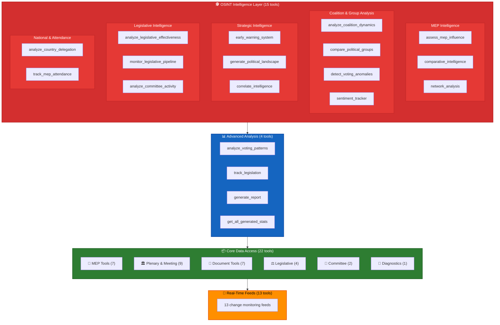
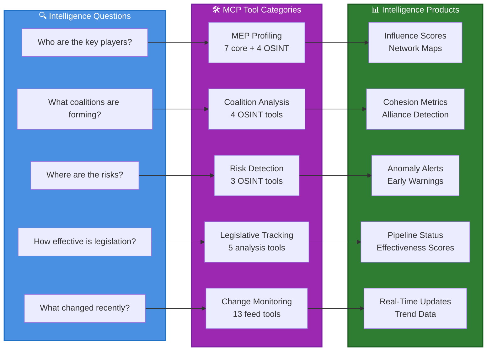

[**European Parliament MCP Server API v1.2.13**](../README.md)

***

[European Parliament MCP Server API](../modules.md) / API\_USAGE\_GUIDE

# API Usage Guide

<p align="center">
  
</p>

<h1 align="center">European Parliament MCP Server - API Usage Guide</h1>

<p align="center">
  <strong>Comprehensive guide to using all 62 MCP tools</strong><br>
  <em>Real-world examples, best practices, and query patterns</em>
</p>

---

## 📋 Table of Contents

- [Overview](#overview)
- [Quick Reference](#quick-reference)
- [Tool Documentation](#tool-documentation)
  - [get_meps](#tool-get_meps)
  - [get_mep_details](#tool-get_mep_details)
  - [get_plenary_sessions](#tool-get_plenary_sessions)
  - [get_voting_records](#tool-get_voting_records)
  - [search_documents](#tool-search_documents)
  - [get_committee_info](#tool-get_committee_info)
  - [get_parliamentary_questions](#tool-get_parliamentary_questions)
  - [analyze_voting_patterns](#tool-analyze_voting_patterns)
  - [track_legislation](#tool-track_legislation)
  - [generate_report](#tool-generate_report)
- [OSINT Intelligence Tools](#osint-intelligence-tools)
  - [assess_mep_influence](#tool-assess_mep_influence)
  - [analyze_coalition_dynamics](#tool-analyze_coalition_dynamics)
  - [detect_voting_anomalies](#tool-detect_voting_anomalies)
  - [compare_political_groups](#tool-compare_political_groups)
  - [analyze_legislative_effectiveness](#tool-analyze_legislative_effectiveness)
  - [monitor_legislative_pipeline](#tool-monitor_legislative_pipeline)
  - [analyze_committee_activity](#tool-analyze_committee_activity)
  - [track_mep_attendance](#tool-track_mep_attendance)
  - [analyze_country_delegation](#tool-analyze_country_delegation)
  - [generate_political_landscape](#tool-generate_political_landscape)
  - [network_analysis](#tool-network_analysis)
  - [sentiment_tracker](#tool-sentiment_tracker)
  - [early_warning_system](#tool-early_warning_system)
  - [comparative_intelligence](#tool-comparative_intelligence)
  - [correlate_intelligence](#tool-correlate_intelligence)
- [EP API v2 Endpoint Tools](#ep-api-v2-endpoint-tools)
  - [get_current_meps](#tool-get_current_meps)
  - [get_incoming_meps](#tool-get_incoming_meps)
  - [get_outgoing_meps](#tool-get_outgoing_meps)
  - [get_homonym_meps](#tool-get_homonym_meps)
  - [get_speeches](#tool-get_speeches)
  - [get_procedures](#tool-get_procedures)
  - [get_procedure_events](#tool-get_procedure_events)
  - [get_adopted_texts](#tool-get_adopted_texts)
  - [get_events](#tool-get_events)
  - [get_meeting_activities](#tool-get_meeting_activities)
  - [get_meeting_decisions](#tool-get_meeting_decisions)
  - [get_meeting_foreseen_activities](#tool-get_meeting_foreseen_activities)
  - [get_meeting_plenary_session_documents](#tool-get_meeting_plenary_session_documents)
  - [get_meeting_plenary_session_document_items](#tool-get_meeting_plenary_session_document_items)
  - [get_mep_declarations](#tool-get_mep_declarations)
  - [get_plenary_documents](#tool-get_plenary_documents)
  - [get_committee_documents](#tool-get_committee_documents)
  - [get_plenary_session_documents](#tool-get_plenary_session_documents)
  - [get_plenary_session_document_items](#tool-get_plenary_session_document_items)
  - [get_controlled_vocabularies](#tool-get_controlled_vocabularies)
  - [get_external_documents](#tool-get_external_documents)
  - [get_procedure_event_by_id](#tool-get_procedure_event_by_id)
- [EP API v2 Feed Endpoint Tools](#ep-api-v2-feed-endpoint-tools)
  - [get_meps_feed](#tool-get_meps_feed)
  - [get_events_feed](#tool-get_events_feed)
  - [get_procedures_feed](#tool-get_procedures_feed)
  - [get_adopted_texts_feed](#tool-get_adopted_texts_feed)
  - [get_mep_declarations_feed](#tool-get_mep_declarations_feed)
  - [get_documents_feed](#tool-get_documents_feed)
  - [get_plenary_documents_feed](#tool-get_plenary_documents_feed)
  - [get_committee_documents_feed](#tool-get_committee_documents_feed)
  - [get_plenary_session_documents_feed](#tool-get_plenary_session_documents_feed)
  - [get_external_documents_feed](#tool-get_external_documents_feed)
  - [get_parliamentary_questions_feed](#tool-get_parliamentary_questions_feed)
  - [get_corporate_bodies_feed](#tool-get_corporate_bodies_feed)
  - [get_controlled_vocabularies_feed](#tool-get_controlled_vocabularies_feed)
- [MCP Prompts](#mcp-prompts)
- [MCP Resources](#mcp-resources)
- [Common Use Cases](#common-use-cases)
- [Best Practices](#best-practices)
- [Error Handling](#error-handling)

---

## 🎯 Overview

The European Parliament MCP Server provides 62 specialized tools for accessing parliamentary data through the Model Context Protocol — organized into 8 core tools, 3 advanced tools, 15 OSINT intelligence tools, 1 statistics tool, 21 EP API v2 endpoint tools, 1 procedure event detail tool, and 13 EP API v2 feed tools. Each tool is designed for specific data queries with input validation, caching, and rate limiting.

### Political Intelligence Coverage



### Tool Category Overview



### Key Features

- **Type Safety**: All inputs validated with Zod schemas
- **Performance**: <200ms cached response times
- **Rate Limiting**: 100 requests per 15 minutes per IP
- **GDPR Compliance**: Privacy-first data handling
- **MCP Standard**: Full compliance with MCP specification

### Authentication

Currently, the server does **not require authentication** for tool access. Future versions may introduce OAuth 2.0 or API key authentication.

---

## 🔍 Quick Reference

### 👤 MEP Tools

| Tool | Purpose | Key Parameters | Response Type |
|------|---------|----------------|---------------|
| `get_meps` | List MEPs with filters | country, group, committee | Paginated list |
| `get_mep_details` | MEP details | id | Single object |
| `get_current_meps` | Currently active MEPs | limit, offset | Paginated list |
| `get_incoming_meps` | Newly arriving MEPs | limit, offset | Paginated list |
| `get_outgoing_meps` | Departing MEPs | limit, offset | Paginated list |
| `get_homonym_meps` | MEPs with identical names | limit, offset | Paginated list |
| `get_mep_declarations` | MEP financial declarations | docId, year | Paginated list |

### 🏛️ Plenary & Meeting Tools

| Tool | Purpose | Key Parameters | Response Type | Notes |
|------|---------|----------------|---------------|-------|
| `get_plenary_sessions` | List plenary sessions | dateFrom, dateTo, eventId, year, location | Paginated list | ✅ Fast with `year` filter |
| `get_voting_records` | Aggregate voting data | sessionId, topic, dateFrom | Paginated list | ⚠️ Roll-call data delayed by weeks |
| `get_speeches` | Plenary speeches | speechId, year, dateFrom, dateTo | Paginated list | |
| `get_events` | EP events | eventId, year, dateFrom, dateTo | Paginated list | |
| `get_meeting_activities` | Meeting activities | sittingId (required) | Paginated list | ✅ Works with session IDs like `MTG-PL-2025-01-20` |
| `get_meeting_decisions` | Meeting decisions | sittingId (required) | Paginated list | ✅ Works with session IDs |
| `get_meeting_foreseen_activities` | Planned agenda items | sittingId (required) | Paginated list | ✅ Works with session IDs |
| `get_meeting_plenary_session_documents` | Meeting session documents | sittingId (required) | Paginated list | ⚠️ Returns 404 for many sittingIds |
| `get_meeting_plenary_session_document_items` | Meeting session doc items | sittingId (required) | Paginated list | ⚠️ Returns 404 for many sittingIds |

### 🏢 Committee Tools

| Tool | Purpose | Key Parameters | Response Type |
|------|---------|----------------|---------------|
| `get_committee_info` | Committee data | id, abbreviation, showCurrent | Single object |
| `get_committee_documents` | Committee documents | docId, year | Paginated list |

### 📄 Document Tools

| Tool | Purpose | Key Parameters | Response Type | Notes |
|------|---------|----------------|---------------|-------|
| `search_documents` | Find documents | keyword, documentType, dateFrom, dateTo | Paginated list | ⚠️ **Always use date filters** — unfiltered searches time out |
| `get_adopted_texts` | Adopted texts | docId, year | Paginated list | ✅ Fast with `year` filter |
| `get_plenary_documents` | Plenary documents | docId, year | Paginated list | ✅ Fast with `year` filter |
| `get_plenary_session_documents` | Session documents | docId | Paginated list | |
| `get_plenary_session_document_items` | Session document items | limit, offset | Paginated list | ⚠️ EP API returns 404 — endpoint may require specific parameters |
| `get_external_documents` | External documents | docId, year | Paginated list | ✅ Fast with `year` filter |
| `get_parliamentary_questions` | Q&A data | docId, type, author, topic, status, dateFrom | Paginated list | |

### ⚖️ Legislative Procedure Tools

| Tool | Purpose | Key Parameters | Response Type | Notes |
|------|---------|----------------|---------------|-------|
| `get_procedures` | Legislative procedures | processId, year | Paginated list | ⚠️ Use `year` filter — unfiltered queries may time out |
| `get_procedure_events` | Procedure timeline events | processId (required) | Paginated list | Use short processId (e.g., `2025-0012`), not full URI |
| `get_procedure_event_by_id` | Single procedure event | processId, eventId (both required) | Single object | Use short IDs for both parameters |
| `get_controlled_vocabularies` | Classification terms | vocId | Paginated list | ✅ Fast; use short vocId (e.g., `ep-document-types`) |

### 📊 Advanced Analysis Tools

| Tool | Purpose | Key Parameters | Response Type |
|------|---------|----------------|---------------|
| `analyze_voting_patterns` | Voting analysis | mepId, dateFrom | Analysis object |
| `track_legislation` | Track procedure | procedureId | Procedure object |
| `generate_report` | Create reports | reportType, subjectId | Report object |
| `get_all_generated_stats` | Precomputed EP stats (2004-2026) + [30 OSINT metrics](../_media/EP_POLITICAL_LANDSCAPE.md) | yearFrom, yearTo, category | Statistics object |

### 🕵️ OSINT Intelligence Tools

| Tool | Purpose | Key Parameters | Response Type |
|------|---------|----------------|---------------|
| `assess_mep_influence` | MEP influence scoring | mepId (required), includeDetails | Influence scorecard |
| `analyze_coalition_dynamics` | Coalition cohesion analysis | groupIds, dateFrom, minimumCohesion | Coalition metrics |
| `detect_voting_anomalies` | Anomaly detection | mepId, groupId, sensitivityThreshold | Anomaly report |
| `compare_political_groups` | Cross-group comparison | groupIds (required), dimensions | Comparison matrix |
| `analyze_legislative_effectiveness` | Legislative scoring | subjectType (required), subjectId (required) | Effectiveness score |
| `monitor_legislative_pipeline` | Pipeline monitoring | committee, status, limit | Pipeline status |
| `analyze_committee_activity` | Committee workload & engagement | committeeId (required) | Activity report |
| `track_mep_attendance` | MEP attendance patterns | mepId, country, groupId, limit | Attendance report |
| `analyze_country_delegation` | Country delegation analysis | country (required) | Delegation analysis |
| `generate_political_landscape` | Parliament-wide landscape | dateFrom, dateTo | Landscape overview |
| `network_analysis` | MEP relationship network mapping | mepId, analysisType, depth | Network metrics |
| `sentiment_tracker` | Political group positioning scores | groupId, timeframe | Sentiment report |
| `early_warning_system` | Detect emerging political shifts | sensitivity, focusArea | Warning alerts |
| `comparative_intelligence` | Cross-reference MEP activities | mepIds (required), dimensions | Comparison matrix |
| `correlate_intelligence` | Cross-tool OSINT correlation | mepIds (required), groups, sensitivityLevel | Intelligence alerts |

### 📡 Feed Tools

EP API v2 feed endpoints fall into two groups per the [OpenAPI spec](../_media/ep-openapi-spec.json):

**Configurable-window feeds** (accept `timeframe` + `startDate`):

| Tool | Purpose | Key Parameters | Response Type | Tested Response Time |
|------|---------|----------------|---------------|---------------------|
| `get_meps_feed` | Recently updated MEPs | timeframe, startDate | Feed list | ~9 s |
| `get_events_feed` | Recently updated events | timeframe, startDate, activityType | Feed list | 30–120 s ⚠️ |
| `get_procedures_feed` | Recently updated procedures | timeframe, startDate, processType | Feed list | 30–120 s ⚠️ |
| `get_adopted_texts_feed` | Recently updated adopted texts | timeframe, startDate, workType | Feed list | ~1 s ✅ |
| `get_mep_declarations_feed` | Recently updated MEP declarations | timeframe, startDate, workType | Feed list | ~1 s ✅ |
| `get_external_documents_feed` | Recently updated external documents | timeframe, startDate, workType | Feed list | ~1 s ✅ |

**Fixed-window feeds** (no parameters — server-defined default window, typically one month):

| Tool | Purpose | Key Parameters | Response Type | Tested Response Time |
|------|---------|----------------|---------------|---------------------|
| `get_documents_feed` | Recently updated documents | _(none)_ | Feed list | 60–120+ s ⚠️ |
| `get_plenary_documents_feed` | Recently updated plenary documents | _(none)_ | Feed list | 30–120+ s ⚠️ |
| `get_committee_documents_feed` | Recently updated committee documents | _(none)_ | Feed list | 30–120+ s ⚠️ |
| `get_plenary_session_documents_feed` | Recently updated plenary session docs | _(none)_ | Feed list | 20–120+ s ⚠️ |
| `get_parliamentary_questions_feed` | Recently updated questions | _(none)_ | Feed list | 30–120+ s ⚠️ |
| `get_corporate_bodies_feed` | Recently updated corporate bodies | _(none)_ | Feed list | 60–180+ s ⚠️ |
| `get_controlled_vocabularies_feed` | Recently updated vocabularies | _(none)_ | Feed list | Returns HTTP 204 (no content) when no updates exist |

> ⚠️ **EP API response times are highly variable.** During peak load, even normally fast feeds can exceed the default 60s timeout. Set `--timeout 180000` for reliable feed access.
>
> **Known EP API feed behaviors:**
> - `controlled-vocabularies/feed` — returns HTTP 204 No Content when no vocabulary updates exist in the default window (common since vocabularies change infrequently). The server handles this gracefully and returns an empty data array.
> - `corporate-bodies/feed` — consistently the slowest feed endpoint (60–180 s). Increase timeout if using this endpoint.
> - `plenary-session-documents/feed` — may return an error-in-body response (HTTP 200 with `error` field) when the EP API's internal enrichment step fails. Handled gracefully by the server.
> - All fixed-window feeds accept **no parameters** — passing unknown parameters such as `timeframe` or `startDate` will fail input validation rather than being ignored.

---

## 📚 Tool Documentation

### Tool: get_meps

**Description**: Retrieve Members of the European Parliament with optional filters for country, political group, committee membership, and active status.

> ⚠️ **EP API Note:** The `get_meps` tool uses the EP API `/meps` endpoint which supports server-side filtering but does **not** return `country` or `politicalGroup` in responses. Results will show `country: "Unknown"` and `politicalGroup: "Unknown"`. For country and political group data, use `get_current_meps` instead. All OSINT intelligence tools automatically use `get_current_meps` for accurate MEP metadata.

#### Parameters

| Parameter | Type | Required | Default | Description |
|-----------|------|----------|---------|-------------|
| country | string | No | - | ISO 3166-1 alpha-2 country code (e.g., "SE", "FR", "DE") |
| group | string | No | - | Political group identifier (e.g., "EPP", "S&D", "Greens/EFA") |
| committee | string | No | - | Committee identifier (e.g., "ENVI", "AGRI") |
| active | boolean | No | true | Filter by active status |
| limit | number | No | 50 | Maximum results (1-100) |
| offset | number | No | 0 | Pagination offset |

#### Response Format

```json
{
  "content": [{
    "type": "text",
    "text": "{
      \"data\": [
        {
          \"id\": \"MEP-124810\",
          \"name\": \"Anna Lindberg\",
          \"country\": \"SE\",
          \"politicalGroup\": \"S&D\",
          \"committees\": [\"ENVI\", \"AGRI\"],
          \"email\": \"anna.lindberg@europarl.europa.eu\"
        }
      ],
      \"total\": 1,
      \"limit\": 50,
      \"offset\": 0
    }"
  }]
}
```

#### Example Usage

**Claude Desktop - Natural Language:**
```
Get me a list of Swedish MEPs in the S&D political group
```

**VS Code/MCP Client - TypeScript:**
```typescript
const result = await client.callTool('get_meps', {
  country: 'SE',
  group: 'S&D',
  limit: 20
});

const response = JSON.parse(result.content[0].text);
console.log(`Found ${response.total} Swedish S&D MEPs`);
```

**Python MCP Client:**
```python
result = await client.call_tool('get_meps', {
    'country': 'SE',
    'group': 'S&D',
    'limit': 20
})

data = json.loads(result['content'][0]['text'])
print(f"Found {data['total']} Swedish S&D MEPs")
```

#### Common Errors

| Error | Cause | Solution |
|-------|-------|----------|
| `ValidationError: country` | Invalid country code format | Use 2-letter ISO code (e.g., "SE" not "Sweden") |
| `RateLimitError` | Too many requests | Wait 15 minutes or implement request throttling |
| `APIError: 500` | European Parliament API down | Check EP API status, implement retry logic |

#### Use Cases

1. **Find MEPs by Country**: Filter by country code to get national delegation
2. **Political Group Analysis**: List all members of a specific political group
3. **Committee Membership**: Find MEPs serving on specific committees
4. **Pagination**: Use `limit` and `offset` for large result sets

---

### Tool: get_mep_details

**Description**: Retrieve comprehensive information about a specific MEP including biography, contact details, committee memberships, and voting statistics.

#### Parameters

| Parameter | Type | Required | Default | Description |
|-----------|------|----------|---------|-------------|
| id | string | Yes | - | MEP identifier (e.g., "MEP-124810") |

#### Response Format

```json
{
  "content": [{
    "type": "text",
    "text": "{
      \"id\": \"MEP-124810\",
      \"name\": \"Anna Lindberg\",
      \"country\": \"SE\",
      \"politicalGroup\": \"S&D\",
      \"committees\": [\"ENVI\", \"AGRI\"],
      \"email\": \"anna.lindberg@europarl.europa.eu\",
      \"biography\": \"Anna Lindberg has been an MEP since 2019...\",
      \"votingStatistics\": {
        \"totalVotes\": 1250,
        \"votesFor\": 850,
        \"votesAgainst\": 200,
        \"abstentions\": 200,
        \"attendanceRate\": 92.5
      }
    }"
  }]
}
```

#### Example Usage

**Claude Desktop:**
```
Get detailed information about MEP with ID MEP-124810
```

**TypeScript:**
```typescript
const result = await client.callTool('get_mep_details', {
  id: 'MEP-124810'
});

const mep = JSON.parse(result.content[0].text);
console.log(`${mep.name} from ${mep.country}`);
console.log(`Attendance: ${mep.votingStatistics.attendanceRate}%`);
```

#### Common Errors

| Error | Cause | Solution |
|-------|-------|----------|
| `ValidationError: id required` | Missing ID parameter | Provide MEP ID (get from get_meps) |
| `NotFoundError` | Invalid MEP ID | Verify ID exists in get_meps results |
| `ValidationError: id format` | Empty or invalid ID format | Use non-empty string ID |

#### Use Cases

1. **MEP Profile**: Get complete MEP information for profile pages
2. **Voting Analysis**: Access voting statistics for analysis
3. **Contact Information**: Retrieve email and office details
4. **Committee Work**: View committee assignments

---

### Tool: get_plenary_sessions

**Description**: Retrieve European Parliament plenary sessions with optional date range, year, or location filtering. Supports single meeting lookup by eventId.

#### Parameters

| Parameter | Type | Required | Default | Description |
|-----------|------|----------|---------|-------------|
| eventId | string | No | - | Meeting event ID for single meeting lookup |
| year | number | No | - | Filter by calendar year (1900-2100, recommended for annual counts) |
| dateFrom | string | No | - | Start date (YYYY-MM-DD format) |
| dateTo | string | No | - | End date (YYYY-MM-DD format) |
| location | string | No | - | Session location (e.g., "Strasbourg", "Brussels") |
| limit | number | No | 50 | Maximum results (1-100) |
| offset | number | No | 0 | Pagination offset |

> **Note:** `dateFrom` must be ≤ `dateTo` when both are provided.

#### Response Format

```json
{
  "content": [{
    "type": "text",
    "text": "{
      \"data\": [
        {
          \"id\": \"PLENARY-2024-05\",
          \"date\": \"2024-05-15\",
          \"location\": \"Strasbourg\",
          \"agenda\": \"Climate change debate, budget vote\",
          \"documents\": [\"DOC-2024-001\", \"DOC-2024-002\"]
        }
      ],
      \"total\": 12,
      \"limit\": 50,
      \"offset\": 0
    }"
  }]
}
```

#### Example Usage

**Claude Desktop:**
```
Show me plenary sessions from January to March 2024
```

**TypeScript:**
```typescript
const result = await client.callTool('get_plenary_sessions', {
  dateFrom: '2024-01-01',
  dateTo: '2024-03-31',
  limit: 20
});

const sessions = JSON.parse(result.content[0].text);
console.log(`Found ${sessions.data.length} sessions`);
```

#### Common Errors

| Error | Cause | Solution |
|-------|-------|----------|
| `ValidationError: dateFrom` | Invalid date format | Use YYYY-MM-DD format |
| `ValidationError: dateTo before dateFrom` | Date range invalid | Ensure dateTo >= dateFrom |

#### Use Cases

1. **Session Calendar**: List upcoming plenary sessions
2. **Historical Analysis**: Query past sessions by date range
3. **Document Tracking**: Access session documents and agendas

---

### Tool: get_voting_records

**Description**: Retrieve aggregate voting records from European Parliament plenary sessions. Filter by session, topic, or date range. Returns aggregate vote counts (for/against/abstain) and final result.

> ℹ️ **Data delay**: The EP publishes roll-call voting data with a delay of several weeks. Queries for the most recent 1–2 months may return empty results — this is expected EP API behavior, not an error.

> ⚠️ **EP API limitation**: The `mepId` parameter is accepted but **has no effect** — the EP API only provides aggregate vote tallies, not individual MEP positions.

#### Parameters

| Parameter | Type | Required | Default | Description |
|-----------|------|----------|---------|-------------|
| sessionId | string | No | - | Filter by plenary session |
| mepId | string | No | - | Accepted but ignored (EP API limitation — no per-MEP vote data) |
| topic | string | No | - | Filter by topic/keyword |
| dateFrom | string | No | - | Start date (YYYY-MM-DD) |
| dateTo | string | No | - | End date (YYYY-MM-DD) |
| limit | number | No | 50 | Maximum results (1-100) |
| offset | number | No | 0 | Pagination offset |

#### Response Format

```json
{
  "content": [{
    "type": "text",
    "text": "{
      \"data\": [
        {
          \"voteId\": \"VOTE-2024-001\",
          \"sessionId\": \"PLENARY-2024-05\",
          \"date\": \"2024-05-15\",
          \"subject\": \"Climate Action Directive\",
          \"result\": \"ADOPTED\",
          \"votesFor\": 450,
          \"votesAgainst\": 120,
          \"abstentions\": 30
        }
      ],
      \"total\": 1250,
      \"limit\": 50,
      \"offset\": 0
    }"
  }]
}
```

#### Example Usage

**Claude Desktop:**
```
Show voting records on climate topics from 2024
```

**TypeScript:**
```typescript
const result = await client.callTool('get_voting_records', {
  topic: 'climate',
  dateFrom: '2024-01-01',
  limit: 100
});
```

#### Use Cases

1. **Topic Analysis**: Find all votes on specific topics
2. **Session Votes**: Get all votes from a plenary session
3. **Trend Analysis**: Track voting patterns over time on policy areas

---

### Tool: search_documents

**Description**: Search European Parliament legislative documents with keyword and type filters.

#### Parameters

| Parameter | Type | Required | Default | Description |
|-----------|------|----------|---------|-------------|
| docId | string | No | - | Document ID for single document lookup (bypasses keyword search) |
| keyword | string | No | - | Search keyword or phrase (alphanumeric, spaces, hyphens, underscores) |
| documentType | string | No | - | Document type: `REPORT`, `RESOLUTION`, `DECISION`, `DIRECTIVE`, `REGULATION`, `OPINION`, `AMENDMENT` |
| dateFrom | string | No | - | Start date (YYYY-MM-DD) |
| dateTo | string | No | - | End date (YYYY-MM-DD) |
| committee | string | No | - | Committee identifier |
| limit | number | No | 20 | Maximum results (1-100) |
| offset | number | No | 0 | Pagination offset |

> **Note:** Provide `docId` for single document lookup, or `keyword` for search. At least one is recommended for targeted results. If neither is provided, the tool runs a search with default parameters, which may return a broad set of documents.

#### Response Format

```json
{
  "content": [{
    "type": "text",
    "text": "{
      \"data\": [
        {
          \"id\": \"A9-0123/2024\",
          \"title\": \"Report on Climate Action Directive\",
          \"type\": \"REPORT\",
          \"author\": \"MEP-124810\",
          \"date\": \"2024-05-10\",
          \"committee\": \"ENVI\",
          \"summary\": \"Report on proposed climate legislation...\"
        }
      ],
      \"total\": 45,
      \"limit\": 20,
      \"offset\": 0
    }"
  }]
}
```

#### Example Usage

**Claude Desktop:**
```
Search for documents about renewable energy from the ENVI committee
```

**TypeScript:**
```typescript
const result = await client.callTool('search_documents', {
  keyword: 'renewable energy',
  documentType: 'REPORT',
  dateFrom: '2024-01-01',
  limit: 25
});
```

#### Common Errors

| Error | Cause | Solution |
|-------|-------|----------|
| `ValidationError: keyword` | Invalid characters | Use only alphanumeric, spaces, hyphens, underscores |
| `SearchError: missing search parameters` | Neither keyword nor docId provided | Provide a search term or use docId for direct lookup |

#### Use Cases

1. **Legislative Research**: Find documents on specific topics
2. **Committee Work**: Search documents by committee
3. **Author Tracking**: Find documents by specific MEP

---

### Tool: get_committee_info

**Description**: Retrieve detailed information about a European Parliament committee including composition, members, chair, and areas of responsibility. Can also list all current active corporate bodies.

#### Parameters

| Parameter | Type | Required | Default | Description |
|-----------|------|----------|---------|-------------|
| id | string | No* | - | Committee identifier |
| abbreviation | string | No* | - | Committee abbreviation (e.g., "ENVI", "AGRI") |
| showCurrent | boolean | No | false | If true, returns all current active corporate bodies |

*Either `showCurrent: true`, `id`, or `abbreviation` must be provided.

#### Response Format

```json
{
  "content": [{
    "type": "text",
    "text": "{
      \"id\": \"COMM-ENVI\",
      \"name\": \"Committee on Environment, Public Health and Food Safety\",
      \"abbreviation\": \"ENVI\",
      \"chair\": \"MEP-124820\",
      \"viceChairs\": [\"MEP-124821\", \"MEP-124822\"],
      \"members\": [\"MEP-124810\", \"MEP-124811\"],
      \"responsibilities\": [
        \"Environmental policy\",
        \"Public health\",
        \"Food safety\"
      ]
    }"
  }]
}
```

#### Example Usage

**Claude Desktop:**
```
Get information about the ENVI committee
```

**TypeScript:**
```typescript
const result = await client.callTool('get_committee_info', {
  abbreviation: 'ENVI'
});

const committee = JSON.parse(result.content[0].text);
console.log(`${committee.name} has ${committee.members.length} members`);
```

#### Use Cases

1. **Committee Overview**: Get committee structure and leadership
2. **Member Lookup**: Find MEPs serving on specific committees
3. **Responsibility Mapping**: Understand committee jurisdictions

---

### Tool: get_parliamentary_questions

**Description**: Retrieve parliamentary questions (written and oral) with filters for author, topic, and date range. Supports single question lookup by docId.

#### Parameters

| Parameter | Type | Required | Default | Description |
|-----------|------|----------|---------|-------------|
| docId | string | No | - | Document ID for single question lookup (e.g., "E-000001/2024") |
| type | string | No | - | Question type: `WRITTEN` or `ORAL` |
| author | string | No | - | MEP identifier or name of question author |
| topic | string | No | - | Question topic or keyword to search |
| status | string | No | - | Question status: `PENDING` or `ANSWERED` |
| dateFrom | string | No | - | Start date (YYYY-MM-DD) |
| dateTo | string | No | - | End date (YYYY-MM-DD) |
| limit | number | No | 50 | Maximum results (1-100) |
| offset | number | No | 0 | Pagination offset |

> **Note:** `dateFrom` must be ≤ `dateTo` when both are provided.

#### Response Format

```json
{
  "content": [{
    "type": "text",
    "text": "{
      \"data\": [
        {
          \"questionId\": \"Q-2024-001\",
          \"author\": \"MEP-124810\",
          \"type\": \"WRITTEN\",
          \"subject\": \"Climate change adaptation funding\",
          \"question\": \"What measures is the Commission taking...\",
          \"date\": \"2024-03-15\",
          \"answered\": true,
          \"answerDate\": \"2024-04-10\",
          \"answer\": \"The Commission has allocated...\"
        }
      ],
      \"total\": 328,
      \"limit\": 50,
      \"offset\": 0
    }"
  }]
}
```

#### Example Usage

**Claude Desktop:**
```
Show me written questions about climate change from 2024
```

**TypeScript:**
```typescript
const result = await client.callTool('get_parliamentary_questions', {
  topic: 'climate change',
  type: 'WRITTEN',
  dateFrom: '2024-01-01',
  status: 'ANSWERED',
  limit: 50
});
```

#### Use Cases

1. **MEP Accountability**: Track questions from specific MEPs
2. **Topic Research**: Find questions on specific policy areas
3. **Answer Monitoring**: Check if questions have been answered

---

### Tool: analyze_voting_patterns

**Description**: Analyze MEP voting behavior including political group alignment, cross-party voting, attendance rates, and topic-based voting patterns.

#### Parameters

| Parameter | Type | Required | Default | Description |
|-----------|------|----------|---------|-------------|
| mepId | string | Yes | - | MEP identifier to analyze |
| dateFrom | string | No | - | Analysis start date (YYYY-MM-DD) |
| dateTo | string | No | - | Analysis end date (YYYY-MM-DD) |
| compareWithGroup | boolean | No | true | Compare with political group average |

#### Response Format

```json
{
  "content": [{
    "type": "text",
    "text": "{
      \"mepId\": \"MEP-124810\",
      \"mepName\": \"Anna Lindberg\",
      \"period\": {
        \"from\": \"2024-01-01\",
        \"to\": \"2024-12-31\"
      },
      \"statistics\": {
        \"totalVotes\": 1250,
        \"votesFor\": 850,
        \"votesAgainst\": 200,
        \"abstentions\": 200,
        \"attendanceRate\": 92.5
      },
      \"groupAlignment\": {
        \"politicalGroup\": \"S&D\",
        \"alignmentRate\": 87.5,
        \"divergentVotes\": 156
      },
      \"topTopics\": [
        { \"topic\": \"Climate Change\", \"voteCount\": 45 },
        { \"topic\": \"Agriculture Policy\", \"voteCount\": 38 }
      ],
      \"crossPartyVoting\": {
        \"withOtherGroups\": 125,
        \"rate\": 10.0
      }
    }"
  }]
}
```

#### Example Usage

**Claude Desktop:**
```
Analyze voting patterns for MEP-124810 in 2024, compare with their political group
```

**TypeScript:**
```typescript
const result = await client.callTool('analyze_voting_patterns', {
  mepId: 'MEP-124810',
  dateFrom: '2024-01-01',
  dateTo: '2024-12-31',
  compareWithGroup: true
});

const analysis = JSON.parse(result.content[0].text);
console.log(`Attendance: ${analysis.statistics.attendanceRate}%`);
console.log(`Group alignment: ${analysis.groupAlignment.alignmentRate}%`);
```

#### Use Cases

1. **MEP Performance**: Analyze attendance and voting activity
2. **Political Alignment**: Compare MEP votes with party line
3. **Cross-Party Analysis**: Identify bipartisan voting patterns
4. **Topic Focus**: Discover MEP's key policy areas

---

### Tool: track_legislation

**Description**: Track European Parliament legislative procedure progress including status, timeline, committees, amendments, and voting records.

#### Parameters

| Parameter | Type | Required | Default | Description |
|-----------|------|----------|---------|-------------|
| procedureId | string | Yes | - | Legislative procedure identifier (e.g., "2024/0001(COD)") |

#### Response Format

```json
{
  "content": [{
    "type": "text",
    "text": "{
      \"procedureId\": \"2024/0001(COD)\",
      \"title\": \"Climate Action and Renewable Energy Directive\",
      \"type\": \"Ordinary legislative procedure (COD)\",
      \"status\": \"PLENARY\",
      \"currentStage\": \"Awaiting plenary vote\",
      \"timeline\": [
        {
          \"date\": \"2024-01-15\",
          \"stage\": \"Commission Proposal\",
          \"description\": \"Legislative proposal submitted\"
        }
      ],
      \"committees\": [
        {
          \"abbreviation\": \"ENVI\",
          \"role\": \"LEAD\",
          \"rapporteur\": \"MEP-124810\"
        }
      ],
      \"amendments\": {
        \"proposed\": 156,
        \"adopted\": 89,
        \"rejected\": 67
      },
      \"voting\": [...],
      \"documents\": [...],
      \"nextSteps\": [
        \"Plenary debate scheduled for 2024-06-15\"
      ]
    }"
  }]
}
```

#### Example Usage

**Claude Desktop:**
```
Track the progress of legislative procedure 2024/0001(COD)
```

**TypeScript:**
```typescript
const result = await client.callTool('track_legislation', {
  procedureId: '2024/0001(COD)'
});

const procedure = JSON.parse(result.content[0].text);
console.log(`Status: ${procedure.status}`);
console.log(`Current stage: ${procedure.currentStage}`);
console.log(`Next: ${procedure.nextSteps[0]}`);
```

#### Use Cases

1. **Legislation Monitoring**: Track bill progress through Parliament
2. **Timeline Analysis**: View complete legislative timeline
3. **Amendment Tracking**: Monitor proposed and adopted amendments
4. **Committee Work**: See committee assignments and rapporteurs

---

### Tool: generate_report

**Description**: Generate comprehensive analytical reports on European Parliament data. Supports four report types: MEP activity, committee performance, voting statistics, and legislation progress.

#### Parameters

| Parameter | Type | Required | Default | Description |
|-----------|------|----------|---------|-------------|
| reportType | string | Yes | - | Report type: MEP_ACTIVITY, COMMITTEE_PERFORMANCE, VOTING_STATISTICS, LEGISLATION_PROGRESS |
| subjectId | string | No | - | Subject identifier (MEP ID, Committee ID) - optional for aggregate reports |
| dateFrom | string | No | - | Report period start (YYYY-MM-DD) |
| dateTo | string | No | - | Report period end (YYYY-MM-DD) |

#### Response Format

```json
{
  "content": [{
    "type": "text",
    "text": "{
      \"reportType\": \"MEP_ACTIVITY\",
      \"subject\": \"Anna Lindberg\",
      \"period\": {
        \"from\": \"2024-01-01\",
        \"to\": \"2024-12-31\"
      },
      \"generatedAt\": \"2024-12-31T23:59:59Z\",
      \"summary\": \"Activity report for Anna Lindberg...\",
      \"sections\": [
        {
          \"title\": \"Voting Activity\",
          \"content\": \"Participated in 1250 votes...\"
        }
      ],
      \"statistics\": {
        \"totalVotes\": 1250,
        \"attendanceRate\": 92.5,
        \"questionsSubmitted\": 28
      },
      \"recommendations\": [
        \"Continue active participation...\"
      ]
    }"
  }]
}
```

#### Example Usage

**Claude Desktop:**
```
Generate an MEP activity report for MEP-124810 covering 2024
```

**TypeScript:**
```typescript
// MEP Activity Report
const result = await client.callTool('generate_report', {
  reportType: 'MEP_ACTIVITY',
  subjectId: 'MEP-124810',
  dateFrom: '2024-01-01',
  dateTo: '2024-12-31'
});

// Committee Performance Report
const committeReport = await client.callTool('generate_report', {
  reportType: 'COMMITTEE_PERFORMANCE',
  subjectId: 'COMM-ENVI',
  dateFrom: '2024-01-01',
  dateTo: '2024-12-31'
});

// Parliament-wide Voting Statistics (no subjectId needed)
const votingStats = await client.callTool('generate_report', {
  reportType: 'VOTING_STATISTICS',
  dateFrom: '2024-01-01',
  dateTo: '2024-12-31'
});
```

#### Report Types

1. **MEP_ACTIVITY**: Individual MEP performance and activity
   - Voting participation and statistics
   - Committee involvement
   - Parliamentary questions submitted
   - Reports authored

2. **COMMITTEE_PERFORMANCE**: Committee productivity analysis
   - Meeting frequency
   - Legislative output
   - Member participation rates

3. **VOTING_STATISTICS**: Parliament-wide voting analysis
   - Overall voting activity
   - Adoption rates
   - Political group alignment patterns

4. **LEGISLATION_PROGRESS**: Legislative activity overview
   - New proposals submitted
   - Completed procedures
   - Ongoing procedures and timelines

#### Use Cases

1. **Performance Review**: Generate MEP activity reports
2. **Committee Analysis**: Assess committee productivity
3. **Statistical Analysis**: Parliament-wide voting trends
4. **Progress Tracking**: Monitor legislative progress

---

## 🕵️ OSINT Intelligence Tools

### Tool: assess_mep_influence

**Description**: Compute a comprehensive MEP influence score using a 5-dimension model: voting activity, legislative output, committee engagement, parliamentary oversight, and coalition building.

#### Parameters

| Parameter | Type | Required | Default | Description |
|-----------|------|----------|---------|-------------|
| mepId | string | Yes | - | MEP identifier |
| dateFrom | string | No | - | Start date (YYYY-MM-DD) |
| dateTo | string | No | - | End date (YYYY-MM-DD) |
| includeDetails | boolean | No | false | Include detailed breakdown per dimension |

#### Example Usage

```
Assess the influence of MEP with ID "124810" over the past year
```

---

### Tool: analyze_coalition_dynamics

**Description**: Analyze coalition cohesion and stress indicators across political groups, detecting voting alliances, defection rates, and fragmentation signals.

#### Parameters

| Parameter | Type | Required | Default | Description |
|-----------|------|----------|---------|-------------|
| groupIds | string[] | No | - | Political group identifiers to analyze (omit for all groups, 1-10 items) |
| dateFrom | string | No | - | Analysis start date (YYYY-MM-DD) |
| dateTo | string | No | - | Analysis end date (YYYY-MM-DD) |
| minimumCohesion | number | No | 0.5 | Minimum cohesion threshold for alliance detection (0-1) |

#### Example Usage

```
Analyze coalition dynamics between EPP and S&D over the last 6 months
```

---

### Tool: detect_voting_anomalies

**Description**: Detect unusual voting patterns including party defections, sudden alignment shifts, abstention spikes, and other anomalies.

#### Parameters

| Parameter | Type | Required | Default | Description |
|-----------|------|----------|---------|-------------|
| mepId | string | No | - | MEP identifier (omit for broad analysis) |
| groupId | string | No | - | Political group to analyze |
| dateFrom | string | No | - | Analysis start date (YYYY-MM-DD) |
| dateTo | string | No | - | Analysis end date (YYYY-MM-DD) |
| sensitivityThreshold | number | No | 0.3 | Anomaly sensitivity (0-1, lower = more anomalies detected) |

> ⚠️ **Note:** Cannot specify both `mepId` and `groupId` — use one or neither.

#### Example Usage

```
Detect voting anomalies in the EPP group over the past 3 months
```

---

### Tool: compare_political_groups

**Description**: Cross-group comparative analysis of voting discipline, activity levels, policy focus areas, and internal cohesion.

#### Parameters

| Parameter | Type | Required | Default | Description |
|-----------|------|----------|---------|-------------|
| groupIds | string[] | Yes | - | Political group identifiers to compare (minimum 2, maximum 10) |
| dateFrom | string | No | - | Analysis start date (YYYY-MM-DD) |
| dateTo | string | No | - | Analysis end date (YYYY-MM-DD) |
| dimensions | string[] | No | all | Comparison dimensions: `voting_discipline`, `activity_level`, `legislative_output`, `attendance`, `cohesion` |

#### Example Usage

```
Compare EPP, S&D, and Renew Europe on voting cohesion and legislative output
```

---

### Tool: analyze_legislative_effectiveness

**Description**: Score MEP or committee legislative effectiveness — bills passed, amendments adopted, report quality, and overall impact.

#### Parameters

| Parameter | Type | Required | Description |
|-----------|------|----------|-------------|
| subjectType | string | Yes | Subject type: `MEP` or `COMMITTEE` |
| subjectId | string | Yes | Subject identifier (MEP ID or committee abbreviation) |
| dateFrom | string | No | Start date (YYYY-MM-DD) |
| dateTo | string | No | End date (YYYY-MM-DD) |

#### Example Usage

```
Analyze the legislative effectiveness of the ENVI committee
```

---

### Tool: monitor_legislative_pipeline

**Description**: Monitor real-time legislative pipeline status with bottleneck detection, timeline forecasting, and procedure progress tracking.

#### Parameters

| Parameter | Type | Required | Default | Description |
|-----------|------|----------|---------|-------------|
| committee | string | No | - | Filter by committee |
| status | string | No | ACTIVE | Pipeline status filter: `ALL`, `ACTIVE`, `STALLED`, `COMPLETED` |
| dateFrom | string | No | - | Analysis start date (YYYY-MM-DD) |
| dateTo | string | No | - | Analysis end date (YYYY-MM-DD) |
| limit | number | No | 20 | Maximum results to return (1-100) |

#### Example Usage

```
Show the current legislative pipeline status and identify bottlenecks
```

---

### Tool: analyze_committee_activity

**Description**: Analyze committee workload, document production, meeting frequency, and member engagement metrics. Provides intelligence on committee operational efficiency and policy focus areas.

#### Parameters

| Parameter | Type | Required | Description |
|-----------|------|----------|-------------|
| committeeId | string | Yes | Committee identifier (e.g., "ENVI", "ITRE") |
| dateFrom | string | No | Start date (ISO 8601) |
| dateTo | string | No | End date (ISO 8601) |

#### Example Usage

```
Analyze the ENVI committee's activity, document output, and member engagement over the last 6 months
```

---

### Tool: track_mep_attendance

**Description**: Track MEP plenary attendance patterns with trend detection, engagement scoring, and participation rate analysis. Supports both individual MEP queries and high-level overviews by country or political group.

#### Parameters

| Parameter | Type | Required | Description |
|-----------|------|----------|-------------|
| mepId | string | No | MEP identifier for individual attendance analysis |
| country | string | No | ISO 3166-1 alpha-2 country code for delegation overview |
| groupId | string | No | Political group identifier for group-level overview |
| limit | number | No | Maximum number of MEPs to include in overview queries |
| dateFrom | string | No | Start date (ISO 8601) |
| dateTo | string | No | End date (ISO 8601) |

At least one of `mepId`, `country`, or `groupId` is typically provided to scope the analysis.

#### Example Usage

```
Track attendance patterns and engagement trends for MEP-124810 over the current parliamentary term
```

---

### Tool: analyze_country_delegation

**Description**: Analyze a country's MEP delegation composition, political group distribution, voting behavior, committee representation, and national cohesion metrics.

#### Parameters

| Parameter | Type | Required | Description |
|-----------|------|----------|-------------|
| country | string | Yes | ISO 3166-1 alpha-2 country code (e.g., "SE", "DE", "FR") |
| dateFrom | string | No | Start date (ISO 8601) |
| dateTo | string | No | End date (ISO 8601) |

#### Example Usage

```
Analyze the Swedish delegation's composition, voting behavior, and committee representation
```

---

### Tool: generate_political_landscape

**Description**: Generate a comprehensive political landscape overview of the European Parliament, including group composition, power dynamics, coalition thresholds, bloc analysis, and fragmentation metrics.

#### Parameters

| Parameter | Type | Required | Description |
|-----------|------|----------|-------------|
| dateFrom | string | No | Start date (ISO 8601) |
| dateTo | string | No | End date (ISO 8601) |

#### Example Usage

```
Generate a current political landscape overview including group sizes, coalition possibilities, and bloc dynamics
```

---

### Tool: network_analysis

**Description**: MEP relationship network mapping using committee co-membership. Computes centrality scores, cluster assignments, bridging MEPs, and network density metrics. Identifies informal power structures and cross-party collaboration pathways.

#### Parameters

| Parameter | Type | Required | Default | Description |
|-----------|------|----------|---------|-------------|
| mepId | number | No | - | Focus on ego network for a specific MEP |
| analysisType | string | No | combined | Analysis type: `committee`, `voting`, or `combined` |
| depth | number | No | 2 | Network depth (1-3 hops from focal node) |

#### Example Usage

**Claude Desktop - Natural Language:**
```
Map the relationship network for MEP 124810 using committee co-membership data
```

**MCP Client - TypeScript:**
```typescript
const result = await client.callTool('network_analysis', {
  mepId: 124810,
  analysisType: 'committee',
  depth: 2
});
```

**Example Response** (abbreviated):
```json
{
  "content": [{
    "type": "text",
    "text": "{\"networkMetrics\":{\"density\":0.34,\"avgCentrality\":0.45,\"clusters\":5},\"centralNodes\":[{\"mepId\":124810,\"centralityScore\":0.82,\"clusterAssignment\":1,\"bridgingScore\":0.67}],\"crossPartyEdges\":42}"
  }]
}
```

> **EP API Endpoints**: `/meps`, `/corporate-bodies`

---

### Tool: sentiment_tracker

**Description**: Track political group institutional-positioning scores based on seat-share proxy. Computes scores (-1 to +1), polarization index, and identifies consensus and divisive topics.

#### Parameters

| Parameter | Type | Required | Default | Description |
|-----------|------|----------|---------|-------------|
| groupId | string | No | - | Political group identifier (e.g., "EPP", "S&D"). Omit for all groups |
| timeframe | string | No | last_quarter | Time window: `last_month`, `last_quarter`, or `last_year` |

#### Example Usage

**Claude Desktop - Natural Language:**
```
Track the institutional positioning sentiment for the EPP group over the last quarter
```

**MCP Client - TypeScript:**
```typescript
const result = await client.callTool('sentiment_tracker', {
  groupId: 'EPP',
  timeframe: 'last_quarter'
});
```

**Example Response** (abbreviated):
```json
{
  "content": [{
    "type": "text",
    "text": "{\"groupScores\":[{\"groupId\":\"EPP\",\"positioningScore\":0.72,\"trend\":\"stable\"}],\"polarizationIndex\":0.38,\"consensusTopics\":[\"defense\",\"trade\"],\"divisiveTopics\":[\"migration\",\"climate\"]}"
  }]
}
```

> **EP API Endpoints**: `/corporate-bodies`

---

### Tool: early_warning_system

**Description**: Detect emerging political shifts, coalition fracture signals, and unusual patterns. Generates warnings with severity levels (CRITICAL/HIGH/MEDIUM/LOW), computes stability score (0-100).

#### Parameters

| Parameter | Type | Required | Default | Description |
|-----------|------|----------|---------|-------------|
| sensitivity | string | No | medium | Detection sensitivity: `low`, `medium`, or `high` |
| focusArea | string | No | all | Focus area: `coalitions`, `attendance`, or `all` |

#### Example Usage

**Claude Desktop - Natural Language:**
```
Run the early warning system with high sensitivity focused on coalition dynamics
```

**MCP Client - TypeScript:**
```typescript
const result = await client.callTool('early_warning_system', {
  sensitivity: 'high',
  focusArea: 'coalitions'
});
```

**Example Response** (abbreviated):
```json
{
  "content": [{
    "type": "text",
    "text": "{\"stabilityScore\":72,\"warnings\":[{\"severity\":\"HIGH\",\"type\":\"coalition_fracture\",\"description\":\"Unusual voting divergence detected in EPP-Renew bloc\",\"confidence\":0.85}],\"overallAssessment\":\"Moderate instability signals detected\"}"
  }]
}
```

> **EP API Endpoints**: `/meps`, `/meetings`

---

### Tool: comparative_intelligence

**Description**: Cross-reference 2-10 MEP activities across voting, committee, legislative, and attendance dimensions. Returns ranked profiles, correlation matrix, outlier detection, and cluster analysis.

#### Parameters

| Parameter | Type | Required | Default | Description |
|-----------|------|----------|---------|-------------|
| mepIds | array of numbers | Yes | - | List of 2-10 MEP identifiers to compare |
| dimensions | array of strings | No | all | Dimensions to compare: `voting`, `committee`, `legislative`, `attendance` |

#### Example Usage

**Claude Desktop - Natural Language:**
```
Compare MEPs 124810, 124811, and 124812 across voting and committee dimensions
```

**MCP Client - TypeScript:**
```typescript
const result = await client.callTool('comparative_intelligence', {
  mepIds: [124810, 124811, 124812],
  dimensions: ['voting', 'committee']
});
```

**Example Response** (abbreviated):
```json
{
  "content": [{
    "type": "text",
    "text": "{\"rankedProfiles\":[{\"mepId\":124810,\"overallScore\":0.87,\"rank\":1}],\"correlationMatrix\":[[1.0,0.65,0.42],[0.65,1.0,0.71],[0.42,0.71,1.0]],\"outliers\":[],\"clusters\":[{\"members\":[124811,124812],\"label\":\"high-committee-engagement\"}]}"
  }]
}
```

> **EP API Endpoints**: `/meps`, `/meetings`

---

### Tool: correlate_intelligence

**Description**: Cross-tool OSINT intelligence correlation engine. Combines outputs from assess_mep_influence + detect_voting_anomalies (ELEVATED_ATTENTION alerts), early_warning_system + analyze_coalition_dynamics (COALITION_FRACTURE alerts), and optionally network_analysis + comparative_intelligence (COMPREHENSIVE_PROFILE alerts). Returns consolidated intelligence alerts with evidence chains and recommendations.

#### Parameters

| Parameter | Type | Required | Default | Description |
|-----------|------|----------|---------|-------------|
| mepIds | array of strings | Yes | - | MEP identifiers to cross-correlate (minimum 1, maximum 5) |
| groups | array of strings | No | - | Political groups for coalition fracture analysis (max 8, omit to use all major groups) |
| sensitivityLevel | string | No | MEDIUM | Alert sensitivity: `HIGH`, `MEDIUM`, or `LOW` — HIGH surfaces more signals, LOW reduces noise |
| includeNetworkAnalysis | boolean | No | false | Run network centrality analysis (increases response time) |

#### Example Usage

**Claude Desktop - Natural Language:**
```
Run intelligence correlation for MEPs 124810 and 124811 with high sensitivity
```

**MCP Client - TypeScript:**
```typescript
const result = await client.callTool('correlate_intelligence', {
  mepIds: ['124810', '124811'],
  groups: ['EPP', 'S&D'],
  sensitivityLevel: 'HIGH',
  includeNetworkAnalysis: true
});
```

**Example Response** (abbreviated):
```json
{
  "content": [{
    "type": "text",
    "text": "{\"alerts\":[{\"severity\":\"HIGH\",\"type\":\"cross_tool_correlation\",\"sources\":[\"early_warning_system\",\"analyze_coalition_dynamics\"],\"finding\":\"Coalition stress between EPP and S&D on migration policy\",\"evidenceChain\":[\"Voting divergence: 34%\",\"Attendance drop in joint committee sessions\"],\"confidence\":0.78}],\"summary\":{\"totalAlerts\":3,\"criticalCount\":0,\"highCount\":1}}"
  }]
}
```

> **EP API Endpoints**: Multiple (orchestrates other tools)

---

## 🏛️ EP API v2 Endpoint Tools

These tools provide direct access to all European Parliament Open Data API v2 endpoints.

### Tool: get_current_meps

**Description**: Get currently active Members of European Parliament (today's date). Returns only MEPs with active mandates. Unlike `get_meps`, this tool uses the EP API `/meps/show-current` endpoint which returns accurate `country` and `politicalGroup` data in responses.

> ✅ **Recommended** for use when you need MEP country or political group information. All OSINT intelligence tools use this endpoint internally.

#### Parameters

| Parameter | Type | Required | Default | Description |
|-----------|------|----------|---------|-------------|
| limit | number | No | 50 | Maximum results (1-100) |
| offset | number | No | 0 | Pagination offset |

#### Example Usage

**Claude Desktop - Natural Language:**
```
Show me all currently active MEPs
```

**MCP Client - TypeScript:**
```typescript
const result = await client.callTool('get_current_meps', { limit: 50 });
```

---

### Tool: get_incoming_meps

**Description**: Get incoming Members of European Parliament for the current parliamentary term. Returns MEPs who are newly joining.

#### Parameters

| Parameter | Type | Required | Default | Description |
|-----------|------|----------|---------|-------------|
| limit | number | No | 50 | Maximum results (1-100) |
| offset | number | No | 0 | Pagination offset |

#### Example Usage

```
List the newly arriving MEPs for the current parliamentary term
```

**MCP Client - TypeScript:**
```typescript
const result = await client.callTool('get_incoming_meps', { limit: 20 });
```

---

### Tool: get_outgoing_meps

**Description**: Get outgoing Members of European Parliament for the current parliamentary term. Returns MEPs who are leaving parliament.

#### Parameters

| Parameter | Type | Required | Default | Description |
|-----------|------|----------|---------|-------------|
| limit | number | No | 50 | Maximum results (1-100) |
| offset | number | No | 0 | Pagination offset |

#### Example Usage

```
Which MEPs are leaving the European Parliament this term?
```

**MCP Client - TypeScript:**
```typescript
const result = await client.callTool('get_outgoing_meps', { limit: 20 });
```

---

### Tool: get_homonym_meps

**Description**: Get homonym Members of European Parliament (MEPs with identical names) for the current parliamentary term. Useful for name disambiguation.

#### Parameters

| Parameter | Type | Required | Default | Description |
|-----------|------|----------|---------|-------------|
| limit | number | No | 50 | Maximum results (1-100) |
| offset | number | No | 0 | Pagination offset |

#### Example Usage

```
Are there any MEPs with identical names in the current parliament?
```

**MCP Client - TypeScript:**
```typescript
const result = await client.callTool('get_homonym_meps', { limit: 50 });
```

---

### Tool: get_speeches

**Description**: Get European Parliament plenary speeches and debate contributions. Supports single speech lookup by speechId or list with date range filtering.

#### Parameters

| Parameter | Type | Required | Default | Description |
|-----------|------|----------|---------|-------------|
| speechId | string | No | - | Specific speech ID for single lookup |
| year | number | No | - | Filter by calendar year (1900-2100, recommended for annual counts) |
| dateFrom | string | No | - | Start date filter (YYYY-MM-DD) |
| dateTo | string | No | - | End date filter (YYYY-MM-DD) |
| limit | number | No | 50 | Maximum results (1-100) |
| offset | number | No | 0 | Pagination offset |

#### Example Usage

**Claude Desktop - Natural Language:**
```
Get plenary speeches from January 2024
```

**MCP Client - TypeScript:**
```typescript
// List speeches by year
const result = await client.callTool('get_speeches', {
  year: 2024,
  limit: 20
});

// List speeches in a date range
const rangeResult = await client.callTool('get_speeches', {
  dateFrom: '2024-01-01',
  dateTo: '2024-01-31',
  limit: 20
});

// Get a specific speech
const speech = await client.callTool('get_speeches', {
  speechId: 'SPEECH-12345'
});
```

---

### Tool: get_procedures

**Description**: Get European Parliament legislative procedures. Supports single procedure lookup by processId or list with year filter.

> ⚠️ **Performance note:** Always use a `year` filter or `processId` when querying procedures. Unfiltered queries can take 60+ seconds and may time out with the default 60s timeout.

#### Parameters

| Parameter | Type | Required | Default | Description |
|-----------|------|----------|---------|-------------|
| processId | string | No | - | Specific procedure ID (YYYY-NNNN format) for single lookup |
| year | number | No | - | Filter by year |
| limit | number | No | 50 | Maximum results (1-100) |
| offset | number | No | 0 | Pagination offset |

#### Example Usage

**Claude Desktop - Natural Language:**
```
Show me legislative procedures from 2024
```

**MCP Client - TypeScript:**
```typescript
// List procedures by year (recommended — avoids timeout)
const result = await client.callTool('get_procedures', { year: 2024, limit: 20 });

// Get a specific procedure
const procedure = await client.callTool('get_procedures', {
  processId: '2024-0006'
});
```

---

### Tool: get_procedure_events

**Description**: Get events linked to a specific EP legislative procedure (hearings, debates, votes). Returns the timeline of events for a procedure.

> ⚠️ **EP API note:** This endpoint can be slow (30–60+ s) and may return 404 for some procedure IDs. Use the `eli/dl/proc/` prefixed IDs returned by `get_procedures` for best results.

#### Parameters

| Parameter | Type | Required | Default | Description |
|-----------|------|----------|---------|-------------|
| processId | string | Yes | - | Procedure process ID (e.g., `eli/dl/proc/2024-0006` or `2024-0006`) |
| limit | number | No | 50 | Maximum results (1-100) |
| offset | number | No | 0 | Pagination offset |

#### Example Usage

```
Show me the timeline of events for procedure 2024-0006
```

**MCP Client - TypeScript:**
```typescript
const result = await client.callTool('get_procedure_events', {
  processId: 'eli/dl/proc/2024-0006',
  limit: 50
});
```

---

### Tool: get_adopted_texts

**Description**: Get European Parliament adopted texts including legislative resolutions, positions, and non-legislative resolutions. Supports single document lookup by docId or list with year filter.

#### Parameters

| Parameter | Type | Required | Default | Description |
|-----------|------|----------|---------|-------------|
| docId | string | No | - | Specific document ID for single lookup |
| year | number | No | - | Filter by year |
| limit | number | No | 50 | Maximum results (1-100) |
| offset | number | No | 0 | Pagination offset |

#### Example Usage

**Claude Desktop - Natural Language:**
```
Get adopted texts from 2024
```

**MCP Client - TypeScript:**
```typescript
const result = await client.callTool('get_adopted_texts', { year: 2024, limit: 20 });
```

---

### Tool: get_events

**Description**: Get European Parliament events including hearings, conferences, seminars, and institutional events. Supports single event lookup by eventId or list with date range filtering.

#### Parameters

| Parameter | Type | Required | Default | Description |
|-----------|------|----------|---------|-------------|
| eventId | string | No | - | Specific event ID for single lookup |
| year | number | No | - | Filter by calendar year (1900-2100, recommended for annual counts) |
| dateFrom | string | No | - | Start date filter (YYYY-MM-DD) |
| dateTo | string | No | - | End date filter (YYYY-MM-DD) |
| limit | number | No | 50 | Maximum results (1-100) |
| offset | number | No | 0 | Pagination offset |

#### Example Usage

```
Show me European Parliament events scheduled for March 2024
```

**MCP Client - TypeScript:**
```typescript
const result = await client.callTool('get_events', {
  dateFrom: '2024-03-01',
  dateTo: '2024-03-31',
  limit: 20
});
```

---

### Tool: get_meeting_activities

**Description**: Get activities linked to a specific EP plenary sitting (debates, votes, presentations). Requires a sitting ID.

#### Parameters

| Parameter | Type | Required | Default | Description |
|-----------|------|----------|---------|-------------|
| sittingId | string | Yes | - | Plenary sitting ID |
| limit | number | No | 20 | Maximum results (1-100). Default 20 — activities endpoint can be slow |
| offset | number | No | 0 | Pagination offset |

#### Example Usage

```
What activities took place during plenary sitting MTG-PL-2024-01-15?
```

**MCP Client - TypeScript:**
```typescript
const result = await client.callTool('get_meeting_activities', {
  sittingId: 'MTG-PL-2024-01-15',
  limit: 20
});
```

---

### Tool: get_meeting_decisions

**Description**: Get decisions made in a specific EP plenary sitting. Returns adopted decisions and voting outcomes. Requires a sitting ID.

#### Parameters

| Parameter | Type | Required | Default | Description |
|-----------|------|----------|---------|-------------|
| sittingId | string | Yes | - | Plenary sitting ID |
| limit | number | No | 50 | Maximum results (1-100) |
| offset | number | No | 0 | Pagination offset |

#### Example Usage

```
What decisions were made in plenary sitting MTG-PL-2024-01-15?
```

**MCP Client - TypeScript:**
```typescript
const result = await client.callTool('get_meeting_decisions', {
  sittingId: 'MTG-PL-2024-01-15',
  limit: 50
});
```

---

### Tool: get_meeting_foreseen_activities

**Description**: Get foreseen (planned) activities for a specific EP meeting/plenary sitting. Returns scheduled agenda items.

#### Parameters

| Parameter | Type | Required | Default | Description |
|-----------|------|----------|---------|-------------|
| sittingId | string | Yes | - | Plenary sitting ID |
| limit | number | No | 20 | Maximum results (1-100). Default 20 — foreseen-activities endpoint can be slow |
| offset | number | No | 0 | Pagination offset |

#### Example Usage

```
What is planned for the upcoming plenary sitting MTG-PL-2024-03-11?
```

**MCP Client - TypeScript:**
```typescript
const result = await client.callTool('get_meeting_foreseen_activities', {
  sittingId: 'MTG-PL-2024-03-11',
  limit: 20
});
```

---

### Tool: get_meeting_plenary_session_documents

**Description**: Get plenary session documents for a specific EP meeting/plenary sitting. Returns session documents associated with the meeting. Data source: European Parliament Open Data Portal.

#### Parameters

| Parameter | Type | Required | Default | Description |
|-----------|------|----------|---------|-------------|
| sittingId | string | Yes | - | Meeting / sitting identifier |
| limit | number | No | 20 | Maximum results (1-100). Default 20 — plenary-session-documents endpoint can be slow |
| offset | number | No | 0 | Pagination offset |

#### Example Usage

**Claude Desktop - Natural Language:**
```
Get plenary session documents for sitting MTG-PL-2024-03-11
```

**MCP Client - TypeScript:**
```typescript
const result = await client.callTool('get_meeting_plenary_session_documents', {
  sittingId: 'MTG-PL-2024-03-11',
  limit: 20
});
```

---

### Tool: get_meeting_plenary_session_document_items

**Description**: Get plenary session document items for a specific EP meeting/plenary sitting. Returns individual agenda item documents for the meeting. Data source: European Parliament Open Data Portal.

#### Parameters

| Parameter | Type | Required | Default | Description |
|-----------|------|----------|---------|-------------|
| sittingId | string | Yes | - | Meeting / sitting identifier |
| limit | number | No | 20 | Maximum results (1-100). Default 20 — plenary-session-document-items endpoint can be slow |
| offset | number | No | 0 | Pagination offset |

#### Example Usage

**Claude Desktop - Natural Language:**
```
Get individual agenda item documents for plenary sitting MTG-PL-2024-03-11
```

**MCP Client - TypeScript:**
```typescript
const result = await client.callTool('get_meeting_plenary_session_document_items', {
  sittingId: 'MTG-PL-2024-03-11',
  limit: 20
});
```

---

### Tool: get_mep_declarations

**Description**: Get MEP declarations of financial interests filed under the Rules of Procedure. Supports single declaration lookup by docId or list with year filter. GDPR: Access is audit-logged.

#### Parameters

| Parameter | Type | Required | Default | Description |
|-----------|------|----------|---------|-------------|
| docId | string | No | - | Specific declaration document ID for single lookup |
| year | number | No | - | Filter by year |
| limit | number | No | 50 | Maximum results (1-100) |
| offset | number | No | 0 | Pagination offset |

#### Example Usage

**Claude Desktop - Natural Language:**
```
Get MEP financial declarations from 2024
```

**MCP Client - TypeScript:**
```typescript
const result = await client.callTool('get_mep_declarations', { year: 2024, limit: 20 });
```

---

### Tool: get_plenary_documents

**Description**: Get European Parliament plenary documents. Supports single document lookup by docId or list with year filter.

#### Parameters

| Parameter | Type | Required | Default | Description |
|-----------|------|----------|---------|-------------|
| docId | string | No | - | Specific document ID for single lookup |
| year | number | No | - | Filter by year |
| limit | number | No | 50 | Maximum results (1-100) |
| offset | number | No | 0 | Pagination offset |

#### Example Usage

```
List plenary documents from 2024
```

**MCP Client - TypeScript:**
```typescript
const result = await client.callTool('get_plenary_documents', { year: 2024, limit: 20 });
```

---

### Tool: get_committee_documents

**Description**: Get European Parliament committee documents. Supports single document lookup by docId or list with year filter.

#### Parameters

| Parameter | Type | Required | Default | Description |
|-----------|------|----------|---------|-------------|
| docId | string | No | - | Specific document ID for single lookup |
| year | number | No | - | Filter by year |
| limit | number | No | 50 | Maximum results (1-100) |
| offset | number | No | 0 | Pagination offset |

#### Example Usage

```
Get committee documents from 2024
```

**MCP Client - TypeScript:**
```typescript
const result = await client.callTool('get_committee_documents', { year: 2024, limit: 20 });
```

---

### Tool: get_plenary_session_documents

**Description**: Get European Parliament plenary session documents (agendas, minutes, voting lists). Supports single document lookup by docId.

#### Parameters

| Parameter | Type | Required | Default | Description |
|-----------|------|----------|---------|-------------|
| docId | string | No | - | Specific document ID for single lookup |
| limit | number | No | 50 | Maximum results (1-100) |
| offset | number | No | 0 | Pagination offset |

#### Example Usage

```
Get plenary session documents including agendas and minutes
```

**MCP Client - TypeScript:**
```typescript
const result = await client.callTool('get_plenary_session_documents', { limit: 20 });
```

---

### Tool: get_plenary_session_document_items

**Description**: Get European Parliament plenary session document items. Returns individual items within plenary session documents.

#### Parameters

| Parameter | Type | Required | Default | Description |
|-----------|------|----------|---------|-------------|
| limit | number | No | 50 | Maximum results (1-100) |
| offset | number | No | 0 | Pagination offset |

#### Example Usage

```
Get individual items from plenary session documents
```

**MCP Client - TypeScript:**
```typescript
const result = await client.callTool('get_plenary_session_document_items', {
  limit: 50,
  offset: 0
});
```

---

### Tool: get_controlled_vocabularies

**Description**: Get European Parliament controlled vocabularies (standardized classification terms). Supports single vocabulary lookup by vocId.

#### Parameters

| Parameter | Type | Required | Default | Description |
|-----------|------|----------|---------|-------------|
| vocId | string | No | - | Specific vocabulary ID for single lookup (e.g., `ep-document-types`) |
| limit | number | No | 50 | Maximum results (1-100) |
| offset | number | No | 0 | Pagination offset |

> **Note:** The `vocId` parameter should use the short identifier form (e.g., `ep-document-types`), not the full URI form (`def/ep-document-types`). The list endpoint returns one entry: `def/ep-document-types`. Use the short form for single-vocabulary lookup.

#### Example Usage

```
Get the controlled vocabularies used by the European Parliament
```

**MCP Client - TypeScript:**
```typescript
// List all vocabularies
const result = await client.callTool('get_controlled_vocabularies', { limit: 50 });

// Get a specific vocabulary by short ID
const vocab = await client.callTool('get_controlled_vocabularies', {
  vocId: 'ep-document-types'
});
```

#### EP Controlled Vocabularies Reference

The EP Open Data Portal exposes the following controlled vocabulary schemes. These are available at `https://data.europarl.europa.eu/api/v2/controlled-vocabularies/{vocId}`:

##### Document Types (`ep-document-types`) — 114 terms

Key document type identifiers used across EP API responses:

| Identifier | Label | Description |
|-----------|-------|-------------|
| `TEXT_ADOPTED` | Text adopted | Text adopted by a vote in plenary |
| `REPORT` | Report | A report document |
| `REPORT_PLENARY` | EP plenary report | Report for plenary debate/vote |
| `REPORT_OWN_INITIATIVE` | Own initiative report | Text drawn up on Parliament's own initiative |
| `RESOLUTION` | Resolution | Text expressing opinion on a matter/topic |
| `RESOLUTION_LEGISLATIVE` | Legislative resolution | Legislative resolution text |
| `RESOLUTION_MOTION` | Motion for a resolution | Motion declaring EP's opinion |
| `RESOLUTION_MOTION_JOINT` | Joint motion for a resolution | Joint motion from multiple groups |
| `OPINION` | Opinion | Non-binding institutional statement |
| `OPINION_PARLIAMENTARY_COMMITTEE` | Parliamentary committee opinion | Committee opinion with amendments |
| `AMENDMENT` | Amendment | Change to original text |
| `AMENDMENT_PLENARY` | EP plenary amendment | Amendment tabled to plenary |
| `CRE_PLENARY` | EP plenary verbatim report | Plenary sitting proceedings record |
| `CRE_SPEECH` | Speech | Individual speech in proceedings |
| `MINUTES_PLENARY` | EP plenary sitting minutes | Written meeting record |
| `QUESTION_WRITTEN` | Written question | Written form question |
| `QUESTION_ORAL` | Oral question | Oral question to plenary |
| `QUESTION_WRITTEN_ANSWER` | Written answer | Answer to written question |
| `MEMBER_DECLARATION` | Members' declaration | MEP code of conduct declaration |
| `MEMBER_DECLARATION_INTEREST_PRIVATE` | Declaration of private interests | MEP private interests declaration |
| `MEMBER_DECLARATION_INTEREST_CONFLICT` | Declaration on conflicts of interest | MEP conflict of interest declaration |
| `DIRECTIVE` | Directive | EU legislative act (goals for member states) |
| `REGULATION` | Regulation | Binding legislative act (EU-wide) |
| `DECISION` | Decision | Binding act for specific addressees |
| `ACT_FOLLOWUP` | Follow-up of acts | Commission follow-up document |
| `AGENDA_PLENARY_WEEK` | EP plenary part-session agenda | Plenary session agenda |
| `VOTE_ROLLCALL_PLENARY` | EP plenary roll-call votes | Roll-call vote results |
| `VOTE_RESULTS_PLENARY` | EP plenary vote results | Vote results record |
| `ANNEX` | Annex | Appended document section |
| `CORRIGENDUM` | Corrigendum | Corrections document |

##### Activity Types (`ep-activities`) — 70 terms

Key activity type identifiers used in events and procedure events:

| Identifier | Label |
|-----------|-------|
| `PLENARY_SESSION` | European Parliament plenary session |
| `PLENARY_SITTING` | European Parliament plenary sitting |
| `PLENARY_DEBATE` | Debates in plenary sitting |
| `PLENARY_VOTE` | Vote in plenary sitting |
| `PLENARY_ADOPT_POSITION` | EP position at 1st reading |
| `PLENARY_AMEND_PROPOSAL` | EP position at 1st reading with amendments |
| `PLENARY_APPROVE_COUNCIL_POSITION` | Approval of Council's position at 2nd reading |
| `PLENARY_REJECT_PROPOSAL` | Plenary reject proposal |
| `PLENARY_DECISION` | EP decision |
| `COMMITTEE_MEETING` | Committee meeting |
| `COMMITTEE_ADOPTING_REPORT` | Adoption of report by committee |
| `COMMITTEE_APPOINT_RAPPORTEUR` | Appointment of rapporteur |
| `COMMITTEE_DEBATE` | Deliberations in committee |
| `COMMITTEE_VOTE` | Committee vote |
| `REFERRAL` | Proposal referred to plenary |
| `INTERINSTITUTIONAL_NEGOTIATION` | Interinstitutional negotiation (trilogue) |
| `PUBLICATION_OFFICIAL_JOURNAL` | Publication in Official Journal |
| `SIGNATURE` | Signature |
| `PROCEEDING_ACTIVITY` | Proceeding activity |

##### Procedure Types (`ep-procedure-types`) — 40+ terms

Key legislative procedure type identifiers:

| Identifier | Label | Description |
|-----------|-------|-------------|
| `COD` | Ordinary legislative procedure | Main EU legislative process (co-decision) |
| `CNS` | Consultation procedure | Council consults Parliament |
| `APP` | Consent procedure | Parliament must give consent |
| `NLE` | Non-legislative procedure | Non-legislative enactment |
| `BUD` | Budgetary procedure | EU budget process |
| `DEC` | Discharge procedure | Budget discharge |
| `INI` | Own-initiative procedure | Parliament's own initiative |
| `INL` | Legislative initiative procedure | Parliament's legislative initiative |
| `INS` | Institutional procedure | Institutional matters |
| `IMM` | Members' immunity | Immunity proceedings |
| `DEA` | Delegated acts | Examination of delegated acts |
| `RSP` | Resolutions on topical subjects | Topical resolutions |

##### Statuses (`ep-statuses`) — 24 terms

| Identifier | Label |
|-----------|-------|
| `ACTIVE` | Active |
| `ACTIVE_PROC` | Active procedure |
| `ADOPTED` | Adopted |
| `CANCELLED` | Cancelled |
| `COMPLETED` | Completed |
| `COMPLETED_PROC` | Completed procedure |
| `LAPSED` | Lapsed |
| `PENDING` | Pending |
| `REJECTED` | Rejected |
| `SUBMITTED` | Submitted |
| `WITHDRAWN` | Withdrawn |
| `WITHDRAWN_PROC` | Withdrawn procedure |

---

### Tool: get_external_documents

**Description**: Get external documents (non-EP documents such as Council positions, Commission proposals) from the European Parliament data portal. Supports single document lookup by docId.

#### Parameters

| Parameter | Type | Required | Default | Description |
|-----------|------|----------|---------|-------------|
| docId | string | No | - | Specific document ID for single lookup |
| year | number | No | - | Filter by year |
| limit | number | No | 50 | Maximum results (1-100) |
| offset | number | No | 0 | Pagination offset |

#### Example Usage

```
Get external documents like Council positions and Commission proposals from 2024
```

**MCP Client - TypeScript:**
```typescript
const result = await client.callTool('get_external_documents', { year: 2024, limit: 20 });
```

---

### Tool: get_procedure_event_by_id

**Description**: Get a specific event linked to a legislative procedure. Returns a single event for the specified procedure and event identifiers.

#### Parameters

| Parameter | Type | Required | Default | Description |
|-----------|------|----------|---------|-------------|
| processId | string | Yes | - | Legislative procedure identifier (e.g., "2024-0006") |
| eventId | string | Yes | - | Event identifier within the procedure |

#### Example Usage

**Claude Desktop - Natural Language:**
```
Get event EVT-001 from legislative procedure 2024-0006
```

**MCP Client - TypeScript:**
```typescript
const result = await client.callTool('get_procedure_event_by_id', {
  processId: '2024-0006',
  eventId: 'EVT-001'
});
```

**Example Response** (abbreviated):
```json
{
  "content": [{
    "type": "text",
    "text": "{\"event\":{\"eventId\":\"EVT-001\",\"processId\":\"2024-0006\",\"type\":\"COMMITTEE_VOTE\",\"date\":\"2024-03-15\",\"title\":\"Committee vote on amendments\",\"outcome\":\"ADOPTED\",\"details\":{\"votesFor\":42,\"votesAgainst\":12,\"abstentions\":3}}}"
  }]
}
```

---

### Tool: get_all_generated_stats

**Description**: Retrieve precomputed European Parliament activity statistics covering parliamentary terms EP6–EP10 (2004–2026), including monthly activity breakdowns, category rankings with percentiles, statistical analysis, political landscape history (group composition, fragmentation index, coalition dynamics), 30 OSINT-derived intelligence metrics (legislative efficiency, engagement indices, political concentration, 3-axis political compass, institutional stability, year-over-year dynamics), analytical commentary, and average-based predictions for 2027–2031. Static data refreshed weekly by agentic workflow — no live API calls.

> 📊 **Visual Dashboard**: See **[EP Political Landscape](../_media/EP_POLITICAL_LANDSCAPE.md)** for comprehensive Mermaid chart visualizations of all statistics, political compass analysis, coalition scenarios, and derived intelligence metrics.

#### Parameters

| Parameter | Type | Required | Default | Description |
|-----------|------|----------|---------|-------------|
| yearFrom | number | No | 2004 | Start year for filtering (2004–2031) |
| yearTo | number | No | 2026 | End year for filtering (2004–2031) |
| category | string | No | all | Activity category: `all`, `plenary_sessions`, `legislative_acts`, `roll_call_votes`, `committee_meetings`, `parliamentary_questions`, `resolutions`, `speeches`, `adopted_texts`, `political_groups`, `procedures`, `events`, `documents`, `mep_turnover`, `declarations` |
| includePredictions | boolean | No | true | Include trend-based predictions for 2027–2031 |
| includeMonthlyBreakdown | boolean | No | false | Include month-by-month activity data |
| includeRankings | boolean | No | true | Include percentile rankings and statistical analysis |

#### Example Usage

```
Get European Parliament activity statistics for 2019-2023 with predictions
```

**MCP Client - TypeScript:**
```typescript
const result = await client.callTool('get_all_generated_stats', {
  yearFrom: 2019,
  yearTo: 2023,
  category: 'all',
  includePredictions: true,
  includeRankings: true
});
```

#### Response Structure

The response includes:

| Field | Description |
|-------|-------------|
| `coveragePeriod` | Underlying dataset range (always `{ from: 2004, to: 2026 }`) |
| `requestedPeriod` | User-supplied year filter (`{ from: yearFrom, to: yearTo }`) |
| `yearlyStats` | Annual statistics per year with 13 activity metrics, political landscape, and derived intelligence |
| `yearlyStats[].derivedIntelligence` | 30 OSINT metrics: legislative efficiency, engagement, concentration, [3-axis political compass](../_media/EP_POLITICAL_LANDSCAPE.md#-political-compass--3-axis-analysis), stability, YoY dynamics |
| `yearlyStats[].politicalLandscape` | Group composition, fragmentation index, coalition dynamics, [quadrant distribution](../_media/EP_POLITICAL_LANDSCAPE.md#-quadrant-distribution--the-political-square) |
| `categoryRankings` | Per-category percentile rankings recomputed for the filtered range |
| `predictions` | Average-based extrapolations for 2027–2031 with term-cycle adjustments |
| `analysisSummary` | Trend analysis, peak/lowest years, OSINT key findings, coverage note |
| `methodology` | Description of the statistical approach and data sources |

#### Category Filter Options

| Category | Description | Corresponding Tools |
|----------|-------------|---------------------|
| `plenary_sessions` | Plenary sessions held | `get_plenary_sessions` |
| `legislative_acts` | Legislative acts adopted | `get_adopted_texts` |
| `roll_call_votes` | Roll-call votes conducted | `get_voting_records` |
| `committee_meetings` | Committee meetings | `get_committee_info` |
| `parliamentary_questions` | Questions tabled | `get_parliamentary_questions` |
| `resolutions` | Resolutions adopted | `get_adopted_texts` |
| `speeches` | Speeches delivered | `get_speeches` |
| `adopted_texts` | Adopted texts | `get_adopted_texts` |
| `political_groups` | Political group composition | `compare_political_groups` |
| `procedures` | Legislative procedures | `get_procedures` |
| `events` | Parliamentary events | `get_events` |
| `documents` | Documents produced | `search_documents` |
| `mep_turnover` | MEP arrivals/departures | `get_incoming_meps`, `get_outgoing_meps` |
| `declarations` | MEP declarations | `get_mep_declarations` |

---

## 🔧 Server Diagnostics Tools

### Tool: get_server_health

**Description**: Check server health and feed availability status. Returns server version, uptime, per-feed health status (ok/error/unknown), and overall availability level (Full/Degraded/Sparse/Unavailable). Does not make upstream API calls — reports cached status from recent tool invocations. Use this to check which feeds are healthy before making data requests and to adapt data collection strategy.

#### Parameters

| Parameter | Type | Required | Default | Description |
|-----------|------|----------|---------|-------------|
| _(none)_ | - | - | - | No parameters required |

#### Example Usage

```
Check server health and feed availability
```

**MCP Client - TypeScript:**
```typescript
const result = await client.callTool('get_server_health', {});
```

#### Response Structure

| Field | Description |
|-------|-------------|
| `server` | Server health summary object |
| `server.version` | Server version string |
| `server.uptime_seconds` | Server uptime in seconds |
| `server.status` | Overall server status (`healthy`, `degraded`, `unhealthy`) |
| `feeds` | Object keyed by feed name, each value is a per-feed health status object |
| `feeds.<feed_name>.status` | Feed status (`ok`, `error`, `unknown`) |
| `feeds.<feed_name>.lastSuccess` | Timestamp of last successful call (if any) |
| `feeds.<feed_name>.lastAttempt` | Timestamp of the most recent health check attempt (if any) |
| `feeds.<feed_name>.lastError` | Last error message (if any) |
| `availability` | Availability summary object |
| `availability.operational_feeds` | Number of feeds currently operational |
| `availability.total_feeds` | Total number of tracked feeds |
| `availability.level` | Overall availability level (`Full`, `Degraded`, `Sparse`, `Unavailable`) |

---

## 📡 EP API v2 Feed Endpoint Tools

These tools provide access to European Parliament Open Data API v2 feed endpoints. Feed endpoints return recently updated records, enabling change-tracking and incremental data synchronization workflows.

The 13 feed tools fall into two groups per the [EP OpenAPI spec](../_media/ep-openapi-spec.json):

- **Configurable-window feeds** (6 tools): Accept a `timeframe` parameter (`today`, `one-day`, `one-week`, `one-month`, `custom`) and optional `startDate`. Some also accept domain-specific filters.
- **Fixed-window feeds** (7 tools): Accept **no parameters**. They return updates from a server-defined default window (typically one month).

All feed tools return a JSON-LD envelope with a `data` array and gracefully handle empty results (EP API returns 404 during recess or low-activity periods, or HTTP 200 with an error-in-body response).

### Feed Response Format

All feed tools return the same response structure:

```json
{
  "content": [{
    "type": "text",
    "text": "{
      \"data\": [
        { \"id\": \"...\", \"type\": \"...\", ... },
        { \"id\": \"...\", \"type\": \"...\", ... }
      ],
      \"@context\": [ ... ],
      \"dataQualityWarnings\": []
    }"
  }]
}
```

When no updates exist in the requested timeframe (EP API returns 404):

```json
{
  "content": [{
    "type": "text",
    "text": "{
      \"data\": [],
      \"@context\": [],
      \"dataQualityWarnings\": [
        \"EP Open Data Portal returned no data for this feed — likely no updates in the requested timeframe\"
      ]
    }"
  }]
}
```

> **Important:** An empty `data` array with a `dataQualityWarnings` message is **not an error** — it means the EP API had no updates in the requested timeframe. Always check `dataQualityWarnings` before assuming the feed is broken.

### ⚠️ Known EP API Behavior & Limitations

#### Slow Feed Endpoints

Several EP API feed endpoints are **significantly slower** than standard data endpoints. The response times below reflect real-world measurements (April 2026). **Note:** EP API response times are highly variable — during high-load periods, even "fast" feeds may exceed the default 60s timeout.

| Feed Endpoint | Type | Best-Case Response Time | Peak-Load Response Time | Notes |
|--------------|------|------------------------|------------------------|-------|
| `adopted-texts/feed` | Configurable | ~1 s | 30–60+ s | ✅ Usually fast; may slow during peak load |
| `meps-declarations/feed` | Configurable | ~1 s | 10–30 s | ✅ Usually fast and reliable |
| `external-documents/feed` | Configurable | ~1 s | 5–15 s | ✅ Usually fast and reliable |
| `controlled-vocabularies/feed` | Fixed | HTTP 204 | HTTP 204 | Returns 204 No Content (vocabularies rarely change) |
| `meps/feed` | Configurable | ~9 s | 30–60+ s | ⚠️ May time out under load |
| `plenary-session-documents/feed` | Fixed | 20–40 s | 60–120+ s | ⚠️ Slow; may return error-in-body |
| `parliamentary-questions/feed` | Fixed | 30–60 s | 60–120+ s | ⚠️ Slow; may return error-in-body |
| `procedures/feed` | Configurable | 30–60 s | 60–120+ s | ⚠️ May time out |
| `plenary-documents/feed` | Fixed | 30–60 s | 60–120+ s | ⚠️ May return error-in-body |
| `events/feed` | Configurable | 30–60 s | 60–120+ s | ⚠️ May time out |
| `committee-documents/feed` | Fixed | 30–60 s | 60–120+ s | ⚠️ May return error-in-body |
| `documents/feed` | Fixed | 60–120 s | 120+ s | ⚠️ Very slow; frequently times out |
| `corporate-bodies/feed` | Fixed | 60–180 s | 180+ s | ⚠️ Slowest feed; frequently times out |

The MCP server automatically applies a **minimum 120-second timeout** to all fixed-window feeds and to the slow configurable feeds (`get_procedures_feed`, `get_events_feed`). If the global timeout (set via `--timeout <ms>` CLI argument or `EP_REQUEST_TIMEOUT_MS` environment variable) is higher than 120 seconds, that higher value is used instead.

> **Tip:** For production use, set `--timeout 180000` (180 seconds) to accommodate the slowest feeds. The default 60-second timeout is sufficient for most data endpoints but too short for many feeds during peak load.

**Recommended fallbacks when feeds time out:**
- `get_procedures_feed` → use `get_procedures({ year: 2026, limit: 20 })` instead
- `get_events_feed` → use `get_plenary_sessions({ year: 2026 })` instead
- `get_meps_feed` → use `get_current_meps({ limit: 50 })` instead
- `get_adopted_texts_feed` → use `get_adopted_texts({ year: 2026 })` instead

#### Feed 404 Responses (Empty Feeds)

During EP recess periods or low-activity windows, feed endpoints may return HTTP 404. The MCP server **converts these to empty-but-successful responses** with `dataQualityWarnings`. This is expected behavior — not an error.

#### Voting Records Data Delay

The EP publishes roll-call voting data with a delay of **several weeks**. Queries to `get_voting_records` for the most recent 1–2 months may return empty results — this is expected EP API behavior, not an error. For recent legislative activity, use `get_adopted_texts` or `get_adopted_texts_feed` instead.

### Feed Parameters

#### Configurable-window feeds (6 tools)

These tools accept a `timeframe` parameter to control the data window:

| Parameter | Type | Required | Default | Description |
|-----------|------|----------|---------|-------------|
| timeframe | string | No | one-week | Time window: `today`, `one-day`, `one-week`, `one-month`, or `custom` |
| startDate | string | Conditional | - | Start date in YYYY-MM-DD format. **Required** when timeframe is `custom` |

> **Validation rule:** When `timeframe` is `custom`, the `startDate` parameter becomes required. The server returns a validation error if `startDate` is missing or empty for custom timeframes.

Tools: `get_meps_feed`, `get_events_feed`, `get_procedures_feed`, `get_adopted_texts_feed`, `get_mep_declarations_feed`, `get_external_documents_feed`

Some also accept an additional filter: `activityType` (events), `processType` (procedures), `workType` (adopted-texts, declarations, external-documents).

#### Fixed-window feeds (7 tools)

These tools accept **no parameters**. The EP API returns updates from a server-defined default window (typically one month). Per the [EP OpenAPI spec](../_media/ep-openapi-spec.json), these endpoints only accept a `user-agent` header — no `timeframe` or `start-date` query parameters.

Tools: `get_documents_feed`, `get_plenary_documents_feed`, `get_committee_documents_feed`, `get_plenary_session_documents_feed`, `get_parliamentary_questions_feed`, `get_corporate_bodies_feed`, `get_controlled_vocabularies_feed`

### Feed Tools by Category

| Category | Feed Tools | Type | Extra Filter |
|----------|-----------|------|--------------|
| **MEP Data** | `get_meps_feed`, `get_mep_declarations_feed` | Configurable | `workType` (declarations) |
| **Legislative** | `get_procedures_feed`, `get_adopted_texts_feed` | Configurable | `processType` / `workType` |
| **Documents** | `get_documents_feed` ⛶, `get_plenary_documents_feed` ⛶, `get_committee_documents_feed` ⛶, `get_plenary_session_documents_feed` ⛶, `get_external_documents_feed` | Mixed | `workType` (external only) |
| **Events** | `get_events_feed` | Configurable | `activityType` |
| **Questions** | `get_parliamentary_questions_feed` ⛶ | Fixed | — |
| **Institutional** | `get_corporate_bodies_feed` ⛶, `get_controlled_vocabularies_feed` ⛶ | Fixed | — |

> ⛶ = Fixed-window feed (no parameters)

### Working with Feed Responses (TypeScript)

```typescript
// Standard feed consumption pattern
const result = await client.callTool('get_meps_feed', {
  timeframe: 'one-week'
});

const response = JSON.parse(result.content[0].text);

// Check for empty feed (404 converted to empty result)
if (response.dataQualityWarnings?.length > 0) {
  console.log('Feed warning:', response.dataQualityWarnings[0]);
}

// Process data
if (response.data.length > 0) {
  for (const item of response.data) {
    console.log(`Updated: ${item.id} (${item.type})`);
  }
} else {
  console.log('No updates in the requested timeframe');
}
```

```typescript
// Custom timeframe with specific start date
const result = await client.callTool('get_adopted_texts_feed', {
  timeframe: 'custom',
  startDate: '2026-01-01'
});
```

```typescript
// Using type filters
const result = await client.callTool('get_external_documents_feed', {
  timeframe: 'one-month',
  workType: 'COUNCIL_POSITION'
});
```

---

### Tool: get_meps_feed

**Description**: Get recently updated MEPs from the European Parliament feed endpoint. Returns MEP records that have been modified within the specified timeframe.

#### Parameters

| Parameter | Type | Required | Default | Description |
|-----------|------|----------|---------|-------------|
| timeframe | string | No | one-week | Time window: `today`, `one-day`, `one-week`, `one-month`, or `custom` |
| startDate | string | Conditional | - | Start date (YYYY-MM-DD). Required when timeframe is `custom` |

#### Example Usage

**Claude Desktop - Natural Language:**
```
Show me MEPs updated in the last week
```

**MCP Client - TypeScript:**
```typescript
const result = await client.callTool('get_meps_feed', {
  timeframe: 'one-week'
});
```

---

### Tool: get_events_feed

**Description**: Get recently updated events from the European Parliament feed endpoint. Returns event records that have been modified within the specified timeframe.

> ⚠️ **Slow endpoint**: The EP API `events/feed` endpoint is significantly slower than other feeds — `one-month` queries may take 120+ seconds. An extended timeout (120s) is applied automatically. For faster results, use `get_plenary_sessions` with a `year` filter instead.

#### Parameters

| Parameter | Type | Required | Default | Description |
|-----------|------|----------|---------|-------------|
| timeframe | string | No | one-week | Time window: `today`, `one-day`, `one-week`, `one-month`, or `custom` |
| startDate | string | Conditional | - | Start date (YYYY-MM-DD). Required when timeframe is `custom` |
| activityType | string | No | - | Filter by activity type |

#### Example Usage

**Claude Desktop - Natural Language:**
```
Show me EP events updated today
```

**MCP Client - TypeScript:**
```typescript
const result = await client.callTool('get_events_feed', {
  timeframe: 'today'
});
```

---

### Tool: get_procedures_feed

**Description**: Get recently updated legislative procedures from the European Parliament feed endpoint. Returns procedure records that have been modified within the specified timeframe.

> ⚠️ **Slow endpoint**: The EP API `procedures/feed` endpoint is significantly slower than other feeds — `one-month` queries may take 120+ seconds. An extended timeout (120s) is applied automatically. For faster results, use `get_procedures` with a `year` filter instead.

#### Parameters

| Parameter | Type | Required | Default | Description |
|-----------|------|----------|---------|-------------|
| timeframe | string | No | one-week | Time window: `today`, `one-day`, `one-week`, `one-month`, or `custom` |
| startDate | string | Conditional | - | Start date (YYYY-MM-DD). Required when timeframe is `custom` |
| processType | string | No | - | Filter by procedure/process type |

#### Example Usage

**Claude Desktop - Natural Language:**
```
What legislative procedures were updated this month?
```

**MCP Client - TypeScript:**
```typescript
const result = await client.callTool('get_procedures_feed', {
  timeframe: 'one-month'
});
```

---

### Tool: get_adopted_texts_feed

**Description**: Get recently updated adopted texts from the European Parliament feed endpoint. Returns adopted text records that have been modified within the specified timeframe.

#### Parameters

| Parameter | Type | Required | Default | Description |
|-----------|------|----------|---------|-------------|
| timeframe | string | No | one-week | Time window: `today`, `one-day`, `one-week`, `one-month`, or `custom` |
| startDate | string | Conditional | - | Start date (YYYY-MM-DD). Required when timeframe is `custom` |
| workType | string | No | - | Filter by work type |

#### Example Usage

**Claude Desktop - Natural Language:**
```
Show me adopted texts updated in the past week
```

**MCP Client - TypeScript:**
```typescript
const result = await client.callTool('get_adopted_texts_feed', {
  timeframe: 'one-week'
});
```

---

### Tool: get_mep_declarations_feed

**Description**: Get recently updated MEP declarations from the European Parliament feed endpoint. Returns MEP declaration records that have been modified within the specified timeframe.

#### Parameters

| Parameter | Type | Required | Default | Description |
|-----------|------|----------|---------|-------------|
| timeframe | string | No | one-week | Time window: `today`, `one-day`, `one-week`, `one-month`, or `custom` |
| startDate | string | Conditional | - | Start date (YYYY-MM-DD). Required when timeframe is `custom` |
| workType | string | No | - | Filter by work type |

#### Example Usage

**Claude Desktop - Natural Language:**
```
Show me MEP declarations updated this month
```

**MCP Client - TypeScript:**
```typescript
const result = await client.callTool('get_mep_declarations_feed', {
  timeframe: 'one-month'
});
```

---

### Tool: get_documents_feed

**Description**: Get recently updated documents from the EP Open Data Portal feed. This is a **fixed-window feed** — no parameters needed. Returns items updated within the server-defined default window (typically one month).

> ⚠️ **Slow endpoint**: Response times typically 60–120 s. The EP API often returns an error-in-body response (HTTP 200 with `error` field) during low-activity periods.

#### Parameters

_No parameters — this feed uses a server-defined default window (typically one month)._

#### Example Usage

**Claude Desktop - Natural Language:**
```
Get the latest documents feed from the European Parliament
```

**MCP Client - TypeScript:**
```typescript
const result = await client.callTool('get_documents_feed', {});
```

---

### Tool: get_plenary_documents_feed

**Description**: Get recently updated plenary documents from the EP Open Data Portal feed. This is a **fixed-window feed** — no parameters needed. Returns items updated within the server-defined default window (typically one month).

> ⚠️ **Slow endpoint**: Response times typically 30–60 s. The EP API often returns an error-in-body response during low-activity periods.

#### Parameters

_No parameters — this feed uses a server-defined default window (typically one month)._

#### Example Usage

**Claude Desktop - Natural Language:**
```
Show me the latest plenary documents feed
```

**MCP Client - TypeScript:**
```typescript
const result = await client.callTool('get_plenary_documents_feed', {});
```

---

### Tool: get_committee_documents_feed

**Description**: Get recently updated committee documents from the EP Open Data Portal feed. This is a **fixed-window feed** — no parameters needed. Returns items updated within the server-defined default window (typically one month).

> ⚠️ **Slow endpoint**: Response times typically 30–60 s. The EP API often returns an error-in-body response during low-activity periods.

#### Parameters

_No parameters — this feed uses a server-defined default window (typically one month)._

#### Example Usage

**Claude Desktop - Natural Language:**
```
Get the latest committee documents feed
```

**MCP Client - TypeScript:**
```typescript
const result = await client.callTool('get_committee_documents_feed', {});
```

---

### Tool: get_plenary_session_documents_feed

**Description**: Get recently updated plenary session documents from the EP Open Data Portal feed. This is a **fixed-window feed** — no parameters needed. Returns items updated within the server-defined default window (typically one month).

#### Parameters

_No parameters — this feed uses a server-defined default window (typically one month)._

#### Example Usage

**Claude Desktop - Natural Language:**
```
Show me the plenary session documents feed
```

**MCP Client - TypeScript:**
```typescript
const result = await client.callTool('get_plenary_session_documents_feed', {});
```

---

### Tool: get_external_documents_feed

**Description**: Get recently updated external documents from the European Parliament feed endpoint. Returns external document records (Council positions, Commission proposals) that have been modified within the specified timeframe.

#### Parameters

| Parameter | Type | Required | Default | Description |
|-----------|------|----------|---------|-------------|
| timeframe | string | No | one-week | Time window: `today`, `one-day`, `one-week`, `one-month`, or `custom` |
| startDate | string | Conditional | - | Start date (YYYY-MM-DD). Required when timeframe is `custom` |
| workType | string | No | - | Filter by work type |

#### Example Usage

**Claude Desktop - Natural Language:**
```
Show me external documents updated in the last month
```

**MCP Client - TypeScript:**
```typescript
const result = await client.callTool('get_external_documents_feed', {
  timeframe: 'one-month'
});
```

---

### Tool: get_parliamentary_questions_feed

**Description**: Get recently updated parliamentary questions from the EP Open Data Portal feed. This is a **fixed-window feed** — no parameters needed. Returns items updated within the server-defined default window (typically one month).

> ⚠️ **Slow endpoint**: Response times typically 30–60 s. The EP API often returns an error-in-body response during low-activity periods.

#### Parameters

_No parameters — this feed uses a server-defined default window (typically one month)._

#### Example Usage

**Claude Desktop - Natural Language:**
```
Check the parliamentary questions feed for recent updates
```

**MCP Client - TypeScript:**
```typescript
const result = await client.callTool('get_parliamentary_questions_feed', {});
```

---

### Tool: get_corporate_bodies_feed

**Description**: Get recently updated corporate bodies (committees, delegations, inter-parliamentary delegations) from the EP Open Data Portal feed. This is a **fixed-window feed** — no parameters needed. Returns items updated within the server-defined default window (typically one month).

> ⚠️ **Very slow endpoint**: Response times typically 60–180 s. May time out with default timeout settings.

#### Parameters

_No parameters — this feed uses a server-defined default window (typically one month)._

#### Example Usage

**Claude Desktop - Natural Language:**
```
Check the corporate bodies feed for recent updates
```

**MCP Client - TypeScript:**
```typescript
const result = await client.callTool('get_corporate_bodies_feed', {});
```

---

### Tool: get_controlled_vocabularies_feed

**Description**: Get recently updated controlled vocabularies from the EP Open Data Portal feed. This is a **fixed-window feed** — no parameters needed. Returns items updated within the server-defined default window (typically one month).

> ℹ️ This endpoint typically returns HTTP 204 (No Content) when vocabularies have not changed — the MCP server converts this to an empty feed response.

#### Parameters

_No parameters — this feed uses a server-defined default window (typically one month)._

#### Example Usage

**Claude Desktop - Natural Language:**
```
Have any controlled vocabularies been updated recently?
```

**MCP Client - TypeScript:**
```typescript
const result = await client.callTool('get_controlled_vocabularies_feed', {});
```

---

## 📝 MCP Prompts

Pre-built intelligence analysis prompt templates for common parliamentary research workflows. For the exact argument schemas, refer to the prompt definitions in `src/prompts/index.ts`.

| Prompt | Description | Arguments |
|--------|-------------|-----------|
| `mep_briefing` | Comprehensive MEP intelligence briefing with voting record, committee work, and influence assessment | mepId (required), period? |
| `coalition_analysis` | Coalition dynamics and voting bloc analysis across political groups | policyArea?, period? |
| `legislative_tracking` | Legislative procedure tracking report with timeline and status | procedureId?, committee? |
| `political_group_comparison` | Multi-dimensional comparison of political groups | groups? |
| `committee_activity_report` | Committee workload, engagement, and document production report | committeeId (required) |
| `voting_pattern_analysis` | Voting pattern trend detection and anomaly identification | topic?, mepId? |
| `country_delegation_analysis` | Country delegation composition, voting cohesion, and cross-party dynamics | country (required), period? |

### Example: Using MCP Prompts

```typescript
// Request a pre-built prompt template
const prompt = await client.getPrompt('mep_briefing', { mepId: 'MEP-124810' });
// Returns structured messages for LLM consumption
```

---

## 📦 MCP Resources

Direct data access via European Parliament resource URIs using the `ep://` scheme.

| Resource URI | Description |
|-------------|-------------|
| `ep://meps` | List of all current MEPs |
| `ep://meps/{mepId}` | Individual MEP profile and details |
| `ep://committees/{committeeId}` | Committee information and membership |
| `ep://plenary-sessions` | Recent plenary session listing |
| `ep://votes/{sessionId}` | Voting records for a specific session |
| `ep://political-groups` | Political group listing with seat counts |
| `ep://procedures/{procedureId}` | Legislative procedure details (YYYY-NNNN format) |
| `ep://plenary/{plenaryId}` | Specific plenary session details |
| `ep://documents/{documentId}` | Legislative document details |

### Example: Reading MCP Resources

```typescript
// Read a resource directly
const meps = await client.readResource('ep://meps');
const mepDetails = await client.readResource('ep://meps/MEP-124810');
const committee = await client.readResource('ep://committees/ENVI');
const procedure = await client.readResource('ep://procedures/2024-0006');
const document = await client.readResource('ep://documents/DOC-12345');
const plenary = await client.readResource('ep://plenary/MTG-PL-2024-01-15');
```

---

## 🎯 Common Use Cases

### Use Case 1: Research a Specific MEP

```typescript
// Step 1: Find MEP by country
const meps = await client.callTool('get_meps', {
  country: 'SE',
  limit: 10
});

// Step 2: Get detailed information
const mepDetails = await client.callTool('get_mep_details', {
  id: 'MEP-124810'
});

// Step 3: Analyze voting patterns
const votingAnalysis = await client.callTool('analyze_voting_patterns', {
  mepId: 'MEP-124810',
  dateFrom: '2024-01-01',
  compareWithGroup: true
});

// Step 4: Generate activity report
const report = await client.callTool('generate_report', {
  reportType: 'MEP_ACTIVITY',
  subjectId: 'MEP-124810',
  dateFrom: '2024-01-01',
  dateTo: '2024-12-31'
});
```

### Use Case 2: Track Climate Legislation

```typescript
// Step 1: Search for climate-related documents
const documents = await client.callTool('search_documents', {
  keyword: 'climate change renewable',
  documentType: 'REPORT',
  dateFrom: '2024-01-01',
  limit: 50
});

// Step 2: Track specific legislation
const tracking = await client.callTool('track_legislation', {
  procedureId: '2024/0001(COD)'
});

// Step 3: Get voting records on climate topics
const votes = await client.callTool('get_voting_records', {
  topic: 'climate',
  dateFrom: '2024-01-01',
  limit: 100
});
```

### Use Case 3: Committee Analysis

```typescript
// Step 1: Get committee information
const committee = await client.callTool('get_committee_info', {
  abbreviation: 'ENVI'
});

// Step 2: List committee members
const members = await client.callTool('get_meps', {
  committee: 'ENVI',
  active: true,
  limit: 100
});

// Step 3: Generate committee report
const report = await client.callTool('generate_report', {
  reportType: 'COMMITTEE_PERFORMANCE',
  subjectId: 'COMM-ENVI',
  dateFrom: '2024-01-01',
  dateTo: '2024-12-31'
});
```

### Use Case 4: Political Group Analysis

```typescript
// Step 1: Get all MEPs from political group
const groupMEPs = await client.callTool('get_meps', {
  group: 'S&D',
  active: true,
  limit: 100
});

// Step 2: Analyze each MEP's voting patterns
for (const mep of groupMEPs.data) {
  const analysis = await client.callTool('analyze_voting_patterns', {
    mepId: mep.id,
    dateFrom: '2024-01-01',
    compareWithGroup: true
  });
  // Process analysis...
}

// Step 3: Generate voting statistics
const stats = await client.callTool('generate_report', {
  reportType: 'VOTING_STATISTICS',
  dateFrom: '2024-01-01',
  dateTo: '2024-12-31'
});
```

---

## ✅ Best Practices

### 1. Efficient Pagination

```typescript
// Good: Reasonable page size with pagination
async function getAllMEPs() {
  const meps = [];
  let offset = 0;
  const limit = 50; // Optimal page size
  
  while (true) {
    const result = await client.callTool('get_meps', {
      limit,
      offset,
      active: true
    });
    
    const data = JSON.parse(result.content[0].text);
    meps.push(...data.data);
    
    if (data.data.length < limit) break; // No more pages
    offset += limit;
  }
  
  return meps;
}
```

### 2. Rate Limit Handling

```typescript
// Implement exponential backoff
async function callToolWithRetry(toolName, params, maxRetries = 3) {
  for (let i = 0; i < maxRetries; i++) {
    try {
      return await client.callTool(toolName, params);
    } catch (error) {
      if (error.message.includes('Rate limit')) {
        const delay = Math.pow(2, i) * 1000; // Exponential backoff
        await new Promise(resolve => setTimeout(resolve, delay));
      } else {
        throw error;
      }
    }
  }
  throw new Error('Max retries exceeded');
}
```

### 3. Input Validation

```typescript
// Validate inputs before calling tools
function validateCountryCode(code: string): boolean {
  return /^[A-Z]{2}$/.test(code);
}

function validateDateFormat(date: string): boolean {
  return /^\d{4}-\d{2}-\d{2}$/.test(date);
}

// Use validation
if (!validateCountryCode(countryInput)) {
  throw new Error('Invalid country code format. Use ISO 3166-1 alpha-2 (e.g., "SE")');
}

const meps = await client.callTool('get_meps', {
  country: countryInput,
  limit: 50
});
```

### 4. Error Handling

```typescript
// Comprehensive error handling
async function safeFetchMEP(mepId: string) {
  try {
    const result = await client.callTool('get_mep_details', { id: mepId });
    return JSON.parse(result.content[0].text);
  } catch (error) {
    if (error instanceof Error) {
      if (error.message.includes('ValidationError')) {
        console.error('Invalid MEP ID format:', mepId);
      } else if (error.message.includes('NotFoundError')) {
        console.error('MEP not found:', mepId);
      } else if (error.message.includes('RateLimitError')) {
        console.error('Rate limit exceeded, retry later');
      } else {
        console.error('Unexpected error:', error.message);
      }
    }
    return null;
  }
}
```

### 5. Caching Strategy

```typescript
// Implement client-side caching for frequently accessed data
class MEPCache {
  private cache = new Map<string, { data: any, timestamp: number }>();
  private readonly TTL = 15 * 60 * 1000; // 15 minutes
  
  async getMEP(client: any, mepId: string) {
    const cached = this.cache.get(mepId);
    
    if (cached && Date.now() - cached.timestamp < this.TTL) {
      return cached.data; // Return cached data
    }
    
    // Fetch fresh data
    const result = await client.callTool('get_mep_details', { id: mepId });
    const data = JSON.parse(result.content[0].text);
    
    this.cache.set(mepId, { data, timestamp: Date.now() });
    return data;
  }
}
```

### 6. Date Range Queries

```typescript
// Query data in manageable chunks
async function getVotesForYear(mepId: string, year: number) {
  const months = [];
  
  for (let month = 1; month <= 12; month++) {
    const dateFrom = `${year}-${String(month).padStart(2, '0')}-01`;
    const dateTo = `${year}-${String(month).padStart(2, '0')}-${getDaysInMonth(month, year)}`;
    
    const result = await client.callTool('get_voting_records', {
      mepId,
      dateFrom,
      dateTo,
      limit: 100
    });
    
    months.push(JSON.parse(result.content[0].text));
  }
  
  return months;
}
```

---

## ⚠️ Error Handling

### Common Error Types

#### ValidationError

**Cause**: Invalid input parameters

**Example**:
```json
{
  "error": "ValidationError: country must match pattern ^[A-Z]{2}$"
}
```

**Solution**:
- Verify parameter format against schema
- Use ISO standard codes (country, language)
- Validate dates as YYYY-MM-DD
- Check min/max constraints

#### RateLimitError

**Cause**: Exceeded 100 requests per 15 minutes

**Example**:
```json
{
  "error": "RateLimitError: Rate limit exceeded, retry in 300 seconds"
}
```

**Solution**:
- Implement request throttling
- Use exponential backoff
- Cache frequently accessed data
- Batch requests when possible

#### NotFoundError

**Cause**: Resource doesn't exist

**Example**:
```json
{
  "error": "NotFoundError: MEP with ID 'MEP-999999' not found"
}
```

**Solution**:
- Verify ID exists using list tools first
- Handle 404 gracefully in application
- Provide user-friendly error messages

#### APIError

**Cause**: European Parliament API issues

**Example**:
```json
{
  "error": "APIError: Failed to fetch data from European Parliament API"
}
```

**Solution**:
- Implement retry logic with backoff
- Check EP API status
- Provide fallback behavior
- Log errors for monitoring

### Error Handling Pattern

```typescript
async function robustToolCall(toolName: string, params: any) {
  try {
    const result = await client.callTool(toolName, params);
    return {
      success: true,
      data: JSON.parse(result.content[0].text)
    };
  } catch (error) {
    if (error instanceof Error) {
      // Log error details
      console.error(`Tool ${toolName} failed:`, error.message);
      
      // Categorize error
      let errorType = 'UNKNOWN';
      if (error.message.includes('ValidationError')) errorType = 'VALIDATION';
      else if (error.message.includes('RateLimitError')) errorType = 'RATE_LIMIT';
      else if (error.message.includes('NotFoundError')) errorType = 'NOT_FOUND';
      else if (error.message.includes('APIError')) errorType = 'API_ERROR';
      
      return {
        success: false,
        error: errorType,
        message: error.message
      };
    }
    
    return {
      success: false,
      error: 'UNKNOWN',
      message: 'An unexpected error occurred'
    };
  }
}
```

---

## 🔒 Security & Compliance

### GDPR Compliance

**Personal Data Handling**:
- MEP contact information (email, phone) is public but must be handled responsibly
- Do not cache personal data longer than necessary (max 15 minutes)
- All data access is logged for audit purposes
- Support data subject rights (access, rectification, erasure)

**Best Practices**:
```typescript
// Don't store MEP personal data long-term
const mep = await client.callTool('get_mep_details', { id: mepId });
// Use data immediately
displayMEPInfo(mep);
// Don't persist in database without explicit purpose
```

### ISMS Policy References

This MCP server complies with:

- **ISO 27001** A.12.4.1 - Event logging and monitoring
- **NIST CSF 2.0** PR.DS-2 - Data-in-transit protection
- **CIS Controls v8.1** 3.3 - Data protection in transit

For complete security documentation, see [SECURITY.md](../SECURITY.md).

### Rate Limiting

**Limits**:
- 100 requests per 15 minutes per IP address
- Applied per tool, not globally
- Shared across all MCP clients from same IP

**Headers** (when available):
```
X-RateLimit-Limit: 100
X-RateLimit-Remaining: 85
X-RateLimit-Reset: 1640995200
```

---

## 🌍 Hack23 Ecosystem Integration

This MCP server powers [Hack23's](https://hack23.com/) political intelligence ecosystem — **disrupting journalism with AI-generated news coverage and real-time analysis of democratic governments**.

### How Hack23 Projects Use This Server

| Project | Integration | Use Case |
|---------|-------------|----------|
| [**EU Parliament Monitor**](https://github.com/Hack23/euparliamentmonitor) | MCP tools + prompts | Automated MEP activity tracking, voting pattern dashboards, committee workload monitoring |
| [**Riksdagsmonitor**](https://riksdagsmonitor.com/) ([GitHub](https://github.com/Hack23/riksdagsmonitor)) | Riksdag MCP + this server | Cross-parliament comparison between EU and Swedish Parliament data |
| [**Citizen Intelligence Agency**](https://github.com/Hack23/cia) | Full OSINT tool suite | Comprehensive political intelligence analysis across institutions |

### Example: Cross-Platform Intelligence Workflow

```typescript
// Step 1: Get Swedish MEPs from EU Parliament
const swedishMEPs = await epClient.callTool('get_meps', { country: 'SE' });

// Step 2: Analyze Swedish delegation cohesion
const delegation = await epClient.callTool('analyze_country_delegation', { country: 'SE' });

// Step 3: Score individual MEP influence
const influence = await epClient.callTool('assess_mep_influence', { mepId: 'MEP-124810' });

// Step 4: Compare with riksdagsmonitor.com data for full picture
// → Cross-reference EU voting patterns with national parliament positions
```

---

## 🗺️ Global Political OSINT MCP Landscape

The European Parliament MCP Server is the **most feature-rich political MCP server** in a growing global ecosystem of 35+ government and parliamentary open data MCP servers spanning 15+ countries.

### Parliament-Specific MCP Servers

| Country | Server | Key Capabilities |
|---------|--------|-----------------|
| 🇪🇺 **EU** | [**European Parliament MCP**](https://github.com/Hack23/European-Parliament-MCP-Server) | **62 tools** — MEP profiling, coalition analysis, anomaly detection, political landscape, longitudinal statistics |
| 🇺🇸 **USA** | [Congress.gov API MCP](https://github.com/bsmi021/mcp-congress_gov_server) | Bills, members, votes, committees |
| 🇬🇧 **UK** | [Parliament MCP](https://github.com/i-dot-ai/parliament-mcp) | Hansard, members, debates, divisions |
| 🇸🇪 **Sweden** | [Riksdag & Regering MCP](https://github.com/isakskogstad/Riksdag-Regering-MCP) | Parliament & government data |
| 🇳🇱 **Netherlands** | [OpenTK MCP](https://github.com/r-huijts/opentk-mcp) | Tweede Kamer documents |
| 🇵🇱 **Poland** | [Sejm MCP](https://github.com/janisz/sejm-mcp) | Parliament data + legislation |
| 🇮🇱 **Israel** | [Knesset MCP](https://github.com/zohar/knesset-mcp) | Knesset parliament API |
| 🇧🇷 **Brazil** | [Senado BR MCP](https://mcpservers.org/servers/sidneybissoli/senado-br-mcp) | Federal Senate data |

### Government Open Data MCP Servers

| Country | Server | Data Portal |
|---------|--------|------------|
| 🇫🇷 France | [data.gouv.fr MCP](https://github.com/datagouv/datagouv-mcp) | data.gouv.fr |
| 🇮🇱 Israel | [Data.gov.il MCP](https://github.com/DavidOsherProceed/data-gov-il-mcp) | data.gov.il |
| 🇮🇳 India | [Data.gov.in MCP](https://github.com/adwait-ai/mcp_data_gov_in) | data.gov.in |
| 🇸🇬 Singapore | [Gahmen MCP](https://github.com/aniruddha-adhikary/gahmen-mcp) | data.gov.sg |
| 🇦🇺 Australia | [ABS MCP](https://github.com/seansoreilly/mcp-server-abs) | abs.gov.au |
| 🌐 Global | [CKAN MCP Server](https://github.com/ondata/ckan-mcp-server) | Any CKAN portal |
| 🌐 Global | [OpenGov MCP Server](https://github.com/srobbin/opengov-mcp-server) | Socrata portals |

> 📖 **See [README.md](../modules.md)** for the complete 35+ server directory with OSINT capability comparison.

---

## 📚 Additional Resources

### Documentation
- [Architecture Diagrams](../_media/ARCHITECTURE_DIAGRAMS.md) - Visual architecture and data flow
- [Troubleshooting Guide](./TROUBLESHOOTING.md) - Common issues and solutions
- [Developer Guide](DEVELOPER_GUIDE.md) - Contributing and development
- [Deployment Guide](DEPLOYMENT_GUIDE.md) - Installation and configuration
- [Performance Guide](PERFORMANCE_GUIDE.md) - Optimization strategies

### External Resources
- [MCP Specification](https://spec.modelcontextprotocol.io/) - Protocol documentation
- [European Parliament Open Data](https://data.europarl.europa.eu/) - Data source
- [Hack23 ISMS Policies](https://github.com/Hack23/ISMS-PUBLIC) - Security standards

### Hack23 Ecosystem
- [Hack23](https://hack23.com/) — AI-powered democratic transparency platform
- [EU Parliament Monitor](https://github.com/Hack23/euparliamentmonitor) — European Parliament monitoring
- [Riksdagsmonitor](https://riksdagsmonitor.com/) · [GitHub](https://github.com/Hack23/riksdagsmonitor) — Swedish Parliament monitoring
- [Citizen Intelligence Agency](https://github.com/Hack23/cia) — Comprehensive political intelligence

---

## 🤝 Support

**Issues & Questions**:
- [GitHub Issues](https://github.com/Hack23/European-Parliament-MCP-Server/issues)
- [GitHub Discussions](https://github.com/Hack23/European-Parliament-MCP-Server/discussions)

**Security Issues**:
- See [SECURITY.md](../SECURITY.md) for vulnerability reporting

---

<p align="center">
  <strong>Built with ❤️ by <a href="https://hack23.com">Hack23 AB</a></strong><br>
  <em>ISMS-compliant open source demonstrating security excellence</em>
</p>
