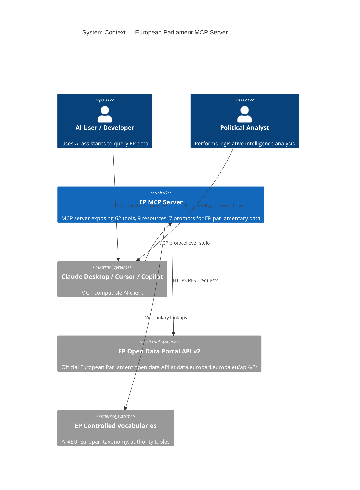
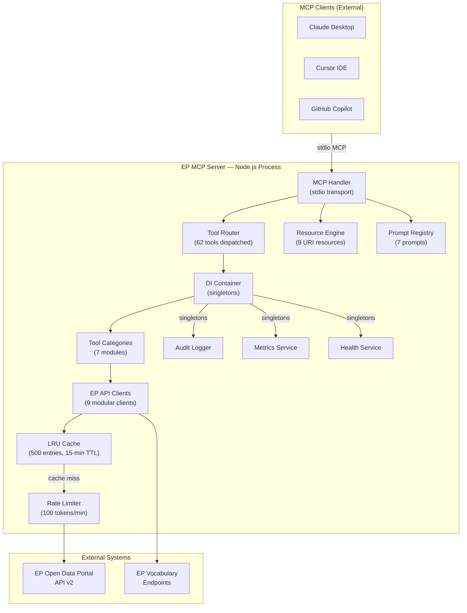
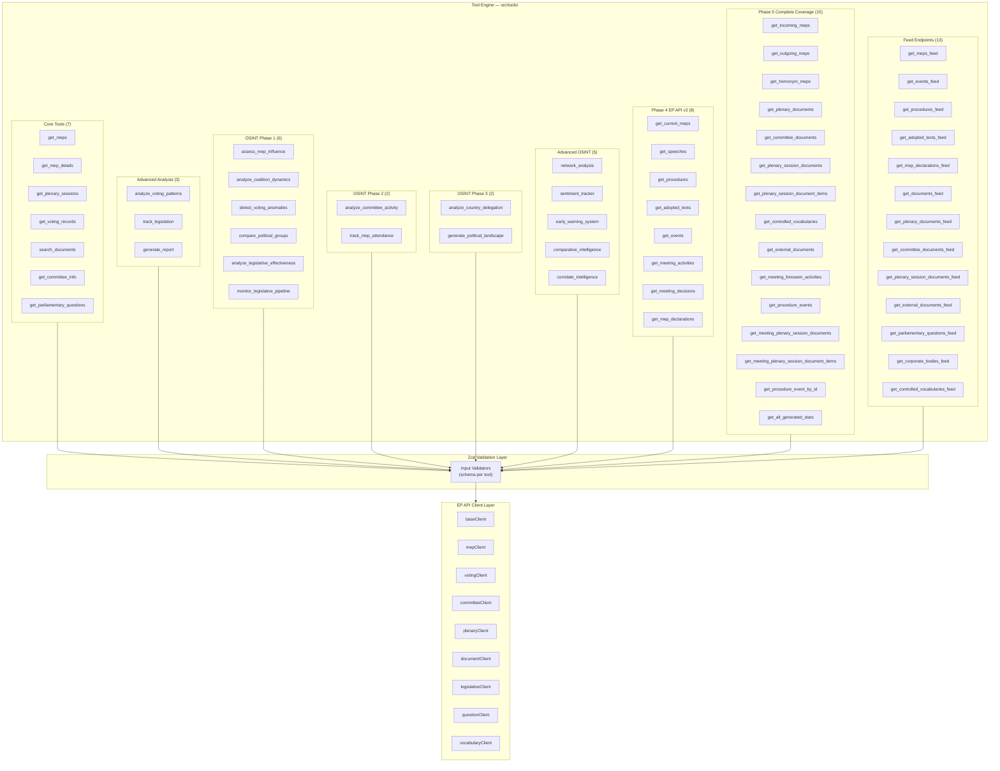
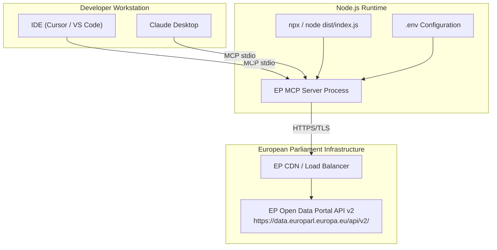
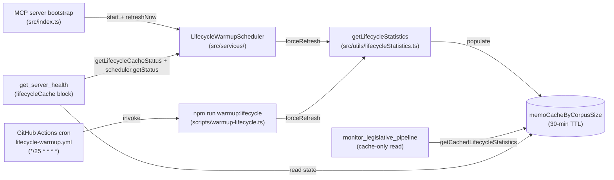

[**European Parliament MCP Server API v1.3.29**](../README.md)

***

[European Parliament MCP Server API](../modules.md) / ARCHITECTURE

<p align="center">
  
</p>

<h1 align="center">🏛️ European Parliament MCP Server — Architecture</h1>

<p align="center">
  <strong>C4 Architecture Model — Context, Container, Component Views</strong><br>
  <em>Comprehensive system design documentation for the European Parliament MCP Server</em>
</p>

<p align="center">
  <a href="#"></a>
  <a href="#"></a>
  <a href="#"></a>
  <a href="#"></a>
  <a href="https://www.bestpractices.dev/projects/12067"></a>
</p>

**📋 Document Owner:** Hack23 | **📄 Version:** 1.2 | **📅 Last Updated:** 2026-04-21 (UTC)
**🔄 Review Cycle:** Quarterly | **⏰ Next Review:** 2026-07-21
**🏷️ Classification:** Public (Open Source MCP Server)
**✅ ISMS Compliance:** ISO 27001 (A.5.1, A.8.1, A.14.2), NIST CSF 2.0 (ID.AM, PR.DS), CIS Controls v8.1 (2.1, 16.1)

---

## 📑 Table of Contents

1. [Security Documentation Map](#security-documentation-map)
2. [Executive Summary](#executive-summary)
3. [C4 Context Diagram](#c4-context-diagram)
4. [C4 Container Diagram](#c4-container-diagram)
5. [C4 Component Diagram — Tool Engine](#c4-component-diagram--tool-engine)
6. [MCP Protocol Surface](#mcp-protocol-surface)
7. [Deployment Architecture](#deployment-architecture)
8. [Technology Stack](#technology-stack)
9. [Architectural Decision Records](#architectural-decision-records)
10. [Security Architecture Summary](#security-architecture-summary)
11. [ISMS Compliance Mapping](#isms-compliance-mapping)

---

## 🗺️ Security Documentation Map

| Document | Current | Future | Description |
|----------|---------|--------|-------------|
| **Architecture** | [ARCHITECTURE.md](./ARCHITECTURE.md) | [FUTURE_ARCHITECTURE.md](../_media/FUTURE_ARCHITECTURE.md) | C4 model, containers, components, ADRs |
| **Security Architecture** | [SECURITY_ARCHITECTURE.md](SECURITY_ARCHITECTURE.md) | [FUTURE_SECURITY_ARCHITECTURE.md](../_media/FUTURE_SECURITY_ARCHITECTURE.md) | Security controls, threat model |
| **Data Model** | [DATA_MODEL.md](DATA_MODEL.md) | [FUTURE_DATA_MODEL.md](../_media/FUTURE_DATA_MODEL.md) | Entity relationships, branded types |
| **Flowchart** | [FLOWCHART.md](../_media/FLOWCHART.md) | [FUTURE_FLOWCHART.md](../_media/FUTURE_FLOWCHART.md) | Business process flows |
| **State Diagram** | [STATEDIAGRAM.md](../_media/STATEDIAGRAM.md) | [FUTURE_STATEDIAGRAM.md](../_media/FUTURE_STATEDIAGRAM.md) | System state transitions |
| **Mind Map** | [MINDMAP.md](../_media/MINDMAP.md) | [FUTURE_MINDMAP.md](../_media/FUTURE_MINDMAP.md) | System concepts and relationships |
| **SWOT Analysis** | [SWOT.md](../_media/SWOT.md) | [FUTURE_SWOT.md](../_media/FUTURE_SWOT.md) | Strategic positioning |
| **Threat Model** | [THREAT_MODEL.md](THREAT_MODEL.md) | [FUTURE_THREAT_MODEL.md](../_media/FUTURE_THREAT_MODEL.md) | STRIDE, MITRE ATT&CK, attack trees |
| **CRA Assessment** | [CRA-ASSESSMENT.md](CRA-ASSESSMENT.md) | — | EU Cyber Resilience Act conformity |

---

## 🎯 Executive Summary

The **European Parliament MCP Server** (v1.2.21) is a TypeScript/Node.js application implementing the **Model Context Protocol (MCP)** to expose structured access to European Parliament datasets. It bridges AI assistants and LLM clients with the EP Open Data Portal API v2, enabling parliamentary intelligence, legislative monitoring, and OSINT analysis workflows.

### Key Capabilities

| Capability | Details |
|------------|---------|
| **MCP Tools** | 62 tools in 6 categories (`core`, `advanced`, `osint`, `phase4`, `phase5`, `feed`) |
| **MCP Resources** | 9 URI-addressable resources |
| **MCP Prompts** | 7 intelligence-analysis prompts |
| **Data Source** | EP Open Data Portal API v2 |
| **Transport** | stdio (MCP standard) |
| **Runtime** | Node.js 26+ / TypeScript 6.0.3 |
| **Security** | 4-layer: Zod → Rate Limiting → Audit Logging → GDPR |

---

## 🌐 C4 Context Diagram



---

## 📦 C4 Container Diagram



---

## 🔧 C4 Component Diagram — Tool Engine



---

## 📡 MCP Protocol Surface

### Tools (62 total)

#### Core Data Access Tools (8)

| Tool | Function | Description |
|------|----------|-------------|
| `get_meps` | `getMEPs` | List MEPs with country/group filters |
| `get_mep_details` | `getMEPDetails` | Detailed MEP profile by ID |
| `get_plenary_sessions` | `getPlenarySessions` | Plenary session listings |
| `get_voting_records` | `getVotingRecords` | Session voting records |
| `search_documents` | `searchDocuments` | Legislative document search |
| `get_committee_info` | `getCommitteeInfo` | Committee details |
| `get_parliamentary_questions` | `getParliamentaryQuestions` | Written/oral questions |
| `get_server_health` | `getServerHealth` | Server health & feed availability diagnostics |

#### OSINT Intelligence Tools (10 + 5 Advanced)

| Tool | Function | Description |
|------|----------|-------------|
| `assess_mep_influence` | `assessMepInfluence` | 5-dimension influence scoring model |
| `analyze_coalition_dynamics` | `analyzeCoalitionDynamics` | Coalition cohesion & stress analysis |
| `detect_voting_anomalies` | `detectVotingAnomalies` | Party defection & anomaly detection |
| `compare_political_groups` | `comparePoliticalGroups` | Cross-group comparative analysis |
| `analyze_legislative_effectiveness` | `analyzeLegislativeEffectiveness` | MEP/committee legislative scoring |
| `monitor_legislative_pipeline` | `monitorLegislativePipeline` | Pipeline status & bottleneck detection |
| `analyze_committee_activity` | `analyzeCommitteeActivity` | Committee workload & engagement |
| `track_mep_attendance` | `trackMepAttendance` | MEP attendance patterns & trends |
| `analyze_country_delegation` | `analyzeCountryDelegation` | Country delegation voting & composition |
| `generate_political_landscape` | `generatePoliticalLandscape` | Parliament-wide political landscape |

#### Advanced OSINT Intelligence Tools (5 — v1.1)

The following five tools extend the OSINT capability with network analysis, sentiment tracking, early-warning signals, comparative intelligence, and cross-source correlation. Each tool returns `confidenceLevel`, `dataFreshness`, `sourceAttribution`, and `methodology` fields for full analytical transparency.

| Tool | Function | Description |
|------|----------|-------------|
| `network_analysis` | `networkAnalysis` | MEP relationship network mapping via committee co-membership. Computes centrality scores, cluster assignments, bridging MEPs, and network density metrics. Identifies informal power structures and cross-party collaboration pathways. |
| `sentiment_tracker` | `sentimentTracker` | Track political group institutional positioning based on seat-share proxy. Returns per-group positioning scores (−1 to +1), polarization index, consensus/divisive topics, and significant positioning shifts. |
| `early_warning_system` | `earlyWarningSystem` | Detect emerging political shifts, coalition fracture signals, and parliamentary stability risks. Generates severity-tiered warnings (CRITICAL/HIGH/MEDIUM/LOW), stability score (0–100), and trend indicators. Configurable sensitivity and focus area. |
| `comparative_intelligence` | `comparativeIntelligence` | Cross-reference 2–10 MEPs across voting, committee, legislative, and attendance dimensions. Returns ranked profiles, cosine-similarity correlation matrix, z-score outlier detection, and natural cluster analysis. |
| `correlate_intelligence` | `correlateIntelligence` | Cross-source intelligence correlation combining multiple data dimensions. Identifies patterns across voting, committee, and legislative activity for comprehensive analytical insights. |

**Design Principles for Advanced Tools:**
- All outputs include `dataAvailable: boolean` — tools degrade gracefully when EP API data is limited
- `confidenceLevel: 'HIGH' | 'MEDIUM' | 'LOW'` reflects data completeness at execution time
- `dataFreshness` and `sourceAttribution` provide full data provenance for OSINT analysis
- `methodology` documents the analytical approach for reproducibility and audit
- `dataQualityWarnings: string[]` surfaces data limitations and proxy metrics to end users
- Input validation via Zod schemas with `.refine()` cross-field constraints and strict typing throughout
- Standardized error handling via `ToolError` (toolName, operation, isRetryable) and `buildToolResponse()` for consistent response building

**Contract enforcement:** All 15 OSINT tools are validated against the shared envelope by a registry-driven contract suite at [`tests/integration/osint/contract.test.ts`](../_media/contract.test.ts). The suite drives off `getToolMetadataArray().filter(t => t.category === 'osint')`, parses every response against [`OsintStandardOutputSchema`](../schemas/ep/analysis/README.md), and enforces the **no-silent-zero policy** (numeric fields must never be silently zero when data is unavailable — a `dataQualityWarnings` entry must explain the unavailability) plus a determinism guard. See `INTEGRATION_TESTING.md` § "OSINT QA Harness".

**Regression detection — golden snapshots:** Beyond the envelope contract, every OSINT tool has per-tool golden snapshots at [`tests/integration/osint/__snapshots__/<tool>.<variant>.json`](../_media/__snapshots__) (`empty-path` + `hot-path` variants — 30 snapshots total) driven by the shared fixture factory at [`tests/fixtures/osint/index.ts`](../_media/index.ts). The snapshot suite ([`tests/integration/osint/snapshots.test.ts`](../_media/snapshots.test.ts)) is the regression-detection point for OSINT scoring weights, classification thresholds, alignment buckets and attribution lists — any methodology change that moves a numeric value or re-orders a ranked list produces a reviewer-visible JSON diff. Refresh procedure and reviewer acknowledgement: see `CONTRIBUTING.md` § "Refreshing OSINT golden snapshots".

**Test-quality enforcement (defence in depth):** Structural contracts catch envelope drift but not logic regressions in scoring/anomaly methodology. The dedicated [`osint-qa.yml`](../_media/osint-qa.yml) CI workflow runs three sequential jobs on every PR touching OSINT surface area: (1) the contract suite above, (2) a per-file coverage gate (non-DOCEO tools: lines ≥90/branches ≥78/functions ≥90/statements ≥88; DOCEO-touching tools: lines ≥92/branches ≥78/functions ≥95/statements ≥90 — `assessMepInfluence`, `detectVotingAnomalies`, `sentimentTracker`, `networkAnalysis`, `analyzeCoalitionDynamics` — configured in `vitest.config.ts:thresholds`), and (3) [Stryker](https://stryker-mutator.io/) mutation testing scoped via [`stryker.config.json`](../_media/stryker.config.json) to the same 15 OSINT tool files plus their seven shared utilities. Mutation testing is the test-quality enforcement point that prevents silently-broken assertions in the OSINT correctness surface. See `INTEGRATION_TESTING.md` § "Mutation testing (Stryker)" and `CONTRIBUTING.md` § "Mutation testing (OSINT)".

#### EP Data Access Tools (8)

| Tool | Function | Description |
|------|----------|-------------|
| `get_current_meps` | `getCurrentMEPs` | Currently serving MEPs |
| `get_speeches` | `getSpeeches` | Plenary speeches |
| `get_procedures` | `getProcedures` | Legislative procedures |
| `get_adopted_texts` | `getAdoptedTexts` | Adopted legislative texts |
| `get_events` | `getEvents` | Parliamentary events |
| `get_meeting_activities` | `getMeetingActivities` | Meeting activity records |
| `get_meeting_decisions` | `getMeetingDecisions` | Meeting decision outcomes |
| `get_mep_declarations` | `getMEPDeclarations` | MEP financial declarations |

#### EP Complete Coverage Tools (15)

| Tool | Function | Description |
|------|----------|-------------|
| `get_incoming_meps` | `getIncomingMEPs` | Incoming MEPs (new members) |
| `get_outgoing_meps` | `getOutgoingMEPs` | Outgoing MEPs (departing members) |
| `get_homonym_meps` | `getHomonymMEPs` | MEPs with duplicate names |
| `get_plenary_documents` | `getPlenaryDocuments` | Plenary-specific documents |
| `get_committee_documents` | `getCommitteeDocuments` | Committee-specific documents |
| `get_plenary_session_documents` | `getPlenarySessionDocuments` | Session-specific documents |
| `get_plenary_session_document_items` | `getPlenarySessionDocumentItems` | Document items within sessions |
| `get_controlled_vocabularies` | `getControlledVocabularies` | EP controlled vocabulary terms |
| `get_external_documents` | `getExternalDocuments` | External reference documents |
| `get_meeting_foreseen_activities` | `getMeetingForeseenActivities` | Planned meeting activities |
| `get_procedure_events` | `getProcedureEvents` | Events linked to a procedure |
| `get_meeting_plenary_session_documents` | `getMeetingPlenarySessionDocuments` | Plenary session documents for a meeting |
| `get_meeting_plenary_session_document_items` | `getMeetingPlenarySessionDocumentItems` | Plenary session document items for a meeting |
| `get_procedure_event_by_id` | `getProcedureEventById` | Get a specific procedure event by ID |
| `get_all_generated_stats` | `getAllGeneratedStats` | Precomputed parliamentary analytics |

#### Advanced Analysis Tools (3)

| Tool | Function | Description |
|------|----------|-------------|
| `analyze_voting_patterns` | `analyzeVotingPatterns` | Multi-session voting analysis |
| `track_legislation` | `trackLegislation` | End-to-end legislative tracking (real EP API data) |
| `generate_report` | `generateReport` | Structured analysis report generation |

#### Feed Endpoint Tools (13)

| Tool | Function | Description |
|------|----------|-------------|
| `get_meps_feed` | `getMEPsFeed` | Atom feed of MEP updates |
| `get_events_feed` | `getEventsFeed` | Atom feed of parliamentary events |
| `get_procedures_feed` | `getProceduresFeed` | Atom feed of legislative procedures |
| `get_adopted_texts_feed` | `getAdoptedTextsFeed` | Atom feed of adopted texts |
| `get_mep_declarations_feed` | `getMEPDeclarationsFeed` | Atom feed of MEP declarations |
| `get_documents_feed` | `getDocumentsFeed` | Atom feed of parliamentary documents |
| `get_plenary_documents_feed` | `getPlenaryDocumentsFeed` | Atom feed of plenary documents |
| `get_committee_documents_feed` | `getCommitteeDocumentsFeed` | Atom feed of committee documents |
| `get_plenary_session_documents_feed` | `getPlenarySessionDocumentsFeed` | Atom feed of plenary session documents |
| `get_external_documents_feed` | `getExternalDocumentsFeed` | Atom feed of external documents |
| `get_parliamentary_questions_feed` | `getParliamentaryQuestionsFeed` | Atom feed of parliamentary questions |
| `get_corporate_bodies_feed` | `getCorporateBodiesFeed` | Atom feed of corporate bodies |
| `get_controlled_vocabularies_feed` | `getControlledVocabulariesFeed` | Atom feed of controlled vocabularies |

### Tool Category Summary

| Category | Count | Tools |
|----------|-------|-------|
| **Core** | 8 | get_meps, get_mep_details, get_plenary_sessions, get_voting_records, search_documents, get_committee_info, get_parliamentary_questions, get_server_health |
| **Advanced Analysis** | 3 | analyze_voting_patterns, track_legislation, generate_report |
| **OSINT Phase 1** | 6 | assess_mep_influence, analyze_coalition_dynamics, detect_voting_anomalies, compare_political_groups, analyze_legislative_effectiveness, monitor_legislative_pipeline |
| **OSINT Phase 2** | 2 | analyze_committee_activity, track_mep_attendance |
| **OSINT Phase 3** | 2 | analyze_country_delegation, generate_political_landscape |
| **Advanced OSINT** | 5 | network_analysis, sentiment_tracker, early_warning_system, comparative_intelligence, correlate_intelligence |
| **Phase 4 EP API v2** | 8 | get_current_meps, get_speeches, get_procedures, get_adopted_texts, get_events, get_meeting_activities, get_meeting_decisions, get_mep_declarations |
| **Phase 5 Complete Coverage** | 15 | get_incoming_meps, get_outgoing_meps, get_homonym_meps, get_plenary_documents, get_committee_documents, get_plenary_session_documents, get_plenary_session_document_items, get_controlled_vocabularies, get_external_documents, get_meeting_foreseen_activities, get_procedure_events, get_meeting_plenary_session_documents, get_meeting_plenary_session_document_items, get_procedure_event_by_id, get_all_generated_stats |
| **Feed Endpoints** | 13 | get_meps_feed, get_events_feed, get_procedures_feed, get_adopted_texts_feed, get_mep_declarations_feed, get_documents_feed, get_plenary_documents_feed, get_committee_documents_feed, get_plenary_session_documents_feed, get_external_documents_feed, get_parliamentary_questions_feed, get_corporate_bodies_feed, get_controlled_vocabularies_feed |
| **Total** | **62** | |

### Resources (9 total)

| URI Pattern | Description |
|-------------|-------------|
| `ep://meps` | List of all current MEPs |
| `ep://meps/{id}` | Individual MEP details by ID |
| `ep://committees/{id}` | Committee details by ID |
| `ep://plenary-sessions` | Plenary session listing |
| `ep://votes/{id}` | Vote record by ID |
| `ep://political-groups` | Political group listing |
| `ep://procedures/{id}` | Legislative procedure by ID |
| `ep://plenary/{id}` | Plenary session by ID |
| `ep://documents/{id}` | Parliamentary document by ID |

### Prompts (7 total)

| Prompt Name | Purpose |
|-------------|---------|
| `mep_briefing` | Generate comprehensive MEP profile briefing |
| `coalition_analysis` | Analyze political coalition dynamics |
| `legislative_tracking` | Track legislative procedure progress |
| `political_group_comparison` | Compare political groups on key metrics |
| `committee_activity_report` | Summarize committee work and outputs |
| `voting_pattern_analysis` | Analyze MEP or group voting patterns |
| `country_delegation_analysis` | Analyze national delegation composition |

---

## 🚀 Deployment Architecture



**Deployment Modes:**
- **Local stdio**: Primary mode — spawned by MCP client as subprocess
- **npm package**: Distributed via npm for easy installation
- **Docker**: Optional containerized deployment for CI/CD

---

## 🛠️ Technology Stack

| Layer | Technology | Version | Purpose |
|-------|-----------|---------|---------|
| **Runtime** | Node.js | 26+ | Server runtime |
| **Language** | TypeScript | 6.0.3 | Type-safe implementation |
| **MCP SDK** | @modelcontextprotocol/sdk | 1.29.0 | MCP protocol implementation |
| **Validation** | Zod | 4.4.3 | Runtime schema validation and branded types |
| **HTTP Client** | undici | 8.2.0 | Fast HTTP/1.1 client for EP API requests |
| **Caching** | lru-cache | 11.3.6 | LRU cache (500 entries, 15-min TTL) |
| **Testing** | Vitest | latest | Unit and integration testing |
| **Linting** | ESLint | 10.3.0 | Code quality enforcement |
| **Unused Detection** | Knip | latest | Dead code detection |
| **Build** | tsc | 6.0.3 | TypeScript compilation |
| **Package Manager** | npm | 10.x | Dependency management |

---

## 📊 Data Quality Management

All OSINT intelligence tools implement a cross-cutting data quality framework that ensures analytical transparency and reliability. This is a key improvement introduced in v1.1 to provide explicit signals about data completeness and confidence.

### Data Quality Components

| Component | Type | Purpose |
|-----------|------|---------|
| `DataAvailability` | Enum | `AVAILABLE`, `PARTIAL`, `ESTIMATED`, `UNAVAILABLE` — status of underlying EP API data |
| `dataQualityWarnings` | `string[]` | Array of human-readable warnings flagging data limitations, proxy metrics, or unavailable sources |
| `confidenceLevel` | Enum | `HIGH`, `MEDIUM`, `LOW` — confidence in computed value based on actual data availability |
| `MetricResult<T>` | Generic wrapper | Wraps metric value with `availability`, `confidence`, `source`, and optional `reason` fields |

### MetricResult Wrapper Pattern

```typescript
interface MetricResult<T = number> {
  value: T | null;                      // Computed value, or null when unavailable
  availability: DataAvailability;       // AVAILABLE | PARTIAL | ESTIMATED | UNAVAILABLE
  confidence: 'HIGH' | 'MEDIUM' | 'LOW' | 'NONE';
  source?: string;                      // Human-readable data source description
  reason?: string;                      // Explanation for unavailable/estimated data
}
```

### Standardized Error Handling

All tool handlers use the `ToolError` class for structured error reporting and `buildToolResponse()` for consistent success responses:

```typescript
// ToolError — structured error with retryability signal
class ToolError extends Error {
  readonly toolName: string;
  readonly operation: string;
  readonly isRetryable: boolean;
  readonly cause?: Error;
}

// buildToolResponse — standard JSON response wrapper
function buildToolResponse(data: unknown): ToolResult {
  return { content: [{ type: 'text', text: JSON.stringify(data, null, 2) }] };
}
```

---

## 📐 Architectural Decision Records

### ADR-001: Dependency Injection Container Pattern

**Status:** Accepted | **Date:** 2026-02-26

**Context:** Multiple services (RateLimiter, MetricsService, AuditLogger, HealthService) need to be shared across the 62 tool handlers. Using ad-hoc singleton globals creates tight coupling and reduces testability.

**Decision:** Implement a lightweight DI container that manages singleton lifecycle for all shared services. Services are registered once at startup and injected into tool handlers via constructor injection.

**Consequences:**
- ✅ Improved testability — services can be mocked in tests
- ✅ Clear dependency graph
- ✅ Single initialization point for monitoring setup
- ⚠️ Minor startup overhead for container initialization

**Registered Singletons:** `RateLimiter`, `MetricsService`, `AuditLogger`, `HealthService`

---

### ADR-002: Branded Types via Zod

**Status:** Accepted | **Date:** 2026-02-26

**Context:** EP API identifiers (procedure IDs, MEP IDs, country codes, dates) are structurally strings or numbers but carry semantic constraints. Using plain primitives allows incorrect values to flow through the system silently.

**Decision:** Use Zod's `.brand()` feature to create branded types for all EP domain identifiers. This enforces correct formats at both compile time (TypeScript) and runtime (Zod parse).

**Key Branded Types:**
- `ProcedureID` — format `YYYY/NNNN(TYPE)`, e.g., `2024/0001(COD)`
- `CountryCode` — ISO 3166-1 alpha-2, e.g., `DE`, `FR`
- `DateString` — ISO 8601 format `YYYY-MM-DD`
- `MEP_ID` — positive integer identifier

**Consequences:**
- ✅ Runtime type safety for all EP identifiers
- ✅ Validation errors surface at system boundary
- ✅ TypeScript prevents passing wrong identifier types
- ⚠️ Slightly more verbose schema definitions

---

### ADR-003: LRU Cache Strategy

**Status:** Accepted | **Date:** 2026-02-26

**Context:** The EP Open Data Portal API v2 has rate limits and non-trivial latency. Parliamentary data (MEP lists, committee info, plenary schedules) changes infrequently. Repeated calls for the same data waste API quota.

**Decision:** Implement a shared LRU cache with 500 maximum entries and 15-minute TTL. All EP API client modules share a single cache instance registered in the DI container.

**Cache Configuration:**
```
max: 500 entries
ttl: 900,000 ms (15 minutes)
allowStale: false
updateAgeOnGet: false
```

**Cache Key Pattern:** `{clientName}:{endpoint}:{sortedParams}`

**Consequences:**
- ✅ Reduced EP API calls by ~70% for repeated queries
- ✅ Sub-millisecond response for cache hits
- ✅ Respects EP API rate limits
- ⚠️ 15-minute staleness acceptable for parliamentary data

---

### ADR-004: Zod Validation-First Approach

**Status:** Accepted | **Date:** 2026-02-26

**Context:** MCP tool handlers receive untyped `args` from AI clients. Without validation, malformed inputs can cause cryptic errors, security vulnerabilities, or corrupted API calls to the EP API.

**Decision:** Every tool handler validates its input schema using Zod **before** any business logic executes. Validation failures return structured MCP error responses immediately.

**Validation Pipeline:**
```
MCP args (unknown) → Zod.parse() → typed input → EP API call
                         ↓ (on failure)
                    ZodError → MCP error response
```

**Consequences:**
- ✅ Type-safe handler implementations
- ✅ Clear error messages for AI clients
- ✅ Security: malformed inputs rejected at boundary
- ✅ Eliminates defensive null-checks in business logic

---

### ADR-005: Data Quality Signaling for OSINT Outputs

**Status:** Accepted | **Date:** 2026-04-01

**Context:** OSINT intelligence tools (assess_mep_influence, analyze_coalition_dynamics, etc.) compute analytical metrics from EP API data. However, the EP API does not expose all data needed for every metric (e.g., voting statistics are unavailable per MEP). Without explicit signaling, consumers cannot distinguish between "metric is zero" and "metric is unavailable."

**Decision:** Introduce a data quality framework across all OSINT tools:
- `DataAvailability` enum (`AVAILABLE`, `PARTIAL`, `ESTIMATED`, `UNAVAILABLE`) for every metric
- `dataQualityWarnings: string[]` on every OSINT output to surface data limitations
- `MetricResult<T>` generic wrapper with `value`, `availability`, `confidence`, and `source`
- Confidence levels computed from a combination of data availability and heuristic volume/coverage thresholds

**Consequences:**
- ✅ Consumers can distinguish "zero" from "unavailable" for all metrics
- ✅ Proxy metrics are explicitly labeled as `ESTIMATED`
- ✅ Data limitations are surfaced to end users via warnings array
- ✅ Analytical transparency meets ISMS A.8.11 (data integrity) requirements
- ⚠️ Slightly larger response payloads due to quality metadata

---

### ADR-006: Shared DOCEO RCV aggregator for per-MEP voting metrics

**Status:** Accepted | **Date:** 2026-05-18

**Context:** `MEPDetails.votingStatistics` from the EP Open Data API is a
placeholder that frequently returns zeros, producing zero-valued OSINT
metrics (loyalty, participation, coalition-building) for active MEPs. The
DOCEO XML source already used by `analyze_coalition_dynamics` and
`get_latest_votes` exposes real per-MEP RCV positions and political-group
breakdowns.

**Decision:** Introduce a shared utility `src/utils/doceoMepAggregator.ts`
exposing `computeMepVotingActivityFromDoceo(mepId, options)` that:
- aggregates per-MEP `totalVotes` / `votesFor` / `votesAgainst` / `abstentions`
- computes a real `loyaltyScore` from group-majority alignment
- is bounded by `withTimeoutAndAbort` (default 2 s)
- caches results for 5 minutes keyed by `${mepId}|${dateFrom}|${dateTo}`
- returns `null` on any failure so callers can degrade gracefully

OSINT tools that consume the aggregator surface a `dataSource: 'EP_API' |
'DOCEO' | 'EP_API+DOCEO'` field in their response envelope and emit a
`dataQualityWarning` when DOCEO is unreachable.

**Consequences:**
- ✅ Real per-MEP voting metrics replace placeholder zeros for active MEPs
- ✅ Single shared aggregator avoids duplicating DOCEO orchestration across tools
- ✅ Graceful degradation: tool always returns a valid response even when DOCEO is down
- ✅ Confidence levels are now grounded in observed RCV count, not placeholder counts

---

### ADR-007: Graph Algorithms for `network_analysis`

**Status:** Accepted (2026-05) — implemented in `src/utils/graphAlgorithms.ts`
and `src/utils/networkVotingSimilarity.ts`.

**Context:** The original `network_analysis` echoed the `analysisType` and
`depth` parameters back without applying them, and used a placeholder for
clusters/centrality. With DOCEO RCV now available, voting-similarity edges
and depth-bounded ego-network traversal are feasible and unlock richer
OSINT (cross-party brokers, hidden coalitions).

**Decision:** Introduce a pure deterministic graph-algorithms utility
(`src/utils/graphAlgorithms.ts`) exposing:
- `buildAdjacency`, `bfsLimited` — adjacency map + depth-bounded BFS
- `weightedDegree` — weighted-degree centrality
- `betweennessCentrality` — Brandes' algorithm on weighted graphs
  (similarity → distance via `1/weight`, normalised undirected)
- `labelPropagation`, `modularity` — deterministic community detection +
  Newman Q

Plus a DOCEO helper `src/utils/networkVotingSimilarity.ts` exposing
`computeNetworkVotingSimilarityFromDoceo(mepIdSubset, { minSimilarity })`
that emits Jaccard-like agreement edges over decisive RCVs only.

**Consequences:**
- ✅ `analysisType: committee|voting|combined` and `depth: 1-3` are now
  fully functional (no longer echoed)
- ✅ New `minSimilarity` schema parameter (default 0.7) for the voting
  threshold
- ✅ Reproducible OSINT: deterministic ordering + tie-breaking guarantees
  identical clusters/centralities across runs
- ✅ Reusable utility — the same algorithms can power future tools
  (e.g. `comparative_intelligence` cross-references)

---

## 🔒 Security Architecture Summary

The server implements a **4-layer security architecture**:

1. **Layer 1 — Zod Validation**: All tool inputs validated against strict schemas before processing
2. **Layer 2 — Rate Limiting**: Token bucket algorithm, 100 tokens/minute, prevents EP API abuse
3. **Layer 3 — Audit Logging**: All tool invocations logged with parameters (PII-stripped) for compliance
4. **Layer 4 — GDPR Compliance**: MEP personal data handled with data minimization and purpose limitation

See [SECURITY_ARCHITECTURE.md](SECURITY_ARCHITECTURE.md) for full details. For OWASP LLM Top 10 (2025) mapping and MCP-protocol-specific threat analysis, see [THREAT_MODEL.md](THREAT_MODEL.md).

---

## ⏱️ Lifecycle-Statistics Cache Warmup

`monitor_legislative_pipeline` reads the corpus-wide lifecycle-statistics
model from cache only on the request path (rebuilding the corpus inline
would race the request's own rate-limited `/events` fan-out and degrade
to a timeout envelope). To keep the 30-minute cache from ever expiring,
the server runs an out-of-band warmup scheduler.



**Mechanics:**

- The bootstrap (`src/index.ts`) calls `lifecycleWarmupScheduler.refreshNow()`
  to prime the cache after the MCP transport binds, then starts the
  periodic `setInterval` (`unref()`'d so it never blocks exit).
- The interval defaults to **25 minutes** (5 minutes shy of the
  `CACHE_TTL_MS`). Operators can override via
  `EP_LIFECYCLE_WARMUP_INTERVAL_MS`, clamped to `[60_000, 3_600_000]`.
- Concurrent calls share the existing in-flight mutex inside
  `getLifecycleStatistics`, so a warmup tick that overlaps with a
  request-path build never doubles the EP-API load.
- Failures are logged but non-fatal; the scheduler keeps firing on the
  next tick. The most recent failure timestamp is exposed via
  `get_server_health.lifecycleCache.lastRefreshErrorAt`.
- For ephemeral / container deployments, the GitHub Actions workflow
  `.github/workflows/lifecycle-warmup.yml` (cron `*/25 * * * *`) and the
  `npm run warmup:lifecycle` CLI script (`scripts/warmup-lifecycle.ts`)
  provide external priming with the same audit-log surface.
- Unit tests pass `{ disable: true }` to `start()` to opt out of the
  background timer and stay hermetic.

When a request lands before the first warmup completes,
`monitor_legislative_pipeline` returns an `INSUFFICIENT_DATA` forecast
*and* a `dataQualityWarnings` entry pointing consumers at
`get_server_health.lifecycleCache` so the cold-start condition is
observable rather than silent.

ISMS references: A.8.16 (Monitoring activities), A.8.32 (Change
management), AU-002 (Audit Logging), SC-002 (Input Validation),
AC-003 (Least Privilege).

---

## ✅ ISMS Compliance Mapping

| Control | Standard | Clause | Implementation |
|---------|----------|--------|----------------|
| Asset Management | ISO 27001 | A.8.1 | All 62 tools documented as information assets |
| Secure Development | ISO 27001 | A.14.2 | TypeScript strict mode, Zod validation, ESLint |
| Access Control | ISO 27001 | A.9.1 | MCP stdio transport, no network exposure |
| Audit Logging | ISO 27001 | A.12.4 | AuditLogger singleton, all invocations logged |
| Data Protection | GDPR | Art. 5 | Data minimization in all MEP queries |
| Identify: Assets | NIST CSF 2.0 | ID.AM | Component and tool inventory maintained |
| Protect: Data | NIST CSF 2.0 | PR.DS | Encryption in transit (HTTPS to EP API) |
| Software Inventory | CIS Controls v8.1 | 2.1 | package.json, SBOM via npm |
| Secure Config | CIS Controls v8.1 | 16.1 | TypeScript strict, no dangerous defaults |

---

## 🛑 Cancellation Contract (Client Layer)

Every method on `EuropeanParliamentClient` and its underlying typed clients
(`mepClient`, `plenaryClient`, `votingClient`, `documentClient`,
`legislativeClient`, `questionClient`, `vocabularyClient`, `committeeClient`,
`doceoClient`) accepts an **optional** `abortSignal?: AbortSignal`. Inside
`BaseEPClient.get()` the external signal is composed with the per-request
timeout controller via `createLinkedAbortController()` so that:

- **Pre-request**: an already-aborted signal short-circuits to `APIError(0)`
  *before* any rate-limiter token or cache slot is consumed; no `fetch` is
  issued. The abort is audit-logged with `phase: 'pre-request'`.
- **In-flight**: aborting mid-flight cancels the underlying `undici` `fetch`
  via the linked controller, surfaces a typed `APIError('… aborted', 0,
  { cause: signal.reason })`, and is audit-logged with `phase: 'in-flight'`.
- **No retry on abort**: aborted requests are never retried, even when
  `enableRetry: true`.
- **Listener hygiene**: `cleanup()` removes the external-signal listener in a
  `finally` block to prevent leaks on long-lived OSINT budget signals.

This contract unlocks **pre-emptive cancellation** across every OSINT tool
that wraps its work in `withTimeoutAndAbort` — a single slow EP endpoint can
no longer pin its per-source budget past expiry and starve sibling fan-out
sources.

**Backward compatibility**: `abortSignal` is optional everywhere; callers
that omit it observe identical behaviour to the prior cooperative
`throwIfAborted` pattern.

---

*See [FUTURE_ARCHITECTURE.md](../_media/FUTURE_ARCHITECTURE.md) for the architectural evolution roadmap.*
