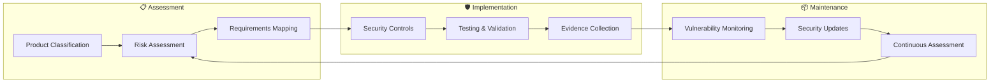

[**European Parliament MCP Server API v1.2.6**](../README.md)

***

[European Parliament MCP Server API](../modules.md) / CRA-ASSESSMENT

  

<h1 align="center">🛡️ European Parliament MCP Server — CRA Conformity Assessment</h1>

  <strong>Evidence-Driven Conformity Through Systematic Assessment</strong> 
  <em>Demonstrating CRA Compliance Excellence for Open Source MCP Server</em>

  
  
  
  
  

**📋 Document Owner:** CEO | **📄 Version:** 1.1 | **📅 Last Updated:** 2026-03-19 (UTC)
**🔄 Review Cycle:** Quarterly | **⏰ Next Review:** 2026-06-19
**🏷️ Classification:** Public (Open Source MCP Server)
**✅ ISMS Compliance:** ISO 27001 (A.14.2), NIST CSF 2.0 (PR.DS, ID.SC), CIS Controls v8.1 (16.1)

---

## 📑 Table of Contents

- [Purpose Statement](#-purpose-statement)
- [Project Identification](#-project-identification)
- [CRA Scope & Classification](#-cra-scope--classification)
- [Technical Documentation](#-technical-documentation)
- [Risk Assessment](#-risk-assessment)
- [Essential Cybersecurity Requirements](#-essential-cybersecurity-requirements)
- [Conformity Assessment Evidence](#-conformity-assessment-evidence)
- [Vulnerability Disclosure](#-vulnerability-disclosure)
- [Reference Implementations](#-reference-implementations)
- [Policy Alignment](#-policy-alignment)
- [Related Documents](#-related-documents)

---

## 🗺️ Security Documentation Map

> **Where this document fits** in the security documentation portfolio:

| Document | Focus | Link |
|----------|-------|------|
| **SECURITY.md** | Vulnerability reporting & security policy | [View](SECURITY.md) |
| **SECURITY_ARCHITECTURE.md** | Current security controls & design | [View](SECURITY_ARCHITECTURE.md) |
| **THREAT_MODEL.md** | STRIDE analysis & threat scenarios | [View](THREAT_MODEL.md) |
| **🛡️ CRA-ASSESSMENT.md** | **← You are here** — CRA conformity assessment | [View](CRA-ASSESSMENT.md) |
| **SECURITY_HEADERS.md** | HTTP security headers implementation | [View](SECURITY_HEADERS.md) |
| **BCPPlan.md** | Business continuity & disaster recovery | [View](../_media/BCPPlan.md) |
| **FinancialSecurityPlan.md** | Security investment strategy | [View](../_media/FinancialSecurityPlan.md) |

---

## 🎯 Purpose Statement

**Hack23 AB's** CRA conformity assessment demonstrates how **systematic regulatory compliance directly enables business growth rather than creating operational burden.** Our comprehensive assessment framework serves as both operational tool and client demonstration of our cybersecurity consulting methodologies.

This assessment documents the European Parliament MCP Server's conformity with the EU Cyber Resilience Act (CRA), providing evidence-based compliance verification for open-source software distribution via npm. The assessment follows the [CRA Conformity Assessment Process](https://github.com/Hack23/ISMS-PUBLIC/blob/main/CRA_Conformity_Assessment_Process.md) template.

*— James Pether Sörling, CEO/Founder*

---

## 1️⃣ Project Identification

*Supports CRA Annex V § 1 — Product Description Requirements*

| Field | Value |
|-------|-------|
| 📦 Product | European Parliament MCP Server |
| 🏷️ Version Tag | v1.1.13 (reflects current project state) |
| 🔗 Repository | <https://github.com/Hack23/European-Parliament-MCP-Server> |
| 📧 Security Contact | security@hack23.org |
| 🎯 Purpose | MCP server providing AI assistants with structured access to European Parliament open datasets (MEPs, plenary sessions, committees, legislative documents, parliamentary questions) via 62 tools, 9 resources, and 7 prompts |
| 🏪 Market | Open Source |

### 🏪 Market Category:

### 🛡️ Confidentiality Level:
 Open source, processes only public European Parliament data

### ✅ Integrity Level:
 Parliamentary data accuracy important for political analysis

### ⏱️ Availability Level:
 Tolerates brief outages; local stdio transport

### 🕐 Recovery Time Objective:
[-lightgrey?style=flat-square)](https://github.com/Hack23/ISMS-PUBLIC/blob/main/CLASSIFICATION.md#rto-classifications) npm reinstallation restores service

### 🔄 Recovery Point Objective:
[-lightgrey?style=flat-square)](https://github.com/Hack23/ISMS-PUBLIC/blob/main/CLASSIFICATION.md#rpo-classifications) No persistent state; source-of-truth is EP Open Data API

---

## 2️⃣ CRA Scope & Classification

*Supports CRA Article 6 — Scope and Article 7 — Product Classification Assessment*

### 🏢 CRA Applicability:

### 🌐 Distribution Method:
 Published via npm registry; source on GitHub

### 📋 CRA Classification:
 Self-assessment approach

**📝 CRA Scope Justification:** The European Parliament MCP Server is a non-commercial open-source tool distributed via npm that processes publicly available European Parliament data. It does not handle critical infrastructure, cryptographic functions, or safety-critical operations. As a standard-classification product, self-assessment is the appropriate conformity route.

**🔍 Classification Impact:**
- **Standard:** Self-assessment approach (this document supports the documentation requirement)
- No notified body assessment required
- Evidence maintained through automated CI/CD and public badges

### **📊 CRA Compliance Lifecycle**

---

## 3️⃣ Technical Documentation

*Supports CRA Annex V § 2 — Technical Documentation Requirements*

| 🏗️ CRA Technical Area | 📝 Implementation Summary | 📋 Evidence Location |
|----------------------|-------------------------|---------------------|
| 🎨 **Product Architecture** *(Annex V § 2.1)* | C4 model with Context, Container, Component views; Mermaid diagrams | [ARCHITECTURE.md](ARCHITECTURE.md), [ARCHITECTURE_DIAGRAMS.md](../_media/ARCHITECTURE_DIAGRAMS.md) |
| 📦 **SBOM & Components** *(Annex I § 1.1)* | CycloneDX SBOM generation per release; npm dependency tree | [docs/SBOM.md](../_media/SBOM.md), GitHub Release artifacts |
| 🔐 **Cybersecurity Controls** *(Annex I § 1.2)* | 4-layer security: Zod validation → rate limiting → audit logging → GDPR compliance | [SECURITY_ARCHITECTURE.md](SECURITY_ARCHITECTURE.md) |
| 🛡️ **Supply Chain Security** *(Annex I § 1.3)* | SLSA Level 3 build provenance, npm provenance, Dependabot | [GitHub Attestations](https://github.com/Hack23/European-Parliament-MCP-Server/attestations) |
| 🔄 **Update Mechanism** *(Annex I § 1.4)* | npm update mechanism with semantic versioning | [CHANGELOG.md](../_media/CHANGELOG.md) |
| 📊 **Security Monitoring** *(Annex I § 1.5)* | CodeQL analysis, OpenSSF Scorecard, Dependabot alerts | [.github/workflows/](https://github.com/Hack23/European-Parliament-MCP-Server/tree/main/.github/workflows) |
| 🏷️ **Data Protection** *(Annex I § 2.1)* | Public data only, no PII storage, GDPR compliance | [SECURITY_ARCHITECTURE.md](SECURITY_ARCHITECTURE.md) |
| 📚 **User Guidance** *(Annex I § 2.2)* | Comprehensive documentation portal, API guide, deployment guide | [README.md](../modules.md), [API_USAGE_GUIDE.md](API_USAGE_GUIDE.md), [DEPLOYMENT_GUIDE.md](DEPLOYMENT_GUIDE.md) |
| 🔍 **Vulnerability Disclosure** *(Annex I § 2.3)* | Coordinated disclosure via SECURITY.md, GitHub Security Advisories | [SECURITY.md](SECURITY.md) |

**📋 ISMS Policy Integration:**
- **🏗️ Architecture & Design:** Implementation aligned with [🔐 Information Security Policy](https://github.com/Hack23/ISMS-PUBLIC/blob/main/Information_Security_Policy.md)
- **📦 Asset Management:** All 62 tools + 9 resources documented in [ARCHITECTURE.md](ARCHITECTURE.md)
- **🔒 Encryption Standards:** HTTPS-only EP API communication per [🔒 Cryptography Policy](https://github.com/Hack23/ISMS-PUBLIC/blob/main/Cryptography_Policy.md)
- **🌐 Network Security:** stdio transport (no network listener) per [🌐 Network Security Policy](https://github.com/Hack23/ISMS-PUBLIC/blob/main/Network_Security_Policy.md)

---

## 4️⃣ Risk Assessment

*Supports CRA Annex V § 3 — Risk Assessment Documentation*

Reference: [📊 Risk Assessment Methodology](https://github.com/Hack23/ISMS-PUBLIC/blob/main/Risk_Assessment_Methodology.md) and [⚠️ Risk Register](https://github.com/Hack23/ISMS-PUBLIC/blob/main/Risk_Register.md)

| 🚨 **CRA Risk Category** | 🎯 Asset | 📊 Likelihood | 💥 Impact (C/I/A) | 🛡️ CRA Control Implementation | ⚖️ Residual | 📋 Evidence |
|--------------------------|----------|---------------|------------------|------------------------------|-------------|-------------|
| **Supply Chain Attack** *(Art. 11)* | npm dependencies | M | L/H/M | SBOM + SLSA provenance + Dependabot + npm audit | L | [Attestations](https://github.com/Hack23/European-Parliament-MCP-Server/attestations) |
| **Input Injection** *(Art. 11)* | MCP tool parameters | M | L/M/L | Zod schema validation on all 62 tools | L | `src/tools/` (Zod schemas) |
| **Data Integrity** *(Art. 11)* | EP API responses | L | L/H/L | HTTPS transport + response validation + Zod parsing | L | [SECURITY_ARCHITECTURE.md](SECURITY_ARCHITECTURE.md) |
| **Denial of Service** *(Art. 11)* | Rate limiter | M | L/L/H | Token-bucket rate limiting (100 req/min) + LRU cache | L | `src/clients/ep/baseClient.ts` |
| **Component Vulnerability** *(Art. 11)* | npm packages | M | L/M/M | CodeQL + npm audit + Dependabot + weekly scans | L | [.github/workflows/](https://github.com/Hack23/European-Parliament-MCP-Server/tree/main/.github/workflows) |
| **Information Disclosure** *(Art. 11)* | Error messages | L | L/L/L | Sanitized error responses, no stack traces in production | L | Error handling patterns |

**⚖️ CRA Risk Statement:** LOW — Assessment supports CRA essential cybersecurity requirements evaluation. The product processes only publicly available European Parliament data via a local stdio transport, significantly limiting the attack surface.

**✅ Risk Acceptance:** James Pether Sörling (CEO) — 2026-03-19

**📋 Risk Management Framework:**
- **📊 Methodology:** Risk assessment per [📊 Risk Assessment Methodology](https://github.com/Hack23/ISMS-PUBLIC/blob/main/Risk_Assessment_Methodology.md)
- **⚠️ Risk Tracking:** Risks documented in [⚠️ Risk Register](https://github.com/Hack23/ISMS-PUBLIC/blob/main/Risk_Register.md)
- **🔄 Business Impact:** Continuity planning via [BCPPlan.md](../_media/BCPPlan.md)
- **🆘 Recovery Planning:** End-of-life strategy per [End-of-Life-Strategy.md](End-of-Life-Strategy.md)

---

## 5️⃣ Essential Cybersecurity Requirements

*Supports CRA Annex I — Essential Requirements Self-Assessment*

| 📋 **CRA Annex I Requirement** | ✅ Status | 📋 Implementation Evidence |
|--------------------------------|-----------|---------------------------|
| **🛡️ § 1.1 — Secure by Design** | [x] | TypeScript strict mode, Zod validation for all 62 tools, defense-in-depth architecture — [SECURITY_ARCHITECTURE.md](SECURITY_ARCHITECTURE.md) |
| **🔒 § 1.2 — Secure by Default** | [x] | Safe defaults, no credentials required, public data only, stdio transport (no network exposure) — `src/config.ts` |
| **🏷️ § 2.1 — Personal Data Protection** | [x] | Public data only, no PII storage, GDPR compliance, data minimization in API requests — [SECURITY_ARCHITECTURE.md](SECURITY_ARCHITECTURE.md) |
| **🔍 § 2.2 — Vulnerability Disclosure** | [x] | Public VDP via [SECURITY.md](SECURITY.md) + GitHub Security Advisories + [⚠️ Vulnerability Management](https://github.com/Hack23/ISMS-PUBLIC/blob/main/Vulnerability_Management.md) |
| **📦 § 2.3 — Software Bill of Materials** | [x] | CycloneDX SBOM generation per release: [docs/SBOM.md](../_media/SBOM.md) + GitHub Release artifacts |
| **🔐 § 2.4 — Secure Updates** | [x] | npm registry distribution with SLSA Level 3 attestation: [GitHub Attestations](https://github.com/Hack23/European-Parliament-MCP-Server/attestations) |
| **📊 § 2.5 — Security Monitoring** | [x] | CodeQL (every PR), OpenSSF Scorecard, Dependabot, npm audit in CI/CD — [.github/workflows/](https://github.com/Hack23/European-Parliament-MCP-Server/tree/main/.github/workflows) |
| **📚 § 2.6 — Security Documentation** | [x] | Comprehensive security documentation: [SECURITY.md](SECURITY.md), [SECURITY_ARCHITECTURE.md](SECURITY_ARCHITECTURE.md), [THREAT_MODEL.md](THREAT_MODEL.md), [SECURITY_HEADERS.md](SECURITY_HEADERS.md) |

**Extended Annex I Requirements:**

| # | Requirement | Implementation | Evidence | Status |
|---|-------------|---------------|----------|--------|
| 1 | Security by design | TypeScript strict mode, Zod validation, defense-in-depth | [SECURITY_ARCHITECTURE.md](SECURITY_ARCHITECTURE.md) | ✅ |
| 2 | Secure default configuration | Safe defaults, no credentials required, public data only | `src/config.ts` | ✅ |
| 3 | Protection against unauthorized access | stdio transport (local only), input validation on all tools | [SECURITY_ARCHITECTURE.md](SECURITY_ARCHITECTURE.md) | ✅ |
| 4 | Confidentiality of data | Public data only, no PII storage, GDPR compliance | [SECURITY_ARCHITECTURE.md](SECURITY_ARCHITECTURE.md) | ✅ |
| 5 | Integrity of data | HTTPS for EP API calls, Zod response validation, typed schemas | `src/tools/` (all tool handlers) | ✅ |
| 6 | Data minimization | Request only needed fields, TTL-based LRU caching | `src/clients/ep/baseClient.ts` | ✅ |
| 7 | Availability | Rate limiting (100 req/min), graceful error handling, circuit patterns | `src/clients/ep/baseClient.ts` | ✅ |
| 8 | Minimize negative impact | Error isolation per tool, no cascade failures, sanitized errors | Error handling patterns | ✅ |
| 9 | Security updates | Dependabot automated updates, CI/CD pipeline, npm publishing | [.github/workflows/](https://github.com/Hack23/European-Parliament-MCP-Server/tree/main/.github/workflows) | ✅ |
| 10 | Vulnerability handling | CodeQL, npm audit, responsible disclosure process | [SECURITY.md](SECURITY.md) | ✅ |
| 11 | Information and instructions | README, API docs, security documentation, deployment guide | [README.md](../modules.md), [API_USAGE_GUIDE.md](API_USAGE_GUIDE.md) | ✅ |
| 12 | Software Bill of Materials | CycloneDX SBOM generation per release | [docs/SBOM.md](../_media/SBOM.md) | ✅ |
| 13 | Coordinated vulnerability disclosure | Security policy, GitHub advisories, 48h acknowledgment SLA | [SECURITY.md](SECURITY.md) | ✅ |

**🎯 CRA Self-Assessment Status:** EVIDENCE_GATHERED — All requirements documented with implementation evidence

---

## 6️⃣ Conformity Assessment Evidence

*Supports CRA Article 19 — Conformity Assessment Documentation*

### 📊 Quality & Security Automation Status

Reference: [🛠️ Secure Development Policy](https://github.com/Hack23/ISMS-PUBLIC/blob/main/Secure_Development_Policy.md)

| 🧪 Control | 🎯 Requirement | ✅ Implementation | 📋 Evidence |
|-------------|---------------|------------------|-------------|
| 🧪 Unit Testing | ≥80% line coverage, ≥70% branch | ✅ 80%+ coverage, 1130+ tests | [Coverage Reports](https://hack23.github.io/European-Parliament-MCP-Server/coverage/) |
| 🌐 E2E Testing | Critical user journeys validated | ✅ 4 E2E suites / 71 tests passing | [E2E Results](https://hack23.github.io/European-Parliament-MCP-Server/e2e-results/) |
| 🔍 SAST Scanning | Zero critical/high vulnerabilities | ✅ CodeQL on every PR | [CodeQL Workflow](https://github.com/Hack23/European-Parliament-MCP-Server/actions) |
| 📦 SCA Scanning | Zero critical unresolved dependencies | ✅ Dependabot + npm audit | [Dependabot Config](https://github.com/Hack23/European-Parliament-MCP-Server/blob/main/.github/dependabot.yml) |
| 🔒 Secret Scanning | Zero exposed secrets/credentials | ✅ GitHub secret scanning enabled | GitHub Security Settings |
| 📦 SBOM Generation | CycloneDX per release | ✅ Automated in release workflow | [docs/SBOM.md](../_media/SBOM.md) |
| 🛡️ Provenance | SLSA Level 3 attestation | ✅ npm provenance + GitHub attestations | [Attestations](https://github.com/Hack23/European-Parliament-MCP-Server/attestations) |
| 📊 Quality Gates | Passing quality metrics | ✅ CI/CD pipeline with lint, build, test gates | [Workflows](https://github.com/Hack23/European-Parliament-MCP-Server/actions) |
| 🔐 License Compliance | OSI-approved license verification | ✅ Apache-2.0, automated license checks | [LICENSE.md](../_media/LICENSE.md), `npm run test:licenses` |

### 🎖️ Security & Compliance Badges

**🔍 Supply Chain Security:**

**🏆 Best Practices & Quality:**

**📊 Project Health:**

### 📊 Evidence Summary

| Evidence Type | Location | Verification | CRA Mapping |
|--------------|----------|-------------|-------------|
| OpenSSF Scorecard | [Scorecard](https://scorecard.dev/viewer/?uri=github.com/Hack23/European-Parliament-MCP-Server) | Automated | Annex I §10 |
| SLSA Level 3 | [Attestations](https://github.com/Hack23/European-Parliament-MCP-Server/attestations) | Build provenance | Annex V §8 |
| SBOM (CycloneDX) | [docs/SBOM.md](../_media/SBOM.md) | Generated per build | Annex V §7 |
| Test Coverage (80%+) | [Coverage](https://hack23.github.io/European-Parliament-MCP-Server/coverage/) | Automated | Annex I §1 |
| Dependency Scanning | Dependabot alerts | Automated | Annex I §10 |
| Static Analysis | CodeQL results | Automated per PR | Annex I §1 |
| Security Documentation | This repository | Manual review | Annex V §1-9 |
| npm Audit | CI/CD pipeline | Automated | Annex I §9 |
| License Compliance | `npm run test:licenses` | Automated | Annex V §1 |
| Branch Protection | GitHub settings | Configured | Annex I §2 |

---

## 🛡️ Vulnerability Disclosure

### **📋 Disclosure Process**

| Step | Action | Timeline |
|------|--------|----------|
| 1 | Report via [SECURITY.md](SECURITY.md) or GitHub Security Advisories | Immediate |
| 2 | Acknowledgment of report | 48 hours |
| 3 | Initial assessment and triage | 72 hours |
| 4 | Fix development and testing | Based on severity |
| 5 | Security advisory publication | With fix release |
| 6 | npm package update | Same day as fix |

### **⏱️ Remediation SLAs**

Per [⚠️ Vulnerability Management](https://github.com/Hack23/ISMS-PUBLIC/blob/main/Vulnerability_Management.md):

| Severity | CVSS Score | Remediation Target |
|----------|-----------|-------------------|
| 🔴 Critical | 9.0 – 10.0 | 24 hours |
| 🟠 High | 7.0 – 8.9 | 7 days |
| 🟡 Medium | 4.0 – 6.9 | 30 days |
| 🟢 Low | 0.1 – 3.9 | 90 days |

### **🛡️ Proactive Security Measures**

- ✅ Dependabot automated dependency updates
- ✅ CodeQL static analysis on every PR
- ✅ npm audit in CI/CD pipeline
- ✅ OpenSSF Scorecard monitoring
- ✅ SLSA Level 3 build provenance
- ✅ GitHub secret scanning
- ✅ Dependency review on PRs

**🔍 Standard Security Reporting Process:**
- **📧 Private Reporting:** GitHub Security Advisories for confidential disclosure
- **⏱️ Response Timeline:** 48h acknowledgment, 72h validation, severity-based resolution
- **🏆 Recognition Program:** Public acknowledgment unless anonymity requested
- **🔄 Continuous Support:** Latest version maintained with security updates
- **📋 Vulnerability Scope:** Input injection, data integrity, dependency vulnerabilities, rate limit bypass

**ISMS Integration:** All vulnerability reports processed through [⚠️ Vulnerability Management](https://github.com/Hack23/ISMS-PUBLIC/blob/main/Vulnerability_Management.md) procedures

---

## 🔗 Reference Implementations

The following Hack23 AB projects demonstrate completed CRA assessments using the [CRA Conformity Assessment Process](https://github.com/Hack23/ISMS-PUBLIC/blob/main/CRA_Conformity_Assessment_Process.md) template:

| 🚀 **Project** | 📦 **Product Type** | 🏷️ **CRA Classification** | 📋 **Assessment Status** | 🔗 **Reference Link** |
|---------------|-------------------|------------------------|------------------------|---------------------|
| **🕵️ CIA** | Political transparency platform | Standard (Non-commercial OSS) | ✅ Complete | [📄 CRA Assessment](https://github.com/Hack23/cia/blob/master/CRA-ASSESSMENT.md) |
| **⚫ Black Trigram** | Korean martial arts game | Standard (Non-commercial OSS) | ✅ Complete | [📄 CRA Assessment](https://github.com/Hack23/blacktrigram/blob/main/CRA-ASSESSMENT.md) |
| **🛡️ CIA Compliance Manager** | Compliance automation tool | Standard (Non-commercial OSS) | ✅ Complete | [📄 CRA Assessment](https://github.com/Hack23/cia-compliance-manager/blob/main/CRA-ASSESSMENT.md) |
| **🇪🇺 European Parliament MCP Server** | Political intelligence MCP server | Standard (Non-commercial OSS) | ✅ Complete | **This document** |

---

## 🔗 Policy Alignment

| ISMS Policy | Relevance | Link |
|-------------|-----------|------|
| 🔐 Information Security | Overarching security governance | [Information_Security_Policy.md](https://github.com/Hack23/ISMS-PUBLIC/blob/main/Information_Security_Policy.md) |
| 🔒 Secure Development | Development security practices | [Secure_Development_Policy.md](https://github.com/Hack23/ISMS-PUBLIC/blob/main/Secure_Development_Policy.md) |
| 📦 Open Source Policy | OSS governance and transparency | [Open_Source_Policy.md](https://github.com/Hack23/ISMS-PUBLIC/blob/main/Open_Source_Policy.md) |
| 🔍 Vulnerability Management | Vulnerability handling SLAs | [Vulnerability_Management.md](https://github.com/Hack23/ISMS-PUBLIC/blob/main/Vulnerability_Management.md) |
| 🏷️ Classification | Data classification framework | [CLASSIFICATION.md](https://github.com/Hack23/ISMS-PUBLIC/blob/main/CLASSIFICATION.md) |
| 🔒 Cryptography | Encryption standards | [Cryptography_Policy.md](https://github.com/Hack23/ISMS-PUBLIC/blob/main/Cryptography_Policy.md) |
| 🚨 Incident Response | Incident procedures | [Incident_Response_Plan.md](https://github.com/Hack23/ISMS-PUBLIC/blob/main/Incident_Response_Plan.md) |
| 🛡️ CRA Process | CRA conformity assessment template | [CRA_Conformity_Assessment_Process.md](https://github.com/Hack23/ISMS-PUBLIC/blob/main/CRA_Conformity_Assessment_Process.md) |

---

## 📚 Related Documents

| Document | Description | Link |
|----------|-------------|------|
| 🎯 Threat Model | STRIDE analysis, attack trees, and risk assessment | [THREAT_MODEL.md](THREAT_MODEL.md) |
| 🛡️ Security Architecture | Current security controls and 4-layer defense model | [SECURITY_ARCHITECTURE.md](SECURITY_ARCHITECTURE.md) |
| 🏛️ Architecture | C4 model system design overview | [ARCHITECTURE.md](ARCHITECTURE.md) |
| 🔄 Business Continuity Plan | Recovery procedures and degradation strategy | [BCPPlan.md](../_media/BCPPlan.md) |
| 💰 Financial Security Plan | Security investment strategy | [FinancialSecurityPlan.md](../_media/FinancialSecurityPlan.md) |
| 📦 End-of-Life Strategy | Technology lifecycle and migration planning | [End-of-Life-Strategy.md](End-of-Life-Strategy.md) |
| 🔒 Security Headers | HTTP security headers implementation | [SECURITY_HEADERS.md](SECURITY_HEADERS.md) |
| 📊 Data Model | Entity relationships and data flows | [DATA_MODEL.md](DATA_MODEL.md) |
| 🔄 Workflows | CI/CD pipeline documentation | [WORKFLOWS.md](../_media/WORKFLOWS-1.md) |

---

  <em>This CRA assessment follows the <a href="https://github.com/Hack23/ISMS-PUBLIC/blob/main/CRA_Conformity_Assessment_Process.md">Hack23 CRA Conformity Assessment Process</a> template.</em> 
  <em>Maintained as part of the <a href="https://github.com/Hack23/ISMS-PUBLIC">Hack23 AB ISMS</a> framework.</em> 
  <em>Licensed under <a href="../_media/LICENSE.md">Apache-2.0</a></em>

