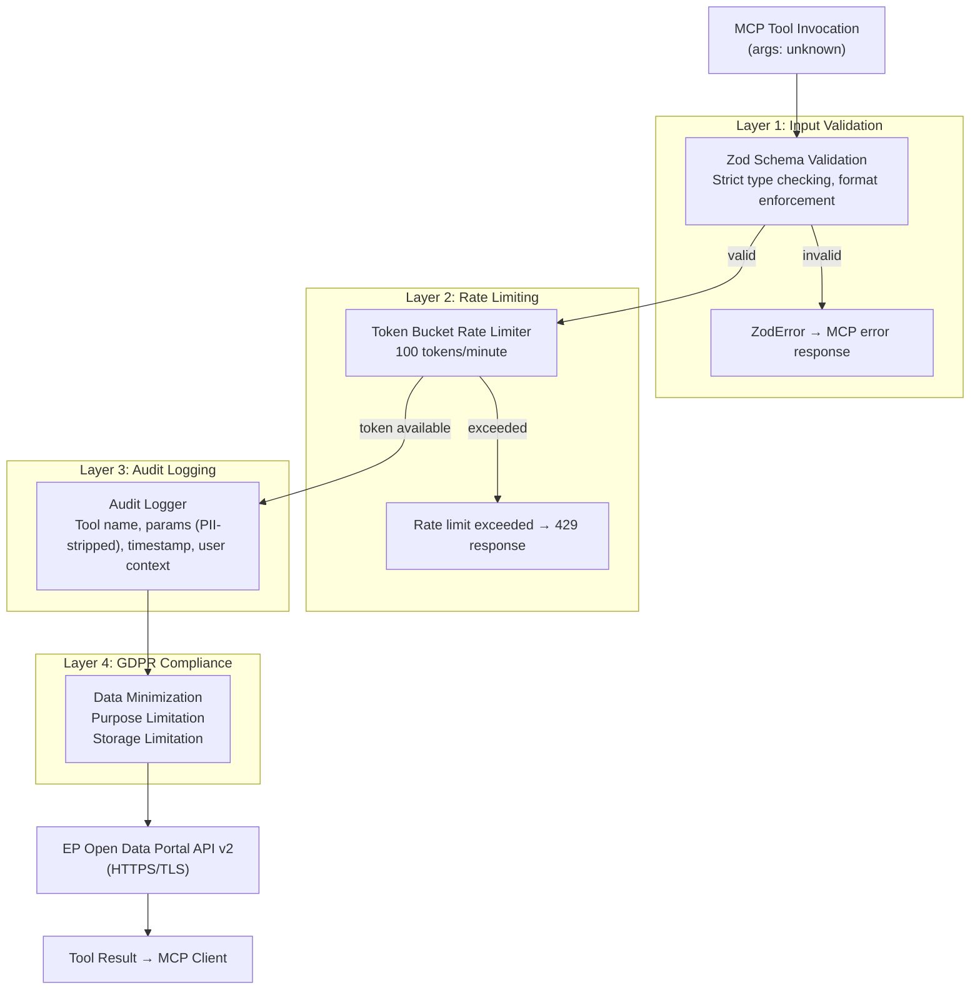
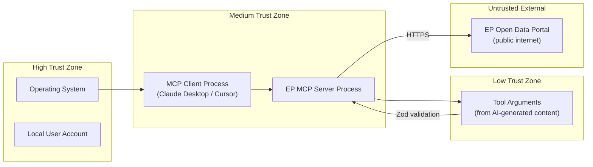
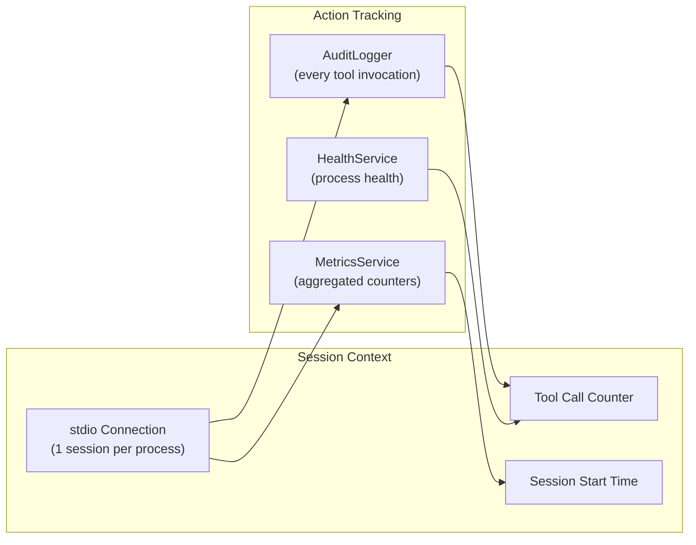
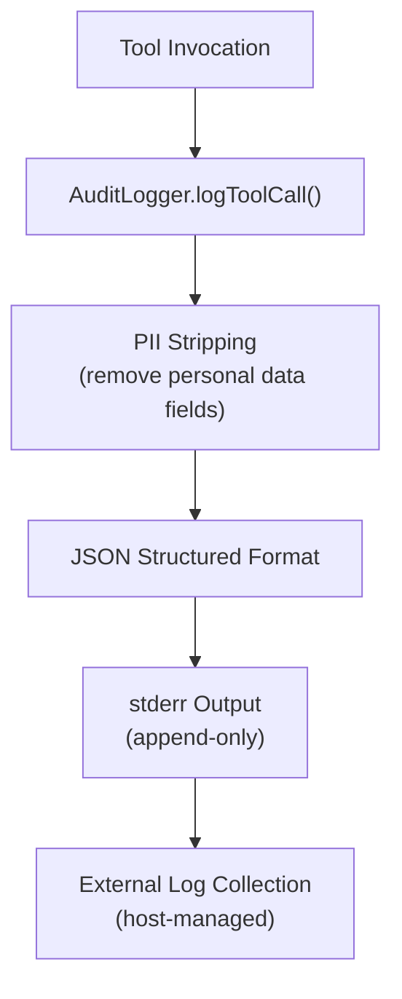
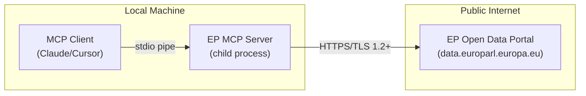
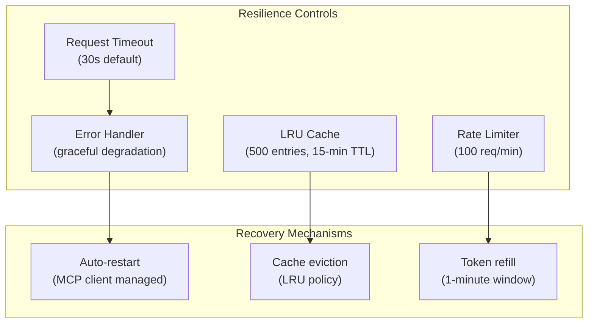
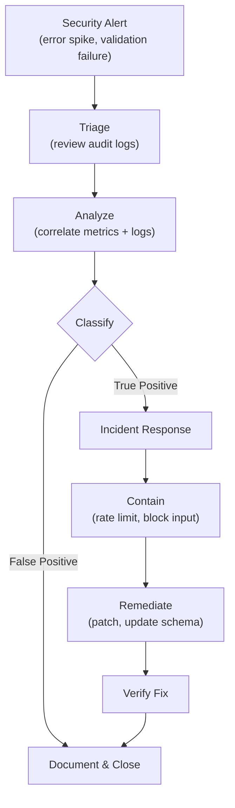
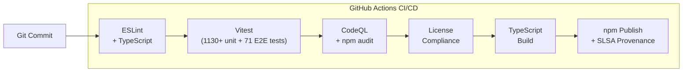
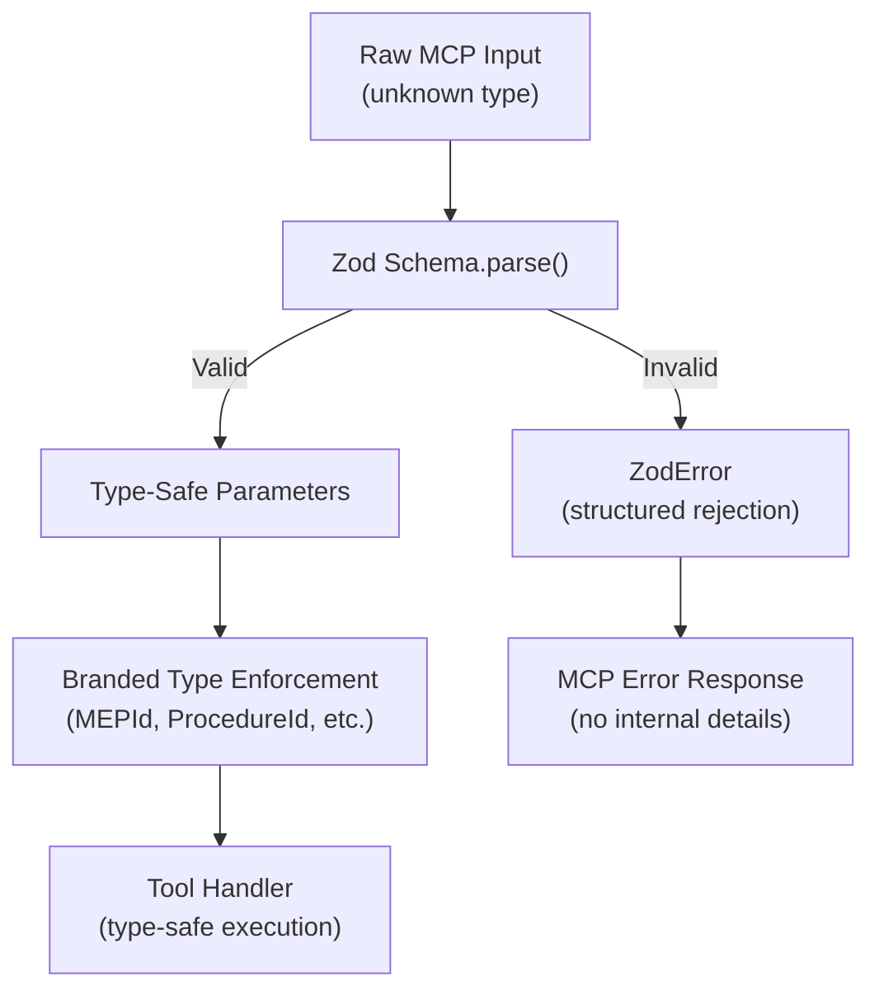
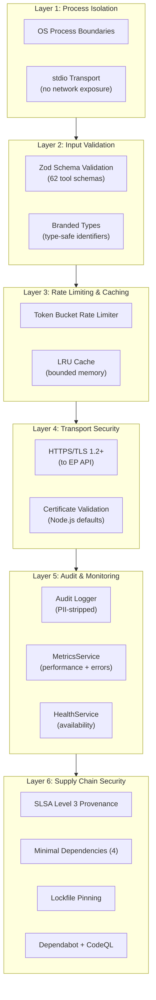

[**European Parliament MCP Server API v1.2.12**](../README.md)

***

[European Parliament MCP Server API](../modules.md) / SECURITY\_ARCHITECTURE

<p align="center">
  
</p>

<h1 align="center">🔒 European Parliament MCP Server — Security Architecture</h1>

<p align="center">
  <strong>Implemented Security Controls, Threat Model, and Compliance Mapping</strong><br>
  <em>Defense-in-depth security design for parliamentary data access</em>
</p>

<p align="center">
  <a href="#"></a>
  <a href="#"></a>
  <a href="#"></a>
  <a href="#"></a>
  <a href="https://www.bestpractices.dev/projects/12067"></a>
</p>

**📋 Document Owner:** Hack23 | **📄 Version:** 1.2 | **📅 Last Updated:** 2026-04-21 (UTC)
**🔄 Review Cycle:** Quarterly | **⏰ Next Review:** 2026-07-21
**🏷️ Classification:** Public (Open Source MCP Server)
**✅ ISMS Compliance:** ISO 27001 (A.5.1, A.8.1, A.14.2), NIST CSF 2.0 (ID.AM, PR.DS), CIS Controls v8.1 (2.1, 16.1)

---

## 📑 Table of Contents

1. [Security Documentation Map](#-security-documentation-map)
2. [Executive Summary](#-executive-summary)
3. [4-Layer Security Architecture](#-4-layer-security-architecture)
4. [Security Controls Inventory](#-security-controls-inventory)
5. [Threat Mitigation Mapping (STRIDE)](#-threat-mitigation-mapping-stride)
6. [Authentication and Authorization](#-authentication-and-authorization)
7. [Session and Action Tracking](#-session-and-action-tracking)
8. [Data Integrity and Auditing](#-data-integrity-and-auditing)
9. [Data Protection and GDPR](#-data-protection-and-gdpr)
10. [Network Security and Perimeter Protection](#-network-security-and-perimeter-protection)
11. [VPC Endpoints and Private Access](#-vpc-endpoints-and-private-access)
12. [High Availability and Resilience](#-high-availability-and-resilience)
13. [Threat Detection and Investigation](#-threat-detection-and-investigation)
14. [Vulnerability Management](#-vulnerability-management)
15. [Configuration and Compliance Management](#-configuration-and-compliance-management)
16. [Security Monitoring and Analytics](#-security-monitoring-and-analytics)
17. [Automated Security Operations](#-automated-security-operations)
18. [Application Security Controls](#-application-security-controls)
19. [Defense-in-Depth Strategy](#-defense-in-depth-strategy)
20. [Security Testing Requirements](#-security-testing-requirements)
21. [Compliance Framework Mapping](#-compliance-framework-mapping)

---

## 🗺️ Security Documentation Map

| Document | Current | Future | Description |
|----------|---------|--------|-------------|
| **Architecture** | [ARCHITECTURE.md](ARCHITECTURE.md) | [FUTURE_ARCHITECTURE.md](../_media/FUTURE_ARCHITECTURE.md) | C4 model, containers, components, ADRs |
| **Security Architecture** | [SECURITY_ARCHITECTURE.md](./SECURITY_ARCHITECTURE.md) | [FUTURE_SECURITY_ARCHITECTURE.md](../_media/FUTURE_SECURITY_ARCHITECTURE.md) | Security controls, threat model |
| **Data Model** | [DATA_MODEL.md](DATA_MODEL.md) | [FUTURE_DATA_MODEL.md](../_media/FUTURE_DATA_MODEL.md) | Entity relationships, branded types |
| **Flowchart** | [FLOWCHART.md](../_media/FLOWCHART.md) | [FUTURE_FLOWCHART.md](../_media/FUTURE_FLOWCHART.md) | Business process flows |
| **State Diagram** | [STATEDIAGRAM.md](../_media/STATEDIAGRAM.md) | [FUTURE_STATEDIAGRAM.md](../_media/FUTURE_STATEDIAGRAM.md) | System state transitions |
| **Mind Map** | [MINDMAP.md](../_media/MINDMAP.md) | [FUTURE_MINDMAP.md](../_media/FUTURE_MINDMAP.md) | System concepts and relationships |
| **SWOT Analysis** | [SWOT.md](../_media/SWOT.md) | [FUTURE_SWOT.md](../_media/FUTURE_SWOT.md) | Strategic positioning |
| **Threat Model** | [THREAT_MODEL.md](THREAT_MODEL.md) | [FUTURE_THREAT_MODEL.md](../_media/FUTURE_THREAT_MODEL.md) | STRIDE, MITRE ATT&CK, attack trees |
| **CRA Assessment** | [CRA-ASSESSMENT.md](CRA-ASSESSMENT.md) | — | EU Cyber Resilience Act conformity |

---

## 🎯 Executive Summary

The EP MCP Server implements a **4-layer defense-in-depth security architecture** aligned with OWASP best practices, ISO 27001, NIST CSF 2.0, and GDPR requirements. Since the server operates as an MCP stdio process (not a network-exposed server), the primary security concerns are:

1. **Input validation** — prevent malformed or malicious MCP tool arguments
2. **API abuse prevention** — protect EP Open Data Portal from overuse
3. **Data privacy** — GDPR-compliant handling of MEP personal data
4. **Audit trail** — full traceability of all data access

The server does **not** handle authentication tokens, passwords, or payment data, significantly reducing the attack surface.

---

## 🛡️ 4-Layer Security Architecture



---

## 🔐 Security Controls Inventory

| Control ID | Control Name | Type | Implementation | Status |
|------------|-------------|------|----------------|--------|
| SC-001 | Input Validation | Preventive | Zod schema per tool (62 schemas) with `.refine()` cross-field constraints, date range validation, and format-specific ID validation | ✅ Implemented |
| SC-002 | Rate Limiting | Preventive | Token bucket, 100 req/min | ✅ Implemented |
| SC-003 | Audit Logging | Detective | AuditLogger singleton, all invocations | ✅ Implemented |
| SC-004 | GDPR Data Minimization | Preventive | Field selection, no over-fetching | ✅ Implemented |
| SC-005 | TLS in Transit | Preventive | HTTPS to EP API, Node TLS defaults | ✅ Implemented |
| SC-006 | Dependency Scanning | Detective | Dependabot, npm audit | ✅ Implemented |
| SC-007 | Static Analysis | Preventive | ESLint, TypeScript strict mode | ✅ Implemented |
| SC-008 | Secret Detection | Preventive | No secrets in codebase; env vars only | ✅ Implemented |
| SC-009 | Error Sanitization | Preventive | Internal errors not leaked to MCP clients | ✅ Implemented |
| SC-010 | Health Monitoring | Detective | HealthService singleton | ✅ Implemented |
| SC-011 | Metrics Collection | Detective | MetricsService, rate/error tracking | ✅ Implemented |
| SC-012 | Branded Types | Preventive | Zod branded types for EP identifiers | ✅ Implemented |
| SC-013 | Data Quality Controls | Preventive | OSINT outputs standardize confidence level and quality warnings; data availability status is included where implemented | ✅ Implemented |

---

## ⚔️ Threat Mitigation Mapping (STRIDE)

| Threat Category | Specific Threat | Likelihood | Impact | Mitigation |
|-----------------|----------------|-----------|--------|-----------|
| **Spoofing** | Fake MCP client identity | Low | Low | stdio transport — client is the spawning process |
| **Tampering** | Malicious tool arguments | Medium | Medium | SC-001: Zod validation rejects malformed input |
| **Repudiation** | Deny data access occurred | Medium | Medium | SC-003: Immutable audit log with timestamps |
| **Information Disclosure** | MEP PII over-exposure | Medium | High | SC-004: Data minimization, GDPR controls |
| **Information Disclosure** | Internal error details leaked | Low | Medium | SC-009: Error sanitization |
| **Denial of Service** | EP API flooding | Medium | High | SC-002: Rate limiter blocks bursts |
| **Denial of Service** | Memory exhaustion via cache | Low | Medium | LRU eviction (max 500 entries) |
| **Elevation of Privilege** | Unauthorized tool access | Low | Low | No auth layer needed — local stdio process |
| **Elevation of Privilege** | Prototype pollution via input | Low | Medium | SC-001: Zod validation with strict mode |
| **Supply Chain** | Malicious npm package | Medium | High | SC-006: Dependabot, npm audit, lockfile |

---

## 🔑 Authentication and Authorization

### Current Model (v1.1)

The EP MCP Server operates as a **local stdio process** spawned by the MCP client (e.g., Claude Desktop). The security model relies on OS-level process isolation:

- **No network authentication** — the server is not network-exposed
- **No user credentials** — the server does not handle user tokens
- **Process isolation** — only the spawning MCP client can communicate via stdio
- **EP API access** — public open data, no authentication required by EP

### Trust Boundaries



**Key principle:** Tool arguments are treated as **untrusted input** regardless of their origin, since AI models may generate unexpected parameter values.

---

## 📊 Session and Action Tracking

All user interactions with the MCP server are tracked through the integrated audit and metrics systems:

### Session Tracking Model



### Tracked Actions

| Action Type | Tracked Fields | Storage | Purpose |
|-------------|---------------|---------|---------|
| Tool invocation | Tool name, sanitized params, timestamp, duration | stderr audit log | Full traceability |
| API request | URL, status, duration, cache hit/miss | MetricsService | Performance monitoring |
| Rate limit event | Token count, refill status, rejection | stderr audit log | Abuse detection |
| Error occurrence | Error type (no stack trace), tool context | stderr audit log | Incident response |
| Cache operation | Key, hit/miss, eviction | MetricsService | Efficiency tracking |

### Action Tracking Implementation

- **No persistent session storage** — session state is in-memory only (process-scoped)
- **PII stripping** — all logged parameters have personal data fields removed before logging
- **Structured logging** — JSON format on stderr for machine-parseable audit trail
- **Per-tool metrics** — invocation count, error count, average duration per tool

---

## 📜 Data Integrity and Auditing

### Data Integrity Controls

| Control | Implementation | Verification |
|---------|---------------|--------------|
| **Source integrity** | All data sourced from official EP API over HTTPS/TLS | TLS certificate validation |
| **Transport integrity** | HTTPS with TLS 1.2+ for all API calls | Node.js default TLS verification |
| **Cache integrity** | In-memory LRU cache (no persistent storage) — no disk tampering risk | Process isolation |
| **Cache key integrity** | Deterministic cache key generation via sorted parameter keys | Prevents cache misses from property insertion order |
| **Schema validation** | Zod schemas validate all API responses before processing | TypeScript strict mode + runtime validation |
| **Data quality integrity** | OSINT outputs include `DataAvailability` and `dataQualityWarnings` (SC-013) | Consumers distinguish "zero" from "unavailable" |
| **Audit immutability** | Audit logs written to stderr (append-only within process) | No log modification API exposed |
| **Package integrity** | npm lockfile with exact versions, SLSA Level 3 provenance | Provenance attestations, Sigstore signing |

### Audit Trail Architecture



### Audit Log Fields

| Field | Type | Description |
|-------|------|-------------|
| `timestamp` | ISO 8601 | Event occurrence time |
| `toolName` | string | MCP tool identifier |
| `parameters` | object | Sanitized input parameters (PII removed) |
| `resultStatus` | enum | `success`, `error`, `rate_limited` |
| `durationMs` | number | Execution duration |
| `errorType` | string? | Error category (no stack traces) |
| `cacheHit` | boolean? | Whether result came from cache |

---

## 🛡️ Data Protection and GDPR

### Personal Data Inventory

| Data Category | EP API Endpoint | GDPR Basis | Retention in Cache | Minimization Applied |
|--------------|----------------|-----------|-------------------|---------------------|
| MEP Names | `/meps/{id}` | Public role (Art. 6.1.e) | 15 min TTL | Name, group only |
| MEP Contact | `/meps/{id}` | Legitimate interest | 15 min TTL | Official EP address only |
| MEP Votes | `/votes` | Public interest | 15 min TTL | Vote record, no commentary |
| MEP Attendance | `/plenary-sessions` | Public interest | 15 min TTL | Session data only |
| MEP Declarations | `/meps/{id}/declarations` | Public role | 15 min TTL | Official declarations only |

### GDPR Principles Implementation

| Principle | Implementation |
|-----------|---------------|
| **Lawfulness** | Processing public parliamentary records per Art. 6.1.e (public interest) |
| **Purpose Limitation** | Data used solely for parliamentary intelligence queries |
| **Data Minimization** | Field selection queries — only request needed attributes |
| **Accuracy** | Data sourced directly from official EP API |
| **Storage Limitation** | LRU cache with 15-min TTL; no persistent storage |
| **Integrity and Confidentiality** | HTTPS transport, no local file system writes |
| **Accountability** | Audit logging of all data access requests |

---

## 🌐 Network Security and Perimeter Protection

### Outbound Connections

| Destination | Protocol | Port | TLS | Purpose |
|------------|----------|------|-----|---------|
| `data.europarl.europa.eu` | HTTPS | 443 | TLS 1.2+ | EP Open Data Portal API v2 |
| EP Vocabulary endpoints | HTTPS | 443 | TLS 1.2+ | AT4EU taxonomy lookups |

### Security Headers (Outbound Requests)

```typescript
// Applied to all EP API requests
headers: {
  'Accept': 'application/json',
  'User-Agent': 'European-Parliament-MCP-Server/1.1',
  'Accept-Encoding': 'gzip, deflate, br'
}
```

### No Inbound Network Exposure

- Server operates exclusively via **stdio** (no listening sockets)
- No HTTP server, no WebSocket server in current v1.1
- No ports bound, no firewall rules required

---

## 📊 Audit and Monitoring

### Audit Log Schema

```typescript
interface AuditLogEntry {
  timestamp: string;        // ISO 8601
  toolName: string;         // e.g., "get_mep_details"
  parameters: Record<string, unknown>;  // PII-stripped
  resultStatus: 'success' | 'error' | 'rate_limited';
  durationMs: number;
  errorType?: string;       // Error category (no stack traces)
}
```

### Metrics Collected

| Metric | Type | Purpose |
|--------|------|---------|
| `tool.invocations.total` | Counter | Usage tracking per tool |
| `tool.invocations.errors` | Counter | Error rate monitoring |
| `cache.hits` | Counter | Cache efficiency |
| `cache.misses` | Counter | Cache efficiency |
| `ratelimit.tokens.used` | Gauge | Rate limit consumption |
| `api.request.duration_ms` | Histogram | EP API latency |
| `api.request.errors` | Counter | EP API error rates |

### Health Checks

The `HealthService` singleton monitors:
- EP API reachability (periodic ping)
- Cache memory utilization
- Rate limiter token availability
- Error rate thresholds

---

## 🔌 VPC Endpoints and Private Access

### Current Architecture (stdio-based)

The EP MCP Server operates as a **local process** using stdio transport, which means:

- **No VPC deployment** — the server runs on the local machine as a child process of the MCP client
- **No cloud networking** — no VPC, subnets, or security groups required
- **Direct internet access** — outbound HTTPS to EP API via the host's network stack
- **Process-level isolation** — OS process boundaries provide access control

### Network Access Pattern



### Future Cloud Deployment Considerations

When deployed as a hosted service (v2.0+), VPC architecture will include:
- Private subnets for MCP server instances
- NAT Gateway for outbound EP API access
- VPC endpoints for AWS services (CloudWatch, KMS)
- Security groups restricting inbound to MCP protocol only

See [FUTURE_SECURITY_ARCHITECTURE.md](../_media/FUTURE_SECURITY_ARCHITECTURE.md) for planned VPC architecture.

---

## 🏗️ High Availability and Resilience

### Current Resilience Model

| Aspect | Implementation | Recovery |
|--------|---------------|----------|
| **Process crash** | MCP client auto-restarts server process | Instant restart, cold cache |
| **EP API unavailable** | Graceful error responses to MCP client | Cached data served if available |
| **Rate limit exceeded** | Token bucket rejects requests with clear error | Auto-recovery after window reset |
| **Memory exhaustion** | LRU cache eviction (max 500 entries) | Automatic eviction of oldest entries |
| **Network timeout** | Configurable timeout (default 30s) per request | Retry with exponential backoff |

### Fault Tolerance Architecture



### Data Durability

- **No persistent state** — all state is in-memory (cache, metrics, rate limiter tokens)
- **Stateless design** — server can be restarted at any time without data loss
- **Cache warm-up** — first requests after restart may be slower (cold cache)
- **npm package integrity** — SLSA Level 3 provenance ensures package authenticity

---

## ⚡ Threat Detection and Investigation

### Detection Capabilities

| Detection Method | Implementation | Threats Detected |
|-----------------|----------------|------------------|
| **Rate limit monitoring** | Token bucket algorithm logs rejection events | API abuse, DoS attempts |
| **Error rate tracking** | MetricsService tracks per-tool error rates | Injection attempts, API anomalies |
| **Input validation logging** | Zod validation failures logged with sanitized input | Malformed input, fuzzing attempts |
| **Health check alerts** | HealthService monitors EP API reachability | Network issues, EP API outages |
| **Dependency scanning** | Dependabot + npm audit in CI/CD | Supply chain vulnerabilities |
| **Static analysis** | CodeQL + ESLint in GitHub Actions | Code-level security issues |

### Investigation Workflow



---

## 🔍 Vulnerability Management

### Vulnerability Scanning Pipeline

| Scanner | Scope | Frequency | Integration |
|---------|-------|-----------|-------------|
| **Dependabot** | npm dependencies | Continuous | GitHub automatic PRs |
| **npm audit** | Direct + transitive deps | Every CI run | Build gate |
| **CodeQL** | Source code (TypeScript) | Every PR + scheduled | GitHub code scanning |
| **ESLint security rules** | Code patterns | Every commit | Pre-commit + CI |
| **License compliance** | Dependency licenses | Every CI run | `test:licenses` script |
| **SLSA provenance** | Package supply chain | Every release | Sigstore attestation |

### Remediation SLAs

| Severity | CVSS Score | Remediation Timeline | Escalation |
|----------|-----------|---------------------|------------|
| **Critical** | 9.0–10.0 | 24 hours | Immediate patch release |
| **High** | 7.0–8.9 | 7 days | Next patch release |
| **Medium** | 4.0–6.9 | 30 days | Next minor release |
| **Low** | 0.1–3.9 | 90 days | Scheduled maintenance |

### Dependency Update Strategy

- **Automated PRs** via Dependabot for all dependency updates
- **Lockfile pinning** — exact versions in `package-lock.json`
- **Minimal dependencies** — only 4 runtime dependencies (SDK, LRU cache, undici, zod)
- **Provenance verification** — SLSA Level 3 for published npm package

---

## ⚙️ Configuration and Compliance Management

### Configuration Management

| Configuration | Source | Validation | Default |
|--------------|--------|-----------|---------|
| Rate limit | `EP_RATE_LIMIT` env var | Numeric > 0 | 100 req/min |
| Cache size | Hardcoded | N/A | 500 entries |
| Cache TTL | `EP_CACHE_TTL` env var | Numeric (ms) | 900,000 ms (15 min) |
| EP API base URL | `EP_API_URL` env var | URL format | `https://data.europarl.europa.eu/api/v2/` |
| Request timeout | `EP_REQUEST_TIMEOUT_MS` env var | Numeric (ms) | 10,000 ms |

### Infrastructure as Code

- **TypeScript strict mode** — all configuration types are compile-time checked
- **Zod runtime validation** — environment variables validated at startup
- **No secrets in code** — all sensitive values via environment variables
- **Reproducible builds** — `npm ci` with lockfile for deterministic installs

### Compliance Drift Detection

| Check | Tool | Frequency | Action on Drift |
|-------|------|-----------|----------------|
| Dependency versions | Dependabot | Continuous | Auto-PR |
| Code quality | ESLint + TypeScript | Every commit | Build failure |
| Security findings | CodeQL | Every PR | PR blocked |
| License compliance | license-compliance | Every CI | Build failure |
| Unused code | Knip | Every CI | Build warning |
| Package integrity | SLSA provenance | Every release | Release blocked |

---

## 📈 Security Monitoring and Analytics

### Metrics Dashboard

| Metric Category | Metrics | Collection Method |
|----------------|---------|-------------------|
| **Tool usage** | Invocations per tool, error rate per tool | MetricsService counters |
| **API performance** | Request duration, response status codes | MetricsService histograms |
| **Rate limiting** | Tokens used, rejections, peak usage | Token bucket state |
| **Cache efficiency** | Hit rate, miss rate, eviction count | LRU cache stats |
| **Error analysis** | Error types, error frequency, error trends | AuditLogger + MetricsService |

### Security Alerting Thresholds

| Alert | Threshold | Action |
|-------|-----------|--------|
| Error rate spike | > 10% of requests in 5-min window | Log warning, investigate |
| Rate limit saturation | > 90% token usage | Log warning, potential abuse |
| EP API connectivity loss | 3 consecutive failures | Health check degraded |
| Validation failure spike | > 5 failures in 1 minute | Potential injection attempt |

### Analytics for Threat Intelligence

- **Tool usage patterns** — detect anomalous tool call sequences
- **Parameter analysis** — identify suspicious parameter patterns (logged after PII stripping)
- **Error correlation** — correlate error spikes with external events
- **Rate limit patterns** — identify API abuse patterns

---

## 🤖 Automated Security Operations

### CI/CD Security Automation



### Automated Security Controls

| Automation | Trigger | Action | Outcome |
|-----------|---------|--------|---------|
| **Dependabot PRs** | New vulnerability | Auto-create update PR | Dependency patched |
| **CodeQL scanning** | Every PR/push | Static analysis | Vulnerabilities flagged |
| **npm audit** | Every CI run | Dependency audit | Build gate enforced |
| **License check** | Every CI run | License validation | Non-compliant deps blocked |
| **Knip** | Every CI run | Unused code detection | Dead code flagged |
| **SLSA provenance** | npm publish | Provenance attestation | Supply chain verified |
| **Branch protection** | PR merge | Required reviews + checks | Quality gate enforced |

### Self-Healing Capabilities

- **Automatic cache eviction** — LRU policy prevents memory exhaustion
- **Rate limit recovery** — token bucket auto-refills after window expiry
- **Graceful degradation** — tools return structured errors when EP API is unavailable
- **Process restart** — MCP client automatically restarts crashed server processes

---

## 🛡️ Application Security Controls

### Input Validation Architecture



### Validation Controls per Layer

| Layer | Control | Implementation |
|-------|---------|---------------|
| **Input parsing** | Zod schema validation | Every tool has a dedicated schema |
| **Type enforcement** | Branded types via Zod | `MEPId`, `ProcedureId`, `SessionId` prevent type confusion |
| **Cross-field validation** | `.refine()` constraints | Date range ordering, mutual exclusivity, conditional requirements |
| **String sanitization** | Max length limits, pattern matching | Zod `.max()`, `.regex()` constraints |
| **Numeric bounds** | Range validation | `.min()`, `.max()`, `.int()` constraints |
| **Enum restriction** | Allowed value sets | `.enum()` for country codes, group names |
| **Output encoding** | JSON serialization | `JSON.stringify()` prevents injection in responses |
| **Data quality** | OSINT output validation | `dataQualityWarnings`, `confidenceLevel`, `DataAvailability` fields (SC-013) |

### Error Handling Security

All tool errors are reported via the `ToolError` class which carries `toolName`, `operation`, `isRetryable`, and optional `cause` — ensuring structured error reporting without leaking internal implementation details. Success responses use `buildToolResponse()` for consistent JSON formatting.

| Error Type | Response to Client | Logged Internally |
|-----------|-------------------|-------------------|
| Zod validation error | Structured field errors | Full error details |
| EP API error (4xx) | Generic "API error" message | Status code, URL, response body |
| EP API error (5xx) | Generic "service unavailable" | Full error details |
| Network timeout | "Request timeout" | URL, timeout duration |
| Rate limit exceeded | "Rate limit exceeded" | Token state, request details |
| Unexpected error | "Internal error" | Full stack trace (internal only) |

---

## 🏆 Defense-in-Depth Strategy

### Security Layer Architecture



### Defense-in-Depth Summary

| Layer | Controls | Threats Mitigated |
|-------|----------|-------------------|
| **Process Isolation** | stdio transport, no network listener | Remote access, network attacks |
| **Input Validation** | Zod schemas, branded types, strict TypeScript | Injection, type confusion, malformed input |
| **Rate Limiting** | Token bucket (100/min), cache bounds (500) | DoS, API abuse, memory exhaustion |
| **Transport Security** | HTTPS/TLS 1.2+, certificate validation | MITM, data interception |
| **Audit & Monitoring** | Structured logging, metrics, health checks | Repudiation, undetected abuse |
| **Supply Chain** | SLSA L3, Dependabot, lockfile, minimal deps | Dependency hijacking, package tampering |

---

## 🧪 Security Testing Requirements

### Coverage Requirements

| Component | Minimum Coverage | Focus Areas |
|-----------|-----------------|-------------|
| Zod validators | 95% | Edge cases, injection attempts |
| Rate limiter | 90% | Boundary conditions, token exhaustion |
| Audit logger | 90% | PII stripping, log format |
| EP API clients | 80% | Error handling, timeout behavior |
| Tool handlers | 80% | Happy path + error paths |

### Security Test Categories

1. **Input Validation Tests**
   - Oversized strings (> 10,000 chars)
   - Special characters in identifiers
   - Prototype pollution attempts: `{"__proto__": {...}}`
   - Type confusion: passing objects where strings expected
   - Boundary values: negative IDs, zero values, MAX_SAFE_INTEGER

2. **Rate Limiting Tests**
   - Burst requests (> 100 in 60s window)
   - Token recovery after window reset
   - Concurrent request handling

3. **Data Privacy Tests**
   - Verify PII fields are stripped from audit logs
   - Verify data minimization (no extra fields returned)
   - Verify 15-min cache TTL enforcement

4. **Error Handling Tests**
   - EP API 429 (rate limited) — graceful handling
   - EP API 500 — error message sanitization
   - Network timeout — no credential leakage
   - ZodError — structured error response

---

## 📋 Compliance Framework Mapping

| Control | Standard | Clause | Implementation |
|---------|----------|--------|----------------|
| Information Security Policies | ISO 27001 | A.5.1 | SECURITY.md, SECURITY_ARCHITECTURE.md, THREAT_MODEL.md |
| Asset Management | ISO 27001 | A.8.1 | 62 tools + 9 resources inventoried |
| Access Control | ISO 27001 | A.9.1 | stdio isolation, no network exposure |
| Cryptography | ISO 27001 | A.10.1 | TLS 1.2+ for all EP API calls |
| Secure Development | ISO 27001 | A.14.2 | TypeScript strict, Zod validation, ESLint |
| Vulnerability Management | ISO 27001 | A.12.6 | Dependabot, npm audit, CodeQL |
| Audit Logging | ISO 27001 | A.12.4 | AuditLogger, all invocations logged |
| Change Management | ISO 27001 | A.12.1 | Git-based change tracking, PR reviews |
| Privacy by Design | GDPR | Art. 25 | Data minimization, purpose limitation |
| Data Protection | GDPR | Art. 32 | TLS transport, no persistent PII storage |
| Identify: Assets | NIST CSF 2.0 | ID.AM | Full tool and component inventory |
| Protect: Data Security | NIST CSF 2.0 | PR.DS | TLS, cache TTL, data minimization |
| Detect: Anomalies | NIST CSF 2.0 | DE.AE | MetricsService, error rate monitoring |
| Respond: Planning | NIST CSF 2.0 | RS.RP | Incident response via GitHub Security Advisories |
| Recover: Planning | NIST CSF 2.0 | RC.RP | Stateless design enables instant recovery |
| Software Inventory | CIS Controls v8.1 | 2.1 | package.json with locked versions, SBOM |
| Secure Configuration | CIS Controls v8.1 | 4.1 | TypeScript strict, no dangerous defaults |
| Audit Log Management | CIS Controls v8.1 | 8.2 | AuditLogger singleton |
| Application Security | CIS Controls v8.1 | 16.1 | Zod validation, branded types, CodeQL |
| Penetration Testing | CIS Controls v8.1 | 18.1 | Security test categories in CI |

---

*See [FUTURE_SECURITY_ARCHITECTURE.md](../_media/FUTURE_SECURITY_ARCHITECTURE.md) for the planned security evolution including OAuth 2.0, RBAC, and zero-trust architecture.*
