<p align="center">
  
</p>

<h1 align="center">⚙️ GitHub Workflows Documentation</h1>

<p align="center">
  <strong>CI/CD Automation for European Parliament MCP Server</strong><br>
  <em>Comprehensive workflow documentation following Hack23 ISMS standards</em>
</p>

---

## 📋 Document Information

| Property | Value |
|----------|-------|
| **Owner** | DevOps Team |
| **Version** | 2.0 |
| **Last Updated** | 2026-02-18 |
| **Classification** | Internal |
| **Review Cycle** | Quarterly |
| **Next Review** | 2026-05-18 |

[](https://github.com/Hack23)
[](https://github.com/Hack23/European-Parliament-MCP-Server)
[](https://github.com/Hack23/European-Parliament-MCP-Server)
[](https://github.com/Hack23/European-Parliament-MCP-Server)

---

## 🔗 Related Documents

| Document | Description | Link |
|----------|-------------|------|
| **Security Architecture** | Security design and controls | [SECURITY_ARCHITECTURE.md](../SECURITY_ARCHITECTURE.md) |
| **Architecture Diagrams** | System architecture visualization | [ARCHITECTURE_DIAGRAMS.md](../ARCHITECTURE_DIAGRAMS.md) |
| **Secure Development Policy** | ISMS secure development guidelines | [Secure_Development_Policy.md](https://github.com/Hack23/ISMS-PUBLIC/blob/main/Secure_Development_Policy.md) |
| **Open Source Policy** | ISMS open source governance | [Open_Source_Policy.md](https://github.com/Hack23/ISMS-PUBLIC/blob/main/Open_Source_Policy.md) |
| **Documentation Portal** | Live documentation and reports | [docs/](https://hack23.github.io/European-Parliament-MCP-Server/docs/) |

---

## 📋 Table of Contents

- [Overview](#overview)
- [Workflows](#workflows)
- [Label Management](#label-management)
- [Release Management](#release-management)
- [Security & Compliance](#security--compliance)
- [Testing & Quality](#testing--quality)
- [Dependency Management](#dependency-management)

## Overview

The repository uses GitHub Actions for comprehensive CI/CD automation following Hack23 ISMS requirements and industry best practices.

### 🎯 ISMS Compliance & Evidence

All workflows implement security controls and provide evidence for:

- **ISO 27001:2022** - Information Security Management
  - A.8.31: Change Management
  - A.14.2: Security in Development
  - A.12.1: Operational Procedures
- **NIST CSF 2.0** - Cybersecurity Framework
  - PR.DS-6: Integrity Checking
  - DE.CM-8: Vulnerability Scans
  - RS.AN-5: Process Established
- **CIS Controls v8.1** - Security Best Practices
  - 2.2: Software Inventory (SBOM)
  - 4.1: Security Configuration (CodeQL)
  - 16.6: Application Software Security

**Evidence Location:** All workflow execution logs, SBOM, security scan results, and test reports are available in the [Documentation Portal](https://hack23.github.io/European-Parliament-MCP-Server/docs/)

### 🔐 Workflow Security Principles

All workflows follow **SLSA Level 3** supply chain security requirements:

```mermaid
graph LR
    subgraph "Security Layers"
        SL1[🔒 Step Security<br/>Harden Runner]
        SL2[📌 Pinned Actions<br/>SHA256 Hashes]
        SL3[🔑 Minimal Permissions<br/>Least Privilege]
        SL4[📝 Audit Logging<br/>Egress Tracking]
    end
    
    subgraph "Compliance"
        C1[ISO 27001]
        C2[NIST CSF]
        C3[CIS Controls]
        C4[SLSA Level 3]
    end
    
    SL1 --> SL4
    SL2 --> SL3
    SL3 --> SL4
    
    SL4 -.Evidence.-> C1
    SL4 -.Evidence.-> C2
    SL4 -.Evidence.-> C3
    SL4 -.Evidence.-> C4
    
    style SL1 fill:#FF3D00,stroke:#BF360C,stroke-width:2px,color:white
    style SL2 fill:#FF3D00,stroke:#BF360C,stroke-width:2px,color:white
    style SL3 fill:#FF3D00,stroke:#BF360C,stroke-width:2px,color:white
    style SL4 fill:#FF3D00,stroke:#BF360C,stroke-width:2px,color:white
    style C1 fill:#00C853,stroke:#00C853,stroke-width:2px,color:white
    style C2 fill:#00C853,stroke:#00C853,stroke-width:2px,color:white
    style C3 fill:#00C853,stroke:#00C853,stroke-width:2px,color:white
    style C4 fill:#00C853,stroke:#00C853,stroke-width:2px,color:white
```



### 📊 Workflow Portfolio

The repository maintains **10 automated workflows** providing comprehensive CI/CD coverage:

| Workflow | Purpose | Trigger | ISMS Evidence |
|----------|---------|---------|---------------|
| **Main CI** | Orchestrates all workflows | Push, PR | [main.yml](.github/workflows/main.yml) |
| **Test & Report** | Testing and coverage | Push, PR | [Secure Dev Policy](https://github.com/Hack23/ISMS-PUBLIC/blob/main/Secure_Development_Policy.md) |
| **CodeQL Analysis** | SAST security scanning | Push, PR, Weekly | ISO 27001 A.14.2.8 |
| **Scorecard** | Security best practices | Weekly | [Open Source Policy](https://github.com/Hack23/ISMS-PUBLIC/blob/main/Open_Source_Policy.md) |
| **SBOM Generation** | Software Bill of Materials | Build | CIS Controls 2.2 |
| **Release** | Automated releases | Tag push | SLSA Level 3 Provenance |
| **Labeler** | PR auto-labeling | PR | Process Automation |
| **Setup Labels** | Label management | Manual | Configuration Management |
| **Dependency Review** | Vulnerability scanning | PR | NIST CSF DE.CM-8 |
| **Integration Tests** | E2E validation | Push, PR | Quality Assurance |

**All Workflows:** [.github/workflows/](../workflows/)

---

## 🔐 CI/CD Architecture

### Workflow Execution Flow

```mermaid
graph TB
    subgraph "Developer Activity"
        DEV1[👨‍💻 Code Changes]
        DEV2[🔀 Create PR]
        DEV3[✅ Merge to Main]
    end
    
    subgraph "Automated Checks"
        AC1[🏷️ Auto Labeling]
        AC2[🔍 Dependency Review]
        AC3[🧪 Test & Report]
        AC4[🔒 CodeQL SAST]
        AC5[📦 SBOM Generation]
    end
    
    subgraph "Quality Gates"
        QG1{Coverage ≥80%?}
        QG2{SBOM Quality ≥7.0?}
        QG3{CodeQL Pass?}
        QG4{Tests Pass?}
    end
    
    subgraph "Release Process"
        RP1[📝 Draft Release]
        RP2[🏷️ Create Tag]
        RP3[📦 Publish npm]
        RP4[📚 Deploy Docs]
    end
    
    DEV1 --> DEV2
    DEV2 --> AC1
    AC1 --> AC2
    AC2 --> AC3
    AC3 --> AC4
    AC4 --> AC5
    
    AC3 --> QG4
    QG4 -->|Pass| QG1
    QG1 -->|Pass| QG3
    QG3 -->|Pass| QG2
    QG2 -->|Pass| DEV3
    
    DEV3 --> RP1
    RP1 --> RP2
    RP2 --> RP3
    RP3 --> RP4
    
    style DEV1 fill:#2979FF,stroke:#1565C0,stroke-width:2px,color:white
    style DEV2 fill:#2979FF,stroke:#1565C0,stroke-width:2px,color:white
    style DEV3 fill:#2979FF,stroke:#1565C0,stroke-width:2px,color:white
    style AC1 fill:#673AB7,stroke:#4527A0,stroke-width:2px,color:white
    style AC2 fill:#673AB7,stroke:#4527A0,stroke-width:2px,color:white
    style AC3 fill:#673AB7,stroke:#4527A0,stroke-width:2px,color:white
    style AC4 fill:#673AB7,stroke:#4527A0,stroke-width:2px,color:white
    style AC5 fill:#673AB7,stroke:#4527A0,stroke-width:2px,color:white
    style QG1 fill:#FDD835,stroke:#F9A825,stroke-width:2px,color:black
    style QG2 fill:#FDD835,stroke:#F9A825,stroke-width:2px,color:black
    style QG3 fill:#FDD835,stroke:#F9A825,stroke-width:2px,color:black
    style QG4 fill:#FDD835,stroke:#F9A825,stroke-width:2px,color:black
    style RP1 fill:#00C853,stroke:#00C853,stroke-width:2px,color:white
    style RP2 fill:#00C853,stroke:#00C853,stroke-width:2px,color:white
    style RP3 fill:#00C853,stroke:#00C853,stroke-width:2px,color:white
    style RP4 fill:#00C853,stroke:#00C853,stroke-width:2px,color:white
```



---

## Workflows

### 1. Pull Request Labeler (`labeler.yml`)

**Trigger:** Pull requests (opened, synchronized, reopened, edited)

**Purpose:** Automatically applies labels to pull requests based on files changed

**ISMS Evidence:**
- **ISO 27001 A.12.1.2** - Change Management
- **Workflow File:** [labeler.yml](../workflows/labeler.yml)
- **Policy Reference:** [Secure Development Policy - Section 4.2](https://github.com/Hack23/ISMS-PUBLIC/blob/main/Secure_Development_Policy.md)

**Labels Applied:**
- **MCP Development**: `mcp-tools`, `mcp-resources`, `mcp-prompts`, `mcp-protocol`
- **European Parliament**: `ep-api`, `ep-data`, `meps`, `plenary`, `committees`, `documents`
- **General**: `feature`, `bug`, `documentation`, `dependencies`, `security`
- **Components**: `component-tools`, `component-resources`, `component-client`
- **Testing**: `test-coverage-impact`, `needs-tests`, `high-coverage`

**Configuration:** `.github/labeler.yml`

**How to Use:**
- Labels are applied automatically when PR is created or updated
- You can manually trigger by re-running the workflow
- Check `.github/labeler.yml` to see which file patterns trigger which labels

### 2. Setup Repository Labels (`setup-labels.yml`)

**Trigger:** Manual workflow dispatch

**Purpose:** Creates or updates all repository labels with standardized colors and descriptions

**Usage:**
```bash
# Via GitHub UI
Actions → Setup Repository Labels → Run workflow

# With recreate option
Actions → Setup Repository Labels → Run workflow → Check "Recreate all labels"
```

**Features:**
- Creates 40+ standardized labels
- Updates existing labels (color, description)
- Option to recreate all labels (deletes existing)
- Validates labeler configuration
- Reports missing key labels

**When to Run:**
- Initial repository setup
- After adding new label categories
- To fix label colors or descriptions
- Before major releases

### 3. Release Drafter (`release.yml`)

**Trigger:** Push to main branch

**Purpose:** Automatically drafts release notes with categorized changes and semantic versioning

**Categories:**
1. 🚀 New MCP Tools
2. 🏛️ European Parliament Features
3. 🚀 New Features
4. 🎨 UI/UX Improvements
5. 🏗️ Infrastructure & Performance
6. 🔄 Code Quality & Refactoring
7. 🔒 Security & Compliance
8. 📝 Documentation
9. 📦 Dependencies
10. 🐛 Bug Fixes
11. 🧪 Test Coverage Improvements
12. 🔌 MCP Protocol Updates
13. ⚙️ Component Updates

**Version Resolution:**
- **Major** (x.0.0): `major`, `breaking` labels
- **Minor** (0.x.0): `feature`, `enhancement`, `mcp-tools`, `ep-api` labels
- **Patch** (0.0.x): `bug`, `security`, `dependencies`, `documentation` labels

**Configuration:** `.github/release-drafter.yml`

**Release Template Includes:**
- Security badges (OpenSSF Scorecard, SLSA)
- Technology stack
- European Parliament data access overview
- ISMS compliance status
- Contributor acknowledgments
- Full changelog link

### 4. Test and Report (`test-and-report.yml`)

**Trigger:** 
- Push to main branch
- Pull requests to main branch

**Purpose:** Comprehensive testing, coverage reporting, and quality checks

**Jobs:**

#### 4.1 Prepare
- Sets up Node.js environment
- Caches dependencies and Cypress binary
- Validates environment setup

#### 4.2 Build Validation
- **Type checking**: `npm run type-check`
- **Linting**: `npm run lint`
- **Unused dependencies**: `npm run knip`
- **License compliance**: `npm run test:licenses`
- **SBOM generation**: Creates SPDX JSON format
- **SBOM quality check**: Requires ≥7.0/10 score
- **Build artifacts**: Uploads dist/ and SBOM

#### 4.3 Unit Tests
- Runs tests with coverage: `npm run test:coverage`
- **Coverage threshold**: 80% minimum (warning if below)
- **Codecov upload**: Uploads coverage reports
- **Coverage artifacts**: Uploads coverage reports

#### 4.4 Integration Tests
- Placeholder for future integration tests
- MCP protocol integration tests
- European Parliament API integration tests

#### 4.5 Report
- Downloads all test artifacts
- Combines coverage reports
- Creates test summary

**Coverage Requirements:**
- **Minimum**: 80% line coverage, 70% branch coverage
- **Security code**: 95% coverage required
- **Warning**: Displayed if below 80%, but doesn't fail CI

### 5. CodeQL Security Analysis (`codeql.yml`)

**Trigger:**
- Push to main branch
- Pull requests to main branch
- Weekly schedule (Monday 00:00 UTC)

**Purpose:** Static application security testing (SAST) for JavaScript/TypeScript

**Configuration:** `.github/codeql-config.yml`

**Query Suites:**
- `security-extended` - Comprehensive security queries
- `security-and-quality` - Security and code quality queries

**Focus Areas:**
- Input validation (CWE-20)
- XSS vulnerabilities (CWE-79)
- SQL injection (CWE-89)
- Path traversal (CWE-22)
- Deserialization (CWE-502)
- Command injection (CWE-78, CWE-94)
- Authentication/Authorization (CWE-287, CWE-306)
- Sensitive data exposure (CWE-200, CWE-312)

**Paths Analyzed:**
- `src/` directory only
- Excludes: `node_modules/`, `dist/`, `coverage/`, test files

**Severity Filter:**
- Excludes `note` level findings
- Focuses on security issues
- Highlights high and critical severity

### 6. OpenSSF Scorecard (`scorecard.yml`)

**Trigger:** Weekly schedule (Sunday 00:00 UTC)

**Purpose:** Security best practices assessment

**Checks:**
- Branch protection
- CI tests
- Code review
- Dangerous workflow patterns
- Dependency update tool
- Maintained status
- Pinned dependencies
- SAST tools
- Security policy
- Signed releases
- Token permissions
- Vulnerabilities

**Target Score:** ≥8.0/10

### 7. Dependency Review (`dependency-review.yml`)

**Trigger:** Pull requests

**Purpose:** Reviews dependency changes for vulnerabilities and license issues

**Features:**
- Vulnerability scanning
- License compliance checking
- Dependency graph analysis
- Security advisory checks

## Label Management

### Label Categories

#### 🔌 MCP Development (4 labels)
- `mcp-tools` - MCP tool implementations
- `mcp-resources` - MCP resource handlers
- `mcp-prompts` - MCP prompt templates
- `mcp-protocol` - MCP protocol changes

#### 🏛️ European Parliament (6 labels)
- `ep-api` - EP API integration
- `ep-data` - EP data handling
- `meps` - MEP information
- `plenary` - Plenary sessions
- `committees` - Committee data
- `documents` - Document handling

#### 🚀 Features & Enhancements (2 labels)
- `feature` - New features
- `enhancement` - Improvements

#### 🐛 Bug Fixes (1 label)
- `bug` - Bug fixes

#### 🎨 UI/UX (1 label)
- `ui` - User interface

#### 🏗️ Infrastructure (4 labels)
- `infrastructure` - CI/CD
- `performance` - Performance
- `build` - Build config
- `config` - Configuration

#### 🔄 Code Quality (3 labels)
- `refactor` - Refactoring
- `testing` - Tests
- `types` - TypeScript types

#### 🔒 Security & Compliance (3 labels)
- `security` - Security
- `gdpr` - GDPR compliance
- `isms-compliance` - ISMS compliance

#### 📝 Documentation (1 label)
- `documentation` - Docs

#### 📦 Dependencies (3 labels)
- `dependencies` - Dependency updates
- `javascript` - JS/TS dependencies
- `github_actions` - Action updates

#### 🧪 Testing (4 labels)
- `test-coverage-impact` - Coverage impact
- `needs-tests` - Needs tests
- `high-coverage` - High coverage
- `e2e` - End-to-end tests

#### ⚙️ Components (3 labels)
- `component-tools` - Tools component
- `component-resources` - Resources component
- `component-client` - Client component

#### 🔧 Workflow Labels (6 labels)
- `good first issue` - Good for newcomers
- `help wanted` - Extra attention needed
- `priority-high/medium/low` - Priority levels
- `size-xs/s/m/l/xl` - Change size

### Labeler Configuration

The labeler uses both **file patterns** and **title/body patterns**:

**File Pattern Example:**
```yaml
mcp-tools:
  - changed-files:
      - any-glob-to-any-file:
          - "src/tools/**"
```

**Title Pattern Example:**
```yaml
feature:
  - title: "feat:*"
  - title: "feature:*"
```

**Body Pattern Example:**
```yaml
bug:
  - body: "- [x] 🐛 Bug Fix"
```

## Release Management

### Semantic Versioning

We follow [Semantic Versioning 2.0.0](https://semver.org/):

- **Major** (x.0.0): Breaking changes
- **Minor** (0.x.0): New features, backward compatible
- **Patch** (0.0.x): Bug fixes, backward compatible

### Release Process

1. **Development**: Work on feature branches
2. **Pull Request**: Create PR to main branch
3. **Automated Labeling**: Labels applied based on changes
4. **Review**: Code review and approval
5. **Merge**: Merge to main branch
6. **Draft Release**: Release Drafter creates draft release
7. **Review Release**: Review release notes
8. **Publish**: Publish release (manual)
9. **Tag**: Git tag created automatically

### Release Notes Template

Each release includes:
- **Highlights**: Categorized changes
- **Security badges**: Scorecard, SLSA
- **Technology stack**: Current versions
- **EP data access**: Available datasets
- **ISMS compliance**: Compliance status
- **Contributors**: Acknowledgments
- **Changelog**: Full diff link

## Security & Compliance

### Security Scanning

**Tools:**
1. **CodeQL**: SAST for JavaScript/TypeScript
2. **OpenSSF Scorecard**: Security best practices
3. **Dependency Review**: Vulnerability scanning
4. **SBOM**: Software Bill of Materials

**Frequency:**
- CodeQL: Every push, PR, weekly
- Scorecard: Weekly
- Dependency Review: Every PR
- SBOM: Every build

### Compliance Standards

**ISMS Compliance:**
- ISO 27001:2022
- NIST CSF 2.0
- CIS Controls v8.1
- GDPR

**Supply Chain Security:**
- SLSA Level 3
- SBOM quality ≥7.0/10
- Pinned dependencies
- Signed releases

### Security Best Practices

**Workflow Security:**
- Step Security harden-runner (egress audit)
- Pinned action versions (SHA256)
- Minimal permissions (read-only default)
- Separate permission scopes per job

**Dependency Security:**
- Dependabot auto-updates
- Grouped dependency updates
- Security updates prioritized
- License compliance checks

## Testing & Quality

### Test Coverage

**Requirements:**
- **Minimum**: 80% line, 70% branch
- **Security code**: 95% coverage
- **Test frameworks**: Vitest

**Coverage Reporting:**
- Generated on every test run
- Uploaded to Codecov
- PR comments with coverage diff
- Fails with warning if below 80%

### Code Quality

**Tools:**
- **ESLint**: Linting
- **Prettier**: Formatting
- **TypeScript**: Type checking
- **Knip**: Unused dependencies

**Pre-commit Checks:**
```bash
npm run type-check  # TypeScript type checking
npm run lint        # ESLint
npm run format      # Prettier
npm run knip        # Unused dependencies
npm run test        # Run tests
```

### SBOM Quality

**Requirements:**
- Format: SPDX JSON
- Quality: ≥7.0/10
- Generated: Every build
- Validated: SBOMQS

**SBOM Contents:**
- Package inventory
- Dependency tree
- License information
- Vulnerability data
- Supplier information

## Dependency Management

### Dependabot Configuration

**Update Schedule:**
- **npm**: Daily at 03:00 (Europe/Stockholm)
- **GitHub Actions**: Weekly on Monday at 03:00

**Grouping Strategy:**

1. **Security Updates** (Highest Priority)
   - All security updates grouped together
   - Auto-merged if tests pass

2. **MCP SDK**
   - `@modelcontextprotocol/*`
   - Minor and patch updates only

3. **TypeScript Ecosystem**
   - TypeScript, @types/*, ESLint TypeScript
   - Minor and patch updates only

4. **Testing Tools**
   - Vitest, @vitest/*
   - Minor and patch updates only

5. **Networking**
   - Undici, fetch libraries
   - Minor and patch updates only

6. **Validation**
   - Zod and similar libraries
   - Minor and patch updates only

7. **Caching**
   - LRU cache and similar
   - Minor and patch updates only

8. **Linting**
   - ESLint, Prettier
   - Minor and patch updates only

9. **Dev Tools**
   - tsx, ts-node, etc.
   - Minor and patch updates only

**Ignored Updates:**
- Major version updates (require manual review)

**PR Configuration:**
- **Limit**: 10 open PRs max
- **Labels**: `dependencies`, `javascript` or `github_actions`
- **Commit prefix**: `build(deps)` or `ci`
- **Reviewer**: `hack23-security-architect`

### Manual Dependency Updates

For major updates:

```bash
# Check for updates
npm outdated

# Update specific package
npm install <package>@latest

# Update all within semver range
npm update

# Update package-lock.json
npm install

# Test thoroughly
npm test
npm run build
npm run lint
```

## Troubleshooting

### Labels Not Applied

**Problem:** PR labels not automatically applied

**Solutions:**
1. Run setup-labels workflow first
2. Check `.github/labeler.yml` syntax
3. Re-run labeler workflow manually
4. Verify file paths match patterns

### Release Not Drafted

**Problem:** Release draft not created on merge

**Solutions:**
1. Check labels on merged PR
2. Verify `.github/release-drafter.yml` syntax
3. Check workflow run logs
4. Manually create release from tag

### Test Failures

**Problem:** Tests failing in CI but passing locally

**Solutions:**
1. Check Node.js version matches (22)
2. Run `npm ci` instead of `npm install`
3. Check environment variables
4. Review test logs in Actions

### Coverage Below Threshold

**Problem:** Coverage below 80% requirement

**Solutions:**
1. Add tests for uncovered code
2. Review coverage report
3. Focus on security-critical code (95% required)
4. Remove dead code

### SBOM Quality Low

**Problem:** SBOM quality score below 7.0

**Solutions:**
1. Update package.json metadata
2. Add license information
3. Update dependencies
4. Check SBOM with sbomqs locally

## Maintenance

### Regular Tasks

**Weekly:**
- Review Dependabot PRs
- Check Scorecard results
- Review CodeQL findings
- Monitor test coverage

**Monthly:**
- Review and update labels
- Clean up stale branches
- Update workflow versions
- Review security advisories

**Quarterly:**
- Review ISMS compliance
- Update documentation
- Audit workflow permissions
- Review test strategy

### Workflow Updates

When updating workflows:

1. Test in feature branch
2. Review security implications
3. Update documentation
4. Pin action versions
5. Verify permissions
6. Test thoroughly

## Resources

- [GitHub Actions Documentation](https://docs.github.com/en/actions)
- [Conventional Commits](https://www.conventionalcommits.org/)
- [Semantic Versioning](https://semver.org/)
- [SLSA Framework](https://slsa.dev/)
- [OpenSSF Scorecard](https://github.com/ossf/scorecard)
- [CodeQL](https://codeql.github.com/)

## Support

For issues with workflows:
1. Check workflow run logs
2. Review this documentation
3. Open an issue with `infrastructure` label
4. Contact maintainers

---

**Last Updated:** 2026-02-16  
**Maintained by:** Hack23 DevOps Team
