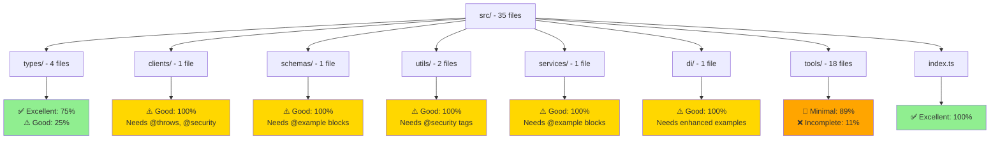
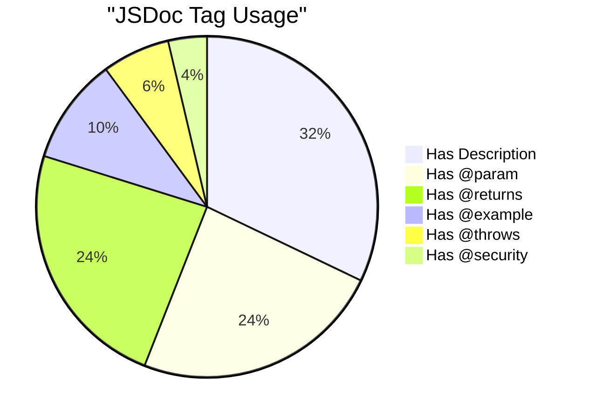
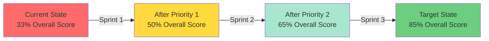

# JSDoc Coverage Visualization

**European Parliament MCP Server**  
**Analysis Date:** 2024-12-19

---

## 📊 Overall Coverage Distribution

```
Files by Documentation Quality
────────────────────────────────────────────────────────────

✅ Excellent (11%)    ████░░░░░░░░░░░░░░░░░░░░░░░░░░░░░░░░░░░░
⚠️ Good (20%)        ████████░░░░░░░░░░░░░░░░░░░░░░░░░░░░░░░░
🔧 Minimal (46%)     ██████████████████░░░░░░░░░░░░░░░░░░░░░░
❌ Incomplete (23%)  █████████░░░░░░░░░░░░░░░░░░░░░░░░░░░░░░░

                     0%        25%        50%        75%       100%
```

---

## 🗂️ Coverage by Directory



---

## 📈 Documentation Quality Funnel

```
Documentation Completeness Funnel
──────────────────────────────────────────────────────────────

Has File-Level JSDoc         ████████████████████████████████ 100% (35/35)
Has Function JSDoc           ██████████████████████          75% (26/35)
Has @param Tags              ████████████████████            75% (26/35)
Has @returns Tags            ████████████████████            75% (26/35)
Has @example Blocks          ████████                        30% (11/35)
Has @throws Tags             ████                            20% (7/35)
Has @security Tags           ██                              11% (4/35)

                             0%      25%      50%      75%     100%
```

---

## 🎯 Priority Files Heat Map

### Critical Path (Must Document First)

```
Priority 1: API Client & Core Types
┌─────────────────────────────────────────────────┐
│ europeanParliamentClient.ts      ⚠️ HIGH        │
│   └─ getMEPs()                   🔧 Missing     │
│   └─ getMEPDetails()             🔧 Missing     │
│   └─ getPlenarySessions()        🔧 Missing     │
│   └─ getVotingRecords()          🔧 Missing     │
│   └─ searchDocuments()           🔧 Missing     │
│   └─ getCommitteeInfo()          🔧 Missing     │
│   └─ getParliamentaryQuestions() 🔧 Missing     │
│                                                  │
│ europeanParliament.ts            ⚠️ MEDIUM      │
│   └─ MEP interface               🔧 Needs @example│
│   └─ MEPDetails interface        🔧 Needs @example│
│   └─ PlenarySession interface    🔧 Needs @example│
│   └─ VotingRecord interface      🔧 Needs @example│
└─────────────────────────────────────────────────┘

Priority 2: Security & Validation
┌─────────────────────────────────────────────────┐
│ auditLogger.ts                   ⚠️ HIGH        │
│   └─ logDataAccess()             🔧 Missing @security│
│   └─ logError()                  🔧 Missing @example │
│                                                  │
│ rateLimiter.ts                   ⚠️ MEDIUM      │
│   └─ removeTokens()              🔧 Missing @example │
│   └─ tryRemoveTokens()           🔧 Missing @example │
│                                                  │
│ schemas/europeanParliament.ts    ⚠️ MEDIUM      │
│   └─ All schemas                 🔧 Missing @example │
└─────────────────────────────────────────────────┘

Priority 3: Tools & Advanced Features
┌─────────────────────────────────────────────────┐
│ tools/*.ts (10 files)            🔧 LOW         │
│   └─ All handlers                🔧 Missing @throws │
│   └─ All handlers                🔧 Missing @security│
│                                                  │
│ trackLegislation/* (4 files)     🔧 LOW         │
│ generateReport/* (4 files)       🔧 LOW         │
└─────────────────────────────────────────────────┘
```

---

## 🔍 Documentation Element Coverage



---

## 📊 Files by Documentation Score

```
Documentation Score Distribution
(Score = presence of @param, @returns, @example, @throws, @security)

Score 5/5 (Excellent) ✅
├─ index.ts
├─ types/index.ts
├─ types/branded.ts
└─ types/errors.ts

Score 3-4/5 (Good) ⚠️
├─ clients/europeanParliamentClient.ts
├─ schemas/europeanParliament.ts
├─ utils/rateLimiter.ts
├─ utils/auditLogger.ts
├─ services/MetricsService.ts
├─ di/container.ts
└─ types/europeanParliament.ts

Score 1-2/5 (Minimal) 🔧
├─ tools/getMEPs.ts
├─ tools/getMEPDetails.ts
├─ tools/getPlenarySessions.ts
├─ tools/getVotingRecords.ts
├─ tools/searchDocuments.ts
├─ tools/getCommitteeInfo.ts
├─ tools/getParliamentaryQuestions.ts
├─ tools/analyzeVotingPatterns.ts
├─ tools/trackLegislation/index.ts
├─ tools/trackLegislation/types.ts
├─ tools/trackLegislation/procedureTracker.ts
├─ tools/trackLegislation/timelineBuilder.ts
├─ tools/generateReport/index.ts
├─ tools/generateReport/types.ts
├─ tools/generateReport/reportBuilders.ts
└─ tools/generateReport/reportGenerators.ts

Score 0/5 (Incomplete) ❌
└─ [None - all files have at least basic JSDoc]
```

---

## 🎯 Missing Documentation by Type

```
Missing JSDoc Elements
─────────────────────────────────────────────────────

@throws Tags Missing      ████████████████████████████ 80% (28 files)
@example Blocks Missing   ██████████████████████████  70% (24 files)
@security Tags Missing    ████████████████████████████ 89% (31 files)
Parameter Details Missing ████████████████            46% (16 files)
Return Details Missing    ████████████████            46% (16 files)

                          0%     25%     50%     75%    100%
```

---

## 🚀 Sprint Planning Visualization

```
Sprint 1 (Current)                Sprint 2                Sprint 3
┌──────────────────┐             ┌──────────────────┐    ┌──────────────────┐
│ Priority 1 Files │             │ Priority 2 Files │    │ Priority 3 Files │
│                  │             │                  │    │                  │
│ ✅ Complete:  0  │             │ ✅ Complete:  0  │    │ ✅ Complete:  0  │
│ 🚧 In Progress: 0│             │ 🚧 In Progress: 0│    │ 🚧 In Progress: 0│
│ 📋 Planned: 3    │             │ 📋 Planned: 3    │    │ 📋 Planned: 4    │
│                  │             │                  │    │                  │
│ Target: 100%     │  ────────>  │ Target: 100%     │ -> │ Target: 100%     │
│ Current: 30%     │             │ Current: 40%     │    │ Current: 20%     │
└──────────────────┘             └──────────────────┘    └──────────────────┘

Estimated Completion: End of Q1 2025
```

---

## 📊 Code Quality Metrics

```
JSDoc Quality Score by Metric
──────────────────────────────────────────────────

Completeness        ██████████████░░░░░░░░░░  60%  (param, returns present)
Examples            ████████░░░░░░░░░░░░░░░░  30%  (example blocks present)
Error Handling      ████░░░░░░░░░░░░░░░░░░░░  20%  (@throws documented)
Security Notes      ██░░░░░░░░░░░░░░░░░░░░░░  11%  (@security tags present)
Cross-References    ██████████░░░░░░░░░░░░░░  45%  (@see links present)

Overall Score       ██████████████░░░░░░░░░░  33%  (weighted average)

                    0%     25%     50%     75%    100%
```

---

## 🎯 Target vs Current State



---

## 📈 Progress Tracking

| Metric | Current | Target | Progress |
|--------|---------|--------|----------|
| Files with Complete JSDoc | 4/35 (11%) | 30/35 (85%) | ██░░░░░░░░░░ 13% |
| Functions with @example | 11/35 (31%) | 30/35 (85%) | ████░░░░░░░░ 36% |
| Functions with @throws | 7/35 (20%) | 30/35 (85%) | ███░░░░░░░░░ 24% |
| Functions with @security | 4/35 (11%) | 15/35 (43%) | ███░░░░░░░░░ 27% |
| **Overall Score** | **33%** | **85%** | ████░░░░░░░░ **39%** |

---

## 🔍 File-Level Detail Matrix

| File | @param | @returns | @example | @throws | @security | Score |
|------|--------|----------|----------|---------|-----------|-------|
| index.ts | ✅ | ✅ | ✅ | ✅ | ✅ | 5/5 |
| types/index.ts | ✅ | ✅ | ✅ | ✅ | ✅ | 5/5 |
| types/branded.ts | ✅ | ✅ | ✅ | ✅ | ✅ | 5/5 |
| types/errors.ts | ✅ | ✅ | ✅ | ✅ | ✅ | 5/5 |
| clients/europeanParliamentClient.ts | ✅ | ✅ | ⚠️ | ❌ | ❌ | 2/5 |
| types/europeanParliament.ts | ⚠️ | ✅ | ❌ | ❌ | ❌ | 1/5 |
| schemas/europeanParliament.ts | ✅ | ✅ | ❌ | ❌ | ❌ | 2/5 |
| utils/rateLimiter.ts | ✅ | ✅ | ❌ | ⚠️ | ❌ | 2/5 |
| utils/auditLogger.ts | ✅ | ✅ | ❌ | ❌ | ❌ | 2/5 |
| services/MetricsService.ts | ✅ | ✅ | ❌ | ❌ | ❌ | 2/5 |
| di/container.ts | ✅ | ✅ | ✅ | ❌ | ❌ | 3/5 |
| tools/*.ts (10 files) | ✅ | ✅ | ✅ | ❌ | ❌ | 3/5 |
| tools/trackLegislation/* | ⚠️ | ⚠️ | ❌ | ❌ | ❌ | 1/5 |
| tools/generateReport/* | ⚠️ | ⚠️ | ❌ | ❌ | ❌ | 1/5 |

**Legend:**
- ✅ Complete
- ⚠️ Partial
- ❌ Missing

---

## 🎯 Action Items Summary

```
Immediate Actions (Sprint 1)
┌─────────────────────────────────────────┐
│ 1. Add @throws to API client methods   │ ⚠️ HIGH (2h)
│ 2. Add @example to API client methods  │ ⚠️ HIGH (4h)
│ 3. Add @security to audit logger       │ ⚠️ HIGH (2h)
│ 4. Complete interface property docs    │ ⚠️ HIGH (3h)
│ 5. Add @throws to all tool handlers    │ ⚠️ MEDIUM (3h)
└─────────────────────────────────────────┘

Quick Wins (Can do today)
┌─────────────────────────────────────────┐
│ 1. Add @security tags (30 min)         │
│ 2. Add missing @throws (1 hour)        │
│ 3. Cross-link related types (30 min)   │
└─────────────────────────────────────────┘
```

---

**Generated by:** Documentation Writer Agent  
**Visualization Version:** 1.0  
**Last Updated:** 2024-12-19

*For detailed analysis, see [JSDOC_COVERAGE_REPORT.md](../JSDOC_COVERAGE_REPORT.md)*
