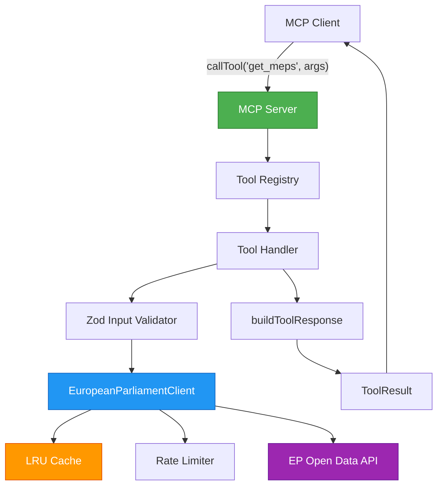

# Tool Development Guide

Step-by-step guide for adding new MCP tools to the European Parliament MCP Server.

## Table of Contents

- [Overview](#overview)
- [Architecture](#architecture)
- [Step-by-Step: Create a New Tool](#step-by-step-create-a-new-tool)
  - [1. Create the Tool File](#1-create-the-tool-file)
  - [2. Define the Zod Input Schema](#2-define-the-zod-input-schema)
  - [3. Implement the Handler](#3-implement-the-handler)
  - [4. Export Tool Metadata](#4-export-tool-metadata)
  - [5. Register in the Server](#5-register-in-the-server)
- [JSDoc Pattern](#jsdoc-pattern)
- [Accessing the EP Client](#accessing-the-ep-client)
- [Response Builder](#response-builder)
- [Error Handling](#error-handling)
- [Testing Requirements](#testing-requirements)
- [Security Checklist](#security-checklist)
- [Complete Example: `getMEPs.ts`](#complete-example-getmepsts)

---

## Overview

Each MCP tool is a self-contained TypeScript module that:

1. Validates input with a **Zod schema**
2. Calls the **EP API client** to fetch parliamentary data
3. Returns a **MCP-compliant `ToolResult`** via `buildToolResponse()`
4. Is **registered in `src/server/`** with its name, description, and input schema

All tools follow the same contract:

```typescript
export async function handleMyTool(args: unknown): Promise<ToolResult>
export const myToolMetadata: { name: string; description: string; inputSchema: object }
```

---

## Architecture



The key participants:

| Component | Location | Responsibility |
|-----------|----------|----------------|
| Tool handler | `src/tools/myTool.ts` | Input validation, API call, response build |
| Zod schema | `src/schemas/europeanParliament.ts` | Runtime input/output type validation |
| EP client | `src/clients/europeanParliamentClient.ts` | Cached, rate-limited API calls |
| Response builder | `src/tools/shared/responseBuilder.ts` | Formats `ToolResult` with JSON content |
| Server registration | `src/server/` | Maps tool name to handler at startup |

---

## Step-by-Step: Create a New Tool

### 1. Create the Tool File

Create `src/tools/myNewTool.ts`:

```typescript
/**
 * MCP Tool: my_new_tool
 *
 * One-line description of what this tool does.
 *
 * **Intelligence Perspective:** How intelligence analysts use this tool.
 *
 * **Business Perspective:** Business value and use-cases.
 *
 * **Marketing Perspective:** Value to journalists, researchers, or civic tech devs.
 *
 * ISMS Policy: SC-002 (Input Validation), AC-003 (Least Privilege)
 */

import { MyNewToolSchema } from '../schemas/europeanParliament.js';
import { epClient } from '../clients/europeanParliamentClient.js';
import { buildToolResponse } from './shared/responseBuilder.js';
import type { ToolResult } from './shared/types.js';
```

> **File naming convention**: use camelCase matching the tool's handler export:
> `getMyData.ts` → `handleGetMyData` + `getMyDataToolMetadata`.

---

### 2. Define the Zod Input Schema

Add your schema to `src/schemas/europeanParliament.ts`:

```typescript
/**
 * Input schema for the my_new_tool MCP tool.
 *
 * @example
 * ```typescript
 * const params = MyNewToolSchema.parse({ subject: "example", limit: 20 });
 * ```
 */
export const MyNewToolSchema = z.object({
  subject: z.string()
    .min(1)
    .max(200)
    .describe('Subject identifier or search term'),
  limit: z.number()
    .int()
    .min(1)
    .max(100)
    .default(50)
    .describe('Maximum number of results to return (1–100)'),
  offset: z.number()
    .int()
    .min(0)
    .default(0)
    .describe('Pagination offset'),
});

export type MyNewToolParams = z.infer<typeof MyNewToolSchema>;
```

**Key rules:**
- Always use `.describe()` on every field — this drives the MCP `inputSchema` docs
- Always set sensible defaults with `.default()`
- Enforce minimum/maximum constraints that match EP API limits
- Use `z.string().min(1)` — never allow empty strings

---

### 3. Implement the Handler

```typescript
/**
 * My new tool handler
 *
 * Fetches data from the EP API and returns validated results.
 *
 * @param args - Tool arguments (validated against MyNewToolSchema)
 * @returns MCP ToolResult containing the fetched data as JSON
 * @throws {Error} When the EP API request fails
 * @throws {ZodError} When input validation fails (thrown by schema.parse)
 *
 * @example
 * ```typescript
 * const result = await handleMyNewTool({ subject: "ENVI", limit: 10 });
 * ```
 *
 * @security Input is validated by Zod before any API call. Errors are
 * sanitized to avoid leaking internal implementation details.
 * ISMS Policy: SC-002, AC-003
 */
export async function handleMyNewTool(args: unknown): Promise<ToolResult> {
  // Step 1: Validate input — throws ZodError on invalid args
  const params = MyNewToolSchema.parse(args);

  try {
    // Step 2: Call the EP API client
    const result = await epClient.someMethod({
      subject: params.subject,
      limit: params.limit,
      offset: params.offset,
    });

    // Step 3: Return via buildToolResponse — never return raw objects
    return buildToolResponse(result);
  } catch (error) {
    // Step 4: Sanitize error message — don't expose internal details
    const errorMessage = error instanceof Error ? error.message : 'Unknown error';
    throw new Error(`Failed to fetch data: ${errorMessage}`);
  }
}
```

**Key patterns:**
- `const params = MySchema.parse(args)` — always the first line of the handler
- Wrap the API call in `try/catch` to sanitize errors
- Use `buildToolResponse(result)` for success — **never** return `{ content: [...] }` manually
- Re-throw with a descriptive message: `throw new Error('Failed to ...: ' + errorMessage)`

---

### 4. Export Tool Metadata

Append to the same file:

```typescript
/**
 * Tool metadata for MCP registration.
 *
 * The `description` is shown to AI assistants — make it a single paragraph
 * that explains what the tool does and what parameters it accepts.
 * The `inputSchema` drives client-side validation and UI rendering.
 */
export const myNewToolMetadata = {
  name: 'my_new_tool',
  description:
    'Fetch data from the European Parliament API by subject. '
    + 'Returns paginated results including title, date, and reference. '
    + 'Supports filtering by limit and offset for pagination.',
  inputSchema: {
    type: 'object' as const,
    properties: {
      subject: {
        type: 'string',
        description: 'Subject identifier or search term',
        minLength: 1,
        maxLength: 200,
      },
      limit: {
        type: 'number',
        description: 'Maximum number of results to return (1–100)',
        minimum: 1,
        maximum: 100,
        default: 50,
      },
      offset: {
        type: 'number',
        description: 'Pagination offset',
        minimum: 0,
        default: 0,
      },
    },
    required: ['subject'],
  },
};
```

**Best practices:**
- Tool `name` uses `snake_case` matching the EP convention
- `description` is one rich paragraph — no bullet points (AI models read it as prose)
- `inputSchema` mirrors Zod schema exactly — keep them in sync
- `required` lists only truly mandatory parameters

---

### 5. Register in the Server

Open `src/server/` (e.g., `toolRegistry.ts` or the appropriate server file) and add:

```typescript
import {
  handleMyNewTool,
  myNewToolMetadata,
} from '../tools/myNewTool.js';

// In the tools array:
export const allTools = [
  // ... existing tools ...
  { metadata: myNewToolMetadata, handler: handleMyNewTool },
];
```

Then add the routing case where tool calls are dispatched:

```typescript
case 'my_new_tool':
  return handleMyNewTool(request.params.arguments);
```

---

## JSDoc Pattern

All public functions and exported constants use a **three-perspective JSDoc** pattern
aligned with Hack23 ISMS policies:

```typescript
/**
 * MCP Tool: tool_name_here
 *
 * [One sentence summary of what the tool does.]
 *
 * **Intelligence Perspective:** [How OSINT analysts use this — SIGINT/HUMINT framing]
 *
 * **Business Perspective:** [B2G/B2B/B2C use-cases, ROI framing]
 *
 * **Marketing Perspective:** [Value to journalists, researchers, civic tech devs]
 *
 * ISMS Policy: SC-002 (Input Validation), AC-003 (Least Privilege)
 */
```

For handler functions, the full JSDoc pattern is:

```typescript
/**
 * [Function description in one rich paragraph.]
 *
 * **Intelligence Use Cases:** [...]
 * **Business Use Cases:** [...]
 *
 * @param args - Tool arguments matching the input schema
 * @returns MCP ToolResult containing [describe data shape]
 * @throws {Error} When the EP API request fails or returns an error
 * @throws {ZodError} When input validation fails
 *
 * @example
 * ```typescript
 * const result = await handleMyTool({ myParam: "value" });
 * const data = JSON.parse(result.content[0].text);
 * ```
 *
 * @security [Describe security controls — Zod validation, error sanitization, ISMS refs]
 */
```

---

## Accessing the EP Client

The singleton `epClient` is imported from the facade:

```typescript
import { epClient } from '../clients/europeanParliamentClient.js';
```

The client provides these method groups:

| Category | Methods |
|----------|---------|
| **MEPs** | `getMEPs()`, `getMEPDetails()`, `getCurrentMEPs()`, `getIncomingMEPs()`, `getOutgoingMEPs()`, `getHomonymMEPs()`, `getMEPDeclarations()` |
| **Plenary** | `getPlenarySessions()`, `getMeetingById()`, `getMeetingActivities()`, `getMeetingDecisions()`, `getMeetingForeseenActivities()` |
| **Voting** | `getVotingRecords()` |
| **Committees** | `getCommitteeInfo()`, `getCommitteeDocuments()` |
| **Documents** | `searchDocuments()`, `getDocumentById()`, `getAdoptedTexts()`, `getPlenaryDocuments()`, `getPlenarySessionDocuments()`, `getPlenarySessionDocumentItems()`, `getExternalDocuments()` |
| **Legislative** | `getProcedures()`, `getProcedureById()`, `getProcedureEvents()` |
| **Questions** | `getParliamentaryQuestions()` |
| **Vocabulary** | `getControlledVocabularies()` |
| **Speeches** | `getSpeeches()` |

All methods:
- Return typed promises (`Promise<PaginatedResponse<T>>` or `Promise<T>`)
- Cache responses automatically (15-minute TTL, 500 LRU entries)
- Enforce the shared rate-limit budget (100 requests/15 min)
- Are safe to call concurrently — the rate-limiter handles contention

---

## Response Builder

Always use `buildToolResponse()` to format successful responses:

```typescript
import { buildToolResponse } from './shared/responseBuilder.js';

// Any serializable value is accepted
return buildToolResponse(myData);

// The result shape is:
// {
//   content: [{ type: "text", text: JSON.stringify(myData, null, 2) }]
// }
```

**Never** manually construct `{ content: [...] }` — `buildToolResponse` handles
JSON serialization, `null` safety, and future format changes.

---

## Error Handling

Follow the **two-layer error pattern**:

```typescript
export async function handleMyTool(args: unknown): Promise<ToolResult> {
  // Layer 1 — input validation (ZodError thrown automatically)
  const params = MySchema.parse(args);

  try {
    // Layer 2 — API/business logic
    const result = await epClient.someMethod(params);
    return buildToolResponse(result);
  } catch (error) {
    // Sanitize: extract message, discard stack trace and internal details
    const errorMessage = error instanceof Error ? error.message : 'Unknown error';
    throw new Error(`Failed to fetch [resource]: ${errorMessage}`);
  }
}
```

**Do not:**
- Expose stack traces to callers
- Expose internal URLs, tokens, or implementation details
- Swallow errors silently — always re-throw with context

---

## Testing Requirements

Every new tool **must** have a companion test file `src/tools/myNewTool.test.ts`
that achieves **80%+ coverage** (95%+ for security-critical paths):

```typescript
import { describe, it, expect, vi, beforeEach } from 'vitest';
import { handleMyNewTool } from './myNewTool.js';

// Mock the EP client to avoid real API calls in unit tests
vi.mock('../clients/europeanParliamentClient.js', () => ({
  epClient: {
    someMethod: vi.fn(),
  },
}));

import { epClient } from '../clients/europeanParliamentClient.js';

describe('handleMyNewTool', () => {
  beforeEach(() => {
    vi.clearAllMocks();
  });

  it('returns formatted result for valid input', async () => {
    const mockData = { data: [{ id: '1', title: 'Test' }], total: 1 };
    vi.mocked(epClient.someMethod).mockResolvedValue(mockData);

    const result = await handleMyNewTool({ subject: 'ENVI', limit: 10 });

    expect(result.content).toHaveLength(1);
    expect(result.content[0].type).toBe('text');
    const parsed = JSON.parse(result.content[0].text);
    expect(parsed.total).toBe(1);
  });

  it('throws descriptive error when API fails', async () => {
    vi.mocked(epClient.someMethod).mockRejectedValue(new Error('Network error'));

    await expect(handleMyNewTool({ subject: 'ENVI' }))
      .rejects.toThrow('Failed to fetch data: Network error');
  });

  it('throws ZodError for invalid input', async () => {
    await expect(handleMyNewTool({ subject: '' }))
      .rejects.toThrow();
  });

  it('applies default limit when not specified', async () => {
    const mockData = { data: [], total: 0 };
    vi.mocked(epClient.someMethod).mockResolvedValue(mockData);

    await handleMyNewTool({ subject: 'ENVI' });

    expect(epClient.someMethod).toHaveBeenCalledWith(
      expect.objectContaining({ limit: 50 })
    );
  });
});
```

**Required test cases for every tool:**
1. ✅ Valid input returns correctly structured `ToolResult`
2. ✅ API failure throws descriptive error (sanitized message)
3. ✅ Invalid/empty input throws `ZodError`
4. ✅ Default parameter values are applied correctly
5. ✅ Required parameters are enforced
6. ✅ Boundary values are handled (min/max limit, empty results)

---

## Security Checklist

Before opening a PR for a new tool, verify:

- [ ] Input validated with Zod schema (`schema.parse(args)` as first line)
- [ ] All string inputs have `min(1)` and `max()` bounds
- [ ] Numeric inputs have `min()` / `max()` constraints
- [ ] Error messages don't expose stack traces, internal URLs, or secrets
- [ ] No `console.log` of user inputs or API responses
- [ ] Tool handler annotated with `ISMS Policy: SC-002, AC-003`
- [ ] JSDoc includes `@security` tag explaining controls
- [ ] Tests cover invalid input and API failure scenarios
- [ ] Tool description doesn't reference internal implementation details

---

## Complete Example: `getMEPs.ts`

The following is a condensed reference implementation showing all the patterns together:

```typescript
/**
 * MCP Tool: get_meps
 *
 * Retrieve Members of European Parliament with filtering options.
 *
 * **Intelligence Perspective:** Foundation for MEP profiling, political group
 * cohesion analysis, national delegation mapping, and cross-party alliance
 * detection via OSINT methodologies.
 *
 * **Business Perspective:** Core data product for B2G/B2B customers requiring
 * MEP contact databases, political risk assessments, and stakeholder mapping.
 *
 * **Marketing Perspective:** Primary showcase tool demonstrating API value
 * to journalists, researchers, and civic tech developers.
 *
 * ISMS Policy: SC-002 (Input Validation), AC-003 (Least Privilege)
 */

import { GetMEPsSchema, MEPSchema, PaginatedResponseSchema } from '../schemas/europeanParliament.js';
import { epClient } from '../clients/europeanParliamentClient.js';
import { buildToolResponse } from './shared/responseBuilder.js';
import type { ToolResult } from './shared/types.js';

/**
 * Get MEPs tool handler
 *
 * Retrieves MEP data with filtering, validation, and GDPR-compliant
 * response formatting.
 *
 * @param args - Tool arguments matching GetMEPsSchema
 * @returns MCP ToolResult containing paginated MEP list as JSON
 * @throws {Error} When the EP API request fails
 * @throws {ZodError} When input validation fails
 *
 * @example
 * ```typescript
 * // Get Swedish MEPs
 * const result = await handleGetMEPs({ country: "SE", limit: 10 });
 *
 * // Get MEPs by political group
 * const result = await handleGetMEPs({ group: "EPP", active: true });
 * ```
 *
 * @security Input is validated by Zod. Errors are sanitized to avoid
 * leaking internal details. Personal data access is audit-logged per
 * GDPR Article 30. ISMS Policy: SC-002, AC-003
 */
export async function handleGetMEPs(args: unknown): Promise<ToolResult> {
  // Validate input — throws ZodError on invalid args
  const params = GetMEPsSchema.parse(args);

  try {
    const apiParams: Record<string, unknown> = {
      active: params.active,
      limit: params.limit,
      offset: params.offset,
    };
    if (params.country !== undefined) apiParams['country'] = params.country;
    if (params.group !== undefined) apiParams['group'] = params.group;
    if (params.committee !== undefined) apiParams['committee'] = params.committee;

    const result = await epClient.getMEPs(
      apiParams as Parameters<typeof epClient.getMEPs>[0]
    );

    // Validate output schema before returning
    const validated = PaginatedResponseSchema(MEPSchema).parse(result);

    return buildToolResponse(validated);
  } catch (error) {
    const errorMessage = error instanceof Error ? error.message : 'Unknown error';
    throw new Error(`Failed to retrieve MEPs: ${errorMessage}`);
  }
}

export const getMEPsToolMetadata = {
  name: 'get_meps',
  description:
    'Retrieve Members of European Parliament with optional filters (country, '
    + 'political group, committee, active status). Returns paginated results with '
    + 'MEP details including name, country, political group, committees, and '
    + 'contact information.',
  inputSchema: {
    type: 'object' as const,
    properties: {
      country: {
        type: 'string',
        description: 'ISO 3166-1 alpha-2 country code (e.g., "SE" for Sweden)',
        pattern: '^[A-Z]{2}$',
        minLength: 2,
        maxLength: 2,
      },
      group: {
        type: 'string',
        description: 'Political group identifier (e.g., "EPP", "S&D")',
        minLength: 1,
        maxLength: 50,
      },
      committee: {
        type: 'string',
        description: 'Committee identifier (e.g., "ENVI", "AGRI")',
        minLength: 1,
        maxLength: 100,
      },
      active: {
        type: 'boolean',
        description: 'Filter by active status',
        default: true,
      },
      limit: {
        type: 'number',
        description: 'Maximum results to return (1–100)',
        minimum: 1,
        maximum: 100,
        default: 50,
      },
      offset: {
        type: 'number',
        description: 'Pagination offset',
        minimum: 0,
        default: 0,
      },
    },
  },
};
```

---

## Resources

- [MCP Specification — Tools](https://spec.modelcontextprotocol.io/specification/server/tools/)
- [Zod Documentation](https://zod.dev/)
- [EP Open Data API](https://data.europarl.europa.eu/en/developer-corner)
- [Hack23 ISMS — Secure Development Policy](https://github.com/Hack23/ISMS-PUBLIC/blob/main/Secure_Development_Policy.md)
- [TypeDoc JSDoc Reference](https://typedoc.org/guides/doccomments/)
