  

<h1 align="center">🏛️ European Parliament MCP Server — Architecture</h1>

  <strong>Model Context Protocol Server for European Parliament Open Data</strong> 
  <em>C4 Architecture Documentation — 28 Tools, 6 Resources, 6 Prompts</em>

  
  
  
  

**📋 Document Owner:** Architecture Team | **📄 Version:** 0.6.2 | **📅 Last Updated:** 2025-06-20 (UTC)  
**🔄 Review Cycle:** Quarterly | **⏰ Next Review:** 2025-09-20  
**🏷️ Classification:** Public (Open Source MCP Server)  
**✅ ISMS Compliance:** ISO 27001 (A.5.1, A.8.1, A.14.2), NIST CSF 2.0 (ID.AM, PR.DS), CIS Controls v8.1 (2.1, 16.1)

---

## 📋 Table of Contents

1. [Architecture Documentation Map](#architecture-documentation-map)
2. [Executive Summary](#executive-summary)
3. [C4 System Context Diagram](#c4-system-context-diagram)
4. [C4 Container Diagram](#c4-container-diagram)
5. [C4 Component Diagram — Tool Engine](#c4-component-diagram--tool-engine)
6. [MCP Protocol Surface](#mcp-protocol-surface)
7. [Data Flow](#data-flow)
8. [Technology Stack](#technology-stack)
9. [Security Architecture](#security-architecture)
10. [Performance Architecture](#performance-architecture)
11. [ISMS Compliance](#isms-compliance)
12. [Related Documentation](#related-documentation)

---

## 🗺️ Architecture Documentation Map

| Document | Current | Future | Description |
|----------|---------|--------|-------------|
| **Architecture** | [ARCHITECTURE.md](./ARCHITECTURE.md) | [FUTURE_ARCHITECTURE.md](./FUTURE_ARCHITECTURE.md) | C4 model, containers, components |
| **Mind Map** | [MINDMAP.md](./MINDMAP.md) | [FUTURE_MINDMAP.md](./FUTURE_MINDMAP.md) | System concepts and relationships |
| **SWOT Analysis** | [SWOT.md](./SWOT.md) | [FUTURE_SWOT.md](./FUTURE_SWOT.md) | Strategic positioning |
| **Data Model** | [DATA_MODEL.md](./DATA_MODEL.md) | [FUTURE_DATA_MODEL.md](./FUTURE_DATA_MODEL.md) | Entity relationships and schemas |
| **Flowchart** | [FLOWCHART.md](./FLOWCHART.md) | [FUTURE_FLOWCHART.md](./FUTURE_FLOWCHART.md) | Business process flows |
| **State Diagram** | [STATEDIAGRAM.md](./STATEDIAGRAM.md) | [FUTURE_STATEDIAGRAM.md](./FUTURE_STATEDIAGRAM.md) | System state transitions |
| **Workflows** | [WORKFLOWS.md](./WORKFLOWS.md) | [FUTURE_WORKFLOWS.md](./FUTURE_WORKFLOWS.md) | CI/CD pipeline documentation |
| **Security Architecture** | [SECURITY_ARCHITECTURE.md](./SECURITY_ARCHITECTURE.md) | [FUTURE_SECURITY_ARCHITECTURE.md](./FUTURE_SECURITY_ARCHITECTURE.md) | Security controls and design |
| **Threat Model** | [THREAT_MODEL.md](./THREAT_MODEL.md) | — | STRIDE-based threat analysis |
| **CRA Assessment** | [CRA-ASSESSMENT.md](./CRA-ASSESSMENT.md) | — | EU Cyber Resilience Act review |
| **Architecture Diagrams** | [ARCHITECTURE_DIAGRAMS.md](./ARCHITECTURE_DIAGRAMS.md) | — | Supplementary C4 diagrams |

---

## 🎯 Executive Summary

The **European Parliament MCP Server** (v0.6.2) is a TypeScript/Node.js [Model Context Protocol](https://spec.modelcontextprotocol.io/) server that provides AI assistants with structured, type-safe access to European Parliament open data. It exposes **28 MCP tools** (7 core data access + 21 advanced/OSINT intelligence), **6 resource templates**, and **6 prompt templates** — all backed by a centralized EP API client with LRU caching, Zod input validation, rate limiting, and GDPR-compliant audit logging.

### Key Capabilities

| Capability | Count | Description |
|------------|-------|-------------|
| 🔧 **MCP Tools** | 28 | Core data access + OSINT intelligence analysis |
| 📄 **MCP Resources** | 6 | URI-based read access to parliamentary entities |
| 💬 **MCP Prompts** | 6 | Pre-configured analysis templates for AI assistants |
| 🏛️ **EP API Endpoints** | 12+ | MEPs, plenary sessions, committees, votes, documents, speeches |
| 🔒 **Security Controls** | 4 layers | Zod validation, rate limiting, audit logging, GDPR compliance |

---

## 🏗️ C4 System Context Diagram

The system context shows the European Parliament MCP Server and its external actors.

```mermaid
C4Context
    title European Parliament MCP Server — System Context (v0.6.2)

    Person(aiClient, "AI/LLM Client", "Claude Desktop, Copilot, or any MCP-compatible AI assistant consuming parliamentary data")
    Person(developer, "Developer", "Integrates MCP server into applications, configures tools and resources")

    System(mcpServer, "European Parliament MCP Server", "TypeScript/Node.js MCP server exposing 28 tools, 6 resources, 6 prompts for EP open data access and OSINT intelligence analysis")

    System_Ext(epApi, "European Parliament Open Data Portal", "REST API v2 at data.europarl.europa.eu providing MEPs, plenary sessions, committees, votes, documents, speeches")
    System_Ext(npmRegistry, "npm Registry", "Package distribution for european-parliament-mcp-server")

    Rel(aiClient, mcpServer, "Calls tools, reads resources, uses prompts", "MCP over stdio")
    Rel(developer, mcpServer, "Configures, deploys, monitors", "CLI / npm")
    Rel(mcpServer, epApi, "Fetches parliamentary data", "HTTPS/REST JSON-LD")
    Rel(developer, npmRegistry, "Installs package", "npm install")

    UpdateRelStyle(aiClient, mcpServer, $offsetY="-30")
    UpdateRelStyle(mcpServer, epApi, $offsetY="20")
```

---

## 📦 C4 Container Diagram

The container diagram shows the major runtime components inside the MCP server.

```mermaid
C4Container
    title European Parliament MCP Server — Container Diagram (v0.6.2)

    Person(aiClient, "AI/LLM Client", "MCP-compatible assistant")

    System_Boundary(mcpBoundary, "European Parliament MCP Server") {
        Container(protocolHandler, "MCP Protocol Handler", "TypeScript, @modelcontextprotocol/sdk", "Handles MCP JSON-RPC over stdio transport; routes tool calls, resource reads, prompt requests")
        Container(toolEngine, "Tool Engine", "TypeScript, Zod", "28 MCP tools: 7 core + 21 advanced/OSINT intelligence; input validation, business logic, response formatting")
        Container(resourceHandler, "Resource Handler", "TypeScript", "6 URI-based resource templates providing read access to parliamentary entities (ep:// scheme)")
        Container(promptHandler, "Prompt Handler", "TypeScript", "6 prompt templates for structured analysis: briefings, coalition analysis, legislative tracking")
        Container(epClient, "EP API Client", "TypeScript, undici, lru-cache", "Centralized HTTP client with LRU cache (500 entries, 15-min TTL), rate limiting, error handling")
        Container(diContainer, "DI Container", "TypeScript", "Dependency injection container wiring all services")
        Container(infraLayer, "Infrastructure", "TypeScript", "Audit logger, rate limiter, performance monitoring, timeout handling, metrics service")
    }

    System_Ext(epApi, "EP Open Data API v2", "data.europarl.europa.eu/api/v2/")

    Rel(aiClient, protocolHandler, "MCP JSON-RPC", "stdio")
    Rel(protocolHandler, toolEngine, "Dispatches tool calls")
    Rel(protocolHandler, resourceHandler, "Dispatches resource reads")
    Rel(protocolHandler, promptHandler, "Dispatches prompt requests")
    Rel(toolEngine, epClient, "Fetches data via")
    Rel(resourceHandler, epClient, "Fetches data via")
    Rel(epClient, epApi, "REST requests", "HTTPS JSON-LD")
    Rel(toolEngine, infraLayer, "Uses validation, audit, rate limiting")
    Rel(epClient, infraLayer, "Uses rate limiter, timeout, metrics")

    UpdateRelStyle(aiClient, protocolHandler, $offsetY="-30")
    UpdateRelStyle(epClient, epApi, $offsetY="20")
```

---

## 🔧 C4 Component Diagram — Tool Engine

The Tool Engine contains all 28 MCP tools organized into four functional groups.

```mermaid
C4Component
    title Tool Engine — Component Diagram (28 Tools)

    Container_Boundary(toolEngine, "Tool Engine") {

        Component(coreTools, "Core Data Access Tools", "7 tools", "get_meps, get_mep_details, get_plenary_sessions, get_voting_records, search_documents, get_committee_info, get_parliamentary_questions")

        Component(osintTools, "OSINT Intelligence Tools", "10 tools", "assess_mep_influence, analyze_coalition_dynamics, detect_voting_anomalies, compare_political_groups, analyze_legislative_effectiveness, monitor_legislative_pipeline, analyze_committee_activity, track_mep_attendance, analyze_country_delegation, generate_political_landscape")

        Component(epDataTools, "EP Data Access Tools", "8 tools", "get_current_meps, get_speeches, get_procedures, get_adopted_texts, get_events, get_meeting_activities, get_meeting_decisions, get_mep_declarations")

        Component(advancedTools, "Advanced Analysis Tools", "3 tools", "analyze_voting_patterns, track_legislation, generate_report")
    }

    Container_Ext(epClient, "EP API Client", "Centralized HTTP client with LRU cache")
    Container_Ext(infraLayer, "Infrastructure", "Zod validation, audit logger, rate limiter")

    Rel(coreTools, epClient, "Queries EP data")
    Rel(osintTools, epClient, "Aggregates & analyzes EP data")
    Rel(epDataTools, epClient, "Queries new EP API v2 endpoints")
    Rel(advancedTools, epClient, "Complex multi-step analysis")
    Rel(coreTools, infraLayer, "Input validation, audit logging")
    Rel(osintTools, infraLayer, "Input validation, audit logging")
    Rel(epDataTools, infraLayer, "Input validation, audit logging")
    Rel(advancedTools, infraLayer, "Input validation, audit logging")
```

---

## 🔌 MCP Protocol Surface

### Tools (28 total)

#### Core Data Access Tools (7)

| Tool | Function | Description |
|------|----------|-------------|
| `get_meps` | `getMEPs` | List MEPs with country/group filters |
| `get_mep_details` | `getMEPDetails` | Detailed MEP profile by ID |
| `get_plenary_sessions` | `getPlenarySessions` | Plenary session listings |
| `get_voting_records` | `getVotingRecords` | Session voting records |
| `search_documents` | `searchDocuments` | Legislative document search |
| `get_committee_info` | `getCommitteeInfo` | Committee details |
| `get_parliamentary_questions` | `getParliamentaryQuestions` | Written/oral questions |

#### OSINT Intelligence Tools (10)

| Tool | Function | Description |
|------|----------|-------------|
| `assess_mep_influence` | `assessMepInfluence` | 5-dimension influence scoring model |
| `analyze_coalition_dynamics` | `analyzeCoalitionDynamics` | Coalition cohesion & stress analysis |
| `detect_voting_anomalies` | `detectVotingAnomalies` | Party defection & anomaly detection |
| `compare_political_groups` | `comparePoliticalGroups` | Cross-group comparative analysis |
| `analyze_legislative_effectiveness` | `analyzeLegislativeEffectiveness` | MEP/committee legislative scoring |
| `monitor_legislative_pipeline` | `monitorLegislativePipeline` | Pipeline status & bottleneck detection |
| `analyze_committee_activity` | `analyzeCommitteeActivity` | Committee workload & engagement |
| `track_mep_attendance` | `trackMepAttendance` | MEP attendance patterns & trends |
| `analyze_country_delegation` | `analyzeCountryDelegation` | Country delegation voting & composition |
| `generate_political_landscape` | `generatePoliticalLandscape` | Parliament-wide political landscape |

#### EP Data Access Tools (8)

| Tool | Function | Description |
|------|----------|-------------|
| `get_current_meps` | `getCurrentMEPs` | Currently serving MEPs |
| `get_speeches` | `getSpeeches` | Plenary speeches |
| `get_procedures` | `getProcedures` | Legislative procedures |
| `get_adopted_texts` | `getAdoptedTexts` | Adopted legislative texts |
| `get_events` | `getEvents` | Parliamentary events |
| `get_meeting_activities` | `getMeetingActivities` | Meeting activity records |
| `get_meeting_decisions` | `getMeetingDecisions` | Meeting decision outcomes |
| `get_mep_declarations` | `getMEPDeclarations` | MEP financial declarations |

#### Advanced Analysis Tools (3)

| Tool | Function | Description |
|------|----------|-------------|
| `analyze_voting_patterns` | `analyzeVotingPatterns` | Multi-session voting analysis |
| `track_legislation` | `trackLegislation` | End-to-end legislative tracking |
| `generate_report` | `generateReport` | Structured analysis report generation |

### Resources (6 templates)

| URI Template | Name | Description |
|-------------|------|-------------|
| `ep://meps` | MEP List | All Members of European Parliament |
| `ep://meps/{mepId}` | MEP Profile | Individual MEP details |
| `ep://committees/{committeeId}` | Committee Information | Committee details and membership |
| `ep://plenary-sessions` | Plenary Sessions | Session listings and schedules |
| `ep://votes/{sessionId}` | Voting Record | Session voting results |
| `ep://political-groups` | Political Groups | Party group listings |

### Prompts (6 templates)

| Prompt Name | Description | Key Arguments |
|-------------|-------------|---------------|
| `mep_briefing` | MEP intelligence briefing | `mepId` |
| `coalition_analysis` | Coalition dynamics analysis | `partyGroup` |
| `legislative_tracking` | Legislative pipeline tracking | `procedureId` |
| `political_group_comparison` | Political group comparison | `groups` |
| `committee_activity_report` | Committee activity analysis | `committeeId` |
| `voting_pattern_analysis` | Voting pattern detection | `mepId`, `sessionId` |

---

## 🔄 Data Flow

### Request Processing Flow

```mermaid
sequenceDiagram
    participant Client as MCP Client (AI/LLM)
    participant Protocol as MCP Protocol Handler
    participant Validator as Zod Input Validator
    participant RateLimiter as Rate Limiter
    participant Tool as Tool Handler
    participant Cache as LRU Cache (500 entries)
    participant API as EP Open Data API v2
    participant Audit as Audit Logger

    Client->>Protocol: MCP JSON-RPC Request (tool call)
    Protocol->>Validator: Validate input schema (Zod)
    Validator->>RateLimiter: Check rate limit
    RateLimiter->>Tool: Execute tool logic
    Tool->>Cache: Check LRU cache

    alt Cache Hit (TTL < 15 min)
        Cache-->>Tool: Return cached response
    else Cache Miss
        Cache->>API: HTTPS GET (JSON-LD)
        API-->>Cache: API response
        Cache->>Cache: Store (15-min TTL)
        Cache-->>Tool: Return fresh data
    end

    Tool->>Audit: Log access (GDPR compliance)
    Tool-->>Protocol: Formatted MCP response
    Protocol-->>Client: MCP JSON-RPC Response

    Note over Client,Audit: All requests audited · Read-only public data · No PII stored
```

---

## 🛠️ Technology Stack

### Runtime & Language

| Component | Technology | Version | Purpose |
|-----------|-----------|---------|---------|
| Runtime | Node.js | 24.x | JavaScript runtime |
| Language | TypeScript | 5.x | Type-safe development |
| Module System | ESM | ES2022 | Native ES modules |

### Core Dependencies

| Package | Purpose |
|---------|---------|
| `@modelcontextprotocol/sdk` | MCP protocol implementation (server, stdio transport) |
| `lru-cache` | In-memory LRU cache (500 entries, 15-min TTL) |
| `undici` | High-performance HTTP client for EP API |
| `zod` | Runtime input validation and schema definition |

### Type System

| Type | Module | Description |
|------|--------|-------------|
| `MEPID` | `src/types/branded.ts` | Branded type for MEP identifiers |
| `SessionID` | `src/types/branded.ts` | Branded type for session identifiers |
| `CommitteeID` | `src/types/branded.ts` | Branded type for committee identifiers |
| `DocumentID` | `src/types/branded.ts` | Branded type for document identifiers |
| `GroupID` | `src/types/branded.ts` | Branded type for political group identifiers |

### Testing

| Tool | Purpose |
|------|---------|
| Vitest | Unit, integration, E2E, and performance testing |
| Coverage target | 80%+ line coverage |
| Test types | Unit (`.test.ts`), integration, E2E (`vitest.e2e.config.ts`), performance |

### Development & Quality

| Tool | Purpose |
|------|---------|
| ESLint 9.x | Code quality and style enforcement |
| TypeDoc | API documentation generation |
| knip | Unused export/dependency detection |
| standardlint | Project standards enforcement |

### CI/CD Workflows (11)

| Workflow | File | Purpose |
|----------|------|---------|
| Test & Report | `test-and-report.yml` | Unit/integration tests, coverage reporting |
| CodeQL | `codeql.yml` | Static security analysis (SAST) |
| Release | `release.yml` | npm publish, GitHub Release |
| Integration Tests | `integration-tests.yml` | End-to-end EP API validation |
| SBOM Generation | `sbom-generation.yml` | CycloneDX software bill of materials |
| SLSA Provenance | `slsa-provenance.yml` | SLSA Level 3 build provenance |
| Scorecard | `scorecard.yml` | OpenSSF Scorecard supply chain audit |
| Dependency Review | `dependency-review.yml` | PR dependency change review |
| Labeler | `labeler.yml` | Automatic PR labeling |
| Setup Labels | `setup-labels.yml` | Repository label initialization |
| Copilot Setup | `copilot-setup-steps.yml` | GitHub Copilot MCP configuration |

---

## 🔒 Security Architecture

### Defense-in-Depth Layers

### Security Controls

| Layer | Control | Implementation |
|-------|---------|----------------|
| **Input** | Schema validation | Zod schemas for all 28 tool inputs |
| **Input** | Type safety | Branded types (MEPID, SessionID, CommitteeID, DocumentID, GroupID) |
| **Transport** | Rate limiting | Token bucket per client, configurable limits |
| **Transport** | Timeout handling | Request timeouts via `src/utils/timeout.ts` |
| **Data** | Read-only access | No write operations to EP API |
| **Data** | Public data only | No authentication secrets, no PII storage |
| **Audit** | Access logging | GDPR-compliant audit trail via `src/utils/auditLogger.ts` |
| **Supply Chain** | SBOM | CycloneDX format, generated per release |
| **Supply Chain** | Provenance | SLSA Level 3 build attestations |
| **Supply Chain** | Scorecard | OpenSSF Scorecard continuous monitoring |

### GDPR Compliance

- **Data Minimization**: Only public EP data accessed; no personal data stored
- **Audit Trail**: All data access logged with timestamps
- **No PII Storage**: Server is stateless; cache holds only public EP API responses
- **Right of Access**: Audit logs queryable for compliance requests

> 📖 See [SECURITY_ARCHITECTURE.md](./SECURITY_ARCHITECTURE.md) for full security design  
> 📖 See [THREAT_MODEL.md](./THREAT_MODEL.md) for STRIDE-based threat analysis

---

## ⚡ Performance Architecture

### Caching Strategy

| Tier | Technology | TTL | Max Entries | Purpose |
|------|-----------|-----|-------------|---------|
| **L1 — Memory** | LRU Cache (`lru-cache`) | 15 min | 500 | Fast access for repeated queries |

### Performance Targets

| Metric | Target | Measurement |
|--------|--------|-------------|
| P50 Response Time | <100ms | Cached requests |
| P95 Response Time | <200ms | Cache miss (EP API call) |
| P99 Response Time | <500ms | Complex OSINT analysis |
| Cache Hit Rate | >80% | Typical production usage |
| Memory Footprint | ~2.5 MB | LRU cache at capacity |

### Key Design Decisions

- **Single EP API Client**: Centralized in `src/clients/europeanParliamentClient.ts` — all tools share one cached client instance
- **DI Container**: `src/di/container.ts` wires dependencies; ensures single cache instance
- **Metrics Service**: `src/services/MetricsService.ts` tracks performance counters
- **Connection Reuse**: Undici HTTP client with keep-alive connections

> ⚡ See [PERFORMANCE_GUIDE.md](./PERFORMANCE_GUIDE.md) for optimization details  
> 📊 See [PERFORMANCE_MONITORING.md](./PERFORMANCE_MONITORING.md) for observability

---

## 🛡️ ISMS Compliance

### Policy Alignment

This architecture aligns with [Hack23 ISMS policies](https://github.com/Hack23/ISMS-PUBLIC):

| ISMS Policy | Requirement | Implementation |
|-------------|-------------|----------------|
| [Information Security Policy](https://github.com/Hack23/ISMS-PUBLIC/blob/main/Information_Security_Policy.md) | Risk-based security | Defense-in-depth, rate limiting, audit logging |
| [Secure Development Policy](https://github.com/Hack23/ISMS-PUBLIC/blob/main/Secure_Development_Policy.md) | Security by design | Zod validation, branded types, CodeQL SAST |
| [Open Source Policy](https://github.com/Hack23/ISMS-PUBLIC/blob/main/Open_Source_Policy.md) | Transparency & supply chain | SBOM, SLSA provenance, OpenSSF Scorecard |
| [Access Control Policy](https://github.com/Hack23/ISMS-PUBLIC/blob/main/Access_Control_Policy.md) | Least privilege | Read-only API access, rate limiting |
| [Business Continuity Plan](https://github.com/Hack23/ISMS-PUBLIC/blob/main/Business_Continuity_Plan.md) | Resilience | Graceful degradation, cache fallback |

### Compliance Framework Mapping

| Framework | Control | Implementation |
|-----------|---------|----------------|
| **ISO 27001** | A.8.1 — Asset management | All components documented in this architecture |
| **ISO 27001** | A.14.2 — Secure development | TypeScript strict mode, Zod validation, CodeQL |
| **ISO 27001** | A.12.4 — Logging & monitoring | Audit logger, metrics service |
| **NIST CSF 2.0** | ID.AM — Asset management | Architecture documentation map (above) |
| **NIST CSF 2.0** | PR.DS — Data security | Read-only access, no PII storage, cache TTL |
| **NIST CSF 2.0** | DE.CM — Continuous monitoring | OpenSSF Scorecard, Dependabot, CodeQL |
| **CIS Controls v8.1** | 2.1 — Software inventory | SBOM (CycloneDX), `package.json` locked |
| **CIS Controls v8.1** | 16.1 — Application security | Zod input validation, branded types |

---

## 🔗 Related Documentation

### Project Documentation

| Document | Description |
|----------|-------------|
| [README.md](./README.md) | Project overview, quick start, badges |
| [DEVELOPER_GUIDE.md](./DEVELOPER_GUIDE.md) | Development setup, contribution guide |
| [API_USAGE_GUIDE.md](./API_USAGE_GUIDE.md) | Tool usage examples and patterns |
| [DEPLOYMENT_GUIDE.md](./DEPLOYMENT_GUIDE.md) | Deployment and configuration |
| [LOCAL_TESTING.md](./LOCAL_TESTING.md) | Local development testing |
| [INTEGRATION_TESTING.md](./INTEGRATION_TESTING.md) | Integration test guide |
| [PERFORMANCE_GUIDE.md](./PERFORMANCE_GUIDE.md) | Performance optimization |
| [CONTRIBUTING.md](./CONTRIBUTING.md) | Contribution guidelines |
| [SECURITY.md](./SECURITY.md) | Vulnerability reporting policy |

### External References

| Resource | URL |
|----------|-----|
| EP Open Data Portal | https://data.europarl.europa.eu/ |
| EP Developer Corner | https://data.europarl.europa.eu/en/developer-corner |
| MCP Specification | https://spec.modelcontextprotocol.io/ |
| MCP SDK | https://github.com/modelcontextprotocol/sdk |
| OpenSSF Scorecard | https://securityscorecards.dev/ |
| SLSA Framework | https://slsa.dev/ |
| Hack23 ISMS Policies | https://github.com/Hack23/ISMS-PUBLIC |

---

  <strong>Built with ❤️ by <a href="https://hack23.com">Hack23 AB</a></strong> 
  <em>Architecture documentation following C4 model and ISMS standards</em>

