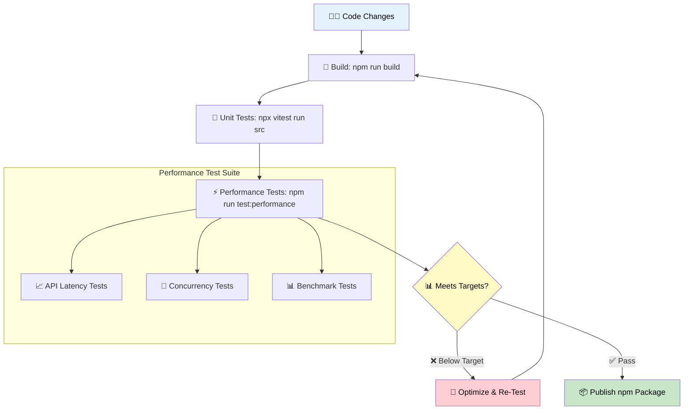

<p align="center">
  
</p>

<h1 align="center">⚡ European Parliament MCP Server — Performance Testing & Benchmarks</h1>

<p align="center">
  <strong>Comprehensive Performance Validation & Monitoring Framework</strong><br>
  <em>🚀 API Latency Targets • 📊 Throughput Benchmarks • 🧪 Automated Regression Prevention</em>
</p>

<p align="center">
  <a href="https://github.com/Hack23/European-Parliament-MCP-Server/actions"></a>
  <a href="https://scorecard.dev/viewer/?uri=github.com/Hack23/European-Parliament-MCP-Server"></a>
  <a href="https://sonarcloud.io/summary/new_code?id=Hack23_European-Parliament-MCP-Server"></a>
  <a href="https://www.npmjs.com/package/european-parliament-mcp-server"></a>
</p>

**🔐 ISMS Alignment:** This document follows [Hack23 Secure Development Policy](https://github.com/Hack23/ISMS-PUBLIC/blob/main/Secure_Development_Policy.md) performance testing and monitoring requirements.

**📋 Document Owner:** CEO | **📄 Version:** 1.0 | **📅 Last Updated:** 2026-03-12 (UTC)  
**🔄 Review Cycle:** Quarterly | **⏰ Next Review:** 2026-06-12

---

## 📑 Table of Contents

- [Purpose & Scope](#-purpose--scope)
- [Performance Standards & Targets](#-performance-standards--targets)
- [Performance Testing Framework](#-performance-testing-framework)
- [Testing Procedures](#-testing-procedures)
- [Performance Monitoring Infrastructure](#-performance-monitoring-infrastructure)
- [Regression Prevention](#-regression-prevention)
- [Node.js Runtime Performance](#-nodejs-runtime-performance)
- [Compliance & Standards Alignment](#-compliance--standards-alignment)
- [Related Documentation](#-related-documentation)

---

## 🎯 Purpose & Scope

This document establishes the **comprehensive performance testing strategy, benchmarks, and optimization practices** for the European Parliament MCP Server — a TypeScript/Node.js MCP server providing AI assistants with access to European Parliament open data via 62 MCP tools.

Performance validation ensures:
- ✅ Sub-200ms API response times for cached operations
- ✅ Efficient MCP tool execution across 61 registered tools
- ✅ Optimal memory usage under sustained load (<256 MB)
- ✅ Rate-limited EP API compliance:
  - Upstream EP API guidance: **100 requests / 15 minutes** (subject to EP documentation updates)
  - MCP server default limiter: **100 requests per minute per MCP server process / client instance** (no IP context; configurable via `EP_RATE_LIMIT`)
- ✅ Throughput targets for concurrent MCP client sessions
- ✅ Continuous performance monitoring and regression prevention
- ✅ **ISO/IEC 27001:2022 (A.8.6)** compliance for capacity management
- ✅ **NIST CSF (ID.AM-1)** compliance for asset performance characteristics

---

## 📊 Performance Standards & Targets

### 🎯 API Response Time Targets

| Metric | Target | Acceptable | Critical | Measurement |
|--------|--------|------------|----------|-------------|
| **Cached response** | <1ms | <5ms | >10ms | LRU cache hit |
| **EP API response** | <200ms | <500ms | >1000ms | Upstream fetch |
| **MCP tool execution** | <300ms | <800ms | >2000ms | End-to-end tool call |
| **Cache hit rate** | >80% | >60% | <40% | Hit/total ratio |

### 📈 Throughput Targets

| Metric | Target | Acceptable | Critical |
|--------|--------|------------|----------|
| **Cached throughput** | >10,000 req/s | >5,000 req/s | <1,000 req/s |
| **End-to-end MCP tool throughput (incl. cache; not upstream EP calls)** | >5 req/s | >2 req/s | <1 req/s |
| **Concurrent MCP sessions** | 10+ | 5+ | <3 |

### 💾 Resource Usage Targets

| Metric | Target | Acceptable | Critical |
|--------|--------|------------|----------|
| **Memory (heap)** | <256 MB | <512 MB | >1 GB |
| **Memory (RSS)** | <384 MB | <768 MB | >1.5 GB |
| **CPU per request** | <10ms | <50ms | >100ms |
| **Event loop lag** | <10ms | <50ms | >100ms |

### ⏱️ Latency Percentiles

| Percentile | Target | Description |
|-----------|--------|-------------|
| **P50** | <100ms | Median response time |
| **P95** | <200ms | 95th percentile — SLA compliance |
| **P99** | <500ms | 99th percentile — worst-case acceptable |

---

## 🧪 Performance Testing Framework

### Architecture Overview



### Test Suite Structure

The project includes dedicated performance tests in `tests/performance/`:

| Test File | Purpose | Key Metrics |
|-----------|---------|-------------|
| `apiLatency.test.ts` | Tool handler latency with mocked EP client | P50, P95, P99 latency |
| `benchmarks.test.ts` | Throughput and processing benchmarks | Operations/second, memory |
| `concurrency.test.ts` | Concurrent session handling | Parallel tool execution, resource contention |

### Running Performance Tests

```bash
# Run all performance tests
npm run test:performance

# Run specific performance test file
npx vitest run tests/performance/apiLatency.test.ts

# Run with verbose output
npx vitest run tests/performance --reporter=verbose

# Run full test suite (2500+ unit, integration, e2e + performance tests)
npm run test:all
```

---

## 🔬 Testing Procedures

### 1. API Latency Testing

Tests validate that MCP tool handlers processing EP data meet response time targets under mocked EP client conditions. The test suite uses `measureTime` utilities (see `tests/helpers/testUtils.ts`) and does not measure real network or upstream EP API latency:

```typescript
// Illustrative example based on tests/performance/apiLatency.test.ts
import { measureTime } from '../helpers/testUtils.js';

const [result, duration] = await measureTime(() =>
  handleGetMEPs({ limit: 10 })
);

expect(duration).toBeLessThan(200);  // P95 < 200ms target
```

**Key scenarios tested (current mocked performance tests):**
- Tool handler latency for typical requests (e.g., `handleGetMEPs` with small limits)
- Regression detection on response-time budgets using `measureTime`
- Basic concurrency/throughput behavior at the handler level under mocked EP API responses

**Planned additional scenarios (non-mocked integration/performance tests):**
- Cold start: First request with empty cache and unprimed EP API client
- Warm cache: Repeated requests with the real LRU cache populated
- Cache eviction: Behavior under cache pressure (e.g., 500+ distinct keys)
- Rate limiting: Compliance with the default server token-bucket limits (e.g., 100 requests/minute)

### 2. Throughput Benchmarks

Tests validate processing speed for common operations:

```bash
# Benchmark test execution
npx vitest run tests/performance/benchmarks.test.ts
```

**Benchmark targets:**
- JSON-LD parsing: >1,000 documents/second
- MEP data transformation: >5,000 records/second
- Cache lookup: >100,000 operations/second
- Tool schema validation (Zod): >10,000 validations/second

### 3. Concurrency Testing

Tests validate behavior under concurrent MCP client sessions:

```bash
npx vitest run tests/performance/concurrency.test.ts
```

**Concurrency scenarios:**
- Multiple simultaneous MCP tool calls
- Parallel MCP tool operations using mocked EuropeanParliamentClient (no external EP calls or rate limiting)
- Cache contention under concurrent access
- Memory stability during sustained parallel operations

### 4. Memory Profiling

```bash
# Run with Node.js heap profiling
node --max-old-space-size=512 --expose-gc dist/index.js

# Check memory usage during tests
NODE_OPTIONS="--max-old-space-size=512" npm run test:performance
```

**Memory validation:**
- Heap usage stays under 256 MB during normal operation
- No memory leaks over 1000+ sequential operations
- LRU cache respects max entry limit (500 entries)
- Garbage collection completes within acceptable pauses

---

## 📡 Performance Monitoring Infrastructure

### PerformanceMonitor Class

The server includes a built-in `PerformanceMonitor` class (`src/utils/performance.ts`) that provides:

```typescript
import { performanceMonitor, withPerformanceTracking } from '../../utils/performance.js';

// Track operation with automatic timing
const result = await withPerformanceTracking(
  performanceMonitor,
  'fetch_meps',
  async () => await client.getCurrentMEPs({ country: 'SE' })
);

// Get statistics
const stats = performanceMonitor.getStats('fetch_meps');
// { p50: 85, p95: 150, p99: 280, avg: 95, min: 45, max: 350, count: 100 }
```

### Tracked Metrics

| Metric Key | Source | Description |
|-----------|--------|-------------|
| `ep_api_request` | BaseEPClient | Successful API requests to EP data portal |
| `ep_api_request_failed` | BaseEPClient | Failed API requests |
| `ep_api_cache_hit` | BaseEPClient | LRU cache hits |

### Performance Thresholds

```typescript
// Default thresholds from src/utils/performance.ts
const DEFAULT_PERFORMANCE_THRESHOLDS: PerformanceThresholds = {
  p95WarningMs: 200,   // Warn when P95 > 200ms
  p99WarningMs: 500,   // Warn when P99 > 500ms
  avgWarningMs: 150,   // Warn when average > 150ms
};
```

---

## 🛡️ Regression Prevention

### CI/CD Integration

Performance tests run as part of the CI/CD pipeline:

```yaml
# GitHub Actions workflow excerpt
- name: Performance Tests
  run: npm run test:performance
```

### Automated Checks

| Check | Trigger | Action on Failure |
|-------|---------|-------------------|
| Unit test suite (2500+ tests) | Every PR / push | Block merge |
| Performance test suite | Every PR / push | Block merge |
| Build verification | Every PR / push | Block merge |
| Lint (ESLint) | Every PR / push | Block merge |
| Type check (tsc) | Every PR / push | Block merge |

### Pre-Release Performance Checklist

Before every npm release:

- [ ] All performance tests pass (`npm run test:performance`)
- [ ] P95 latency ≤ 200ms for API operations
- [ ] Memory usage ≤ 256 MB under normal load
- [ ] Cache hit rate ≥ 80% for repeated queries
- [ ] No memory leaks detected over 1000+ operations
- [ ] Concurrent session handling verified
- [ ] Rate limiter compliance validated (100 req/min)
- [ ] Full test suite passes (`npm run test:all` — 2500+ tests)

---

## ☕ Node.js Runtime Performance

### Current Runtime: Node.js 25 Current

Performance characteristics on Node.js 25.x:
- V8 engine with optimized JIT compilation
- Native ESM module support (no CommonJS overhead)
- Stable event loop performance for async I/O

### Node.js 26 Performance Evaluation Plan (URGENT — ≈ 2 Weeks)

Node.js 26 releases ≈ April 22, 2026. Performance validation is part of the immediate upgrade procedure:

| Phase | Timeline | Performance Action |
|-------|----------|-------------------|
| **Node.js 26 Release** | ≈ Apr 22, 2026 | Run full benchmark suite on Node.js 26 immediately |
| **Day 0–2 Validation** | Apr 22–24, 2026 | Compare P95/P99 latency against Node.js 25 baseline; confirm no regression |
| **Node.js 26 LTS** | Oct 2026 | Baseline update: Node.js 26 becomes the new performance reference |

**Key areas to validate on Node.js 26:**
- V8 engine changes impact on JSON-LD parsing performance
- Event loop behavior under concurrent MCP sessions
- Memory allocation patterns and GC pressure
- TypeScript compilation speed (build time)
- Module loading performance (ESM)

### Node.js 27 Performance Evaluation Plan

Per the [End-of-Life Strategy](End-of-Life-Strategy.md#-nodejs-release-schedule-evolution), Node.js 27 introduces a new annual release model. Performance evaluation will include:

| Phase | Timeline | Performance Action |
|-------|----------|-------------------|
| **Alpha 27 CI** | Oct 2026 – Mar 2027 | Add Node.js 27 alpha to CI; run performance benchmarks (non-blocking) |
| **Current 27 Eval** | Apr 2027 – Oct 2027 | Compare P95/P99 latency against Node.js 26 baseline |
| **LTS 27 Migration** | Oct 2027 | Validate all performance targets met on Node.js 27 LTS |

**Key areas to benchmark on Node.js 27:**
- V8 engine improvements impact on JSON-LD parsing
- Event loop performance under concurrent MCP sessions
- Memory management and garbage collection characteristics
- TypeScript compilation speed (build time)
- Module loading performance (ESM)

---

## 📊 Compliance & Standards Alignment

### ISO/IEC 27001:2022

| Control | Relevance | Implementation |
|---------|-----------|----------------|
| **A.8.6 (Capacity Management)** | Performance budgets and monitoring ensure adequate capacity | Latency targets, memory limits, throughput benchmarks |
| **A.8.9 (Configuration Management)** | Performance monitoring ensures stability during changes | CI/CD performance gates, regression tests |
| **A.8.16 (Monitoring Activities)** | Continuous performance observation | PerformanceMonitor class, metric collection |

### NIST Cybersecurity Framework

| Function | Control | Implementation |
|----------|---------|----------------|
| **ID.AM-1** | Asset performance characteristics documented | This document — targets, thresholds, baselines |
| **PR.IP-2** | Performance testing validates security controls | Performance tests verify rate limiting, caching |
| **DE.CM-1** | Monitoring network for anomalous performance | EP API latency tracking, error rate monitoring |

### CIS Controls v8.1

| Control | Description | Implementation |
|---------|-------------|----------------|
| **16.12** | Application software security | Performance testing validates security controls don't degrade UX |
| **16.13** | Application performance monitoring | Continuous monitoring via PerformanceMonitor ensures availability |

### Hack23 ISMS

| Policy | Section | Compliance |
|--------|---------|------------|
| [Secure Development Policy](https://github.com/Hack23/ISMS-PUBLIC/blob/main/Secure_Development_Policy.md) | §8 Performance Testing | ✅ Documented framework, targets, CI integration |
| [Classification Framework](https://github.com/Hack23/ISMS-PUBLIC/blob/main/CLASSIFICATION.md) | Business impact | ✅ Standard availability — tolerates maintenance windows |
| [Vulnerability Management](https://github.com/Hack23/ISMS-PUBLIC/blob/main/Vulnerability_Management.md) | "Living on the Edge" | ✅ Performance validated on latest Node.js LTS |

---

## 📚 Related Documentation

| Document | Description | Link |
|----------|-------------|------|
| ⚡ Performance Guide | Optimization strategies & caching | [PERFORMANCE_GUIDE.md](PERFORMANCE_GUIDE.md) |
| 📊 Performance Monitoring | PerformanceMonitor usage guide | [PERFORMANCE_MONITORING.md](PERFORMANCE_MONITORING.md) |
| 📅 End-of-Life Strategy | Node.js 27 transition & lifecycle | [End-of-Life-Strategy.md](End-of-Life-Strategy.md) |
| 🔄 Business Continuity Plan | Recovery procedures | [BCPPlan.md](BCPPlan.md) |
| 💰 Financial Security Plan | Cost analysis | [FinancialSecurityPlan.md](FinancialSecurityPlan.md) |
| 🛡️ Security Architecture | Security controls | [SECURITY_ARCHITECTURE.md](SECURITY_ARCHITECTURE.md) |
| 🏛️ Architecture | System design | [ARCHITECTURE.md](ARCHITECTURE.md) |
| 🔧 Workflows | CI/CD pipeline | [WORKFLOWS.md](WORKFLOWS.md) |

---

## 📝 Revision History

| Version | Date | Author | Changes |
|---------|------|--------|---------|
| 1.0 | 2026-03-12 | CEO | Initial performance testing document — targets, framework, testing procedures, monitoring infrastructure, regression prevention, Node.js 27 evaluation plan, compliance alignment |

---

<p align="center">
  <em>This document is maintained as part of the <a href="https://github.com/Hack23/ISMS-PUBLIC">Hack23 AB ISMS</a> framework.</em><br>
  <em>Licensed under <a href="LICENSE.md">Apache-2.0</a></em>
</p>
