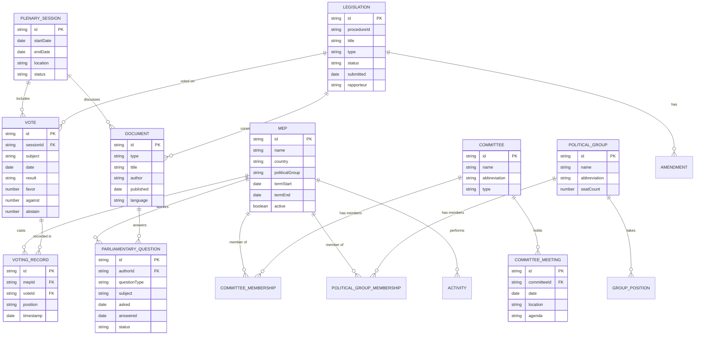
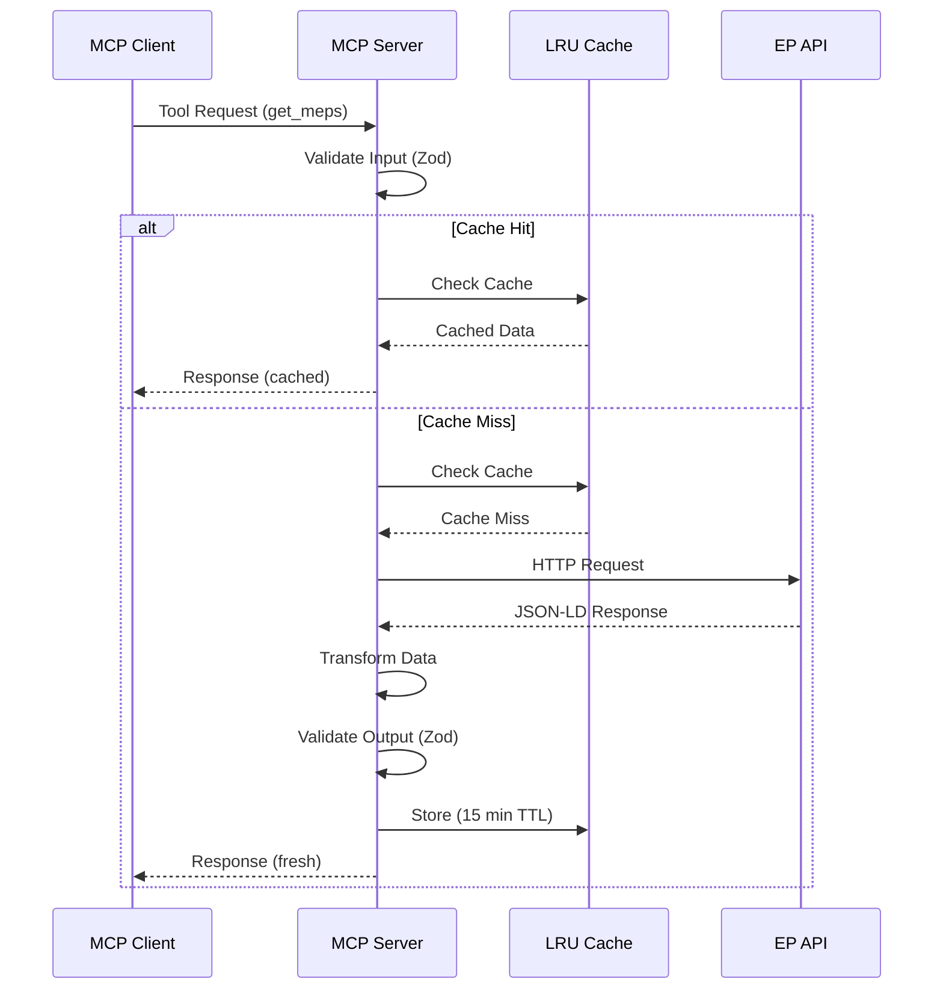
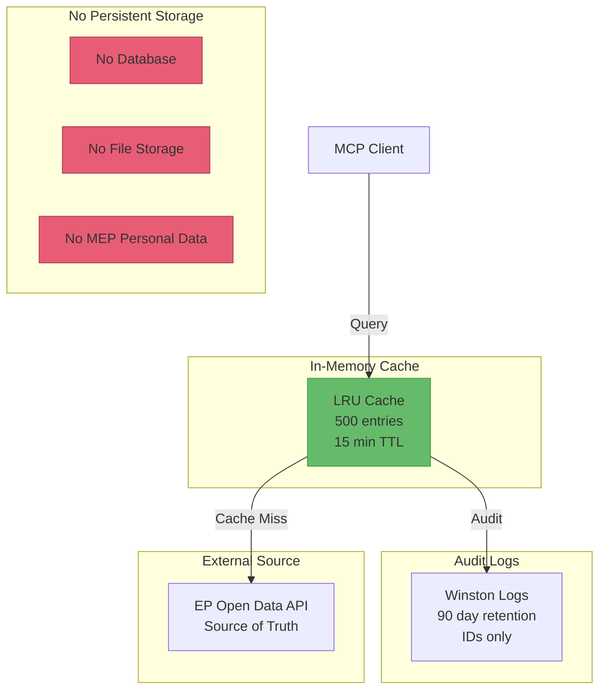

# Data Model

<p align="center">
  
</p>

<h1 align="center">📊 European Parliament MCP Server - Data Model</h1>

<p align="center">
  <strong>Data Structures, Entities, and Relationships</strong><br>
  <em>Comprehensive Data Architecture Documentation</em>
</p>

---

## 📋 Document Information

**Document Owner:** Architecture Team  
**Version:** 1.0  
**Last Updated:** 2026-02-17  
**Classification:** Public  
**Review Cycle:** Quarterly  
**Next Review:** 2026-05-17

---

## 🎯 Data Model Overview

The European Parliament MCP Server operates on **read-only public data** from the European Parliament Open Data Portal. The data model reflects the structure of European Parliament entities and their relationships.

**Key Characteristics**:
- 📖 Read-only (no data modification)
- 🌐 Public data (no sensitive information stored)
- ⚡ Cached responses (15-minute TTL)
- 🔄 Real-time EP API queries
- 📝 Audit trail for GDPR compliance

---

## 🏛️ Core Entities

### Entity Relationship Diagram



---

## 📦 Data Schemas

### 1. MEP (Member of European Parliament)

```typescript
interface MEP {
  id: string;                    // Unique identifier (e.g., "124936")
  name: string;                  // Full name
  country: string;               // ISO 3166-1 alpha-2 (e.g., "SE")
  politicalGroup: string;        // Political group abbreviation (e.g., "EPP")
  committees: Committee[];       // Committee memberships
  termStart: string;             // ISO 8601 date
  termEnd?: string;              // ISO 8601 date (optional, current MEPs)
  active: boolean;               // Currently serving
  contact?: ContactInfo;         // Contact details (optional)
}

interface ContactInfo {
  email?: string;
  phone?: string;
  office?: string;
}
```

**Validation**:
```typescript
const MEPSchema = z.object({
  id: z.string().min(1),
  name: z.string().min(1),
  country: z.string().regex(/^[A-Z]{2}$/),
  politicalGroup: z.string(),
  committees: z.array(CommitteeSchema),
  termStart: z.string().regex(/^\d{4}-\d{2}-\d{2}$/),
  termEnd: z.string().regex(/^\d{4}-\d{2}-\d{2}$/).optional(),
  active: z.boolean(),
  contact: ContactInfoSchema.optional()
});
```

---

### 2. Plenary Session

```typescript
interface PlenarySession {
  id: string;                    // Unique identifier
  startDate: string;             // ISO 8601 date
  endDate: string;               // ISO 8601 date
  location: string;              // "Strasbourg" or "Brussels"
  status: SessionStatus;         // Enum: planned | ongoing | completed
  votes: Vote[];                 // Votes held during session
  documents: Document[];         // Documents discussed
}

enum SessionStatus {
  PLANNED = 'planned',
  ONGOING = 'ongoing',
  COMPLETED = 'completed'
}
```

**Validation**:
```typescript
const PlenarySessionSchema = z.object({
  id: z.string().min(1),
  startDate: z.string().regex(/^\d{4}-\d{2}-\d{2}$/),
  endDate: z.string().regex(/^\d{4}-\d{2}-\d{2}$/),
  location: z.enum(['Strasbourg', 'Brussels', 'Unknown']),
  status: z.enum(['planned', 'ongoing', 'completed']),
  votes: z.array(VoteSchema),
  documents: z.array(DocumentSchema)
});
```

---

### 3. Vote

```typescript
interface Vote {
  id: string;                    // Unique identifier
  sessionId: string;             // Reference to plenary session
  subject: string;               // Vote subject/title
  date: string;                  // ISO 8601 date
  result: VoteResult;            // Enum: adopted | rejected | withdrawn
  favor: number;                 // Votes in favor
  against: number;               // Votes against
  abstain: number;               // Abstentions
  records: VotingRecord[];       // Individual MEP votes
}

enum VoteResult {
  ADOPTED = 'adopted',
  REJECTED = 'rejected',
  WITHDRAWN = 'withdrawn'
}
```

---

### 4. Voting Record

```typescript
interface VotingRecord {
  id: string;                    // Unique identifier
  mepId: string;                 // Reference to MEP
  voteId: string;                // Reference to Vote
  position: VotePosition;        // Enum: favor | against | abstain | absent
  timestamp: string;             // ISO 8601 timestamp
}

enum VotePosition {
  FAVOR = 'favor',
  AGAINST = 'against',
  ABSTAIN = 'abstain',
  ABSENT = 'absent'
}
```

---

### 5. Committee

```typescript
interface Committee {
  id: string;                    // Unique identifier
  name: string;                  // Full name
  abbreviation: string;          // Short code (e.g., "AGRI")
  type: CommitteeType;           // Enum: standing | special | subcommittee
  members: MEP[];                // Committee members
  meetings: CommitteeMeeting[];  // Scheduled meetings
}

enum CommitteeType {
  STANDING = 'standing',
  SPECIAL = 'special',
  SUBCOMMITTEE = 'subcommittee'
}
```

---

### 6. Legislative Procedure

```typescript
interface LegislativeProcedure {
  id: string;                    // Unique identifier
  procedureId: string;           // EP procedure reference (e.g., "2023/0123(COD)")
  title: string;                 // Procedure title
  type: ProcedureType;           // Enum: ordinary | consent | consultation
  status: ProcedureStatus;       // Current stage
  submitted: string;             // ISO 8601 date
  rapporteur: string;            // MEP ID
  committee: string;             // Committee ID
  stages: ProcedureStage[];      // Procedure history
  documents: Document[];         // Related documents
}

enum ProcedureType {
  ORDINARY = 'ordinary',         // Co-decision (COD)
  CONSENT = 'consent',           // CNS
  CONSULTATION = 'consultation'  // CON
}

enum ProcedureStatus {
  SUBMITTED = 'submitted',
  COMMITTEE_STAGE = 'committee_stage',
  FIRST_READING = 'first_reading',
  SECOND_READING = 'second_reading',
  THIRD_READING = 'third_reading',
  ADOPTED = 'adopted',
  REJECTED = 'rejected'
}

interface ProcedureStage {
  stage: string;
  date: string;
  outcome?: string;
}
```

---

### 7. Document

```typescript
interface Document {
  id: string;                    // Unique identifier
  type: DocumentType;            // Document category
  title: string;                 // Document title
  author: string;                // Author (MEP, Commission, Council)
  published: string;             // ISO 8601 date
  language: string;              // ISO 639-1 code (e.g., "en")
  topics: string[];              // Subject tags
  url?: string;                  // Link to document
}

enum DocumentType {
  REPORT = 'report',
  AMENDMENT = 'amendment',
  RESOLUTION = 'resolution',
  OPINION = 'opinion',
  MOTION = 'motion',
  QUESTION = 'question'
}
```

---

### 8. Parliamentary Question

```typescript
interface ParliamentaryQuestion {
  id: string;                    // Unique identifier
  authorId: string;              // MEP ID
  questionType: QuestionType;    // Question category
  subject: string;               // Question subject
  question: string;              // Question text
  asked: string;                 // ISO 8601 date
  answered?: string;             // ISO 8601 date (optional)
  answer?: string;               // Answer text (optional)
  status: QuestionStatus;        // Current status
}

enum QuestionType {
  ORAL = 'oral',
  WRITTEN = 'written',
  PRIORITY = 'priority',
  QUESTION_TIME = 'question_time'
}

enum QuestionStatus {
  SUBMITTED = 'submitted',
  PENDING = 'pending',
  ANSWERED = 'answered',
  WITHDRAWN = 'withdrawn'
}
```

---

## 🔄 Data Flow

### Data Acquisition Flow



---

## 💾 Data Storage

### Storage Architecture



**GDPR Compliance**:
- ✅ No persistent storage of personal data
- ✅ Cache TTL: 15 minutes (minimal retention)
- ✅ Audit logs: MEP IDs only (no names/emails)
- ✅ Right to erasure: Automatic via cache expiration
- ✅ Data minimization: Query only necessary fields

---

## 🔐 Data Classification

| Data Type | Classification | Sensitivity | Retention | Encryption |
|-----------|----------------|-------------|-----------|------------|
| MEP Personal Data | Public | Low | 15 min cache | In-transit (TLS) |
| Voting Records | Public | Low | 15 min cache | In-transit (TLS) |
| Legislative Documents | Public | Low | 15 min cache | In-transit (TLS) |
| Audit Logs (IDs) | Internal | Medium | 90 days | At-rest + TLS |
| Configuration | Internal | Medium | Permanent | Environment vars |
| API Keys (future) | Confidential | High | Rotated | Secrets Manager |

---

## 📋 API Response Formats

### Paginated Response

```typescript
interface PaginatedResponse<T> {
  data: T[];                     // Array of entities
  total: number;                 // Total count
  limit: number;                 // Page size
  offset: number;                // Current offset
}

// Example
const response: PaginatedResponse<MEP> = {
  data: [
    { id: "1", name: "Alice Smith", country: "SE", ... },
    { id: "2", name: "Bob Jones", country: "FR", ... }
  ],
  total: 705,
  limit: 50,
  offset: 0
};
```

### Single Entity Response

```typescript
interface SingleEntityResponse<T> {
  data: T;                       // Single entity
}

// Example
const response: SingleEntityResponse<MEP> = {
  data: { id: "124936", name: "Alice Smith", ... }
};
```

### Analysis Response

```typescript
interface AnalysisResponse {
  summary: Summary;              // Key metrics
  details: Detail[];             // Detailed breakdown
  metadata: Metadata;            // Analysis metadata
}

// Voting Pattern Analysis Example
interface VotingPatternAnalysis {
  summary: {
    totalVotes: number;
    favorPercentage: number;
    againstPercentage: number;
    abstainPercentage: number;
    alignmentWithGroup: number;
  };
  details: Array<{
    topic: string;
    voteCount: number;
    favorRate: number;
  }>;
  metadata: {
    mepId: string;
    dateFrom: string;
    dateTo: string;
    groupComparison: string;
  };
}
```

---

## 🗂️ Data Transformation

### EP API → Internal Model

The European Parliament API returns JSON-LD format which requires transformation:

```typescript
// EP API Response (JSON-LD)
const epApiResponse = {
  "@context": "http://data.europarl.europa.eu/",
  "identifier": "124936",
  "label": "Alice SMITH",
  "country": { "identifier": "SE" },
  "politicalGroup": { "label": "Group of the European People's Party" }
};

// Transform to Internal Model
function transformMEP(apiData: any): MEP {
  return {
    id: String(apiData.identifier),
    name: apiData.label,
    country: apiData.country?.identifier || 'Unknown',
    politicalGroup: extractGroupAbbreviation(apiData.politicalGroup?.label),
    committees: [],
    termStart: extractDate(apiData.mandate?.start) || 'Unknown',
    active: true
  };
}
```

---

## 🔗 Related Documentation

- [ARCHITECTURE.md](./ARCHITECTURE.md) - System architecture
- [SECURITY_ARCHITECTURE.md](./SECURITY_ARCHITECTURE.md) - Security design
- [API_USAGE_GUIDE.md](./API_USAGE_GUIDE.md) - API endpoints and examples
- [FUTURE_DATA_MODEL.md](./FUTURE_DATA_MODEL.md) - Future enhancements

---

<p align="center">
  <strong>Built with ❤️ by <a href="https://hack23.com">Hack23 AB</a></strong><br>
  <em>Data Model Documentation following ISMS standards</em>
</p>
