# 🇪🇺 European Parliament Political Landscape — Intelligence Dashboard

> **Comprehensive OSINT visualization of European Parliament activity, political composition, and derived intelligence metrics (2004–2025)**
>
> Data source: [European Parliament Open Data Portal](https://data.europarl.europa.eu/) · Methodology: [§ Methodology](#-methodology--data-sources) · Auto-refreshed weekly via [agentic workflow](/.github/workflows/refresh-stats.yml) · Powered by [`get_all_generated_stats`](./API_USAGE_GUIDE.md#tool-get_all_generated_stats)

---

## 📋 Table of Contents

- [Executive Summary](#-executive-summary)
- [Parliamentary Seat Composition](#-parliamentary-seat-composition-2004-2025)
- [Legislative Activity Trends](#-legislative-activity-trends)
- [Political Fragmentation Evolution](#-political-fragmentation--effective-parties)
- [Political Compass — 3-Axis Analysis](#-political-compass--3-axis-analysis)
- [Quadrant Distribution — The Political Square](#-quadrant-distribution--the-political-square)
- [Left-Right Bloc Analysis](#-left-right-bloc-analysis)
- [Coalition Dynamics & Power Thresholds](#-coalition-dynamics--power-thresholds)
- [Parliamentary Engagement Metrics](#-parliamentary-engagement-metrics)
- [Institutional Stability Indicators](#-institutional-stability)
- [OSINT Derived Intelligence Dashboard](#-osint-derived-intelligence-dashboard)
- [Predictions 2026–2030](#-predictions-20262030)
- [Methodology & Data Sources](#-methodology--data-sources)

---

## 🎯 Executive Summary

### Key Intelligence Findings (2004–2025)

| # | Finding | Implication |
|---|---------|-------------|
| 1 | **Fragmentation doubled** — Effective Number of Parties (ENP) rose from **4.12** (2004) to **6.50** (2025) | No single ideology dominates; coalition arithmetic increasingly complex |
| 2 | **Grand coalition impossible since 2019** — EPP+S&D fell below 50% majority threshold | Every legislative act now requires 3+ group coalitions |
| 3 | **Rightward shift in EP10** — combined right/far-right seat share rose to **~26%** with new PfE and ESN groups | Defence, migration, industrial policy priorities reshaping |
| 4 | **Legislative output peaks at end of term** — 148 acts in 2023 (EP9 record), drops 30–40% in election years | Predictable cycle exploitable for legislative monitoring |
| 5 | **Eurosceptic bloc tripled** — from ~5% (2004) to ~15%+ (2025) | Anti-EU positions now a structural feature, not fringe |
| 6 | **Authoritarian-right quadrant growing** — ECR + PfE + ESN now hold ~26% of seats | Libertarian-right (liberals) declining from 12% to 11% |
| 7 | **Oversight intensity increased** — parliamentary questions per MEP rose from ~5.8 to ~6.5 | MEPs increasingly using question mechanism for accountability |
| 8 | **COVID resilience** — 2020 dip was temporary; hybrid working maintained output above pre-Lisbon levels | Institutional adaptability proven |

### At a Glance — EP10 (2025)


---

## 🏛️ Parliamentary Seat Composition (2004–2025)

### Group Strength Over Time

```mermaid
---
config:
  xyChart:
    width: 900
    height: 400
---
xychart-beta
    title "EPP Seat Share % (2004–2025)"
    x-axis [2004, 2005, 2006, 2007, 2008, 2009, 2010, 2011, 2012, 2013, 2014, 2015, 2016, 2017, 2018, 2019, 2020, 2021, 2022, 2023, 2024, 2025]
    y-axis "Seat Share %" 20 --> 40
    line [36.6, 36.6, 36.1, 36.7, 36.7, 36.0, 36.0, 35.9, 35.8, 35.9, 29.4, 28.9, 28.8, 28.9, 29.0, 24.2, 26.5, 25.1, 25.1, 25.1, 26.1, 26.1]
```

```mermaid
---
config:
  xyChart:
    width: 900
    height: 400
---
xychart-beta
    title "S&D / PES Seat Share % (2004–2025)"
    x-axis [2004, 2005, 2006, 2007, 2008, 2009, 2010, 2011, 2012, 2013, 2014, 2015, 2016, 2017, 2018, 2019, 2020, 2021, 2022, 2023, 2024, 2025]
    y-axis "Seat Share %" 15 --> 30
    line [27.3, 27.3, 27.5, 27.4, 27.4, 25.0, 25.0, 25.1, 25.2, 25.3, 25.4, 25.3, 25.3, 25.2, 25.1, 20.5, 20.7, 19.9, 19.7, 19.6, 18.9, 18.9]
```

### EP10 Group Composition (2025) — Detailed

```mermaid
---
config:
  xyChart:
    width: 900
    height: 400
---
xychart-beta
    title "EP10 Group Sizes (2025) — Seats"
    x-axis ["EPP", "S&D", "PfE", "ECR", "RE", "Greens", "GUE/NGL", "ESN", "NI"]
    y-axis "Seats" 0 --> 200
    bar [188, 136, 86, 78, 77, 53, 46, 25, 31]
```

### Parliamentary Term Comparison

| Term | Period | MEPs | Groups | Largest Group | Largest % | Grand Coalition? | Fragmentation |
|------|--------|------|--------|---------------|-----------|------------------|---------------|
| **EP6** | 2004–2009 | 732→785 | 7–8 | EPP-ED | 36.6% | ✅ Yes | 4.12–4.22 |
| **EP7** | 2009–2014 | 736→766 | 7 | EPP | 36.0% | ✅ Yes | 4.48–4.53 |
| **EP8** | 2014–2019 | 751 | 8 | EPP | 29.0% | ✅ Yes | 5.28–5.52 |
| **EP9** | 2019–2024 | 705–751 | 7 | EPP | 24.2% | ❌ No | 6.01–6.40 |
| **EP10** | 2024–2029 | 720 | 8 | EPP | 26.1% | ❌ No | 6.50–6.51 |

---

## 📈 Legislative Activity Trends

### Legislative Acts Adopted Per Year

```mermaid
---
config:
  xyChart:
    width: 900
    height: 400
---
xychart-beta
    title "Legislative Acts Adopted (2004–2025)"
    x-axis [2004, 2005, 2006, 2007, 2008, 2009, 2010, 2011, 2012, 2013, 2014, 2015, 2016, 2017, 2018, 2019, 2020, 2021, 2022, 2023, 2024, 2025]
    y-axis "Acts Adopted" 50 --> 160
    line [68, 82, 95, 110, 125, 72, 88, 108, 118, 135, 78, 92, 115, 128, 142, 65, 85, 102, 120, 148, 72, 78]
```

> **Pattern**: Clear 5-year cycle. Output peaks at end of parliamentary term (2008, 2013, 2018, 2023), drops 30–40% in election-transition years (2009, 2014, 2019, 2024).

### Roll-Call Votes vs. Legislative Acts

```mermaid
---
config:
  xyChart:
    width: 900
    height: 400
---
xychart-beta
    title "Roll-Call Votes vs Legislative Acts (2004–2025)"
    x-axis [2004, 2005, 2006, 2007, 2008, 2009, 2010, 2011, 2012, 2013, 2014, 2015, 2016, 2017, 2018, 2019, 2020, 2021, 2022, 2023, 2024, 2025]
    y-axis "Count" 50 --> 700
    line [356, 412, 448, 520, 560, 380, 480, 550, 580, 620, 410, 510, 570, 600, 650, 350, 460, 530, 590, 660, 375, 420]
    line [68, 82, 95, 110, 125, 72, 88, 108, 118, 135, 78, 92, 115, 128, 142, 65, 85, 102, 120, 148, 72, 78]
```

> **Correlation**: r = 0.94 between roll-call votes and adopted acts — votes are a reliable leading indicator of legislative output.

### Parliamentary Questions — Oversight Intensity


### Speeches Per Year

```mermaid
---
config:
  xyChart:
    width: 900
    height: 400
---
xychart-beta
    title "Speeches Delivered (2004–2025)"
    x-axis [2004, 2005, 2006, 2007, 2008, 2009, 2010, 2011, 2012, 2013, 2014, 2015, 2016, 2017, 2018, 2019, 2020, 2021, 2022, 2023, 2024, 2025]
    y-axis "Speeches" 5000 --> 16000
    line [8500, 10200, 11500, 12800, 13500, 7200, 11000, 12500, 13000, 14200, 8000, 11800, 13200, 13800, 14800, 7000, 9800, 11500, 13500, 15200, 7800, 10500]
```

---

## 🔬 Political Fragmentation & Effective Parties

### Fragmentation Index (Laakso-Taagepera ENP) Over Time

```mermaid
---
config:
  xyChart:
    width: 900
    height: 400
---
xychart-beta
    title "Effective Number of Parties — ENP (2004–2025)"
    x-axis [2004, 2005, 2006, 2007, 2008, 2009, 2010, 2011, 2012, 2013, 2014, 2015, 2016, 2017, 2018, 2019, 2020, 2021, 2022, 2023, 2024, 2025]
    y-axis "ENP (Laakso-Taagepera)" 3.5 --> 7
    line [4.12, 4.12, 4.22, 4.18, 4.18, 4.48, 4.48, 4.52, 4.53, 4.51, 5.28, 5.48, 5.52, 5.49, 5.46, 6.40, 6.01, 6.23, 6.26, 6.32, 6.51, 6.50]
```

> **Regime shift in 2019**: ENP jumped from 5.46 to 6.40 — the EP transitioned from a two-party-dominated to a multi-party system. Grand coalitions (EPP+S&D > 50%) became structurally impossible.

### Fragmentation Regime Periods


---

## 🧭 Political Compass — 3-Axis Analysis

### Methodology

Groups are classified on three independent axes using the [Chapel Hill Expert Survey (CHES)](https://www.chesdata.eu/) methodology:

| Axis | Scale | Left / Low (0) | Right / High (10) |
|------|-------|-----------------|-------------------|
| **Economic** | 0–10 | Far-left (interventionist) | Far-right (free-market) |
| **Social / Authority** | 0–10 | Libertarian (civil liberties) | Authoritarian (state control) |
| **EU Integration** | 0–10 | Hard eurosceptic (sovereignty) | Federalist (integration) |

### Group Positions on the Political Compass

```mermaid
quadrantChart
    title Political Compass — EP Groups (Economic × Social)
    x-axis "Economic Left" --> "Economic Right"
    y-axis "Libertarian" --> "Authoritarian"
    quadrant-1 "Authoritarian Right"
    quadrant-2 "Authoritarian Left"
    quadrant-3 "Libertarian Left"
    quadrant-4 "Libertarian Right"
    "GUE/NGL (1.5, 3.0)": [0.15, 0.30]
    "Greens/EFA (3.0, 2.0)": [0.30, 0.20]
    "S&D (3.5, 4.0)": [0.35, 0.40]
    "ALDE/RE (6.0, 3.0)": [0.60, 0.30]
    "EPP (6.5, 5.5)": [0.65, 0.55]
    "ECR (7.5, 7.0)": [0.75, 0.70]
    "ID/PfE (5.5, 8.0)": [0.55, 0.80]
    "ESN (5.0, 9.0)": [0.50, 0.90]
```

### 3-Axis Group Positions — Reference Table

| Group | Economic (0–10) | Social (0–10) | EU Integration (0–10) | Quadrant | Description |
|-------|-----------------|---------------|----------------------|----------|-------------|
| **GUE/NGL / The Left** | 1.5 | 3.0 | 4.0 | Lib-Left | Radical left — anti-capitalist, civil liberties, EU-critical |
| **Greens/EFA** | 3.0 | 2.0 | 8.0 | Lib-Left | Green politics — most libertarian, strongly pro-EU |
| **PES / S&D** | 3.5 | 4.0 | 7.5 | Lib-Left | Social democrats — centre-left, moderate, pro-EU |
| **ALDE / RE** | 6.0 | 3.0 | 8.5 | Lib-Right | Liberals — centre economics, libertarian, strongly pro-EU |
| **EPP / EPP-ED** | 6.5 | 5.5 | 7.5 | Auth-Right | Christian democrats — centre-right, moderate auth, pro-EU |
| **ECR** | 7.5 | 7.0 | 3.5 | Auth-Right | Conservatives — right economics, socially conservative, EU-reform |
| **UEN** | 7.0 | 7.5 | 3.0 | Auth-Right | National conservatives — right, traditional values |
| **IND/DEM / EFD / EFDD** | 6.5–7.0 | 7.0 | 1.5 | Auth-Right | Eurosceptic populist — mixed economics, authoritarian, anti-EU |
| **ENF / ID / PfE** | 5.5 | 8.0 | 1.0 | Auth-Right | National-populist — protectionist, authoritarian, anti-EU |
| **ESN** | 5.0 | 9.0 | 0.5 | Auth-Right | Sovereigntist far-right — most authoritarian, hardest eurosceptic |

### EU Integration Axis


---

## ⬜ Quadrant Distribution — The Political Square

> **The "Political Compass" / Nolan Chart applied to the European Parliament**
>
> ```
>                LIBERTARIAN (Social 0–5)
>            ┌──────────┬──────────┐
>            │ Lib-Left │ Lib-Right│
>   ECON     │ Greens,  │ ALDE/RE  │  ECON
>   LEFT     │ GUE/NGL, │          │  RIGHT
>  (0–5)     │ S&D      │          │  (5–10)
>            ├──────────┼──────────┤
>            │Auth-Left │Auth-Right│
>            │ (none)   │ EPP, ECR │
>            │          │ PfE, ESN │
>            └──────────┴──────────┘
>               AUTHORITARIAN (Social 5–10)
> ```

### Quadrant Seat Shares (2025)

```mermaid
pie title Quadrant Distribution — EP10 (2025)
    "Libertarian-Left (Greens, S&D, GUE/NGL)" : 32.6
    "Libertarian-Right (RE/ALDE)" : 10.7
    "Authoritarian-Left" : 0
    "Authoritarian-Right (EPP, ECR, PfE, ESN)" : 52.4
    "Non-Attached" : 4.3
```

### Quadrant Evolution Across Terms

| Term | Lib-Left | Lib-Right | Auth-Left | Auth-Right | Dominant |
|------|----------|-----------|-----------|------------|----------|
| **EP6** (2004) | 38.6% | 12.0% | 0% | 45.4% | Auth-Right |
| **EP7** (2009) | 37.3% | 11.4% | 0% | 47.6% | Auth-Right |
| **EP8** (2014) | 38.7% | 8.9% | 0% | 45.5% | Auth-Right |
| **EP9** (2019) | 34.9% | 14.4% | 0% | 43.1% | Auth-Right |
| **EP10** (2025) | 32.6% | 10.7% | 0% | 52.4% | Auth-Right |

> **Trend**: Authoritarian-right quadrant has grown from ~45% to 52%, while libertarian-left declined from ~39% to 33%. The libertarian-right (liberals) peaked at 14.4% in 2019 but fell back to 10.7%.

---

## ⚖️ Left-Right Bloc Analysis

### Traditional 1D Bloc Share Trends

```mermaid
---
config:
  xyChart:
    width: 900
    height: 400
---
xychart-beta
    title "Left vs Right Bloc Seat Share % (2004–2025)"
    x-axis [2004, 2009, 2014, 2019, 2024, 2025]
    y-axis "Seat Share %" 0 --> 60
    line [38.6, 37.3, 38.7, 34.9, 32.7, 32.6]
    line [45.4, 47.6, 45.5, 42.2, 48.6, 52.4]
    line [12.0, 11.4, 8.9, 14.4, 10.7, 10.7]
```

> Legend: Line 1 = Left Bloc, Line 2 = Right Bloc, Line 3 = Centre (Liberals)

### Bipolar Index Evolution

The bipolar index measures rightward vs leftward tilt: `(right - left) / (right + left)`. Range: -1 (fully left) to +1 (fully right).

| Year | Left Bloc | Right Bloc | Centre | Bipolar Index | Interpretation |
|------|-----------|------------|--------|---------------|----------------|
| 2004 | 38.6% | 45.4% | 12.0% | +0.08 | Slight right lean |
| 2009 | 37.3% | 47.6% | 11.4% | +0.12 | Moderate right lean |
| 2014 | 38.7% | 45.5% | 8.9% | +0.08 | Slight right lean |
| 2019 | 34.9% | 42.2% | 14.4% | +0.09 | Slight right lean |
| 2025 | 32.6% | 52.4% | 10.7% | +0.23 | **Strong right lean** |

> **EP10 marks the strongest rightward shift** in 20 years — the bipolar index nearly tripled from +0.08 to +0.23.

### Eurosceptic Share Growth

```mermaid
---
config:
  xyChart:
    width: 900
    height: 300
---
xychart-beta
    title "Eurosceptic Bloc Seat Share % (2004–2025)"
    x-axis [2004, 2006, 2009, 2014, 2015, 2019, 2024, 2025]
    y-axis "Share %" 0 --> 20
    line [5.1, 3.3, 4.3, 6.4, 11.2, 9.7, 15.2, 15.4]
```

> **Structural change**: From a fringe ~5% in 2004 to a major bloc at ~15% in EP10, eurosceptic parties are now too large to ignore in coalition arithmetic.

---

## 🤝 Coalition Dynamics & Power Thresholds

### Grand Coalition Viability (EPP + S&D Combined %)


> **Regime change in 2019**: The EPP+S&D "grand coalition" dropped below 50% for the first time, requiring at least 3 groups for any majority.

### Minimum Winning Coalition (MWC) Size

| Period | MWC Size | Coalition Formula |
|--------|----------|-------------------|
| EP6 (2004–2009) | **2 groups** | EPP-ED + PES > 50% |
| EP7 (2009–2014) | **2 groups** | EPP + S&D > 50% |
| EP8 (2014–2019) | **2 groups** | EPP + S&D > 50% (barely) |
| EP9 (2019–2024) | **3 groups** | EPP + S&D + RE needed |
| EP10 (2025) | **3+ groups** | EPP + S&D + RE or EPP + ECR + RE needed |

### Coalition Scenarios — EP10 (2025)

```mermaid
block-beta
    columns 3
    block:GrandCoalition
        columns 1
        A["🔵 EPP 26.1%"]
        B["🔴 S&D 18.9%"]
        C["🟡 RE 10.7%"]
    end
    block:CentreRight
        columns 1
        D["🔵 EPP 26.1%"]
        E["🟠 ECR 10.8%"]
        F["🟡 RE 10.7%"]
    end
    block:RightWing
        columns 1
        G["🔵 EPP 26.1%"]
        H["🟠 ECR 10.8%"]
        I["🟤 PfE 11.9%"]
    end
```

| Coalition | Composition | Combined % | Viable? |
|-----------|-------------|-----------|---------|
| Grand Coalition + Liberals | EPP + S&D + RE | 55.7% | ✅ Comfortable |
| Centre-Right | EPP + ECR + RE | 47.6% | ⚠️ Needs 4th partner |
| Right Bloc | EPP + ECR + PfE | 48.8% | ⚠️ Needs 4th partner |
| Progressive | S&D + RE + Greens + GUE/NGL | 43.4% | ❌ No majority |
| Grand Coalition (2-party) | EPP + S&D | 45.0% | ❌ Below 50% |

---

## 📊 Parliamentary Engagement Metrics

### Committee Meetings Trend

```mermaid
---
config:
  xyChart:
    width: 900
    height: 350
---
xychart-beta
    title "Committee Meetings Per Year (2004–2025)"
    x-axis [2004, 2005, 2006, 2007, 2008, 2009, 2010, 2011, 2012, 2013, 2014, 2015, 2016, 2017, 2018, 2019, 2020, 2021, 2022, 2023, 2024, 2025]
    y-axis "Meetings" 1500 --> 2600
    line [1820, 2050, 2120, 2280, 2350, 1650, 2100, 2320, 2380, 2500, 1780, 2150, 2340, 2420, 2550, 1580, 1950, 2180, 2380, 2520, 1680, 1980]
```

### Documents Produced Per Year


---

## 🏗️ Institutional Stability

### MEP Turnover Rate


### Institutional Memory Risk Classification

| Risk Level | Threshold | Years |
|------------|-----------|-------|
| 🔴 **HIGH** | Turnover > 40% | 2004, 2009, 2014, 2019, 2024 (all election years) |
| 🟡 **MEDIUM** | Turnover 20–40% | 2007 (Bulgaria/Romania accession), 2020 (Brexit adjustments) |
| 🟢 **LOW** | Turnover < 20% | All other years |

---

## 🕵️ OSINT Derived Intelligence Dashboard

### Legislative Efficiency Metrics (2025)

| Metric | Value | Description |
|--------|-------|-------------|
| **Output per Session** | 1.70 acts/session | Legislative acts adopted ÷ plenary sessions |
| **Output per MEP** | 0.108 acts/MEP | Per-capita legislative productivity |
| **Vote Yield** | 18.6% | % of roll-call votes producing legislation |
| **Procedure Completion** | 26.4% | % of procedures resulting in adopted legislation |
| **Document Burden** | 42.1 docs/act | Documents per legislative act — bureaucratic overhead |
| **Resolution-to-Legislation** | 1.73 | Non-binding resolutions per binding legislative act |

### Parliamentary Engagement Metrics (2025)

| Metric | Value | Description |
|--------|-------|-------------|
| **Oversight Intensity** | 6.46 questions/MEP | Parliamentary questions per MEP |
| **Speech Rate** | 14.6 speeches/MEP | Speeches delivered per MEP |
| **Debate Intensity** | 228.3 speeches/session | Speeches per plenary session |
| **Oversight per Session** | 101.1 questions/session | Questions per plenary session |

### Political Concentration Metrics (2025)

| Metric | Value | Description |
|--------|-------|-------------|
| **CR₂** (Top-2 Concentration) | 45.0% | EPP + S&D combined share |
| **CR₃** (Top-3 Concentration) | 56.9% | EPP + S&D + PfE combined share |
| **HHI** (Herfindahl-Hirschman) | 0.153 | Market concentration index (lower = more fragmented) |
| **Dominance Ratio** | 1.38 | Largest/second-largest group ratio |
| **Majority Gap** | 23.9 pp | Points largest group is from 50% |
| **MWC Size** | 3 groups | Minimum groups for majority |
| **Non-Attached** | 4.3% | Politically unaffiliated MEPs |
| **Effective Opposition** | 5.50 | ENP minus 1 — effective opposition parties |

### Composite Intelligence Indices (2025)

| Index | Value | Interpretation |
|-------|-------|----------------|
| **Oversight-to-Legislation Balance** | 59.6 | Questions per legislative act — higher = more scrutiny |
| **Speech-to-Vote Ratio** | 25.0 | Speeches per roll-call vote — deliberation depth |
| **Committee-to-Plenary Ratio** | 43.0 | Committee meetings per plenary session — preparatory work intensity |

---

## 🔮 Predictions 2026–2030

```mermaid
---
config:
  xyChart:
    width: 900
    height: 400
---
xychart-beta
    title "Legislative Acts — Actual (2020–2025) + Predicted (2026–2030)"
    x-axis [2020, 2021, 2022, 2023, 2024, 2025, 2026, 2027, 2028, 2029, 2030]
    y-axis "Acts" 50 --> 160
    line [85, 102, 120, 148, 72, 78, 86, 94, 98, 63, 75]
```

### Prediction Summary (based on 2021–2025 average with term cycle factors)

| Year | Factor | Sessions | Acts | Votes | Questions | Speeches | Confidence |
|------|--------|----------|------|-------|-----------|----------|------------|
| **2026** | ×1.10 (2nd year) | 51 | 86 | 462 | 5,136 | 11,909 | ±12% |
| **2027** | ×1.20 (3rd year) | 56 | 94 | 504 | 5,598 | 12,963 | ±15% |
| **2028** | ×1.25 (peak year) | 58 | 98 | 525 | 5,830 | 13,506 | ±18% |
| **2029** | ×0.80 (election year) | 37 | 63 | 336 | 3,728 | 8,644 | ±22% |
| **2030** | ×0.95 (new term start) | 44 | 75 | 399 | 4,431 | 10,288 | ±25% |

> **Methodology**: 5-year rolling average × parliamentary term cycle factor. Election years (2029) see 20% reduction; peak years (3rd–4th year) see 20–25% increase. Confidence intervals widen with forecast horizon.

---

## 📐 Methodology & Data Sources

### Data Sources

| Source | Coverage | Update Frequency |
|--------|----------|-----------------|
| [European Parliament Open Data Portal](https://data.europarl.europa.eu/) | 2004–present | Real-time |
| [EP Legislative Observatory](https://oeil.secure.europarl.europa.eu/) | Procedures & acts | Real-time |
| [Chapel Hill Expert Survey (CHES)](https://www.chesdata.eu/) | Political positions | Per-election |
| [ParlTrack](https://parltrack.org/) | MEP activities | Daily |

### Statistical Methods

| Method | Application | Formula |
|--------|-------------|---------|
| **Laakso-Taagepera Index** | Effective Number of Parties (ENP) | ENP = 1 / Σ(pᵢ²) where pᵢ = seatShare/100 |
| **Herfindahl-Hirschman Index** | Market concentration | HHI = Σ(sᵢ²) where sᵢ = seatShare/100 |
| **Bipolar Index** | Left-right tilt | (rightShare − leftShare) / (rightShare + leftShare) |
| **CR₂ / CR₃** | Concentration ratios | Sum of top-2 / top-3 group shares |
| **Dominance Ratio** | Group power asymmetry | Largest group share / 2nd largest share |
| **MWC** | Minimum Winning Coalition | Fewest groups cumulatively exceeding 50% |
| **CHES 3-Axis Compass** | Political positioning | Economic (0–10) × Social (0–10) × EU Integration (0–10) |
| **Term Cycle Prediction** | Forecast 2026–2030 | 5-year average × cycle factor (±12–25% CI) |

### Political Compass Methodology

The three-axis classification uses **Chapel Hill Expert Survey (CHES)** positioning:

- **Economic axis** (0 = interventionist, 10 = free-market): Based on party economic policy positions
- **Social/authority axis** (0 = libertarian, 10 = authoritarian): Based on civil liberties vs. state control positions
- **EU integration axis** (0 = hard eurosceptic, 10 = federalist): Based on party EU integration positions

Groups are classified using weighted expert assessments adjusted for EP voting behaviour. The quadrant classification (Libertarian-Left, Libertarian-Right, Authoritarian-Left, Authoritarian-Right) uses the midpoint (5.0) on both economic and social axes as the dividing line.

### Data Integrity

- **Seat shares** are computed as `seats / totalSeats` (not from MEP counts)
- **Fragmentation index** matches Laakso-Taagepera formula: `1 / Σ(pᵢ²)`
- **All metrics** are deterministic — no network calls, computed from static validated data
- **Weekly validation** against live EP API via [agentic workflow](/.github/workflows/refresh-stats.yml)

### Version History

| Version | Date | Changes |
|---------|------|---------|
| 1.0.0 | 2025-02 | Initial dataset with 13 activity metrics + political landscape |
| 1.1.0 | 2025-03 | Added 30 OSINT-derived intelligence metrics |
| 1.2.0 | 2025-03 | Added 3-axis political compass (CHES-based) |
| 1.3.0 | 2025-03 | Added quadrant distribution analysis |

---

## 🔗 Related Documentation

- **[API Usage Guide](./API_USAGE_GUIDE.md)** — Full tool reference including `get_all_generated_stats`
- **[Architecture](./ARCHITECTURE.md)** — System design and data flow
- **[Data Model](./DATA_MODEL.md)** — Data structures and schema definitions
- **[README](./README.md)** — Project overview and quick start
- **[Security Architecture](./SECURITY_ARCHITECTURE.md)** — ISMS compliance and GDPR handling

---

<p align="center">
  <em>Generated from <code>src/data/generatedStats.ts</code> · Data: European Parliament Open Data Portal · CHES methodology</em><br/>
  <em>Part of the <a href="https://hack23.com">Hack23</a> open-source intelligence ecosystem</em>
</p>
